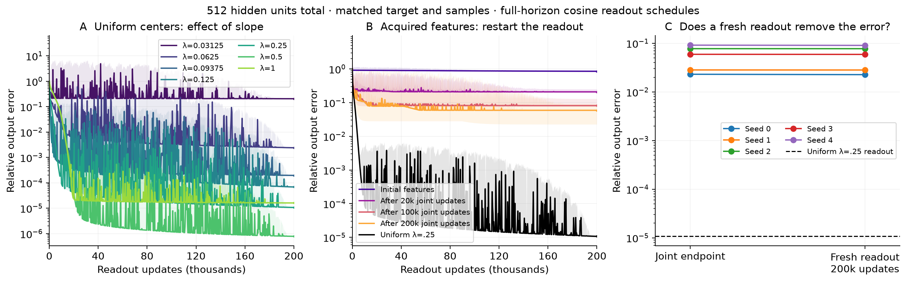
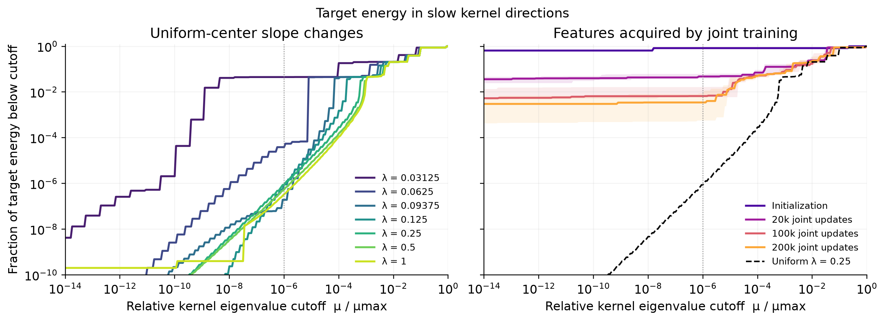

# Width-512 Adam: what did joint training acquire?

**Joint training acquired useful features, but they still supported much worse readout accuracy than the uniform-center controls within the tested budget.** Resetting and retraining the final readouts barely changed the joint-training errors. Every new network has exactly **512 hidden units**, counting its halo features; every cosine schedule spans all 200,000 updates. These are executed training results, not schematic or spectral forecasts.

Here *relative error* means $\|f-y\|_2/\|y\|_2$; a value of $0.01$ is 1%. A *dictionary* is the frozen set of hidden features. Its common slope is $\gamma$, and $\lambda=\gamma h$ uses the construction's grid spacing $h$. For learned, nonuniform slopes, RMS bandwidth means $h\sqrt{\operatorname{mean}(a_j^2)}$.

<figure>
  
  <figcaption><b>A:</b> Uniform-center dictionaries, each with one learning rate selected by final validation error. <b>B:</b> Restarted readouts from initial and trained features: median over all five seeds, with their range shaded, and the uniform λ=0.25 reference. <b>C:</b> Each joint endpoint versus a new readout trained for 200k updates on its final frozen features. All frozen curves use full-horizon cosine; shading preserves within-bin extrema. Vertical axes show training-grid relative output error. Joint recipes are selected separately, from both schedules.</figcaption>
</figure>

## What changed with learning

Under identical readout assays, median independent-grid error falls from **85.0%** on initial features to **20.8%, 8.12%, and 5.90%** on features acquired after 20k, 100k, and 200k joint updates. All five seeds improve. The final learned dictionaries yield errors from **2.26% to 9.05%** after restarting the readout. Their original joint errors were **2.31% to 9.15%**: a fresh readout does not remove most of the remaining error.

The same assay reaches **$1.08\times10^{-5}$ relative error** at uniform $\lambda=0.25$, and **$8.11\times10^{-7}$** at $\lambda=0.5$. Larger slope is not uniformly better: $\lambda=1$ is worse than $0.5$. At $\lambda=0.09375$, the selected error is $1.97\times10^{-4}$, about 18 times the $\lambda=0.25$ result. With a shared initial learning rate of $0.002$, however, those two errors are nearly tied. **The earlier apparent preference for bandwidth near 0.1 was not evidence of an optimizer-independent optimum.**

This isolates a limitation of the learned features **under the readout budget and optimizer recipes tested**. It does not establish an irreducible approximation floor: the remaining target components could require longer optimization or much larger readout coefficients. The uniform-versus-learned comparison changes both centers and individual slopes; only the uniform sweep isolates the common slope. RMS slope alone does not explain the entire gap.

## The kernel diagnostic agrees with partial acquisition

<figure>
  
  <figcaption>For K=ΦΦᵀ/m, the curve reports target energy in directions with eigenvalue ratio μᵢ/μmax below the horizontal-axis cutoff. Lower curves mean less target energy in those slow directions. Learned-feature curves show the median and range over five seeds. The dotted line marks a cutoff of 10⁻⁶. Both axes are logarithmic.</figcaption>
</figure>

At the displayed $10^{-6}$ cutoff, median slow-direction target energy falls from **83.28% to 0.3506%** between initialization and the final learned dictionaries. The uniform $\lambda=0.25$ dictionary leaves **$8.67\times10^{-7}$ of total target energy** below that cutoff. Thus feature learning substantially changes the target's access to the kernel directions, while the uniform reference provides much better access. These normalized eigenvalues control stable GD rates. The Adam curves supply separate empirical evidence; this diagnostic is not an Adam rate theorem.

The target is inherited unchanged from the joint-training experiment:

$$
y(x)=\frac{\sin(2\pi x)+0.5\sin(6\pi x)+0.25\sin(14\pi x)}{0.8100925873009825}.
$$

Its three harmonic energy fractions are $16/21$, $4/21$, and $1/21$. The [harmonic diagnostic](../output/diagnostics/adam_feature_access_w512/residual_harmonic_diagnostics.png) measures all three residual projections and the orthogonal remainder, whose energies sum to total squared relative error. About **91% of mean final squared error** for the learned-feature assays lies orthogonal to those three sine vectors: matching only their coefficients would overstate output accuracy. No new target was selected to manufacture a slope ordering.

## Protocol and limits

The width budget is allocated first: **468 interval centers + 22 left halo + 22 right halo = 512**. This inverts the existing square-root halo rule, giving 467 intervals and $h=2/467$. All uniform slope cases use the same centers. This study replaces the mismatched width-177/559 comparison with fresh matched data; it is not a one-variable rerun of the old figure.

Every case uses full-batch FP64 Adam on half-MSE, 2048 midpoint training samples, $(\beta_1,\beta_2,\epsilon)=(0.9,0.999,10^{-8})$, and 200k updates. Joint training has five paired seeds, three initial rates, and constant/cosine schedules. Each of 27 frozen dictionaries receives six rates under both schedules, with zero readout and optimizer state. One recipe per seed or dictionary is selected by **final** error on 4096 validation midpoints; no checkpoint or pointwise curve selection is used. Reported numerical endpoints use 8192 independent midpoints as a resolution check. Earlier snapshots of a selected joint recipe are selected retrospectively.

All selected joint recipes use $0.02$, the largest joint rate tested. Some readout choices also lie on search boundaries. These are equally budgeted readout comparisons within a declared grid, not globally optimized Adam results. Learned features additionally cost joint training and its separate hyperparameter search. Aggressive recipes can have poor intermediate errors despite a good endpoint; the raw spikes remain visible. The [joint loss and slope curves](../output/diagnostics/adam_feature_access_w512/joint_loss_and_scale.png) and [shared-rate versus selected-rate comparisons](../output/diagnostics/adam_feature_access_w512/uniform_schedule_comparison.png) expose these differences.

Full setup and selection rules are in the [protocol](adam_feature_probe_protocol.md). [Readout results](../output/diagnostics/adam_feature_access_w512/readout_summary.json), [joint results](../output/diagnostics/adam_feature_access_w512/joint_summary.json), and [kernel results](../output/diagnostics/adam_feature_access_w512/spectrum_summary.json) retain every case.

## Reproduction and checks

The runners, preparation, collection, and analysis live in `experiments/expD36_frozen_gamma_probe/adam_*probe*.py`. Training implementation commit: `5011051`; schedule and width regression tests: `4ae6e01`. Raw arrays are archived locally under `results/checkpoint_D_optimizers/expD36_frozen_gamma_probe/adam_feature_access_w512_20260923/` and on Runpod under `/workspace/junmiaoh/experiments/precision-mlps/runs/adam_feature_access_w512_20260923/`. The compact [manifest](../output/diagnostics/adam_feature_access_w512/manifest.json) records all 27 geometries and source hashes.

Slurm jobs 1373/1374 were discarded timing runs; jobs 1375, 1376, and 1381 completed production with exit code zero. Total allocated time, including timing runs and launch overhead, was **201 GPU-seconds (0.056 GPU-hours)**, with at most two GPUs at once.

Eight focused regression tests pass, covering total-width accounting, independent NumPy/autodiff references, schedule clocks at updates 0, 50k, 100k, and 199,999, case-preserving merges, and a known kernel spectrum. Saved joint predictions agree with executed errors within $9.8\times10^{-17}$; all frozen endpoints agree within $1.7\times10^{-15}$. Harmonic energy closure and direct-versus-spectral kernel quadratic forms also pass. A broader non-slow repository test run encountered an unrelated, untouched construction test failure (`constructions/test_tensor_qi_2d.py::test_accuracy_both_precisions[product_sines]`, mpmath error $6.73\times10^{-11}$ versus $10^{-11}$ required); that broad run was interrupted after 114 seconds. No claim is made that the entire repository suite passes.
