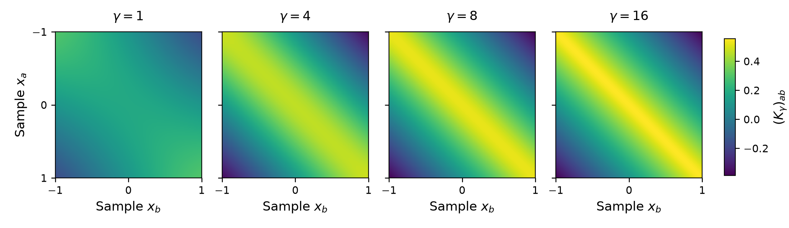
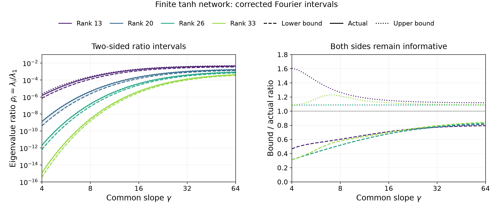
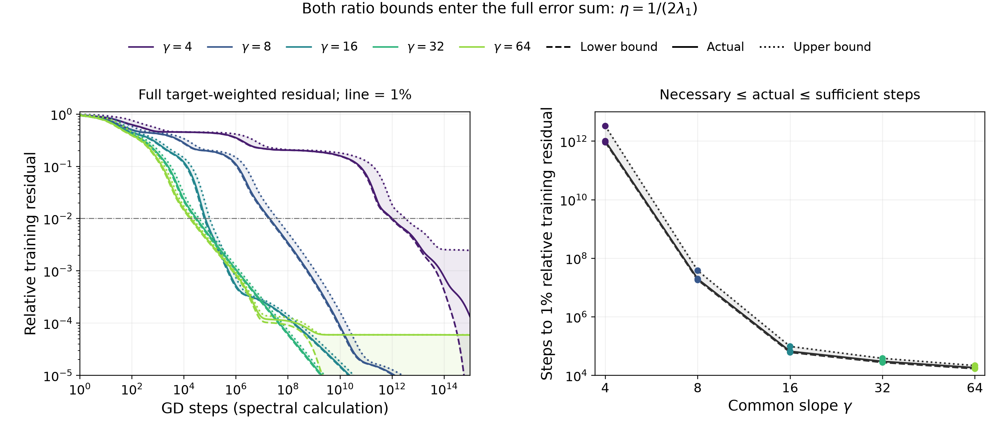

# Small slopes delay readout gradient descent

*Compact argument · 23 September 2026*

Small slopes can make readout gradient descent impractically slow even when an accurate fit exists. We show this by bounding the steps required to reach a prescribed error. Freeze uniformly spaced centers \(c_j\) and slope \(\gamma\). On \(m\) samples, the feature matrix has entries \((B_\gamma)_{aj}=\tanh(\gamma(x_a-c_j))/\sqrt m\), plus a bias column \(1/\sqrt m\). With \(y_a=f(x_a)/\sqrt m\), the loss is \(L(v)=\tfrac12\|B_\gamma v-y\|^2\). Choose \(\eta_\gamma=1/[2\lambda_1(K_\gamma)]\), where \(K_\gamma=B_\gamma B_\gamma^\top\) has eigenvalues \(\lambda_1\ge\cdots\ge\lambda_m\). Gradient descent from \(v_0=0\), with \(r_n=B_\gamma v_n-y\), gives

\[
v_{n+1}=v_n-\eta_\gamma B_\gamma^\top r_n
\quad\Longrightarrow\quad
r_{n+1}=(I-\eta_\gamma K_\gamma)r_n,\qquad r_0=-y.
\tag{1}
\]

Taking \(n\) iterations and diagonalizing the repeated matrix \(I-\eta_\gamma K_\gamma\), with orthonormal eigenvectors \(u_i\) and ratios \(\rho_i=\lambda_i/\lambda_1\), gives the relative squared error

\[
E_\gamma(n)^2:=\frac{\|r_n\|^2}{\|y\|^2}
=\sum_{i=1}^{m}p_i(1-\rho_i/2)^{2n},
\qquad p_i:=\frac{|u_i^\top y|^2}{\|y\|^2}.
\tag{2}
\]

Residual components with \(\rho_i>0\) decay exponentially in \(n\), at rates controlled by \(\rho_i\). Thus, upper bounds \(\rho_i\le\rho_i^+(\gamma)\) that remain extremely small in directions needed to reach the prescribed error establish an impractically large minimum step count when gamma is small.

We show this bound by first viewing \((K_\gamma)_{ab}=\langle(B_\gamma)_{a:},(B_\gamma)_{b:}\rangle\) as the inner product of rows \(a\) and \(b\) of \(B_\gamma\). Define \(H_\gamma\in\mathbb R^{m\times m}\) as its centered continuous inner-product analogue, with center density \(1/h\), where \(h\) is the center spacing. Centering across samples cancels the constant tails and makes the integral finite:

\[
\begin{aligned}
\widetilde t_{\gamma,a}(c)&=\tanh(\gamma(x_a-c))-\frac1m\sum_{\ell=1}^m\tanh(\gamma(x_\ell-c)),\\
(H_\gamma)_{ab}&=\frac1{hm}\int_{\mathbb R}\widetilde t_{\gamma,a}(c)\widetilde t_{\gamma,b}(c)\,dc.
\end{aligned}
\]

For its \(i\)th unit eigenvector \(u\perp\mathbf1\), multiplying on the left by \(u^\top\) and on the right by \(u\) gives (derivation in Appendix C)

\[
\lambda_i(H_\gamma)=u^\top H_\gamma u
=\frac2{\pi hm}\int_{\mathbb R}\frac{M_\gamma(\omega)^2}{\omega^2}
\left|\sum_a u_a e^{-i\omega x_a}\right|^2d\omega.
\tag{3}
\]

The multiplier \(M_\gamma(\omega)=z/\sinh z\), \(z=\pi|\omega|/(2\gamma)\), with \(M_\gamma(0)=1\), supplies all gamma dependence of \(H_\gamma\). Low frequencies are nearly preserved; frequencies much larger than gamma are exponentially suppressed. Increasing gamma increases this integral for every fixed zero-sum vector, hence makes all ordered eigenvalues of \(H_\gamma\) nondecreasing (Appendix C).

Normalization cannot remove arbitrarily small eigenvalues: the constant direction gives \(\lambda_1(K_\gamma)\ge\|B_\gamma^\top\mathbf1/\sqrt m\|^2\ge1\). The bias contributes one; squared neuron means add to it. We use this lower bound, not an assumption that \(\lambda_1\) is constant (Appendix E).

**Theorem 1 (finite ratios and training delay).** For consecutive lattice centers and \(\gamma>0\), Appendix E constructs \(\rho_i^-\le\rho_i\le\rho_i^+\) in \([0,1]\) by computing the corrected integral spectrum and bounding the remaining lattice and halo terms. For gradient descent in (1),

\[
\underbrace{\sum_i p_i(1-\rho_i^+/2)^{2n}}_{\text{error that must remain}}
\ \le\ E_\gamma(n)^2\ \le\
\underbrace{\sum_i p_i(1-\rho_i^-/2)^{2n}}_{\text{error that can remain}}.
\tag{4}
\]

The first crossings of \(\epsilon^2\) give necessary and sufficient step counts; a missing crossing is \(+\infty\). The figure evaluates this training-time interval.

*Figure 1. \(h=1/64\), 153 tanh centers including halo, 263 samples; \(f(x)=\sin(2\pi x)+\tfrac12\sin(6\pi x)+\tfrac14\sin(10\pi x)\). Left: finite ratios and bounds. Right: steps to 1% relative error, using actual target projections. At gamma 4, a readout attains \(5.85\times10^{-4}\), yet the evaluated necessary count is \(9.20\times10^{11}\). At gamma 64, the sufficient count is 21,611. Checked, uncertified spectral calculations; no long training runs (Appendix G).*

## Appendix A. Expanded construction and the error bound

This appendix retains the full derivation behind the compact argument. The main text defines \(H_\gamma\) as an \(m\times m\) continuous Gram matrix of features centered across the samples. It annihilates \(\mathbf1\). Below, \(Q\) is an orthonormal basis for \(\mathbf1^\perp\), and we write \(H_\gamma\) for its \((m-1)\times(m-1)\) restriction in this basis. Thus the main-text matrix is \(QH_\gamma Q^\top\) in the notation below; its eigenvalues are those of the restriction plus one constant-direction zero. Equation (3) concerns the restricted eigenvalues, indexed \(1\le i\le m-1\). The corrected matrix \(S_\gamma\) and its eigenvalue indices remain in the restricted coordinates throughout. The compact Figure 1 combines selected-rank intervals from Figure A2 and step counts from Figure A3. Its construction, analytic bounds, and numerical checks are detailed below.

### A.1. Frozen-geometry gradient descent is governed by normalized kernel eigenvalues

For \(m\) training inputs \(x_a\) and \(W\) tanh centers \(c_j\), including halo centers, define \(B_\gamma\in\mathbb R^{m\times(W+1)}\) by

\[
(B_\gamma)_{aj}=m^{-1/2}\tanh(\gamma(x_a-c_j)),
\qquad (B_\gamma)_{a0}=m^{-1/2}.
\]

Column zero is the bias feature. With \(y_a=f(x_a)/\sqrt m\), the readout coefficients \(v\) minimize \(L(v)=\tfrac12\|B_\gamma v-y\|^2\), the normalized squared training loss. Geometry is fixed throughout training. Writing \(r_n=B_\gamma v_n-y\), an ordinary gradient descent update gives

\[
\begin{aligned}
v_{n+1}&=v_n-\eta_\gamma B_\gamma^\top r_n,\\
r_{n+1}&=B_\gamma(v_n-\eta_\gamma B_\gamma^\top r_n)-y
=(I-\eta_\gamma K_\gamma)r_n,
\qquad K_\gamma=B_\gamma B_\gamma^\top.
\end{aligned}
\tag{A1}
\]

Starting at \(v_0=0\) gives \(r_0=-y\). Order the kernel eigenvalues as \(\lambda_1\ge\cdots\ge\lambda_m\ge0\), with orthonormal eigenvectors \(u_i\). Throughout, use

\[
\eta_\gamma=\frac1{2\lambda_1(\gamma)},
\qquad
\rho_i(\gamma)=\frac{\lambda_i(\gamma)}{\lambda_1(\gamma)}.
\]

Each eigenvector component then satisfies

\[
u_i^\top r_n=-u_i^\top y\,(1-\rho_i/2)^n.
\tag{A2}
\]

Multiplying the entire kernel by a scalar leaves these factors unchanged. What matters is the ratio \(\rho_i\), together with the target component along \(u_i\). Define its squared-norm fraction by \(p_i(\gamma)=|u_i(\gamma)^\top y|^2/\|y\|^2\). The exact relative training error is

\[
\boxed{
E_\gamma(n)^2:=\frac{\|r_n\|^2}{\|y\|^2}
=\sum_{i=1}^m p_i(\gamma)(1-\rho_i(\gamma)/2)^{2n}.
}
\tag{A3}
\]

The weights sum to one. A zero eigenvalue contributes an irreducible component; a small positive eigenvalue contributes a representable component that decays slowly. The next two subsections bound the ratios. Appendix A.4 uses those bounds in (A3), retaining the actual target weights.

### A.2. A center integral separates the explicit matrix from the finite corrections

The actual kernel entries are

\[
(K_\gamma)_{ab}=\frac1m\left[1+\sum_{j=1}^{W}g_{ab}(c_j)\right],
\quad
g_{ab}(c)=\tanh(\gamma(x_a-c))\tanh(\gamma(x_b-c)).
\]

We now consider the continuous version \(K_\gamma^{\mathrm{int}}\), taking an integral inner product over functions of the center coordinate \(c\). The sample locations remain fixed. Assume consecutive lattice centers with spacing \(h\); their cells cover \(I_c=[c_1-h/2,c_W+h/2]\), of length \(Wh\). Then

\[
(K_\gamma^{\mathrm{int}})_{ab}
=\frac1m\left[1+\frac1h\int_{I_c}g_{ab}(c)\,dc\right],
\qquad E_\gamma^{\mathrm{grid}}=K_\gamma-K_\gamma^{\mathrm{int}}.
\tag{A4}
\]

The factor \(1/h\) matches the center density. Writing \(g_{ab}=1-(1-g_{ab})\), the constant integral gives \(Wh\), while the whole-line deficit has the explicit value

\[
\int_{\mathbb R}(1-g_{ab}(c))\,dc
=2d_{ab}\coth(\gamma d_{ab}),\qquad d_{ab}=x_a-x_b.
\]

At \(d_{ab}=0\), the value is \(2/\gamma\). Restoring the deficit outside \(I_c\) gives the exact decomposition

\[
\boxed{
K_\gamma=
\underbrace{\frac{W+1}{m}\mathbf1\mathbf1^\top
-\frac2{hm}[d_{ab}\coth(\gamma d_{ab})]_{a,b}}_{K_\gamma^{(0)}}
+E_\gamma^{\mathrm{halo}}+E_\gamma^{\mathrm{grid}},
}
\tag{A5}
\]

where \((E_\gamma^{\mathrm{halo}})_{ab}=(hm)^{-1}\int_{\mathbb R\setminus I_c}(1-g_{ab}(c))\,dc\). Appendix B derives the integral.

The explicit matrix has a constant rank-one term and a term depending only on the separation \(x_a-x_b\). On equally spaced samples, its entries are constant along each diagonal: this is the Toeplitz structure. It is not a diagonal matrix. The corrections retain the dependence on the finite center interval and the discrete center lattice. We do not assume Fourier waves are eigenvectors of the sampled matrix.

*Figure A1. Actual matrices \(K_\gamma=B_\gamma B_\gamma^\top\) at \(\gamma=1,4,8,16\), using identical samples and centers and a common color scale. The separation-dependent term produces the diagonal bands. These are full finite matrices, including the bias, grid, and halo contributions.*

### A.3. The Fourier integral gives a two-sided finite-network ratio bound

Tanh is a step averaged with the density \(\rho_\gamma^{\mathrm{av}}(x)=\gamma\operatorname{sech}^2(\gamma x)/2\):

\[
(\rho_\gamma^{\mathrm{av}}*\operatorname{sgn})(x)
=2\int_{-\infty}^{x}\rho_\gamma^{\mathrm{av}}(t)\,dt-1
=\tanh(\gamma x).
\]

With \(\widehat f(\omega)=\int f(x)e^{-i\omega x}\,dx\), convolution multiplies the transform by

\[
M_\gamma(\omega)=\widehat{\rho_\gamma^{\mathrm{av}}}(\omega)
=\frac{z}{\sinh z},\qquad z=\frac{\pi|\omega|}{2\gamma},
\qquad M_\gamma(0)=1.
\tag{A6}
\]

This averaging acts in both inputs of the feature-product kernel: its two-input Fourier transform is multiplied by \(M_\gamma(\omega)M_\gamma(\omega')\) relative to the step kernel. Thus small gamma suppresses high-frequency variation in the kernel entries. The next identity connects that suppression to eigenvalues, without identifying Fourier waves with eigenvectors.

Let \(Q\in\mathbb R^{m\times(m-1)}\) have orthonormal columns spanning vectors whose entries sum to zero: \(Q^\top Q=I\), \(Q^\top\mathbf1=0\). This removes one constant direction for the calculation; it places no assumption on the actual eigenvectors. For \(t_\gamma(c)=(\tanh(\gamma(x_a-c)))_{a=1}^{m}\), define

\[
H_\gamma:=\frac1{hm}\int_{\mathbb R}
Q^\top t_\gamma(c)t_\gamma(c)^\top Q\,dc
=Q^\top K_\gamma^{(0)}Q.
\]

The constant tails cancel after projection, so this integral is finite. For any vector \(v\in\mathbb R^{m-1}\), set \(u=Qv\). The following three steps explain its quadratic form:

\[
g_\gamma(c):=\sum_a u_a\tanh(\gamma(c-x_a)),
\qquad v^\top H_\gamma v=\frac1{hm}\int |g_\gamma(c)|^2\,dc;
\]
\[
\widehat g_\gamma(\omega)
=M_\gamma(\omega)\frac{2}{i\omega}
\sum_a u_a e^{-i\omega x_a};
\]
\[
\boxed{
v^\top H_\gamma v
=\frac2{\pi hm}\int_{\mathbb R}
\frac{M_\gamma(\omega)^2}{\omega^2}
\left|\sum_a (Qv)_a e^{-i\omega x_a}\right|^2\,d\omega.
}
\tag{A7}
\]

The middle line follows by differentiating the sum of steps; the last is Parseval's identity. Here \(u_a=(Qv)_a\) is the entry of a sample-space vector, not a readout coefficient. The apparent singularity at zero is removable because \(\sum_a u_a=0\). Appendix C gives the details.

For a fixed \(v\), all gamma dependence in (A7) is in \(M_\gamma^2\), and every contribution is nonnegative. Increasing gamma increases \(M_\gamma\). Therefore \(H_{\gamma_b}\succeq H_{\gamma_a}\) for \(\gamma_b\ge\gamma_a\), and every ordered eigenvalue of \(H_\gamma\) is nondecreasing. This statement does not require fixed eigenvectors. Contributions at \(|\omega|\gg\gamma\) contain the exponentially small factor \(M_\gamma(\omega)^2\sim4z^2e^{-2z}\); those at \(|\omega|\ll\gamma\) have a multiplier near one.

To bound the finite eigenvalues, correct the integral for the center lattice and the finite halo. Let \(G_\gamma\) be a finite sum of explicitly computed lattice Fourier corrections, and let \(T_\gamma\) be the outer-product sum of a finite set of omitted exterior lattice centers. Form

\[
S_\gamma=H_\gamma+G_\gamma-T_\gamma.
\tag{A8}
\]

The unretained lattice terms have norm at most \(\delta_\gamma\). The remaining omitted-center matrix is positive semidefinite and at most \(\tau_\gamma I\). Thus

\[
S_\gamma-(\delta_\gamma+\tau_\gamma)I
\preceq Q^\top K_\gamma Q
\preceq S_\gamma+\delta_\gamma I.
\tag{A9}
\]

These allowances are derived analytically from the Fourier and tanh tails; they are not measured differences from the actual kernel. Appendix D specifies the corrections and the bounds. Write \(\lambda_1(S_\gamma)\ge\cdots\ge\lambda_{m-1}(S_\gamma)\) for the ordered eigenvalues of \(S_\gamma\). Computing this spectrum is part of the method; (A7) is not a closed scalar formula for eigenvalue rank versus gamma.

**Expanded finite-network interval.** Suppose the centers lie on a lattice of spacing \(h\), the slope is positive, and \(S_\gamma,\delta_\gamma,\tau_\gamma\) satisfy (A9). Let \(0<\ell_\gamma\le\lambda_1(K_\gamma)\le L_\gamma\). For \(2\le i\le m-1\), define

\[
\underline\lambda_i=[\lambda_i(S_\gamma)-\delta_\gamma-\tau_\gamma]_+,
\qquad
\overline\lambda_i=\lambda_{i-1}(S_\gamma)+\delta_\gamma,
\quad [t]_+=\max(t,0).
\]

Then

\[
\boxed{
\begin{gathered}
\underline\lambda_i\le\lambda_i(K_\gamma)\le\overline\lambda_i,\\
\underline\rho_i:=\frac{\underline\lambda_i}{L_\gamma}
\le\rho_i\le
\min\!\left\{1,\frac{\overline\lambda_i}{\ell_\gamma}\right\}
=:\overline\rho_i.
\end{gathered}
}
\tag{A10}
\]

For \(i=m\), use \(\underline\lambda_m=0\) and \(\overline\lambda_m=\lambda_{m-1}(S_\gamma)+\delta_\gamma\). Set \(\underline\rho_1=\overline\rho_1=1\). Known zero eigenvalues can be assigned both endpoints zero. These bounds depend only on the current gamma and geometry, not on a reference slope or old eigenvectors.

The proof is short once (A9) is established. Its eigenvalues differ from \(\lambda_i(S_\gamma)\) by the indicated allowances. Removing one dimension gives

\[
\lambda_i(K_\gamma)\ge\lambda_i(Q^\top K_\gamma Q),
\qquad
\lambda_i(K_\gamma)\le\lambda_{i-1}(Q^\top K_\gamma Q).
\]

Combining these inequalities gives the different indices in (A10). Dividing the lower numerator by an upper denominator, and the upper numerator by a lower denominator, proves the ratio interval. In particular, no finite eigenvector is assumed to have zero mean. We may always take \(\ell_\gamma=1,L_\gamma=W+1\); the plots use sharper feature-average and block bounds from Appendix E, without using the actual small eigenvalues.

*Figure A2. Actual finite-kernel ratios and the two endpoints from (A10), at fixed centers and samples. Each color denotes an eigenvalue rank; solid lines are actual ratios, dashed lines the lower endpoints, and dotted lines the upper endpoints. The companion panel displays bound divided by actual ratio. These are single-gamma calculations, not comparisons anchored to an earlier spectrum. Numerical evaluations and their checks are described in Appendix G.*

For rank 26 in the default geometry, the evaluated intervals are:

| \(\gamma\) | Lower ratio endpoint | Actual ratio | Upper ratio endpoint |
|---:|---:|---:|---:|
| 4 | \(6.562\times10^{-13}\) | \(2.088\times10^{-12}\) | \(2.262\times10^{-12}\) |
| 8 | \(7.719\times10^{-8}\) | \(1.487\times10^{-7}\) | \(1.617\times10^{-7}\) |
| 16 | \(2.532\times10^{-5}\) | \(3.715\times10^{-5}\) | \(4.039\times10^{-5}\) |
| 64 | \(6.919\times10^{-4}\) | \(8.357\times10^{-4}\) | \(9.081\times10^{-4}\) |

The intervals at gamma 4 and 8 are disjoint by more than four orders of magnitude. The Fourier integral supplies an increasing contribution, and the finite corrections and normalization retain this large improvement. This is a checked comparison for the stated geometry. Positivity of (A7) alone would not prove that every finite ratio increases: the corrections and the largest eigenvalue also depend on gamma. Appendix F gives an explicit counterexample to that stronger claim.

### A.4. The ratio interval bounds both the error and the required number of steps

For \(0\le\rho\le1\), the factor \((1-\rho/2)^{2n}\) decreases as \(\rho\) increases. Substituting the endpoints of (A10) into (A3) therefore gives

\[
\begin{aligned}
\underline E_\gamma(n)^2
&:=\sum_{i=1}^{m}p_i(\gamma)(1-\overline\rho_i(\gamma)/2)^{2n},\\
\overline E_\gamma(n)^2
&:=\sum_{i=1}^{m}p_i(\gamma)(1-\underline\rho_i(\gamma)/2)^{2n},
\end{aligned}
\]
\[
\boxed{\underline E_\gamma(n)^2\le E_\gamma(n)^2\le\overline E_\gamma(n)^2.}
\tag{A11}
\]

Both sums use the same actual finite-network weights \(p_i(\gamma)\). We do not replace them by eigenvector weights from \(H_\gamma\) or \(S_\gamma\). The ratio theorem is target-independent; applying it to a particular target still requires its projections, or justified bounds on their energy.

The lower curve says how much error must remain: if \(\underline E_\gamma(n)>\epsilon\), no iterate up to step \(n\) can have reached tolerance. The upper curve says how much error can remain: if \(\overline E_\gamma(n)\le\epsilon\), the true curve has reached tolerance by that step. Define the first integer crossings

\[
\underline n_\epsilon=\min\{n\ge0:\underline E_\gamma(n)\le\epsilon\},
\qquad
\overline n_\epsilon=\min\{n\ge0:\overline E_\gamma(n)\le\epsilon\},
\]

with the minimum of an empty set equal to \(+\infty\). Then

\[
\boxed{\underline n_\epsilon(\gamma)\le n_\epsilon(\gamma)\le\overline n_\epsilon(\gamma).}
\tag{A12}
\]

The two eigenvalue bounds have different jobs: upper ratios give a necessary time, while lower ratios give a sufficient time. If a lower ratio endpoint is zero, its entire target weight remains in the upper error curve. An infinite sufficient-time bound means that this bound cannot certify convergence; it does not by itself prove that gradient descent never converges.

For the example, use

\[
f(x)=\sin(2\pi x)+\tfrac12\sin(6\pi x)+\tfrac14\sin(10\pi x),
\qquad x\in[-1,1],
\]

with \(N=128\) interior intervals, \(h=1/64\), 153 tanh centers including the halo, and 263 samples. Figure A3 applies (A11) to the same geometry at five gammas. Unresolved numerical components are omitted only from the lower curve and retained in full in the upper curve; the computed finite-feature-span residual is also retained in the upper curve. Additional numerical allowances make this evaluation more conservative than the selected-rank intervals in Figure A2.

*Figure A3. The finite-kernel spectral error, lower error curve using upper ratio endpoints, and upper error curve using lower endpoints. The 1% threshold determines the step-count interval. Every curve is calculated by eigendecomposition and scalar powers; no long gradient descent run was executed. The bound curves use the actual target projections and the interval theorem, rather than a separate integral-kernel forecast. Appendix G documents numerical allowances and unresolved target energy.*

| \(\gamma\) | Necessary steps | Finite-kernel spectral steps | Sufficient steps |
|---:|---:|---:|---:|
| 4 | \(9.20\times10^{11}\) | \(1.008\times10^{12}\) | \(3.31\times10^{12}\) |
| 8 | 18,111,765 | 19,697,563 | 37,941,446 |
| 16 | 60,905 | 66,209 | 97,172 |
| 32 | 27,547 | 29,938 | 38,036 |
| 64 | 16,814 | 18,272 | 21,611 |

The gamma-4 bound endpoints are rounded outward. These are checked floating-point evaluations of (A11)--(A12) with the numerical allowances in Appendix G, not certified bounds for the exact tanh kernel or guarantees for a floating-point gradient descent implementation. The necessary bound at gamma 4 is about 91% of the finite-kernel spectral count; the sufficient bound is about 3.3 times that count.

At gamma 4, a separately computed readout achieves relative error \(5.85\times10^{-4}\), below the requested 1%. Thus the long delay is not caused by that tolerance being unrepresentable. The high accuracy exists at the same geometry; ordinary readout gradient descent needs an impractical number of steps to obtain even the much weaker 1% fit. At the larger tested gammas the relevant ratio intervals increase and the necessary and sufficient step counts decrease substantially. Appendix F extends the necessary-delay argument to stable scalar gradient descent schedules.

## Appendix B. The center integral and its restriction

For \(d=x_a-x_b\ne0\), the identity

\[
1-\tanh u\tanh v=\coth(u-v)(\tanh u-\tanh v)
\]

with \(u=\gamma(x_a-c)\), \(v=\gamma(x_b-c)\), gives

\[
\int_{\mathbb R}(1-g_{ab}(c))\,dc
=\coth(\gamma d)\int_{\mathbb R}
[\tanh(\gamma(x_a-c))-\tanh(\gamma(x_b-c))]dc
=2d\coth(\gamma d).
\]

The difference of tanhs is integrable, and its log-cosh antiderivative gives \(2d\). At zero separation, the integral is that of \(\operatorname{sech}^2\), giving \(2/\gamma\). Splitting the whole-line deficit into \(I_c\) and its complement proves (A5). The cell length \(Wh\), including half a cell beyond each outer center, is required for its constant term.

For any \(u\) with \(\mathbf1^\top u=0\), the constant part of (A5) vanishes. In the finite double sum,

\[
\int_{\mathbb R}\left|\sum_a u_a\tanh(\gamma(x_a-c))\right|^2dc
=-2\sum_{a,b}u_a u_b d_{ab}\coth(\gamma d_{ab}).
\]

One can obtain this equality by integrating the products minus one; all these deficits are integrable, and the constant coefficients sum to zero. Substitution \(u=Qv\) yields \(H_\gamma=Q^\top K_\gamma^{(0)}Q\), proving the explicit formula used to construct the integral matrix.

The full matrix \(K_\gamma^{(0)}\) need not be positive semidefinite; \(H_\gamma\) is, by its integral definition. The entrywise nonnegative halo-deficit matrix in (A5) need not be positive semidefinite either. The positive omitted-center matrix used in (A8) is a different object: it is a sum of projected feature outer products on the lattice. The proof below uses that outer-product sign, not an entrywise sign assumption.

## Appendix C. Fourier identity and gamma dependence

The cumulative integral of \(\rho_\gamma^{\mathrm{av}}\) is \((1+\tanh(\gamma x))/2\), proving the step-convolution identity. Substituting \(s=e^{2\gamma x}\) in its transform, with \(\nu=\omega/(2\gamma)\), gives

\[
\widehat{\rho_\gamma^{\mathrm{av}}}(\omega)
=\int_0^\infty\frac{s^{-i\nu}}{(1+s)^2}ds
=\Gamma(1-i\nu)\Gamma(1+i\nu)
=\frac{\pi\nu}{\sinh(\pi\nu)}.
\]

The middle equality is the beta integral and the last follows from the gamma reflection identity. The value at zero follows by continuity. For \(z>0\), \(d\log(z/\sinh z)/dz=1/z-\coth z<0\); since \(z\) decreases as gamma increases, \(M_\gamma\) increases.

For \(u=Qv\), the step combination \(g_{\mathrm{step}}(c)=\sum_a u_a\operatorname{sgn}(c-x_a)\) is compactly supported because \(\sum_a u_a=0\). Its derivative is \(2\sum_a u_a\delta_{x_a}\). Thus, away from zero,

\[
\widehat g_{\mathrm{step}}(\omega)
=\frac{2}{i\omega}\sum_a u_a e^{-i\omega x_a},
\qquad
\widehat g_\gamma=M_\gamma\widehat g_{\mathrm{step}}.
\]

The Fourier numerator vanishes at zero, and Parseval gives (A7). No transform of a lone nondecaying tanh is needed. The two-input kernel identity in Appendix A.3 can separately be understood as a tempered-distribution identity; it follows by applying the averaging density in each input.

For \(\gamma_b\ge\gamma_a\), subtracting (A7) at the two gammas gives a nonnegative integral for every \(v\). Hence \(H_{\gamma_b}-H_{\gamma_a}\succeq0\). Courant--Fischer then proves the ordering of their eigenvalues without differentiating or tracking eigenvectors. This order applies to the integral matrices. It does not discard the finite corrections or the normalization in (A10).

## Appendix D. Analytic corrections for the lattice and the finite halo

Write the center lattice as \(c_0+h\mathbb Z\). For the zero-mean restriction, the infinite lattice sum converges. The finite sum equals that infinite sum minus the absent centers. The bias vanishes under \(Q\).

### D.1. Explicit lattice terms

Define the integrable product deficit

\[
F_{ab}(c)=\tanh(\gamma(x_a-c))\tanh(\gamma(x_b-c))-1.
\]

For \(\nu\ne0\), its Fourier transform is

\[
\widehat F_{ab}(\nu)
=-\frac{4M_\gamma(\nu)}{\nu}
\sin(\nu d_{ab}/2)\coth(\gamma d_{ab})
e^{-i\nu(x_a+x_b)/2}.
\tag{D1}
\]

The diagonal limit is \(-2M_\gamma(\nu)e^{-i\nu x_a}/\gamma\). The identity follows by expressing the product minus one as a coth factor times the difference of two tanhs, then transforming the integrable difference. Pairing positive and negative lattice frequencies \(\nu_k=2\pi k/h\) gives real symmetric corrections

\[
G_{\gamma,k}=\frac2{hm}Q^\top
\operatorname{Re}\!\left[e^{i\nu_k c_0}\widehat F(\nu_k)\right]Q,
\qquad G_\gamma=\sum_{k=1}^{p}G_{\gamma,k}.
\tag{D2}
\]

The truncation count \(p\ge0\) is a computational choice, not target energy. Individual correction matrices need not be positive semidefinite. Their gamma dependence is explicit in (D1), including the multiplier at each lattice frequency.

### D.2. Bound on unretained lattice terms

Choose any \(0<\vartheta<\pi/2\) and let \(d=\vartheta/\gamma\). For a real zero-mean vector \(u\), write \(g(c)=\sum_a u_a\tanh(\gamma(c-x_a))\), and \(\bar x=m^{-1}\sum_a x_a\). On the two boundaries of the analytic strip,

\[
\int_{\mathbb R}|g(t\pm id)|^2dt
\le\frac{4\gamma}{3}\sec^4\vartheta\,
\|x-\bar x\mathbf1\|^2\|u\|^2.
\tag{D3}
\]

To see the constant, use \(\sum u_a=0\) to subtract \(\tanh(\gamma(c-\bar x))\) from every term, express each difference as an integral of the derivative, and apply Minkowski and Cauchy--Schwarz. The derivative has squared \(L_2\) norm at most \((4\gamma/3)\sec^4\vartheta\), because \(|\operatorname{sech}^2(t+i\vartheta)|\le\sec^2\vartheta\operatorname{sech}^2t\) and \(\int\operatorname{sech}^4t\,dt=4/3\).

Contour shifting applies to the analytic function \(g(z)^2\), not to \(|g(z)|^2\). Equation (D3) bounds the shifted absolute integral, so its Fourier transform decays as \(e^{-d|\nu|}\). Poisson summation and a geometric series over the unretained indices \(k>p\) give the operator-norm allowance

\[
\boxed{
\delta_\gamma=
\frac{8\gamma\|x-\bar x\mathbf1\|^2\sec^4\vartheta}
{3hm\,[e^{2\pi\vartheta/(\gamma h)}-1]}
e^{-2\pi\vartheta p/(\gamma h)}.
}
\tag{D4}
\]

This is uniform over unit vectors in the restricted space. In the calculation, \(\vartheta=\arctan(\pi/(2\gamma h))\), and enough explicit terms are retained to make (D4) at most \(10^{-18}\). The allowance concerns uncomputed terms, not floating-point evaluation error.

### D.3. Exterior centers and the matrix enclosure

Let \(\mathcal F\) be a finite collection of absent lattice centers, and retain their contribution

\[
T_\gamma=\frac1m\sum_{c\in\mathcal F}
Q^\top t_\gamma(c)t_\gamma(c)^\top Q.
\]

Include all absent centers inside the sample range. Suppose the unretained centers begin at \(c_R>x_{\max}\) and \(c_L<x_{\min}\). The inequality \(1-\tanh t\le2e^{-2t}\) for \(t\ge0\), cancellation of the constant vectors under \(Q\), and summation over the two exterior lattice tails give

\[
0\preceq T_{\mathrm{tail},\gamma}\preceq\tau_\gamma I,
\qquad
\tau_\gamma=
\frac{4[e^{-4\gamma(c_R-x_{\max})}+e^{-4\gamma(x_{\min}-c_L)}]}
{1-e^{-4\gamma h}}.
\tag{D5}
\]

For example, each right-tail projected outer product has norm at most \(4e^{-4\gamma(c-x_{\max})}\) after the factor \(1/m\); the geometric series gives its contribution to (D5). The implementation retains \(\lceil18/(\gamma h)\rceil\) absent centers on each side of the finite network.

Poisson summation gives the infinite lattice matrix as \(H_\gamma+G_\gamma+R_\gamma\), where \(\|R_\gamma\|_2\le\delta_\gamma\). Subtracting all absent centers therefore gives exactly

\[
Q^\top K_\gamma Q
=S_\gamma+R_\gamma-T_{\mathrm{tail},\gamma}.
\]

This proves (A9). All quantities are evaluated at the same gamma. The retained corrections may be substantial; it is their unretained remainder that must be bounded. A small global error relative to the largest eigenvalue is not enough when studying a much smaller eigenvalue.

## Appendix E. Eigenvalue endpoints and normalization

The endpoints used in the compact Theorem 1 are defined as follows. Construct \(S_\gamma\), \(\delta_\gamma\), and \(\tau_\gamma\) by Appendix D, and use the normalization bounds \(\ell_\gamma,L_\gamma\) in (E1)–(E2) below. For \(2\le i<m\), set

\[
\rho_i^-(\gamma)=\frac{[\lambda_i(S_\gamma)-\delta_\gamma-\tau_\gamma]_+}{L_\gamma},
\qquad
\rho_i^+(\gamma)=\min\!\left\{1,\frac{\lambda_{i-1}(S_\gamma)+\delta_\gamma}{\ell_\gamma}\right\}.
\tag{E0}
\]

Here \([t]_+=\max(t,0)\), and eigenvalues are ordered decreasingly. Set \(\rho_1^-=\rho_1^+=1\). At \(i=m\), use \(\rho_m^-=0\) and the same upper formula. Known exact zero eigenvalues may receive both endpoints zero. These definitions agree with (A10); they use only the current gamma and geometry. The spectrum of \(S_\gamma\) remains a numerical calculation, independent of the actual small eigenvalues of \(K_\gamma\). The main-text residual bounds use the actual finite-network target weights, not the eigenvectors of \(S_\gamma\).

Let \(\kappa_1\ge\cdots\ge\kappa_{m-1}\) be the eigenvalues of \(Q^\top K_\gamma Q\). Weyl's order inequalities applied to (A9) give

\[
\lambda_i(S_\gamma)-\delta_\gamma-\tau_\gamma\le\kappa_i\le\lambda_i(S_\gamma)+\delta_\gamma.
\]

Compression interlacing gives \(\lambda_i\ge\kappa_i\ge\lambda_{i+1}\). Combining the lower inequality at index \(i\) and the upper inequality at index \(i-1\) proves (A10). For the last full eigenvalue, only the upper interlacing inequality is available; nonnegativity supplies its lower bound. Since \(\operatorname{rank}B_\gamma\le W+1\), all indices \(i>W+1\) are exact zeros, if such indices exist. Numerically small positive singular values are not thereby exact zeros.

For the largest eigenvalue, set \(e=\mathbf1/\sqrt m\). Its Rayleigh quotient supplies

\[
\ell_\gamma=e^\top K_\gamma e
=\|B_\gamma^\top e\|^2
=1+\sum_j\left[\frac1m\sum_a\tanh(\gamma(x_a-c_j))\right]^2.
\tag{E1}
\]

In the orthonormal basis \([e,Q]\), the kernel has blocks \(\bigl(\begin{smallmatrix}\ell_\gamma&b_{\rm vec}^\top\\b_{\rm vec}&Q^\top K_\gamma Q\end{smallmatrix}\bigr)\), where \(b_{\rm vec}=Q^\top B_\gamma(B_\gamma^\top e)\). Put \(b=\|b_{\rm vec}\|\) and \(c=\lambda_1(S_\gamma)+\delta_\gamma\). Bounding the cross term by \(b\) and the restricted block by \(cI\) yields

\[
L_\gamma=
\frac{\ell_\gamma+c+\sqrt{(\ell_\gamma-c)^2+4b^2}}2
\ge\lambda_1(K_\gamma).
\tag{E2}
\]

This is the largest eigenvalue of a two-by-two scalar matrix. Equations (E1)--(E2) use finite-feature matrix-vector products and the corrected integral spectrum. They do not use the actual finite small eigenvalues. The actual feature SVD is used separately to compare the bounds and to obtain the target weights for Appendix A.4. Coarser universal bounds follow from the bias and trace: \(1\le\lambda_1\le W+1\).

## Appendix F. What the training bounds imply, and what they do not

### F.1. Error bounds and threshold crossings

For every index, \(0\le\underline\rho_i\le\rho_i\le\overline\rho_i\le1\). Multiplying the corresponding scalar inequalities by nonnegative \(p_i\) and summing proves (A11). All three curves are nonincreasing in \(n\), so the first crossing of the lower curve cannot be later than the actual crossing, and the first crossing of the upper curve cannot be earlier. This proves (A12), including empty-set cases.

Omitting nonnegative terms preserves a lower error bound. It does not preserve an upper error bound. If some component is unresolved, assigning it lower rate zero retains its full weight in the upper curve. Exact zero-eigenvalue components have factor one in the actual curve; they must not be confused with unresolved positive eigenvalues. Repeated eigenvalues cause no ambiguity in the actual curve because the sum of weights in their eigenspace is basis-independent.

A compact necessary-time test does not require the full error curve. Let \(P_i^+=\sum_{j\ge i:\lambda_j>0}p_j\), the target's squared-norm fraction in positive-eigenvalue directions at ranks \(j\ge i\). Ordering gives \(\rho_j\le\rho_i\le\overline\rho_i\), and hence

\[
E_\gamma(n)^2\ge P_i^+(1-\overline\rho_i/2)^{2n}.
\]

If \(P_i^+>\epsilon^2\) and \(\overline\rho_i>0\), attaining tolerance requires

\[
n_\epsilon\ge
\left\lceil
\frac{\log(\sqrt{P_i^+}/\epsilon)}{-\log(1-\overline\rho_i/2)}
\right\rceil.
\tag{F1}
\]

More generally, a known lower bound on \(P_i^+\), or the energy of any subset of these positive directions, gives a valid necessary-time bound. Positivity matters for the interpretation: \(u_j=B_\gamma(B_\gamma^\top u_j/\lambda_j)\) when \(\lambda_j>0\), so that component is representable. The theorem does not supply the target weights from gamma alone.

### F.2. Scalar learning-rate schedules

Keep the same frozen kernel, but allow \(0\le\eta_t\le2/\lambda_1\) at every step. If a selected positive band has ratios at most \(b<1/2\), then \(1-\eta_t\lambda_j\ge1-2b>0\). A target energy fraction \(P\) in that band therefore gives

\[
E(n)^2\ge P(1-2b)^{2n},
\qquad
n_\epsilon\ge
\left\lceil\frac{\log(\sqrt P/\epsilon)}{-\log(1-2b)}\right\rceil
\quad(P>\epsilon^2).
\]

For small \(b\), allowing this schedule weakens the displayed necessary-time lower bound by approximately a factor of four compared with \(\eta=0.5/\lambda_1\). This is a comparison of the lower bounds, not a general theorem about the ratio of actual crossing times. It does not cover steps outside the stated per-update stability range, momentum, or matrix preconditioning.

These results concern frozen geometry and Euclidean readout gradient descent, not Adam, preconditioned readout coordinates, or the joint dynamics of gamma.

### F.3. Why the theorem does not claim universal ratio monotonicity

Take samples \((-1,1)\), centers \((-3/2,0,3/2)\), and the bias. Both sets are uniform and symmetric. Put \(a=\tanh(5\gamma/2)\), \(b=\tanh(\gamma/2)\). The even and odd eigenvalues of the normalized kernel are

\[
\lambda_+=1+\tfrac12(a+b)^2,
\qquad
\lambda_-=\tanh^2\gamma+\tfrac12(a-b)^2,
\qquad\lambda_+>\lambda_-.
\]

As \(\gamma\to\infty\),

\[
\frac{\lambda_-}{\lambda_+}
=\frac13+\frac49e^{-\gamma}+O(e^{-2\gamma}).
\]

The ratio eventually decreases. Thus a universal assertion that increasing gamma always improves every finite ratio would be false. The note instead provides absolute bounds at each gamma and demonstrates disjoint intervals and faster spectral convergence in the specified regimes. Its small-gamma budget obstruction does not require that stronger assertion.

## Appendix G. Numerical calculations and reproducibility

### G.1. Geometry, target, and scope

The calculations use \(N=128\) equal intervals on \([-1,1]\), \(h=2/N\), \(N+1=129\) interior centers, and \(\lceil\sqrt N\rceil=12\) halo centers per side. There are \(W=153\) tanh neurons and one bias feature. The 263 samples include both endpoints and are equally spaced. The center lattice runs from \(-1.1875\) to \(1.1875\). Every gamma uses the same samples, centers, target, and raw readout parameterization. The learning rate is normalized separately by each actual \(\lambda_1\).

The selected-rank plot reuses 33 logarithmically spaced gammas from 4 to 64, at ranks 13, 20, 26, and 33, including both symmetry classes. The full error and time intervals are evaluated at gamma 4, 8, 16, 32, and 64. The mixed-sine target is the one stated in Appendix A.4. The result concerns training error, not a claim about error between samples.

### G.2. Computation and numerical allowances

The integral matrix is evaluated through a positive quadrature feature factor, using piecewise Gauss--Legendre quadrature. Its SVD supplies a basis in which the integral spectrum is diagonal; the explicit lattice corrections and omitted-center outer products are added in that basis. This avoids subtracting nearly equal large entries before resolving small eigenvalues. The finite-feature singular values are squared to obtain the actual eigenvalues, rather than diagonalizing a rounded Gram matrix.

The exact theorem uses the whole-line \(H_\gamma\). Truncating its integration domain at \(\max_a|x_a|+P/\gamma\) omits a positive matrix with norm at most \(2e^{-4P}/(h\gamma)\). The implementation adds that allowance to upper eigenvalue endpoints and the upper normalization. The exterior lattice remainder is separately controlled by (D5).

The analytic allowances do not include quadrature or floating-point error. Figure A2 shows the original selected-rank evaluations, checked by increasing quadrature order from 10 to 16 and integration padding from 20 to 24, and by independent feature-SVD drivers. The maximum checked relative change in the selected corrected eigenvalues was \(5.8\times10^{-8}\); actual finite-feature eigenvalues agreed to \(7.2\times10^{-12}\) relative at those ranks. Those are numerical checks, not certified bounds on every rounding error.

For the full error curves, add a numerical allowance \(\nu_\gamma=64\epsilon_{64}\|S_\gamma\|_2\), where \(\epsilon_{64}\) is double-precision machine epsilon. Subtract it from lower eigenvalue numerators; add it to upper numerators and the restricted-block upper bound in (E2). This empirical allowance is checked against independent refinement, not proved to enclose every rounding error. It prevents numerical positive eigenvalues near the precision limit from supporting unjustified positive lower rates.

Actual feature-SVD ratios above \(10^{-18}\) are retained as numerically resolved. Every other mode receives zero lower rate and keeps its full energy in the upper error curve. The lower curve drops both the unresolved-mode energy and the computed projection remainder outside the returned finite-feature singular vectors. The upper curve retains both. The projection remainder is recorded separately from unresolved positive-mode energy; neither numerical split is used to certify the true asymptotic nullspace floor.

At all five gammas, the guarded endpoints bracket every retained numerical ratio, and the full error curves bracket the finite-kernel spectral curve. Repeating the construction with quadrature order 16 and padding 24 changes the gamma-4 bound counts by less than \(8\times10^{-9}\) relatively; the other bound counts agree as integers. After changing basis, the corrected-matrix refinement discrepancy is below the chosen numerical allowance. Independent feature-SVD drivers also preserve the resolved-mode ordering and count intervals. The upper curves all cross 1%; their nondecaying energy is explicitly retained, not discarded to force a finite crossing. The crossing search is capped at \(10^{18}\); no reported count hits that cap.

For very small rates, powers are evaluated as \(\exp(2n\log1p(-\rho/2))\). Integer crossing times use bracketing and binary search. These calculations evaluate the frozen-kernel recurrence in exact-arithmetic form from computed spectral data; trillion-step counts do not imply that trillion-step floating-point training was executed or verified.

### G.3. Proven statements and numerical evidence

| Statement | Status |
|---|---|
| gradient descent recurrence and target-weighted error formula | Exact for the specified frozen-feature updates and zero initial readout. |
| Integral decomposition, Fourier identity, and ordered growth of \(H_\gamma\) | Proved under the stated definitions; no Fourier-eigenvector assumption. |
| Corrected finite ratio interval | Proved with analytic lattice and exterior-center allowances. |
| Error sandwich, first-crossing interval, and positive-tail delay | Proved using the same actual target weights or justified energy bounds. |
| Evaluated intervals, attainable readouts, and step-count numbers | Checked floating-point results; no directed-rounding certificate. |
| Every finite ratio or target crossing improves with gamma | Not claimed; universal ratio monotonicity is false. |

### G.4. Source files

The construction and its saved selected-rank data are in [direct_ratio_interval.py](../../../experiments/expD37_capacity_access_figures/gamma_solve/spectrum_mechanism/direct_ratio_interval.py) and [the interval report](../../../results/checkpoint_D_optimizers/expD37_capacity_access_figures/gamma_solve/spectrum_mechanism/direct_ratio_interval/direct_ratio_interval_results.md). The [new figure driver](../../../experiments/expD37_capacity_access_figures/gamma_solve/spectrum_mechanism/note_interval_figures.py) and [figure manifest](../../../results/checkpoint_D_optimizers/expD37_capacity_access_figures/gamma_solve/spectrum_mechanism/note_interval_figures/MANIFEST.md) specify the error/time calculations. The original attainable-readout and independent feature-SVD checks are recorded in [the spectrum report](../../../results/checkpoint_D_optimizers/expD37_capacity_access_figures/gamma_solve/spectrum_mechanism/spectrum_mechanism_results.md).

The [compact figure manifest](../../../results/checkpoint_D_optimizers/expD37_capacity_access_figures/gamma_solve/spectrum_mechanism/compact_note/MANIFEST.md) records how Figure 1 combines the selected-rank and full-curve results; no eigensolve or training was repeated.
