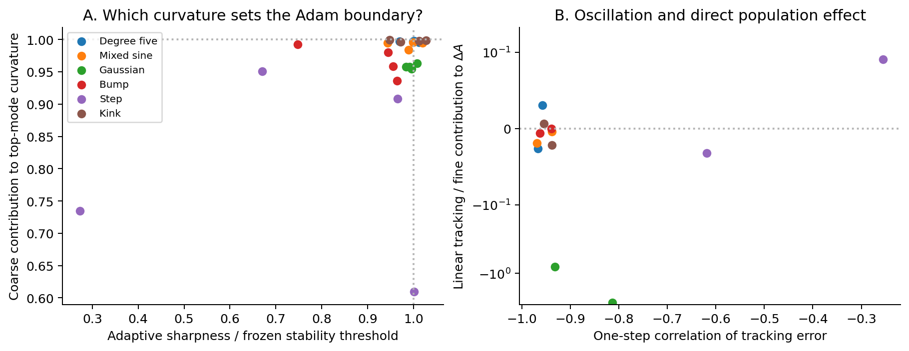

# Coarse feedback, adaptive scaling, and slow population acquisition

We want to explain why Adam's larger, more concentrated parameters still do
not acquire geometry that delivers the desired output accuracy. The GD theorem
already explains a different, quantitatively verified regime: moderately
distributed parameter energy limits nonlinear sensitivity and population
growth. Adam's measured energy and concentration make that estimate
uninformative. This does not invalidate the GD mechanism, but it prevents
using it as the explanation of Adam.

The new tests support a coarse adaptive stability constraint: the leading
scaled curvature in late Adam states is predominantly coarse and close to the
local momentum stability boundary. They also revise our initial hypothesis.
Removing the processed fine update's first-order coarse disturbance at native
amplitude barely changes acquisition. Continuing fine disturbance is therefore
not yet an established explanation of tracking persistence. A reduced model
proves that coarse oscillation can maintain an adaptive denominator without
fine displacement; the neural test of that alternative is in progress.

This extended note contains the identities, reduced-model proofs, intervention
protocols, and completed results, including negative results. Section 7 records
the current campaign snapshot explicitly. The companion
[consolidated account](d34_scale_acquisition_consolidated.md) starts from the
network ODE, gives the GD population theorem and proof, and places these Adam
findings in the overall paper argument.

**Notation.** All output inner products use the same normalized training
measure as the squared loss. Coarse outputs are represented in an orthonormal
basis of constant and linear functions, so their Jacobian has two rows.

| Symbol | Meaning |
|---|---|
| $q_\theta$, $L=\frac12\|q_\theta-y\|^2$ | Network output and loss. Parameters include the output bias. |
| $C=P_Cq_\theta$, $H=P_Hq_\theta$ | Coarse and non-affine output; $P_H=I-P_C$. |
| $e_C=C-P_Cy$, $e_H=H-P_Hy$ | Output errors, with the output-minus-target sign convention. |
| $J_C=DC$, $J_H=DH$ | Current output Jacobians. |
| $F$, $R$ | Existing effective fine and tracking gradients; compensation remains inside $F$. |
| $D_n$ | Positive diagonal inverse Adam denominator used for update $n$. |
| $\bar m_n^F$, $u_n^F=-\eta D_n\bar m_n^F$ | Bias-corrected fine first moment and its actual parameter update. |
| $A=\sum_j a_j^2$, $\lambda_{\rm RMS}=h\sqrt{A/W}$ | Population slope energy and normalized RMS slope. |

## 1. What the current interventions establish

The most revealing example is the compact bump at width 705, seed 30. In the
130k--140k intervention, scalar amplification of the fine update produces
15.6 times the native fine slope path. Directional coherence falls from 0.529
to 0.081, and endpoint slope RMS exceeds the native control by only 0.048%.
More fine activity does not produce proportionate population expansion.
However, this cancelling response is induced by the intervention: native
fine motion in the failing families is largely coherent.

Across six targets, two widths, and two seeds, attenuating tracking inside
the denominator used for the fine proposal exposes a mean 5.30--9.95-fold
available gain after capping each gain at ten. Scalar amplification improves
pulse-end RMS for all degree-five, sine, and kink cases. Thus the restriction
does matter to acquisition; it is not universally harmless. Bump, step, and
Gaussian responses differ, and the altered trajectories can renew tracking.
Replacing fine momentum with the current gradient lowers early acquisition
in all 24 cases, so removing momentum is not the supported remedy.

These observations identify an amplitude restriction and coupled responses.
They do not establish that the denominator is necessary for stability, that
all cancellation comes from tracking, or that a single mechanism explains
every target. In particular, the previous crossed geometry--residual test
did not find universal cancellation between those two raw force changes.

The existing experiments at 25k--150k must also remain separate from the
five-million-update mixed-sine observation in manuscript version 27. They
support mechanisms in their measured regime, not continuous coverage of the
entire longer run. The long-run Adam error quoted in Section 3.5 is
$1.81\times10^{-3}$, below 1% but far above the supplied dictionary's
$6.62\times10^{-7}$. The relevant paper claim is an accuracy gap at matched
budget, not that every Adam experiment misses a 1% requirement.

## 2. The same gradient decomposition, with optimizer-dependent motion

Assume $K=J_CJ_C^*$ is invertible. Define

$$
g_H=J_H^*e_H,\qquad
\Pi=I-J_C^*K^{-1}J_C,\qquad F=\Pi g_H.
$$

Then the decomposition and its coarse constraint are exact:

$$
\nabla L=F+R,\qquad
R=J_C^*z,\qquad
z=e_C+K^{-1}J_Cg_H,\qquad J_CF=0.
\tag{1}
$$

Indeed, subtracting $F$ from $J_C^*e_C+g_H$ gives the expression for $R$.
Multiplying $F$ by $J_C$ gives zero. This retains the existing meaning of
tracking as departure from the compensating coarse equilibrium.

For GD the component updates are $-\eta F$ and $-\eta R$. For Adam they
are $-\eta D_n\bar m_n^F$ and $-\eta D_n\bar m_n^R$, with the same actual
denominator. The identity $J_CF=0$ generally does not imply
$J_CD_n\bar m_n^F=0$. The old decomposition remains valid as gradient and
update accounting; it does not become a coarse-preserving Adam update.

### Proposition 1: exactly how fine motion disturbs coarse output

Let $u$ be any parameter increment for a twice continuously differentiable
network. Define the directional remainder

$$
\mathcal E_C(\theta,u)=
\int_0^1(1-s)D^2C(\theta+su)[u,u]\,ds.
$$

Then

$$
C(\theta+u)-C(\theta)=J_Cu+\mathcal E_C(\theta,u).
\tag{2}
$$

Consequently an isolated GD fine step satisfies

$$
C(\theta-\eta F)-C(\theta)=\mathcal E_C(\theta,-\eta F),
\tag{3}
$$

whereas an isolated Adam fine step satisfies

$$
C(\theta+u_n^F)-C(\theta)
=-\eta J_CD_n\bar m_n^F+\mathcal E_C(\theta,u_n^F).
\tag{4}
$$

**Proof.** Integrate the derivative of $C(\theta+su)$ twice and use
$J_CF=0$. $\square$

Thus a fresh GD fine step changes coarse output only through a second-order
step effect. Adam also has a possible first-order effect from scaling and
history. The remainder is directional and evaluated on the actual step; no
bound on the largest neuron or a global Hessian maximum is required to
measure it. For the full update, (2) includes both component increments and
their nonlinear interaction. Separate isolated-step remainders must not be
added as if there were no cross terms.

The history contribution can also be separated exactly. Write the fine
moment used at update $n$ as
$\bar m_n^F=I_n+\sum_{k\le n}w_{nk}F_k$, where $I_n$ contains any inherited
moment and the weights include bias correction. For any scalar $d$,

$$
J_{C,n}D_n\bar m_n^F
=J_{C,n}(D_n-dI)\bar m_n^F
+d\sum_{k\le n}w_{nk}(J_{C,n}-J_{C,k})F_k
+dJ_{C,n}I_n.
\tag{5}
$$

This follows by adding and subtracting $dJ_{C,n}\bar m_n^F$ and using
$J_{C,k}F_k=0$. It separates anisotropic scaling, movement of the coarse
tangent space, and inherited history. It does not say that momentum is
harmful overall; our direction interventions show its benefit.

### Coarse output preservation is not tracking-equilibrium preservation

Set $e_C^*(\theta)=-K^{-1}J_Cg_H$, so $z=e_C-e_C^*$. Equation (2) gives
the exact additional identity

$$
z(\theta+u)-z(\theta)
=J_Cu+\mathcal E_C(\theta,u)
-\big[e_C^*(\theta+u)-e_C^*(\theta)\big].
\tag{6}
$$

The equilibrium itself moves. Even under a GD fine step, its movement can
be first order in the step. We must therefore measure both the disturbance
of coarse output and the movement of its compensating equilibrium before
claiming to explain renewed tracking. Finally,
$R(\theta+u)=J_C(\theta+u)^*z(\theta+u)$ also includes Jacobian movement.
Equations (2) and (6) provide a common, exact comparison for GD and Adam.

## 3. A coupled model proves what correction can do, and what it cannot

Consider two collective coordinates: a coarse error coordinate $x$ and a
coordinate $s$ along a fine direction. On a finite region take

$$
L(x,s)=\frac\kappa2x^2+fs,\qquad
B=\begin{pmatrix}d_c&d_{cf}\\d_{cf}&d_f\end{pmatrix}\succ0,
\qquad \kappa>0.
$$

$f$ is a constant local fine gradient, not a target function. The linear
fine potential describes a finite segment of motion, not a globally bounded
loss. $B$ is a fixed preconditioner in these collective coordinates. A
diagonal preconditioner in physical parameter coordinates need not be
diagonal after rotating to coarse and fine directions.

### Proposition 2: correction reduces the available fine mobility

For preconditioned GD with step $\eta$, suppose
$0<\eta\kappa d_c<2$. Define

$$
x_*=-\frac{d_{cf}f}{\kappa d_c},\qquad
\alpha=1-\eta\kappa d_c,\qquad
\mu=d_f-\frac{d_{cf}^2}{d_c}>0.
$$

The iterates satisfy

$$
x_n-x_*=\alpha^n(x_0-x_*),
$$

$$
s_N-s_0=-N\eta\mu f
-\frac{d_{cf}}{d_c}(1-\alpha^N)(x_0-x_*).
\tag{7}
$$

**Proof.** The two update equations are

$$
x_{n+1}=x_n-\eta(\kappa d_cx_n+d_{cf}f),\qquad
s_{n+1}=s_n-\eta(\kappa d_{cf}x_n+d_ff).
$$

Subtract $x_*$ in the first equation. Substitute its geometric solution in
the second and sum, using $1-\alpha=\eta\kappa d_c$. Positivity of the
Schur complement of $B$ gives $\mu>0$. $\square$

After the coarse transient, the direct preconditioned fine step would move
$s$ by $-\eta d_ff$. Its induced coarse response supplies
$+\eta d_{cf}^2f/d_c$, leaving $-\eta\mu f$. This is a precise example of
correction consuming part of the available fine motion. There is no
equilibrium in $s$ when $f\ne0$: motion continues at a reduced rate.

This proposition does not imply universal slow acquisition. The mobility
$\mu$ need not be small, and it can exceed the corresponding GD mobility.
It establishes a mechanism and identifies the coupling that would have to
be measured. It is an exact fixed-preconditioner model, not a proof for
Adam's changing moments or for the neural network.

The analogous instantaneous coarse-preserving mobility in the full model is

$$
M_D=D-DJ_C^*(J_CDJ_C^*)^{-1}J_CD.
\tag{8}
$$

The velocity $-M_Dg_H$ uniquely minimizes
$\frac12v^*D^{-1}v+g_H^*v$ subject to $J_Cv=0$.
Lagrange multipliers prove the formula directly. Moreover
$M_D=D^{1/2}(I-P)D^{1/2}$ for an orthogonal projection $P$, hence
$0\preceq M_D\preceq D$. This compares constrained fine dissipation to
unconstrained dissipation in the same metric; it does not order their slope
components, compare Adam to GD, or bound the actual momentum-driven path.
Our earlier adaptive-access diagnostic already measures $g_H^*M_Dg_H$.
It is not a new definition of the recorded effective fine gradient $F$.

## 4. Why large-step GD is a useful, nontrivial comparison

For ordinary GD in Proposition 2, $B=I$. The coarse coordinate obeys
$x_{n+1}=(1-\eta\kappa)x_n$, and the fine coordinate moves by $-\eta f$.
Coarse oscillation begins when $\eta\kappa>1$; it decays when
$\eta\kappa<2$, persists at equality, and grows above two unless its
initial amplitude is zero. It does not slow $s$ in this separable model.
Thus oscillation alone is not the missing explanation. Coupling through
nonlinear geometry, a moving equilibrium, or adaptive history is essential.

On nonlinear losses, large-step GD can instead exhibit self-stabilization:
oscillations feed back on curvature. This has been studied theoretically by
[Damian, Nichani, and Lee](https://arxiv.org/abs/2209.15594) and empirically
in the [GD edge-of-stability study](https://arxiv.org/abs/2103.00065).
These results make the proposed comparison well motivated, but they do not
identify our tracking gradient with the unstable Hessian mode or imply that
the stabilizing response opposes population slope expansion.

For a fixed positive preconditioner and EMA momentum coefficient $\beta_1$,
the positive-curvature quadratic stability threshold is

$$
\eta\,\lambda_{\max}(D^{1/2}\nabla^2L D^{1/2})
<\frac{2(1+\beta_1)}{1-\beta_1}.
\tag{9}
$$

It follows from the scalar characteristic polynomial
$r^2-[1+\beta_1-\eta(1-\beta_1)\lambda]r+\beta_1$.
With $\beta_1=0.9$ the right side is 38. For GD the corresponding threshold
is two. [Cohen et al.](https://arxiv.org/abs/2207.14484) find that actual
full-batch Adam often follows the associated adaptive stability boundary.
For moving, bias-corrected Adam, (9) is a diagnostic from the locally frozen
recurrence, not a global stability certificate. Negative-curvature modes
also require separate treatment.

Unlike GD, Adam additionally remembers oscillatory tracking in its second
moment. For the illustrative inputs $F=(f,f)$ and
$R_n=(-1)^n(r,-r)$, the raw gradients are orthogonal but each coordinate's
steady second moment is

$$
v_n=f^2+r^2
\pm 2fr\frac{1-\beta_2}{1+\beta_2}(-1)^n.
\tag{10}
$$

This is obtained by substituting a constant plus an alternating term into
the second-moment recurrence. The fine first moment approaches $f$.
When the alternating cross term and denominator offset are negligible,
the fine update magnitude is $\eta|f|/\sqrt{f^2+r^2}$. GD processing the
same fine input gives $\eta|f|$, without this denominator dependence.
This is a downstream filter calculation with prescribed inputs. Closing
the neural feedback loop requires explaining the endogenous tracking that
produces those inputs. Orthogonality alone does not control each
coordinate's squared-gradient cross term in general.

### Proposition 3: tracking can maintain the denominator without fine forcing

There is a second way to close the illustrative calculation: a deterministic
coarse oscillation can sustain its own adaptive denominator. This matters
because eliminating $J_Cu^F$ need not eliminate an existing tracking
oscillation. The following model isolates that possibility; it does not
assert convergence to the oscillation in the neural network.

Use the collective loss $L(x,s)=\kappa x^2/2+fs$ again, now with EMA
momentum and a **shared scalar RMS denominator**:

$$
m_{n+1}=\beta m_n+(1-\beta)(\kappa x_n,f),\qquad
v_{n+1}=\beta_2v_n+(1-\beta_2)\frac{\kappa^2x_n^2+f^2}{2},
$$

$$
(x_{n+1},s_{n+1})=(x_n,s_n)-\eta m_{n+1}/\sqrt{v_{n+1}}.
$$

Assume $0\le\beta,\beta_2<1$, $\eta,\kappa>0$, no denominator offset,
and the stationary, uncorrected EMA convention. Put
$T_\beta=2(1+\beta)/(1-\beta)$. Whenever
$|f|<\sqrt{2}\eta\kappa/T_\beta$, this system has the exact solution

$$
x_n=(-1)^n b,\qquad
b^2=\frac{2\eta^2}{T_\beta^2}-\frac{f^2}{\kappa^2},\qquad
\sqrt{v_n}=\frac{\eta\kappa}{T_\beta},\qquad
s_{n+1}-s_n=-\frac{T_\beta f}{\kappa}.
$$

**Proof.** Initialize $x_0=b$, $v_0=(\eta\kappa/T_\beta)^2$,
$m_0^s=f$, and
$m_0^x=-[(1-\beta)/(1+\beta)]\kappa b$.
The constant squared-gradient input preserves $v_n$. Induction in the
moment recurrence gives
$m_{n+1}^x=[(1-\beta)/(1+\beta)]\kappa x_n$ and $m_{n+1}^s=f$.
The coarse update subtracts $2x_n$, and the fine update is the displayed
constant increment. $\square$

This solution explains a rate restriction rather than a fine equilibrium.
At $f=0$, tracking oscillates with no fine motion at all. At small nonzero
$f$, that oscillation keeps the denominator at the coarse stability scale,
and fine motion proceeds at a rate proportional to $f/\kappa$. Increasing
$\eta$ enlarges the oscillation and its denominator while leaving this
particular fine drift unchanged. That conclusion concerns the displayed
solution, not arbitrary initial conditions or all Adam learning rates.
Suppressing only the $s$ update also leaves the coarse cycle unchanged when
$f\ne0$, including its contribution to the passive second moment. This
matches the distinction tested by the fine-off intervention.

The same example clarifies signed motion accounting. In the scalar coarse
mode, $x_{n+1}=-x_n$ preserves $x_n^2$, even though
$2x_n(x_{n+1}-x_n)=-4x_n^2$. The positive squared-step term cancels it
exactly. Large negative linear tracking contributions can therefore coexist
with little persistent change in an oscillating mode's energy, while its
squared gradient continues to affect the denominator.

The shared denominator is an explicit simplification. In orthonormal
physical coordinates $(s+x,s-x)/\sqrt2$, the gradients are
$(f+\kappa x,f-\kappa x)/\sqrt2$. Along an alternating coarse input, their
coordinatewise EMA second moments equal the shared value plus opposite
alternating corrections. The correction relative to the shared value is
at most $(1-\beta_2)/(1+\beta_2)$, by
$2|f\kappa b|\le f^2+\kappa^2b^2$; at $\beta_2=0.999$ this is about
$0.0005$. This input calculation motivates the reduced model but does not
prove stability or long-horizon shadowing of its exact cycle by Adam.
The fine-off experiment below tests the qualitative prediction directly
on the actual networks.

## 5. The missing tests, in an order that can change our conclusion

### First: determine what renews tracking at the saved states

Use the existing early and late checkpoints across all six targets, widths
705 and 1409, and seeds 30 and 31. No new long training is needed for this
part. Evaluate the following on Modal, loading one small checkpoint at a
time and returning scalar diagnostics:

- Current fine gradient, scaled current fine gradient, fine momentum, and
  scaled fine momentum, with their native magnitudes and a second comparison
  at a common proposal norm. This separates scaling from history.
- $J_Cu^F$, the exact isolated fine-step change in $C$, and its directional
  remainder. Also evaluate (6), so movement of the compensating equilibrium
  cannot be misattributed to coarse output disturbance.
- The native second moment, the existing shadow second moment with attenuated
  tracking, and their effect on the same fine proposal. Retain squared-gradient
  cross terms; do not infer this from a ratio of raw force norms.
- The leading positive full-Hessian curvature and its adaptively scaled
  counterpart using converged matrix-free products. Measure how much of the
  unstable candidate direction lies in the coarse-normal subspace. A coarse
  Gauss--Newton matrix alone is not the full Hessian at nonzero residual.

The exact decompositions are implementation checks. The scientific question
is which measured term dominates renewed tracking. If adaptive disturbance
is small, the proposed first link is unsupported even though the denominator
effect remains real. If the moving equilibrium dominates for both optimizers,
the next theory should study that common population response instead.

### Second: test the GD learning-rate explanation directly

Start with the six width-705, seed-30 late states from each optimizer.
Fork ordinary GD from both sources so differences of geometry are not
confounded with optimizer choice. Use the native rate and rates at
0.25, 0.5, 0.9, 1.05, and 1.25 times the local positive-curvature reference
$2/\lambda_{\max}(\nabla^2L)$, removing duplicate rates. If there is no
positive leading curvature, label that state outside this calibration
instead of inventing a threshold. These are diagnostic doses; the reference
is not a promise that a nonlinear continuation is stable.

Use 2k-update pilots to locate monotone, oscillatory bounded, and divergent
responses; extend the informative neighboring rates to 10k. Track raw
output error, slope RMS, signed fine and tracking contributions, accumulated
fine path, and the finite-step remainder. For GD compare both update count
and elapsed flow time $n\eta$ over overlapping intervals. Greater progress
at the same number of larger updates is not by itself a new mechanism.
Record divergent and unresolved runs as outcomes.

The hypothesis predicts a transition in which renewed tracking accompanies
loss of proportional growth in useful fine motion. If larger stable steps
simply accelerate acquisition, the tested GD baseline was partly limited
by its chosen step size, and that must qualify the paper. If they diverge,
that establishes a stability limit, not self-stabilization. If they oscillate
without appreciable changes in signed acquisition, oscillation is not the
proposed bottleneck. Only a measured population effect justifies connecting
the stability phenomenon to scale failure.

### Third: remove the proposed coupling rather than just amplifying activity

For an actual processed fine proposal $u^F$, use the minimum-$D^{-1}$-norm
coarse correction

$$
u^{F,\mathrm{balanced}}
=u^F-DJ_C^*(J_CDJ_C^*)^{-1}J_Cu^F.
\tag{11}
$$

It satisfies $J_Cu^{F,\mathrm{balanced}}=0$ by multiplication. This is an
intervention on the update, not a renamed fine gradient. It removes the
first-order coarse-output disturbance but leaves the moving-equilibrium
effect in (6), a distinction that makes the test informative.

Compare four arms: native, the established scalar fine amplification,
coarse-balanced fine motion at the native available norm, and coarse-balanced
fine motion at the amplified available norm. Match hidden-update norms
locally, as in the existing intervention. Apply (11) to the full fine
proposal, including its output-bias component, then scale that entire
corrected vector to match the hidden-update norm. Scaling the entire vector
preserves its zero coarse response. Unlike the previous intervention, this
allows the fine output-bias proposal to change; the tracking proposal remains
native in every coordinate. Report full and hidden motion budgets separately.
Verify rank, and report unresolved solves or a zero corrected hidden norm
instead of silently substituting another policy.
Use the same physical coordinates and exact $F,R$ definitions in every arm.
Keep native full moment recurrences and the native tracking proposal at the
clone's current state. Do not reset optimizer history.

Run a 10k pulse and 10k native release, first on the six width-705, seed-30
cases, then on the second seed and width 1409 if the mechanism is observable.
Equality of local proposal norms does not imply equal cumulative budgets;
report both. Sparse endpoint checkpoints and online scalar accumulators are
sufficient. This stage requires new short continuations: existing scalar
summaries cannot recover its counterfactual trajectories.

If the loop is acquisition-limiting, removing the disturbance should reduce
renewed tracking and denominator restriction, then increase sustained signed
fine expansion relative to its matched-amplitude control. If the first two
effects occur without additional acquisition, the loop exists but is not the
main acquisition bottleneck. If tracking persists through movement of
$e_C^*$, output balancing has not broken the relevant loop; (6) identifies
why. If the amplified coarse-balanced arm still generates fine reversals
with little tracking, study fine residual--geometry feedback separately.
These outcomes must not all be reported as confirmation of one hypothesis.

Projection itself changes direction. Record its immediate radial slope
contribution and linearized loss change at every common starting state, so
an immediate directional benefit is not credited to later denominator
feedback. If the balanced arm shows the predicted tracking and acquisition
changes, add a paired check that freezes the fine denominator in both the
balanced and unbalanced arms, with identical initial amplitude matching.
The native full second moment still evolves passively and the tracking
proposal remains native. A reduced advantage when this denominator mediator
is held fixed would support its causal role; an unchanged advantage would
point to direction or direct tracking effects. Report the resulting unequal
cumulative paths rather than claiming they were controlled.

Before any continuation, verify the balance solve, the exact finite-step
population identity, native Adam replay, and retention of inherited moments.
Measure attached-network raw training error every update and independent-grid
error at common endpoints. Use the same current-checkpoint and best-within-
budget rules for every arm, reported separately. Keep the 1% diagnostic and
construction scale $0.25$ distinct from the paper's high-precision objective.
Report RMS population slopes, not a maximum or a 99th percentile.

The first seed is a development panel; the second seed and wider cases test
transfer of the selected mechanistic prediction. Do not present a rate or
intervention chosen on the development runs as prespecified held-out evidence.
Measure pilot runtime before allocating continuations within the current
authorized compute balance; no new multi-hour budget is assumed here.
All numerical execution is on Modal. No dense local checkpoint loading or
new million-update traces are needed.

### Secondary controls motivated by the first completed panel

The width-705, seed-30 development panel creates two sharper questions.
Balancing at native amplitude eliminates $J_Cu^F$ but changes accumulated
tracking little in these six cases. Freezing the fine denominator at tenfold
amplitude makes five of the six target cases leave the numerically resolved
regime in both balanced and unbalanced branches. These observations do not
establish that ongoing fine disturbance sustains native tracking, or that a
frozen denominator would be unstable at native amplitude.

We therefore add four paired branches, using the same 130k checkpoints,
10k pulse, and 10k native release: native; zero fine displacement; a fine
denominator frozen at its fork value with gain one; and the same unit-gain
frozen proposal with coarse balancing. This is a follow-up chosen after the
development results, separate from the original six-arm comparison. Apply
it across the same six targets, two widths, and two seeds within the approved
three additional GPU-hours.

The predictions distinguish two explanations. If continuing fine displacement
is necessary to maintain tracking, removing that displacement should substantially
deplete tracking during the pulse. If tracking remains comparable to native,
the proposed fine-forcing loop is not necessary for its persistence on this
interval. The full native gradient still updates the passive moments, and
tracking motion still changes the parameters: this test removes active fine
displacement, not every dependence on the fine residual.

The unit-gain frozen branches distinguish failure caused by tenfold
amplification from a need for denominator adaptation already at the native
amplitude. Record early exits as outcomes, not missing successful comparisons.
If both frozen branches fail, their long-horizon acquisition difference is
not an identified mediation effect. In all branches, retain the signed fine
and tracking terms and the shared squared-step term in the exact $A$ balance.

## 6. How Section 3.5 should tell the argument

Use the title **Why joint training acquires useful geometry slowly**. The
current phrase “fails to self-reinforcing slope acquisition” is awkward and
suggests a single established explanation that the Adam results do not yet
supply. The argument should proceed in this order:

1. **Observation:** at the same output criterion and budget, learned features
   leave an accuracy gap relative to supplied geometry. Show raw error and
   RMS slope acquisition. Preserve the learned-center/refit evidence;
   slopes alone are not a universal accuracy certificate.
2. **Common question:** the effective fine gradient supplies the main positive
   acquisition channel in the audited regimes, but useful cumulative motion
   depends on both its geometry and how the optimizer processes it.
3. **GD result:** keep Theorem 3.3 as a conditional, quantitative result.
   Distributed moderate energy limits nonlinear sensitivity, controls growth,
   and yields the output-error floor. Its proof and empirical condition checks
   are the strongest formal part of this section.
4. **Adam mechanism:** state the measured denominator restriction and paired
   intervention response. Add the feedback explanation only to the extent
   supported by the new tests. Put (2)--(11), moment details, and full target
   coverage in the appendix; a second large theorem is not needed in the
   one-page main argument.
5. **Consequence:** adaptive training improves acquisition but does not, in
   the observed budgets, reproduce the useful supplied geometry. QUILL avoids
   having to discover that geometry through these dynamics.

A main-text paragraph supported by the evidence already available is:

> Adam reaches a different parameter regime, so the preceding GD bound does
> not explain its remaining acquisition gap. We therefore examine the updates
> that actually move the slopes. Tracking can contribute little net slope growth
> while restricting the effective fine update through Adam's shared second
> moment. Attenuating tracking in that denominator exposes substantially
> larger fine proposals. Using the additional budget accelerates acquisition
> for some targets, while for others it mainly creates cancelling motion or
> a renewed tracking response. Thus concentrated parameter energy and large
> update activity do not by themselves ensure useful population growth.

If the proposed tests support the full loop, the stronger explanatory sentence
would be: **Adaptive fine motion repeatedly renews coarse tracking, whose
second-moment contribution limits subsequent fine acquisition.** This is a
prediction to validate, not yet a paper conclusion.

For figures, retain the two observation panels: raw error and RMS scale.
The GD figure should continue to show the population upper bound and output
lower bound. A compact Adam mechanism pair can show tracking-denominator
restriction and paired population/output responses to breaking the coupling.
Curvature diagnostics belong in the appendix unless they are the decisive
explanation. A visually similar plateau is not evidence of identical causes.

The objective is a common mathematical language with optimizer-specific
mechanisms where the data require them. We should not weaken the useful GD
theorem to fit Adam, or label a bookkeeping identity as an Adam persistence
theorem. The added value would be identifying which part of the coupled
response restricts useful motion and demonstrating that changing it has the
predicted population consequence.

## 7. Completed evidence and its implications

### Coverage and interpretation of this snapshot

This section records the completed `mid_analysis` snapshot of the September
26 campaign: 96 saved-state audits, 288 GD branches, and 72 Adam branches.
The audits cover six targets, two widths, two seeds, two ages, and both
optimizers. The GD branches cover three of the four width–seed cohorts;
the Adam comparisons below cover both width-705 seeds. The remaining cohorts
and the secondary fine-off/unit-gain-frozen controls are running. Consequently
the full-panel curvature result and the partially completed intervention
result have different coverage. We will replace this snapshot with the final
analysis, retaining early exits as outcomes.

All results use the raw attached-network output, with no readout refit.
Comparisons distinguish current endpoint error from best training error
within the same update budget. Independent-grid error is measured at the
endpoints; it is not an independent-grid evaluation of the best training
checkpoint. This distinction matters in Adam, where oscillation phase can
substantially change endpoint error without comparably changing the best
error attained.

### The coarse mode sets Adam's measured local stability scale

Across all 24 late Adam states, the adaptive sharpness divided by the frozen
momentum threshold has median **0.9865**, with range **0.2728–1.0277**.
The median coarse contribution to the leading scaled Rayleigh curvature is
**0.9880**; the range is **0.6094–0.9992**. The leading eigenvector's overlap
with the correctly scaled coarse-normal subspace has median **0.9992**.
These measurements use the full loss Hessian and the actual Adam denominator.
They identify the stiff direction; a visual impression of oscillation alone
would not do so.

Native GD's corresponding ratio to its threshold is only **0.00524** at
the median, with range **0.00493–0.00584**. The two native optimizers therefore
operate in very different stability regimes at these checkpoints. For Adam,
the threshold is a frozen-coefficient diagnostic, not a theorem about its
changing nonlinear update. It is still strong evidence for the proposed
coarse constraint because the location and direction agree independently.

The left panel compares curvature and its coarse contribution across the
full late-state panel. The right panel concerns the completed Adam
continuations and separates temporal oscillation from the signed linear
tracking contribution to slope energy. The latter must be interpreted with
the squared-step term in the exact population balance.

### Large-step GD supplies a causal comparison

Starting GD at Adam's geometry with a rate 1.05 times the initial GD
threshold produces loss oscillations and a decrease in sharpness. Across
the 18 completed starts, ordinary GD's final normalized sharpness has median
**0.9599**, and the runs have **65–159 loss increases**. Attenuating tracking
to one tenth at the same initial step size produces **zero loss increases
in all 18 cases**. Its final reference sharpness remains near **1.0502**.

Thus tracking is causally involved in this large-step response. The last
number is curvature of the native loss, not the stability ratio of the
modified-force algorithm. Removing a gradient component changes its dynamics.
The experiment does not establish a universal sign for slope growth, and
larger GD steps substantially accelerate some targets. Comparisons at equal
update count also have unequal gradient-flow time; we retain that distinction.

### Removing fine disturbance barely changes native acquisition

At an isolated late Adam state, a processed fine step can change coarse
output to first order. Balancing removes that term to roundoff, so the
intervention succeeds at its intended immediate action. Yet over a 10k pulse,
balanced/native slope RMS has median **1.00012** and range
**0.99953–1.00118** across the 12 completed starts. Best raw error has median
ratio **0.99845**, while accumulated tracking energy has median ratio
**1.0124**. This is a material negative result: removing the first-order fine
disturbance does not substantially release native acquisition in this panel.

The amplified comparison is target dependent. For mixed sine, width 705,
seed 30, balancing at tenfold fine amplitude reduces accumulated tracking
energy by **96.9%** and fine slope path by **72.9%**, while improving best
error by **36.1%** and increasing slope RMS by **3.31%**, relative to the
unbalanced tenfold arm. The same balancing operation at native amplitude
has almost no effect. Across all 12 amplified pairs, however, the median
RMS increase is only **0.145%**. The example shows a coupling that can become
important under stronger forcing; it is not evidence that this coupling
explains native persistence for every target.

### Frozen-denominator failures are informative, but do not identify mediation

In the two completed width-705 cohorts, both tenfold frozen-denominator
variants survive for degree five. Both fail for each of the other five
targets: **20 failures among 24 frozen branches**. Eighteen leave the
numerically resolved regime and two become nonfinite. All **48 dynamic
denominator branches** complete. These are actual divergent responses,
not omitted successful checkpoints.

Freezing plus tenfold amplification is therefore a strong intervention.
Its failure supports caution about treating the denominator as removable,
but cannot establish that adaptation is necessary at native amplitude.
Nor can two failed frozen arms identify a long-horizon mediation effect.
The unit-gain frozen controls address that ambiguity. The fine-off control
addresses a separate question: whether ongoing fine displacement is needed
to maintain the coarse activity at all.

### What is established, and what remains open

The exact decomposition, tracking-renewal identity, fixed-preconditioner
mobility proposition, and reduced shared-RMS oscillation are proved above.
Fifteen focused remote tests verify implementation and the reduced cycle,
including native replay, retention of optimizer history, balance projection,
full Hessian products, and exact finite-step population accounting.

The empirical evidence supports a coarse adaptive stability constraint and
an indirect tracking effect through the denominator. It does **not** yet
prove that ongoing fine disturbance maintains that constraint, that a single
restoring force explains every target, or that Adam obeys the GD population
rate bound. The strongest current paper theorem remains the conditional GD
population-to-output theorem. The strongest Adam interpretation is a
separation between useful fine motion and a coarse stability scale that
limits how the optimizer can amplify it.

## Evidence and source record

- Existing measurements, protocols, and artifact provenance:
  [Adam population study](../results/checkpoint_D_optimizers/expD34_readout_race/population_output/ADAM_POPULATION.md).
- GD concentration theorem and its empirical coverage:
  [population concentration note](d34_population_concentration.md).
- Manuscript inspected: version 27, Section 3.5, Theorem 3.3, and Figures 4--5
  on pages 7--8. The older `d34_scale_acquisition_paper_main.tex` retains a
  previous theorem and is not the source of this latest section.
- Literature is used for stability mechanisms and diagnostics, not as evidence
  about these particular networks. The propositions in this note have the
  explicit proofs above; the neural Adam feedback and persistence claims
  remain experimental hypotheses.
