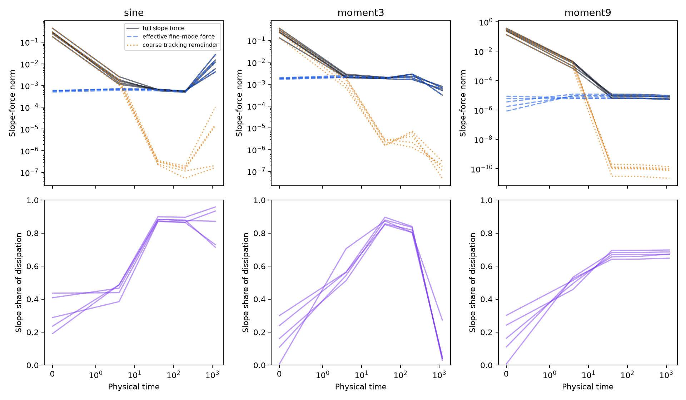

# Understanding the gamma barrier: a theorem and a measurement guide

Why can training reduce the loss while failing to reach the slope scales and precision we seek? The useful object is the slope force that remains after the easily fitted residual components have relaxed. Its magnitude, direction, and distribution across neurons answer different questions. This note derives a conditional finite-time population-barrier theorem and explains how to measure its ingredients even when a complete proof from initialization is unavailable.

The theorem applies to actual simultaneous GD, including random nonzero readouts and nonlinear signal regeneration. It does not establish that its hypotheses hold for every D34 initialization. The [technical theory note](d34_transport_scale_barrier.md) gives the broader transport formulation; the [evidence report](../results/checkpoint_D_optimizers/expD34_readout_race/transport_barrier/README.md) records the numerical tests. Here the goal is to make the mathematical steps and diagnostic interpretation accessible without prior knowledge of Schur complements or transport PDEs.

The population event measures one part of the failure to reach the gamma and precision regime motivated by the approximation theory. The subsequent [fixed-geometry readout study](../results/checkpoint_D_optimizers/expD34_readout_race/useful_slopes/README.md) measures partial error reduction at the observed small gammas. Those errors remain far from precision; better readout fitting does not establish successful scale acquisition. Section 7 explains how to retain these measurements without replacing the research objective by relative improvement.

The [mechanism companion](d34_transport_mechanisms.md) develops this interpretation through illustrative results on affine arrest, weak nonlinear transport, residual depletion during coupled fitting, and population flux. It separates those results from a proof of long-time trapping from D34 initialization.

The [expanded target and Adam study](../results/checkpoint_D_optimizers/expD34_readout_race/adam_force_extension/README.md) strengthens one empirical simplification for GD: across 13 targets and five seeds, tracking contributes at most 0.469% of the summed component-force norm budget over updates 20,000–600,000. Understanding the effective fine force remains the main problem in that setting. Adam does not satisfy the same small-tracking observation: tracking can dominate raw-gradient and step activity while much of its signed motion cancels. Its first-moment history, shared second-moment scaling, and zero crossings must be measured separately; the GD theorem is not an Adam theorem.

The subsequent [conditional stagnation study](d34_coarse_balance_stagnation.md#a-stronger-degree-9-result-is-available-as-a-special-case)
identifies two slow generated-error modes as the main source of motion in the
degree-9 GD regime. It also gives a stronger local bound: subtract the hard-mode
loss that cannot yet be removed, then use GD descent to limit parameter travel.
Its FP64 evaluation confines all slopes below 0.388 for at least ten million
further updates from each of ten retained starting states. This is a
conditional theorem from specified checkpoints, with numerical constants rather than
directed-rounding certification; it does not establish entry from initialization
or permanent trapping.

For the current mechanism argument, start with the
[coupled-force exposition](d34_coarse_balance_stagnation.md). Its matched
experiments keep the initial effective force unchanged and separately fix
its sensitivity map or its supplied error. The purpose is to explain how
the surviving force sustains or loses outward motion, after the small
corrections have already been identified. This walkthrough supplies the
underlying population theorem; the exposition develops and tests the
additional dynamical model needed to use that theorem predictively.

**Notation. Physical parameters and empirical norms are used throughout.**

| Symbol | Meaning |
|---|---|
| $W,m$ | Physical network width and number of training samples. |
| $a,b,c,d$ | Slopes, hidden biases, readout weights, and output bias. |
| $\gamma_j=\lvert a_j\rvert$ | Magnitude of slope $j$; its sign is retained in the dynamics. |
| $\eta,\kappa,t_n=\eta n$ | Geometry step, readout/geometry rate ratio, and physical training time. D34's main setting has $\kappa=1$. |
| $r,R,L$ | Training residual, its empirical RMS, and half-MSE: $R=\Vert r\Vert_m$, $L=R^2/2$. |
| $g_I$ | Loss gradient in parameter block $I$. The actual slope velocity is $-g_a$. |
| $q_k,e_k$ | Fixed degree-$k$ basis function and its residual coefficient $e_k=\langle q_k,r\rangle_m$. The index $k$ labels a function of input $x$, not a neuron. |
| $e_C=(e_0,e_1)^T$, $e_H=(e_2,\ldots,e_\ell)^T$ | Two constant/linear error coefficients and the retained higher-degree error coefficients. Subscripts $C,H$ label these groups. |
| $K$ | Matrix describing how training couples changes in the retained residual coefficients: $\dot e=-Ke+f$. It includes all parameter blocks. |
| $C=K_{CC}$, $Q=K_{CH}$ | Abbreviations for the $2\times2$ coarse kernel block and the $2\times(\ell-1)$ coupling block. Standalone $C$ is always a matrix here; lowercase $c$ is the readout vector. |
| $B=K_{CC}^{-1}K_{CH}$ | Computed response map, of size $2\times(\ell-1)$: the instantaneous retained coarse balance is $e_C^{\rm bal}=-Be_H$. It is not a trained parameter. |
| $z_C=e_C-e_C^{\rm bal}$ | Two-component tracking error: departure of the actual constant/linear residual from its moving balance. |
| $T_a,G_a,S$ | Effective slope map, its Gram matrix $G_a=T_a^TT_a$, and effective total kernel. |
| $p,\Gamma,\mathcal D$ | Required population fraction, slope threshold, and distance to that acquired-population set. |
| $\tau=\Vert z_C\Vert_C$ | Tracking error in the kernel metric: $\tau^2=z_C^TCz_C$. |

## 1. Start with the outcome we want to explain

On D34's one-dimensional training midpoints $x_i\in[-1,1]$, the network and objective are

$$
F(x)=d+\sum_{j=1}^W c_j\tanh(a_jx+b_j),\qquad
r=F-y,\qquad
\langle u,v\rangle_m=\frac1m\sum_{i=1}^m u(x_i)v(x_i),\qquad
L=\tfrac12\langle r,r\rangle_m.
$$

D34 initializes $a,b,c$ with independent uniform draws on $[-\sqrt{6/(W+1)},\sqrt{6/(W+1)}]$ and sets $d=0$. The population theorem below does not require this distribution, but the width predictions use its $W^{-1/2}$ parameter scale. In particular, the readout is not initialized to zero.

Writing $u_j=a_jx+b_j$ and $s_j=\operatorname{sech}^2u_j$ gives

$$
(g_a)_j=c_j\langle r,xs_j\rangle_m,\quad
(g_b)_j=c_j\langle r,s_j\rangle_m,\quad
(g_c)_j=\langle r,\tanh u_j\rangle_m,\quad
g_d=\langle r,1\rangle_m.
$$

For $\eta>0$ and $\kappa>0$, simultaneous GD uses these gradients at the old state:

$$
(a,b)_{n+1}=(a,b)_n-\eta(g_a,g_b)_n,\qquad
(c,d)_{n+1}=(c,d)_n-\eta\kappa(g_c,g_d)_n.
$$

Unsubscripted vector norms are Euclidean; matrix norms are spectral unless marked with $F$ for the Frobenius norm. The sample-space norm $\|\cdot\|_m$ uses an empirical mean, not a sum. There are three separate outcomes to measure: whether a slope gradient exists; whether it points toward increasing slope magnitudes; and whether enough neurons move far enough. A large maximum gamma answers none of the population questions by itself.

For fixed $p\in(0,1]$ and $\Gamma>0$, define acquisition by

$$
P_\Gamma(a)=\frac1W\#\{j:|a_j|\ge\Gamma\}\ge p.
$$

For example, $p=0.1$, $\Gamma=3.2$, and $W=177$ require 18 acquired slopes. One escaping neuron is compatible with the barrier. These thresholds specify an outcome, not a necessary representation condition: proving that accurate approximation requires these scales is a separate problem.

At starting update $s$, sort the deficits $d_j=(\Gamma-|a_{sj}|)_+$ increasingly. The exact Euclidean distance to acquisition is

$$
\mathcal D_{p,\Gamma}(a_s)=
\left(\sum_{j=1}^{\lceil pW\rceil}d_{(j)}^2\right)^{1/2}.
\tag{1}
$$

To see this, making one unacquired coordinate reach magnitude $\Gamma$ costs at least its deficit, achieved by moving outward. Choose the cheapest required coordinates, including already acquired coordinates with zero deficit. This explains both the sorting and the square root. If $\mathcal D=0$, acquisition has already occurred; a strict exclusion starting at that state is impossible.

## 2. Express the residual in coordinates that reveal competition

The residual $r(x)=F(x)-y(x)$ is a function on the training inputs. We describe its shape using fixed functions $q_0,\ldots,q_\ell$ orthonormal under the empirical mean inner product. In D34 these are empirical Legendre modes, indexed by polynomial degree. On the symmetric training grid, $q_0(x)=1$ and $q_1(x)=x/\|x\|_m$; subsequent functions describe quadratic, cubic, and higher-degree shapes. The numbers $0,1,2,\ldots$ label these basis functions, not neurons or parameter values. Write

$$
e_k=\langle q_k,r\rangle_m,\qquad
r=\sum_{k=0}^{\ell}e_kq_k+r_\perp.
$$

Each $e_k$ is a scalar: how much of shape $q_k$ is present in the error. For example, $e_0$ is the mean residual, and $e_1$ measures its linear component. The vector $e=(e_0,\ldots,e_\ell)^T$ has $\ell+1$ entries. The remaining function $r_\perp$ is orthogonal to every retained basis function.

Changing residual coordinates is exact. The forecast approximates the gradient by truncating residual modes while retaining exact tanh sensitivities. In the following identities, the omitted contribution remains explicit, so the decomposition itself introduces no approximation.

We next ask how moving a parameter changes each residual coefficient. This derivative is the modal Jacobian. For slopes,

$$
(J_a)_{kj}=\frac{\partial e_k}{\partial a_j}=\langle q_k,c_jxs_j\rangle_m,
\qquad g_a=J_a^Te+g_{a,\perp},
\qquad (g_{a,\perp})_j=c_j\langle r_\perp,xs_j\rangle_m.
$$

Thus $(J_a)_{kj}$ measures how slope $j$ affects error coefficient $k$. Jacobian rows index residual modes and columns index parameters; $J_a$ has $\ell+1$ rows and $W$ columns, while $J_d$ is a single column. Stack the rate-weighted blocks as

$$
J=[J_a\;J_b\;\sqrt\kappa J_c\;\sqrt\kappa J_d],\qquad
K=JJ^T=K_a+K_b+K_c+K_d.
$$

Thus $K_a=J_aJ_a^T$, while $K_c=\kappa J_cJ_c^T$ and similarly for $d$. In gradient flow, the retained residual obeys

$$
\dot e=-Ke+f,\qquad
f_k=-\langle q_k,\mathcal K r_\perp\rangle_m,
\tag{2}
$$

where $\mathcal K$ is the full empirical tangent operator. In components, $\dot e_k=-\sum_{h=0}^{\ell}K_{kh}e_h+f_k$: an error coefficient $e_h$ contributes $-K_{kh}e_h$ to the rate of change of coefficient $e_k$. The matrix $K$ has $\ell+1$ rows and columns and is computed from the current network, so it changes during training. Orthogonal basis functions need not have orthogonal parameter gradients; consequently $K$ need not be diagonal. The vector $f$ is forcing from the omitted residual and vanishes for a complete basis.

The total kernel describes residual relaxation through all parameter blocks. Its slope block describes how that relaxation moves slopes. These are different measurements. The dotted equations use gradient-flow time to expose this structure; Section 4 treats actual GD steps explicitly.

### How the transport PDE fits into this description

Let $\rho=W^{-1}\sum_j\delta_{(a_j,b_j,c_j)}$. Moving these atoms with velocity $v=-(g_a,g_b,\kappa g_c)$ is equivalently

$$
\partial_t\rho+\nabla\cdot(\rho v)=0,
\qquad \dot d=-\kappa g_d,
\qquad F_\rho=d+W\int c\tanh(ax+b)\,d\rho.
$$

This is the same gradient-flow system; Euler stepping gives the GD update above. Replacing the realized atoms by the continuous initialization law is an additional approximation, not an identity for a particular seed.

For law quadrature with masses $w_i$, the nodes follow the same characteristic velocity. Their Euclidean loss gradients have an extra factor $Ww_i$, which must be divided out. Kernel columns use $\sqrt{Ww_i}$ weighting, and the slope-force norm is $\sqrt{W\sum_iw_i g_a(z_i)^2}$. Physical width stays $W$ when quadrature resolution increases. The finite-network acquisition distance (1) uses integer neuron counts; continuum mass may split and instead uses the relaxed weighted distance implemented in `weighted_distance`.

## 3. Find the slope force after constant and linear errors adjust

The question is whether fitting the constant and linear error components leaves a useful force for moving slopes. The example below shows why we must account for the coarse residual that higher-degree fitting continually induces. We then repeat the same calculation for D34's vectors of residual coefficients. Whether the actual trajectory stays close to the resulting balance is a separate dynamical question for Section 4.

### An example before the matrix notation

Consider a linear toy model with two scalar parameters: a slope-like parameter $a$ and a readout-like parameter $c$. Its error has two orthonormal components. Call the low-degree error coefficient $u$ and the higher-degree error coefficient $v$, and suppose

$$
u=3a,\qquad v=a+c-1,\qquad L=\tfrac12(u^2+v^2).
$$

Moving $a$ changes both errors; moving $c$ changes only the higher-degree error. The numbers specify an illustrative linear model, not an approximation asserted for D34. Equal-rate gradient flow gives

$$
g_a=\frac{\partial L}{\partial a}=3u+v,\qquad
g_c=\frac{\partial L}{\partial c}=v,\qquad
\dot a=-(3u+v),\quad \dot c=-v.
$$

Suppose at some instant $v=1$ and $u=-1/3$. The higher-degree error contributes $+1$ to the slope gradient, while the low-degree error contributes $3(-1/3)=-1$. The contributions cancel: $g_a=0$, even though $g_c=1$ and readout fitting continues. Looking only at the higher-degree error would miss that cancellation.

Why consider $u=-v/3$? Differentiate the two error coefficients along training:

$$
\dot u=3\dot a=-9u-3v,\qquad
\dot v=\dot a+\dot c=-3u-2v.
$$

If we temporarily hold $v$ fixed, the first equation relaxes toward $u^{\rm bal}=-v/3$, where its two terms balance. Define the departure from this balance as $z=u-u^{\rm bal}=u+v/3$. Substitution gives

$$
g_a=3z,\qquad \dot v=-v-3z.
$$

These two equations express the point of the example. At exact balance ($z=0$), the slope gradient vanishes and the higher-degree error still decreases. When tracking is imperfect, $3z$ is the extra slope gradient and $-3z$ is the correction to higher-degree error evolution. The low-degree error $u$ itself can be nonzero at perfect tracking.

This is an instantaneous statement, not permanent trapping. As $v$ changes, its balance $-v/3$ moves; starting at $z=0$ does not keep $z=0$. In fact, $\dot z=-10z-v/3$ in this example. Establishing how small tracking remains requires a dynamical estimate. For a general network, the surviving slope force at perfect tracking can also be nonzero. The calculation below separates that surviving force from the tracking correction.

### Identify the residual coefficients and their coupled equations

Group the coefficients from Section 2 into two vectors:

$$
e_C=\begin{pmatrix}e_0\\e_1\end{pmatrix},\qquad
e_H=\begin{pmatrix}e_2\\\vdots\\e_\ell\end{pmatrix}.
$$

The subscript $C$ labels the constant/linear, or coarse, group. The subscript $H$ labels the retained higher-degree group. In particular, the phrase "modes 0 and 1" means the constant function $q_0$ and normalized linear function $q_1$. Both vectors describe output error; neither is a vector of neuron parameters. "Fine modes" below means the entries of $e_H$, starting at degree 2. This grouping does not itself assert that the first two modes learn faster.

Split the rows and columns of the already defined matrix $K$ in the same way:

$$
K=\begin{pmatrix}
K_{CC}&K_{CH}\\
K_{CH}^T&K_{HH}
\end{pmatrix},\qquad
\begin{aligned}
\dot e_C&=-K_{CC}e_C-K_{CH}e_H+f_C,\\
\dot e_H&=-K_{CH}^Te_C-K_{HH}e_H+f_H.
\end{aligned}
$$

Here $K_{CC}$ is the $2\times2$ block using rows and columns 0 and 1; $K_{CH}$ has those two rows and columns $2,\ldots,\ell$; $K_{HH}$ uses the higher-degree rows and columns. The vectors $f_C,f_H$ are the corresponding parts of omitted-mode forcing $f$ from (2).

Read the first equation as two simultaneous effects: the coarse residual drives its own relaxation through $-K_{CC}e_C$, while the higher-degree residual drives changes in the coarse coefficients through $-K_{CH}e_H$. The second equation says that coarse residual also affects higher-degree residual. These couplings arise because the same parameter changes affect several output coefficients. All trained parameter blocks contribute to these kernel matrices; "coarse" does not mean "readout-only."

### Find the balance and define its tracking error

To locate the instantaneous balance, hold the kernel and $e_H$ fixed and temporarily set omitted forcing $f_C$ to zero. If $K_{CC}$ is positive definite, the coarse equation has zero velocity when

$$
K_{CC}e_C^{\rm bal}+K_{CH}e_H=0,
\qquad
e_C^{\rm bal}=-K_{CC}^{-1}K_{CH}e_H.
$$

This is why a relaxed coarse residual need not be zero: its own relaxation can balance forcing from higher-degree residual. It is an instantaneous balance of the retained coarse equation, not a stationary point of the entire training system. As the network and $e_H$ evolve, the balance moves. The omitted forcing is retained in the actual equations; if it is appreciable, it can also prevent tracking of this chosen balance.

Only now introduce the abbreviation

$$
B=K_{CC}^{-1}K_{CH},\qquad e_C^{\rm bal}=-Be_H.
$$

The matrix $B$ maps a higher-degree residual vector to the negative of its induced coarse balance. It has two rows and $\ell-1$ columns, is computed from the current kernel, and is not an additional trained parameter. Define the tracking error as actual minus balanced coarse residual:

$$
z_C=e_C-e_C^{\rm bal}=e_C+Be_H,
\qquad e_C=-Be_H+z_C.
$$

Accurate tracking means small $z_C$, not necessarily small $e_C$. In the opening example, these objects are scalars: $e_C=u$, $e_H=v$, $K_{CC}=9$, $K_{CH}=3$, $B=1/3$, and $z_C=z=u+v/3$. The vector notation repeats the same balance calculation for several residual coefficients.

### Compute the slope force at and away from that balance

Before using the balance, the slope gradient is simply the sum of contributions from the two residual groups and the omitted residual:

$$
g_a=J_{a,C}^Te_C+J_{a,H}^Te_H+g_{a,\perp}.
$$

Here $J_{a,C}$ selects rows 0 and 1 of the slope Jacobian, and $J_{a,H}$ selects its retained higher-degree rows. Substituting $e_C=-Be_H+z_C$ gives

$$
g_a=
\underbrace{J_{a,C}^Tz_C}_{\text{tracking contribution}}
+\underbrace{(J_{a,H}^T-J_{a,C}^TB)e_H}_{\text{effective fine-mode contribution}}
+\underbrace{g_{a,\perp}}_{\text{omitted modes}}.
\tag{3}
$$

The tracking contribution is the extra slope force due to departure from coarse balance. It is not the whole coarse-mode contribution: the balanced coarse force $-J_{a,C}^TBe_H$ has been included with the direct fine force $J_{a,H}^Te_H$. Their sum is the force that survives when tracking is perfect and omitted residual is absent. The two parts can interfere, so setting $e_C=0$ would miss a potentially important cancellation. The correction need not reduce every parameter block's force.

Name this surviving-force map $T_a=J_{a,H}^T-J_{a,C}^TB$. It has $W$ rows, one per slope, and $\ell-1$ columns, one per retained fine coefficient. Its Gram matrix $G_a=T_a^TT_a$ gives $\|T_ae_H\|^2=e_H^TG_ae_H$. These are computed quantities, not new dynamical parameters.

### Obtain the fine-residual equation and connect it to slope movement

Substitute the same $e_C=-Be_H+z_C$ into the second residual equation above:

$$
\dot e_H
=-\left(K_{HH}-K_{CH}^TK_{CC}^{-1}K_{CH}\right)e_H
-K_{CH}^Tz_C+f_H.
$$

Define $S=K_{HH}-K_{CH}^TK_{CC}^{-1}K_{CH}$, a square matrix with one row and column per retained fine mode. This is the effective fine-residual kernel: it incorporates how the coarse residual adjusts while the higher-degree residual is fitted. For compactness in the rest of the note, also write

$$
C=K_{CC},\qquad Q=K_{CH},\qquad B=C^{-1}Q.
$$

Standalone $C$ denotes only this matrix; it is not a set of indices or the readout vector $c$. The subscripts $C,H$ remain labels for the two groups. With these abbreviations, the fine-mode equation is

$$
\dot e_H=-Se_H-Q^Tz_C+f_H,\qquad
S=K_{HH}-Q^TC^{-1}Q.
\tag{4}
$$

The term $-Se_H$ is evolution at coarse balance, $-Q^Tz_C$ corrects for imperfect tracking, and $f_H$ accounts for omitted residual. If tracking and omitted terms are small, the paired descriptions are $\dot e_H\approx-Se_H$ and $\dot a\approx-T_ae_H$. The first measures residual fitting through all parameter blocks; the second measures slope movement. Residual fitting therefore need not imply substantial slope movement. Both maps change with the network and can reflect nonlinear revival. The two small corrections must be checked, not presumed from these identities.

### The relation between effective fitting and effective slope force

The purpose of this step is to distinguish progress in fitting the output from movement of the slopes. In the opening example, at coarse balance the higher-degree error obeys $\dot v=-v$ while the slope velocity is zero: readout movement continues to fit the error. A statement about error decay alone therefore cannot establish that slopes are acquiring scales. We need a separate measurement of the slope force associated with that decay.

The two equations just derived provide those measurements. At perfect coarse tracking with no omitted residual,

$$
\underbrace{-\frac{d}{dt}\frac12\|e_H\|^2=e_H^TSe_H}_{\text{rate of fine-error energy decrease}},
\qquad
\underbrace{\|\dot a\|^2=\|T_ae_H\|^2}_{\text{squared slope speed}}.
$$

The first quantity includes the effects of all trained parameters. The second concerns slopes alone. With imperfect tracking or omitted residual, they describe the effective part of the dynamics; the correction terms in (3) and (4) must also be included when computing actual speed and error decay.

These quantities are connected by an exact algebraic identity. For each parameter block $I\in\{a,b,c,d\}$, define $T_I=J_{I,H}^T-J_{I,C}^TB$ by the same balance substitution used for slopes, and put $G_I=T_I^TT_I$. Then

$$
\begin{aligned}
S&=G_a+G_b+\kappa G_c+\kappa G_d,\\
e_H^TSe_H
&=\|T_ae_H\|^2+\|T_be_H\|^2
+\kappa\|T_ce_H\|^2+\kappa\|T_de_H\|^2.
\end{aligned}
\tag{5}
$$

Thus the squared effective slope force is one nonnegative part of the effective dissipation total. This proves $0\preceq G_a\preceq S$ and, when the denominator is positive, makes

$$
\frac{\|T_ae_H\|^2}{e_H^TSe_H}
$$

the slopes' share of that total. It is an allocation of squared gradients at the current state; it does not predict the effect of retraining with a parameter block frozen.

Read the total and the share together. A small total bounds the effective slope force even if slopes receive most of it. A small slope share means that the other blocks account for most of the total, but only the product of share and total determines the squared slope force. In the opening example, $S=1$ and $T_a=0$: for nonzero $v$, the total is $v^2$ and the slope share is zero. Swapping the two parameter roles leaves the residual kernel unchanged but gives $T_a=1$, so the same total can instead be allocated entirely to slopes.

For the gamma-barrier argument, the quantity to bound over time is the absolute force $\|T_ae_H\|$, together with the tracking and omitted contributions. The share helps explain where fitting effort goes; it is not itself a movement bound. Nor does a large force ensure outward or broadly distributed slope movement. Later metrics measure those additional requirements.

**Why the identity holds.** The matrix $S=K_{HH}-Q^TC^{-1}Q$ is the Schur complement. Let $J_C,J_H$ select the coarse and higher-degree rows of the full rate-weighted Jacobian $J$. The matrix $P_C=J_C^TC^{-1}J_C$ projects onto the span of the coarse tangent vectors in that parameter space. Removing their overlap with the fine tangent vectors gives

$$
E=(I-P_C)J_H^T=J_H^T-J_C^TB,\qquad S=E^TE.
$$

The parameter blocks of $E$ are $T_a,T_b,\sqrt\kappa T_c,\sqrt\kappa T_d$, stacked vertically. Multiplying out $E^TE$ proves (5). This also explains why $S$ is positive semidefinite: its quadratic form is a squared norm. The projection argument supplies the algebra behind the measurements above; it does not establish that the total or the slope share remains small during training.

## 4. Establish tracking, then convert force into a population barrier

Section 3 identified the effective slope force $T_ae_H$, but a small effective force alone does not bound actual slope movement. If the coarse residual falls behind its moving balance, the additional force $J_{a,C}^Tz_C$ could still move slopes substantially. Even starting exactly at balance does not remove this possibility, because the balance changes during training.

This section has two jobs. First, bound the lag $z_C=e_C-(-Be_H)$ tightly enough to control its contribution to slope movement. Second, combine that tracking bound with separate bounds on the effective fine force and omitted-mode force, and accumulate all three over GD updates. If the resulting travel allowance is smaller than the distance needed for population scale acquisition, the barrier follows. The tracking calculation supplies one ingredient; it does not establish the other two force bounds.

### The toy example: following a moving balance

Return to Section 3's scalar example: $u$ is the low-degree error, $v$ is the higher-degree error, and the coarse balance is $u=-v/3$. The tracking error and its evolution are

$$
z=u+v/3,\qquad
\dot z=\underbrace{-10z}_{\text{restores tracking}}
\underbrace{-v/3}_{\text{forcing from the moving balance}}.
$$

At $z=0$ and $v=1$, the derivative is $-1/3$: the system immediately departs from exact balance. The useful question is how large that departure can become. If $|v(t)|\le v_{\max}$ throughout $[0,T]$, integrating this equation gives

$$
|z(t)|\le e^{-10t}|z(0)|
+\frac{v_{\max}}{30}(1-e^{-10t}).
$$

The initial mismatch decays, while the moving balance contributes an allowance set by the ratio of forcing to restoring rate. The slope gradient in this toy model is $g_a=3z$, so this estimate directly bounds slope movement. For example, starting at balance gives $|g_a(t)|\le v_{\max}/10$. The assumption on $v$ must hold on the interval; the tracking equation alone does not provide that bound.

The full-network calculation follows the same logic. Its restoring rate depends on the coarse kernel, and its forcing includes both movement of the balance and omitted residual. We need estimates on those quantities over the proposed barrier interval, rather than assuming that a small lag at one checkpoint persists.

### Bound the tracking contribution in the full network

Differentiate $z_C=e_C+Be_H$ using both residual equations in Section 3. This gives the matrix counterpart of the toy tracking equation:

$$
\dot z_C=-(C+C^{-1}QQ^T)z_C+f_z,
\qquad
f_z=(\dot B-BS)e_H+f_C+Bf_H.
\tag{6}
$$

The vector $f_z$ is the forcing that can create tracking error. Its terms come from changes in the balance map $B$, evolution of the fine residual, and omitted modes. A bound on $\dot C$ alone cannot control it.

We measure tracking in a norm that bounds its slope force. Define $\tau^2=z_C^TCz_C$; then $\|J_{a,C}^Tz_C\|\le\tau$, as shown in (11) below. Thus small $\tau$ directly limits the extra slope speed. In the toy example, $C=9$ and $\tau=3|z|$, exactly the slope-gradient magnitude. This metric also handles the generally nonsymmetric matrix multiplying $z_C$ in (6). For $V=\tau^2/2$,

$$
\dot V=-z_C^T(C^2+QQ^T)z_C
+\tfrac12z_C^T\dot C z_C+z_C^TCf_z.
$$

Since $C^2\succeq\lambda_{\min}(C)C$, it follows that

$$
\dot\tau\le-\alpha_C\tau+\|f_z\|_C,
\qquad
\alpha_C=\lambda_{\min}(C)
-\tfrac12\lambda_{\max}(C^{-1/2}\dot C C^{-1/2}).
\tag{7}
$$

Interpret the norm inequality by a limiting argument at $\tau=0$. A uniformly positive $\alpha_C$ means that relaxation beats metric drift; the forcing then sets a tracking floor. This is a conditional estimate derived from explicit kernel quantities, not a statement that the tracking error always decays to zero.

The same relaxation-with-forcing structure has an exact GD counterpart, derived in [Appendix A](#appendix-a-exact-tracking-for-gd). The population bound below uses the actual GD updates directly.

### Theorem: a sufficient finite-time population barrier for GD

We now connect force control to the desired outcome. Each GD update moves the slope vector by $-\eta g_a$. Bounding the three force contributions and summing their magnitudes limits how far that vector can travel. Section 1 gives the minimum distance required for the requested fraction of slopes to reach $\Gamma$. The following theorem compares that required distance with the available travel allowance.

Consider updates $s,\ldots,N$ with $N>s$, positive definite coarse blocks, and the exact decomposition (3). Suppose nonnegative envelopes satisfy, at every update $n=s,\ldots,N-1$,

$$
\|J_{a,C,n}^Tz_{C,n}\|\le u_n,\qquad
\sqrt{e_{H,n}^TG_{a,n}e_{H,n}}\le v_n,\qquad
\|g_{a,\perp,n}\|\le w_n.
$$

If

$$
\mathcal B_{s,N}:=\eta\sum_{n=s}^{N-1}(u_n+v_n+w_n)
<\mathcal D_{p,\Gamma}(a_s),
\tag{10}
$$

then $P_\Gamma(a_k)<p$ at every update $k=s,\ldots,N$.

**Proof.** Equation (3) and the triangle inequality give $\|g_{a,n}\|\le u_n+v_n+w_n$. The GD update then gives, for every $k\le N$,

$$
\|a_k-a_s\|\le\sum_{n=s}^{k-1}\|a_{n+1}-a_n\|
=\eta\sum_{n=s}^{k-1}\|g_{a,n}\|
\le\mathcal B_{s,N}.
$$

Any acquired-population state is at least the distance (1) away. The strict inequality excludes every such state, including intermediate updates. This proves the theorem. It permits any number of individual escapes short of the specified fraction. No small-slope expansion or monotonic-loss assumption enters this proof.

The bound deliberately ignores beneficial cancellation between the three force contributions. It can consequently be inconclusive even when the exact path is short. Failure of (10), or of a tracking hypothesis, does not prove acquisition.

### Corollary: explicit constants turn tracking into a persistence horizon

An especially useful inequality removes an otherwise unknown tangent prefactor:

$$
\|J_{a,C}^Tz_C\|^2
=z_C^TJ_{a,C}J_{a,C}^Tz_C
\le z_C^TCz_C=\tau^2.
\tag{11}
$$

For GD, express the tracking estimate as a per-update contraction factor $\bar\beta$ and forcing allowance $\eta F_0$. Suppose on all required updates that

$$
\tau_{n+1}\le\bar\beta\tau_n+\eta F_0,\quad
\|T_{a,n}e_{H,n}\|\le\epsilon,\quad
\|g_{a,\perp,n}\|\le\delta,
\qquad 0\le\bar\beta<1.
$$

Here $F_0,\epsilon,\delta$ are nonnegative bounds. [Appendix A](#appendix-a-exact-tracking-for-gd) gives sufficient conditions for this scalar tracking recurrence in terms of the exact update. For $M=N-s$ and $A_M=\sum_{j=0}^{M-1}\bar\beta^j=(1-\bar\beta^M)/(1-\bar\beta)$, iterating the recurrence gives

$$
\tau_{s+j}\le\bar\beta^j\tau_s+
\frac{\eta F_0}{1-\bar\beta}(1-\bar\beta^j).
$$

Using (11) in (10), the resulting upper bound on path is

$$
\overline{\mathcal B}_{s,N}
=\eta A_M\tau_s
+\frac{\eta^2F_0}{1-\bar\beta}(M-A_M)
+\eta M(\epsilon+\delta).
\tag{12}
$$

The first term is the decaying coarse transient, the second is sustained regeneration, and the last is effective fine forcing plus truncation. With $\alpha=(1-\bar\beta)/\eta$ and $\Delta t=\eta M$, a simpler sufficient bound is

$$
\overline{\mathcal B}_{s,N}
\le\frac{\tau_s}{\alpha}
+\Delta t\left(\frac{F_0}{\alpha}+\epsilon+\delta\right).
\tag{13}
$$

If this is below $\mathcal D$, acquisition is excluded. When the denominator is positive and $\mathcal D>\tau_s/\alpha$, this yields the sufficient horizon

$$
\Delta t<
\frac{\mathcal D-\tau_s/\alpha}{F_0/\alpha+\epsilon+\delta},
\tag{14}
$$

within the interval where the assumed bounds hold. If the denominator is zero, the transient budget alone suffices on that interval. A nonpositive numerator makes this simplified bound inconclusive; the sharper finite sum (12) can still help. The flow inequality (7), with $\alpha_C\ge\alpha$ and $\|f_z\|_C\le F_0$, gives the analogous integral bound.

The unresolved analytical task is to obtain these constants from initialization, target structure, or a verified enclosing region. Choosing them as maxima along the completed true run only produces a retrospective bound. Predicting them from an independently evolved approximation is useful, but becomes a proof only with a justified approximation-error bound.

## 5. Metrics that distinguish the mechanisms

The quantities below are useful without satisfying the theorem. Tracking and omitted-mode metrics identify which approximation is failing. A large $Qe_H$ motivates tracking a nonzero coarse balance; it does not alone imply inaccurate tracking. A small effective slope share identifies where fitting effort goes. Poor outward alignment or concentrated movement helps explain why a recovered norm does not produce broad scale acquisition.

For source references in the tables, **T** denotes the [transport evidence directory](../results/checkpoint_D_optimizers/expD34_readout_race/transport_barrier/), and **R** the [signal-recovery directory](../results/checkpoint_D_optimizers/expD34_readout_race/signal_recovery/). “Derived” means the formula is given here but there is no identically named exported scalar. The formulas are authoritative; code field names are their implementation crosswalk.

### Signal strength, residual coupling, and allocation

Define, where denominators are positive,

$$
\Xi=\frac{\|g_a\|}{R},\qquad
\mu_a^{\rm eff}=\frac{e_H^TG_ae_H}{\|e_H\|^2},\qquad
\lambda^{\rm eff}=\frac{e_H^TSe_H}{\|e_H\|^2},\qquad
\theta_a^{\rm eff}=\frac{\mu_a^{\rm eff}}{\lambda^{\rm eff}}.
\tag{15}
$$

The factorization separates residual size, the effective fitting rate $\lambda^{\rm eff}$, and its allocation to slopes $\theta_a^{\rm eff}$. Their product $\mu_a^{\rm eff}$ summarizes coupling to slopes. In particular,

$$
\|T_ae_H\|=\|e_H\|\sqrt{\mu_a^{\rm eff}}
=\|e_H\|\sqrt{\theta_a^{\rm eff}\lambda^{\rm eff}}.
$$

Here $\lambda^{\rm eff}$ describes decay of the fine residual norm when the tracking and omitted-mode terms in (4) are negligible. It is a residual-direction Rayleigh quotient, not the smallest eigenvalue of $S$. If $e_H$ changes direction, the quotient can change even with a fixed kernel.

**Signal metrics. Read absolute magnitudes together with normalized quantities.**

| Metric | What it tells us; what it does not | Existing source |
|---|---|---|
| $R=\sqrt{2L}$; $\Vert g_a\Vert$ | Remaining error and actual instantaneous slope speed. Large error alone does not imply usable slope signal. | R `state_diagnostics.csv`: `residual_rms`, `grad_a_norm`; T `actual_kernels.csv`: `full_slope_norm`. |
| $\Xi=\Vert g_a\Vert/R$ | Coupling per unit total residual. Its recovery need not increase absolute speed if $R$ falls. | R `xi`; T `runs/*/curves.npz`, trace `xi`. |
| $\Vert T_ae_H\Vert$; $\mu_a^{\rm eff}$ | Remaining effective force and coupling per unit fine residual. Neither determines outward direction. | T kernel tables: `effective_slope_norm`; $\mu_a^{\rm eff}$ is derived using `residual_modes`. |
| $\theta_a=\Vert g_a\Vert^2/\mathcal E$ | Fraction of instantaneous full-field dissipation, where $\mathcal E=\Vert g_a\Vert^2+\Vert g_b\Vert^2+\kappa\Vert g_c\Vert^2+\kappa g_d^2$. A large share can multiply a tiny total. | T traces: `slope_share`; kernel-table `modal_a_share` uses retained modes and is a distinct approximation. |
| $\theta_a^{\rm eff}$; corresponding readout share | Allocation after coarse relaxation. Readout weight and output bias are separate blocks. | T `effective_a_share`, `effective_c_share`, `effective_d_share`; $\lambda^{\rm eff}$ is derived. |
| $v_k=(T_a)_{:,k}e_k$ for mode labels $k=2,\ldots,\ell$ | Which residual modes supply force; columns are labeled by their original mode indices. Components interfere; their norms do not add. | T `effective_mode3_norm`, `effective_mode9_norm`; `effective_mode*_along_full` equals $g_a^Tv_k/\Vert g_a\Vert^2$. |

The along-full projections can be negative or exceed one; they are signed contributions, not probabilities. Comparing $\|v_9\|$ with $\|T_ae_H\|$ tests direct target coupling versus force generated through other residual modes. Individual modal contributions depend on the chosen basis. Norms and quadratic forms above are invariant under orthonormal rotations within the fixed coarse and fine subspaces, but changing those subspaces changes the decomposition.

### Coarse balance, stability, and approximation error

**Tracking metrics. Small coarse error and accurate tracking of its moving balance are distinct.**

| Metric | Interpretation | Existing source |
|---|---|---|
| $\Vert e_C\Vert$ | How much constant/linear error remains; not a bound on its regeneration. | R `coarse_norm`; T trace `coarse_norm`. |
| $\Vert Ce_C\Vert$, $\Vert Qe_H\Vert$ | Coarse removal and regeneration. Similar large norms suggest a balance but do not establish opposite directions. | T `coarse_fitting_norm`, `coarse_regeneration_norm`. |
| $\Vert Ce_C+Qe_H\Vert$ | Unbalanced retained coarse forcing, before omitted forcing. Tests cancellation directly. | Derived from kernel blocks and residual modes. |
| $\Vert z_C\Vert$, $\tau=\sqrt{z_C^TCz_C}$, $\Vert J_{a,C}^Tz_C\Vert$ | Euclidean tracking, theorem's metric tracking, and its actual slope contribution. They have different normalizations. | T `tracking_error` is Euclidean; $\tau$ is derived; `transient_slope_norm` is the contribution. |
| $\lambda_{\min}(C)$, $\lambda_{\max}(C)$ | Resolution and conditioning of the coarse inverse. | T `coarse_min_eigenvalue`, `coarse_max_eigenvalue`, `coarse_inverse_resolved`. |
| $\alpha_C$; $\Vert\dot C\Vert_F/\lambda_{\min}(C)^2$ | Signed flow-contraction lower bound; conservative sufficient drift check. A ratio below 2 suffices for positive $\alpha_C$. | T `tracking_metric_decay_lower`, `coarse_drift_ratio`. |
| $\Vert f_z\Vert_C$; $\beta_n$, $\Vert h_n^\Delta\Vert_{C_{n+1}}/\eta$ | Regeneration floor and exact GD tracking ingredients, defined in [Appendix A](#appendix-a-exact-tracking-for-gd). | Flow metric norm is derived: `tracking_forcing_norm` is Euclidean. Discrete fields are `discrete_tracking_factor`, `discrete_tracking_forcing_per_time`. |
| $\Vert g_{a,\perp}\Vert$; projection error | Whether the retained modes explain the slope force. Report absolute error when the force is tiny. | T `omitted_slope_norm`, `projection{9,17,33,65}_relative_error`; trace `slope_defect_norm` uses the run's training projection. |
| Cosine between effective and tracking slope forces | Whether these two vector contributions reinforce or cancel; unrelated to outward alignment with slope signs. | T `slow_transient_alignment`. |

Kernel diagnostics use degree 65 even for a degree-33 forecast; the forecast's training degree and diagnostic degree are different. `omitted_slope_norm` therefore refers to the degree-65 diagnostic tail, whereas the trace's `slope_defect_norm` compares the actual training projection with the full residual at the forecast's own state. A small error at one state does not bound divergence between independently evolved trajectories.

The exported `discrete_tracking_factor` is computed by taking one virtual full-GD step from a selected state. It does not describe the entire gap between saved checkpoints. The five original-seed diagnostic times cannot certify a uniform bound over 600k updates. Also, kernel derivatives in these tables follow the full vector field at the supplied state; on a projected-forecast state they are not derivatives along its projected training field.

### Depletion attribution is different from dissipation allocation

For equal-rate flow, let $\mathcal H_{aI}$ be the loss Hessian block and group hidden parameters as $I=q=(a,b)$. Where $R,\|g_a\|>0$,

$$
-\frac{d}{dt}\log\Xi= D_c+D_d+D_q,
\qquad
D_I=\frac{g_a^T\mathcal H_{aI}g_I}{\|g_a\|^2}
-\frac{\|g_I\|^2}{R^2}.
\tag{16}
$$

This follows by differentiating both $\log\|g_a\|$ and $\log R$. Positive $D_I$ depletes normalized signal; negative $D_I$ regenerates it. The second term accounts for the shrinking residual. It is why raw Hessian action alone does not give normalized-signal depletion.

R `state_diagnostics.csv` exports `D_c`, `D_d`, `D_q`, and splits the readout term into `D_c_filter`, `D_c_amplitude`, and `D_c_normalization`. The first changes the residual through readout fitting, the second changes the readout coefficient multiplying the slope tangent, and the last accounts for residual normalization. They sum to `D_c`. The formula here is for $\kappa=1$; other rates require the corresponding rate factors.

R `early_attribution.csv` integrates these flow diagnostics at GD states, with quadrature and GD-identity discrepancies recorded. It is not an exact discrete causal attribution or a retraining experiment with a parameter block frozen. Ratios of signed contributions become unstable when the total nearly cancels. Neither a large readout dissipation share nor a growing readout norm alone establishes positive $D_c$.

### Direction, concentration, and the population budget

Define outward alignment and mean magnitude by

$$
\chi=-\frac{\operatorname{sign}(a)^Tg_a}{\sqrt W\|g_a\|},\qquad
\bar\gamma=\frac1W\sum_j|a_j|.
$$

Away from zero slopes, flow satisfies $\dot{\bar\gamma}=R\Xi\chi/\sqrt W$. The factors separately identify error, coupling, and outward direction. GD instead requires the exact increment

$$
\Delta\gamma_{jn}=|a_{jn}-\eta g_{a,jn}|-|a_{jn}|.
$$

This handles crossings through zero. Summing its positive and negative parts gives $P_j,N_j$ with the exact identity $P_j-N_j=\gamma_{j,N}-\gamma_{j,s}$.

**Population metrics. These distinguish available force from acquired scales.**

| Metric | Interpretation | Existing source |
|---|---|---|
| $\chi$; $\chi_{\rm eff}=-\operatorname{sign}(a)^TT_ae_H/(\sqrt W\Vert T_ae_H\Vert)$ | Outward alignment of the full and effective forces. Positive values concern the mean, not every neuron. | R `signed_alignment`; T `effective_outward_alignment`. |
| Exact $\Delta\bar\gamma$, positive/negative travel, crossing correction | Actual GD motion, including sign crossings and reversal. Large positive travel can be undone later. | R `delta_mean_gamma`, `crossing_remainder`; `movement_windows.csv`: `positive_travel`, `negative_travel`; T states retain per-node `positive`, `negative` and cumulative mean `crossing`. |
| $\big(\sum_jP_j\big)^2/(W\sum_jP_j^2)$; top-10% share | Participation fraction and concentration of positive travel. Uniform positive travel gives participation 1; one moving neuron gives $1/W$. | R movement windows: `positive_participation_fraction`, `positive_top10_share`; separate `net_positive_*` fields use final net growth. |
| $P_\Gamma$; mean, median, upper quantile, maximum gamma | Actual outcome and distribution shape. Mean/maximum alone cannot establish population acquisition. | R state diagnostics; T endpoints: `fraction_1`, `fraction_3.2`, `fraction_16`, `mean_gamma`, `max_gamma`, `gamma_second_moment`. |
| $B_{s,N}=\eta\sum_n\Vert g_{a,n}\Vert$; $\mathcal D$; margin $\mathcal D-B$ | Exact slope path and distance to acquisition. Positive margin gives retrospective exclusion on a verified computed trajectory. | R `gradient_path_budget`; T `budgets.csv`: `path`, `distance`, `path_excludes`; margin is derived. |
| $E_{s,N}=\sqrt{\Delta t\,\eta\sum_n\Vert g_{a,n}\Vert^2}$ | Cauchy–Schwarz upper bound on path. It can be much looser than the path itself. | T `energy_bound`, `energy_excludes`; `slope_energy_share` is an integrated share, not an endpoint share. |

The count and concentration formulas above are for finite networks. For law quadrature, use probability masses rather than treating nodes as equally weighted neurons. For example, with weighted force $\widetilde g_{a,i}=\sqrt{Ww_i}g_a(z_i)$, outward alignment is $-\sum_i\sqrt{w_i}\operatorname{sign}(a_i)\widetilde g_{a,i}/\|\widetilde g_a\|$.

The older R tables also use construction-scale aliases $\lambda=(2/N_{\rm ref})\gamma$. With $N_{\rm ref}=128$, `fraction_lambda_005` and `fraction_lambda_025` mean fractions above raw gamma 3.2 and 16. The construction budget $N_{\rm ref}$ is different from physical width $W=177$ and update index $N$.

All budget windows must use matching endpoints and physical time. Do not integrate sparse plotted gradient norms to replace the every-update path accumulator. Likewise, a flow loss-dissipation identity cannot replace $\eta\sum\|g_a\|^2$ in GD without a discrete descent estimate.

For a density, threshold acquisition is governed by outward flux at $a=\pm\Gamma$, not the global mean velocity. More generally, for a smooth threshold approximation $H_\varepsilon$,

$$
\frac{d}{dt}\int H_\varepsilon(|a|-\Gamma)\,d\rho
=\int H_\varepsilon'(|a|-\Gamma)\operatorname{sign}(a)v_a\,d\rho.
$$

This is a useful additional diagnostic, but no dedicated threshold-flux column is currently exported. For atomic GD, exact counts and step increments avoid assuming a classical density. Smoothing should also remove the cusp at zero, or place its transition away from zero and interpret the flow formula almost everywhere.

### Moment growth and numerical trust

The per-neuron layer-balance quantity $I=a^2+b^2-c^2/\kappa$ obeys

$$
I_{n+1}-I_n=2\eta c_n\langle r_n,\tanh u_n-u_n\operatorname{sech}^2u_n\rangle_m
+\eta^2(g_{a,n}^2+g_{b,n}^2-\kappa g_{c,n}^2).
\tag{17}
$$

The flow part vanishes for affine activation but has no fixed sign for tanh. It measures a route by which readout and hidden norms can separate. T states store width-weighted sums as `balance_flow` and `balance_discrete`; endpoints store `balance_error`. Projected training uses its projected residual in this identity. This is an accounting check and a source term to study, not an assumed invariant.

Track moments of all rescaled parameters $\sqrt W(a,b,c)$ when testing the small-feature expansion. The exported gamma second moment is only one of those moments; higher joint moments must be reconstructed from states. For any $q\ge1$, the population bound $P_\Gamma\le\mathbb E|a|^{2q}/\Gamma^{2q}$ is valid, but predicting the moment remains a separate closure problem.

T `paired_errors.csv`, `refinement.csv`, and `law_errors.csv` distinguish realized-network forecast error, numerical refinement, and law-to-network discrepancy. An observed Wasserstein distance is not a certified future error radius. If such a radius $\varepsilon$ were independently justified, the gamma-marginal coupling bound would give, for $0<d_0<\Gamma$,

$$
P_\Gamma\le\widehat P_{\Gamma-d_0}+\varepsilon^2/d_0^2.
$$

At zero residual, zero force, or zero dissipation, the corresponding normalized quantities are undefined; inspect the unnormalized numerators. Some diagnostic code uses a tiny denominator safeguard, which must not be interpreted as resolving a ratio below numerical accuracy. Honor `coarse_inverse_resolved` and `attribution_resolved`; do not insert an arbitrary inverse regularizer and call it the same theorem. Small negative computed eigenvalues of theoretically positive Gram matrices require numerical-error checks before interpretation.

## 6. What the width prediction adds

The matched polynomial targets are $y_k=0.3q_0+0.4q_1+\sqrt{0.75}\,q_k$, with $k=3$ or $9$. They have identical affine coefficients and unit empirical RMS; their non-affine target content differs. D34's sine target is $y(x)=\sin(2\pi x)$, which also has low-order non-affine coefficients. This target structure is essential to the following comparison.

With $(A,\widetilde B,\widetilde C)=\sqrt W(a,b,c)$, bounded sufficiently high joint moments give the formal expansion

$$
F=d+\mathbb E[\widetilde C(Ax+\widetilde B)]
-\frac1{3W}\mathbb E[\widetilde C(Ax+\widetilde B)^3]+\cdots.
$$

The leading model is affine. The network's first non-affine output term is order $W^{-1}$; it can create lower-mode residuals even when those modes are absent from the target. This does not make the full unfitted target residual small. For modes 2 and 3, the slope tangent of one neuron first appears at order $W^{-3/2}$; summing squared contributions over $W$ neurons gives population norm $W^{-1}$. Coarse elimination contributes at the same order and must be retained.

An order-one degree-3 target coefficient therefore gives an effective force of proposed scale $W^{-1}$. For the degree-9 target, direct coupling first appears in the eighth-order term of $x\operatorname{sech}^2(ax+b)$, giving population scale $W^{-4}$. The network's generated lower-mode residual, however, is order $W^{-1}$ and acts through an order-$W^{-1}$ effective tangent. Its contribution is therefore order $W^{-2}$ and can dominate the direct target force.

**Formal regime predictions. These require controlled moments, resolved coarse relaxation, and no cancellation eliminating the proposed leading term.**

| Forcing source | Population slope-force scale | Candidate time for order-one rescaled slope change |
|---|---:|---:|
| Low-order non-affine target, including sine/degree 3 | $W^{-1}$ | $W$ |
| Generated lower-mode error for degree 9 | $W^{-2}$ | $W^2$ |
| Direct degree-9 coupling alone | $W^{-4}$ | $W^4$ |

Indeed the RMS rescaled-slope velocity is $\sqrt{W^{-1}\sum_j\dot A_j^2}=\|g_a\|$. This translates the force powers into relative geometry-change times. It does not give the time to reach a fixed large $\Gamma$: that would leave the bounded-rescaled-parameter regime. The powers are formal leading-order predictions, not proved lower bounds or a uniform trapping theorem.

At $W=177$, $T=1200$ gives $T/W=6.78$ but $T/W^2=0.0383$. This predicts a separation between possible nonlinear recovery for low-order targets and weak motion for degree 9. Test it with $W\|g_a\|$ and $W^2\|g_a\|$ at matched post-transient times, alongside tracking and moment diagnostics. Do not infer the scaling from a fitted exponent alone.

## 7. Read the existing D34 results through these metrics

The primary examples use actual equal-rate GD, random readouts, $W=177$, $\eta=0.002$, and 2,048 training samples. The kernel table evaluates the original five seeds at five selected states. These are training-dynamics diagnostics, not held-out generalization measurements. Fresh-seed validation tests predictions on new initializations of the same tasks.

**Endpoint medians at update 600k. Effective shares use the degree-65 modal decomposition at actual GD states; force norms use the full residual. Each column is aggregated separately.**

| Target | Full slope-force norm | Effective slope share | Effective readout-weight share | Effective outward alignment |
|---|---:|---:|---:|---:|
| Sine | 0.01194 | 87.22% | 12.77% | 0.118 |
| Degree 3 | 0.0005921 | 4.16% | 92.94% | 0.345 |
| Degree 9 | $7.504\times10^{-6}$ | 67.36% | 12.31% | −0.135 |

For sine, substantial recovered force coexists with modest outward alignment and only isolated large slopes. For degree 3, the late effective fitting effort goes mostly to readout weights, although slopes underwent earlier recovery. For degree 9, slopes receive most of a very small total; their large share is compatible with negligible motion. Negative effective alignment indicates decreasing mean magnitude from that force, not a failure to decrease loss. Hidden and output biases account for additional shares.

<figure>
  
  <figcaption>Actual D34 states at five selected times, with lines connecting observations. The effective force follows the full force after coarse relaxation. The lower panels show modal slope dissipation shares, whose magnitude alone does not determine the remaining slope speed. Sparse connecting lines do not resolve every regeneration episode or prove uniform contraction.</figcaption>
</figure>

**Population budget example. Medians for original-seed degree-33 forecasts over updates 20k–600k, with $p=0.1$ and $\Gamma=3.2$. These are measured budgets, not independently established envelopes.**

| Target | Acquisition distance $\mathcal D$ | Exact accumulated path $B$ | Slope-energy bound $E$ |
|---|---:|---:|---:|
| Sine | 12.825 | 4.242 | 9.035 |
| Degree 3 | 12.848 | 5.809 | 14.108 |
| Degree 9 | 12.811 | 0.009432 | 0.009442 |

For degree 3, the energy bound is too loose while the path excludes acquisition. This is why replacing the force history by total energy can lose the desired conclusion. All original-seed actual replay paths also exclude acquisition; their budgets differ from the paired forecasts by at most $9.30\times10^{-7}$, as recorded in T `verification/actual_path_comparison.csv`. A theorem applies case by case; the median table is illustrative.

The 15 fresh forecasts correctly predict all measured threshold counts, including one sine neuron above 3.2 per fresh seed. These numerical forecasts retain neuron parameters; they do not close the dynamics in a few residual coordinates. No tested rate acquires the primary 10% population at 3.2, so the campaign does not demonstrate all three proposed outcome classes at that threshold.

Rate interventions also constrain the explanation: slowing readout increases degree-3 mean gamma but decreases sine mean gamma at the same horizon. Readout can regenerate useful signal as well as remove it. The initial normalized-signal attribution is approximately one-half to readout weights in the prior audit, not the larger zero-readout fraction from a different initialization.

The width-operator check approaches powers 1, 1, and 2 at an affine-law reference. Actual finite-seed exponents over widths 89–353 are approximately 0.81, 0.72, and 1.68 and vary across seeds. Together these support a regime prediction while leaving uniform moment control and finite-width transfer unresolved.

### Distinguish partial readout correction from the intended scale regime

Consider degree 3 first. Its equal-rate final mean slope is about 0.22, and the path theorem excludes the requested 10% population at 3.2. Readout fitting reduces error on the final geometry, but the remaining error is far from precision and the gamma regime remains far from that motivated by the theory. This is partial correction within the observed regime, not evidence that the intended geometry has been acquired.

To measure that partial correction, freeze a supplied geometry $(a,b)$ and train a fresh raw readout from zero for a fixed budget $H$, using the same physical step for every geometry. Define

$$
\mathcal U_H(a,b)=
\frac{\|A_{\rm eval}(a,b)v_H-y_{\rm eval}\|^2}
{\|y_{\rm eval}\|^2},
$$

where $A$ contains the tanh features and the constant feature, and $v_H$ collects the diagnostic weights and output bias. This is a diagnostic readout, distinct from the actual trained $c,d$. It is never fed into joint training. A smaller $\mathcal U_H$ means a smaller error under the specified readout map, initialization, rate, and budget. It does not establish precision or acquisition of the gamma regime sought by the theory.

At $H=600{,}000$, the median degree-3 value decreases from 0.75053 on the initial geometry to 0.02480 on the final geometry. Degree 9 remains near 0.75001. These are substantial unresolved errors. The construction-center, common-gamma comparison supplies a separate reference: degree 9 reaches 0.003624 at gamma 16 under the same diagnostic. That finite-budget readout result is also not a precision result, and does not make gamma 16 necessary for every heterogeneous representation.

Between two snapshots, evaluate $(a_s,b_s)$, $(a_t,b_s)$, $(a_s,b_t)$, and $(a_t,b_t)$ to separate changes in slopes, biases, and their interaction. These fixed-geometry comparisons are complemented by actual continuations with slopes, biases, or readouts frozen. Freezing readout can yield more mean slope growth yet a higher fresh-readout error on Runge; on degree 3, a fresh readout can reduce the error left by the frozen coefficients. Frozen slopes prevent the large later lower-order error reductions within the tested budget. These comparisons explain partial fitting changes, without establishing the desired scale or precision regime.

The [new evidence package](../results/checkpoint_D_optimizers/expD34_readout_race/useful_slopes/README.md) also measures signed derivatives of the force. For $F_a=T_ae_H$, the exact flow identity is

$$
\dot F_a=\dot T_ae_H-T_aSe_H-T_aQ^Tz_C+T_af_H.
$$

Here $f_H$ is the omitted-mode forcing already defined in the fine-residual equation. The four terms describe changing sensitivities, fine-residual evolution, tracking, and omitted modes. Their inner products with $F_a$ sum to $d\|F_a\|^2/(2dt)$. They explain force amplification or weakening at the supplied state; they do not by themselves predict the future. In particular, fine-residual relaxation can rotate the residual toward a more slope-sensitive direction, so its contribution to force magnitude need not be negative.

The resulting framework follows the remaining residual, sustained outward movement, and the unresolved distance to the intended scale and precision regime. The immediate theoretical task is to explain why the observed force and fitting recovery still fail to deliver that regime. The movement budget establishes a population exclusion; the readout diagnostic records the partial correction possible before acquisition.

## 8. A practical reading order

1. **Specify the outcome and interval.** State the intended precision and scale regime. For a population barrier, fix $(p,\Gamma)$; for a readout diagnostic, also fix its initialization, rate, and budget. State the starting state, horizon, physical rates, and whether the data are actual GD, a projected forecast, or law quadrature. Inspect counts and distributions before naming a barrier.
2. **Separate error from signal.** Read $R$, $\|g_a\|$, and $\Xi$ together. For the effective force, separate residual size, coupling $\mu_a^{\rm eff}$, and allocation $\theta_a^{\rm eff}$.
3. **Check the coarse explanation.** Compare removal and regeneration vectors, tracking contribution, and omitted force. A small coarse residual or positive sampled contraction rate alone is insufficient.
4. **Identify what changes the signal.** Use signed $D_I$ for normalized depletion/regeneration, and effective modal contributions for surviving force. Use rate interventions to test dynamical consequences; do not equate instantaneous attribution with an intervention.
5. **Compare motion with the intended regime.** Inspect alignment, positive/negative travel, concentration, and threshold counts, then evaluate $\mathcal U_H$ and crossed slope/bias geometries. Record partial error reductions together with the remaining error and scale gap; do not infer successful acquisition from a relative readout improvement.
6. **Choose the strength of the conclusion.** An exact measured path below $\mathcal D$ gives retrospective exclusion, subject to numerical verification. Independent forecasts give predictive evidence. Independently justified envelopes in (10)–(14) give a theorem. Each is useful, but they answer different questions.

The mathematical assumptions identify quantities that need control, and failures of those assumptions identify mechanisms worth studying. The metrics remain useful even when the proof cannot yet close: they show whether the obstruction is weak coupling, readout allocation, renewed coarse forcing, poor direction, concentrated motion, or an inadequate approximation.

## Sources and reconstruction

Definitions and implementations are in [transport.py](../experiments/expD34_readout_race/transport.py), [transport_analyze.py](../experiments/expD34_readout_race/transport_analyze.py), and [recovery.py](../experiments/expD34_readout_race/recovery.py). The [earlier scale-acquisition note](d34_scale_acquisition_theory.md) derives signed motion, attribution, and the exact distance formula. The [transport theory](d34_transport_scale_barrier.md) supplies the flow and discrete tracking identities used here. This walkthrough adds their explicit constant-bound population corollary and connects them to the exported measurements.

T `actual_kernels.csv` contains full-field diagnostics of the verified original actual-GD replay. T `kernels.csv` identifies each additional run, training projection, width, and rate. R tables use the original actual replay. Full-field diagnostics on forecast states describe the original GD vector field at those parameters, while the forecast's updates and cumulative budgets use its projected training field. Do not combine the two as an exact trajectory identity when projection error is appreciable.

The selected states can be evaluated with `transport.modal_diagnostics(..., degree=65, kappa=...)` to reconstruct modal Jacobians, residual coefficients, kernel blocks, and $\dot K$; use `transport_analyze.diagnostics(..., eta=...)` for the added discrete-step scalars. The latter routine returns the same underlying arrays for deriving $\tau$, $\mu_a^{\rm eff}$, and $\lambda^{\rm eff}$.

For example, reconstruct $C=K_{CC}$, $Q=K_{CH}$, solve $CB=Q$, and form $z_C=e_C+Be_H$, $T_a=J_{a,H}^T-J_{a,C}^TB$, and $S=K_{HH}-Q^TB$. This yields the derived metrics without fitting coefficients to future data. Do not silently mix values from different states, bases, or rate conventions. The evidence report includes reproduction commands, validation logs, prediction-freeze records, and numerical-error controls.

## 9. Further research directions: transport bounds that allow revival

The current theorem can be proved directly for finite-network GD. The transport formulation may nevertheless make a sharper population theorem easier to derive: an equivalent formulation can expose useful comparison arguments, invariant regions, and bounds on population escape. Distributional descriptions have enabled symmetry reductions and analyses of both successful and failed learning in other two-layer models; see [Mei, Montanari, and Nguyen](https://pmc.ncbi.nlm.nih.gov/articles/PMC6099898/). Those results motivate the approach but do not establish a barrier for D34's initialization, normalization, or training horizon.

The full joint distribution of $(a,b,c)$ retains depletion, nonlinear revival, interference, and isolated escape through its self-consistent velocity. Its slope marginal generally does not close, because slopes' correlations with biases and readouts affect that velocity. The equation is nonlocal nonlinear transport: the population generates the field that moves it. Results for a prescribed advection field supply methods whose hypotheses still need to be justified for this coupled system.

### Bound outward transport near the desired scale

The path budget in Section 4 counts every slope displacement. A transport bound can instead focus on the population crossing a transition region below the requested threshold, allowing substantial motion elsewhere. Fix $0<\gamma_0<\Gamma$ and choose a smooth function $\psi(a)\in[0,1]$ that is zero for $|a|\le\gamma_0$, one for $|a|\ge\Gamma$, and increases with $|a|$ between them. Put $M_\psi(t)=\int\psi(a)\,d\rho_t$. Then

$$
P_\Gamma(t)\le M_\psi(t),\qquad
\dot M_\psi(t)=\int\psi'(a)v_a\,d\rho_t.
$$

Only the transition region contributes to this derivative. If an independently justified nonnegative envelope $\varepsilon(t)$ bounds the integral from above throughout $[s,T]$, the exact weak transport identity gives

$$
P_\Gamma(t)\le M_\psi(s)+\int_s^t\varepsilon(u)\,du,
\qquad s\le t\le T.
$$

If the right-hand side at $T$ is strictly below $p$, fraction $p$ cannot acquire scale $\Gamma$ anywhere in the interval. This permits inward motion, strong revival inside the small-slope region, and an escaping fraction smaller than $p$. The initial term also counts some population below $\Gamma$, so the choice of transition region affects sharpness.

The proof obligation is to bound the weighted outward velocity from residual coefficients, readout magnitudes, and joint parameter geometry in that region. A pointwise bound on $\psi'(a)v_a$ over an independently controlled support region is sufficient; a bound on its population integral can be sharper. The effective-force decomposition in Section 3 could supply estimates that preserve cancellation. A small leakage measured along completed training is a useful diagnostic, but is not an independent envelope.

For actual GD, use the exact one-step identity, with $v_{a,n}$ evaluated using the entire current network:

$$
M_{\psi,n+1}-M_{\psi,n}
=\int\big[\psi(a+\eta v_{a,n})-\psi(a)\big]\,d\rho_n.
$$

Bounds on these increments telescope into the same population conclusion without a time-step approximation. They must also account for a step that crosses the transition region; sampling the flow derivative only at the initial point of a GD step is insufficient. Atomic measures are allowed, so this route does not require replacing the realized initialization by a smooth law.

### Related routes and what remains unresolved

An invariant-region argument would bound the velocity normal to the boundary of a suitable region in joint parameter space. Inward velocity can give trapping under the usual characteristic regularity assumptions; a bound on outward transport can give slow leakage. For a moving region, the relevant quantity is velocity relative to its boundary. A population barrier should allow exceptional escaping neurons rather than require the entire support to remain small. For GD, the corresponding condition concerns the complete update map.

Transport stability estimates offer another route: transfer a tail bound for a tractable approximate distribution to the actual trajectory using an independently controlled error radius, as in Section 5. Moment inequalities or preserved symmetries may help construct the needed estimates. A continuous initialization law and a particular random finite network have different symmetries and fluctuations, so that transfer requires its own control. Nonlinear moment evolution also remains unclosed unless further structure is established.

These directions use residual coordinates to bound the driving force and transport methods to convert those bounds into population statements. General leakage envelopes and a result from initialization remain open. The later [local confinement argument](d34_coarse_balance_stagnation_details.md#9-from-a-force-decomposition-to-a-persistence-prediction) supplies one concrete step: an analytic hard-mode loss floor over a parameter ball and a discrete step-containment induction bound future full-GD travel from a specified checkpoint. It preserves nonlinear regeneration and equal-rate updates; its computed horizon must still be distinguished from a formally certified numerical result.

## Appendix A. Exact tracking for GD

This appendix supplies the discrete tracking calculation used to justify the scalar recurrence in Section 4's corollary. The flow argument explains relaxation versus forcing; the calculation here accounts for the complete GD update and its change to the balance map.

Use a prime for the next GD state, not the next saved checkpoint. Define the exact modal step defect $R^\Delta=e'-e+\eta Ke$. It includes the nonlinear finite-step remainder and omitted modes. Substitution into $z_C'=e_C'+B'e_H'$ gives

$$
z_C'=M^\Delta z_C+h^\Delta,
\quad M^\Delta=I-\eta(C+B'Q^T),
$$

$$
h^\Delta=(B'-B-\eta B'S)e_H+R_C^\Delta+B'R_H^\Delta.
\tag{8}
$$

Therefore

$$
\tau_{n+1}\le\beta_n\tau_n+\|h_n^\Delta\|_{C_{n+1}},\qquad
\beta_n=\|C_{n+1}^{1/2}M_n^\Delta C_n^{-1/2}\|_2.
\tag{9}
$$

There is no discarded step-size term. Products of the $\beta_n$ and accumulated forcing bound tracking. In particular, bounds

$$
\beta_n\le\bar\beta<1,\qquad
\|h_n^\Delta\|_{C_{n+1}}\le\eta F_0
$$

at every required update imply $\tau_{n+1}\le\bar\beta\tau_n+\eta F_0$, the scalar recurrence used in the corollary. Sampled factors below one do not prove that every intervening factor is below one.
