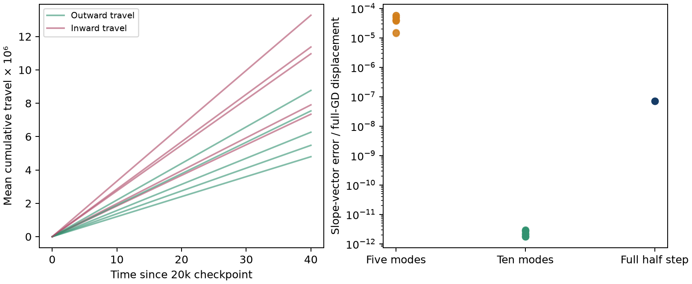
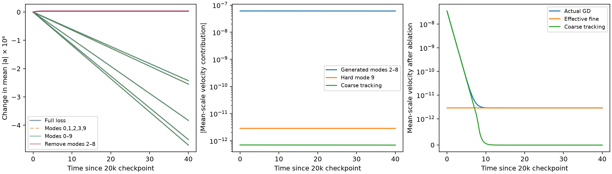
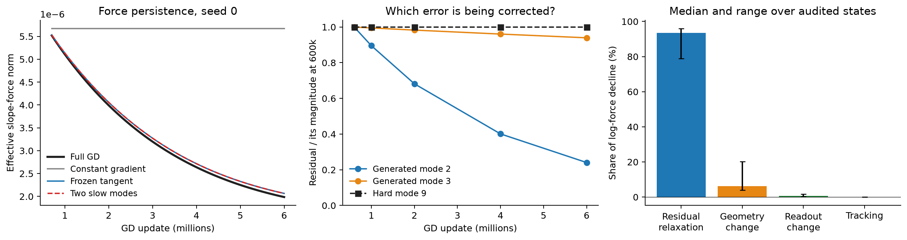
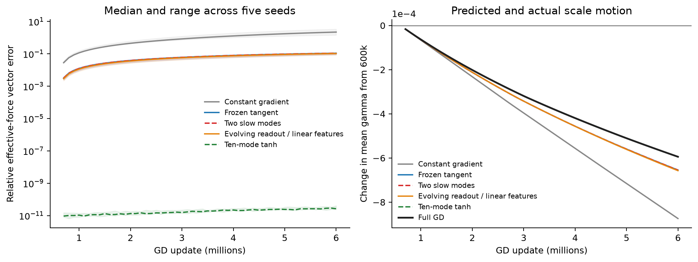
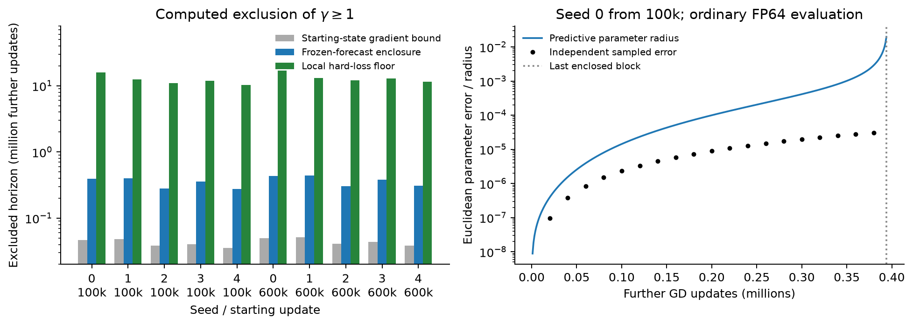

# Conditional scale stagnation: detailed derivations and evidence

The [reader's exposition](d34_coarse_balance_stagnation.md) develops the argument
as example, theory, and prediction in each section, including the frozen-readout
scale check and the distinction between sine and degree 9. This companion
preserves the full contraction proofs, persistence reductions, numerical bounds,
and experiment records. Its numbered equations and detailed section references
remain available for checking the shorter argument.

Why does noiseless GD continue to make so little progress toward larger slope scales after the constant and linear parts of the fit have settled? The explanation developed here is that the remaining gradient mostly corrects small quadratic and cubic errors introduced by the network itself. Correcting those errors contracts the average slope in the observed states. The large unresolved ninth-degree target supplies very little opposing force because the current features barely respond in that direction.

Two further facts explain persistence. The generated errors relax slowly enough to drive motion for millions of updates. At the same time, almost all the remaining loss is locally difficult to reduce, leaving very little loss decrease available to sustain parameter travel. A model with two evolving error amplitudes explains most of the measured motion; a separate bound on the loss available to GD gives a finite period during which larger scales cannot be acquired.

These claims concern continuation from observed stalled states. Full GD through six million updates still has maximum slope magnitude below 0.211 and relative training MSE near 0.75, far from the intended geometry and precision. Evaluating the conditional bound in ordinary FP64 excludes scale 1 for at least ten million additional updates from each of ten specified checkpoints. This is an analytical theorem with numerically evaluated conditions, not a directed-rounding certificate or a proof of permanent trapping. We do not yet explain entry into this regime from initialization.

**Notation used throughout. Lowercase parameter subscripts and uppercase mode-group subscripts have different roles; this preserves the notation of the [walkthrough](d34_barrier_theorem_walkthrough.md).**

| Symbol | Meaning |
|---|---|
| $W,m$ | Number of neurons and training points. |
| $\theta=(a,b,c,d)$ | All parameters: slopes, hidden biases, readout weights, and output bias. Index $j$ selects a neuron. |
| $\gamma_j=\lvert a_j\rvert$ | Slope magnitude, called scale or gamma here. |
| $f_\theta,r,L$ | Network output, residual $r=f_\theta-y$, and loss $L=\Vert r\Vert_m^2/2$. The empirical norm uses a mean over the $m$ training points. |
| $g_a=\nabla_aL$, $g_c=\nabla_cL$ | Full slope and readout gradients. **The subscript $c$ means readout weights.** GD moves in the negative-gradient direction. |
| $q_k,\varphi_k,Y_k,e_k$ | Degree-$k$ output shape, network coefficient, target coefficient, and residual coefficient $e_k=\varphi_k-Y_k$. The shapes are empirically orthonormal. |
| $e_C,e_H$ | Coarse residual coefficients (constant and linear) and retained higher-degree coefficients. Uppercase $C,H$ label groups of output modes. |
| $J_{c,C}$ | Derivative of the coarse coefficients with respect to readouts: coarse modes are rows, readout parameters are columns. Other Jacobians follow the same convention. |
| $K$, $C=K_{CC}$, $B=C^{-1}K_{CH}$ | Residual-coupling matrix, its coarse block, and the map defining instantaneous coarse balance. Standalone $C$ is a matrix. |
| $z_C=e_C+Be_H$ | Departure from that balance. Small $z_C$ need not mean small raw coarse residual $e_C$. |
| $q_c^z=J_{c,C}^Tz_C$ | Contribution of coarse disequilibrium to the readout gradient. Despite the letter $q$, this is a parameter vector, not a basis function $q_k$. |
| $F_a=T_ae_H$, $F_c=T_ce_H$ | Effective fine contributions to slope and readout gradients, including the coarse response at balance. Their velocity contributions are $-F_a,-F_c$. |
| $S$ | Effective coupling matrix governing fine-residual relaxation at coarse balance. |
| $\eta$, $t=n\eta$ | Common GD step and corresponding flow time. All parameter blocks use the same rate. |
| $\beta=Wac$, $z$ | Coarse output and scalar tracking error in the identical-neuron polynomial surrogate only. There $a,c$ denote common parameter values. |
| $V_G,V_9,V_R$ | Signed mean-gamma velocities from generated lower modes, the hard mode, and remaining forces. |
| $p,\Gamma,D_{p,\Gamma}$ | Fraction of neurons required to reach scale $\Gamma$, and Euclidean slope distance to that event. This is $\mathcal D_{p,\Gamma}$ in the walkthrough. |

### The argument and how to read it

The note answers four questions in order. Each needs a different kind of result.

1. **Why can fitting error shrink slopes?** Sections 1–5 isolate the direction mechanism. After defining coarse balance, a small surrogate shows why preserving the coarse output while flattening features can reduce unwanted cubic error. Its contraction theorem is conditional and restricted to identical neurons.
2. **Does that mechanism describe the observed network?** Sections 6–8 test it on heterogeneous tanh networks. Quadratic error is also essential, and individual neurons move in both directions. The transport formulation converts their outward travel into a population-acquisition bound.
3. **Why does the regime last, and for how long can acquisition be excluded?** Sections 9–10 develop and test the two-error predictor, then bound actual GD using the small amount of loss it can remove locally. Small coarse disequilibrium alone supplies neither conclusion.
4. **What happens when we weaken the identified force?** Section 11 predicts the immediate and coupled response to selective attenuation, then states what additional control turns that response into an acquisition bound. Its proposed interventions have not yet been run.

For the latest explanation, read Section 1, then [Section 9](#9-from-a-force-decomposition-to-a-persistence-prediction) and its evidence in Section 10. [Section 11](#11-perturbing-the-identified-effective-force) develops the next tests. Sections 2–5 explain the sign mechanism in detail. The technical estimates needed to evaluate the finite-time bounds are collected in Appendices A–B. Appendix C preserves the separate optimal-readout hypothesis and its unverified assumptions.

## 1. What small readout disequilibrium actually controls

The regime of interest suppresses one contribution to the readout gradient. Readouts can still move, and the fine residual can still drive slopes. This section identifies the surviving force and explains why small readout disequilibrium must be checked at the scale relevant to slope motion.

### Start with parameters, errors, and gradients

The network and loss on the fixed training inputs are

$$
f_\theta(x)=d+\sum_{j=1}^W c_j\tanh(a_jx+b_j),\qquad
r=f_\theta-y,\qquad L=\tfrac12\|r\|_m^2,
\qquad \|r\|_m^2=\frac1m\sum_{i=1}^m r(x_i)^2.
$$

In particular, $g_c=\nabla_cL$ is the full readout-weight gradient, and $g_a=\nabla_aL$ is the full slope gradient. The update is $\theta_{n+1}=\theta_n-\eta\nabla L(\theta_n)$. We use “force” for a gradient contribution throughout: a positive slope force decreases a positive slope. Dotted equations describe the corresponding gradient-flow vector field; discrete GD claims are stated separately.

To distinguish the errors driving that update, resolve the residual into fixed orthonormal shapes $q_k(x)$. Here $k$ is polynomial degree: $q_0$ is constant, $q_1$ linear, $q_2$ quadratic, and so on. Define $\varphi_k=\langle q_k,f_\theta\rangle_m$, $Y_k=\langle q_k,y\rangle_m$, and $e_k=\varphi_k-Y_k$. In the degree-9 problem, the target has coarse components and a ninth-degree component. Its quadratic and cubic target coefficients are zero, so nonzero $e_2,e_3$ are errors generated by the network itself. “Fine” below includes all degrees above 1, including these unwanted lower modes.

### Coarse balance removes the fast response from the description

The coarse residual is $e_C=(e_0,e_1)^T$; $e_H$ collects the retained higher-degree coefficients. A modal Jacobian records how a parameter changes those coefficients. For example, $(J_{c,C})_{kj}=\partial e_k/\partial c_j$ for $k=0,1$. Concatenate all parameter blocks into $J$ and set $K=JJ^T$. Gradient flow then gives $\dot e=-Ke$ when the basis is complete, with an additional omitted-residual force otherwise.

The coarse part of this equation is $\dot e_C=-Ce_C-K_{CH}e_H$, apart from that omitted force, where $C=K_{CC}=J_CJ_C^T$. If $C$ is invertible, the coarse residual that balances this instantaneous forcing is

$$
e_C^{\rm bal}=-Be_H,\qquad B=C^{-1}K_{CH},\qquad
z_C=e_C-e_C^{\rm bal}=e_C+Be_H.
$$

This balance may be nonzero: fine-error fitting also changes the coarse output, so a small coarse residual can counteract that change. The error $z_C$ measures departure from this moving balance. It is not the full coarse residual, and setting it to zero is not a readout-fitting operation performed by GD.

Substituting $e_C=-Be_H+z_C$ into the readout gradient gives three interpretable pieces:

$$
\begin{aligned}
g_c&=\underbrace{T_ce_H}_{\text{effective fine contribution}}
+\underbrace{q_c^z}_{\text{coarse disequilibrium}}
+\underbrace{g_{c,\perp}}_{\text{omitted residual}},\\
q_c^z&=J_{c,C}^Tz_C,\qquad
T_c=J_{c,H}^T-J_{c,C}^TB.
\end{aligned}
\tag{S1}
$$

The subscript $c$ in both $g_c$ and $q_c^z$ identifies readout parameters. Only the second term is the coarse-disequilibrium contribution. With the omitted contribution controlled, suppressing it leaves readout evolution driven by $F_c=T_ce_H$.

The same substitution for slopes defines $T_a=J_{a,H}^T-J_{a,C}^TB$ and $F_a=T_ae_H$. For the complete fine complement, the coupled equations are

$$
\dot a=-F_a-J_{a,C}^Tz_C,\qquad
\dot e_H=-Se_H-K_{HC}z_C,\qquad
S=K_{HH}-K_{HC}C^{-1}K_{CH}.
$$

The first equation says how error moves slopes. The second says how all parameter motion changes that error. Their coefficients depend on the evolving network. The later reductions approximate this coupled system; they do not infer a small $F_a$ merely from small $z_C$.

### Does a small readout contribution also imply a small slope contribution?

The answer depends on how strongly the two blocks respond to coarse error. Let $M_c=J_{c,C}J_{c,C}^T$ be the readouts' contribution to the coarse kernel. If $M_c$ is positive definite, the following inequality bounds the tracking force on all parameters by the measured readout contribution:

$$
\|J_C^Tz_C\|^2
\le \Omega_c^2\|q_c^z\|^2,\qquad
\Omega_c^2=\lambda_{\max}(M_c^{-1/2}CM_c^{-1/2}).
\tag{S2}
$$

**Proof.** The two squared force norms are $z_C^TCz_C$ and $z_C^TM_cz_C$. Apply the Rayleigh-quotient bound after substituting $M_c^{1/2}z_C$. Similarly, the coarse contribution to fine-residual evolution obeys

$$
\|K_{HC}z_C\|
\le\|K_{HC}M_c^{-1/2}\|\,\|q_c^z\|.
$$

Thus small readout disequilibrium controls the other corrections only with the associated amplification factors. If $M_c$ is singular or poorly conditioned, small $q_c^z$ alone supplies little information about some coarse directions. Including the output bias in the readout block gives a different matrix and should be reported separately. The existing evidence for a small tracking contribution to slopes does not itself establish the readout condition.

For the one-coarse-mode symmetric model below, $M_c=Wa^2$, $C=W(a^2+c^2)$, and $\Omega_c^2=1+c^2/a^2$. This already anticipates why a growing readout-to-slope ratio matters.

## 2. Retain the coarse output in the surrogate

The first question is about direction: why should an unresolved high-degree target coexist with a gradient that shrinks slopes? A small model makes the competition explicit. It must retain the coarse output, because changing a slope also changes the part of the fit that GD has already learned. Near coarse balance, a readout increase can compensate for a slope decrease. Along a curve preserving the coarse output, this reduces the unwanted cubic output, but also weakens the already small ninth-degree output.

We will show that the loss saved by removing cubic error can exceed the loss incurred by worsening the hard fit. This identifies an inward direction available to ordinary joint training. The symmetry assumption below makes its sign calculable; it is not a claim that the observed neurons are identical.

Take fixed orthonormal modes $q_1,q_3,q_9$ and fixed feature coefficients $\alpha_1=1$, $\alpha_3\ne0$, $\alpha_9>0$. Define the surrogate output by

$$
F=\varphi_1q_1+\varphi_3q_3+\varphi_9q_9,\qquad
\varphi_k=\alpha_k\sum_j c_ja_j^k,
\qquad \alpha_1=1,
$$

$$
y=Y_1q_1+Y_9q_9,\qquad Y_1,Y_9>0,\qquad
e_1=\varphi_1-Y_1,\quad e_3=\varphi_3,\quad e_9=\varphi_9-Y_9,
\qquad L=\tfrac12(e_1^2+e_3^2+e_9^2).
\tag{S3}
$$

This is an odd-output surrogate. A fitted constant mode can be added independently. The model omits hidden biases and the other nonlinear modes; it is not a Taylor truncation of the full tanh model. Keeping $\alpha_3$ explicit allows its sign to differ from $\alpha_9$, as it does for the leading cubic and ninth-degree terms of tanh. No numerical gamma threshold is transferred from this model to D34.

Ordinary equal-rate gradient flow trains both parameter blocks:

$$
\dot a_j=-c_j(e_1+3\alpha_3a_j^2e_3+9\alpha_9a_j^8e_9),
\qquad
\dot c_j=-a_j(e_1+\alpha_3a_j^2e_3+\alpha_9a_j^8e_9).
\tag{S4}
$$

Simultaneous GD uses these same gradients at the old state. No readout fitting solve, parameter projection, or rebalancing step is part of that algorithm.

### Exact coarse balancing in the symmetric sector

We now compute the slope/readout motion that preserves the coarse fit to first order. Suppose all neurons have the same $a>0$ and $c>0$. Here $a,c$ are scalar common values, and $g_a,g_c,F_a,F_c$ below are gradients per neuron. Symmetry is preserved by both flow and GD. Write $\beta=Wac$, so

$$
\varphi_3=\alpha_3\beta a^2,\qquad
\varphi_9=\alpha_9\beta a^8.
$$

The general balance calculation in Section 1 now has just one coarse mode. Its kernel is the scalar $C=W(c^2+a^2)$, its response map has entries $B_3,B_9$, and its tracking error is the scalar $z$. Computing the two entries gives

$$
B_3=\frac{\alpha_3a^2(3c^2+a^2)}{c^2+a^2},\qquad
B_9=\frac{\alpha_9a^8(9c^2+a^2)}{c^2+a^2},\qquad
z=e_1+B_3e_3+B_9e_9.
\tag{S5}
$$

Substitution separates the gradients into tracking and effective fine contributions. The useful result is that the two effective contributions have opposite signs: when the slope decreases, the readout increases. All that remains to decide that direction is the sign of the scalar expression $\mathcal H$:

$$
g_a=cz+F_a,\qquad g_c=az+F_c,
$$

$$
F_a=\frac{2ca^6}{c^2+a^2}\,\mathcal H(a,\beta),\qquad
F_c=-\frac ca F_a,
\qquad
\mathcal H(a,\beta)=\alpha_3^2\beta-4\alpha_9Y_9a^4
+4\alpha_9^2\beta a^{12}.
\tag{S6}
$$

For example, $3\alpha_3a^2-B_3=2\alpha_3a^4/(c^2+a^2)$ and $9\alpha_9a^8-B_9=8\alpha_9a^{10}/(c^2+a^2)$, which yield the slope formula directly. The corresponding readout differences yield $F_c=-(c/a)F_a$.

The effective directions preserve the coarse output to first order: $cF_a+aF_c=0$. In fact,

$$
\dot\beta=-W(c^2+a^2)z.
\tag{S7}
$$

Consequently, at a state with $z=0$ and $\mathcal H>0$, slopes contract and readouts increase while the coarse output is instantaneously unchanged. This behavior is generated by the effective fine force, including its coarse-balance correction.

Equation (S7) does not make $z=0$ an invariant set. The balance changes as the fine residual and parameters move. For GD, even an update starting at $z=0$ changes the coarse output by a quadratic term:

$$
\beta'-\beta=-\eta W(c^2+a^2)z+\eta^2Wg_ag_c.
$$

The result below therefore treats small tracking force as a condition on the interval, rather than enforcing it through a modified training algorithm.

## 3. A conditional contraction result

The result is a finite-interval statement: sufficiently small positive slopes keep shrinking while the coarse output stays substantial and the tracking force remains smaller than the inward fine force. A large hard residual can remain throughout. For GD we also need a step small enough not to jump through zero. These conditions describe a regime to check; the proposition does not prove that training enters it.

The competition is visible in $\mathcal H$ from (S6). Generated cubic error contributes $+\alpha_3^2\beta$, whereas the opposing hard-target term is suppressed by $a^4$. In particular,

$$
4\alpha_9Y_9a^4<\alpha_3^2\beta
\quad\Longrightarrow\quad \mathcal H(a,\beta)>0.
\tag{S8}
$$

The cubic term enters through its square: its contraction effect does not depend on the sign convention for $q_3$. The hard target supplies the competing negative term in $\mathcal H$, but it is multiplied by $a^4$. This identifies a region in parameter space where the effective force points toward smaller scales, without predicting when training enters that region.

**Proposition.** Fix a slope cap $\bar a>0$, a coarse-output lower bound $\beta_*>0$, and a relative tracking tolerance $0\le\delta<1$ such that

$$
4\alpha_9Y_9\bar a^4<\alpha_3^2\beta_*.
$$

Start the symmetric surrogate at $0<a_s\le\bar a$ and $c_s\ge a_s$. On an interval where $\beta\ge\beta_*$ and the readout tracking force satisfies

$$
|az|\le\delta\frac ac F_a,
\tag{S9}
$$

the slope is nonincreasing and the readout is increasing under flow. For simultaneous GD the same conclusion holds at every update for which these conditions and

$$
\eta(1+\delta)F_a<a
\tag{S10}
$$

hold at the old state. No particle acquires a threshold above $\bar a$ while the conditions persist.

**Proof.** As long as $a\le\bar a$ and $\beta\ge\beta_*$, (S8) ensures $F_a>0$. Equation (S9) implies $|cz|\le\delta F_a$, hence

$$
(1-\delta)F_a\le g_a\le(1+\delta)F_a.
$$

Thus $\dot a=-g_a<0$. Also $g_c=-(c/a)F_a+az<0$ whenever $c\ge a$, because $|az|\le\delta(a/c)F_a<(c/a)F_a$. It follows that $c$ increases, so $c\ge a$ is preserved. A first-exit argument prevents $a$ from increasing through $\bar a$. Moreover, $F_a\le2W(\alpha_3^2+4\alpha_9^2\bar a^{12})a^7$ in this region, so the slope cannot reach zero in finite flow time. In GD, (S10) ensures $0<a'=a-\eta g_a<a$, and the same bound on $g_c$ gives $c'>c$. Induction proves the claim until a stated regime condition fails. The slope cap is a conclusion, not an assumption imposed throughout the trajectory.

**Remaining-error corollary.** If the interval also satisfies $\beta\le\beta^*$ and $\alpha_9\beta^*\bar a^8\le Y_9/2$, then $|e_9|=Y_9-\alpha_9\beta a^8\ge Y_9/2$. Thus the contraction result can coexist with a uniformly substantial hard residual. This additional coarse-output upper bound is a condition to control or measure.

The conditions on $\beta$ and tracking are substantive. This proposition does not prove that coarse tracking remains accurate indefinitely, nor that arbitrary D34 particles become positive and identical. It establishes a contraction mechanism inside an explicit sector of an ordinary-GD surrogate.

### Why the readout condition has this particular scale

The tracking tolerance in the proposition compensates for a specific amplification: the same coarse mismatch acts more strongly on slopes when readouts are large. In this sector $q_c^z=az$ and $q_a^z=cz$, so $q_a^z=(c/a)q_c^z$. To keep tracking smaller than a fraction of the slope force, the readout tracking force must therefore be smaller by the compensating factor $a/c$, as in (S9). A small ratio $|q_c^z|/|F_c|$ alone is insufficient when $c/a$ is large: the corresponding slope ratio is

$$
\frac{|q_a^z|}{F_a}
=\frac{c^2}{a^2}\frac{|q_c^z|}{|F_c|}.
\tag{S11}
$$

This is an experimentally testable qualification of the proposed regime. Report absolute forces and the transfer factor along with readout-relative smallness. Near cancellation, a ratio with a nearly zero denominator should be marked unresolved rather than stabilized into an apparent finding.

### The loss calculation behind the contraction

The sign criterion also has a direct optimization interpretation. Preserve the coarse output by increasing $c$ as $a$ decreases, and compare the two changes in fine loss. The cubic error costs order $a^4$ in loss; the leading improvement in the hard fit is only order $a^8$. At small scales, reducing the first wins. Algebraically, at fixed $\beta$,

$$
V_\beta(a)=\tfrac12\left[\alpha_3^2\beta^2a^4
+(\alpha_9\beta a^8-Y_9)^2\right],\qquad
V_\beta'(a)=2\beta a^3\mathcal H(a,\beta).
\tag{S12}
$$

Reducing the unwanted cubic output saves loss at order $a^4$. The leading benefit of fitting the ninth-degree target appears at order $a^8$. At sufficiently small scales, flattening therefore decreases loss even as it reduces the already weak representation of the hard target. Large remaining hard error is compatible with an inward scale force.

The readout must vary as $c=\beta/(Wa)$ along this coarse-output level set. Its induced Euclidean metric is $W(1+c^2/a^2)$, and

$$
F_a=\frac{V_\beta'(a)}{W(1+c^2/a^2)}.
$$

This reproduces (S6) at $z=0$ and explains the direction using the loss itself. The level-set calculation is an interpretation of the instantaneous effective field. Actual GD uses (S4) and the evolving $z$; it does not solve a constrained optimization problem at each update.

Keeping $\beta$ fixed in an idealized projected flow would give $\dot a\sim-2\alpha_3^2Wa^7$ as $a\to0$, and hence $a\sim(12\alpha_3^2Wt)^{-1/6}$. This illustrative slow contraction requires fixed $\beta$ and $c=\beta/(Wa)$, with readouts growing without bound. It is not an asymptotic claim for ordinary GD or tanh. The conditional sign result does not depend on this idealization.

## 4. The local contraction mechanism survives exact tanh

The polynomial model could suggest an inward direction that disappears when the full activation is restored. This section rules out that concern locally in the same symmetric sector: for exact tanh, generated lower-degree error still dominates the scale derivative of the fine loss at sufficiently small positive slopes. It does not yet establish the direction for heterogeneous D34 states.

Retain identical positive slopes and readouts, set hidden biases to zero, and use a symmetric training grid on which the degree-9 polynomial mode is resolved. Let $q_1=x/\sigma$, where $\sigma=\|x\|_m$, and let $q_9$ be normalized and orthogonal to all lower-degree polynomials. An already fitted constant target can be represented by the output bias. The remaining target is $Y_1q_1+Y_9q_9$.

Define

$$
\psi_1(a)=\langle q_1,\tanh(ax)\rangle_m,\qquad
w(a)=\frac{P_H\tanh(ax)}{\psi_1(a)},
$$

where $P_H$ removes the constant and linear components and retains their full empirical orthogonal complement. On a level set of coarse output $\beta=Wc\psi_1(a)>0$, the fine loss is exactly

$$
V_\beta^{\tanh}(a)=\tfrac12\|\beta w(a)-Y_9q_9\|_m^2.
$$

**Local direction result.** For fixed $\beta>0$ and finite $Y_9$, the derivative of this fine loss is positive for all sufficiently small $a>0$. The small-scale cap can be chosen uniformly when $\beta$ ranges over a fixed compact positive interval. Hence the exact effective slope force is inward in this symmetric sector. This statement concerns the force after coarse balancing; the actual slope direction still requires control of the tracking contribution.

**Proof.** The Taylor expansion and empirical orthogonality give

$$
\psi_1(a)=\sigma a+O(a^3),\qquad
w(a)=-\frac{a^2}{3\sigma}P_Hx^3+O(a^4),
\qquad \langle q_9,w(a)\rangle_m=O(a^8).
$$

The vector $P_Hx^3$ is nonzero on the stated grid. With $\kappa_3^2=\|P_Hx^3\|_m^2/(9\sigma^2)>0$, analyticity of the finite-grid expressions therefore yields

$$
\frac{dV_\beta^{\tanh}}{da}
=2\beta^2\kappa_3^2a^3
+O(\beta^2a^5)+O(\beta|Y_9|a^7)>0
$$

for sufficiently small positive $a$. Along the coarse-output level set,

$$
\frac{dc}{da}=-\frac{c\psi_1'(a)}{\psi_1(a)},\qquad
F_a^{\tanh}
=\frac{dV_\beta^{\tanh}/da}
{W\left[1+(c\psi_1'/\psi_1)^2\right]},\qquad
F_c^{\tanh}=-\frac{c\psi_1'}{\psi_1}F_a^{\tanh}.
$$

These are the Euclidean projected-gradient components tangent to the coarse-output level set, equivalently the effective forces from coarse elimination. Since $\psi_1,\psi_1'>0$ at positive $a$, they give slope contraction and readout growth. The hidden biases remain zero in this odd sector by symmetry.

The corresponding tracking-force ratio is $q_a^z/q_c^z=c\psi_1'/\psi_1\sim c/a$. Thus the need to scale the readout tracking tolerance also survives exact tanh. Once that contribution is smaller than the inward effective slope force, the actual flow points inward; GD additionally requires a step small enough to preserve the slope's positive sign.

This result establishes a local direction for exact tanh, with all its higher modes retained. It supplies neither an explicit D34 gamma boundary nor a persistence theorem for random heterogeneous neurons, and does not establish stability against perturbations that split identical neurons. In transport language, the symmetric population moves inward when its tracking correction is controlled. Extending that inward field to a region containing the observed joint parameter distribution is the next substantive step.

## 5. What survives heterogeneous particles

Identical neurons give a clean sign theorem, but real D34 neurons have different signed parameters. The identity below survives that heterogeneity in the polynomial surrogate: removing generated cubic error decreases slope energy relative to readout energy. This suggests what to measure in the full network, while stopping short of a contraction theorem for every neuron or even for total slope energy.

To compare the two layers, define their difference in squared parameter norms,

$$
I=\tfrac12\left(\sum_j a_j^2-\sum_j c_j^2\right).
$$

Using (S4), the coarse contributions cancel between the two layers, giving

$$
\dot I=-2\varphi_3^2+8(Y_9-\varphi_9)\varphi_9.
\tag{S13}
$$

Indeed, the slope derivative of mode $k$ contributes $-k e_k\varphi_k$ to the slope energy, while its readout derivative contributes $-e_k\varphi_k$ to the readout energy. Their difference is $-(k-1)e_k\varphi_k$. The factor is zero for the coarse mode, two for the cubic mode, and eight for the ninth-degree mode.

For simultaneous GD, the exact counterpart is

$$
I'-I=\eta\left[-2\varphi_3^2+8(Y_9-\varphi_9)\varphi_9\right]
+\frac{\eta^2}{2}(\|g_a\|^2-\|g_c\|^2).
\tag{S14}
$$

When the hard-mode contribution is small, correction of the generated cubic output decreases hidden-layer energy relative to readout energy. This supports investigating flattening accompanied by readout growth. It does not alone prove decreasing slope energy: both energies could increase with the readout increasing faster. Population stagnation in heterogeneous tanh networks still requires signed slope motion, its distribution, and the terms omitted by this surrogate.

## 6. Testing the mechanism from observed stalled states

The experiment tests the direction mechanism and the conditions supporting it, using all five existing degree-9 seeds. Its starting states are observed checkpoints, leaving entry from initialization for a later question. The current theory does not justify selecting only seeds with contraction or declaring a fixed gamma threshold necessary for every representation.

The implemented experiment has four parts. The five-mode surrogate was chosen after inspecting the existing signed modal forces, before running the new continuations. Its forecast is therefore a test of that fixed, evidence-informed simplification; the original checkpoints are not a held-out selection set.

**Protocol and the question answered by each comparison.**

| Stage | Measurement or comparison | Scientific question |
|---|---|---|
| Existing-state regime audit | At joint-GD updates 20k, 100k, and 600k, reconstruct readout, slope, and bias tracking forces; $M_c$, $\Omega_c$; retained and omitted fine forces. | Is readout disequilibrium actually negligible at the scale relevant to slope motion? |
| Direction and mode audit | Decompose the effective force into generated lower-mode contributions and the hard mode. Measure $-a^TF_a$, mean signed gamma velocity, and each neuron's outward force. | Does correcting generated error drive contraction, or do heterogeneous contributions change the sign? |
| Autonomous short forecasts | From the unmodified 20k and 100k states, compare full tanh GD with exact-tanh residual losses retaining modes $\{0,1,2,3,9\}$ and $\{0,\ldots,9\}$. | Does a small modal system preserve the observed coupled evolution over the next interval? |
| Lower-mode intervention and force probes | Remove the loss penalties on modes 2–8 in a fourth continuation arm; separately vary their weight and the hard-target coefficient at fixed parameters. | Does removing the proposed inward force reverse effective motion, and does the remaining hard force acquire appreciable scale? |

The first audit uses [retained checkpoint states](../results/checkpoint_D_optimizers/expD34_readout_race/useful_slopes/curated/states) and the existing modal Jacobians. It deduplicates unchanged-GD states across fork archives, records $q_c^z$ separately from the output-bias contribution, and measures the other blocks directly. The continuations accumulate the tracking contribution as well as sampling its magnitude, since a small force can still matter when integrated over time.

The direction audit retains the original mode labels and signed projections. Under the degree-9 target, the retained lower-mode coefficients are generated by the network itself. Their individual force norms do not add. The audit therefore measures the combined effective force's contributions to slope energy, mean gamma, and each neuron's outward velocity. The continuations check the full tanh layer-balance identity in the [technical note](d34_transport_scale_barrier.md#2-layer-balance-exposes-the-source-of-readout-amplification); (S13) remains an identity of the polynomial surrogate.

The continuations use width 177, 2,048 training midpoints, random-readout checkpoint arrays, FP64, and raw-coordinate step $\eta=0.002$. They forecast 20,000 updates, or physical time 40, from each of the two starting checkpoints and five seeds. The four arms give 40 continuations. Matched half-step controls use seed 0 at both starts in all four arms, giving eight additional numerical controls. Each control takes 40,000 updates at $\eta=0.001$ over the same physical interval.

Each modal surrogate evaluates exact tanh features and its own retained residual at its own current parameters. All four parameter blocks train simultaneously. This retains the exact activation and observed starting geometry while testing the residual simplification suggested by the analytical model. The ten-mode arm tests whether the modes omitted by the five-mode arm matter over the forecast interval. No arm imports later true parameters, freezes the kernel, refits readouts, or imposes $z_C=0$.

The intervention trains the squared norm of $r-P_{2:8}r$, where $P_{2:8}$ is the orthogonal projection onto modes 2–8. The target and initial parameters stay fixed. This removes the penalty on the generated lower modes while retaining the full complementary residual, including degrees above 9. It changes the coarse balance of the gradient, so its initial raw velocity need not be explained by its effective fine velocity.

Force and motion diagnostics are sampled every 200 reference updates, with additional samples at offsets 1, 2, 5, 10, 20, 50, and 100 to resolve the intervention's initial transient. Slope path and positive/negative gamma travel are accumulated at every actual update. So is the exact coarse-projection contribution to signed gamma travel. If $g$ is the gradient of the active loss and $J_C$ contains the two coarse Jacobian rows, this contribution uses

$$
q^{\rm exact}=J_C^T(J_CJ_C^T)^{-1}J_Cg.
$$

This identity uses the full empirical complement. Sampled degree-65 tracking and omitted forces remain separate diagnostics. Their agreement with the exact projection and with degree-129 reconstructions checks numerical resolution. Initial and terminal parameters, coarse output, hard residual, and slope distributions are retained. Forecast discrepancies are compared with half-step discrepancies and with the motion being explained; no empirical accuracy cutoff is promoted to a theorem hypothesis.

The hard-target probe is a diagnostic at fixed parameters. The effective force is affine in the varied target coefficient, so a chosen signed projection has a directly computable zero whenever the hard-mode projection is nonzero. The implemented probe uses mean gamma velocity. In the symmetric analytical model the mean-gamma and slope-energy directions have the same zero,

$$
Y_9^{\rm crit}(a,\beta)
=\frac{\alpha_3^2\beta}{4\alpha_9a^4}
+\alpha_9\beta a^8.
\tag{S15}
$$

The leading $a^{-4}$ dependence is a conditional prediction of that sector. For the actual tanh states, the diagnostic computes the zero from the effective modal forces and records the associated change in the raw gradient's coarse tracking error. It does not predict an actual-GD direction after a target change unless the required tracking condition remains satisfied.

All of these are optimization-mechanism measurements on the training grid. There is no statistical generalization claim. Full approximation errors accompany the motion diagnostics, but partial error reduction is not the success criterion for scale acquisition.

## 7. What the audit and continuations establish

The experiments support the proposed source of contraction, with an essential refinement: quadratic error matters alongside cubic error. The combined force contracts the mean even though almost half the neurons move outward. Removing the generated-error penalties reverses the effective mean direction, but leaves too little force for appreciable scale acquisition. The three subsections establish those findings through signed attribution, autonomous forecasts, and an intervention, respectively.

### Direction and regime

The first empirical question has a definite answer in the retained degree-9 trajectories: correcting generated lower modes supplies an inward mean-scale force, and the hard target supplies a much weaker outward force. Across five seeds and 301 retained joint-GD checkpoints per seed from updates 20k through 600k, this sign pattern holds at every sampled state. The combined inward contribution of modes 2–8 is between 8,098 and 29,718 times the outward contribution of mode 9. These are signed contributions to $d\operatorname{mean}|a|/dt$, not comparisons of force norms. The checkpoints are correlated observations along five trajectories, not 1,505 independent trials.

The original cubic picture needs one material correction. Mode 2 accounts for 14.1–63.4% of the generated inward mean-scale velocity, with mode 3 supplying almost all the remainder. The even contribution cannot be discarded on the ground that the target's fine component is odd. The actual hidden biases and heterogeneous signed particles generate even output error. The five-mode forecast therefore retains the quadratic mode and the full bias dynamics.

The force comparison explains why correcting a small generated error takes precedence over a large unresolved target. The relevant force is $T_{a,k}e_k$, so residual magnitude alone does not decide its importance. The measured slope sensitivity to mode 9 is millions of times smaller than the sensitivities to the generated modes. The network can reduce a small error through its current parameter directions much more readily than it can address the large hard residual.

**Force and sensitivity ranges over the 15 audited states, using empirical orthonormal modes and raw slope coordinates. Sensitivity denotes the Euclidean norm of the effective slope-map column $T_{a,k}$.**

| Mode | Residual magnitude $\lvert e_k\rvert$ | Slope sensitivity $\lVert T_{a,k}\rVert$ | Effective force norm $\lVert T_{a,k}e_k\rVert$ |
|---|---:|---:|---:|
| Generated quadratic, 2 | $4.27\times10^{-4}$–$1.03\times10^{-3}$ | $9.11\times10^{-3}$–$1.10\times10^{-2}$ | $4.18\times10^{-6}$–$1.14\times10^{-5}$ |
| Generated cubic, 3 | $7.64\times10^{-4}$–$9.85\times10^{-4}$ | $2.35\times10^{-3}$–$2.97\times10^{-3}$ | $1.79\times10^{-6}$–$2.92\times10^{-6}$ |
| Hard target, 9 | Approximately $0.8660254$ | $2.15\times10^{-10}$–$6.88\times10^{-10}$ | $1.86\times10^{-10}$–$5.96\times10^{-10}$ |

The norm comparison establishes the disparity in available force. The signed projections above establish that the combined generated force points inward in the mean. Both facts are needed: a large force need not contract scales, and a large residual need not supply a large outward force.

The scale of the question also determines which terms may be neglected. Modes 4–8 contribute little relative to the dominant contraction, but their combined inward mean-scale contribution is 18–84% of the outward hard-mode contribution at these states. A five-mode model can therefore explain the present bulk motion accurately while requiring refinement near a putative direction reversal. The ten-mode control tests the more complete residual description. Agreement on contraction should not be interpreted as precision on the much smaller competing outward force.

The direct regime audit uses the 20k, 100k, and 600k states from each seed. Across those 15 states, the readout tracking-force norm is only $2.56\times10^{-5}$ to $5.57\times10^{-5}$ of its effective fine-force norm. The amplification factor $\Omega_c$ in (S2) is 1.57–1.63, and the readout coarse matrix is resolved. Slope tracking is also measured directly: its relative norm is $3.96\times10^{-6}$ to $2.12\times10^{-5}$. Thus the small-readout-force condition is supported here without relying on an ill-conditioned transfer to slopes.

This direction result does not make the symmetric contraction theorem a particlewise description of D34. At the same audited states, 46.3–50.3% of neurons have positive instantaneous gamma velocity. Generated modes contract the total slope energy as well as the mean scale, but individual neurons move in both directions. Readout motion likewise need not follow the common-readout sector's monotonicity. The appropriate population question is how much outward travel remains available, and whether it can carry any appreciable mass to larger scales.

### Autonomous forecasts

The full-loss continuations preserve the observed stagnation over physical time 40. Across the ten starting cases, mean gamma decreases by $2.38\times10^{-6}$ to $4.70\times10^{-6}$. Mean outward travel is nevertheless $4.68\times10^{-6}$ to $8.77\times10^{-6}$, accompanied by greater inward travel. The largest cumulative outward movement of any neuron in these runs is $9.97\times10^{-5}$. The hard residual remains approximately $-0.8660254$.

The accumulated signed contribution from exact coarse tracking is $2.66\times10^{-11}$ to $1.58\times10^{-10}$. This confirms the distinction between the two mechanisms over the forecast interval: there is measurable motion and a persistent hard error, but the net slope contraction is carried by the effective fine field.

Both modal surrogates reproduce the coupled motion. We assess accuracy relative to the motion being explained by normalizing the endpoint slope-vector error by the full-GD slope displacement,

$$
E_a=\frac{\|a_{\rm comparison}(t)-a_{\rm full}(t)\|_2}
{\|a_{\rm full}(t)-a_{\rm full}(s)\|_2}.
$$

**Autonomous slope forecasts over physical time 40. Surrogate ranges cover five seeds and both starts; the full-loss half-step comparison covers seed 0 at both starts.**

| Comparison with full GD | Cases | Endpoint error $E_a$ |
|---|---:|---:|
| Five-mode loss, $\{0,1,2,3,9\}$ | 10 | $1.43\times10^{-5}$–$5.83\times10^{-5}$ |
| Ten-mode loss, $\{0,\ldots,9\}$ | 10 | $1.75\times10^{-12}$–$2.98\times10^{-12}$ |
| Full loss at the matched half step | 2 | $7.03\times10^{-8}$–$7.06\times10^{-8}$ |

The five-mode discrepancy is resolved above the half-step difference but is less than 0.006% of the motion being explained. The ten-mode discrepancy is below that numerical control. This supports reducing the residual forcing in the observed regime while retaining exact tanh features, biases, readouts, and their coupled evolution. It does not establish an autonomous closure in the residual coefficients alone or forecast behavior beyond the tested interval.

The agreement also extends to the other trained blocks. Across sampled times in the five-mode forecasts, hidden-bias, readout-weight, and output-bias errors stay below $9.24\times10^{-9}$ in their respective Euclidean norms. Each coarse-output coefficient differs from full GD by at most $7.88\times10^{-11}$. The surrogate preserves the evolving coarse balance through its own parameter updates.

<figure>
  
  <figcaption>Full GD moves neurons in both directions despite net contraction. Left: all five seeds from the 20k checkpoint. Right: endpoint forecast error divided by full-GD displacement; modal comparisons include both starts, while the half-step control uses seed 0.</figcaption>
</figure>

### Removing the generated-error penalty

The intervention reverses the effective mean-scale direction in every starting case. After penalties on modes 2–8 are removed, the terminal effective velocity is outward, between $2.85\times10^{-12}$ and $7.59\times10^{-12}$. The corresponding readout tracking-force ratio has fallen to $1.23\times10^{-5}$–$8.25\times10^{-5}$. Thus the outward effective motion survives the return to a regime with small coarse disequilibrium.

Its magnitude is the decisive limitation. Over physical time 40, the effective fine field contributes only $1.14\times10^{-10}$ to $3.04\times10^{-10}$ of mean-scale travel. The measured net increase is larger, $2.70\times10^{-8}$ to $3.96\times10^{-8}$, because the loss change creates an initial coarse transient. Exact per-update tracking accounts for that difference, with the recorded absolute-value remainder included. The maximum outward travel of any neuron is $3.33\times10^{-7}$. Removing the inward driver does not produce meaningful scale acquisition over this interval.

This separates the source of contraction from the weakness of acquisition. Generated-error correction supplies motion in both directions but has an inward net effect. Removing it reveals an outward hard-mode force that can scarcely move the current features. A sign reversal is therefore evidence about the competing forces, not evidence of recovery into the intended gamma regime.

The fixed-state penalty probe quantifies the same competition. For

$$
L_\lambda=\tfrac12\bigl(\|r\|_m^2-(1-\lambda)\|P_{2:8}r\|_m^2\bigr),
$$

the effective mean velocity is affine in the lower-mode loss weight $\lambda$. Its zero occurs at $\lambda=3.37\times10^{-5}$ to $1.23\times10^{-4}$ across the 15 audited states. A modest reduction of these penalties would consequently retain the inward effective direction. The separate hard-target probe places its fixed-state zero at $Y_9\approx7.0\times10^3$ to $2.6\times10^4$, compared with the actual $Y_9=\sqrt{0.75}$. These are instantaneous effective-force calculations. Both probes also record the changed raw tracking force; only the binary penalty intervention, $\lambda=0$ versus 1, is run as an autonomous continuation here.

<figure>
  
  <figcaption>All runs use simultaneous GD. Left: mean-scale changes for five seeds from the 20k checkpoint; full, five-mode, and ten-mode curves nearly overlap. Center: magnitudes of inward generated-mode forcing and outward hard-mode and tracking contributions for seed 0. Right: removing the lower-mode penalties first induces coarse rebalancing, then leaves a much smaller outward effective force, also for seed 0.</figcaption>
</figure>

## 8. The resulting transport model and its conditional claim

The preceding experiments suggest keeping the full neuron population but retaining only the few residual shapes that drive it. The transport equation makes this distinction precise: a small set of shared error coefficients determines a velocity for every neuron, while their slopes, biases, and readouts continue to evolve. This section writes that surrogate and shows how to translate its outward motion into a bound on the fraction reaching a chosen scale. Mean contraction alone cannot supply that bound.

Let $\rho=W^{-1}\sum_j\delta_{(a_j,b_j,c_j)}$ be the empirical probability measure of neuron parameters. Define the exact empirical tanh coefficients

$$
p_k(a,b)=\langle q_k,\tanh(ax+b)\rangle_m,
\qquad
e_k=W\int c\,p_k(a,b)\,d\rho+d\,\mathbf 1_{k=0}-Y_k.
$$

For $\mathcal K=\{0,1,2,3,9\}$, the five-mode loss is $\tfrac12\sum_{k\in\mathcal K}e_k^2$. Its transport characteristics are

$$
v_a=-c\sum_{k\in\mathcal K}e_k\partial_a p_k,
\qquad
v_b=-c\sum_{k\in\mathcal K}e_k\partial_b p_k,
\qquad
v_c=-\sum_{k\in\mathcal K}e_k p_k,
\qquad
\dot d=-e_0.
$$

Together with $\partial_t\rho+\nabla\cdot(\rho v)=0$, these equations define an autonomous nonlinear surrogate. Simultaneous GD uses their old-state characteristic velocities in its Euler pushforward. The readouts and biases continue to change the modal sensitivities, and the generated errors continue to change the force. No equilibrium solve supplies their future values. There are five retained residual coefficients, but the parameter distribution is still part of the state; this is not a closed five-dimensional ODE.

The heterogeneous counterpart of the contraction criterion is a signed force budget. Write $V_G$ for the mean-gamma velocity contributed by generated modes 2–8, $V_9$ for the hard-mode contribution, and $V_R$ for tracking and all remaining terms. At states without an atom at $a=0$,

$$
\frac{d}{dt}\int |a|\,d\rho=V_G+V_9+V_R.
$$

Consequently, if $V_G<0$ and $-V_G>V_9+|V_R|$ throughout an interval, the mean scale contracts there. This conditional statement does not require identical particles or monotone readouts. What needs explanation is the persistence of that signed inequality under the coupled dynamics. The autonomous modal forecasts test that persistence over a finite interval; the fixed-state attribution alone cannot.

Mean contraction is insufficient to bound acquisition by a minority. For that purpose define the outward travel of a characteristic by $P_+(s,t)=\int_s^t[\dot\gamma]_+\,d\tau$, where $\gamma=|a|$. If $\gamma_0<\Gamma$, transport along characteristics gives

$$
\rho_t\{\gamma\ge\Gamma\}
\le \rho_s\{\gamma>\gamma_0\}
+\frac{\mathbb E[P_+(s,t)]}{\Gamma-\gamma_0}.
$$

Indeed, a particle starting at or below $\gamma_0$ must accumulate at least $\Gamma-\gamma_0$ of outward travel to reach $\Gamma$. The same bound holds for the mass that reaches $\Gamma$ at any time in the interval. For GD, use the exact sum $P_+=\sum_n[|a_{n+1}|-|a_n|]_+$; no gradient-flow approximation or assumption about sign crossings is needed. This is the link from the direction mechanism to a conditional acquisition barrier: inward average motion describes the bulk, while an independently measured outward-travel budget controls the possible escaping population.

## 9. From a force decomposition to a persistence prediction

An inward force at one state does not explain why acquisition fails for millions
of subsequent updates. There are two plausible explanations for its persistence:
the errors driving it may simply take a long time to relax, or evolving
parameters may continually renew the force. The experiments in Section 10
favor slow relaxation in the observed regime. Two evolving error amplitudes,
with their responses across all parameters held fixed, predict most of the
motion.

This section develops that explanation and then asks a stronger question:
can we exclude acquisition for actual GD without knowing its future trajectory?
The answer uses the loss that GD can remove before leaving a specified
neighborhood. A large remaining hard error need not provide a large movement
budget when that error is almost impossible to reduce locally.

The distinctions below matter when interpreting the result.

**Three claims and what each establishes. All start from a specified checkpoint.**

| Claim | Conclusion | Additional requirement |
|---|---|---|
| Two-error reduction | Slow generated-error relaxation predicts a small set of possible motion directions and their timescales. | Fixed effective sensitivities, nearly fixed hard residual, and negligible remaining forces. |
| Forecast enclosure | Actual GD stays within a computed distance of an autonomous forecast for a finite interval. | Uniform bounds on the forecast defect and GD-map derivative in an enclosed neighborhood. |
| Local-loss bound | Actual GD cannot travel far enough to acquire a specified scale before a computed horizon. | A local loss floor, a curvature bound, and a small enough GD step. No surrogate is required. |

### Separate slow error relaxation from changes in sensitivity

Before simplifying the dynamics, we need a diagnostic that can distinguish
the two persistence mechanisms. The fine force $F_a=T_ae_H$ is a product:
the errors $e_H$ supply its amplitudes and the map $T_a$ converts them into
slope gradients. A nearly constant $\|e_H\|$ is uninformative here because
the large ninth-degree residual dominates that norm while much smaller errors
carry the force. Differentiating the product separates the sources of change.
With the complete fine complement and equal rates, the exact flow identity is

$$
\dot F_a=\dot T_ae_H-T_aSe_H-T_aK_{HC}z_C.
\tag{P1}
$$

The first term changes sensitivity, the second changes the driving error, and
the third accounts for coarse tracking. Measuring their signed projections
onto the force distinguishes gradual error removal from continual renewal
through changing sensitivities. To test whether the hard residual renews
the generated errors, collect the quadratic and cubic coefficients in
$e_G=(e_2,e_3)^T$. Their equation is

$$
\dot e_G=-S_{GG}e_G-S_{G9}e_9+\text{remaining fine and tracking terms}.
\tag{P2}
$$

The first term relaxes the generated errors; the second can replenish or oppose
them. Their signed contributions must be measured separately. Assuming that
generated errors sit at a replenished equilibrium would introduce a new
timescale-separation hypothesis that has not followed from coarse balance.

### Two generated errors and a weak persistent drive

The simplest useful reduction keeps two changing quantities: the generated
quadratic and cubic errors. It freezes how each error moves the parameters.
Correcting one error still changes the other, and slopes still move together
with biases and readouts. Only the coefficients of these interactions are
held fixed. With a stable step, the resulting prediction is two decaying
contributions to the force plus a persistent contribution from the hard
target, whose small size is checked in the experiments.

Here are the quantities needed to write and solve that model. The index $n=0$
now means the chosen starting checkpoint; $n$ counts additional GD updates.
A hat marks a surrogate prediction.

**Notation for the two-error model. Parameter vectors contain all four trained blocks.**

| Symbol | Meaning |
|---|---|
| $u=(e_2,e_3)^T$ | Two generated residual amplitudes; this is the vector $e_G$ in (P2). |
| $T_G=(T_2,T_3)$ | Two fixed columns mapping those errors into effective full-parameter gradients at the starting state. |
| $h=t_9e_9$ | Fixed effective full-parameter gradient supplied by the hard mode; $t_9$ is its fixed column $T_9$. |
| $A_G=T_G^TT_G$ | $2\times2$ matrix describing how correcting either generated error changes both errors. |
| $u_*$, $f_\infty$ | Forced equilibrium of the two errors, and the force left at that equilibrium. |

Each $T_k$ is the full-parameter version of the effective column $T_{a,k}$
defined in Section 1: stack its slope, hidden-bias, readout, and output-bias
entries. Thus the slope block of $T_Gu+h$ is the predicted effective slope
force. Keeping these columns and the hard residual fixed, imposing perfect
coarse balance, and discarding the remaining fine forces gives

$$
u_{n+1}=u_n-\eta(A_Gu_n+T_G^Th),\qquad
\widehat\theta_{n+1}=\widehat\theta_n-\eta(T_Gu_n+h).
\tag{P2a}
$$

This retains the coupling that determines how correcting an output error
moves each parameter. It assumes that the coupling coefficients vary little,
and that the hard residual varies little, on the interval. Those are additional
approximations to test, not consequences of small coarse disequilibrium alone.

To solve the model, first find the generated errors at which their own
relaxation balances their response to the hard drive. Then diagonalize their
$2\times2$ interaction matrix: each resulting error combination decays by
a constant factor per update. If $A_G$ is positive definite, put
$u_*=-A_G^{-1}T_G^Th$ and $f_\infty=T_Gu_*+h$. For $A_G$'s orthonormal eigenvectors
$v_i$, eigenvalues $\nu_i$, and $b_i=v_i^T(u_0-u_*)$, direct solution gives

$$
u_n=u_*+\sum_{i=1}^2 b_i(1-\eta\nu_i)^n v_i,\qquad
\widehat g_n=f_\infty+
\sum_{i=1}^2 b_i(1-\eta\nu_i)^n T_Gv_i.
\tag{P2b}
$$

For $0<\eta\nu_i<2$, the generated errors relax toward $u_*$. Its size is
computed from the starting state and checked against the observed errors in
Section 10. The force left after relaxation is the component of $h$ orthogonal to the two generated
tangents, because $T_G^Tf_\infty=0$. A large hard residual can therefore
coexist with a very small remaining parameter force. Whether the observed
force is already near this floor or is still slowly relaxing is an empirical
question; the derivative and replenishment audit answers it below.

The solution also answers how much slope travel these errors can supply.
For $0<\eta\nu_i\le1$, each decaying contribution has a geometric sum.
The persistent force instead contributes an amount proportional to elapsed
time. Applying the triangle inequality to the slope updates gives

$$
\sum_{n<N}\|\widehat a_{n+1}-\widehat a_n\|_2
\le
\sum_{i=1}^2 |b_i|\|(T_Gv_i)_a\|_2
\frac{1-(1-\eta\nu_i)^N}{\nu_i}
+\eta N\|(f_\infty)_a\|_2.
\tag{P2c}
$$

The first contribution has a finite total budget; the second grows with the
horizon. This is a useful form of the conditional barrier: slow correction of
generated error supplies limited motion, while a weak hard drive takes a long
time to supply the rest. It permits eventual escape. Transferring this bound
to full GD still requires control of changing tangents, omitted modes, coarse
tracking, and hard-residual drift. The enclosure below handles these errors
together for a closely related frozen full-tangent predictor.

### A frozen tangent retains coupling, but fixes its coefficients

The two-error model deliberately suppresses tracking and other fine modes.
To test the idea that changing sensitivities are a modest correction, we
also need a predictor that freezes the full output response while keeping
all error directions. This is the frozen-tangent model. “Tangent” means the
first-order change in output caused by a parameter displacement. Freezing
it leaves a quadratic loss whose GD trajectory can be solved exactly.

Let $\theta_s$ contain all raw parameters at a starting checkpoint and
$r_s=f_{\theta_s}-y$. Here $J_s$ is the **sample-output** Jacobian: its rows
index training inputs, rather than modes as in $J_C$ and $J_H$. The empirical
normalization is therefore explicit in
$H_s=J_s^TJ_s/m$, $g_s=J_s^Tr_s/m$. Linearizing the whole output gives

$$
\widehat f(\theta)=f(\theta_s)+J_s(\theta-\theta_s),\qquad
\widehat g_n=(I-\eta H_s)^n g_s.
\tag{P3}
$$

This is simultaneous GD on a fixed quadratic loss. Its off-diagonal kernel
blocks still couple the readouts, geometry, and residual modes. A successful
prediction therefore says that their *changing* sensitivities are a small
correction over the tested interval; it does not say that readouts are absent
from the mechanism.

The effective force of this frozen model is $(\Pi_s\widehat g_n)_a$, where
$\Pi_s=I-J_{C,s}^T(J_{C,s}J_{C,s}^T)^{-1}J_{C,s}$ projects parameter vectors
onto the complement of the starting coarse Jacobian. This projection diagnoses
the force; (P3) still updates all parameters with the full gradient.

The eigenvectors of $H_s$ identify parameter directions that relax at a single
rate in this linearized model. To predict movement, we need both that rate
and how much initial gradient points in the direction. For orthonormal
eigenvectors $u_i$, eigenvalues $\lambda_i\ge0$, and
$d_i=u_i^Tg_s$, define

$$
\Phi_N(\lambda)=
\begin{cases}
\bigl[1-(1-\eta\lambda)^N\bigr]/\lambda,&\lambda>0,\\
\eta N,&\lambda=0.
\end{cases}
$$

Then the exact finite-step prediction is

$$
\widehat\theta_N-\theta_s=-\sum_i d_i\Phi_N(\lambda_i)u_i.
\tag{P4}
$$

The relevant relaxation times belong to eigenvectors that actually carry the
initial force. A tiny eigenvalue with negligible loading does not determine
the observed motion. For $0\le\eta\lambda_i\le1$, the total slope path obeys

$$
\sum_{n<N}\|\widehat a_{n+1}-\widehat a_n\|_2
\le\sum_i |d_i|\,\|u_{i,a}\|_2\,\Phi_N(\lambda_i).
\tag{P5}
$$

This follows by applying the triangle inequality at each update and summing
the nonnegative geometric series. It is a finite-time result for the frozen
model, including directions that are extremely slow but not exactly null.
Replacing their finite-time factors by infinite-time inverses would answer a
different question and can grossly overstate the available motion.

This also lets us check whether the two-error explanation captures the full
linearized prediction. One can retain only the eigenvectors
carrying the initial effective slope force. Their ranking uses
$|d_i|\|(\Pi_su_i)_a\|$, with the coarse-complement projector $\Pi_s$ fixed at the
starting checkpoint. For a retained index set $I$, the omitted parameter
displacement has the exact norm

$$
E_{\mathrm{spec}}(N)^2=
\sum_{i\notin I}d_i^2\Phi_N(\lambda_i)^2.
\tag{P5a}
$$

This follows from eigenvector orthonormality. It permits a two-mode predictor
with a separately quantified spectral remainder when two modes dominate.
It is a reduction of the local frozen model; it is not a two-dimensional
closure of the nonlinear transport PDE. A nonlinear error radius can be added
to $E_{\mathrm{spec}}$ when transferring its prediction to actual GD.

There is also an illustrative duration-independent statement inside this
reduced model. If its retained eigenvalues are positive, their entire future
slope path is bounded by
$B_I=\sum_{i\in I}|d_i|\|u_{i,a}\|/\lambda_i$. Thus
$\max_j|a_{j,s}|+B_I<\Gamma$ excludes even one neuron reaching $\Gamma$ at any
later update of that model. Correcting a finite amount of generated error can
therefore exhaust a bounded movement budget. This statement must not be
transferred to full GD without the omitted modes and nonlinear error: a weak
hard direction can accumulate movement over a much longer horizon.

One final comparison asks what accuracy is gained by allowing readouts to
change the feature sensitivities. Replace each tanh feature by
$h_{j,s}+h'_{j,s}[x(a_j-a_{j,s})+(b_j-b_{j,s})]$, while continuing to train $c_j$
and $d$. Here $h_{j,s}=\tanh(a_{j,s}x+b_{j,s})$ and $h'_{j,s}$ is the
derivative of tanh at that same input. The resulting output is bilinear in
the readout and geometry increments. Thus
constant forcing, a frozen full tangent, linearized features with evolving
readouts, and exact tanh form distinct autonomous predictions. None receives
future true parameters or a readout equilibrium solve.

### Transferring a forecast to actual GD

A good forecast is evidence for the mechanism, but its observed accuracy
cannot prove that a future acquisition event is impossible. For that we
need to bound its error before seeing the future trajectory. The principle
is simple: carry the current error through one GD step, then add the amount
by which the predictor's update differs from GD at the predicted state.

Let $G(\theta)=\theta-\eta\nabla L(\theta)$ be one actual GD update.
Write $R_n$ for a bound on $\|\theta_n-\widehat\theta_n\|$, and
$\beta_{\rm map,n}$ for a bound on how much $G$ can amplify distances on
the segment joining those states. The subscript “map” distinguishes this
factor from the symmetric surrogate's coarse output $\beta$. Then

$$
R_{n+1}=\beta_{\rm map,n}R_n+
\|G(\widehat\theta_n)-\widehat\theta_{n+1}\|
\tag{P6}
$$

is a valid next error radius. Its two terms are propagated error and a new
update defect. The proof adds and subtracts
$G(\widehat\theta_n)$ and applies the fundamental theorem of calculus. To make
this predictive, the segment bound must follow from an independently enclosed
neighborhood. Sampling the actual future Hessian does not supply it.

[Appendix A](#appendix-a-computable-neighborhood-bounds) supplies explicit curvature and defect bounds for tanh, and
accumulates (P6) over blocks of updates. At each block, the predicted movement
plus its error radius must fit inside the neighborhood used to compute those
bounds. This closes the argument by induction rather than assuming the true
trajectory remains nearby. The computation stops when that condition fails;
such a failure is not an escape event or evidence that the forecast failed.

To turn proximity into non-acquisition, compare the possible travel with the
distance needed to acquire the requested scales. Let $D_{p,\Gamma}(a)$ be the
Euclidean distance from $a$ to a vector
having at least $\lceil pW\rceil$ entries with magnitude at least $\Gamma$.
Its square is the sum of the smallest $\lceil pW\rceil$ values among
$[\Gamma-|a_j|]_+^2$. Distance to a set is 1-Lipschitz. For example, excluding
even one crossing of scale 1 uses $p=1/W$ and
$D_{1/W,1}(a)=[1-\max_j|a_j|]_+$. For a forecast block beginning at $n$,
write $D$ for the bound on its predicted parameter travel and $R_{n+b}$ for
the largest enclosed error radius through that block. Then

$$
D+R_{n+b}<D_{p,\Gamma}(\widehat a_n)
\tag{P9}
$$

excludes that acquisition event throughout the block. This implication is
about actual discrete GD, conditional on a closed enclosure. It uses neither
mean contraction nor a noise model. The formulas are real-arithmetic bounds;
their ordinary FP64 evaluations and numerical checks are not directed-rounding
interval certificates. Their useful horizon must be reported separately from
the much longer interval over which a surrogate may predict motion accurately.

### A stronger bound from the loss the network cannot yet remove

The strongest bound comes from a different question: how much loss can GD
remove before its parameters leave the small-scale region? If almost all
remaining error is inaccessible there, only a tiny loss decrease is available
to sustain motion. GD descent bounds the sum of squared step lengths by that
available decrease. Consequently, traveling a fixed distance must take many
steps. This argument applies directly to full GD, including changing readouts
and nonlinear features.

We first describe the local loss floor, then state the travel bound, and
finally close the apparent circularity: the bound must itself ensure that
the iterates remain where the floor is valid.

**A local floor.** Choose a parameter ball of radius $R$ around the starting
state $\theta_s$. Suppose throughout it the network's ninth-degree output
coefficient has magnitude at most $H_R$. Its ninth-degree error must then
have magnitude at least $[|Y_9|-H_R]_+$. Since the full loss includes the
square of that error,

$$
|\langle q_9,f_\theta\rangle_m|\le H_R
\quad\Longrightarrow\quad
L(\theta)\ge\ell_R:=\tfrac12[|Y_9|-H_R]_+^2.
\tag{P10}
$$

Why should $H_R$ be small? A small-slope tanh feature is well approximated
by a low-degree polynomial, and $q_9$ is orthogonal to every polynomial of
degree at most 8. Only the approximation remainder contributes to its ninth
coefficient. [Appendix B](#appendix-b-a-uniform-bound-on-the-hard-output) bounds that remainder uniformly in the parameter
ball and includes the allowed readout changes. Thus (P10) is a bound on the
full empirical loss, with no change to the training objective.

**The quantities controlling travel.** Let $U_R$ bound the full loss Hessian's
operator norm throughout the ball; Appendix A gives a computable choice.
Put $g_s=\nabla L(\theta_s)$. The following notation has only local meanings
in this bound.

**Notation for the full-GD confinement result.**

| Symbol | Meaning |
|---|---|
| $R$, $r_R$ | Outer ball where the estimates hold, and a smaller radius leaving room for a complete GD step. |
| $H_R$, $\ell_R$ | Largest allowed hard-output coefficient and the resulting lower bound on full loss. |
| $U_R$ | Uniform curvature bound; $L$ continues to mean the loss. |
| $\Delta_R=L(\theta_s)-\ell_R$ | Loss decrease available before leaving the outer ball. |
| $q_R=1-\eta U_R/2$ | Positive descent factor for a sufficiently small GD step. It is a scalar factor, distinct from the basis functions $q_k$. |
| $Q_N$ | Upper bound on cumulative full-parameter travel through $N$ additional updates. |

Suppose $q_R>0$ and $R>\eta\|g_s\|$. Define

$$
r_R=\frac{R-\eta\|g_s\|}{1+\eta U_R},\qquad
\Delta_R=L(\theta_s)-\ell_R,\qquad
Q_N=\sqrt{\frac{\eta N\Delta_R}{q_R}}.
\tag{P11}
$$

The square root is the central prediction: the movement budget scales with
the square root of the available loss and the number of updates. The smaller
radius $r_R$ is chosen to make the neighborhood condition self-consistent.

**Conditional finite-time confinement.** If the stated floor and curvature
bounds hold throughout the radius-$R$ ball, $\Delta_R\ge0$, and $Q_N<r_R$,
then every full-GD iterate through update $N$ remains within $r_R$ of
$\theta_s$, and its cumulative parameter path is at most $Q_N$. Consequently
$Q_N<D_{p,\Gamma}(a_s)$ excludes the requested scale-acquisition event at
every one of these updates.

**Proof, first ensure that one whole step is covered.** Suppose the previous
path is below $r_R$. The curvature bound controls how much the gradient can
have changed: $\|g_n-g_s\|\le U_R\|\theta_n-\theta_s\|$. Hence
the gradient bound
$\|g_n\|\le\|g_s\|+U_Rr_R$ places the entire next step within radius
$r_R+\eta(\|g_s\|+U_Rr_R)=R$. The descent lemma thus applies on that step:
$L_{n+1}\le L_n-\eta q_R\|g_n\|^2$.

**Next use the loss decrease to bound all previous steps.** Summing that
inequality and using (P10) gives

$$
\eta q_R\sum_{n<k}\|g_n\|^2\le\Delta_R,\qquad
\sum_{n<k}\|\theta_{n+1}-\theta_n\|
=\eta\sum_{n<k}\|g_n\|
\le\sqrt{\frac{\eta k\Delta_R}{q_R}}=Q_k.
$$

The last inequality is Cauchy–Schwarz. Since $Q_k\le Q_N<r_R$, the new path
remains inside the inner radius. Starting with zero path at $\theta_s$,
induction proves the claim at every update through $N$.

For $\Delta_R>0$, the resulting confinement horizon is

$$
N<\frac{r_R^2q_R}{\eta\Delta_R}.
\tag{P12}
$$

This explains what a generic loss-dissipation bound misses. Using the full
remaining loss charges the large ninth-degree error to the movement budget.
Subtracting its locally unavoidable floor leaves the generated and coarse
errors, plus an allowance for hard-mode improvement. In the observed states,
these errors and that allowance are small, so $\Delta_R$ is tiny.
**Small coarse disequilibrium alone does not imply small $\Delta_R$**:
both the starting loss and a valid local floor are needed.
The argument requires no contraction in mean,
no frozen actual Jacobian, and no noise; it is conditional on an explicit
starting state and constants over a ball. Its numerical evaluation has the
same FP64 qualification as the preceding enclosure.

This is a speed limit, not a claim that the checkpoint is a local minimum.
To leave the region, GD must travel a definite parameter distance. If only
$\Delta_R$ loss can be spent along that journey, the squared-gradient
dissipation identity forces it to take time of order distance squared divided
by $\Delta_R$. The full parameter distance includes readout changes; a distant
readout refit is not a counterexample to this statement about small GD steps.

The strict inequalities also have a qualitative consequence. At any fixed
finite horizon with positive margin, they persist under sufficiently small
changes to the starting parameters, since the displayed constants are
continuous there. The conditional stagnation region therefore contains an
open neighborhood of such a state. This does not quantify how likely GD is
to enter that neighborhood, but it shows that finite-time confinement need
not depend on an exactly tuned particle configuration.

## 10. Testing what keeps the force small

The persistence tests support slow correction of generated errors as the
main source of motion. Freezing the coupling predicts the slope displacement
from 600k to 6m updates within 4.12–5.53% across the five seeds. The local-loss
bound goes further than this forecast comparison: its evaluated conditions
exclude acquisition of scale 1 for at least ten million additional updates
from all ten starting checkpoints. The first finding explains the trajectory;
the second bounds its possible travel under explicit neighborhood conditions.

We examine the evidence in that order: what changes the force, how accurately
the reduced models predict motion, and what can be bounded without consulting
future states. The last subsection relates these findings back to transport.

All comparisons use the same five retained degree-9 GD trajectories, width
177, 2,048 fixed training midpoints, and simultaneous raw-coordinate updates
with $\eta=0.002$. The retrospective forecast starts at update 100k and is
checked through 600k. A prospective continuation starts at 600k and runs to
6m. The three evolving models are exact-tanh modal GD, a model with linearized
features and trainable readouts, and full tanh GD. Constant-gradient and frozen
tangent predictions are computed from each starting checkpoint. No future
true state supplies any predictor's coefficients.

The five-mode tanh loss retains modes 0, 1, 2, 3, and 9 on the retrospective
interval. The ten-mode loss retains all modes 0 through 9 on both intervals.
The two spectral modes and the physical quadratic/cubic reduction were
selected after inspecting the starting-state spectrum. They test an
interpretation of the frozen model; they are not an independent model-selection
validation. All reported errors concern this deterministic training problem.

### Small generated errors carry the motion and relax slowly

The diagnostic in (P1) favors gradual removal of the generated errors over
continual renewal through changing sensitivities. Their two relaxation rates
then explain why the force persists on the observed timescale.

At the 25 original checkpoints, from 20k through 600k, the residual-evolution
term accounts for 89.37–94.68% of the instantaneous decline of
$\log\|F_a\|$. Changing geometry accounts for 4.89–8.89%, and changing readouts
for 0.32–1.74%. The tracking contribution is below 0.0013% in magnitude and
opposes the decline. These are signed projections of the four terms in (P1)
onto $F_a/\|F_a\|^2$, not fractions of training loss or integrated causal
effects. The norm of their sum is 92.4–95.2% of the sum of their norms, so this
slow evolution does not conceal a large cancellation between rapidly changing
forces.

The generated-error energy gives a second check. The hard-mode contribution
replenishes only $3.77\times10^{-6}$ to $3.63\times10^{-5}$ of the energy
removed by generated-mode self-relaxation at those states. Thus the force is
not being maintained by a substantial balance between fresh hard-mode forcing
and generated-error removal. Nor do changing readouts dominate its decline in
this regime. The generated errors themselves are simply slow to relax.

Two eigenvectors account for the initial effective force to a relative vector
error of $1.89\times10^{-5}$ to $7.15\times10^{-5}$ across the ten starting
states. Their output directions have more than 99.8% squared overlap with the
quadratic and cubic modes, respectively. Their measured rates correspond to
roughly 2.8–3.7 million GD updates for one quadratic e-fold and 52–80 million
for one cubic e-fold. A plateau over hundreds of thousands of updates is
therefore expected even with fixed sensitivities. The much larger hard
residual is almost invisible to these force-carrying directions.

The physical two-residual calculation makes that explanation explicit. Its
forced-equilibrium norm is $6.30\times10^{-8}$ to $1.58\times10^{-7}$, whereas
the starting quadratic/cubic residual norm is $9.45\times10^{-4}$ to
$1.34\times10^{-3}$. The states are far above the small forced floor.
Its limiting effective slope-force norm is only $9.65\times10^{-11}$ to
$3.43\times10^{-10}$. The transient slope-path budget in (P2c) is
0.322–0.380 in Euclidean norm. These numbers describe the frozen reduction,
not an asserted limiting state of full GD. They explain why the observed
window is controlled by the removal of generated error rather than by the
eventual hard-force floor.

The continuation confirms the separation of timescales. Between 600k and 6m,
the quadratic residual falls to 15.1–25.1% of its starting magnitude across
seeds, whereas the cubic residual retains 90.3–94.2%. The hard residual stays
near $-0.8660254$. At the 20 additional states audited from 1m through 6m,
residual relaxation supplies 79.0–95.9% of the instantaneous force decline.
Geometry change can now supply as much as 20.25%; the readout-change term
remains below 1.37%. Hard-mode replenishment is still at most 0.0114% of
generated-error self-relaxation. The mechanism persists, but the growing
relative contribution of geometry change limits a fixed-tangent approximation.

<figure>
  
  <figcaption>Degree-9 GD persistence. Left: the seed-0 force weakens over the long continuation, as predicted approximately by the frozen tangent and its two dominant modes. Middle: quadratic error decreases substantially, cubic error decreases slowly, and the hard residual remains nearly unchanged. Right: median and range over 45 audited states from 20k through 6m. Residual relaxation dominates the force decline, while geometry changes become a material correction in some late states. Derivative attribution uses the flow vector field evaluated at GD states.</figcaption>
</figure>

### How much coupling must evolve to predict the motion?

A constant force is inadequate even on the retrospective interval. Resolving
its relaxation reduces the frozen model's terminal slope-displacement error
from 7.15–9.40% to 0.65–1.00% of the actual displacement. On the much longer
prospective interval, that error grows to 4.12–5.53%, while the constant-force
error reaches 70.7–113.7%. Thus most of the motion is predicted by the starting
coupling and its two loaded slow directions.

**Terminal prediction errors across five seeds, in percent. Force error is
$\|\widehat F_a-F_a\|/\|F_a\|$; slope-displacement error is
$\|\widehat a-a\|/\|a-a_s\|$. Each predictor evolves autonomously from the
specified start. The five-mode tanh model was run only on the shorter interval.**

| Predictor | Force error, 100k to 600k | Force error, 600k to 6m | Slope-displacement error, 600k to 6m |
|---|---:|---:|---:|
| Constant gradient | 14.90–19.91 | 145.06–338.30 | 70.71–113.66 |
| Frozen full tangent | 1.29–1.99 | 9.01–11.37 | 4.12–5.53 |
| Two residuals with fixed hard drive | 1.29–1.99 | 9.01–11.37 | 4.12–5.53 |
| Linearized features, evolving readouts | 1.14–1.74 | 8.58–10.91 | 3.85–5.11 |
| Five-mode exact tanh | 0.00087–0.00503 | — | — |
| Ten-mode exact tanh | $<1.4\times10^{-9}$ | $<4.1\times10^{-9}$ | $<5.7\times10^{-10}$ |

The physical two-residual model and the two dominant spectral directions
give almost the same prediction: their terminal force vectors differ by less
than 0.015% relative to the spectral prediction. This ties the small spectral
model to identifiable output errors. Continuing to evolve the readouts while
linearizing the features gives only a modest improvement over the frozen full
tangent. Retaining tanh curvature produces the much more accurate modal
forecast. Hence evolving sensitivities matter for accurate trajectories, but
their rapid adjustment is not needed to explain why motion remains slow here.
Readouts and biases are still present in the successful frozen coupling.

The full-GD outcomes remain far from the intended regime. From 600k to 6m,
mean gamma decreases by $3.98\times10^{-4}$ to $7.40\times10^{-4}$; final
maximum gamma is 0.182–0.211. Mean accumulated outward travel is
$6.46\times10^{-4}$ to $9.20\times10^{-4}$, with at most 0.01057 for any one
neuron. The simultaneous inward and outward motion therefore produces little
scale acquisition. Empirical relative MSE remains
0.75000053–0.75000078. Correcting these generated errors does not yield the
desired geometry or approximation precision.

<figure>
  
  <figcaption>Autonomous forecasts from update 600k through 6m. Left: median force-vector error with the range across five seeds; the ten-mode tanh error is near the numerical comparison floor. The two spectral modes closely track the full frozen tangent, while evolving readouts alone remove only part of its error. Right: median change in mean gamma across seeds. The observed contraction is small, and every full-GD run remains far from the intended scale and precision regime.</figcaption>
</figure>

### What can be bounded without the future trajectory

Three bounds use progressively more information about the same starting
states: the current gradient, the frozen forecast with a nonlinear error
allowance, and the loss that is locally available to GD. The third gives
the longest horizon because it removes the large inaccessible hard error
from the movement budget.

The starting-gradient bound closes for only 35k–51k additional updates. Using
the frozen forecast and bounding its nonlinear defect extends that interval
to 278k–438k. The enclosure fails next because the conservative curvature
estimate allows its error radius to grow too quickly. That failure says
nothing about an observed escape. Independent saved-state errors lie below
the computed radii.

The local loss floor gives the stronger result. At the selected ball radii,
the remaining half-MSE is approximately 0.375, but only
$7.74\times10^{-7}$ to $1.52\times10^{-6}$ can decrease before leaving the
ball. Equation (P12) then closes for the horizons below. Every selected inner
radius is at most 0.178, and every resulting upper bound on the largest gamma
is below 0.388. Thus all ten cases exclude even one neuron reaching scale 1,
and consequently exclude the larger thresholds 3.2 and 16. The same local
floor keeps empirical relative MSE above 0.749998 throughout these intervals;
there is no precision-learning conclusion hidden in the scale statement.

**Computed confinement horizons for full GD. Entries are millions of additional
updates, rounded down; all constants use only the starting state and analytic
bounds over parameter balls.**

| Starting update | Seed 0 | Seed 1 | Seed 2 | Seed 3 | Seed 4 |
|---|---:|---:|---:|---:|---:|
| 100k | 15.917 | 12.473 | 11.029 | 11.920 | 10.237 |
| 600k | 17.094 | 13.137 | 12.171 | 12.924 | 11.549 |

These are evaluations of a real-arithmetic theorem in ordinary FP64, not
directed-rounding interval certificates. The common ten-million-update
statement leaves margin below every computed horizon. It is a prediction
beyond the simulated interval, not a claim that those longer trajectories
were run. The argument neither proves permanent trapping nor derives these
starting conditions from random initialization.

<figure>
  
  <figcaption>Predictive bounds at five seeds and two starting checkpoints. Left: the local hard-mode loss floor extends confinement from tens or hundreds of thousands to more than ten million further updates; the vertical axis is logarithmic. Right: sampled true prediction errors remain below the independently computed frozen-forecast radius, whose conservative growth limits that particular enclosure. All numerical constants are evaluated in FP64.</figcaption>
</figure>

### What the transport interpretation adds

In the transport equation, every neuron follows the velocity generated by the
shared residual. The decomposition above identifies the residual channels
that actually move those characteristics. The two dominant channels mostly
correct output that the small-slope network generated unintentionally; their
combined signed mean velocity is inward in the audited regime. The unresolved
target channel is large in output norm but weak in parameter force. No
diffusion, stochastic escape, or waiting for a random fluctuation is involved.

The reduction also restricts the possible motion. In (P2a), two shared
residual amplitudes drive the responses of every neuron. The predicted
whole-network displacement lies in the span of $T_Gv_1$, $T_Gv_2$, and the
weak persistent vector $f_\infty$. The signs of these vectors determine which
particles shrink or grow; the two relaxation rates determine how quickly the
network travels in those directions. This permits a contracting bulk and a
small outward-moving subset without requiring separate dynamics for every
slope marginal.

The reduced theory therefore has two different timescales: slow decay of the
currently accessible generated errors, and much longer accumulation of motion
from the weak hard drive. Changes in the feature map can alter both, which is
why the full-tanh forecast and the nonlinear enclosure remain necessary.
What the successful frozen prediction removes is the need to posit rapid
ongoing adjustment of the coupling to explain this interval. It preserves
coupling through the starting tangent and its off-diagonal blocks.

The refined hypothesis therefore requires more than small coarse tracking:
the accessible residual energy is small, the loaded generated modes relax
slowly, and the hard mode remains weakly coupled at the current slopes.
The first property supplies the confinement budget; the latter two explain
the observed motion. None follows from small coarse disequilibrium alone.
This also clarifies the earlier penalty-removal result: eliminating generated
error correction can reverse the effective direction while leaving the hard
force much too weak to acquire appreciable scale over the tested interval.

## 11. Perturbing the identified effective force

The experiments have already narrowed the explanatory object. In the audited regime, the effective fine force supplies the relevant slope motion; coarse disequilibrium and the orthogonal residual are controlled corrections. The next intervention should therefore change a specified part of that effective force and predict the response. It should not restart the search for a dominant driver among terms already found to be small.

This section develops conditional response results for simultaneous, noiseless GD. They are mathematical statements about specified interventions, not new evidence that the conditions hold along a long sine continuation. The [experiment protocol](../experiments/expD34_readout_race/README.md#proposed-effective-force-perturbations) specifies how to test them. The readout-size observation remains useful context: a change in readout size matters here through its effect on the identified force, rather than supplying an independent acquisition mechanism.

### 11.1 Define what is removed before predicting its effect

**Example.** In Section 7, removing lower-mode penalties reverses the eventual effective direction but leaves extremely small outward travel. That experiment changes the loss and every parameter block. To ask more directly whether a mode drives slope motion, we can instead attenuate only its contribution to the slope update while leaving the ordinary readout, bias, and output-bias updates intact.

**Theory.** At each state write the exact slope decomposition, for the chosen finite modal basis, as

$$
g_a=F_a+R_a,\qquad F_a=T_ae_H,\qquad
R_a=J_{a,C}^Tz_C+g_{a,\perp}.
\tag{Q1}
$$

For the finite empirical polynomial basis through degree $D$, take $H=\{2,\ldots,D\}$. Here $g_{a,\perp}$ comes from the residual orthogonal to those retained polynomial modes, not from projection onto the full feature span or a least-squares readout solve. It stays outside the intervention, including when all retained fine modes are attenuated. The proposed protocol uses $D=65$ and verifies the decomposition at $D=129$.

For a selected set $I\subset H$, define the full-parameter effective map and the selected force by

$$
T=J_H^T-J_C^TC^{-1}J_CJ_H^T,\qquad
U_I=T_Ie_I,\qquad F_{a,I}=(U_I)_a.
\tag{Q2}
$$

Here $T_I$ denotes the columns indexed by $I$. This definition requires $C=J_CJ_C^T$ to be invertible; uniform conditioning is an additional hypothesis whenever derivative bounds are used below. Let $E_a$ insert a slope vector into the full parameter vector, with zeros in all other blocks, and put $p_I=E_aF_{a,I}$. Removing a fraction $\varepsilon\in[0,1]$ means iterating

$$
\theta_{n+1}^{\varepsilon}
=\theta_n^{\varepsilon}-\eta\nabla L(\theta_n^{\varepsilon})
+\eta\varepsilon p_I(\theta_n^{\varepsilon}).
\tag{Q3}
$$

All quantities on the right are evaluated at the same old state. Every force, including the balance correction inside $T_I$, is recomputed on the intervened trajectory. The non-slope blocks receive their original GD updates at that trajectory's state. They are not frozen, nor forced to equal the baseline trajectory after the fork. In particular, this is not equivalent to weighting $e_I^2$ in the loss: that change would directly modify all blocks and would initially remove $J_I^Te_I$, rather than $T_Ie_I$.

**Prediction.** If modes 2 and 3 explain the observed inward slope motion, their slope-only attenuation must produce the immediate signed response below. Failure of this fixed-state identity indicates a decomposition or intervention implementation error. Whether that change persists is a separate prediction requiring the coupled analysis in Section 11.3.

### 11.2 The immediate response is affine until an absolute-value crossing

**Example.** An inward component can dominate a tiny outward component. Removing it changes the direction without making the remaining velocity large. Section 7 exhibits precisely this distinction. A perturbation test must measure both direction and attainable travel, rather than equating a sign reversal with recovered learning.

**Theory: fixed-state response.** Fix a state with every $a_j\ne0$, and let $s_j=\operatorname{sign}(a_j)$. The instantaneous mean-gamma velocity under (Q3) is

$$
V(\varepsilon)=-\frac1W\sum_j s_j(g_{a,j}-\varepsilon F_{a,I,j})
=V(0)+\varepsilon D_I,\qquad
D_I=\frac1W\sum_j s_jF_{a,I,j}.
\tag{Q4}
$$

The original contribution of this channel to mean-gamma velocity is $-D_I$. Thus removing an inward channel has $D_I>0$. If $V(0)<0$, an inward-to-outward reversal within the allowed intervention range is possible exactly when $D_I>0$ and $-V(0)/D_I<1$; equality gives zero velocity at complete removal. The crossing fraction is $\varepsilon_*=-V(0)/D_I$. If $D_I\le0$, attenuation cannot reverse that initial inward direction. The same formula applies to a particular nonzero neuron by dropping the average. It does not bound the persistence of the new direction.

For an exact GD step, define

$$
\Delta_j(\varepsilon)=-\eta g_{a,j}+\eta\varepsilon F_{a,I,j},\qquad
\xi_{\rm abs}(a,\Delta)=|a+\Delta|-|a|-\operatorname{sign}(a)\Delta,
\quad \operatorname{sign}(0)=0.
$$

Then

$$
\frac1W\sum_j\bigl(|a_j+\Delta_j(\varepsilon)|-|a_j|\bigr)
=\eta V(\varepsilon)+\frac1W\sum_j\xi_{\rm abs}(a_j,\Delta_j(\varepsilon)).
\tag{Q5}
$$

For $a\ne0$, $\xi_{\rm abs}=0$ unless the step crosses zero; after a crossing it is $2|a+\Delta|$. At $a=0$, it equals $|\Delta|$. In all cases $0\le\xi_{\rm abs}\le2|\Delta|$. This is the exact absolute-value remainder, not discretization error. The left side is a continuous, convex, piecewise-affine function of $\varepsilon$. Its possible breakpoints are

$$
\varepsilon_j^{\rm cross}
=\frac{\eta g_{a,j}-a_j}{\eta F_{a,I,j}},
\tag{Q6}
$$

for nonzero $F_{a,I,j}$ and breakpoints in $[0,1]$. On every interval between these breakpoints, the exact sign threshold follows by solving the affine expression there. Equation (Q4) alone gives the exact finite-step mean increment only when the correction in (Q5) vanishes. A neuron initially at zero requires (Q5), rather than a chosen sign convention interpreted as a derivative of $|a|$.

**Proof.** Substitute the modified slope increment into the signed sum to obtain (Q4). Equation (Q5) is the defining identity for $\xi_{\rm abs}$. For nonzero $a$, separate whether $a+\Delta$ has the same sign as $a$. The remaining statements follow from absolute value applied to an affine function of $\varepsilon$.

**Prediction.** Evaluate (Q4)–(Q6) before running continuations. The measured first step must match (Q5), including crossings. Report the remaining outward speed at complete removal and its one-step travel, not just $\varepsilon_*$. Near cancellation, retain modes that were negligible relative to the original contraction but are comparable with the surviving outward force.

### 11.3 Coupled feedback has a first variation and a finite-time error bound

**Example.** A slope-only intervention leaves the first readout update unchanged, but the changed slopes alter later residuals and Jacobians. Subsequent readout updates can therefore diverge from the baseline. A fixed-state force budget cannot predict that feedback; a response equation can.

**Theory: discrete first variation.** Let $\theta_n=\theta_n^0$ be the baseline GD trajectory from a common initial state. Assume $L$ is twice continuously differentiable and $p_I$ is continuously differentiable near the finite trajectories in question. Define

$$
\chi_n=\left.\partial_\varepsilon\theta_n^{\varepsilon}\right|_{\varepsilon=0}.
$$

Differentiating (Q3) gives the exact recurrence

$$
\chi_0=0,\qquad
\chi_{n+1}=(I-\eta\nabla^2L(\theta_n))\chi_n+\eta p_I(\theta_n).
\tag{Q7}
$$

The matrix $\nabla^2L(\theta_n)$ is the full parameter Hessian; $H$ still denotes the fine-mode index set. The forcing in (Q7) is the directly removed slope contribution. The Hessian transports its effect through every parameter block. There is no term involving $Dp_I\chi_n$ at first order, because that derivative is multiplied by $\varepsilon$ in (Q3). This response $\chi_n$ is distinct from the two-error state $u_n$ in Section 9.

For an explicit remainder, put $\Phi(\theta)=\theta-\eta\nabla L(\theta)$. Fix a finite horizon $K$ and an attenuation range $0\le\varepsilon\le\varepsilon_0$. Suppose a convex neighborhood contains both trajectories and all joining segments through update $K$, and on it

$$
\|D\Phi\|\le\beta_\Phi,\qquad
\operatorname{Lip}(D\Phi)\le\ell_\Phi,\qquad
\|p_I\|\le P_I,\qquad \|Dp_I\|\le\ell_I.
\tag{Q8}
$$

All norms here are compatible Euclidean operator norms. For example, a Hessian Lipschitz bound $M$ allows $\ell_\Phi=\eta M$. These constants must be valid on the neighborhood, not merely sampled at its center. Define nonnegative scalar recurrences

$$
v_0=w_0=0,\qquad
v_{n+1}=\beta_\Phi v_n+\eta P_I,\qquad
w_{n+1}=\beta_\Phi w_n+\tfrac12\ell_\Phi v_n^2+\eta\ell_Iv_n.
\tag{Q9}
$$

Then, throughout that horizon,

$$
\|\theta_n^{\varepsilon}-\theta_n\|\le\varepsilon v_n,
\qquad
\|\theta_n^{\varepsilon}-\theta_n-\varepsilon\chi_n\|
\le\varepsilon^2 w_n.
\tag{Q10}
$$

**Proof.** Write $d_n=\theta_n^{\varepsilon}-\theta_n$. The Lipschitz bound on $\Phi$ and the uniform bound on $p_I$ give $\|d_{n+1}\|\le\beta_\Phi\|d_n\|+\eta\varepsilon P_I$, proving the first inequality by induction. Taylor expansion of $\Phi$ around $\theta_n$ has remainder at most $\ell_\Phi\|d_n\|^2/2$. Subtract $\varepsilon$ times (Q7) from the equation for $d_{n+1}$. The additional intervention remainder is bounded by $\eta\varepsilon\ell_I\|d_n\|$. Induction with (Q9) proves the second inequality.

The neighborhood hypothesis can be checked by a separate enclosure: if the predicted deviations $\varepsilon_0v_n$ fit strictly inside a domain on which (Q8) holds, a first-exit argument closes the bound. Without that closure, (Q10) is conditional on staying in the domain. Large $\beta_\Phi$, a nearly singular coarse kernel, or a long horizon can make the bound uninformative. Small initial perturbations alone do not justify extrapolation to complete removal or to arbitrarily long times.

**Prediction.** For attenuation fractions $0.01,0.005,0.0025$, the discrepancy between the true parameter change and $\varepsilon\chi_n$ should decrease quadratically at a fixed horizon once it is above roundoff and in the asymptotic regime. If the quadratic coefficient vanishes, convergence can be faster. If the change becomes much larger than the direct first-step effect, (Q7) tests whether ordinary coupled feedback explains that amplification. The finite-horizon bound need not be sharp for this derivative check to be useful.

Computing (Q7) from a recorded baseline is a **baseline-conditioned response prediction**. It does not establish an autonomous reduced theory. An autonomous surrogate must evolve its retained residuals and sensitivities from the initial state without borrowing future $e_H$, $T_a$, or Hessians from the full trajectory. For the exact full fine complement, the unperturbed identity from Section 9 remains

$$
\dot F_a=\dot T_ae_H-T_aSe_H-T_aK_{HC}z_C.
$$

Under an intervention, both $\dot T_a$ and the residual equation change. In particular, the continuous-time counterpart of (Q3) adds $\varepsilon J_Hp_I$ to $\dot e_H$. A proposed closure must retain or bound these responses rather than continuing to use an unmodified residual-decay equation.

### 11.4 Slope-only attenuation can create a coarse transient

**Example.** The original low-disequilibrium trajectory has little tracking force. That does not guarantee that a force intervention preserves low disequilibrium. The selected effective force is tangent to the current coarse-output level set only when its contributions to all parameter blocks are taken together.

**Theory: a matched first-step control.** From (Q2),

$$
J_CU_I=J_CJ_I^Te_I-CC^{-1}J_CJ_I^Te_I=0.
\tag{Q11}
$$

Let $\varphi_C$ denote the vector of coarse output coefficients and fix the common fork state $\theta$. Write $g=\nabla L(\theta)$, and let $\bar\theta=\theta-\eta g$ be its ordinary next state. Slope-only attenuation changes that next state by exactly $\eta\varepsilon p_I$. If the second derivative of $\varphi_C$ has operator norm at most $M_C$ on the relevant segments, then

$$
\varphi_C(\bar\theta+\eta\varepsilon p_I)-\varphi_C(\bar\theta)
=\eta\varepsilon J_{a,C}(\theta)F_{a,I}+r_C,
$$

$$
\|r_C\|\le M_C\eta^2
\left(\varepsilon\|g\|\|p_I\|
+\tfrac12\varepsilon^2\|p_I\|^2\right).
\tag{Q12}
$$

Thus $\eta\varepsilon J_{a,C}F_{a,I}$ is the leading output change in the joint small-step expansion. At fixed nonzero $\eta$, the derivative with respect to $\varepsilon$ is instead exactly $\eta J_C(\bar\theta)p_I$; the first term in the remainder accounts for this distinction.

A matched full-parameter intervention is

$$
\widetilde\theta_{n+1}^{\varepsilon}
=\widetilde\theta_n^{\varepsilon}-\eta\nabla L(\widetilde\theta_n^{\varepsilon})
+\eta\varepsilon U_I(\widetilde\theta_n^{\varepsilon}).
\tag{Q13}
$$

At the fork it has exactly the same slope increment as (Q3). By (Q11), its leading coarse-output change in (Q12) vanishes, with $p_I$ replaced by $U_I$. Discrete nonlinear output changes of order $\eta^2\varepsilon$ or $\eta^2\varepsilon^2$ can remain. This is first-order tangency, not exact preservation of the coarse coefficients under an Euler step.

Nor is coarse-output tangency equivalent to preserving coarse disequilibrium. Since $z_C=e_C+B e_H$, its differential is

$$
Dz_C[p]=J_Cp+(DB[p])e_H+B J_Hp.
\tag{Q14}
$$

Even when $J_Cp=0$, the balance moves through the other two terms. The continuation must measure $z_C$ and its slope-force contribution directly.

**Proof.** Equation (Q11) follows from the definition of $C$. Expand $\varphi_C$ first at $\bar\theta$, bound its quadratic remainder, and use $\|J_C(\bar\theta)-J_C(\theta)\|\le M_C\eta\|g\|$ to obtain (Q12). Equation (Q14) is the product rule.

**Prediction.** Pair slope-only and full-parameter removal of the same mode group. Their first slope steps must agree, while their leading coarse-output responses follow (Q12). A later separation is evidence of different coupled feedback, not a clean identification of coarse causality: (Q13) also changes readouts and biases directly. Report that separation alongside $z_C$, the residual coefficients, and the relevant columns of $T_a$.

### 11.5 Convert a response into a finite-time acquisition statement

**Example.** Almost half the neurons can move outward while the mean contracts. Conversely, a positive mean response can be too small to carry even one neuron into the intended scale regime. An acquisition statement must therefore resolve travel and initial occupancy rather than rely on a mean sign.

**Theory: exact discrete travel bound.** For any trajectory produced by (Q3), including sign crossings and complete removal, define

$$
\gamma_{j,n}^{\varepsilon}=|a_{j,n}^{\varepsilon}|,\qquad
P_{j,+}^{\varepsilon}(K)=\sum_{n=0}^{K-1}
[\gamma_{j,n+1}^{\varepsilon}-\gamma_{j,n}^{\varepsilon}]_+.
$$

Let $A_\Gamma^{\varepsilon}(K)$ be the fraction of neurons that reach or exceed $\Gamma$ at any sampled update from $0$ through $K$, including neurons already there initially. For every $\gamma_0<\Gamma$,

$$
A_\Gamma^{\varepsilon}(K)
\le\min\left\{1,
\frac{\#\{j:\gamma_{j,0}>\gamma_0\}}{W}
+\frac{1}{W(\Gamma-\gamma_0)}
\sum_{j:\gamma_{j,0}\le\gamma_0}P_{j,+}^{\varepsilon}(K)
\right\}.
\tag{Q15}
$$

A more individualized version is

$$
A_\Gamma^{\varepsilon}(K)
\le\frac{\#\{j:\gamma_{j,0}\ge\Gamma\}}{W}
+\frac1W\sum_{j:\gamma_{j,0}<\Gamma}
\min\left\{1,\frac{P_{j,+}^{\varepsilon}(K)}{\Gamma-\gamma_{j,0}}\right\}.
\tag{Q16}
$$

**Proof.** A neuron starting below a threshold must accumulate at least the gap to that threshold in positive increments before its first crossing. Negative increments cannot reduce the required positive travel. Apply this statement neuron by neuron, accounting separately for the initial tail, and average. This is a statement about actual discrete GD states; it makes no interpolation assumption between updates.

To turn the bound into a prediction, suppose an approximation $\widehat a_{j,n}$ has a certified coordinate error $|a_{j,n}^{\varepsilon}-\widehat a_{j,n}|\le b_{j,n}$. Absolute value and positive part are both 1-Lipschitz, so

$$
P_{j,+}^{\varepsilon}(K)
\le\widehat P_{j,+}(K)
+\sum_{n=0}^{K-1}(b_{j,n+1}+b_{j,n}).
\tag{Q17}
$$

For the first-order predictor $\widehat a_{j,n}=a_{j,n}+\varepsilon(\chi_n)_{a,j}$, (Q10) supplies the conservative choice $b_{j,n}=\varepsilon^2w_n$. Tighter coordinate enclosures can improve it. A separate, sometimes sharper bound follows directly from the envelope:

$$
A_\Gamma^{\varepsilon}(K)
\le\frac1W\#\left\{j:
\max_{0\le n\le K}\bigl(|\widehat a_{j,n}|+b_{j,n}\bigr)\ge\Gamma
\right\}.
\tag{Q18}
$$

These are conditional predictive bounds only when the approximation errors are controlled. Substituting measured travel after a run is an exact retrospective audit, not a forecast. Likewise, a baseline-conditioned response uses future baseline information; an autonomous acquisition claim needs an independently closed surrogate or neighborhood enclosure.

There is no automatic transfer of the local-loss-floor GD bound from Section 9 to the surgically modified dynamics. For the continuous counterpart of (Q3),

$$
\frac{dL}{dt}=-\|\nabla L\|^2
+\varepsilon\langle g_a,F_{a,I}\rangle.
\tag{Q19}
$$

The second term has no general favorable sign or magnitude bound, and a discrete step adds its usual curvature remainder. Selected effective forces can cancel other contributions. Thus (Q3) need not descend any specified scalar objective, even though $\varepsilon\in[0,1]$. Equations (Q15)–(Q18) remain valid without descent; a descent-based barrier requires an additional proved inequality for the modified update.

**Prediction.** Report exact cumulative outward travel and threshold occupancy alongside error reduction. An intervention that reverses the slope direction but has a small bound in (Q15) has isolated a contraction mechanism without restoring acquisition. A response model that predicts the direction but misses travel has not explained the barrier. For Adam, the corresponding exact travel audit still applies to its realized steps, but (Q7) must be replaced by a first variation of the augmented parameter-and-moment state. Attenuation before the moment update is a different intervention from subtracting a contribution from the final normalized step; sustained signed acquisition is the appropriate transfer test.

## 12. Matched feedback tests and a target-general movement budget

This section connects the revised [experiment protocol](../experiments/expD34_readout_race/README.md#proposed-effective-force-perturbations) to a specific theoretical question: how much motion can correction of the present fine errors supply before changing sensitivities becomes essential? Section 9 answers this for a two-error approximation and for the full sample-Jacobian model. Here we keep **all retained fine modes**, remove the coarse directions through their effective map, and distinguish the exact budget of that model from the additional estimates needed for ordinary GD. No ninth-degree target assumption enters these identities.

### 12.1 Match the initial signal, then alter its feedback

**Example.** The degree-9 evidence supports an approximately fixed coupling over a long interval; the corresponding approximation fails for sine. Deleting a force component changes the initial signal as well as its subsequent feedback. The new comparison instead starts three branches with the same complete update.

**Theory.** At the fork, put $T_{a,s}=T_a(\theta_s)$ and $e_s=e_H(\theta_s)$. The applied slope directions are

$$
\begin{aligned}
g_a^{\rm joint}(\theta)&=T_a(\theta)e_H(\theta)+R_a(\theta),\\
g_a^{\rm freeze\_map}(\theta)&=T_{a,s}e_H(\theta)+R_a(\theta),\\
g_a^{\rm clamp\_residual}(\theta)&=T_a(\theta)e_s+R_a(\theta).
\end{aligned}
\tag{M1}
$$

Each branch recomputes the same remainder *field* at its own state; the remainder values need not agree once states separate. All non-slope blocks take the ordinary full-loss gradient at that branch's state. In particular, clamping the residual supplied to the slope force does not clamp the actual network error. Both modified directions can fail to be gradients of a scalar objective.

At the common first next state $\theta_1=\theta_s-\eta g_s$, the second slope updates satisfy

$$
\begin{aligned}
a_2^{\rm freeze\_map}-a_2^{\rm joint}
&=\eta[T_a(\theta_1)-T_{a,s}]e_H(\theta_1),\\
a_2^{\rm clamp\_residual}-a_2^{\rm joint}
&=\eta T_a(\theta_1)[e_H(\theta_1)-e_s].
\end{aligned}
\tag{M2}
$$

These are exact discrete identities. For a forecast from the fork, let $\mathcal H_s=\nabla^2L(\theta_s)$. The derivatives of the full applied directions are

$$
\begin{aligned}
Dg_s^{\rm joint}&=\mathcal H_s,\\
Dg_s^{\rm freeze\_map}[d]
&=\mathcal H_sd-E_a(DT_{a,s}[d])e_s,\\
Dg_s^{\rm clamp\_residual}[d]
&=\mathcal H_sd-E_aT_{a,s}J_{H,s}d.
\end{aligned}
\tag{M3}
$$

The affine recurrences $x_{n+1}^{(b)}=(I-\eta Dg_s^{(b)})x_n^{(b)}-\eta g_s$, $x_0^{(b)}=0$, therefore make different predictions without consulting future states. They retain the full loss curvature, including the residual-weighted output Hessian. Their derivative matrices can be nonsymmetric; they must not be replaced by a positive-semidefinite Gauss–Newton matrix or have unstable modes removed without changing the model.

**Prediction.** Issue the signed per-neuron curves before continuation. If error evolution supplies the proposed limiting feedback, the predicted residual-clamped departure must occur while the fixed-map prediction remains adequate; the opposite contrast tests the sensitivity-feedback hypothesis. A specified sign, rate, or displacement that fails outside its justified uncertainty rejects that prediction. The exact checks (M2) cannot themselves validate long persistence, and agreement with a model that reads future Hessians is not an autonomous forecast.

### 12.2 The fixed effective map gives a finite movement budget

**Example.** A large residual can occupy a direction to which the current features have almost no sensitivity. Such a direction contributes little movement over a finite interval even though its eventual best-fitting coefficient could be large. Conversely, a small residual in a sensitive direction can carry most of the present motion. A useful bound must retain the residual loading, sensitivity, and available time together.

**Theory: the all-mode effective model.** Freeze the full-parameter map

$$
T_s=\Pi_sJ_{H,s}^T,\qquad
\Pi_s=I-J_{C,s}^T(J_{C,s}J_{C,s}^T)^{-1}J_{C,s},\qquad
S_s=J_{H,s}T_s=T_s^TT_s.
$$

Assume the coarse inverse exists. The equality follows from $\Pi_s^T=\Pi_s^2=\Pi_s$. Consider the surrogate

$$
\widehat e_{n+1}=(I-\eta S_s)\widehat e_n,\qquad
\widehat\theta_{n+1}=\widehat\theta_n-\eta T_s\widehat e_n,
\qquad \widehat e_0=e_s,\quad \widehat\theta_0=\theta_s.
\tag{M4}
$$

This model moves **all parameter blocks** with the fixed effective force and omits tracking and orthogonal-residual corrections. It is neither ordinary GD nor literally the slope-only `freeze_map` intervention in (M1). It is the separate reduced model whose prediction that intervention helps assess. A finite retained basis makes (M4) a finite-mode approximation; omitted force is not silently projected away from actual GD.

Let $S_sv_i=\lambda_iv_i$ with orthonormal $v_i$, set $b_i=v_i^Te_s$, and assume $0<\eta\lambda_i\le1$ for positive eigenvalues. Define the finite-time factor

$$
\Phi_N(\lambda)=\eta\sum_{n=0}^{N-1}(1-\eta\lambda)^n
=\frac{1-(1-\eta\lambda)^N}{\lambda}\quad(\lambda>0),
\qquad \Phi_N(0)=\eta N.
$$

Then the endpoint displacement and its full-parameter norm are exactly

$$
\widehat\theta_N-\theta_s
=-\sum_{\lambda_i>0}b_i\Phi_N(\lambda_i)T_sv_i,
\qquad
\|\widehat\theta_N-\theta_s\|^2
=\sum_{\lambda_i>0}b_i^2\lambda_i\Phi_N(\lambda_i)^2.
\tag{M5}
$$

Indeed, $\|T_sv_i\|^2=\lambda_i$, and distinct images are orthogonal. Exact null directions satisfy $T_sv_i=0$, so they may retain arbitrary error without moving this model. The equivalent expression $-T_sS_s^\dagger[I-(I-\eta S_s)^N]e_s$ is an algebraic identity, not a prescription to threshold small eigenvalues numerically. A small **positive** eigenvalue retains its finite-time factor and is not treated as null.

The norm in (M5) is nondecreasing with $N$ under the stated nonoscillating-step condition. Consequently, if it is smaller than $D_{p,\Gamma}(a_s)$, defined in Section 9, the surrogate cannot have a fraction $p$ of slopes at or above $\Gamma$ at any update through $N$. This is simultaneous occupancy, not the number of distinct neurons that ever visit the threshold.

For per-neuron positive travel, the different bound

$$
\widehat P_{j,+}(N)
\le\sum_{n<N}|\widehat a_{j,n+1}-\widehat a_{j,n}|
\le\sum_{\lambda_i>0}|b_i|\,|(T_sv_i)_{a,j}|\,\Phi_N(\lambda_i)
\tag{M6}
$$

follows by the triangle inequality. The first inequality includes all sign crossings. It controls the fraction ever reaching a threshold through (Q15) or (Q16). Endpoint displacement can cancel, so it must not be substituted for positive travel. Even (M6) is an upper bound, not a claim that all modal motions point outward.

**Prediction.** Compute the modal loadings, decay factors, and budgets at the fork. A proposed fixed-map explanation must predict which neurons move and the timescale and magnitude of that movement, rather than merely produce a finite bound. If the available budget is too small to acquire the reference scale, later ordinary-GD acquisition requires a failure of the fixed-map approximation or enough accumulated correction. The experiment tests those specific departures; it does not infer a universal barrier from $S_s$ alone.

### 12.3 Corrections need a cumulative bound, not just a small initial value

**Example.** A weak correction can accumulate over millions of updates. An accurate short forecast or a shared first update therefore does not transfer a surrogate's entire future movement budget to ordinary GD.

**Theory: variation of constants.** For any comparison sequence, write its dynamics exactly in the form

$$
e_{n+1}=(I-\eta S_s)e_n-\eta\xi_n,\qquad
\theta_{n+1}=\theta_n-\eta(T_se_n+\delta g_n),
\qquad e_0=e_s,\quad\theta_0=\theta_s.
$$

Here $\delta g_n$ is a full-parameter direction defect and $\xi_n$ is the residual-update defect. For ordinary GD, they include changing sensitivities, tracking, omitted residuals, and the nonlinear finite-step change of the modal output. Direct summation gives

$$
\theta_N-\widehat\theta_N
=-\eta\sum_{n=0}^{N-1}\delta g_n
+\eta\sum_{k=0}^{N-2}T_s\Phi_{N-1-k}(S_s)\xi_k.
\tag{M7}
$$

Taking norms supplies an explicit accumulated error budget. Applying the same formula at every intermediate update yields coordinate envelopes or an occupancy bound by adding the error radius to (M5). The expression also explains why an initial force norm does not determine acquisition: a residual defect is subsequently transported through the fixed coupling before changing displacement.

Measured defects from a completed trajectory make (M7) a retrospective explanation. A prospective theorem must instead bound them in an independently enclosed neighborhood. Equivalently, use the Section 9 update-map recurrence with the autonomous forecast (M4):

$$
R_{n+1}\le\beta_{{\rm map},n}R_n
+\eta\|g(\widehat\theta_n)-T_s\widehat e_n\|.
\tag{M8}
$$

The defect is evaluated on the forecast, not a future true state; the map derivative must be bounded on the neighborhood joining true and predicted states. Closing that neighborhood and comparing the resulting envelope with the acquisition distance gives a conditional **ordinary-GD** exclusion. Without closure, it remains an attempted bound. A bound on either modified branch transfers only with an additional bound on its discrepancy from the ordinary-GD field.

**Prediction.** Report separately the interval over which the surrogate predicts motion, the shorter interval over which an ordinary-GD enclosure closes, and the cumulative contribution of each controlled defect. Long-time success of the first does not lengthen the second automatically. Failure of a uniform bound is not evidence of acquisition; verified acquisition outside a claimed closed envelope would instead invalidate that bound or its implementation.

## 13. A heterogeneous cubic example explains what must evolve

The preceding experiments study the effective map without assuming a particular target. This section asks what a simple model can explain about the map itself. The answer is limited but useful: different slope/readout arrangements can reverse the cubic contribution even when the represented coarse and cubic outputs are identical. The model also supplies a sharp exclusion: with only one fine error, its projected flow cannot overshoot that error's target. These are exact statements about the surrogate below, not a new theorem for late-stage tanh GD.

### 13.1 The same error can produce opposite scale motion

**Example.** At the sine forks, the cubic residual remains positive from 100k to 400k updates, but its effective contribution to mean-gamma velocity changes from inward to outward in all five original seeds. The [fork audit](../results/checkpoint_D_optimizers/expD34_readout_race/effective_feedback/analysis/cubic_sign_audit/summary.json) finds that the signed map coefficient changes sign. An explanation based only on the size or sign of cubic error misses this change. The question is which parameter combinations can change that coefficient.

**Theory: retain heterogeneity in a two-mode surrogate.** Set hidden biases to zero and retain the leading linear and cubic modal outputs,

$$
\varphi_1=\kappa_1\sum_jc_ja_j,\qquad
\varphi_3=\kappa_3\sum_jc_ja_j^3,\qquad
\kappa_1=\langle q_1,x\rangle_m>0,\quad
\kappa_3=-\tfrac13\langle q_3,x^3\rangle_m<0.
\tag{H1}
$$

Here the empirical modes have positive leading coefficients. On the D34 grid, $\kappa_1\approx0.5773502$ and $\kappa_3\approx-0.05039518$. Normalizing the linear output coefficient to one gives $\alpha_3=\kappa_3/\kappa_1$ in the earlier notation. This model keeps the leading coefficient of each mode; it is **not** the full cubic Taylor polynomial of tanh, because that polynomial also contributes a cubic correction to $\varphi_1$. It omits hidden-bias effects and higher modes. None of these omissions is claimed small at late sine states.

Project the parameter gradient onto the tangent space of the current $\varphi_1$ level set. With all sums running over neurons, define

$$
D=\sum_j(c_j^2+a_j^2)>0,\qquad
N=\sum_j(3c_j^2a_j^2+a_j^4),\qquad \mu=N/D.
$$

The effective cubic column has the exact blocks

$$
(T_3)_{a,j}=\kappa_3c_j(3a_j^2-\mu),\qquad
(T_3)_{c,j}=\kappa_3a_j(a_j^2-\mu).
\tag{H2}
$$

To obtain (H2), use $J_1=\kappa_1(c,a)$ and $J_3=\kappa_3(3ca^2,a^3)$, and subtract $J_1^T(J_1J_1^T)^{-1}J_1J_3^T$ from $J_3^T$. Thus the shared quantity $\mu$ is the response needed to maintain the coarse output. It depends on the entire distribution, including readouts; it is not a mean slope chosen independently of the dynamics.

Between slope zero crossings, put

$$
U=\sum_j\operatorname{sign}(a_j)c_ja_j^2,\qquad
V=\sum_j\operatorname{sign}(a_j)c_j,
\qquad
A_3=-\frac{\kappa_3}{W}(3U-\mu V).
\tag{H3}
$$

The cubic contribution to mean-gamma velocity is exactly $e_3A_3$. Since $\kappa_3<0$, its sign is the sign of $e_3(3U-\mu V)$. This is the heterogeneous sign criterion. It does not assume that every neuron moves in the mean direction.

For a concrete counterexample, consider these two width-two states:

| Slopes $a$ | Readouts $c$ | $A_3$ |
|---|---|---:|
| $(0.1,0.1)$ | $(-0.05,-0.05)$ | $-4.032\times10^{-5}$ |
| $(0.11,0.3)$ | $(-0.0933597853,0.0008985879)$ | $+1.007\times10^{-4}$ |

Both have $\sum ca=-0.01$ and $\sum ca^3=-0.0001$, using the unrounded coefficients in the [algebra check](../results/checkpoint_D_optimizers/expD34_readout_race/effective_feedback/analysis/cubic_sign_audit/heterogeneous_theory_check.json). Therefore they have the same coarse output, cubic output, and errors against any common target. Their cubic scale velocities nevertheless have opposite signs whenever $e_3\ne0$. The parameters determining the effective sensitivity cannot be replaced by those output errors alone.

**Prediction.** A proposed explanation of the sign change must reproduce the changing moment gap $3U-\mu V$, or its exact-tanh counterpart $-\operatorname{sign}(a)^TT_{a,3}/W$. Matching coarse error and cubic error is insufficient. This is a diagnostic prediction at a state; predicting when that gap changes sign requires its own evolution law.

### 13.2 The projected flow closes in particles, but not in cubic error alone

**Example.** Correcting a positive cubic residual may initially contract slopes and later expand them if $A_3$ changes sign. That does not imply the cubic residual itself can cross zero. The two statements concern different factors of the same velocity.

**Theory: exact projected-flow identities.** For $e_3=\varphi_3-Y_3$, the two-mode coarse-projected flow is

$$
\dot a_j=-e_3(T_3)_{a,j},\qquad
\dot c_j=-e_3(T_3)_{c,j}.
\tag{H4}
$$

It preserves $\varphi_1$ exactly because $J_1T_3=0$. Meanwhile,

$$
\dot e_3=-S e_3,\qquad
S=\|T_3\|^2
=\kappa_3^2\left[\sum_j(9c_j^2a_j^4+a_j^6)-\frac{N^2}{D}\right]\ge0.
\tag{H5}
$$

The nonnegativity follows from the orthogonal projection, or Cauchy–Schwarz. Along a regular solution with $D>0$,

$$
e_3(t)=e_3(0)\exp\left[-\int_0^t S(\tau)\,d\tau\right].
\tag{H6}
$$

Thus the cubic error cannot change sign. This remains true even though the map and $A_3$ evolve. It is not a claim that all individual slopes contract, nor that their eventual displacement is small.

For clarity about what a moment closure would require, differentiating (H3) gives

$$
\dot A_3=-\frac{\kappa_3}{W}
(3\dot U-\dot\mu V-\mu\dot V),\qquad
\dot\mu=(\dot N-\mu\dot D)/D,
\tag{H7}
$$

where (H4) yields

$$
\begin{aligned}
\dot V&=-\kappa_3e_3\sum_j|a_j|(a_j^2-\mu),\\
\dot U&=-\kappa_3e_3\sum_j\left[
|a_j|^5-\mu|a_j|^3+6c_j^2|a_j|^3-2\mu c_j^2|a_j|\right],\\
\dot D&=-4\kappa_3e_3\sum_j a_jc_j(2a_j^2-\mu),\\
\dot N&=-\kappa_3e_3\sum_j\left[
18c_ja_j^5-10\mu c_ja_j^3+18c_j^3a_j^3-6\mu c_j^3a_j\right].
\end{aligned}
\tag{H8}
$$

These formulas are valid away from slope sign changes; absolute-value observables require the crossing treatment used elsewhere in the note. They exhibit the closure problem directly: higher mixed moments enter the evolution of the moment gap. Neither $e_3$ alone nor the pair $(e_3,A_3)$ has a closed law from these identities. The complete finite-particle surrogate is closed, but reducing it further needs additional justified structure or error bounds.

Equations (H4)–(H6) are continuous-time projected dynamics. An ordinary Euler step along this tangent field does not preserve the nonlinear coarse output exactly: its coarse change includes $\eta^2\kappa_1e_3^2\sum_j(T_3)_{a,j}(T_3)_{c,j}$. Actual GD also retains its tracking and orthogonal-residual corrections. The projected-flow result therefore cannot be promoted to an ordinary-GD barrier without controlling these differences. Section 12 provides the separate finite-time movement and transfer framework.

**Prediction.** Within this two-mode projected flow, a sign reversal of cubic-driven scale motion must come from $A_3$, not from cubic overshoot. An observed residual crossing falsifies the one-fine-mode description for that interval. Explaining it requires additional fine couplings or other departures from this surrogate; increasing the sensitivity while retaining (H5) cannot produce the crossing.

### 13.3 The empirical success is a sign explanation, not a late-time closure

**Example.** A posthoc comparison evaluates (H2) at 30 sine and degree-9 forks, retaining their actual parameters and exact cubic residuals. The [heterogeneous-cubic audit](../results/checkpoint_D_optimizers/expD34_readout_race/effective_feedback/analysis/heterogeneous_cubic/summary.json) gets the sign of $A_3$ correct at all 30 states. For sine, median effective-column relative errors are 8.7% at 100k and 9.1% at 400k. These are not uniform approximation guarantees: one 400k error is about 81%, and the 600k median error is **723%**. A posthoc attempt using the full biased cubic polynomial and all gradient blocks gets only two of the five late-sine signs right. Adding that Taylor term does not repair the late regime.

**Theory: additional modes can permit overshoot, but their coupling must be tested.** With several fine errors, $\dot e_3$ includes off-diagonal terms such as $-S_{35}e_5$. The scalar sign-preservation argument no longer applies. It would still be insufficient to assert that these terms explain the observed crossing without predicting their effect.

There is a direct existing test. The untouched, previously issued fixed-map forecasts already retain all 64 fine modes through degree 65. For the seven sine forks at 400k (seeds 0–4, 20, and 21), after 200k additional ordinary-GD updates, five actual cubic residuals are negative. Both the pure fixed-map forecast and its constant-remainder version predict a positive cubic residual in all seven cases. The [forecast comparison](../results/checkpoint_D_optimizers/expD34_readout_race/effective_feedback/analysis/heterogeneous_cubic/forecast_errors.json) records those five missed crossings. This diagnostic was selected after observing the results; the forecasts were not refitted or reissued.

**Prediction.** A useful next closure must predict both the changing signed cubic sensitivity and the residual crossing produced by the coupled fine modes. The sign criterion identifies relevant parameter moments at small scales; the large late errors prevent using its cubic approximation to predict the crossing quantitatively. Within the audited small-correction regime, the failed fixed-map multimode forecasts point to evolving effective coupling. They do not establish a particular new closure, its acquisition time, or a universal barrier. A successful replacement must issue that crossing and the resulting signed travel before seeing the continuation.

## Appendix A. Computable neighborhood bounds

Section 9 needs two kinds of uniform estimates: how much one GD step can
amplify a forecast error, and how much the loss can decrease in that step.
Both follow from bounds on the loss Hessian over a parameter ball. This
appendix supplies the constants and the blockwise enclosure calculation;
it is not an additional assumption that the true trajectory remains there.

### Bound curvature using the neuron structure

For the empirical half-MSE, the exact Hessian is

$$
\nabla^2L=J^TJ/m+\mathcal R,\qquad
\mathcal R=\frac1m\sum_i r(x_i)\nabla^2f_\theta(x_i).
$$

Here $J$ is the sample-output Jacobian. The first term is positive
semidefinite; the second is block diagonal across neurons. If
$-\kappa I\preceq\nabla^2L\preceq U_RI$ on the ball, then
$\beta_{\rm map}=\max(1+\eta\kappa,|1-\eta U_R|)$ bounds the derivative
of the GD map. Here $\kappa$ bounds negative curvature; the learning rates
remain equal. In the nonoscillating regime, negative curvature controls
possible error growth. Using the whole positive curvature as an exponential
growth rate would discard the stabilizing part of GD.

At center $\bar\theta$ and radius $R$, define the largest allowed readout
magnitude $c_{\max}=\max_j|\bar c_j|+R$, the normalized Jacobian norm
$J_0=\|J(\bar\theta)\|_F/\sqrt m$, and the residual RMS
$R_{\rm res}=\|f(\bar\theta)-y\|_m$. For $|x|\le1$, bounds on the first
three derivatives of tanh give uniform output-Hessian and third-derivative
bounds

$$
M_2=\sqrt2+\frac{8c_{\max}}{3\sqrt3},\qquad
M_3=4\sqrt2 c_{\max}+\frac8{\sqrt3}.
$$

The block structure avoids multiplying these bounds by the width. The output
change in the ball is bounded by $D_R=J_0R+M_2R^2/2$. The resulting change
in residual curvature is bounded by $E_R=M_2D_R+M_3R_{\rm res}R$.
Let $\kappa_0$ be the magnitude of the most negative eigenvalue of
$\mathcal R(\bar\theta)$, clipped below at zero, and
$Q_0=\|\mathcal R(\bar\theta)\|_2$. Valid constants are

$$
\kappa=\kappa_0+E_R,\qquad
U_R=(J_0+M_2R)^2+Q_0+E_R,\qquad
L_3=3(J_0+M_2R)M_2+(R_{\rm res}+D_R)M_3.
\tag{P7}
$$

Here $L_3$ bounds the variation of the loss Hessian per unit parameter
distance. The bound $U_R\ge\kappa$ also controls its full operator norm,
as required by the local-loss theorem. Throughout the note $L$ denotes
the loss; $U_R$ denotes a curvature bound.

To verify (P7), split the change in $\mathcal R$ into a changed residual
times $M_2$ and the original residual times the output-Hessian change
$M_3R$. Differentiating the Gram term and the residual-curvature term gives
the three $JM_2$ contributions in $L_3$.

### Enclose a block of predicted updates

The purpose of batching is to evaluate a long forecast without checking a new
ball at every update. Let $b$ be the number of updates in a block, and assume
$0\le\eta\lambda_i\le1$ for the frozen model's eigenvalues. Its gradient
norm then does not increase. All predicted states in a block starting at
$\widehat\theta_n$ lie within $D=\eta b\|\widehat g_n\|$ of that point.

At this center, compute the current gradient mismatch
$\epsilon_0=\|\nabla L(\widehat\theta_n)-\widehat g_n\|$ and the Hessian
mismatch $A=\|\nabla^2L(\widehat\theta_n)-H_s\|_2$. Taylor's theorem
bounds each gradient defect in the block by
$\epsilon_*=\epsilon_0+AD+L_3D^2/2$. The radius-$R$ ball closes if

$$
R_{n+b}=\beta_{\rm map}^{b}R_n+
\eta\epsilon_*\sum_{j=0}^{b-1}\beta_{\rm map}^{j},\qquad
D+R_{n+b}\le R.
\tag{P8}
$$

The notation $R_n$ denotes prediction error, whereas $R$ is the candidate
ball radius. Since $\beta_{\rm map}\ge1$, the displayed error bound also
controls every prefix of the block. Together with the bound $D$ on predicted
travel, it justifies the neighborhood used to obtain the constants. Starting
with $R_0=0$, induction encloses the true GD trajectory until a block fails
to close. The implementation conservatively uses the Frobenius norm for $A$.

A simpler bound supplies the comparison reported in Section 10. On the same
ball, successive actual gradients satisfy
$\|g_{n+1}\|\le\beta_{\rm map}\|g_n\|$ whenever their step segment remains
inside. Thus the parameter path is at most
$\eta\|g_s\|\sum_{j<N}\beta_{\rm map}^j$. If this quantity is strictly
below $R$, induction closes the ball without a surrogate. Comparing that
horizon with (P8) measures the gain from resolving the slow predicted motion.

## Appendix B. A uniform bound on the hard output

The local-loss theorem requires an upper bound $H_R$ on the ninth-degree
output everywhere in a ball. A bound at the starting point alone is
insufficient. This appendix constructs a uniform one by approximating each
tanh feature with a degree-8 polynomial. Orthogonality removes the polynomial
from the ninth coefficient, leaving only a small approximation remainder.

Let $R>0$ be the parameter-ball radius around $\theta_s$, and set
$A_j=|a_{j,s}|+R$. To bound the polynomial remainder, extend the input to a
Bernstein ellipse: the image of the complex circle $|\zeta|=\varrho_j>1$
under $x=(\zeta+\zeta^{-1})/2$. Its largest imaginary height is
$(\varrho_j-\varrho_j^{-1})/2$, so throughout the parameter ball
the imaginary part of $a_jx+b_j$ has magnitude at most
$v_j=A_j(\varrho_j-\varrho_j^{-1})/2$.

Choose $v_j<\pi/2$. Tanh is analytic there, and its modulus is bounded by
$M_j=\max(1,\tan v_j)$ uniformly over real biases. Indeed,

$$
|\tanh(u+iv)|^2=
\frac{\sinh^2u+\sin^2v}{\sinh^2u+\cos^2v}.
$$

The Chebyshev coefficients of the feature then have magnitude at most
$2M_j\varrho_j^{-k}$: substitute the ellipse parametrization above and
apply the Cauchy coefficient bound on $|\zeta|=\varrho_j$. Summing the
tail from degree 9 gives the uniform degree-8 approximation error

$$
\delta_j(R)=\frac{2M_j\varrho_j^{-9}}{1-\varrho_j^{-1}}.
$$

For $h_j(x)=\tanh(a_jx+b_j)$, empirical orthogonality and
$\|q_9\|_m=1$ now give $|\langle q_9,h_j\rangle_m|\le\delta_j(R)$.
The output bias has zero ninth coefficient. Finally, split the readouts
into their starting values and their increments, whose Euclidean norm is
at most $R$. Cauchy–Schwarz gives

$$
|\langle q_9,f_\theta\rangle_m|
\le H_R:=\sum_j|c_{j,s}|\delta_j(R)+R\|\delta(R)\|_2.
$$

This is the hard-output cap used in (P10). It controls slope, bias, and
readout changes together and holds for every parameter vector in the ball.
For each neuron the computation selects the smallest bound over 256 valid
ellipses; every candidate separately satisfies the analytical inequality.
These real-arithmetic estimates are evaluated in ordinary FP64, with the
numerical qualifications stated in Section 10.

## Appendix C. A separate optimal-readout-path hypothesis

This appendix preserves a conditional explanation raised by the readout-scale observation. It is secondary to the experimentally identified effective-force model. Its small-lag and conditioning assumptions have not been established in the observed D34 regime. In particular, optimal-readout lag below is not the coarse disequilibrium $z_C$ used throughout the note.

**Example.** In the scalar model $f=c\gamma$ with target 1, the fitted coefficient is $c=1/\gamma$. Increasing $c$ increases slope sensitivity, while increasing $\gamma$ decreases the coefficient required to fit the target. Nevertheless, the entire curve $c\gamma=1$ has zero loss. Those endpoint preferences alone imply no energy barrier; on the curve GD has no force to move. This is a distinction illustrated by a toy model, not an explanation of sine's remaining error.

**Theory.** For a frozen common-gamma dictionary, write $f=A(\gamma)w$ with $w=(c,d)$. Suppose a differentiable fitted-readout branch $w_*(\gamma)$ satisfies $\nabla_wL(\gamma,w_*)=0$, and its readout Hessian $H_w=A^TA/m$ is nonsingular on a fixed subspace containing the dynamics under consideration. Define

$$
\overline L(\gamma)=L(\gamma,w_*(\gamma)),\qquad
\delta w=w-w_*(\gamma).
$$

The fitted loss $\overline L$ evaluates a hypothetical readout optimum at each geometry; ordinary GD does not perform that solve. With readout learning rate $\kappa$ times the scalar-geometry rate, quadratic readout loss gives the exact flow equation

$$
\dot{\delta w}=-\kappa H_w\delta w-w_*'(\gamma)\dot\gamma.
$$

Near that branch the geometry equation is

$$
\dot\gamma=-\overline L'(\gamma)
-\partial^2_{\gamma w}L(\gamma,w_*)\delta w
+O(\|\delta w\|^2).
$$

Differentiating the branch's stationary condition gives $\partial^2_{\gamma w}L=-w_*'^TH_w$. If the lag is small and relaxes sufficiently fast to be approximately steady, then $H_w\delta w\approx-\kappa^{-1}w_*'\dot\gamma$, and hence

$$
\left(1+\frac{\|w_*'(\gamma)\|^2}{\kappa}\right)\dot\gamma
\approx-\overline L'(\gamma).
$$

A rapidly changing fitted readout can slow motion in this approximation. General non-steady lag can instead oppose or reinforce the current force; the mixed derivative and lag determine its sign. A large endpoint coefficient change does not establish a large local $w_*'$ or either tracking assumption. Near-null readout directions can invalidate the approximation entirely. Small $z_C$ controls neither $\delta w$ nor the conditioning of $H_w$. Extending the calculation to vector geometry requires the corresponding mixed Hessian blocks and parameter metric.

The geometry coordinate also matters. The raw D34 slope derivative holds the bias independent:

$$
\partial_{a_j}f=c_jx\operatorname{sech}^2(a_jx+b_j).
$$

For a fixed center $\tau_j$ and $b_j=-\gamma_j\tau_j$, it is instead

$$
\frac{\partial f}{\partial\gamma_j}\Big|_{\tau_j}
=c_j(x-\tau_j)\operatorname{sech}^2(\gamma_j(x-\tau_j)).
$$

Changing coordinates without transforming the update metric changes the dynamics. Frozen large-gamma endpoint fits do not determine either learning speed.

**Prediction.** Only after independently verifying small lag and a well-conditioned, rapidly relaxing branch does the speed factor above give a justified local prediction. Better tracking could then reduce that particular slowdown. If the fitted loss is nearly flat, it still offers little outward drive; if the actual mismatch supplies the drive, fitting faster can remove it. These possibilities must be tested through their signed effects on the surviving effective force. They do not replace the mode-specific perturbation analysis in Section 11, and an increased readout learning rate alone does not establish improved tracking.

## Derivation checks and evidence scope

The formulas and propositions in this note are derived above. Bounded numerical checks verified 500 symmetric force decompositions and constrained-loss derivatives, 300 heterogeneous layer-energy identities with their exact GD increments, 400 readout-force transfer inequalities, and 300 phase boundaries with 600 perturbed GD contraction steps. The exact-tanh effective-force and metric identities were also checked on 257 symmetric midpoints at $a=0.2,0.1,0.05,0.025$, with $W=7$, $\beta=0.7$, and $Y_9=0.866$; the normalized loss derivative approached its positive leading coefficient as predicted. These checks support transcription and algebra. Sections 6–7 and 10 provide the separate empirical tests in heterogeneous D34 states.

A further ordinary-GD check used $W=7$, $a_0=0.3$, $c_0=0.35$, $\alpha_3=\alpha_9=1$, $Y_9=0.866$, and $\eta=0.002$. The fixed coarse target was chosen once as $Y_1=\beta_0+B_{3,0}e_{3,0}+B_{9,0}e_{9,0}$, making $z_0=0$. No later rebalancing was applied. Over 10,000 updates, $a$ decreased to 0.274081, $c$ increased to 0.384617, and $\beta$ changed from 0.735 to 0.737913. The largest $|cz|/F_a$ was 0.02812, and every step satisfied the contraction and positivity checks. This is a verification example inside the surrogate, not a D34 experiment or evidence for a universal stagnation mechanism.

The symmetric model provides an explicit inward-force region and a tracking tolerance. The heterogeneous experiments identify the quadratic mode as an essential addition. Sections 9–10 supply the separate persistence argument: a coupled local predictor explains the motion, while the hard-mode loss floor and GD descent bound its possible travel. The proof remains conditional on the specified checkpoint and neighborhood constants.

## Reproducibility and numerical checks

### Earlier coarse-balance experiment

Sections 6–7 used the runner and force diagnostics committed at `24b8885` before the continuations. All 40 primary cases and eight half-step controls completed locally on the CPU backend in FP64, using JAX 0.11.1 and NumPy 2.5.1. Seeds label the retained starting trajectories; the continuations introduce no sampling noise. The shared input arrays and original archive hashes are recorded in the [protocol](../results/checkpoint_D_optimizers/expD34_readout_race/coarse_balance/protocol.json), with runtime details in the [local environment record](../results/checkpoint_D_optimizers/expD34_readout_race/coarse_balance/local_environment.json).

The three available pairs of duplicate 100k source states agree bitwise. Eight available first-update comparisons with the earlier archived GD states agree within $6.94\times10^{-18}$ in any parameter. Across the 48 continuations, positive-minus-negative travel reproduces the parameter change exactly in the saved arithmetic. The maximum defect in the full tanh layer-balance identity is $8.80\times10^{-13}$; the slope-energy identity defect is at most $3.23\times10^{-13}$. Sampled force decomposition closes within $1.91\times10^{-21}$ in slope-vector norm.

Degree-129 reconstructions were compared with degree 65 at all audited states and all continuation endpoints. The maximum endpoint discrepancy in signed effective mean velocity is below $3.5\times10^{-19}$, well below the $10^{-12}$ outward velocity resolved in the ablation. The seed-0 half-step controls change terminal mean gamma by at most $1.49\times10^{-13}$ in the full and modal forecasts, and $1.09\times10^{-14}$ in the ablation. These are matched-step differences, not a fitted continuum-error estimate. The 71 passing D34 tests include independent PyTorch loss gradients for all four losses, simultaneous-update checks, exact motion identities, and changed-target probe accounting.

The evidence supporting these claims is organized as follows:

- [Historical attribution](../results/checkpoint_D_optimizers/expD34_readout_race/coarse_balance/historical_attribution.csv.gz) reproduces the five original signed-mode curves. The [state audit](../results/checkpoint_D_optimizers/expD34_readout_race/coarse_balance/audit.csv.gz) and its [force-vector pack](../results/checkpoint_D_optimizers/expD34_readout_race/coarse_balance/audit_vectors.npz), aligned by row, contain the new same-state comparisons. The [force probes](../results/checkpoint_D_optimizers/expD34_readout_race/coarse_balance/force_probes.csv) record penalty and target variations.
- [Endpoints](../results/checkpoint_D_optimizers/expD34_readout_race/coarse_balance/endpoints.csv) contain exact travel, sampled modal integrals, final directions, errors, and tracking ratios. [Forecast comparisons](../results/checkpoint_D_optimizers/expD34_readout_race/coarse_balance/forecast_comparisons.csv) retain paired parameter and force-vector discrepancies. [Verification](../results/checkpoint_D_optimizers/expD34_readout_race/coarse_balance/verification.csv) and [baseline replays](../results/checkpoint_D_optimizers/expD34_readout_race/coarse_balance/baseline_replay.csv) retain numerical checks.
- The [input pack](../results/checkpoint_D_optimizers/expD34_readout_race/coarse_balance/inputs.npz) contains all 15 audited states. The [endpoint pack](../results/checkpoint_D_optimizers/expD34_readout_race/coarse_balance/endpoints.npz) stores initial and terminal parameters, individual travel, and terminal forces, with explicit case labels. The repository also retains each run's sampled scalar curve, manifest, and status. Full sampled-parameter archives remain locally under `coarse_balance/runs`; their [hashes](../results/checkpoint_D_optimizers/expD34_readout_race/coarse_balance/artifact_hashes.json) identify the inputs needed to repeat the complete trajectory analysis.

The [experiment README](../experiments/expD34_readout_race/README.md#conditional-stagnation-near-coarse-balance) gives the audit and run entry points. [The analysis module](../experiments/expD34_readout_race/stagnation_analyze.py) reproduces the tables and figures from the completed run directories. The analysis writes evidence artifacts only; the argument in this note is authored directly.

### Persistence continuations and predictive bounds

The persistence study completed 30 primary continuations and 17 numerical
control cases in 15 run directories. Every run reached its specified endpoint.
All new computation used the local CPU in FP64, with zero new GPU-hours,
within the authorized eight-hour window. The [protocol](../results/checkpoint_D_optimizers/expD34_readout_race/persistence/protocol.json)
records the initial comparisons, subsequent reductions, numerical adaptations,
source revisions, and resource accounting. The [environment record](../results/checkpoint_D_optimizers/expD34_readout_race/persistence/environment.json)
records JAX 0.11.1, NumPy 2.5.1, and the test command. The runner's numerical
versions were committed at `43f6b9b`, `3f0c44a`, and `2437aeb`; each manifest
retains its actual source and input hashes. Later replay support accepts the
compact input archive without changing the numerical updates.

The long tanh continuations use a 64-node Gaussian rule for the original
discrete training measure. It preserves polynomial moments through degree 127
in real arithmetic. This accelerates evaluation of the same empirical loss;
tanh integrals still incur a quadrature error. At 25 full-GD states, comparisons
across full, five-mode, and ten-mode gradients give a maximum 64/128-node
discrepancy from the direct 2,048-point sum of $7.64\times10^{-16}$ in full
parameter-gradient norm. The analytic truncation bound is below
$3.72\times10^{-46}$ and excludes floating-point roundoff, which dominates
the measured difference. A direct-sum 20k-update control at all five seeds
differs from the 64-node continuation by at most $1.74\times10^{-15}$ in
parameter norm. The complete seed-0 128-node run differs by at most
$4.92\times10^{-14}$. The linearized-feature model uses its complete fixed
Gram matrix, without a rank or sample truncation.

Matched-time half-step comparisons give parameter differences below
$1.22\times10^{-9}$ and mean-gamma differences below $7.17\times10^{-12}$.
These are step-size sensitivity checks, not fitted continuum-error estimates.
Across all runs, positive-minus-negative travel matches the saved gamma change
within $1.64\times10^{-14}$. Degree-129 versus degree-65 endpoint diagnostics
differ by at most $2.33\times10^{-17}$ in effective slope-vector norm and
$1.29\times10^{-19}$ in signed mean velocity. These discrepancies are much
smaller than the surrogate errors used to compare mechanisms.

The nonlinear enclosure contains all 99 available paired true-state errors;
their largest error-to-radius ratio is 0.258. The energy bound contains all
665 sampled parameter displacements, with a largest ratio to its path bound
of 0.544. Neither set of future true states enters the bounds' constants.
The 103 passing D34 tests include independent loss gradients and Hessians,
the discrete spectral and two-residual solutions, empirical quadrature
moments, neighborhood derivative bounds, hard-output caps, and nonlinear-GD
confinement checks. These numerical checks support the implementation of the
analytical statements; they do not replace directed-rounding certification.

The retained evidence is organized by its role:

- [Mechanism attribution](../results/checkpoint_D_optimizers/expD34_readout_race/persistence/mechanism.csv), [generated-error evolution](../results/checkpoint_D_optimizers/expD34_readout_race/persistence/generated_evolution.csv), and [spectral data](../results/checkpoint_D_optimizers/expD34_readout_race/persistence/spectrum.csv.gz) support the relaxation interpretation. [Physical-mode budgets](../results/checkpoint_D_optimizers/expD34_readout_race/persistence/physical_mode_budgets.csv) separate the transient contribution from the weak hard-force floor.
- [Forecast comparisons](../results/checkpoint_D_optimizers/expD34_readout_race/persistence/comparisons.csv) and [endpoints](../results/checkpoint_D_optimizers/expD34_readout_race/persistence/endpoints.csv) contain the paired errors and motion. [Verification](../results/checkpoint_D_optimizers/expD34_readout_race/persistence/verification.json), [numerical controls](../results/checkpoint_D_optimizers/expD34_readout_race/persistence/numerical_pairs.csv), and [quadrature checks](../results/checkpoint_D_optimizers/expD34_readout_race/persistence/quadrature_verification.csv) record completeness and numerical differences. Predictor forces use each model's own evolving state; endpoint tables distinguish its own residual from the full tanh residual at the same parameters.
- [Energy bounds](../results/checkpoint_D_optimizers/expD34_readout_race/persistence/energy_bounds.csv), [all radius candidates](../results/checkpoint_D_optimizers/expD34_readout_race/persistence/energy_candidates.csv.gz), and [frozen-forecast enclosures](../results/checkpoint_D_optimizers/expD34_readout_race/persistence/enclosures.csv.gz) retain the predictive constants and horizons. Independent [energy](../results/checkpoint_D_optimizers/expD34_readout_race/persistence/energy_validation.csv) and [forecast-error](../results/checkpoint_D_optimizers/expD34_readout_race/persistence/bound_validation.csv) checks remain separate.

The [input pack](../results/checkpoint_D_optimizers/expD34_readout_race/persistence/inputs.npz)
contains all 195 original degree-9 GD states and reproduces the source arrays,
grid, and target bitwise. The endpoint pack, full-GD reference archive,
analytical forecast arrays, 1,993 scalar curve rows, and each run's manifest
and status accompany it. Complete sampled states for the other evolving
models remain locally under `persistence/runs`; their
[hashes](../results/checkpoint_D_optimizers/expD34_readout_race/persistence/artifact_hashes.json)
identify those larger archives. The [persistence entry points](../experiments/expD34_readout_race/README.md#persistence-and-evolving-sensitivities)
reproduce the analysis and figures. Reports are authored directly in Markdown.
