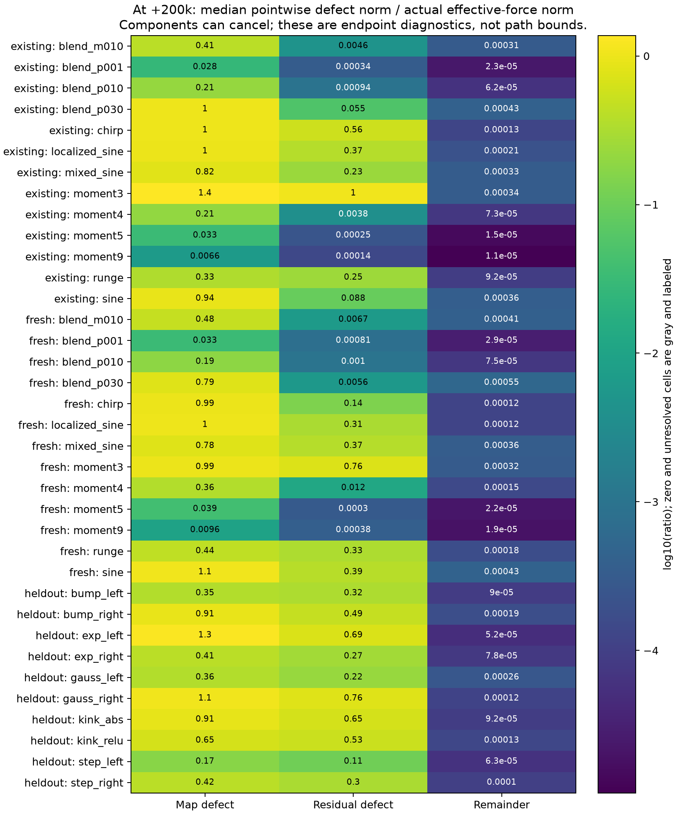
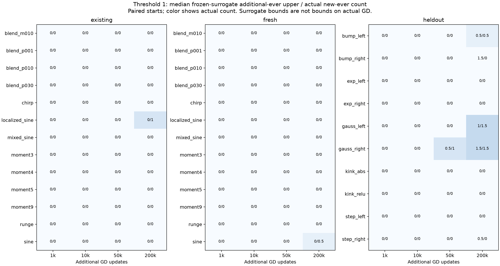

# From the effective slope gradient to a scale-acquisition bound

The two frameworks describe the same force. The slope-gradient decomposition
identifies the force left after coarse balance; the matched-feedback experiments
ask how its sensitivity and driving errors change during learning. This audit
connects them across **23 target functions and 333 starting checkpoints**, using
completed ordinary-GD trajectories and the forecasts issued before them.

The main advance is to separate a supported reduction from an approximation that
needs correction. Departure from coarse balance contributes little to both slope
motion and fine-residual evolution at the audited states. The effective
sensitivity changes substantially, and a frozen model can underestimate scale
acquisition. We can now identify the terms a finite-time theorem must control.
We have not bounded those terms between every pair of saved checkpoints.

**Notation. Gradients use empirical half-MSE; velocity has the opposite sign.**

| Symbol | Meaning |
|---|---|
| $\theta=(a,b,c,d)$, $W=177$ | Slopes, hidden biases, readouts, output bias, and width. |
| $\gamma_j=\lvert a_j\rvert$ | The scale of neuron $j$. |
| $e_C$, $e_H$ | Residual coefficients in coarse modes 0–1 and fine modes 2–65. |
| $J_C$, $J_H$ | Derivatives of those coefficients with respect to **all** parameters; modes are rows. |
| $T$, $T_a$ | Effective fine-gradient map and its slope rows. |
| $F_a=T_ae_H$, $R_a$ | Effective slope gradient and the remainder in $g_a=F_a+R_a$. |
| $s$, $n$, $N$ | Starting checkpoint, additional-update index, and forecast horizon. |
| A hat | The model with its full effective map frozen at $s$. |
| $\Gamma$ | A measured slope threshold, not a universal requirement for approximation. |

The evidence comes from three separately reported groups: 13 original targets
with five seeds (195 starts); the same targets with two fresh seeds (78 starts);
and ten new functions with two seeds (60 starts). The new functions include
exponentials, Gaussians, compact bumps, tanh steps, and kinks. Every trajectory
forks at 100k, 400k, or 600k updates. We inspect the fork and an additional 1k,
10k, 50k, and 200k updates, using the original FP64 computation, step
$\eta=0.002$, and 2048 training points. These are repeated starts, not 333
independent functions. The new-function campaign was prospective; **this
attribution audit is retrospective**. It neither reissues forecasts nor trains
new models.

## 1. The two gain terms are distinct from the tracking remainder

Here we derive the common force so that “balance is accurate” cannot be mistaken
for “the balance correction is negligible.” This is the central reconciliation.

For the network $f_\theta(x)=d+\sum_jc_j\tanh(a_jx+b_j)$, the gradient decomposes as

$$
g=J_C^Te_C+J_H^Te_H+g_\perp.
$$

The final term is the gradient from residual outside the retained polynomial
basis. Assuming the coarse Jacobian has independent rows, define

$$
B=(J_CJ_C^T)^{-1}J_CJ_H^T,\qquad z_C=e_C+Be_H.
$$

Substitution of $e_C=z_C-Be_H$ gives the exact identity

$$
g=\underbrace{(J_H^T-J_C^TB)e_H}_{Te_H}
  +\underbrace{J_C^Tz_C+g_\perp}_{R}.
$$

Thus the effective slope gradient contains **two contributions**:

$$
F_a=\underbrace{D_ae_H}_{\text{direct fine contribution}}
    \;\underbrace{-C_ae_H}_{\text{balanced coarse contribution}},
\qquad D=J_H^T,\quad C=J_C^TB,\quad T=D-C.
$$

The direct term asks how the fine errors pull on the slopes. The balanced term
accounts for the coarse residual needed to keep the coarse output approximately
stationary under the coupled update. Indeed, $J_CT=0$. The separate tracking
term $J_C^Tz_C$ measures departure from that balance. Even **exact balance**,
$z_C=0$, leaves the balanced contribution inside $T$.

The measurements say we should retain both gain terms. At +200k, the median
ratio $\|C_ae_H\|/\|F_a\|$ is **0.424, 0.430, and 0.249** in the original,
fresh-seed, and new-function groups. Their signed contributions to mean scale
oppose one another in **159/195, 64/78, and 36/60** states. The balanced term is
appreciable, but opposition is not universal. These are descriptive magnitudes
and signs, not a statistical-significance test.

Decomposition into modes answers a different question. Writing
$F_a=\sum_{k=2}^{65}(D_{a,:,k}-C_{a,:,k})e_k$ identifies **which errors** load
the two-term gain. It does not replace that gain decomposition. No particular
polynomial degree is privileged in this audit.

## 2. Small tracking must be checked in two equations

Here we check a missing premise: a small tracking contribution to slope motion
does not automatically mean a small influence on the errors that drive future
motion.

For gradient flow, differentiating the fine residual gives

$$
\dot e_H=-J_Hg
=-T^TTe_H-J_HJ_C^Tz_C-J_Hg_\perp.
$$

We used $J_HT=T^TT$, the Schur-complement identity. This equation shows why
checking $R_a$ alone was insufficient: residual evolution depends on the full
parameter gradient followed by $J_H$, rather than only its slope rows. The
audit measures each forcing vector directly.

**Tracking at +200k. Ratios are dimensionless; each cell gives median / maximum
over the group's starting checkpoints. The denominators are the effective
slope force and effective fine-residual forcing, respectively.**

| Group | $\|J_{a,C}^Tz_C\|/\|F_a\|$ | $\|J_HJ_C^Tz_C\|/\|T^TTe_H\|$ |
|---|---:|---:|
| Original targets | 0.000104 / 0.00390 | 0.000382 / 0.00625 |
| Fresh seeds | 0.000122 / 0.00480 | 0.000429 / 0.00591 |
| New functions | 0.0000992 / 0.000958 | 0.00112 / 0.00533 |

The residual-forcing ratio stays below 0.007 at all four positive saved
horizons in every group. This supports treating coarse tracking as a small
correction in **both** equations at those states. It does not establish a
uniform bound between them, or a small ratio for each individual mode when
that mode's effective forcing nearly cancels.

The omitted-basis term needs its own allowance. For the right compact bump,
seed 23 at the 600k fork followed for 200k, its residual-forcing ratio reaches
0.0169, although its slope-force ratio is only 0.0000633. The reduction remains
informative, but a theorem cannot borrow the slope error tolerance for residual
evolution. The displayed flow equation also needs a finite-step correction
when used to bound discrete GD.

## 3. What makes the frozen force forecast miss?

Here we keep the original forecast fixed and divide its error into three
interpretable parts. This tests which approximation fails without fitting a
replacement to the future trajectory.

Here $\widehat e_H$ is the fine residual predicted by evolving the original
checkpoint's frozen full effective map, without using future true states.
At a saved state, add and subtract $T_{a,s}e_H$:

$$
\underbrace{g_a-T_{a,s}\widehat e_H}_{\text{force forecast error}}
=\underbrace{(T_a-T_{a,s})e_H}_{\text{map defect}}
+\underbrace{T_{a,s}(e_H-\widehat e_H)}_{\text{residual defect}}
+\underbrace{R_a}_{\text{remainder}}.
$$

The map defect asks how much the force changes because sensitivity evolved,
evaluated on the actual errors. The residual defect asks how much the forecast
missed those errors, evaluated through the original sensitivity. The remainder
contains tracking and omitted-basis effects. This is an exact attribution at
the sampled state. It is not the causal effect of an intervention: changing
one factor during training also changes the other factors later.

**Force-forecast defects at +200k. Entries are medians of each term's norm
divided by the actual $\|F_a\|$. They are ratios, not percentages.**

| Group | Map defect | Residual defect | Remainder |
|---|---:|---:|---:|
| Original targets | 0.559 | 0.00549 | 0.000104 |
| Fresh seeds | 0.504 | 0.0124 | 0.000122 |
| New functions | 0.704 | 0.439 | 0.000103 |

<figure>
  
  <figcaption>Figure 1. Each row is one function within a cohort; each number is a median over its seeds and forks. Color is the logarithm of the displayed ratio. Across all rows, the map and residual defects exceed the remainder at the level of these medians. These endpoint vector norms can cancel and are not accumulated motion errors.</figcaption>
</figure>

Read the figure from right to left. The uniformly small right column supports
the effective-gradient reduction. The first two columns explain why that
reduction does not make the **frozen** model uniformly accurate. For example,
the original degree-9 target has median map/residual defects of about
0.0066/0.00014, whereas original sine has about 0.94/0.088. The new functions
show substantial residual defects as well as map defects. Degree 9's nearly
fixed coupling is one regime of the framework, not its general assumption.

The map defect itself still has two terms:
$(D_a-D_{a,s})e_H-(C_a-C_{a,s})e_H$. On the new functions, their median
norms relative to $\|F_a\|$ are 0.742 and 0.175, respectively. Direct-gain
drift is larger in this summary; balanced-gain drift is also appreciable.

Do not add these columns to estimate the actual error. For the new functions,
the median ratio of the norm of their sum to the sum of their norms is 0.351;
the smallest is 0.0423. The vectors can strongly oppose each other. A theorem
using separate norm bounds is valid, but may spend much of its error allowance
on contributions that cancel in the actual dynamics.

## 4. Separate a changing gain from relaxing errors

Here the product rule connects the audit to the parallel campaign's two
interventions. Freezing $T_a$ removes its explicit feedback in the modified
slope force; clamping the supplied $e_H$ removes that factor's feedback.
Ordinary GD contains both:

$$
\dot F_a=
\underbrace{\sum_{q\in\{a,b,c,d\}}
  (\mathrm D_qD_a[\dot q]-\mathrm D_qC_a[\dot q])e_H}_{\text{gain evolution}}
+\underbrace{T_a\dot e_H}_{\text{residual evolution}}.
$$

Each block derivative uses its ordinary velocity $\dot q=-g_q$ at the saved
state. We retain both gain terms within each block. The output bias has zero
gain derivative for this architecture: the Jacobians do not depend on $d$.
It can still affect residual evolution.

At +200k, the median norm of the summed gain-evolution term divided by the
residual-evolution term is **1.48, 1.64, and 0.690** across the three groups.
Thus residual relaxation alone is not a general explanation, and gain evolution
alone is not one either. These instantaneous derivatives identify local
mechanisms; their norms do not measure accumulated outward motion.

Hidden biases also matter. On the new functions, the median gain-derivative
norms from slopes and hidden biases are $1.93\times10^{-6}$ and
$1.71\times10^{-6}$; the readout contribution is $2.07\times10^{-7}$.
Size alone can hide how they combine. To see this, project each derivative
onto $F_a$: a positive inner product increases $\|F_a\|^2/2$, while a negative
one decreases it.

**One paired example: right Gaussian, seed 22, 100k fork followed for 200k
updates. Entries contribute to the instantaneous derivative of
$\|F_a\|^2/2$, per unit gradient-flow time.**

| Source | Contribution |
|---|---:|
| Slopes changing the gain | $-3.21147\times10^{-6}$ |
| Hidden biases changing the gain | $+3.14511\times10^{-6}$ |
| Readouts changing the gain | $+3.02876\times10^{-7}$ |
| Residual evolution | $-1.75643\times10^{-7}$ |
| Total | $+6.08740\times10^{-8}$ |

The large slope and bias effects nearly cancel. The smaller readout effect
then matters for net force growth. Across the 60 new-function endpoints,
readout-driven gain evolution increases this force magnitude in 45 cases and
decreases it in 15. A general explanation cannot assume readouts always damp
the force, or omit hidden-bias motion. This example concerns **force magnitude**;
growth of that magnitude need not mean outward slope motion.

For that motion, away from zero slopes, the relevant projection is

$$
\frac{d}{dt}\frac1W\sum_j|a_j|
=-\frac1W\operatorname{sign}(a)^T(F_a+R_a).
$$

A large gradient can point inward or cancel across neurons. The archived
discrete positive and negative scale travel, including zero crossings, supplies
the corresponding trajectory evidence. We do not infer it by integrating five
sampled derivatives. The [matched-feedback report](d34_coarse_balance_stagnation.md#2-give-the-same-initial-force-two-different-kinds-of-feedback)
retains the actual intervention comparisons; this audit attributes the
ordinary-GD field underlying them.

## 5. What the frozen model really bounds

Here we turn a force model into a count of neurons that can acquire a scale.
The key distinction is between a bound **inside the reduced model** and its
transfer to ordinary GD.

Freeze the full map $T_s$ and let its residual relax:

$$
\widehat e_{n+1}=(I-\eta T_s^TT_s)\widehat e_n,\qquad
\widehat\theta_{n+1}=\widehat\theta_n-\eta T_s\widehat e_n.
$$

Write $T_s=U\Sigma V^T$, with singular values $\sigma_i$ and initial loadings
$b_i=v_i^Te_{H,s}$. Each $b_i$ tells us how much error loads a direction,
$\sigma_i$ tells us its sensitivity, and $u_i$ tells us which parameters it
moves. When $0\le\eta\sigma_i^2\le1$, each loading relaxes
without alternating signs. Summing its geometric sequence gives

$$
\widehat\theta_N-\theta_s
=-\sum_i u_i\sigma_i b_i\Phi_N(\sigma_i^2),\qquad
\Phi_N(\lambda)=\eta\sum_{n=0}^{N-1}(1-\eta\lambda)^n.
$$

For positive $\lambda$, this is
$[1-(1-\eta\lambda)^N]/\lambda$; its zero limit is $\eta N$.
An exact null direction contributes zero because it is multiplied by
$\sigma_i$. Tiny positive singular values are retained. All 333 starts meet
the nonoscillating condition.

Taking absolute contributions gives a per-neuron travel allowance

$$
U_j(N)=\sum_i |u_{a,j,i}\sigma_i b_i|\Phi_N(\sigma_i^2).
$$

For every $n\le N$, $|\widehat a_{j,n}|\le|a_{j,s}|+U_j(N)$.
Hence a neuron starting at scale 0.2 with allowance 0.1 cannot reach scale 1
in this model. This is a finite-window restriction on motion; it is compatible
with the existence of accurate representations elsewhere in parameter space.

<figure>
  
  <figcaption>Figure 2. Each cell reads frozen-model upper allowance / actual number of new neurons reaching scale 1. Each neuron is counted once; neurons already at or above 1 at the fork are excluded. These are separate medians across paired starts, so a half-integer reflects a median, not a fractional neuron. Blue shading shows the actual count. The plot covers every function, but its medians can hide individual failures to transfer the model's bound to GD.</figcaption>
</figure>

At +10k, no start has more new neurons reaching scale 1 than its model
allowance. By +200k there are clear exceptions:

**Scale-1 acquisition at +200k. Counts are summed over repeated starts within
each group. The last column tests the allowance separately at each start.**

| Group | Summed model allowance | New neurons reaching scale 1 | Starts exceeding their model allowance |
|---|---:|---:|---:|
| Original targets | 31 | 64 | 26 / 195 |
| Fresh seeds | 13 | 26 | 10 / 78 |
| New functions | 39 | 38 | 7 / 60 |

The last row is particularly useful: aggregate counts look compatible, yet
seven individual starts violate the transferred allowance. Those include
Gaussians, bumps, and a kink. This is why the per-start test matters. It does
not falsify the spectral bound for its own surrogate; it falsifies using that
bound for actual GD **without a correction**. Conversely, agreement at +10k
is evidence of compatibility, not a proof of transfer.

The audit also preserves thresholds 3.2 and 16, initial occupancy, and a
separate simultaneous-occupancy bound. “Ever crossed” need not mean all those
neurons occupied the large-scale region at the same time. None of these
threshold counts alone establishes whether the approximation task was solved.

## 6. The theorem needs a controlled force error

Here we derive the correction suggested by the failed transfer tests. The
derivation also states exactly what remains unproved.

Let $\delta_{a,n}=g_a(\theta_n)-T_{a,s}\widehat e_n$, the three-term force
defect from Section 3. Since actual and predicted parameters share a start,
subtracting their discrete updates gives

$$
a_n-\widehat a_n=-\eta\sum_{k=0}^{n-1}\delta_{a,k}.
$$

Suppose a neighborhood or path argument establishes, before using future
outcomes, an allowance

$$
\eta\sum_{k=0}^{N-1}|\delta_{a,j,k}|\le E_j(N).
$$

Then every actual iterate through $N$ obeys

$$
|a_{j,n}|\le |a_{j,s}|+U_j(N)+E_j(N).
$$

Now count only neurons whose starting magnitude plus both allowances could
reach the threshold:

$$
\#\{j:\max_{n\le N}|a_{j,n}|\ge\Gamma\}
\le\#\{j:|a_{j,s}|+U_j(N)+E_j(N)\ge\Gamma\}.
$$

For example, the earlier scale-0.2 neuron with model allowance 0.1 is still
excluded from scale 1 if the force-error allowance is 0.05. This argument
allows slope sign changes and includes initial occupants. It bounds a
crossing event; it does not require an accurate reconstruction of every
neuron's trajectory. A sharper argument may bound partial sums directly to
retain cancellation.

The current audit supplies five pointwise defect measurements per start,
**not** $E_j(N)$. Its contribution is to constrain a realistic theorem:

- Small coarse-tracking forcing is supported in both equations at sampled
  states; it remains a premise to control along the path.
- The balanced contribution belongs in the leading gain, even when tracking
  is accurate.
- Gain drift and residual-forecast error require explicit allowances. Their
  sizes vary with the function and state; the degree-9 regime cannot set a
  universal tolerance.
- Signed geometry and cancellation matter for tight acquisition bounds.
  A bound on raw force magnitude alone may be too expensive.

The remaining mathematical task is to close those allowances over a window
where the resulting budget excludes a specified acquisition event. The
framework is general across targets; whether it predicts slow acquisition is
conditional on their measured states. This audit supplies evidence for those
conditions and counterexamples to dropping them.

## Evidence and verification

The [evidence index](../results/checkpoint_D_optimizers/expD34_readout_race/cross_function_audit/README.md)
links the machine-readable measurements, figures, source hashes, and logs.
The implementation starts from campaign revision `f69e1bb` and is committed as
`2143173`. All numerical analysis, focused tests, and plotting ran on remote
Slurm CPUs, with JAX 0.11.1, NumPy 2.5.1, and FP64. No new training or GPU
allocation was used. Original input and forecast archives were hash checked;
transfer subsets preserve selected array members byte for byte.

The 23 focused tests cover spectral limits and occupancy, force and derivative
identities, archive validation, and existing forecast behavior. All pass.
Across 1665 audited states, normalized force reconstruction, defect, and
derivative identity errors are below $5\times10^{-16}$; the spectral calculation
agrees with the already-issued forecast to $1.7\times10^{-11}$ under the
recorded normalization. These FP64 checks establish internal consistency,
not a directed-rounding theorem certificate.

The execution record retains failed attempts: an initial combined-manifest
loader issue was fixed and retested; plotting succeeded after installing its
dependencies in an isolated directory. An additional legacy test module could
not collect because PyTorch was absent from the remote environment. It is not
included in the 23 passing checks.
