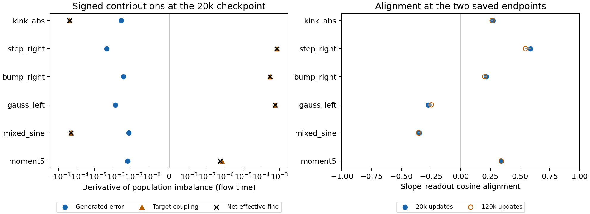
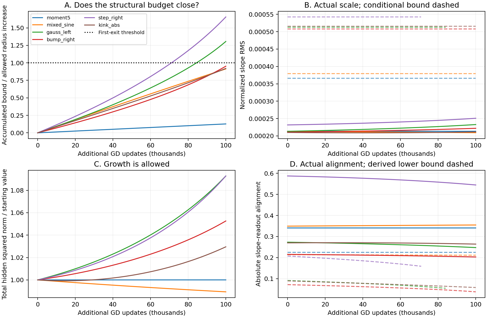
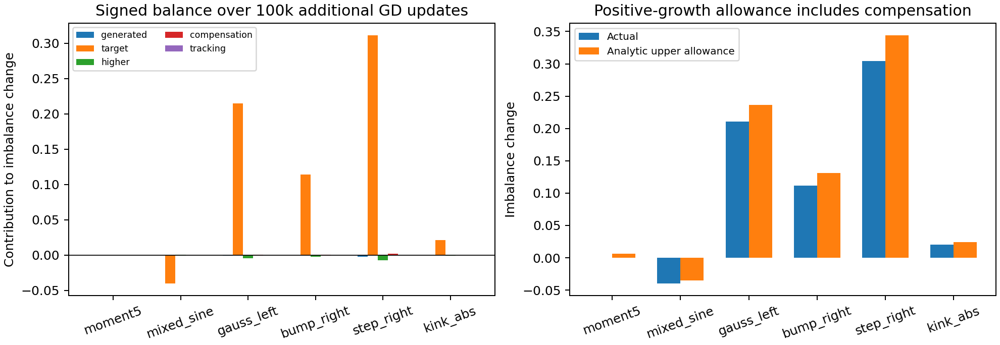
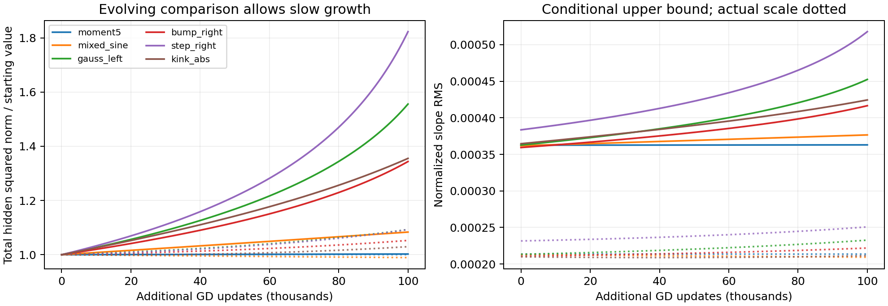
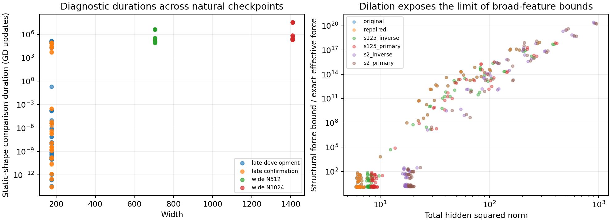
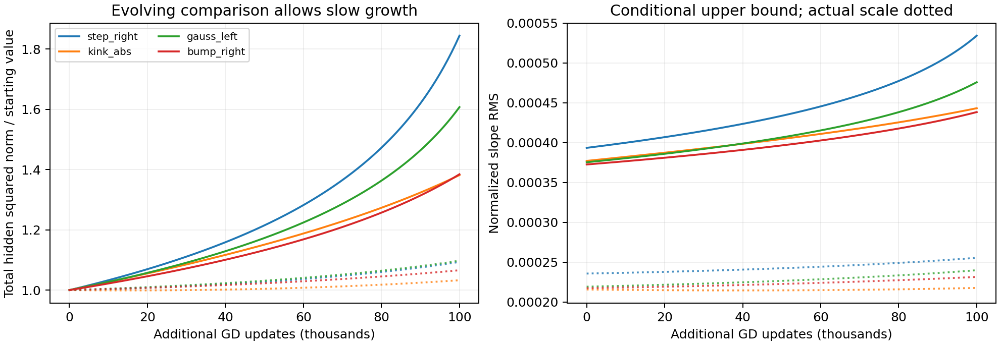

# Tightening the persistence argument: signed population balances

The evidence supports slow population scale acquisition after the coarse
tracking transient. Our target-gap proof establishes one mechanism for
persistence, but its energy bound gives a short useful duration at the saved
checkpoints. **The next improvement should retain the signed evolution of
coupled population moments before bounding their size.** A small energy
reservoir alone does not preserve enough of that structure.

The literature suggests how to do this. We derive an exact tanh balance
identity and a population growth comparison that permits positive growth.
The new comparison uses the evolving population's concentration, polynomial
output, and coupling to the target; it does not freeze the training dynamics.
Matched replays support useful conditional bounds over 100k additional
GD updates for six target families after refining the scalar comparison.
These are sampled checks of structural
conditions along trajectories, not guarantees from a checkpoint alone.
The existing accumulated-feedback theorem remains our main paper claim.

**Notation.** Parameters and time use the ordinary GD metric; population sums
below are unnormalized sums over the $W$ neurons.

| Symbol | Meaning |
|---|---|
| $f_\theta=d+\sum_j c_j\tanh(a_jx+b_j)$ | Network; $a_j$ is the physical slope, also denoted $\gamma_j$. |
| $P_C,P_H$ | Orthogonal projections onto affine functions and their complement. |
| $f_H,g,e_H=f_H-g$ | Non-affine network output, target, and error. |
| $F,R$ | Effective fine gradient, including coarse compensation, and tracking gradient. |
| $\Delta=\tfrac12\sum_j(a_j^2+b_j^2-c_j^2)$ | Population geometry–readout imbalance, not slope energy. |
| $A=\sum_j a_j^2$, $C=\sum_j c_j^2$ | Slope and readout squared norms. |
| $m=\sum_j a_jc_j$, $\rho_{ac}=m/\sqrt{AC}$ | Linear-output coefficient and collective slope–readout alignment. |
| $M=\sum_j(a_j^2+b_j^2+c_j^2)$ | Total hidden squared norm; the output bias is excluded. |
| $h=2/N_{\rm ref}$, $\lambda_{\rm RMS}=h\sqrt{A/W}$ | Grid spacing and normalized population slope scale. |

## 1. The example that identifies what the energy bound loses

Replace tanh temporarily by its linear term. Then

$$
f_\theta(x)=d+\sum_j c_jb_j+x\sum_j c_ja_j.
$$

After the linear target component has been fitted, $m=\sum_jc_ja_j$ is
approximately fixed. Gradient flow also preserves $\Delta$ exactly in this
linear model. These facts constrain simultaneous growth of slopes and
readouts: if their norms grow together while $m$ stays fixed, their
collective alignment must decrease. No individual-neuron invariant is needed.

Exact tanh breaks the balance invariant. The useful question is therefore:
**which parts of the nonlinear error change this balance, with which sign,
and how much can their accumulated effect grow?** Section 3 answers the first
two questions exactly. Sections 4–6 identify the remaining duration question.

The current energy proof replaces signed target correlations by upper bounds
over an entire parameter neighborhood. For the width-705 degree-five
checkpoint, its refined GD bound permits about 793 updates, while a saved
continuation shows small population change through 100k additional updates.
That number is a limitation of this sufficient bound, not an observed
800-update transition. The neighborhood argument can spend loss on directions
that need not be consistent with the coupled balance and coarse fit.

## 2. What the literature contributes

**Missing target modes can suppress the next learning stage.** In Appendix
D.3 of [Berthier, Montanari, and Zhou, *Learning time-scales in two-layers
neural networks*](https://arxiv.org/html/2303.00055v2), a missing Hermite
coefficient yields a nonpositive derivative of a population readout second
moment in their simplified stage ODE: the derivative is minus a squared
generated-mode moment. This is a close precedent for our generated-error
mechanism. Their Gaussian, high-dimensional model and stage approximation
differ from ours; the general stage-failure interpretation is heuristic. We
borrow the signed moment argument, not a long-time theorem for our network.

**Layer balance is a natural observable.** [Du, Hu, and Lee, *Algorithmic
Regularization in Learning Deep Homogeneous Models*
](https://arxiv.org/abs/1806.00900) establish squared-norm balance invariants
for gradient flow in homogeneous networks. Tanh is not homogeneous, so that
invariant does not transfer. Instead, its exact failure is a useful quantity
to calculate. This motivates $\Delta$ and the identity below.

**The first nonzero coupling matters more than a generic norm.** [Ben Arous,
Gheissari, and Jagannath, *Online stochastic gradient descent on non-convex
losses from high-dimensional inference*
](https://jmlr.csail.mit.edu/papers/v22/20-1288.html) classify difficulty using
the first nonzero derivative of the population loss near weak alignment. For
us, the useful question is which signed aggregate drift survives the target
orthogonality conditions. Their SGD sample-complexity rates do not transfer
to our deterministic GD or to width scaling.

**Slow gradient-flow theory needs structure beyond a small energy budget.**
[Otto and Reznikoff, *Slow Motion of Gradient Flows*
](https://webdoc.sub.gwdg.de/ebook/serien/e/sfb611/275.pdf) combine dissipation
toward a slow set with weak energy variation along it. Their theorem supplies
long-duration control under these structural hypotheses. Our generic
energy–movement inequality uses less information. Applying the stronger
theorem would require establishing transverse relaxation in appropriate
aggregate variables. The evidence does not justify assuming a slope attractor
or uniform contraction of every nonlinear residual mode.

The common lesson is to identify a collective balance or dissipative
structure and bound its defects. A Fourier sensitivity estimate alone does
not establish that the evolving population preserves that structure.

## 3. An exact identity, including compensation and tracking

Take a probability measure on $[-1,1]$, either the empirical training measure
or a specified population measure. Let

$$
L=\tfrac12\|f_\theta-y\|^2,\qquad
e_C=P_C(f_\theta-y),\qquad g=P_Hy.
$$

Identify coarse functions with their coefficients in an orthonormal affine
basis. Let $J_C=D_\theta(P_Cf_\theta)$ and $J_H=D_\theta f_H$. When
$K=J_CJ_C^*$ is invertible, our existing decomposition is

$$
\begin{aligned}
\ell&=K^{-1}J_CJ_H^*e_H,& z&=e_C+\ell,\\
\Pi&=I-J_C^*K^{-1}J_C,&
F&=\Pi J_H^*e_H,&R&=J_C^*z.
\end{aligned}
\tag{1}
$$

Thus $\dot\theta=-F-R$ for full gradient flow. The compensating coarse
gradient $-J_C^*\ell$ is inside $F$. A small tracking gradient does not remove
this compensation.

Write $u_j=a_jx+b_j$ and $\phi(u)=\tanh u$. Define two exact functions:

$$
\begin{aligned}
k_\theta(x)&=\sum_jc_j[\phi(u_j)-u_j\phi'(u_j)],\\
E_\theta(x)&=\sum_jc_j[3\phi(u_j)-u_j\phi'(u_j)-2u_j].
\end{aligned}
\tag{2}
$$

The first measures the failure of linear homogeneity. The second isolates
the higher-order correction to its leading cubic term. Algebra gives

$$
P_Hk_\theta=-2f_H+P_HE_\theta.
\tag{3}
$$

**Proposition 1 — signed population balance.** Along the effective flow
$\dot\theta=-F$,

$$
\boxed{
\dot\Delta_F=
\underbrace{-2\|f_H\|^2}_{\text{generated-error correction}}
+\underbrace{2\langle g,f_H\rangle}_{\text{target coupling}}
+\underbrace{\langle e_H,P_HE_\theta\rangle}_{\text{higher-order correction}}
-\underbrace{\langle\ell,P_Ck_\theta\rangle}_{\text{coarse compensation}}.
}
\tag{4}
$$

Tracking adds

$$
\dot\Delta_R=\langle z,P_Ck_\theta\rangle.
\tag{5}
$$

For full gradient flow the last terms combine to
$\langle e_C,P_Ck_\theta\rangle$. This full-flow identity remains valid even
when the coarse Gram matrix is singular; only the decomposition needs its
inverse.

**Proof.** Let $v=\nabla_\theta\Delta=(a,b,-c,0)$. Direct differentiation
gives $Df_\theta[v]=-k_\theta$. Consequently,

$$
-\langle v,F\rangle
=\langle e_H,P_Hk_\theta\rangle-\langle\ell,P_Ck_\theta\rangle.
$$

Substitute (3) and $e_H=f_H-g$. Similarly,
$-\langle v,R\rangle=\langle z,P_Ck_\theta\rangle$. $\square$

For small arguments, $E_\theta$ begins with
$-\tfrac4{15}\sum_jc_ju_j^5$, whereas $f_H$ generally begins with the
non-affine part of $-\tfrac13\sum_jc_ju_j^3$. This expansion explains (4);
the identity itself uses exact tanh and evolving parameters.

The negative term retains a sign that an absolute energy or Jacobian bound
loses. It does **not** prove that the whole generated contribution, the net
imbalance drift, or the slopes always decrease. Higher terms and compensation
matter for the first claim; target coupling matters for the second;
$\Delta$ is not slope energy for the third.

**Target-family prediction.** If $g$ is orthogonal to polynomials through
degree five, the two explicit target pairings in (4) lose their cubic and
quintic terms; their leading possible contribution has degree seven in hidden parameters.
For a gap only through degree three, quintic loading survives. Ordinary sine
need not satisfy either gap. Global remainder bounds can quantify these
statements without a per-neuron smallness assumption, but the requisite
population moments and compensation still need dynamical control.

## 4. What the saved checkpoints actually support

We post-processed existing 20k-update checkpoints and the endpoints of their
100k-additional-update continuations. The six targets are a degree-five
orthogonal-polynomial mixture, mixed sine, a shifted Gaussian, a compact bump,
a smooth step, and an absolute-value kink. All have width $W=705$ and seed 30.
The principal comparison uses ordinary GD with $\eta=0.002$, hence 200 units
of additional flow time. We also checked the saved $\eta=0.001$ GD and two
effective-flow integration endpoints.

These are post-hoc optimization diagnostics on the saved training grid. They
are neither new training runs nor independent validation of a selected
theorem premise. The six targets provide an initial check of this observable;
the broader campaign's 23-target coverage should not be attributed to it.

<figure>
  
  <figcaption>Left: exact effective-flow contributions to the derivative of the geometry–readout imbalance at the 20k checkpoint. Each contribution includes its own coarse compensation; together they equal the net effective fine contribution. The horizontal axis is symmetric-logarithmic. Right: collective alignment at the two saved ordinary-GD endpoints. The figure does not establish an interval-wide bound between those endpoints.</figcaption>
</figure>

Three findings constrain the theory:

1. **Generated correction opposes imbalance growth at all six starting
   checkpoints, but target coupling is larger in magnitude.** For degree
   five, the exact generated contribution is $-1.54\times10^{-7}$ and the
   target contribution is $+6.81\times10^{-7}$ per unit flow time. Their sum
   is positive. Universal dominance of generated-error correction is an
   unsuitable premise even at this checkpoint.
2. **The aggregate alignment changes modestly at the endpoints.** Its absolute
   value ranges from 0.215 to 0.587 initially and from 0.203 to 0.545 finally.
   The linear coefficient $m$ changes by less than 0.7% in every case. This
   supports investigating collective alignment; it does not prove persistence
   between the endpoints.
3. **Slow acquisition does not require constant or decreasing imbalance.**
   For the smooth step, $\Delta$ rises from 1.080 to 1.384 while slope RMS
   rises from 0.0593 to 0.0642. For degree five, $\Delta$ rises by only
   $1.05\times10^{-4}$ and slope RMS changes from 0.054681 to 0.054684.
   Mixed sine decreases slope RMS; the Gaussian and compact bump increase
   it. The absolute-value kink starts with negative imbalance drift but
   ends with a larger imbalance. A frozen initial sign is not a persistence
   argument.

The displayed split uses $F_{\mathrm{gen}}=\Pi J_H^*f_H$ and
$F_{\mathrm{tar}}=-\Pi J_H^*g$, whose sum is the same $F$ as before.
This is a diagnostic split inside the effective fine gradient, not a change
to the tracking/effective-fine terminology.

## 5. A precise aggregate implication for slope acquisition

The example in Section 1 can be stated without linearizing tanh. Define the
signed full-flow integrand

$$
\mathcal I(\theta)=
-2\|f_H\|^2+2\langle g,f_H\rangle
+\langle e_H,P_HE_\theta\rangle
-\langle\ell,P_Ck_\theta\rangle
+\langle z,P_Ck_\theta\rangle.
\tag{6}
$$

For effective flow, omit the final tracking term. The full-flow form may
equivalently use the coarse residual pairing and needs no inverse.

**Proposition 2 — balance and alignment limit population slopes.** Consider
either flow from a post-transient checkpoint. Suppose that, for every
$s\in[0,T]$,

$$
\int_0^s\mathcal I(\theta(t))\,dt\le B(s),\qquad
|m(s)|\le m_*,\qquad |\rho_{ac}(s)|\ge\alpha>0.
\tag{7}
$$

Let $D(s)=\Delta(0)+B(s)$. Then

$$
\boxed{
\operatorname{RMS}(a(s))^2
\le\frac{D(s)+\sqrt{D(s)^2+m_*^2/\alpha^2}}{W}.
}
\tag{8}
$$

At a time with $A=0$, the slope conclusion holds trivially; where $A>0$ the
alignment premise requires $C>0$. There is no restriction on the largest
neuron or individual slope–readout ratio.

**Proof.** Proposition 1 gives $\Delta(s)\le D(s)$. Since
$A-C=2\Delta-\sum_jb_j^2$, we have $C\ge A-2D$. Also
$AC=m^2/\rho_{ac}^2\le m_*^2/\alpha^2$. Thus
$A(A-2D)\le m_*^2/\alpha^2$; solving this quadratic gives (8). $\square$

With a bounded coarse linear coefficient, substantial RMS-slope acquisition
requires a large increase of geometry relative to readouts, or a substantial
loss of their collective alignment. Small coarse tracking alone excludes
neither route. The alignment condition allows neurons to move and exchange
influence; it does not track any particular neuron.

For scale, illustrative allowances $D\le2$, $m_*\le2$, and $\alpha\ge0.1$
would imply slope RMS below 0.18 at width 705. All twelve principal saved
endpoints satisfy these loose allowances. They were chosen after inspecting
the endpoints and have not been established throughout the interval. If the
allowances were uniform in width, (8) would give $O(W^{-1/2})$ RMS slopes;
this one-width audit does not establish that premise.

**Where the real theorem work remains.** Proposition 2 is a proved
implication, but (7)'s integral alone is a balance-budget assumption, not an
explanation of persistence. Its value depends on bounding (6) using signed
generated correction, target-family structure, and aggregate moments, then
establishing an alignment allowance. Replacing that work by a measured small
$B$ would recreate the weakness we are trying to remove. Proposition 2 is
not a completed replacement for the main theorem. Section 8 supplies a
structural growth comparison and derives alignment control from it; Section
9 tests its usefulness along matched replays.

Fitting the coarse output does not exactly fix $m$ for nonlinear features.
For a symmetric input measure with $v_x=\|x\|^2>0$, write

$$
f_\theta=d+\sum_jc_jb_j+mx+\mathcal N_\theta(x),\qquad
\mathcal N_\theta=\sum_jc_j[\tanh u_j-u_j].
$$

Then

$$
|m|\le
\frac{|\langle y,x/\sqrt{v_x}\rangle|+\|e_C\|+
\|\mathcal N_\theta\|}{\sqrt{v_x}}.
\tag{9}
$$

Population-moment bounds control $\mathcal N_\theta$ in the broad-feature
regime. Equation (9) identifies the coupling instead of silently replacing
nonlinear coarse fitting by an exact product constraint. Targets with little
linear component can have very small $\rho_{ac}$; this route is not yet a
universal target-family argument. A slope-RMS bound alone also does not
replace the existing population-to-output-error theorem.

## 6. Ordinary GD has an exact balance correction

This observable avoids a separate trajectory-closeness argument for its GD
transfer. Let $G=\nabla L=(G_a,G_b,G_c,G_d)$ and
$\theta^+=\theta-\eta G$. Since $\Delta$ is quadratic,

$$
\Delta(\theta^+)-\Delta(\theta)
=\eta\mathcal I(\theta)
+\frac{\eta^2}{2}
\left(\|G_a\|^2+\|G_b\|^2-\|G_c\|^2\right).
\tag{10}
$$

This identity is exact for any step size. In (7), replace the integral by
the discrete sum including this correction. Proposition 2 then applies at
every GD iterate where the other premises hold.

For constant $\eta$, if the descent inequality
$L(\theta^+)\le L(\theta)-\eta\|G\|^2/2$ holds on each step, the accumulated
upper bound on the quadratic correction is

$$
\frac{\eta^2}{2}\sum_n\|G_n\|^2
\le\eta[L(\theta_0)-L(\theta_N)].
\tag{11}
$$

Discrete transfer for this moment can therefore use loss dissipation
directly. This does not establish alignment persistence or a useful loading
budget. Adam changes the coordinate weighting and carries optimizer memory,
so the unweighted GF identity is not its dynamical balance law.

## 7. Which assumptions the strengthening should use

Keep the post-transient start, accumulated effects of tracking, and
population rather than maximum-neuron control. Keep target orthogonality
relative to the actual input measure, with explicit low-degree leakage for
other targets. Keep generated correction and compensation signed before
bounding adverse terms. These choices have mechanisms and measurable failure
modes.

Do not add universal contraction, exact layer balance for tanh, negligible
compensation, or a frozen sensitivity operator. Do not assume that every
fine mode relaxes rapidly. The evidence also does not establish alignment
preservation merely because its two endpoint values are similar.

Three questions guided the proof and its tests:

1. **Recover balance and alignment along saved trajectories.** Measure
   $\Delta,m,\rho_{ac}$ and the signed terms of (4)–(5), including the exact
   GD increment. The old dense CSV lacked these observables, so new matched
   replays recover them. Alignment persists in the replayed cases, but the
   primary growth theorem below does not require it as a separate premise.
2. **Bound the first surviving loading term for a specified target family.**
   Start with the polynomial-gap family, retaining the negative generated
   term. Determine whether the signed budget is substantially smaller than
   the old ball-based target-correlation allowance. For sine and localized
   targets, measure low-degree residual coupling explicitly rather than
   declaring it zero. Success is a useful bound on an evolving aggregate
   region, not an accurate frozen-force forecast.
3. **Specify feasible controls before perturbing alignment.** One cannot
   change $\rho_{ac}$ while fixing $A,C,m$: these quantities determine it
   algebraically. Holding the coarse coefficient approximately fixed while
   increasing $A$ and $C$ together is one feasible way to lower alignment;
   it also changes the starting scales and generally the fine output. Such
   a test would probe exit from the coupled balance regime, not isolate a
   causal effect of alignment alone. First check these observables on the
   archived large-dilation experiments; design new perturbations only after
   their actual moment changes identify a distinguishable prediction.

There is an alternative if alignment fails: use a coupled low-mode/high-mode
residual system and prove dissipation of generated error with weak transfer
into the unresolved target. Slow-gradient-flow theory supplies a proof
pattern, but its dissipation and coupling assumptions must be tested here.
Neither approach needs a per-neuron persistence theorem.

## 8. Growth lemmas: retain dissipation and close a population comparison

The useful strengthening allows growth. Two operations make the proof more
informative: retain the negative generated-error term before bounding its
defect, and bound the evolving population through scale-invariant polynomial
observables. This section uses exact tanh throughout. The polynomials supply
global inequalities; they are not a substitute training ODE.

Write $r_j^2=a_j^2+b_j^2+c_j^2$, $S_k=\sum_jr_j^k$, and $M=S_2$.
Define

$$
A_3=\frac{\sqrt6}{8},\quad
A_5=\frac2{15}\frac{2^{5/2}5^{5/2}}{6^3},\quad
A_7=\frac{17}{315}\frac{2^{7/2}7^{7/2}}{8^4},\qquad
C_k=(k+1)A_k.
\tag{12}
$$

**Lemma 3 — a positive allowance for generated-error correction.** Let
$\sigma=\sigma_{\min}(J_C)>0$, $K_0=2A_3S_4$,
$E_0=2A_5S_6$, and $J_0=C_3\sqrt{S_6}$. Split
$F=\Pi J_H^*f_H-\Pi J_H^*g$. The contribution of the first term to
$\dot\Delta$ is at most

$$
\mathcal D_{\rm gen}
\le\frac18\left(E_0+\frac{K_0J_0}{\sigma}\right)^2.
\tag{13}
$$

**Proof.** For $k(u)=\tanh u-u\operatorname{sech}^2u$,
$k'(u)=2u\tanh u\operatorname{sech}^2u$, so $|k(u)|\le2|u|^3/3$.
For $E(u)=3\tanh u-u\operatorname{sech}^2u-2u$,
$E'(u)=-2\tanh u\,k(u)$, giving $|E(u)|\le4|u|^5/15$.
Optimizing $|c|(a^2+b^2)^{k/2}$ at fixed $r$ gives
$\|k_\theta\|\le K_0$ and $\|E_\theta\|\le E_0$.
The Jacobian estimate below gives $\|J_H\|\le J_0$.
The generated part of $\ell$ has norm at most $J_0\|f_H\|/\sigma$.
Writing $s=\|f_H\|$, (4) therefore bounds its total contribution by

$$
-2s^2+\left(E_0+K_0J_0/\sigma\right)s
\le\left(E_0+K_0J_0/\sigma\right)^2/8.
$$

This completes the square rather than requiring the expression to be
negative. Compensation is included. $\square$

For well-distributed populations with $M=O(1)$, $S_4=O(W^{-1})$ and
$S_6=O(W^{-2})$. If the coarse singular value has an order-one lower bound,
the allowance in (13) is $O(W^{-4})$. Target loading can be larger and
positive. This explains why failure of universal contraction does not defeat
the growth argument. A width-independent conditioning margin is an additional
condition for this scaling statement, not a consequence of the identity.

### Exact remainders and scale-invariant population structure

Let
$\Psi_3=-\sum_jc_ju_j^3/3$ and
$\Psi_5=2\sum_jc_ju_j^5/15$.
Set $J_k=D_\theta(P_H\Psi_k)$ and $G_k=J_k^*g$. Global remainder bounds give

$$
\begin{aligned}
\|f_H-P_H(\Psi_3+\Psi_5)\|&\le A_7S_8,\\
\|J_H-J_3-J_5\|&\le C_7\sqrt{S_{14}},\\
\|J_H^*g-G_3-G_5\|&\le C_7\|g\|\sqrt{S_{14}}.
\end{aligned}
\tag{14}
$$

**Proof of the constants.** The scalar tanh remainders after degrees one,
three, and five are bounded by $|u|^3/3$, $2|u|^5/15$, and
$17|u|^7/315$. Their derivative remainders are bounded by the corresponding
$k$ times coefficient times $|u|^{k-1}$. For the final bound,
$\sup|\tanh^{(7)}|\le272$ suffices. In $z=\tanh^2u$, that derivative is
$-272+3968z-12096z^2+13440z^3-5040z^4$; its Bernstein coefficients on
$[0,1/2]$ and $[1/2,1]$ are respectively
$(-272,224,216,124,53)$ and $(53,-18,-68,8,0)$, proving the bound.
The lower remainders follow by integrating
$|\tanh u-u|\le|u|^3/3$ and
$|u^2-\tanh^2u|\le2|u|^4/3$.

For a scalar coefficient $t_k$, a neuron output remainder is at most
$t_k2^{k/2}|c|(a^2+b^2)^{k/2}$. Its maximum at fixed $r$ is $A_kr^{k+1}$.
The sum of squared derivative-column remainders is at most
$t_k^22^k[k^2c^2(a^2+b^2)^{k-1}+(a^2+b^2)^k]$.
Maximizing at $(a^2+b^2)/r^2=k/(k+1)$ gives $C_k^2r^{2k}$.
Summing columns bounds the Hilbert–Schmidt norm; projection cannot increase
it. This proves (14) and the $J_0$ bound in Lemma 3. $\square$

For a directly testable signed imbalance bound, put
$v=\nabla\Delta=(a,b,-c,0)$. Combining Lemma 3 and (14) gives

$$
\dot\Delta_F\le
\frac18(E_0+K_0J_0/\sigma)^2+
\langle\Pi v,G_3+G_5\rangle+
\|\Pi v\|C_7\|g\|\sqrt{S_{14}}.
\tag{14a}
$$

The polynomial target pairing retains its sign. Add $-v\cdot R$ for full
flow and the exact quadratic correction (10) for GD. This distinguishes a
negative generated correction from positive target-driven growth without
requiring either effect to dominate universally.

For $M>0$, define the dimensionless shapes

$$
\begin{aligned}
\chi_k&=W^{k/2-1}S_k/M^{k/2},\\
q_k&=W^{(k-1)/2}\|P_H\Psi_k\|/M^{(k+1)/2},\\
j_k&=W^{(k-1)/2}\|J_k\|_{\rm HS}/M^{k/2},\qquad
g_k=W^{(k-1)/2}\|G_k\|/M^{k/2},\quad k=3,5.
\end{aligned}
\tag{15}
$$

The lowercase $q_k,j_k,g_k$ are scalar norms, not additional forces in the
gradient decomposition. These quantities do not change under a common
rescaling of all hidden
parameters. Bounding them therefore does not assume that $M$, the slopes,
or the future effective force stay small. They describe population shape,
low-order output coherence, and coupling to specified target moments. In
particular, $G_3=0$ when $g\perp\mathcal P_3$, and also $G_5=0$ when
$g\perp\mathcal P_5$. For other targets those terms remain explicit.

There is also a version whose target dependence is specified entirely by
the target family. Put $\tau_k=\|P_{\mathcal P_k}g\|$. Since every column
of $J_k$ is a polynomial of degree at most $k$,

$$
g_k\le j_k\tau_k,\qquad
q_k\le A_k\chi_{k+1},\qquad
j_k\le C_k\sqrt{\chi_{2k}},\qquad k=3,5.
\tag{15a}
$$

The first inequality follows by projecting the target before applying
$J_k^*$; the other two follow from the same fixed-radius polynomial bounds
used in (14). Thus the small loading can be **derived from population
concentration and target moments**, rather than assumed as a small future
fine force. The sharper comparisons below retain measured polynomial
coherence and target coupling; substituting (15a) gives a simpler but
potentially looser concentration-only condition. Its quantitative usefulness
has not been substituted for the reported sharper results. A spectral gap
sets the corresponding $\tau_k$ exactly to zero; sine and localized targets
generally retain nonzero low-degree loading.

### A first-exit theorem for the evolving population

Choose an allowed total hidden squared norm $M_*>M(0)$. At each time define

$$
\begin{aligned}
Q_*&=q_3M_*^2/W+q_5M_*^3/W^2+A_7\chi_8M_*^4/W^3,\\
J_*&=j_3M_*^{3/2}/W+j_5M_*^{5/2}/W^2+C_7\sqrt{\chi_{14}}M_*^{7/2}/W^3,\\
G_*&=g_3M_*^{3/2}/W+g_5M_*^{5/2}/W^2
       +C_7\|g\|\sqrt{\chi_{14}}M_*^{7/2}/W^3,\\
V_*&=J_*Q_*+G_*.
\end{aligned}
\tag{16}
$$

The shapes in (16) evolve; only the allowed radius is fixed. No Jacobian is
frozen. Products are retained inside the time integral, avoiding separate
maximum-over-time bounds on concentration and coherence.
Compensation remains inside the exact orthogonal projection. This population
comparison uses its contractivity, so it needs no quantitative lower bound
on the coarse singular value beyond the decomposition being defined.

**Theorem 4 — slow population growth from accumulated structural loading.**
For effective flow, set $r=0$; for ordinary gradient flow set $r=\|R\|$.
Suppose an upper budget $B_T$ satisfies

$$
\int_0^T[V_*(t)+r(t)]\,dt\le B_T
<\sqrt{M_*}-\sqrt{M(0)}.
\tag{17}
$$

Then $M(t)<M_*$ throughout $[0,T]$, total hidden parameter travel is at most
$B_T$, and $\lambda_{\rm RMS}(t)<h\sqrt{M_*/W}$.
The same result holds for ordinary GD with the integral replaced by
$\sum_{n<N}\eta_n(V_{*,n}+\|R_n\|)$, at every iterate through $N$.

**Proof.** While $M\le M_*$, (14)–(16) and $\|\Pi\|\le1$ give
$\|F\|\le\|J_H\|\|f_H\|+\|J_H^*g\|\le V_*$.
Consequently $D^+\sqrt M\le V_*+r$. At a first exit, integration contradicts
(17). The same bound then controls travel on the entire interval. For GD,
the exact triangle inequality
$\|p_{n+1}\|\le\|p_n\|+\eta_n(V_{*,n}+\|R_n\|)$ for the hidden blocks
gives the conclusion by induction. There is no continuous-trajectory
approximation or enlarged step tube in this discrete argument. $\square$

If an initial fraction $p_0$ has $h|a_j(0)|\ge\lambda_0<\lambda_*$, the
travel conclusion also implies

$$
p_{\rm ever}(T)\le p_0+
\frac{h^2B_T^2}{W(\lambda_*-\lambda_0)^2}.
\tag{18}
$$

Indeed the squared accumulated slope travels sum to at most $B_T^2$ by
Minkowski; count the labels requiring travel at least
$(\lambda_*-\lambda_0)/h$. This is an aggregate counting argument, not an
individual-neuron premise. A bound above one may be clipped at one.

The theorem's premise is an integral of explicit dimensionless polynomial
shapes, moment concentration, and tracking. Its conclusion is a bound on
physical size and force. Establishing useful structural budgets remains a
substantive empirical or theoretical task; inserting the future true force
in place of $V_*$ would not establish this mechanism.

### Refine the comparison by allowing its radius to evolve

The fixed-radius test charges early training at the largest radius allowed
at the end. For targets with positive low-order loading, this can exhaust
the sufficient budget even while actual growth remains modest. A scalar
comparison equation removes this loss without changing the assumptions.

**Corollary 4a — a growing population envelope.** Write $V(t,M)$ for (16)
with $M_*$ replaced by $M$, using the same evolving shapes or nonnegative
upper envelopes for their coefficients. Let

$$
\dot b=V(t,b^2)+r(t),\qquad b(0)=\sqrt{M(0)}.
\tag{18a}
$$

On any interval where this scalar solution is finite,

$$
\sqrt{M(t)}\le b(t),\qquad
\operatorname{length}(\theta_{\rm hidden};[0,t])\le b(t)-b(0),
\qquad \lambda_{\rm RMS}(t)\le\frac{h b(t)}{\sqrt W}.
\tag{18b}
$$

For GD the corresponding statement uses the actual step sizes:

$$
b_{n+1}=b_n+\eta_n[V(n,b_n^2)+\|R_n\|].
\tag{18c}
$$

**Proof.** The radius satisfies
$D^+\sqrt M\le V(t,M)+r(t)$. The right side is nondecreasing and locally
Lipschitz in the radius, with nonnegative coefficients. Scalar differential
inequality comparison gives (18b); integrating the same speed bound gives
the travel conclusion. For GD, monotonicity and the triangle inequality give
$\sqrt{M_{n+1}}\le b_{n+1}$ by induction, and summing step lengths gives
the travel bound. Locally integrable, bounded coefficient envelopes suffice
on each compact radius interval. Blow-up of the scalar comparison ends its
usefulness; it is not a claim that the network itself diverges. $\square$

This is a property of the evolving exact ODE. A scalar upper comparison is
different from an approximate model that predicts each parameter's motion.
It permits growth and eventual exit. If $M(0)=O(1)$ and the dimensionless
coefficients and target norm have width-independent bounds, (16) gives
$V=O(W^{-1})$ on a fixed mass interval. With negligible accumulated tracking,
an order-one radius change therefore takes at least order $W$ flow time.
For targets with $g\perp\mathcal P_3$, the $g_3$ term vanishes and the same
argument gives order $W^2$. These are conditional width scalings, not a
uniform empirical law or a claim about a particular update count. Higher
target gaps alone do not improve this particular $W^2$ bound: its unsigned
generated-output term can still be order $W^{-2}$. Retaining more of the
signed dissipation would be needed for that strengthening.

**Output-error consequence.** Orthogonality and the reverse triangle
inequality give, under either comparison,

$$
\frac{\|f_\theta-y\|}{\|y\|}
\ge \frac{[\|g\|-Q(t,b(t)^2)]_+}{\|y\|},
\tag{18d}
$$

where $Q$ is the capacity bound in (16); use $M_*$ in the fixed-radius
version. This connects the same aggregate conditions to unusable output
accuracy, rather than inferring output failure from small slopes alone.
The inequality concerns the measure used in the theorem. A computation
on the training grid is not an automatic certificate for a continuous
population measure.

### Coarse fitting preserves the product, which preserves alignment

**Lemma 5 — product and alignment preservation.** Assume Theorem 4's
conditions and a symmetric input measure with $v_x=\|x\|^2>0$. Let

$$
J_{N,*}=C_3\sqrt{\chi_6}M_*^{3/2}/W,\qquad
B_m(T)=\frac1{\sqrt{v_x}}\int_0^T
\left[\sqrt{1+2M_*}\,r+J_{N,*}(V_*+r)\right]dt.
\tag{19}
$$

Then $|m(t)-m(0)|\le B_m(T)$ and

$$
|\rho_{ac}(t)|\ge\frac{2[|m(0)|-B_m(T)]_+}{M_*}
\tag{20}
$$

where $A,C>0$. Equivalently $m^2\ge\alpha_T^2AC$ with the right side of
(20) as $\alpha_T$. A positive lower bound follows when $B_m<|m(0)|$;
small-coarse-component targets need not meet that additional condition.

**Proof.** With $\mathcal N_\theta$ from (9), the linear output coefficient
is $\sqrt{v_x}m+\langle\mathcal N_\theta,x/\sqrt{v_x}\rangle$.
Its derivative under effective flow is zero because $J_CF=0$; under full
flow its absolute derivative is at most $\|J_C\|\|R\|$.
The same global cubic remainder proof gives
$\|D\mathcal N\|\le C_3\sqrt{S_6}\le J_{N,*}$, and
$\|J_C\|\le\sqrt{1+2M_*}$. Differentiating the coefficient and integrating
proves (19). Finally $\sqrt{AC}\le(A+C)/2\le M_*/2$ proves (20).
$\square$

For GD use the corresponding left-point sum in (19) and add
$\tfrac12\sum_n\eta_n^2(V_{*,n}+\|R_n\|)^2$.
This follows from the exact identity
$m_{n+1}-m_n=-\eta_n(c_n\cdot G_{a,n}+a_n\cdot G_{c,n})+
\eta_n^2G_{a,n}\cdot G_{c,n}$ and
$|G_a\cdot G_c|\le\|G\|^2/2$.

Thus alignment can be a consequence of a growth theorem rather than an
independent assumed invariant. The primary population conclusion still
applies when the alignment lower bound is zero. In particular, a loss of
useful alignment control does not by itself refute slow scale acquisition.

## 9. Matched replays test a useful duration

All replays use the uniform empirical measure on 2,048 midpoint samples
of $[-1,1]$, width $W=705$ including the halo, and reference grid size
$N_{\rm ref}=512$, hence $h=1/256$. The original parameters come from
full-batch GD after 20k updates at learning rate 0.002. Each continuation
covers another 100k updates at that rate. No readout refitting or geometry
intervention is applied to these continuations.

For clarity, the six target labels in the figures mean the following.
The degree-five target is $0.3P_0+0.4P_1+\sqrt{0.75}P_5$, where the
$P_k$ are orthonormal polynomials for this empirical measure. Mixed sine is
$\sin(2\pi x)+\tfrac12\sin(6\pi x)+\tfrac14\sin(14\pi x)$.
Gaussian is $\exp(-((x+0.35)/0.22)^2)$; step is
$\tanh(14(x-0.31))$; kink is $|x+0.23|$.
The bump is $\exp(1-1/(1-u^2))$ for $|u|<1$, zero otherwise, with
$u=(x-0.35)/0.22$. Each nonpolynomial target is divided by its RMS on
the original 2,048-point grid. These definitions make the mixture's
low-degree loading and the localized targets' different structures explicit.

The degree-five example makes the gain concrete. Its hidden squared norm
increases by only 0.003% during 100k additional GD updates. The structural
comparison allows a 2% increase and consumes about 13% of the corresponding
radius budget. This closes the implication of Theorem 4 over the measured
interval without assuming the actual force stays at its starting value.
For mixed sine, the analogous allowance is 10%. For the bump and kink,
a factor-two allowance closes over the whole interval. Gaussian and step
loading exhaust this particular sufficient comparison after approximately
84k and 71k updates, respectively; their observed population growth is
still only about 9.3% by 100k updates.

<figure>
  
  <figcaption>Width 705, seed 30, starting after 20k GD updates; another 100k updates at learning rate 0.002. A compares the structural integral to the available radius increase; the theorem applies while the curve stays below one. B shows actual normalized slope RMS and the corresponding upper bound, drawn only over its supported duration. C shows that the result allows positive population growth. D compares alignment to the lower bound derived from coarse fitting and limited travel. Bounds use sampled structural quadrature, not interval arithmetic.</figcaption>
</figure>

Over their supported durations, the normalized slope-RMS bounds lie between
$3.7\times10^{-4}$ and $5.5\times10^{-4}$, far below $\lambda=0.25$.
These numbers describe this width and initialization. The dependence on
width is explicit in the theorem, but uniform structural allowances across
widths still require evidence. The radius allowance was selected from a
reported finite grid to assess usefulness; it was not fixed as a prediction
before observing the trajectories.

<figure>
  
  <figcaption>The same six 100k-update GD continuations. Left: integrated terms in the exact imbalance identity. Right: actual imbalance change and the allowance from (14a), including tracking and the exact discrete correction. Mixed sine has a negative upper allowance; the localized targets permit positive growth. A small allowance does not imply universal contraction.</figcaption>
</figure>

The signed bound explains more than a small measured derivative: it
identifies which generated correction can be adverse, bounds that defect,
and leaves target loading explicit. The population comparison then limits
how much size can build up under the accumulated structural loading. Its
remaining assumption is persistence of dimensionless population structure,
which is less restrictive than assuming small future force or small future
slopes, but is still a condition to validate.

### The growing comparison removes the two shortfalls

Corollary 4a is useful for all six full intervals. For degree five it allows
only a 0.24% increase in total hidden squared norm; for the step target it
allows about 82%. Both are meaningful because the normalized slopes start
so far below the required scale. At the end of 100k additional updates,
the six slope-RMS bounds range from $3.63\times10^{-4}$ to
$5.18\times10^{-4}$, while actual RMS scales range from
$2.09\times10^{-4}$ to $2.51\times10^{-4}$.

<figure>
  
  <figcaption>The same six width-705, seed-30 GD continuations. Solid curves use the discrete growing comparison (18c), evaluated at the native GD step with coefficients interpolated between saved scalar diagnostics; dotted curves show actual motion. Allowing the comparison radius to grow gradually closes the full interval for the Gaussian and step targets as well. These are empirical conditional envelopes, not validated numerical certificates.</figcaption>
</figure>

The output consequence is also substantial: the minimum sampled relative
error floors over these intervals are approximately 86.6% for degree five,
91.2% for mixed sine, 78.4% for Gaussian, 88.0% for bump, 47.9% for step,
and 42.7% for kink. All concern the training measure, and all greatly exceed
a 1% criterion. The conclusion comes from a capacity bound under the
population envelope, not from asserting that small slope RMS alone makes
an accurate readout impossible.

This does **not** upgrade the old 793-update checkpoint certificate into a
100k-update initial-data guarantee. It replaces its loose neighborhood
estimate with a proved conditional growth comparison, then checks the
structural quantities along the interval. That is the paper's intended
standard of a mechanistic conditional theorem with supporting trajectories.

## 10. Broader coverage and the boundary of the explanation

The archive audit evaluates 840 labeled states, comprising 834 distinct
parameter/input/target states: 23 targets, widths 177, 705, and 1409, and
six seeds across the panels. Each panel has initial and 20k-additional-update
snapshots. There are no skipped or failed states in this audit. All satisfy
the analytic instantaneous force and imbalance inequalities to numerical
precision. This verifies formulas across a much broader collection than
degree nine and sine; it does not establish useful persistence on every
target–width combination.

The distinction is decisive. The late width-177 panels start after 600k
updates and include many populations whose high-order moments make the
global polynomial remainder extremely large. Their median static-shape
comparison durations are below one update. The inequalities remain valid
but explain no useful interval there. The width-705 and width-1409 panels
contain six target families and two seeds, starting after 20k updates. Their
median static-shape diagnostics correspond to about 118k and 270k updates,
respectively. Those diagnostic durations hold the measured coefficients
fixed to expose slack; only a trajectory audit can check their persistence.

<figure>
  
  <figcaption>Archived states across 23 targets. Left: static-shape diagnostic durations for unmodified checkpoints, not persistence guarantees. Width 177 uses a later training regime than the wider panels, so the comparison is not a controlled width-scaling experiment. Right: bound-to-force ratios across original, readout-repaired, and geometrically dilated states. The archived dilation factors here are 1.25 and 2, with two readout-repair references; this audit contains no factor-ten intervention.</figcaption>
</figure>

Four additional matched continuations test the weakest starting margins
among the width-705 seed-31 original checkpoints, with one target from each
of four distinct families: step, kink, Gaussian, and bump. Selection used the
static comparison duration, not the continuation outcome. All four growing
comparisons remain useful through the full 100k additional updates, with
final normalized slope-RMS bounds between $4.38\times10^{-4}$ and
$5.35\times10^{-4}$. Their minimum sampled output-error floors range from
42.7% to 87.8%. These are stress cases selected diagnostically, not an
independent statistical test of generalization to new target families.

<figure>
  
  <figcaption>Width 705, seed 31, four original checkpoints chosen for the weakest static structural margins. Solid curves are the growing GD comparison; dotted curves show actual populations. Every comparison remains finite and informative for 100k additional updates. As in the first seed, the conclusion allows positive growth and does not require contraction.</figcaption>
</figure>

**Persistence does not mean nearly frozen statistics.** In the seed-30
Gaussian run, $\chi_{14}$ grows by about 246 times, and in the step run by
about 102 times. Nevertheless, the time-average structural loading evaluated
at the starting mass is only about 1.36 and 1.40 times its initial value.
The high-order moment enters with its width-dependent factor and alongside
the target and generated-output terms; its isolated relative increase is
not the relevant budget. The successful comparison therefore tolerates
large changes in a population statistic that a frozen-neighborhood or
uniform-relative-change requirement would reject. Across the ten principal
GD runs, the analogous average-loading ratios lie between about 0.96 and
1.42. This is empirical support for an accumulated structural condition,
not a proof that these ratios remain bounded indefinitely.

The mechanism is therefore best scoped to post-transient populations with
small total hidden norm and moderate accumulated concentration and low-order
target coupling. It is not a theorem about every plateau, nor does the
present evidence establish the same useful condition for all 23 targets.
Large moments can make this sufficient condition fail while scale
acquisition remains slow for other reasons. A more useful theorem in that
regime would need bounded tanh sensitivities or a tail-sensitive population
decomposition, rather than another constant improvement to a seventh-order
remainder. Adam also needs a separate optimizer-metric argument; the
ordinary-GD transfer proved here does not establish its quantitative rates.

**Current proof status.** The signed balance, generated-correction allowance,
global polynomial remainder bounds, fixed and growing population
comparisons, alignment consequence, and output consequence are proved
conditional statements. The ten replayed starting states support their
usefulness over the specified finite interval. What remains conditional is
the accumulated dimensionless concentration and target-coupling structure,
plus the tracking allowance. There is no proof here that those conditions
hold for arbitrary post-transient states or arbitrary durations. A numerical
certificate would additionally need enclosures between stored diagnostics;
the present step and sampling refinements are evidence, not such enclosures.

## 11. What a short observation window can tell us about persistence

The preceding comparison works when we supply the accumulated structural
coefficients along training. The next question is whether a short observation
window tells us enough about their evolution to explain a much longer interval.
The earlier kink example makes this question concrete: an initially inactive
reinforcement channel later becomes active. Multiplying an early zero estimate
by a safety factor cannot anticipate that change. We therefore measure how the
reinforcement itself is changing, retaining signs and coupling.

The objective is a conditional ODE statement, not a Taylor approximation to the
network trajectory. An observation window supplies initial values and candidate
allowances. The theorem states precisely which accumulated conditions must
continue to hold; the subsequent trajectory tests those conditions. A finite
window alone cannot establish an arbitrary future duration.

### Two ways reinforcement can change

Use the existing full effective fine force $F$, including coarse compensation.
Write $q=\|F\|$, $u=F/q$, and $\mathcal A(t)=\int_0^t q(s)\,ds$. The calligraphic
$\mathcal A$ denotes travel; $A=\sum_j a_j^2$ continues to denote slope energy.
These use the full
Euclidean parameter norm; they are population quantities, not individual slope
conditions. Suppose the coarse Gram matrix is nonsingular and $q>0$. Define

$$
\psi=e_H-Q_C\ell,\qquad
\mathscr H=\langle\psi,D^2f_\theta\rangle,\qquad
B=J_H^*J_H+\mathscr H.
\tag{24}
$$

Here $Q_C$ maps the two coarse coefficients to an output function. Both $B$
and $\mathscr H$ are symmetric operators; neither needs to be materialized.
The fine Jacobian is $J_H=D(P_H f_\theta)$. The existing force-energy identity
gives the logarithmic force growth rate

$$
\kappa=\frac{\dot q}{q}=-u^*Bu
=-\|J_Hu\|^2-\langle e_H,D^2f_\theta[u,u]\rangle
 +\ell^*Q_C^*D^2f_\theta[u,u].
\tag{25}
$$

The three terms are residual relaxation, geometry, and compensation in the
existing terminology. Relaxation retains its negative sign. In particular,
small $\|F\|$ does not by itself make the normalized direction $u$ change slowly.

**Lemma 6 — exact directional reinforcement identity.** Along effective flow
$\dot\theta=-F$, set

$$
\begin{aligned}
\dot u&=-(I-uu^*)DF[u],\\
r&=-2\dot u^*Bu,\qquad c=u^*(DB[u])u.
\end{aligned}
\tag{26}
$$

Then

$$
\dot\kappa=r+qc.
\tag{27}
$$

**Proof.** Differentiate $F/q$ and use $\dot F=-DF[F]$ to obtain (26).
Differentiate $-u^*B u$. Symmetry combines its two direction derivatives into
$r$. The remaining term is $-u^*\dot B u=q u^*(DB[u])u$, since
$\dot B=-q DB[u]$. This proves (27). All derivatives include the evolution of
the residual, the coarse compensating coefficient, and the Jacobians. $\square$

Equation (27) separates rotation of the force direction from changes of the
loaded operator along actual motion. Neither contribution is a new slope-force
channel. Neither is assumed negative. Even a fixed symmetric operator can
produce positive reinforcement as the force rotates toward a less dissipative
direction. Measuring this contribution prevents us from equating small force
with slow evolution of every normalized diagnostic.

### A conditional theorem that permits delayed growth

Reset time to the **end** of the observation window. The next theorem assumes
bounds on two accumulated, signed contributions, rather than a bound on every
instantaneous curvature or every neuron's coordinates.

**Theorem 7 — short-window initialized population comparison.** Consider a
smooth effective-flow solution on $[0,T]$, with nonsingular coarse Gram matrix
and $q_0>0$. Suppose nonnegative constants $\alpha,K$ satisfy, for every prefix,

$$
\int_0^t r(s)\,ds\le\alpha t,\qquad
\int_0^t q(s)c(s)\,ds\le K\mathcal A(t).
\tag{28}
$$

Let the scalar comparison solve

$$
\dot a=v,\qquad
\dot v=(\kappa_0+\alpha t+Ka)v,\qquad
a(0)=0,\quad v(0)=q_0.
\tag{29}
$$

As long as this comparison is finite,

$$
\mathcal A(t)\le a(t),\qquad q(t)\le v(t),\qquad
\|e_H(t)\|^2\ge
\left[\|e_H(0)\|^2-2\int_0^t v(s)^2\,ds\right]_+.
\tag{30}
$$

Consequently

$$
\lambda_{\rm RMS}(t)\le\lambda_{\rm RMS}(0)
 +\frac{h a(t)}{\sqrt W},\qquad
p_{\rm ever}(t)\le p_0+
\frac{h^2 a(t)^2}{W(\lambda_*-\lambda_0)^2}.
\tag{31}
$$

The initial fraction $p_0$ and thresholds in the second inequality have the
same meaning as (18). The square root of (30), divided by $\|y\|$, is a lower
bound on raw relative output error in the theorem's probability measure.

**Proof.** Integrate (27) and use (28):
$\kappa\le\kappa_0+\alpha t+K\mathcal A$. Hence
$\dot q\le(\kappa_0+\alpha t+K\mathcal A)q$ and $\dot{\mathcal A}=q$.
The comparison system is cooperative on $a\ge0,v>0$: its off-diagonal
derivatives are $1$ and $Kv\ge0$. Differential inequality comparison, or its
equivalent Volterra integral comparison with a positive perturbation, proves
$\mathcal A\le a$ and $q\le v$ on each compact interval of existence. Negative
$\kappa_0$ does not affect this monotonicity and is not discarded. Integrate
the exact identity $(\|e_H\|^2)'=-2q^2$ to prove (30).
Minkowski bounds slope-RMS change by $h\mathcal A/\sqrt W$, and the aggregate travel
counting proof of (18) gives the second part of (31). A zero force, if reached,
extends the effective-flow conclusions by uniqueness and continuity. $\square$

This theorem permits positive reinforcement and eventual rapid growth. The
relevant obstructions are $\kappa_0 T$, the rotation allowance $\alpha T^2$,
and the movement-induced feedback $Kq_0T^2$, rather than universal contraction.
For example, until $q\le2q_0$, integration yields

$$
\log(q(t)/q_0)\le\kappa_0t+\tfrac12\alpha t^2+Kq_0t^2.
\tag{32}
$$

If the maximum of the right side on $[0,T]$ is strictly below $\log2$,
a first-exit argument proves $q<2q_0$ throughout. Solving (29) usually wastes
less margin than this simple sufficient test.

The substantive premise is (28). Calibrating $\alpha,K$ from a short window
does not prove it. Its advantage over a force forecast is that we can inspect
two mechanistic, signed accumulations, allow fluctuations, and test exactly
where persistence fails. Theorem 16 in the output-persistence note instead
bounds a full loaded-curvature operator and its derivative; it remains a
separate, more conservative initial-state comparison.

### Let the reinforcement allowances evolve with the population

A constant allowance can expire because its coefficient slowly changes, even
when the change is itself controlled. The short window provides information
about that change per unit population travel. This suggests a second comparison
that permits the reinforcement coefficients to increase as the population moves.

**Corollary 7a — reinforcement with a movement-dependent allowance.** Replace
(28) by the weaker, evolving conditions

$$
\int_0^t r\le\alpha t+L_r\int_0^t\mathcal A(s)\,ds,\qquad
\int_0^t qc\le K\mathcal A(t)+\tfrac12 L_c\mathcal A(t)^2,
\tag{32a}
$$

where $\alpha,K,L_r,L_c\ge0$. Then the conclusions of Theorem 7 hold with

$$
\dot a=v,\quad \dot b=a,\quad
\dot v=(\kappa_0+\alpha t+L_r b+Ka+\tfrac12 L_c a^2)v,
\qquad (a,b,v)(0)=(0,0,q_0).
\tag{32b}
$$

**Proof.** Integrating the exact reinforcement identity bounds $\kappa$ by
the expression in parentheses with $\mathcal A$ and $\int\mathcal A$ in place of $a,b$.
The three-dimensional system is cooperative on nonnegative travel and positive
force: every off-diagonal derivative is nonnegative. The comparison proof of
Theorem 7 applies unchanged, as do its energy and population consequences.
$\square$

Sufficient structural conditions for (32a) are
$r(t)\le\alpha+L_r\mathcal A(t)$ and $c(t)\le K+L_c\mathcal A(t)$, because
$\int_0^t q\mathcal A=\mathcal A(t)^2/2$. The integrated conditions permit more cancellation
than these pointwise sufficient conditions. We do not assume that $r,c$ or
high population moments remain frozen. The feedback can strengthen, but its
strengthening is charged to accumulated motion.

For the empirical comparison, set $\alpha=[r(0)]_+$ and $K=[c(0)]_+$ at the
end of the short window. Estimate $L_r,L_c$ as twice each coefficient's total
variation **inside that window**, divided by its effective-force travel.
These are observed secant-scale allowances, not rigorous derivative suprema.
Total variation retains changes of either sign: a decreasing coefficient may
later turn upward, and discarding its negative changes would recreate the
early-zero failure. Factors one and four are sensitivity checks. The baseline
comparison instead uses signed window-prefix averages plus twice the measured
variation, with $L_r=L_c=0$. Neither prescription accesses later states.

Corollary 7a consequently separates two questions. Does the measured variation
suggest a useful feedback budget? Does that budget remain valid afterward?
The first is a short-window calculation; the second is the empirical premise
test. It remains a conditional theorem, with a mechanistic hypothesis about
directional regularity per unit population movement.

**Use the aggregate premise, rather than enforcing separate budgets.** The
proof only adds the two conditions. Consequently the same conclusions follow
from the single, weaker condition

$$
\int_0^t(r+qc)\,ds\le
\alpha t+L_r\int_0^t\mathcal A(s)\,ds
 +K\mathcal A(t)+\tfrac12L_c\mathcal A(t)^2.
\tag{32c}
$$

This follows by the identical integration and comparison proof, with no changed
constants or fitted force values. One mechanism can use the other's unused
allowance. Separate accumulated curves diagnose a failure of (32c), but they
are not two additional requirements for the theorem. The empirical study
reports both the aggregate and the stricter separate tests; its force envelope
is identical for the two tests. The same weakening applies to Theorem 7 with
$L_r=L_c=0$.

### Ordinary GD: retain tracking and the discrete defects

Along ordinary gradient flow $\dot\theta=-F-R$, retain the same state function
$\kappa=-u^*Bu$. Define

$$
\zeta=-F^*DF[R]/q^2,\qquad \delta=D\kappa[-R].
\tag{33}
$$

Then $\dot{\log q}=\kappa+\zeta$ and
$\dot\kappa=r+qc+\delta$. Thus the additional log-force budget is
$\int_0^t\zeta(s)ds+\int_0^t(t-s)\delta(s)ds$.
This distinguishes a small tracking force from its effect on reinforcement.
The latter must be measured; it is not silently set to zero.

An exact finite-step statement avoids assuming that the continuous comparison
automatically applies to GD. For step sizes $\eta_n$, let
$t_n=\sum_{j<n}\eta_j$, $\mathcal A_n=\sum_{j<n}\eta_jq_j$, and define

$$
\epsilon_n=\log(q_{n+1}/q_n)-\eta_n\kappa_n,\qquad
d_n=\kappa_{n+1}-\kappa_n-\eta_n(r_n+q_nc_n).
\tag{34}
$$

Assume the left-point versions of (28), and prefix allowances
$\sum_{j<n}d_j\le D_n$ and $\sum_{j<n}\epsilon_j\le E_n$.
These include tracking and finite-step effects. The recursion

$$
\begin{aligned}
a_0&=0,\\
v_n&=q_0\exp\left\{\kappa_0t_n+
 \sum_{j<n}\eta_j(\alpha t_j+Ka_j+D_j)+E_n\right\},\\
a_{n+1}&=a_n+\eta_n v_n
\end{aligned}
\tag{35}
$$

gives $q_n\le v_n$ and $\mathcal A_n\le a_n$ by induction: first sum the $d_j$
identity to bound $\kappa_n$, then sum the $\epsilon_j$ identity to bound
$\log(q_n/q_0)$, and use $K\ge0$. The GD population travel bound adds
$\sum_{j<n}\eta_j\|R_j\|$ to $a_n$. For an output-error consequence also
bound the adverse accumulated energy defect
$-\sum_{j<n}(\|e_{H,j+1}\|^2-\|e_{H,j}\|^2+2\eta_jq_j^2)$;
subtract that allowance from the discrete version of (30).
This is a proved conditional discrete statement. Sampled diagnostics do not
certify its between-sample premises. Zero-force GD states require a direct
non-logarithmic treatment because tracking can reactivate their effective force.

## Reproducibility and status

The identities, global remainder inequalities, and conditional comparisons
are proved here. Their numerical application is ordinary floating-point
evidence, not an interval certificate or an initial-data-only guarantee.
The replay study has ten starts across six targets and two seeds, with
effective-flow RK4 steps 0.02 and 0.01,
and GD steps 0.002 and 0.001, each through physical time 200. Scalar
diagnostics are recorded every unit of flow time; exact GD moment increments
are accumulated at every update. Only starting and ending parameter vectors
are retained.

Nine focused tests passed, including independent automatic derivatives,
global remainder bounds at three parameter scales, exact finite-step moment
identities, a zero-alignment case, a stationary exact fit, and a solvable
positive-growth comparison with its exact GD recurrence. Across the
replays, accumulated balance discrepancies are below $7\times10^{-14}$.
Halving the GD step changes population size and normalized slope RMS by
less than $4.8\times10^{-7}$ relative across both seeds; RK4 differences are near floating-point
roundoff. Halving the structural sampling density changes the integrated
budget by less than $2.7\times10^{-5}$ relative in the six principal runs.
For the growing comparison, decimating the structural diagnostics changes
the endpoint radius by less than $9\times10^{-6}$ relative in the principal
GD runs. The replays also reproduce all twelve archived GD endpoint vectors
exactly; the effective-flow endpoint coordinates differ by at most
$2.3\times10^{-16}$. This tests numerical resolution and replay consistency
but does not enclose every unsampled state.

The two replay batches used about 840 GPU-seconds in total, or 0.234 GPU-hours,
within the one-GPU-hour cap. Both ran on Modal with an 8 GiB memory cap and
less than 4.24 GiB measured peak child memory. The broader archive audit used
about 1.47 GiB on Modal CPU under its 4 GiB cap; it reads one panel at a time
and evaluates one state at a time. No numerical analysis or archive-array
loading ran locally.
The prior endpoint audit remains a separate correctness check; the new
replays supply the missing time-resolved balances. Machine-readable evidence
records the exact commands, package versions where recorded, source/input
hashes, sampled states, and numerical comparisons. The earlier target-gap
and accumulated-feedback theorems retain their separate assumptions and
empirical coverage; the new lemmas do not silently replace the paper claim.
