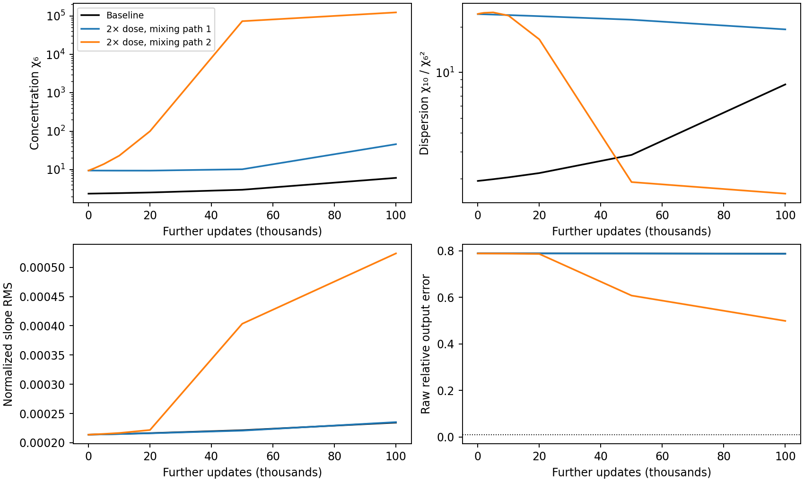
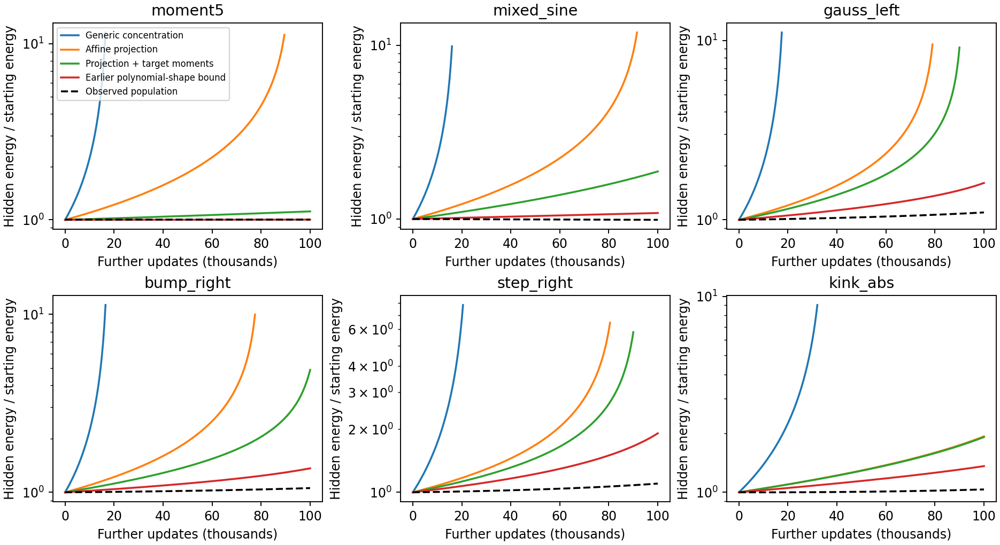
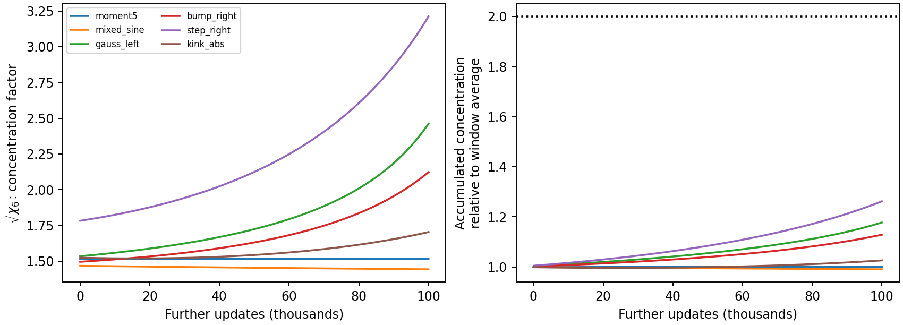
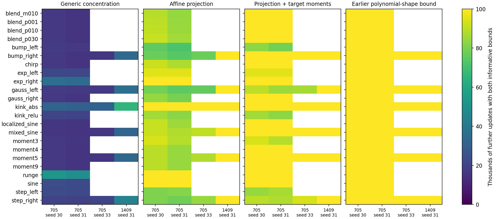
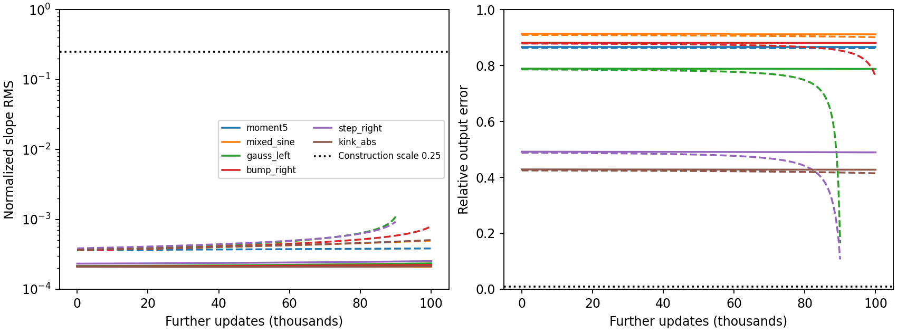
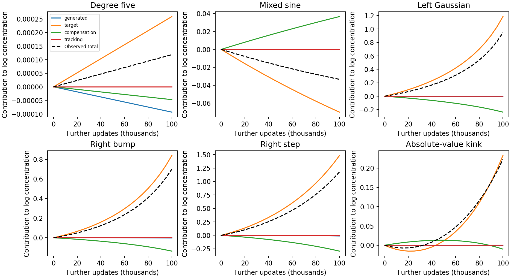
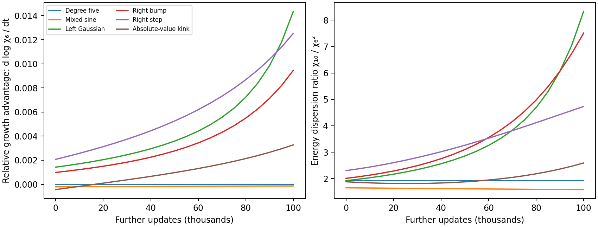
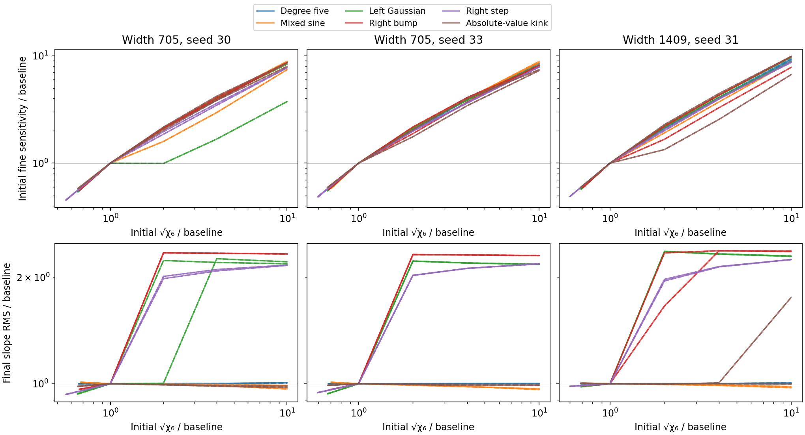
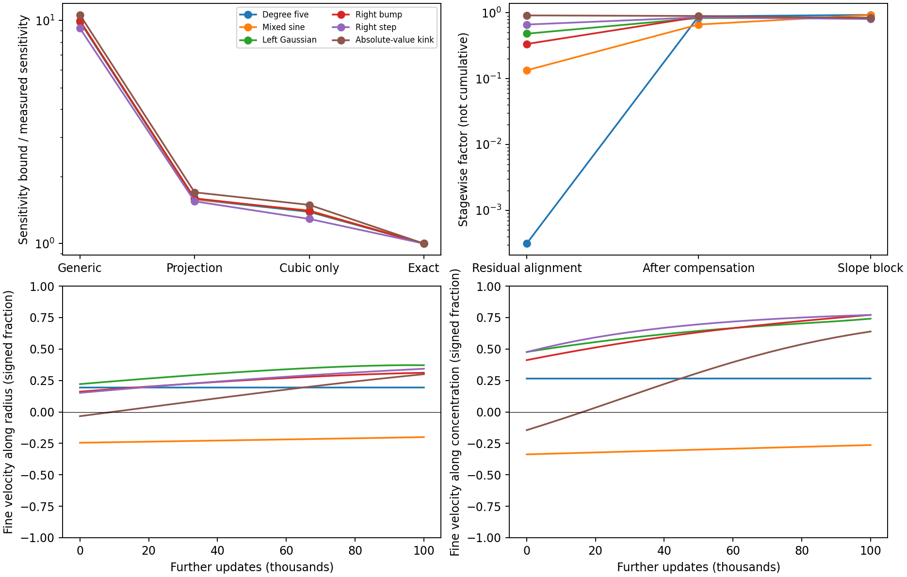
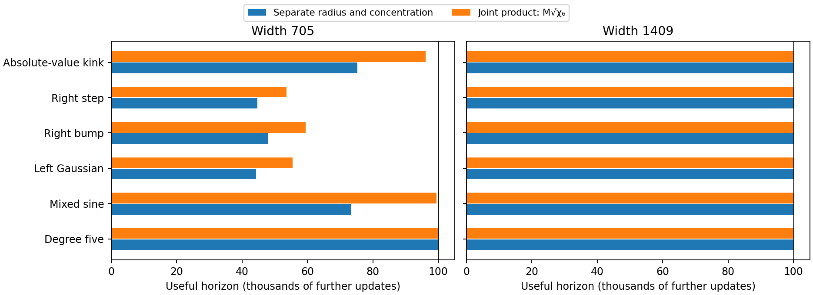

# Persistence from population concentration and target moments

The question is why a wide population under ordinary GD keeps learning its
slopes slowly after the coarse tracking transient. Our explanation has two parts. First, spreading
a fixed amount of parameter energy over many neurons limits their combined
nonlinear sensitivity. Second, concentration can reinforce this sensitivity
when relative growth favors already energetic neurons. Common expansion alone does not change
concentration. These are statements about population dynamics, with no bound
on an individual neuron's scale.

The useful theorem assumes that a few population moments accumulate
moderately over the interval. It derives small sensitivity, slow population
growth, and an output-error floor from those moments and the target. The
assumption is about energy distribution, not future force or its reinforcement.
It is checked along the subsequent trajectories; it is not inferred from the
starting state. Analytic projection and target-moment refinements give useful
conditional bounds for at least 79k additional updates across all 23 targets
and two width-705 seeds, and for 100k in 32 of 46 cases. At width 1409,
projection alone covers all six tested targets for 100k.

The new signed identities explain how that distribution changes. A coupled
comparison derives concentration growth from an aggregate energy-dispersion
condition; a separate theorem reduces the radius guarantee to three
accumulated moments. Matched redistribution experiments distinguish the
availability of nonlinear sensitivity from its ability to produce expansion.
Neither theory assumes universal contraction or permanent stagnation.

**Reading guide.** Sections 1–3 give the structural mechanism and its simplest
proof. Sections 4–5 explain why affine removal and target moments make the
bound useful; Section 7 shows the broad empirical coverage. Section 9 derives
the signed concentration dynamics and the coupled theorem. Section 10 gives
the accumulated-moment version. The final experimental discussion tests the
mechanism and identifies what remains unresolved. Section 15 tests the
qualitative extension to Adam and separates the observations that carry over
from the population assumptions that do not.

| Symbol | Meaning |
|---|---|
| $a_j,b_j,c_j$ | Physical slope, hidden bias, and readout of neuron $j$; $a_j=\gamma_j$. |
| $r_j^2=a_j^2+b_j^2+c_j^2$, $M=\sum_jr_j^2$ | Individual and total hidden parameter energy. |
| $S_k=\sum_jr_j^k$, $\chi_k=W^{k/2-1}S_k/M^{k/2}$ | Population moment and its dimensionless concentration. |
| $K=\chi_{10}/\chi_6^2$, $Y=M\sqrt{\chi_6}$ | Energy-weighted dispersion ratio and joint energy–concentration product. |
| $P_C,P_H$ | Orthogonal projections onto affine outputs and their complement. |
| $g=P_Hy$, $f_H=P_Hf$, $e_H=f_H-g$ | Fine target, output, and residual. |
| $F,R$ | Effective fine gradient, including compensation, and tracking gradient. |
| $E_0$ | Initial fine-residual norm for effective flow; initial full-residual norm for GD. |
| $\tau_k=\|P_{\mathcal P_k}g\|$ | Fixed target loading through polynomial degree $k$. |
| $h=2/N_{\rm ref}$, $\lambda_{\rm RMS}=h\|a\|/\sqrt W$ | Reference spacing and normalized population slope scale. |

The experimental widths include halo neurons: $W=705$ uses
$N_{\rm ref}=512$, and $W=1409$ uses $N_{\rm ref}=1024$. The construction
benchmark $\lambda_*=0.25$ therefore corresponds to physical slope magnitudes
64 and 128, respectively. It is a reference for comparing population scale,
not an independently assumed accuracy threshold; output accuracy is bounded
separately.

## 1. An assumption about organization, rather than motion

Suppose equal parameter energy is spread over all $W$ neurons. Then
$\chi_6=1$. If the same total energy is equally spread over $k$ active
neurons, $\chi_6=(W/k)^2$. This motivates the effective count
$W/\sqrt{\chi_6}$: it measures how many neurons share the energy in this
third-moment sense. It is not a literal count of neurons with nonzero weights.

A controlled Gaussian example shows why this is a useful starting point and
why it is not a complete state description. Two redistributions preserve
total energy and starting slope RMS while giving exactly the same twofold
increase in $\sqrt{\chi_6}$. One barely changes subsequent slope motion;
the other more than doubles the endpoint slope RMS relative to baseline.
Both still have large output error. The theory should explain how distributed
energy limits sensitivity while allowing the target and feature arrangement
to determine which way the population moves.

<figure>
  
  <figcaption>Gaussian target, width 705/seed 30, native GD starting at total update 25k. Both perturbed populations have identical starting total energy, slope RMS, and concentration. Their later trajectories differ. The dispersion ratio measures capacity for differential growth; it can fall after energy has already concentrated and is not itself an effective neuron count. The dotted output-error line is 1%. Section 11 gives the mixing controls and the broader experiment.</figcaption>
</figure>

Multiplying every hidden parameter by any common factor changes $M$ and the
slopes, but leaves $\chi_6$ unchanged. A bound on concentration therefore
permits arbitrarily large common scales. It also permits individual outliers;
their energy contributes to the aggregate moment. We assume no upper bound on
any individual neuron and no maximum-over-time concentration bound.

The structural hypothesis is that concentration does not accumulate too
quickly. The ODE will then bound growth of total energy. This is still a future
structural condition. Proving that the ODE itself preserves that condition is
a further question; it is not supplied by observing concentration at the start.

## 2. Derive the sensitivity before making a persistence assumption

Use a probability measure on $[-1,1]$ and the network
$f_\theta=d+\sum_jc_j\tanh(a_jx+b_j)$. Let $J_C=D(P_Cf)$,
$J_H=Df_H$, and assume $J_CJ_C^*$ is nonsingular. The exact decomposition is

$$
\Pi=I-J_C^*(J_CJ_C^*)^{-1}J_C,\qquad
F=\Pi J_H^*e_H,\qquad R=\nabla L-F,
\quad L=\tfrac12\|f-y\|^2.
$$

$\Pi$ is an orthogonal projection. Coarse compensation is included in $F$;
we do not assume it is small. Effective flow is $\dot\theta=-F$, and
ordinary gradient flow is $\dot\theta=-F-R$.

**Lemma 1 — concentration controls nonlinear sensitivity.** For exact tanh,

$$
\|J_H\|\le C_3\sqrt{S_6},\qquad
\|f_H\|\le A_3 S_4,
\qquad C_3=\frac{\sqrt6}{2},\quad A_3=\frac{\sqrt6}{8}.
\tag{1}
$$

**Proof.** Subtract the affine output $\sum_jc_j(a_jx+b_j)$ before projecting.
The global inequalities $|\tanh u-u|\le|u|^3/3$ and
$|\operatorname{sech}^2u-1|\le u^2$ bound its output and derivative.
At fixed $r^2=a^2+b^2+c^2$, use $|ax+b|\le\sqrt2\sqrt{a^2+b^2}$
and maximize the resulting products. The output bound is $A_3r^4$;
the squared sum of its derivative-column bounds is $C_3^2r^6$.
Summing outputs and squared columns proves (1). Orthogonal projection cannot
increase these norms. These are global inequalities, not a small-argument
assumption or a polynomial substitute for the dynamics. $\square$

Along effective flow, $(\|e_H\|^2)'=-2\|F\|^2$, so
$\|e_H(t)\|\le E_0$. Full gradient flow has decreasing full residual energy,
which supplies the same bound using the full residual at the start. Therefore

$$
\boxed{\|F\|\le \frac{C_3E_0}{W}\sqrt{\chi_6}\,M^{3/2}.}
\tag{2}
$$

This is the mechanism supplied by the assumptions: distributed parameter
energy produces small nonlinear sensitivity, and dissipation prevents the
residual from supplying an increasing norm multiplier. No measured future
force or reinforcement is used in (2).

## 3. Close the population-growth inequality

**Theorem 1 — a bound from accumulated concentration.** Start with $M_0>0$.
For effective flow, define

$$
B_6(t)=\int_0^t\sqrt{\chi_6(s)}\,ds,\qquad
D(t)=1-\frac{2C_3E_0M_0}{W}B_6(t).
$$

On every interval where $D(t)>0$,

$$
M(t)\le\frac{M_0}{D(t)},\qquad
\lambda_{\rm RMS}(t)\le h\sqrt{\frac{M_0}{W D(t)}}.
\tag{3}
$$

**Proof.** Since $M$ excludes only the output bias,
$\dot M\le2\sqrt M\|F\|$. Substitution of (2) gives
$\dot M\le2C_3E_0\sqrt{\chi_6}M^2/W$. Divide by $M^2$ and integrate
the derivative of $-1/M$ to obtain (3). A first-exit argument gives the same
conclusion without assuming in advance that the mass stays bounded.
The slope bound follows from $\sum_j a_j^2\le M$. $\square$

This is a population statement even when a few neurons escape. For any
construction scale $\lambda_*>0$,

$$
\frac{\#\{j:h|a_j(t)|\ge\lambda_*\}}{W}
\le\frac{\lambda_{\rm RMS}(t)^2}{\lambda_*^2}.
$$

Each counted neuron contributes at least $\lambda_*^2$ to the sum of
squared normalized slopes, which proves the inequality. Thus a small RMS
bound limits the fraction that can acquire the reference scale; it needs
neither a bound on the largest slope nor a ban on individual escape.

For example, if $B_6(t)\le\bar z\,t$ for a constant average allowance $\bar z$,
order-one population growth requires flow time
of order $W/(E_0M_0\bar z)$. This is a conditional width scaling, not a universal
update count. The denominator can eventually vanish. The theorem asserts
slow growth while its budget lasts; it does not assert equilibrium.

**Tracking and native GD.** Let $S_R(t)$ bound accumulated tracking travel
$\int_0^t\|R\|$. Set $\beta(t)=\sqrt{M_0}+S_R(t)$. Then (3) generalizes to

$$
\sqrt{M(t)}\le
\frac{\beta(t)}{\sqrt{1-2C_3E_0\beta(t)^2B_6(t)/W}}.
\tag{4}
$$

For GD, replace both integrals by left-point sums at the actual iterates and
assume the full-residual norm is at most $E_0$. This is implied by loss descent;
it is a distinct optimizer condition, not a consequence of concentration.

**Proof of transfer.** For a fixed endpoint, put all allowed tracking travel
into the initial radius. Subtracting the tracking already spent leaves a
nonnegative reserve. The radius plus its reserve satisfies
$\dot b\le a(t)b^3$, with $a=C_3E_0\sqrt{\chi_6}/W$.
For GD, the exact triangle inequality gives
$b_{n+1}\le b_n+\eta_na_nb_n^3$. The exact positive solution of
$\dot b=a_nb^3$ over a step dominates its Euler increment. Composition of
these exact steps gives (4) with $B_6=\sum_n\eta_n\sqrt{\chi_{6,n}}$.
This proof needs no trajectory-closeness approximation. $\square$

## 4. Use the affine projection to avoid wasting the bound

The generic constant in (1) bounds terms that the fine projection removes.
For the symmetric input measures in these experiments, only two cubic output
shapes remain. Define

$$
U_2=x^2-\mu_2,\qquad U_3=x^3-\frac{\mu_4}{\mu_2}x,
\quad s_2=\|U_2\|^2,\quad s_3=\|U_3\|^2,
\quad \mu_k=\langle x^k,1\rangle.
$$

These shapes are orthogonal. For $\Psi_3=-\sum_jc_j(a_jx+b_j)^3/3$,

$$
P_H\Psi_3=-\Big(\sum_jc_ja_j^2b_j\Big)U_2
 -\frac13\Big(\sum_jc_ja_j^3\Big)U_3.
\tag{5}
$$

**Lemma 2 — sharper population constants.** Put

$$
D_3^2=\frac8{27}s_2+\frac3{16}s_3,\qquad
B_3^2=\frac1{64}s_2+\frac3{256}s_3.
$$

Then, with $J_3=D(P_H\Psi_3)$,

$$
\|J_3\|\le D_3\sqrt{S_6},\qquad
\|P_H\Psi_3\|\le B_3S_4.
\tag{6}
$$

**Proof.** Differentiating (5) gives the exact Hilbert–Schmidt identity

$$
\|J_3\|_{\rm HS}^2=
s_2\sum_j(4c_j^2a_j^2b_j^2+c_j^2a_j^4+a_j^4b_j^2)
+s_3\sum_j(c_j^2a_j^4+a_j^6/9).
$$

Writing $A=a^2,B=b^2,C=c^2$, with $A+B+C=r^2$, the first bracket is at
most $8r^6/27$ and the second at most $3r^6/16$. For the output of one
neuron, the squared norm is $s_2CA^2B+s_3CA^3/9$;
$CA^2B\le r^8/64$ and $CA^3/9\le3r^8/256$.
Sum squared derivative norms and use the triangle inequality for outputs.
$\square$

Under the uniform continuous measure, $s_2=4/45$ and $s_3=4/175$.
The empirical midpoint measure supplies its own exact moments. Thus the
smaller constants come from the input geometry, not from fitting a force curve.

The exact tanh remainders give

$$
\|J_H-J_3\|\le C_5\sqrt{S_{10}},\qquad
\|f_H-P_H\Psi_3\|\le A_5S_6,
\tag{7}
$$

where $A_5=\frac2{15}\frac{2^{5/2}5^{5/2}}{6^3}$ and $C_5=6A_5$.
Consequently both the generic bound and
$E_0(D_3\sqrt{S_6}+C_5\sqrt{S_{10}})$ bound the force. Their minimum is
also a valid bound. This refinement introduces an accumulated higher moment;
it does not impose a maximum-neuron cutoff.

## 5. Target moments identify the available drive

Let $\tau_k=\|P_{\mathcal P_k}g\|$. Every column of $J_3$ belongs to
the quadratic–cubic output space. Decomposing the exact force before applying
norm inequalities gives

$$
\|F\|\le D_3\sqrt{S_6}(\tau_3+Q)
 +C_5E_0\sqrt{S_{10}},\qquad
Q=\min\{A_3S_4,\ B_3S_4+A_5S_6\}.
\tag{8}
$$

**Proof.** Write $J_H^*e_H=J_3^*f_H-J_3^*g+(J_H-J_3)^*e_H$.
Bound the three terms with (6), the polynomial target projection, and (7).
Apply the contractivity of $\Pi$. $\square$

The first contribution in (8) separates target loading from generated output.
The fixed target quantity $\tau_3$ vanishes for a gap through degree three;
it is retained for sine and localized targets. For bounded dimensionless
moments, bounded $M$, and $\tau_3=0$, this bound is order $W^{-2}$ rather
than $W^{-1}$. The gap alone does not guarantee that those moments persist.

An additional comparison retains $J_5=D(P_H\Psi_5)$, where
$\Psi_5=2\sum_jc_j(a_jx+b_j)^5/15$. Its force allowance is

$$
D_3\sqrt{S_6}\tau_3+C_5\sqrt{S_{10}}\tau_5
 +(D_3\sqrt{S_6}+C_5\sqrt{S_{10}})Q
 +C_7E_0\sqrt{S_{14}},
\tag{9}
$$

with $A_7=\frac{17}{315}\frac{2^{7/2}7^{7/2}}{8^4}$ and $C_7=8A_7$.
This follows from the same argument with the global seventh-degree derivative
remainder. No target-specific constant is fitted.

**Why the remainders are global.** For $u\ge0$, set
$\delta=u-\tanh u$ and $v=\tanh u-u+u^3/3$. Since
$0\le\tanh u\le u$, integration of $\delta'=\tanh^2u$ gives
$0\le\delta\le u^3/3$. Next,
$v'=u^2-\tanh^2u=\delta(u+\tanh u)$ lies between zero and
$2u^4/3$, giving $0\le v\le2u^5/15$. Finally, the derivative of
$w=u-u^3/3+2u^5/15-\tanh u$ equals $2uv+\delta^2$.
It lies between zero and $17u^6/45$, so $0\le w\le17u^7/315$.
Parity extends these absolute bounds to every real $u$. Maximizing the
resulting homogeneous products at fixed $a^2+b^2+c^2$ yields the stated
$A_5,C_5,A_7,C_7$. Thus the comparison permits features to grow; it never
uses an unverified Taylor convergence neighborhood.

**Growing comparison.** Substitute $S_k=\chi_k b^k/W^{k/2-1}$ into any of
these force bounds to obtain $V(t,b)$. Solve
$\dot b=V(t,b)+\|R\|$, starting at $\sqrt{M_0}$. Each bound, and their
minimum, is nondecreasing in $b$. Scalar comparison proves $\sqrt M\le b$;
native GD uses $b_{n+1}=b_n+\eta_n[V(n,b_n)+\|R_n\|]$.
The coefficients describe the evolving population. None is a frozen Jacobian
or a measured future effective force.

**Output consequence.** The same radius gives, at each time,

$$
\frac{\|f-y\|}{\|y\|}\ge
\frac{[\|g\|-Q(t,b(t))]_+}{\|y\|}.
\tag{10}
$$

For effective flow there is also the energy floor
$\|e_H(t)\|^2\ge[\|e_H(0)\|^2-2\int_0^tV(s,b(s))^2ds]_+$.
The capacity inequality (10) applies directly to GD without a separate
energy-defect allowance. The empirical norm is the training-grid norm;
continuous-measure conclusions require their own quadrature control.
The reference $\lambda=0.25$ is a construction benchmark, not a necessary
accuracy threshold. The output conclusion does not depend on choosing it.

## 6. What these statements explain, and what they still assume

The conclusion follows from three independently described ingredients:
distributed parameter energy, weak nonlinear sensitivity after removing the
affine output, and limited target loading of the surviving low-degree shapes.
Residual dissipation bounds the available error multiplier. Coarse compensation
is retained in the exact projected dynamics.

This is conditional on the accumulated population structure. It does not prove
that concentration remains moderate. It also does not establish universal
dominance of generated-error correction: earlier signed-balance measurements
show target-driven growth can be larger. Equations (8)–(9) safely allow that
growth. A further signed refinement must respect those observations.

The numerical test compares the generic concentration bound, the analytic
projection refinement, and the target-moment refinement. The earlier bound
using measured polynomial population coherences is a separately labeled
reference. Its better performance, if observed, identifies structure that the
concentration-only hypotheses discard; it is not evidence that the simpler
theorem already explains the same interval.

There is a specific reason not to insert a negative generated-error term into
the mass comparison without further work. The signed identity applies to the
geometry–readout imbalance $\Delta=\tfrac12\sum_j(a_j^2+b_j^2-c_j^2)$,
whereas $M$ adds all three squared norms. A negative generated contribution
to $\dot\Delta$ does not imply a negative contribution to $\dot M$.
The present proof uses exact residual-energy dissipation and allows mass to
increase. An additional balance argument would have to couple the two
observables rather than transfer the sign by analogy.

The sparse-state audit below confirms this distinction: the generated
contribution to $\dot\Delta$ is nonpositive at all 216 checked states, but
the target contribution exceeds its magnitude at 135 of those states.
These are repeated snapshots, not 216 independent runs. A theorem requiring
generated-error correction to dominate universally would exclude much of the
observed regime; the sensitivity argument does not require that dominance.

## 7. Empirical test: distinguish a structural failure from a loose bound

### Example: similar populations, very different proof margins

For the degree-five development case, the generic concentration theorem
gives an informative pair of slope and output bounds for only 16.5k further
updates. Retaining the affine projection extends this to 89.5k. Including
the target's vanishing quadratic–cubic loading extends it through the full
100k interval. The trajectory and concentration measurements are identical
in all three calculations; only the proved inequalities change.

For mixed sine, the corresponding durations are 16k, 91.5k, and 100k.
Its low-degree target loading is nonzero and is included. Thus the refinement
does not depend exclusively on an exact polynomial gap. Gaussian and step
development cases reach 90k under the target-moment refinement, despite
remaining slow afterward. In those cases the comparison loses the required
output-error floor; this is not an observed transition to rapid acquisition.

<figure>
  
  <figcaption>Six width-705 seed-30 GD cases, starting at total update 25k. Curves bound total hidden parameter energy divided by its starting value; dashed black curves are observations. Bounds stop when they no longer establish both normalized slope RMS below 0.25 and training-measure relative error above 1%. The earlier polynomial-shape reference uses additional population coherence and target-orientation information. No curve is fitted to the future effective force or its reinforcement.</figcaption>
</figure>

### The structural condition is empirically moderate

Across all 46 original width-705 runs, the accumulated $\sqrt{\chi_6}$
never exceeds 1.361 times the preceding 5k-window average multiplied by
elapsed time. The corresponding largest ratios are 1.220 for the six seed-33
runs and 1.055 for the six width-1409 runs. A factor-two allowance for this
particular accumulated concentration passes at every sampled prefix in all
58 native-GD cases. This is an observed property of energy distribution,
not a force-growth forecast.

The concentration itself need not remain nearly constant. In the step
development case, $\sqrt{\chi_6}$ rises from about 1.78 to 3.21, while
its accumulated ratio to the earlier window is only about 1.26. An
instantaneous maximum or a frozen-shape condition would spend considerably
more of the budget.

<figure>
  
  <figcaption>The same six GD cases. Left: square root of the normalized sixth moment, whose reciprocal times width is an effective energy-sharing count. Right: its integral divided by elapsed time and the average over updates 20k–25k. The horizontal line is the factor-two diagnostic. The undefined ratio at time zero is drawn at one; every positive-time point uses the measured accumulation. Neither plot assumes small future slopes.</figcaption>
</figure>

There is an important distinction between the generic theorem and its
refinements. The explicit formula (3) uses only $\chi_6$. The useful refined
comparisons also use $\chi_4,\chi_{10}$ and, when taking the quintic
alternative, $\chi_{14}$. Their reported coverage uses the measured structural
histories. The factor-two test for $\chi_6$ alone does not establish all of
those additional conditions. We have derived sensitivity from population
structure; we have not predicted every future population moment from five
thousand observations.

### Target breadth and width

The generic comparison covers none of the original 46 runs for the entire
100k interval; its median useful duration is 16.5k. The analytic projection
refinement covers eight, with a median of 87.75k and a minimum of 71.5k.
The target-moment refinement covers 32 and lasts at least 79k in every case.
The median initial force-bound slack decreases from 55.8 to 8.89 to 4.10
across these three stages. The force measurements audit slack; they do not
set a bound coefficient.

The remaining fourteen original cases are both seeds of the degree-three
target, left exponential, left Gaussian, left bump, left step, right step,
and ReLU kink. Their target-refined durations range from 79k to 95.5k.
The six previously generated seed-33 runs give four full intervals and a
minimum of 86.5k. Their outcomes were already known before this analysis;
we treat them as additional validation, not new held-out confirmation.

At width 1409, even the projection-only bound remains useful through 100k
for all six targets. Its largest final slope-RMS upper bound is below
$1.76\times10^{-4}$ and its smallest training-measure relative-error floor
exceeds 42.5%. Adding target moments lowers the largest slope bound to
$1.60\times10^{-4}$. The generic concentration bound still lasts only
32.5k–66k there. Width helps, but discarding the affine projection leaves a
substantial, avoidable loss in the theorem constants.

<figure>
  
  <figcaption>Every colored cell is a native-GD target, width, and seed. Color gives the last sampled prefix retaining both required inequalities, capped at 100k additional updates. Blank cells were not run. All panels use the same trajectories, training age, input measure, and output criterion. The final panel is the earlier theorem with richer polynomial population observables; it is not coverage of the simpler concentration assumptions.</figcaption>
</figure>

Among the 32 full original intervals under the target-moment refinement,
the largest final normalized slope-RMS bound is below 0.00111 and the
smallest output-error floor exceeds 28.3%. The reference construction scale
is 0.25; the population conclusion remains informative despite substantial
slack in the force bound. The independent error floor establishes failure
of a 1% training-measure accuracy requirement on these intervals.

<figure>
  
  <figcaption>Six development cases under the target-moment refinement. Solid curves show observed slope RMS and independent-grid raw output error. Dashed curves show the upper slope and lower training-measure error bounds; they stop when either usefulness condition fails. Horizontal dotted lines show the construction benchmark 0.25 and accuracy requirement 1%. The slope bounds begin above observed slope RMS because they start from total hidden energy, including biases and readouts.</figcaption>
</figure>

The richer polynomial-shape reference covers all 46 original intervals,
all six seed-33 intervals, and all six width-1409 intervals. It retains the
normalized sizes of the cubic and quintic outputs, their Jacobians, and their
pairings with the fixed target, then uses global remainders for exact tanh.
This identifies a remaining source of slack: scalar energy concentrations
discard polynomial cancellation and orientation. It does not justify
silently attributing the reference's coverage to the simpler hypotheses.

## 8. Verification of the concentration-bound evaluation

The original concentration-bound audit uses 72 saved trajectories: 58 native-GD wide-network cases,
six paired effective-flow cases, and eight step-refinement cases. There is
no new training. The primary interval is total updates 25k–125k at GD step
size 0.002, or 200 units of flow time. The 5k preceding window only supplies
the concentration-ratio diagnostic. Targets and normalization use the
original 2048 midpoint training grid; raw evaluation curves use the existing
8192-point grid. Refinement runs are compared at matched physical times;
halving the GD step doubles their actual update count.

Ten focused tests pass, covering energy-sharing interpretations, scale
invariance, the exact projected-cubic Jacobian identity, global tanh bounds
at four parameter scales, target orthogonality, a solvable cubic-growth ODE,
native-step comparison with tracking, and independence from saved force and
reinforcement fields. Independent sparse-state reconstruction checks 216
states at total update 20k, 25k, and 130k. Its largest relative discrepancy
in effective-force norm is below $6\times10^{-11}$; the projected-cubic
moment identity agrees within $7\times10^{-16}$ relative. Every sampled
force satisfies the analytic allowances, and every observed mass stays
below its applicable comparison to floating-point tolerance.

Halving the saved GD integration step changes final available slope bounds
by less than $1.13\times10^{-6}$ relative and leaves all reported durations
unchanged. Halving diagnostic sampling density changes available endpoint
bounds by at most about $1.17\times10^{-4}$ relative; duration differences
are at most one 500-update reporting interval. All sampled residual norms
are bounded by their initial value. These are numerical checks, not
interval enclosures between saved states. The native-GD theorem is exact
conditionally; its plotted evaluation uses interpolated structural data.

That post-processing ran on Modal CPU with a 4 GiB memory cap.
The evidence records input hashes, source hashes, commands, tests, and
per-case comparisons, including failures. No scientific arrays were loaded
on the local computer. The later replays and interventions described below
use new, separately accounted Modal GPU computation.

The main gain is a structural implication: distributed parameter energy,
affine removal, and specified target moments yield small sensitivity and
slow population growth. Persistence of that energy distribution remains an
empirically supported condition. We next examine its coupled dynamics and
test the consequences of changing the distribution at fixed population scale.

## 9. Relative growth advantage and a coupled concentration theorem

If every neuron's energy increases by the same fractional amount, the
population expands without concentrating. Concentration changes when some
neurons gain energy faster relative to what they already have. The following
identities make that distinction exact and identify the aggregate quantities
needed to study it.

Write $e_j=r_j^2$ and $\alpha=k/2$. Where $M>0$,

$$
\frac{d}{dt}\log\chi_k
=\alpha\left(
\frac{\sum_j e_j^{\alpha-1}\dot e_j}{\sum_j e_j^\alpha}
-\frac{\dot M}{M}\right).
\tag{11}
$$

The first term weights the fractional growth of energy-rich neurons more
heavily; the second is the population's energy-weighted fractional growth.
The formula remains defined when some neurons have zero energy. It requires
no individual fractional rate at those neurons.

**Exact signed decomposition.** The four velocity components are

$$
v_{\rm generated}=-J_H^*f_H,\quad
v_{\rm target}=J_H^*g,\quad
v_{\rm compensation}=(I-\Pi)J_H^*e_H,\quad
v_{\rm tracking}=-R.
\tag{12}
$$

Their sum is the GD gradient-flow velocity. Effective fine flow omits only
the last component. Dotting each component with $\nabla\log\chi_k$ gives
its signed contribution to (11). Generated-output correction need not have
the same sign for concentration as it has for geometry–readout imbalance.
The observable must determine the sign calculation.

**Example: positive feedback can remain slow.** In the degree-five
development run, $\chi_6$ increases by only 0.012% over 100k further updates.
In the Gaussian run it increases by a factor 2.57, and its instantaneous
logarithmic growth rate increases about tenfold. Both are in the slow
population-motion regime. Persistence therefore cannot mean that the
concentration, its growth rate, or the local acceleration stays frozen.

Across the 58 native-GD cases, generated-output correction makes a negative
integrated contribution to $\log\chi_6$ in every case. Nevertheless,
concentration grows in 41 cases: target-driven growth commonly exceeds
correction. Compensation opposes concentration in 38 cases and supports it
in the others. The median ratio of net change to the sum of absolute signed
contributions is 0.592, so universal near-cancellation would also be an
inaccurate explanation. The largest observed concentration ratio is 6.44;
the median is 1.07.

<figure>
  
  <figcaption>Width 705, seed 30, starting at total update 25k. Each curve is accumulated along the evolving trajectory, not a frozen-force prediction. The black dashed line is the actual change in log concentration. Native-step defects close the identity and are numerically negligible here. Panel scales differ: the degree-five change is thousands of times smaller than the Gaussian and step changes. Tracking is retained in the audit and is small on these intervals.</figcaption>
</figure>

Generated-output correction is especially small in the Gaussian, bump, and
step examples. Their target contribution and compensating coarse response
are the larger competing terms. For mixed sine, the target contribution to
concentration is negative and compensation partly offsets it. Thus the
empirics support a signed, target-dependent balance inside the same general
framework; they do not support assigning each component a universal role.

**Which feature difference gives an advantage?** Write $s=\nabla\log\chi_6$.
The effective-flow rate is exactly
$\langle g,J_H\Pi s\rangle-\langle f_H,J_H\Pi s\rangle$.
For the leading cubic output $f_3=\sum_j f_{3,j}$, homogeneity gives

$$
J_3s=24\left(\frac{\sum_j e_j^2f_{3,j}}{\sum_j e_j^3}
-\frac{f_3}{M}\right).
$$

To see this, use the score in the proof below and
$D f_{3,j}(a_j,b_j,c_j)=4f_{3,j}$. The quantity in parentheses compares
energy-rich neurons' nonlinear output with the population average per unit
energy. Target alignment with this difference favors concentration;
alignment with the network's generated output favors its correction.
Coarse compensation contributes the separate projection correction
$J_H(\Pi-I)s$, and exact tanh contributes its controlled higher-order
remainder. This identity explains what the signed audit measures without
asserting that either contribution always dominates.

**Lemma 3 — sensitivity of concentration to population motion.** Define

$$
K=\frac{\chi_{10}}{\chi_6^2}\ge1.
$$

Then

$$
\|\nabla\log\chi_6\|^2=\frac{36}{M}(K-1),\qquad
\langle\nabla\log\chi_6,\theta\rangle=0.
\tag{13}
$$

**Proof.** The hidden block of the gradient for neuron $j$ is
$6(e_j^2/\sum_i e_i^3-1/M)(a_j,b_j,c_j)$, and the output-bias entry is
zero. Squaring and summing gives
$36[\sum_j e_j^5/(\sum_j e_j^3)^2-1/M]$, which is (13).
The radial pairing vanishes by direct summation. Cauchy–Schwarz gives
$(\sum e_j^3)^2\le M\sum e_j^5$, hence $K\ge1$. $\square$

There is an independent interpretation of $K$. Give neuron $j$ probability
$e_j/M$ and observe $e_j^2$. Then $K-1$ is the variance of this observation
divided by its squared mean. It measures dispersion under energy weighting.
Equal energy on any active subset gives $K=1$, regardless of how small that
subset is. Thus controlling $K$ does not itself assume small concentration.

Equal energies also do not imply an invariant state. At a state with all
$e_j=M/W>0$, the first derivative of $\log\chi_6$ vanishes, but

$$
\frac{d^2}{dt^2}\log\chi_6
=6\,\operatorname{Var}_j(\dot e_j/e_j).
\tag{14}
$$

To prove this, differentiate $\sum_j(e_j/M)^3$ twice. Terms involving the
second derivative of the normalized energies sum to zero at equal energies;
the remaining term is six times the stated variance. Differential growth can
therefore create concentration at second order, even when its initial rate
is zero.

<figure>
  
  <figcaption>The relative growth advantage and the dispersion ratio are measured on the changing population. Gaussian, bump, and step targets develop increasing advantage; the degree-five trajectory changes very little. The coupled theorem below permits these increases. It needs an allowance for their aggregate dispersion, not contraction or a constant local Taylor model.</figcaption>
</figure>

**Theorem 2 — coupled growth from aggregate energy dispersion.** For effective
fine flow, put $z=\sqrt{\chi_6}$, $Y=Mz$, and $a_0=C_3E_0/W$. Then

$$
\dot M\le2a_0M^2z,\qquad
\dot z\le3a_0\sqrt{K-1}\,Mz^2,
$$
$$
Y(t)\le
\frac{Y_0}{1-a_0Y_0\int_0^t\sqrt{9K(s)-5}\,ds}
\tag{15}
$$

while the denominator is positive. This theorem derives the evolution of
concentration from a condition on accumulated dispersion; it does not take
the concentration trajectory as an input.
In particular, if $\overline Y$ denotes the right side of (15), then
$z(t)\le z_0\exp(3a_0\int_0^t\sqrt{K-1}\,\overline Y\,ds)$ follows
by integrating the second component inequality in logarithmic form.

**Proof.** Equation (13) and Cauchy–Schwarz give
$\dot z\le3z\sqrt{K-1}\|F\|/\sqrt M$. Combine this with (2) and the
mass inequality from Theorem 1 to obtain the component inequalities.
For the sharper product bound, write
$\nabla Y=2z\theta_{\rm hidden}+(Mz/2)\nabla\log\chi_6$.
The two vectors are orthogonal by (13), so
$\|\nabla Y\|^2=Mz^2(9K-5)$ and
$\dot Y\le a_0\sqrt{9K-5}\,Y^2$. Integrating the reciprocal and applying
the first-exit argument proves (15). The orthogonality matters: radial growth
and concentration cannot both use the entire velocity norm simultaneously.
$\square$

The premise remains a future structural condition. Its role is different:
energy dispersion limits how rapidly concentration can reinforce energy
growth. A numerical test must determine whether the resulting allowance is
useful and whether the measured dispersion supports it.

The same product also admits a scalar comparison retaining the affine
projection. Since $M\le Y$ and $\sqrt{S_6}=Y\sqrt M/W$,

$$
\dot Y\le E_0\sqrt{9K-5}
\left(\frac{D_3}{W}Y^2+\frac{C_5\sqrt K}{W^2}Y^3\right).
\tag{15a}
$$

This follows by multiplying the projected force bound by
$\|\nabla Y\|=Y\sqrt{9K-5}/\sqrt M$; the factors of $M$ cancel.
For a target-aware alternative, define
$Q_Y=\min\{A_3Y^2/W,B_3Y^2/W+A_5Y^3/W^2\}$ and replace the right side by
$\sqrt{9K-5}[D_3Y^2(\tau_3+Q_Y)/W+C_5E_0\sqrt K Y^3/W^2]$.
Either expression and the generic bound in (15) are valid, so their minimum
is valid. A scalar solution starting at $Y_0$ bounds $Y$ by first crossing.
It gives $\lambda_{\rm RMS}\le h\sqrt{Y/W}$ and output floor
$[\|g\|-Q_Y]_+/\|y\|$. Tracking adds $Y\tau_{Y,R}$, where
$\tau_{Y,R}\ge[\dot M_R/M+\tfrac12(\log\chi_6)'_R]_+$.
These remain population quantities. The scalar comparison uses the
orthogonality of the two growth directions, while substituting $M\le Y$
loses some information about radius. The two-variable version below keeps
radius and concentration separate. The comparisons preserve different
information, so their useful durations must be compared empirically.

**Rate corollary — a condition on dispersion alone can delay reinforcement.**
For effective flow, fix a product cap $Y_*>Y_0$ and define

$$
G_1(t)=\int_0^t\sqrt{9K-5}\,ds,\qquad
G_2(t)=\int_0^t\sqrt{K(9K-5)}\,ds,
$$
$$
H_{Y_*}(t)=\min\left\{
\frac{C_3E_0G_1}{W},\quad
\frac{D_3E_0G_1}{W}+\frac{C_5E_0Y_* G_2}{W^2},\quad
\frac{D_3(\tau_3+Q_{Y_*})G_1}{W}+\frac{C_5E_0Y_* G_2}{W^2}
\right\},
\quad Q_{Y_*}=\min\{A_3Y_*^2/W,B_3Y_*^2/W+A_5Y_*^3/W^2\}.
$$

If $Y_0/(1-Y_0H_{Y_*}(T))<Y_*$ with positive denominator, then $Y$ remains
below $Y_*$ through $T$. Before first exit, each scalar force allowance is
at most a nonnegative coefficient times $Y^2$. Integrating the reciprocal
with $Y\le Y_*$ in the higher powers gives the three terms in $H_{Y_*}$ and
contradicts a first exit. Thus only two accumulated dispersion quantities
are needed for this version, with no maximum-over-time constraint on $K$.

If $G_1,G_2$ grow at width-independent average rates and $Y_0,E_0,Y_*$ are
order one, the permitted time is order $W$ for fixed nonzero low-degree
loading. When $\tau_3=0$, the target-aware allowance instead gives an
order-$W^2$ time scale. The constants and the required dispersion allowances
matter for finite instances. These conditional rates derive slow evolution
of concentration and energy together; they do not assume that either is
frozen. A bounded accumulated tracking contribution to $\log Y$ is included
by replacing $Y_0$ with $Y_0\exp(\int\tau_{Y,R})$ and reserving that growth
at the start, using the same first-exit proof.

**A complementary two-variable comparison.** Let $b=\sqrt M$. Cauchy–Schwarz gives
$\chi_4\le\sqrt{\chi_6}=z$, and $\chi_{10}=Kz^4$. Define

$$
Q(b,z)=\min\{A_3zb^4/W,\ B_3zb^4/W+A_5z^2b^6/W^2\},
$$
$$
V(b,z,K)=\min\left\{
\frac{C_3E_0zb^3}{W},\quad
E_0\left(\frac{D_3zb^3}{W}+\frac{C_5\sqrt K z^2b^5}{W^2}\right),\quad
\frac{D_3zb^3}{W}(\tau_3+Q)+\frac{C_5E_0\sqrt K z^2b^5}{W^2}
\right\}.
\tag{16}
$$

For ordinary gradient flow, let $r\ge\|R\|$ and
$\tau_R\ge[\langle\nabla\log\chi_6,-R\rangle]_+$. The cooperative system

$$
\dot B=V(B,Z,K)+r,\qquad
\dot Z=3Z\sqrt{K-1}\,V(B,Z,K)/B+\tfrac12Z\tau_R
\tag{17}
$$

with $B(0)=b_0,Z(0)=z_0$ bounds $b,z$. Indeed, the right sides bound the
actual derivatives and are nondecreasing in the other coordinate. Both
$V$ and $V/B$ are minima of nonnegative polynomials with nonnegative powers
of $B$ and $Z$. Standard first-crossing comparison proves the claim.
The slope bound is $hB/\sqrt W$, and the output floor is
$[\|g\|-Q(B,Z)]_+/\|y\|$.

**Native-step version.** For GD, define the exact concentration defect

$$
d_n=\log\chi_6(\theta_{n+1})-\log\chi_6(\theta_n)
-\eta_n\langle\nabla\log\chi_6(\theta_n),-\nabla L(\theta_n)\rangle.
$$

An exact conditional comparison is

$$
B_{n+1}=B_n+\eta_n[V(B_n,Z_n,K_n)+r_n],
$$
$$
Z_{n+1}=Z_n\exp\left\{
3\eta_n\sqrt{K_n-1}\frac{V(B_n,Z_n,K_n)}{B_n}
+\frac{\eta_n\tau_{R,n}}2+\frac{[d_n]_+}2\right\}.
\tag{18}
$$

The triangle inequality proves the radius step. The definition of $d_n$,
(13), and monotonicity prove the concentration step by induction. No
continuous-flow trajectory-closeness claim is needed for this formula.
Numerically integrating (17) using saved GD data is a separate diagnostic;
it is not an evaluation of the exact discrete comparison (18).

## 10. A theorem using three accumulated population moments

A full history of concentration is more information than some conditional
claims need. For a fixed interval, define three clocks

$$
I_6=\int\sqrt{\chi_6}\,dt,\qquad
I_{10}=\int\sqrt{\chi_{10}}\,dt,\qquad
I_{46}=\int\chi_4\sqrt{\chi_6}\,dt.
$$

**Theorem 3 — a finite radius cap from accumulated structure.** Fix a trial
radius $B>b_0$ and accumulated tracking allowance $S_R$. Put
$\beta=b_0+S_R$ and

$$
\mathcal A_B=\min\left\{
\frac{C_3E_0}{W}I_6,\quad
\frac{D_3E_0}{W}I_6+\frac{C_5E_0B^2}{W^2}I_{10},\quad
\frac{D_3\tau_3}{W}I_6+\frac{C_5E_0B^2}{W^2}I_{10}
+\frac{D_3A_3B^4}{W^2}I_{46}
\right\}.
\tag{19}
$$

If

$$
1-2\beta^2\mathcal A_B>0,\qquad
\frac{\beta}{\sqrt{1-2\beta^2\mathcal A_B}}<B,
\tag{20}
$$

then the radius never reaches $B$ on that interval, and its endpoint is at
most the fraction in (20). Nonnegative upper allowances for the clocks may
replace their measured values. Left-point sums give the native-GD statement,
with the residual-norm condition stated earlier.

**Proof.** Before the first crossing of $B$, each of the generic, projected,
and cubic target-moment force bounds has the form
$\|F\|\le a_i(t,B)b^3$, using $Q\le A_3\chi_4b^4/W$ for the third
bound. Their integrated coefficients are the three entries in (19).
Reserve all tracking travel at the start as in (4). The enlarged radius
satisfies each cubic comparison until first exit. Reciprocal integration
therefore bounds it by the fraction in (20), using the minimum of the three
integrated coefficients. This contradicts a first crossing. For GD the
exact cubic flow dominates each Euler increment, giving the same result.
$\square$

This theorem needs accumulated structural budgets, not a frozen Jacobian or
a force forecast. It yields a slope bound directly. An output-capacity floor
also requires the relevant instantaneous population moment at the evaluation
time; the three clocks alone do not supply that additional statement.

## 11. Change concentration while holding population scale fixed

Increasing every slope cannot distinguish concentration from total scale:
it changes both the network and the theorem's initial energy budget. Instead,
we mix the hidden parameter columns. If $H$ has columns $(a_j,b_j,c_j)^T$,
replace it by $HO$ for an orthogonal neuron-mixing matrix $O$. This preserves
$HH^T$, hence total energy, all three parameter-block norms, their pairwise
inner products, and the affine output
$d+(c^Ta)x+c^Tb$. Starting slope RMS is identical in every arm. The nonlinear
output need not be identical; its change is recorded, and there is no readout
refitting.

The baseline and eight interventions start at total update 25k. Two mixing
paths each produce equal neuron energies, or increase $\sqrt{\chi_6}$ by
factors 2, 4, and 10. A tenfold dose therefore means a hundredfold increase
in $\chi_6$, at unchanged total energy. Under the sensitivity bound (2),
it increases the available force allowance tenfold. This is a substantial
perturbation of population organization, not a small slope dilation.

We continue each state under native GD and effective fine flow for the same
200 units of physical time: 100k GD updates at step size 0.002, or 10k
RK4 steps at size 0.02. The three cohorts are width 705/seed 30, width
705/seed 33, and width 1409/seed 31. All use the same six targets:

| Target | Unnormalized shape |
|---|---|
| Degree five | $0.3q_0+0.4q_1+\sqrt{0.75}\,q_5$, with orthonormal polynomial modes $q_k$. |
| Mixed sine | $\sin(2\pi x)+\tfrac12\sin(6\pi x)+\tfrac14\sin(14\pi x)$. |
| Left Gaussian | $\exp(-((x+0.35)/0.22)^2)$. |
| Right bump | $\exp(1-1/(1-u^2))$ for $|u|<1$, zero otherwise, with $u=(x-0.35)/0.22$. |
| Right step | $\tanh(14(x-0.31))$. |
| Absolute-value kink | $|x+0.23|$. |

Each target uses its original RMS normalization on the 2048-point midpoint
training grid. The independent 8192-point evaluation uses that same fixed
normalization. Error always refers to the raw trained network output.

**What distinguishes the hypotheses.** If redistribution changes sensitivity
but not expansion, concentration limits the available coupling without
determining its direction. If both GD and effective flow accelerate, the
response belongs to effective fine dynamics and cannot be attributed solely
to renewed tracking. If two paths with identical concentration doses differ,
scalar concentration alone omits relevant orientation. A fixed-baseline-residual
force probe separates changes in the Jacobian and compensation projection
from the instantaneous change in residual. Permutations and simultaneous
sign changes of individual columns provide exact null controls.

Orthogonal mixing also changes feature orientation. It is therefore a causal
intervention on the energy distribution and feature arrangement together,
with strong controls on population scale. It does not identify a universal
causal effect of the scalar $\chi_6$ in isolation. The two paths and the
signed identities are needed to interpret that distinction.

### More sensitivity can produce expansion, correction, or little motion

For degree five at width 705/seed 30, the tenfold concentration dose increases
initial fine sensitivity 8.66–8.68 times and effective force 234–240 times.
Holding the original residual fixed gives an even larger force gain, so the
effect is present in the changed feature coupling itself. Yet final slope RMS
is only 0.59–0.63% larger than the baseline, and relative output error remains
86.6%. For seed 33 the slope gain is only 0.20–0.25%. Increased sensitivity
is not sufficient for rapid acquisition.

The Gaussian, bump, and step development cases respond differently: the
tenfold dose produces final slope RMS roughly 2.16–2.33 times baseline.
Their final relative errors are about 50%, 70%, and 19%, respectively.
These are measurable changes in the dynamics, while the networks still
miss the 1% output requirement by a large margin. Mixed sine and the
absolute-value kink instead end with slightly smaller slope RMS than their
baselines. The second width-705 seed reproduces this division of responses.

The wider cohort also shows why this division should not become a fixed
classification of targets. At width 1409, the tenfold kink intervention has
one path ending near $7.48\times10^{-5}$ normalized slope RMS with 42.8%
error, and another near $1.32\times10^{-4}$ with 11.5% error. Arrangement
matters within a target as well as between targets. Across all 324 baseline
and intervention continuations, the smallest error at a saved checkpoint is
11.52%, and the largest normalized slope RMS is below $5.48\times10^{-4}$.
Even the accelerated cases remain far from the output requirement and
construction scale.

Across all 162 matched GD/effective-flow pairs, final slope RMS differs by
at most 0.283% relatively, and final raw relative error differs by at most
0.00101 absolutely. The same accelerated and unresponsive cases appear
without tracking. Within this campaign, renewed coarse disequilibrium is
therefore not the explanation for the intervention response; the effective
fine dynamics already produce it.

<figure>
  
  <figcaption>Top: sensitivity immediately after redistribution, relative to each cohort's baseline. Bottom: slope RMS after 100k equivalent updates, relative to its baseline at the same endpoint. All arms start with identical slope RMS and total parameter energy. Solid curves use GD; dashed curves use effective fine flow. Each target has two mixing paths. The equal-energy point is below one on the horizontal axis; doses 2, 4, and 10 multiply the square root of concentration. The common row scales permit comparison across cohorts.</figcaption>
</figure>

### The same concentration dose does not specify the coupling

The Gaussian development example makes the missing information visible.
Two paths produce the same twofold $\sqrt{\chi_6}$ dose, at identical
population energy and slope scale. One raises initial sensitivity by 2.11
times and ends at 2.23 times baseline slope RMS. The other leaves initial
sensitivity almost unchanged and ends only 0.33% above baseline. Their
final raw errors are about 49.9% and 78.7%. Energy concentration determines
a valid sensitivity allowance; how energy is divided between slopes,
biases, and readouts within each neuron still affects the realized
Jacobian and its alignment with the target.

This is consistent with the weighted feature contrast following (12).
Concentration controls the magnitude of an available coupling; the signed
target and generated-output pairings determine how it is used. Future
mechanistic refinements should retain a few such collective orientations,
rather than impose bounds on every neuron.

## 12. Locate the remaining slack before adding assumptions

The generic sensitivity estimate is about 9.84 times the exact fine
Hilbert–Schmidt sensitivity at the median audited case. Retaining affine
projection reduces this ratio to 1.58; for the leading cubic Jacobian alone,
the concentration estimate is about 1.38 times its exact norm. These are
medians of within-run median ratios over the 58 native-GD trajectories.
The scalar concentration estimate therefore captures much of the available
sensitivity once the affine directions are removed.

There are larger losses in subsequent norm inequalities. The median
residual-alignment factor is 0.263. Compensation retains a median 0.858 of
the raw fine-force norm, and the slope block retains 0.844 of the effective
fine-force norm. Only a median signed fraction 0.165 of fine velocity points
outward in total hidden radius. The corresponding median absolute fraction
in the concentration direction is 0.334. None of these factors is inserted
into a proved coefficient merely because its measured median is small.

<figure>
  
  <figcaption>Six development targets. Top left: sensitivity allowances at the starting checkpoint; the cubic-only point compares cubic quantities on both sides. Top right: separate factors for residual alignment, retained norm after compensation, and slope-block fraction. They are not cumulative fractions. Bottom: signed projections of effective fine velocity onto radial and concentration-growth directions as the population evolves. Positive values support the named growth; negative values oppose it. These are aggregate diagnostics, not neuronwise controls.</figcaption>
</figure>

The justified refinement is to retain population direction, especially the
target-loaded cubic contrast and radial pairing. Assuming universal
contraction, perfect cancellation, or negligible compensation would contradict
these measurements. The product theorem already removes one avoidable loss:
radial growth and concentration growth cannot both use the full velocity
because their gradient directions are orthogonal.

## 13. Which theorem should carry the claim?

The concentration-history theorem remains the broadest validated result:
at least 79k additional updates across 23 targets and two width-705 seeds,
using measured structural moments and fixed target data. The new coupled
theorem addresses a different part of the explanation. It derives energy
and concentration growth together from $K=\chi_{10}/\chi_6^2$, rather than
supplying the concentration trajectory to the comparison.

On the six width-705 development cases, the separate radius/concentration
comparison remains useful for 44.3k–100k additional updates, with median
60.7k. Retaining their joint product and its orthogonal gradient budget
improves this to 53.6k–100k, with median 77.8k. The corresponding effective-flow
comparisons give essentially the same durations. At width 1409 both
comparisons cover all six targets through 100k. For the scalar product
comparison evaluated on GD data, the largest final normalized slope bound
is below $2.60\times10^{-4}$ and the smallest final output-error floor
exceeds 42.1%.

<figure>
  
  <figcaption>Both comparisons receive the measured dispersion history and the appropriate tracking allowance, together with the starting state and fixed target moments. They do not receive a future effective-force forecast or concentration trajectory as an independent input. Bars stop when the continuous comparison ceases to establish both the slope bound and the 1% output-error floor, or at 100k. The plotted GD evaluation is a sampled gradient-flow diagnostic. Equation (18) is the separate exact native-step statement; these bars are not certified evaluations of its positive discrete-defect allowance.</figcaption>
</figure>

The three-clock radius theorem tests a further simplification of the
premises. At width 705, the sixth-moment clock stays within 1.363 times its
preceding-window average times elapsed time, but the tenth-moment clock can
reach 3.40 times that reference. A factor-two allowance for all three clocks
therefore fails in some cases after 75k. A factor-four allowance holds at
every sampled prefix in all 58 native cases, but yields a median useful
radius duration of only 20k at width 705. At width 1409, factor-two allowances
hold throughout all six cases and give slope-bound durations of 80k–100k.
These are slope-only results. They demonstrate the cost of simplifying the
structural input and using a fixed trial-radius cap; they do not supersede
the longer comparisons.

The paper claim can therefore remain direct: **distributed population
energy limits fine sensitivity; measured aggregate structural persistence
turns that limit into a finite-time population-scale and output-error bound.**
The coupled theorem explains a route to persistence through limited
differential growth, while the interventions identify the target orientation
that a sharper version should retain. The accumulated structural conditions
are empirically supported over stated intervals. Their unconditional
preservation for arbitrary later times is not part of the claim.

## 14. Verification and reproducibility of the new campaign

The campaign completed 72 archived-trajectory replays, 324 matched baseline
and intervention continuations, and 16 step-refinement continuations. All
152 attempted redistribution constructions passed their Gram and dose
checks; no trajectory was truncated or rejected. The largest relative
Gram error was $8.25\times10^{-16}$. Native-GD replays matched archived
parameters bitwise; the largest relative discrepancy across all replays was
$3.05\times10^{-16}$. Accumulating the four signed concentration rates and
the native-step defects closed the observed log-moment changes within
$1.23\times10^{-12}$.

The 22 focused tests cover the exact concentration scores, their aggregate
norm identities, the velocity split, acceleration at equal energy, the
weighted cubic contrast, the joint-product derivative bound, native-step
bookkeeping, finite mixing controls, null symmetries, and independently
solved comparison equations. Halving the continuation step at matched
physical times changes final slope RMS by at most $6.47\times10^{-7}$
relatively, concentration by $1.62\times10^{-5}$ relatively, and raw error
by $7.02\times10^{-8}$ absolutely. All sampled residual norms satisfy the
initial-residual bound used by the comparisons.

Halving the density of the audited dispersion histories changes the
two-variable comparison's stopping time by at most 40 equivalent updates
and the scalar comparison's by at most 59. Where both resolutions cover
the full interval, endpoint slope bounds change by at most 0.017%
relatively. These tests support the numerical evaluation. They do not
provide interval enclosures between stored states or evaluate the
positive-part defect sum needed by (18).

All numerical computation ran remotely on Modal. The five GPU jobs used
7403.5 seconds of recorded function time, about 2.06 GPU-hours within the
approved three-hour campaign. Remote host memory stayed below 4.5 GiB
under an 8 GiB hard cap; CPU analysis used a 4 GiB hard cap. Only scalar
diagnostics and sparse initial/final intervention states were retained.
Scientific arrays were not loaded on the local computer. This campaign
tests the GD metric and effective fine flow; its quantitative statements
do not extend to Adam's adaptive metric without a separate derivation.

The evidence accompanying this note contains the raw scalar histories,
construction diagnostics, signed balances, comparison failures as well as
successes, step-refinement comparisons, plots, and execution/source hashes.
The remaining theoretical refinement is collective orientation: constrain
the target-loaded nonlinear contrast and radial pairing while allowing
energy redistribution. That would use the slack identified in Section 12
without returning to neuronwise control or assuming a future weak force.

## 15. What carries over to Adam?

Adam supports part of the population explanation: concentration accumulates
moderately, and effective fine updates supply positive slope-energy growth.
It also reveals an important boundary of the theorem. By the beginning of
the measurement interval, Adam has accumulated much more parameter energy,
shared by a much smaller effective part of the population than under GD.
The population conditions that yield small sensitivity cannot be transferred
merely because the subsequent concentration history is stable.

### Start with the accuracy and scale observations

We trained Adam from the same initializations as the GD controls on six
targets: degree five, mixed sine, Gaussian, compact bump, step, and kink.
There are two seeds at each of widths 705 and 1409. The optimizer uses
learning rate 0.002, moment coefficients 0.9 and 0.999, and denominator
offset $10^{-8}$. All 24 runs receive 125k full-batch updates. We use
20k–25k as the preceding window and inspect 25k–125k; the start is fixed
rather than selected for small tracking or favorable concentration.

Twelve runs attain 1% relative training error during that interval, seven
attain 0.1%, and none attains $10^{-4}$. These statements use every-update
accuracy counters. Degree five, mixed sine, and bump stay above 1% in all
four width–seed combinations; Gaussian, step, and kink attain 1% in all
four. Thus the error criterion matters. Small population scale alone does
not imply failure at every tolerance.

Endpoint $\lambda_{\rm RMS}$ is 0.00198–0.0121 at width 705 and
0.000684–0.00347 at width 1409. The largest RMS increase during the
interval is 3.47-fold. These are evolving populations whose acquired scale
remains far below the construction reference, rather than stationary states.

<figure>
  
  <figcaption>Updates 25k–125k, with two seeds per target and width. Solid curves show Adam and dashed curves GD; Adam shading spans the seeds and is not a confidence interval. Top: raw relative training error with a 1% line. Bottom: normalized slope RMS with the construction reference 0.25. Both optimizers use the current checkpoint and attached readouts. An independent 8192-point grid gives a separate endpoint accuracy check. The reference slope is not treated as necessary for 1% accuracy.</figcaption>
</figure>

### The structural persistence check passes, but its starting level differs

Using every-update trapezoidal accumulation, the largest saved-prefix ratio
of accumulated $\sqrt{\chi_6}$ to its preceding-window average times
elapsed updates is 1.408. The corresponding ratio for $\sqrt{9K-5}$ is
at most 1.246. Both pass a factor-two allowance in all 24 runs at all
1000-update observation prefixes. This supports moderate accumulation of
these population statistics under Adam. It does not derive their future
history from the preceding window.

At update 25k, median hidden energy is about 459 and 453 at widths 705
and 1409, respectively. Median concentration is about 11,341 and 68,295.
The effective energy-sharing count ranges from 3.3 to 16.7 across all
24 runs. GD retains energy of order seven shared much more broadly.
This contrast also appears in the separate width-177 archive across
13 targets and five seeds: at 20k, Adam's median effective count is about
12 of 177, compared with about 122 for GD.

<figure>
  
  <figcaption>The same wide panel. Absolute hidden energy and effective energy-sharing count are shown above the accumulated-concentration check. The count $W/\sqrt{\chi_6}$ measures a moment of energy distribution; it does not identify a fixed set of active neurons. Bottom: all runs remain below the factor-two allowance relative to updates 20k–25k. A stable ratio does not imply small absolute concentration or small total energy.</figcaption>
</figure>

The geometric inequality $\|J_H\|\le C\sqrt{\chi_6}M^{3/2}/W$
still holds at Adam states. Its right-hand side is no longer small for the
same reason as in the GD panel. Moreover, multiplying every hidden
parameter by a common factor leaves $\chi_6$ unchanged while increasing
$M$ and the slopes. The gradient-flow comparison is what converts
concentration control into an energy bound under GD; that conversion does
not automatically hold for Adam.

### Measure the actual processed contributions

We retain the gradient decomposition used throughout this note. Each
component receives a passive first-moment buffer, and all components use
the actual Adam denominator. Their processed updates sum to the native
optimizer update. This preserves the definition of effective fine gradient,
including compensation, without claiming that Adam's processed fine update
enforces zero instantaneous coarse-output motion.

For $Q=M$, $A=\sum_j a_j^2$, or $Q=\log\chi_6$, accumulate

$$
Q(\theta_{n+1})-Q(\theta_n)
=\sum_q\langle\nabla Q(\theta_n),\Delta\theta_n^{(q)}\rangle
+\delta_n^Q.
$$

Here $\delta_n^Q$ is measured exactly from the current endpoints; it is
the squared increment for the two energy observables. Every pairing uses
the moving state. This is finite-step accounting, with no frozen-Jacobian
forecast and no bound on an individual neuron.

Effective fine updates contribute positively to slope energy in all 24
runs. Tracking contributes negatively in 23; the one positive contribution
is 0.59% of its fine contribution. Across the 20 non-Gaussian cases,
absolute tracking contributions are at most 12.1% of the fine contributions.
The Gaussian cases require a different qualification: tracking opposes
67–193% of their fine contribution and can determine the sign of their
small net motion. A blanket negligible-tracking assumption would fail there.

A separate width-177 panel continues 13 targets at two seeds from their
stored 20k Adam states. Effective fine updates contribute positively to
slope energy in all 26 continuations, whereas tracking is positive in 15
and negative in 11. The concentration allowance passes in 24 of 26;
both failures are degree nine. The dispersion allowance passes in all 26.
These data support the fine contribution more broadly while ruling out
a universal negative-tracking explanation. They are new checkpoint
continuations: their median per-run maximum parameter difference from
shared archived checkpoints is 0.083%, with a largest difference of 23.5%.
Their signed accounts are not reconstructions of the original archived paths.

Concentration has a different signed balance. Tracking favors concentration
in all 24 runs, whereas effective fine updates oppose it in 17. Generated
output correction, after Adam processing, favors concentration in 12 and
opposes it in 12. The negative sign seen in every case of the earlier GD
concentration audit therefore does not extend to Adam. The scalar observable
and the optimizer metric both matter.

Finally, the actual adaptive denominator increases instantaneous
fine-residual access substantially relative to the raw metric. Actual
next-step loss reductions nevertheless have both signs because they also
depend on stored momentum and finite-step output changes. These oscillations
are deterministic. Counting loss increases larger than $10^{-14}$, the median
fraction is 43% at width 705 and 34% at width 1409. Raw weak sensitivity
alone is therefore insufficient to bound native Adam's motion.

The present result is a qualified qualitative extension: moderate
concentration accumulation and predominantly fine-driven net slope growth
survive, while the GD panel's broadly shared modest energy and its correction
signs do not. An Adam theorem would need aggregate control of coupling through
the adaptive denominator and moment history. The existing GD theorem remains
a statement about its specified dynamics and empirically validated regime;
these Adam measurements do not supply an Adam rate or output-error theorem.

All 56 new cases completed, including the six missing GD controls. Native
update and component checks passed on Modal; no coarse solve was unresolved.
The accumulated energy and concentration identities agree to relative
discrepancy at most $1.35\times10^{-12}$ when normalized by their absolute
signed-contribution budget, with a floor of one. The campaign used about
1.07 recorded GPU-hours. These are verification results for the measurements,
separate from the theoretical claims above.
