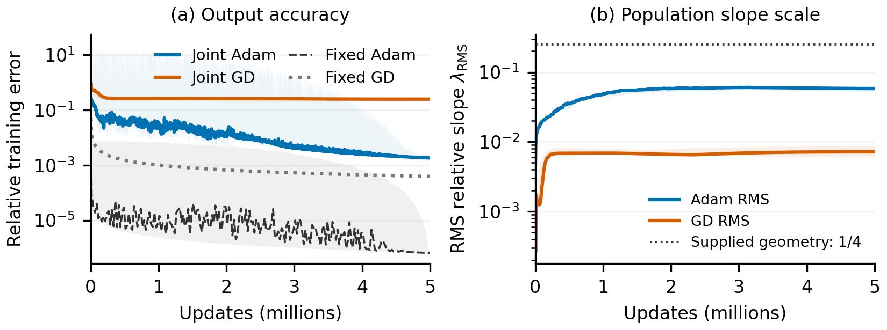
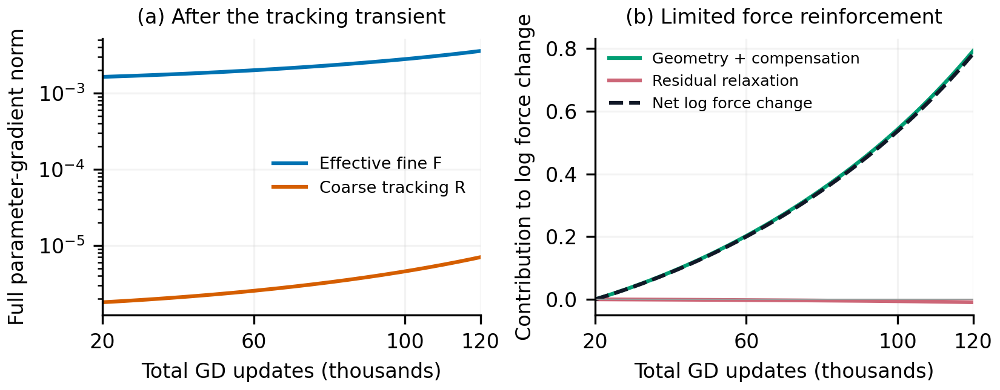
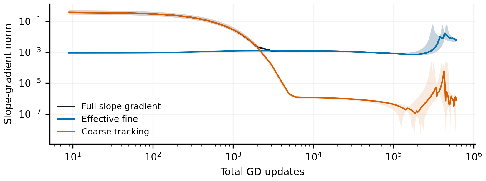
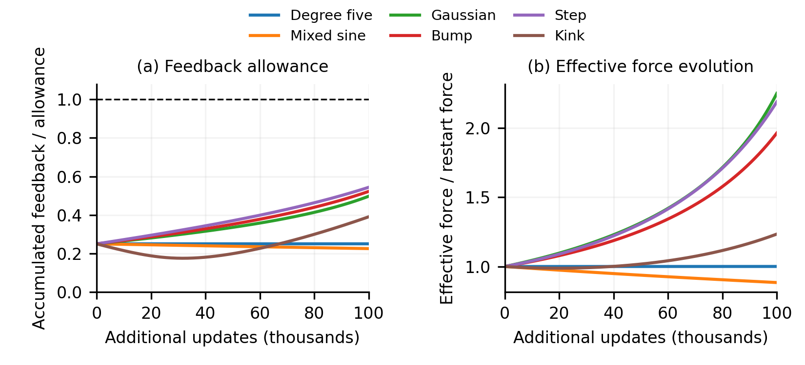
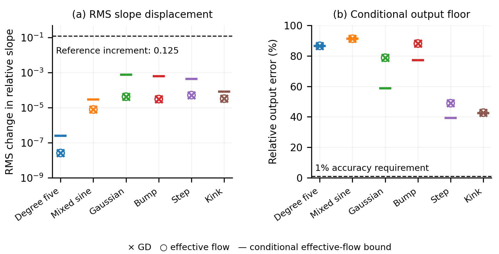

## 3.5. Why joint training acquires scale slowly

Can joint training acquire the scales needed for high precision?
After five million updates on mixed sine, joint Adam reaches relative error
$1.81\times10^{-3}$, versus $6.62\times10^{-7}$ on supplied features.
Its RMS relative slope reaches $0.0582$, compared with the supplied $1/4$;
GD acquires less scale (Figure 4). The preceding accuracy results motivate
explaining this slow population movement.

<figure>
  
  <figcaption><strong>Figure 4: Limited scale acquisition accompanies the precision gap.</strong> Mixed sine, width 512, five paired seeds, five million full-batch updates. Left: relative training errors with trained readouts; fixed Adam/GD use uniform $\lambda=1/4$ features. Right: RMS relative slopes, $h=2/467$. Bands retain seed variation and within-bin extrema. Joint and fixed-Adam recipes use final-validation selection (Appendix D).</figcaption>
</figure>

**The surviving force.** For squared loss $L=\frac12\|q_\theta-f\|^2$,
splitting output into its affine part and orthogonal remainder gives
$\nabla L=R+F$. The **tracking gradient** $R$ measures departure from coarse
equilibrium. The **effective fine gradient** $F$ combines the non-affine
residual gradient with the compensation needed to preserve coarse output.
In the audited GD regime, tracking is small; compensation remains within $F$.
We study the ensuing effective flow $\dot\theta=-F$ and account for tracking
and finite GD steps through explicit disturbance allowances.

**Why weak force persists.** Let $e_H$ be the non-affine residual,
$J_H=D_\theta e_H$, and $v=F/\|F\|$. Along effective flow,

$$
\frac{d}{dt}\log\|F\|
=-\underbrace{\|J_Hv\|^2}_{\text{residual relaxation}}
+\underbrace{\kappa_H+\kappa_C}_{\text{geometry and compensation feedback}}
\tag{1}
$$

Relaxation fits away the error driving the force; feedback changes
sensitivity to the remaining error. Small $F$ means weak residual coupling
after compensation. Rapid acquisition requires this coupling to strengthen.
On smooth step, force grows 2.19-fold while error remains near 49%
(Figure 5): reinforcement occurs, but remains limited. We bound its
accumulation by $B_t$, using the population's second output response
weighted by residual and compensation norms.

<figure>
  
  <figcaption><strong>Figure 5: Weak effective force survives positive reinforcement.</strong> Matched smooth-step continuations, width 705, from age 20k to 120k. Left: GD full-parameter gradient norms; tracking stays below 0.2% of effective force at saved times. Right: cumulative terms in (1) along paired effective flow. Both axes use total GD updates with $\eta=0.002$; paired force norms differ by less than 0.08%.</figcaption>
</figure>

**Theorem 3.3 (Slow scale acquisition; informal).** Restart GD after
tracking becomes small. Let $F_0$ and $E_0$ be the restart effective gradient
and non-affine residual norm, and $t=n\eta$. If accumulated feedback is
bounded by $B_t$, then, under the conditions in Appendix C,

$$
\|q_{\theta_n}-f\|^2
\ge E_0^2-2t e^{2B_t}\|F_0\|^2-\Delta_{\rm err}(t).
\tag{2}
$$

$$
\lambda_{\rm RMS}(t)
\le\lambda_{\rm RMS}(0)
+\frac{h}{\sqrt W}t e^{B_t}\|F_0\|
+\Delta_{\rm scale}(t).
\tag{3}
$$

Here $\lambda_{\rm RMS}=h\|\gamma\|_2/\sqrt W$; $h$ is the reference
spacing. The allowances cover tracking and finite steps and vanish for
effective flow.

The proof bounds force amplification, then integrates force to bound
population travel and its square to bound output improvement.
A complementary theorem closes the mechanism: if population travel
produces limited additional reinforcement and accumulated force
concentration is controlled, weak force supplies too little movement to
amplify itself rapidly. Its finite-time condition and first-exit proof are
in Appendix C.1; parameters remain free to evolve.

**Empirical check.** The broader feedback condition covers all 46 sampled
paths across 23 targets over 20k further updates. Six dense continuations
over 100k further updates give RMS growth bounds below $8\times10^{-4}$
and relative-error floors above 39%, with close GD/effective-flow agreement.
The stronger loop criterion passes all six shorter continuations and three
longer ones (Appendix D). It explains a sufficient mechanism for persistence;
the broader theorem retains longer coverage.

## Appendix: Conditional persistence under evolving geometry

### A. Definitions and exact force decomposition

Let $\mu$ be the equally weighted empirical measure on the training inputs
in $[-1,1]$, with nonzero variance. All output inner products use $L^2(\mu)$;
parameter space has its ordinary Euclidean metric. The target is
$f\in L^2(\mu)$, and

$$
q_\theta(x)=b+\sum_{j=1}^W w_j\tanh(\gamma_jx+\beta_j),\qquad
L(\theta)=\tfrac12\|q_\theta-f\|^2.
$$

All slopes, hidden biases, readouts, and the output bias are trained. Let
$Q_C$ map two orthonormal affine coordinates into output space, and put
$P_H=I-Q_CQ_C^*$. Define

$$
e_C=Q_C^*(q_\theta-f),\qquad e_H=P_H(q_\theta-f),\qquad
J_C=D_\theta e_C,\qquad J_H=D_\theta e_H.
$$

Explicitly, for $u_j=\gamma_jx+\beta_j$, the full output Jacobian
$J=D_\theta q_\theta$ has columns

$$
J_{\gamma_j}(x)=w_jx\operatorname{sech}^2u_j,\qquad
J_{\beta_j}(x)=w_j\operatorname{sech}^2u_j,\qquad
J_{w_j}(x)=\tanh u_j,\qquad J_b(x)=1.
$$

Thus $J_C=Q_C^*J$ and $J_H=P_HJ$ retain the evolving sensitivity of every
parameter block to the two output components.

The term "fine" denotes the full orthogonal complement of affine output.
It does not select target-dependent polynomial modes. Assume $J_C$ has full
row rank on the interval under consideration. Then

$$
\begin{aligned}
\Pi&=I-J_C^*(J_CJ_C^*)^{-1}J_C,\\
\ell&=(J_CJ_C^*)^{-1}J_CJ_H^*e_H,\\
F&=\Pi J_H^*e_H=J_H^*e_H-J_C^*\ell,\\
R&=J_C^*(e_C+\ell),\qquad \nabla L=F+R.
\end{aligned}
\tag{A1}
$$

The compensation $-J_C^*\ell$ is part of $F$ and generally persists after
tracking $R$ becomes small. Under $\dot\theta=-F$, coarse output is
preserved because $J_CF=0$. This effective ODE removes tracking while
retaining the evolving coupling among readouts and hidden geometry.

### B. A structural measure of reinforcement

At $F\ne0$, let $v=F/\|F\|$ and define

$$
\begin{aligned}
\kappa_H&=-\langle e_H,D^2e_H[v,v]\rangle,\\
\kappa_C&=\ell\cdot D^2e_C[v,v],\\
d_{\rm dir}&=\|e_H\|\,\|D^2e_H[v,v]\|
+\|\ell\|\,\|D^2e_C[v,v]\|.
\end{aligned}
\tag{A2}
$$

Consequently $\kappa_H+\kappa_C\le d_{\rm dir}$, without a favorable-sign
assumption. The second output response is evaluated in a unit direction;
$d_{\rm dir}$ is not a bound obtained by dividing observed net force growth
by the force. An empirically useful nondecreasing allowance $B_t$ satisfies

$$
\int_0^t d_{\rm dir}(s)ds\le B_t,\qquad B_0=0.
\tag{A3}
$$

**Derivation of (1).** Write $g_H=J_H^*e_H$. Differentiating $F=\Pi g_H$
along effective flow gives

$$
\frac12\frac{d}{dt}\|F\|^2
=-F^*D\Pi[F]g_H-\langle e_H,D^2e_H[F,F]\rangle-\|J_HF\|^2.
$$

Since $\Pi$ is an orthogonal projector, $\Pi D\Pi[F]\Pi=0$.
Differentiating $\Pi J_C^*=0$ and substituting $g_H=F+J_C^*\ell$ gives
$F^*D\Pi[F]g_H=-\ell\cdot D^2e_C[F,F]$. Dividing by $\|F\|^2$
proves (1). Independently,

$$
\frac{d}{dt}\|e_H\|^2=-2\langle J_H^*e_H,F\rangle=-2\|F\|^2.
\tag{A4}
$$

These are identities for the moving nonlinear network. They require no
frozen Jacobian, Taylor truncation of tanh, or equilibrium of the slopes.

### C. Precise theorem, including GD disturbances

**Theorem A.1.** Let $\theta:[0,T]\to\mathbb R^{3W+1}$ be an absolutely
continuous path satisfying $\dot\theta=-F-S$, with the coarse projector
defined along the path. Suppose (A3) holds for every prefix. Set
$s_0=\|F(\theta(0))\|>0$, $E_0=\|e_H(\theta(0))\|$, and define

$$
\begin{aligned}
U(t)&=\int_0^t\|DF[S]\|\,ds,\\
V(t)&=\int_0^t\|S\|\,ds,\\
Z(t)&=\int_0^t[\langle e_H,J_HS\rangle]_+\,ds,\\
D_A(t)&=t e^{B_t}U(t)+V(t),\\
A(t)&=t e^{B_t}s_0+D_A(t).
\end{aligned}
\tag{A5}
$$

All integrals are assumed finite; nondecreasing upper budgets may replace
their exact values. For $\lambda_j(t)=h|\gamma_j(t)|$ and $\delta>0$, let

$$
p_\delta(t)=\frac1W\#\left\{j:
\sup_{0\le s\le t}\bigl(\lambda_j(s)-\lambda_j(0)\bigr)\ge\delta\right\}.
$$

Then, for every $t\le T$,

$$
\begin{aligned}
\|F(\theta(t))\|&\le e^{B_t}[s_0+U(t)],\\
\int_0^t\|\dot\theta(s)\|ds&\le A(t),\\
\|q_{\theta(t)}-f\|^2&\ge
\left[E_0^2-2t e^{2B_t}[s_0+U(t)]^2-2Z(t)\right]_+,\\
\lambda_{\rm RMS}(t)&\le\lambda_{\rm RMS}(0)+\frac{hA(t)}{\sqrt W},\\
p_\delta(t)&\le\min\left\{1,\frac{h^2A(t)^2}{W\delta^2}\right\}.
\end{aligned}
\tag{A6}
$$

In particular (2)–(3) hold with the explicit nonnegative allowances

$$
\begin{aligned}
\Delta_{\rm err}(t)
&=2t e^{2B_t}\bigl(2s_0U(t)+U(t)^2\bigr)+2Z(t),\\
\Delta_{\rm scale}(t)&=\frac{h}{\sqrt W}D_A(t).
\end{aligned}
\tag{A7}
$$

For a nonzero target, a sufficient condition for relative error to remain
above $\varepsilon$ throughout $[0,T]$ is

$$
2T e^{2B_T}[s_0+U(T)]^2+2Z(T)
<E_0^2-\varepsilon^2\|f\|^2.
\tag{A8}
$$

If fraction $p_0$ starts above $\lambda_0<\lambda_*$, the fraction ever
reaching $\lambda_*$ is at most
$\min\{1,p_0+p_{\lambda_*-\lambda_0}(t)\}$. No maximum-neuron or
force-concentration assumption is needed for these population conclusions.
Centers may move freely; the proof works in the regular coordinates
$(\gamma,\beta,w)$ without division by a slope.

**Proof.** The directional identity implies, almost everywhere along the
disturbed path,

$$
\frac{d}{dt}\|F\|\le d_{\rm dir}\|F\|+\|DF[S]\|.
$$

Write $\mathcal B(t)=\int_0^t d_{\rm dir}(s)ds$. The integrating-factor inequality
gives

$$
\|F(t)\|\le e^{\mathcal B(t)}
\left[s_0+\int_0^t e^{-\mathcal B(s)}\|DF[S]\|ds\right]
\le e^{B_t}[s_0+U(t)].
$$

The inequality extends across zeros of $F$ in the absolutely continuous
norm inequality: $DF[F]$ vanishes there, and the remaining contribution
has norm at most $\|DF[S]\|$. Set the directional rate to zero at these
zeros. Monotonicity of $B,U$ and triangle inequality now yield
$\int_0^t\|\dot\theta\|\le t e^{B_t}[s_0+U(t)]+V(t)=A(t)$.

For output error, (A1) gives the exact disturbed energy identity

$$
\frac{d}{dt}\|e_H\|^2=-2\|F\|^2-2\langle e_H,J_HS\rangle.
$$

Integrating and using $\|q_\theta-f\|\ge\|e_H\|$ proves the third line
of (A6). For acquisition, put $a_j(t)=\int_0^t|\dot\gamma_j(s)|ds$.
Minkowski's inequality gives

$$
\left(\sum_j a_j(t)^2\right)^{1/2}
\le\int_0^t\|\dot\gamma(s)\|_2ds\le A(t).
$$

Triangle inequality gives
$\|\gamma(t)\|_2\le\|\gamma(0)\|_2+\|\gamma(t)-\gamma(0)\|_2
\le\|\gamma(0)\|_2+A(t)$, proving the RMS line of (A6). Each label counted
by $p_\delta$ requires $a_j\ge\delta/h$. Counting those labels proves the
final line. Expanding the error square and substituting (A5) gives (A7);
monotonicity of the budgets proves (A8). $\square$

**Discrete GD is included exactly.** For
$\theta_{n+1}=\theta_n-\eta g(\theta_n)$, $g=\nabla L$, use the linear
interpolant $\theta(t)=\theta_n-(t-n\eta)g(\theta_n)$ on each step. It
satisfies $\dot\theta=-F(\theta)-S$ with

$$
S(t)=R(\theta(t))+g(\theta_n)-g(\theta(t)).
\tag{A9}
$$

The two terms are tracking and the finite-step defect. Consequently (A6)
applies at every GD iterate if their aggregate budgets and (A3) hold along
the interpolant. This is a conditional GD theorem, not an identification of
GD with effective flow. The main-text evaluations set $S=0$ for their
effective-flow bounds and compare the actual GD trajectories separately.

**Sharper bounds are optional.** Integrating the time-dependent force
envelope instead of replacing it by its terminal value improves (A6).
Accumulated fourth-power concentration can also sharpen population counting.
The second-power counting bound and RMS bound above avoid adding that
structural premise. Figure S3a displays endpoint RMS displacement, for which

$$
\left(\frac1W\sum_j|\lambda_j(t)-\lambda_j(0)|^2\right)^{1/2}
\le\frac{hA(t)}{\sqrt W}.
\tag{A10}
$$

This displacement differs from the RMS level in Figure 4b. Reverse triangle
inequality gives
$|\lambda_{\rm RMS}(t)-\lambda_{\rm RMS}(0)|
\le h\|\,|\gamma(t)|-|\gamma(0)|\,\|_2/\sqrt W$.
Thus the same allowance controls growth of the observed RMS level, while
also allowing cancellation or decline in that level.

The numerical lower bounds are deliberately conservative. Their purpose is
to rule out useful output accuracy over a budget, not to forecast the exact
small amount of error reduction.

#### C.1. How limited population travel sustains weak reinforcement

The preceding theorem turns a feedback budget into acquisition and error
bounds. This companion result supplies a sufficient mechanism for that
budget. Its assumption measures how much additional reinforcement population
movement can generate. The proof couples movement and reinforcement without
freezing either.

Write $s(t)=\|F(\theta(t))\|$ and $p_j=(\gamma_j,\beta_j,w_j)$.
Let $F_j$ denote the corresponding hidden-parameter block of $F$, and set

$$
I_F=\frac{W\sum_j\|F_j\|^4}{s^4},\qquad
\mathcal C(t)=\int_0^t\sqrt{I_F(u)}\,du,\qquad
\mathcal A_4(t)=\int_0^t I_F(u)^{1/4}s(u)\,du.
\tag{L1}
$$

Set $I_F=0$ at zero force. The denominator includes output-bias force.
The quantity $\mathcal A_4$ counts accumulated population travel in a
fourth-power norm, including reversals; it is not endpoint displacement.
It bounds the increase of $M_4^{1/4}$, where $M_4=W\sum_j\|p_j\|^4$.

Let $\mathcal B(t)=\int_0^t d_{\rm dir}(u)\,du$. Assume, for constants
$b_0,K\ge0$ and a finite nondecreasing allowance $C$ with $C(0)=0$,

$$
\mathcal B(t)\le b_0t+K\int_0^t\mathcal A_4(u)\,du,
\qquad \mathcal C(t)\le C(t),\qquad 0\le t\le T.
\tag{L2}
$$

The baseline $b_0$ allows reinforcement already present at the restart;
$K$ limits the additional reinforcement generated by population travel.
Both assumptions are accumulated conditions. Small force alone does not
imply a useful $K$: changing force direction can expose different output
curvature. The empirical audit below tests this response relation.

**Theorem A.2 (Persistence through limited feedback from population travel).**
Consider effective flow on $[0,T]$ with a defined coarse projector,
$s_0=\|F(0)\|>0$, and (L2). Define

$$
H_0(t)=\int_0^t e^{2b_0u}\,du,\qquad
G(T)=\int_0^T\sqrt{C(u)H_0(u)}\,du.
$$

If $Ks_0G(T)<re^{-r}$ for some $r>0$, then, throughout $[0,T]$,

$$
\begin{aligned}
\mathcal B(t)&<b_0t+r,\qquad s(t)\le e^r s_0e^{b_0t},\\
\mathcal A_4(t)&\le e^r s_0\sqrt{C(t)H_0(t)},\\
M_4(t)^{1/4}&\le M_4(0)^{1/4}+e^r s_0\sqrt{C(t)H_0(t)},\\
\|q_{\theta(t)}-f\|^2&\ge[E_0^2-2e^{2r}s_0^2H_0(t)]_+.
\end{aligned}
\tag{L3}
$$

Moreover, $\lambda_{\rm RMS}(t)-\lambda_{\rm RMS}(0)
\le h e^r s_0\int_0^t e^{b_0u}\,du/\sqrt W$.

**Proof.** Suppose $\mathcal B(t)-b_0t$ first reaches $r$ at $\tau\le T$.
The force identity implies $s(u)\le e^r s_0e^{b_0u}$ up to that time.
For $t\le\tau$, Cauchy–Schwarz gives

$$
\mathcal A_4(t)\le\sqrt{\mathcal C(t)\int_0^t s(u)^2\,du}
\le e^r s_0\sqrt{C(t)H_0(t)}.
$$

The response premise then gives the contradiction

$$
r=\mathcal B(\tau)-b_0\tau
\le K\int_0^\tau\mathcal A_4(u)\,du
\le Ke^r s_0G(T)<r.
$$

Thus the force and travel bounds hold throughout the interval. Minkowski's
inequality proves the moment bound. Integrating
$\frac{d}{dt}\|e_H\|^2=-2s^2$ proves the error bound; integrating $s$
bounds Euclidean travel and hence RMS growth as in Theorem A.1. At a zero
of $F$, effective flow remains stationary by uniqueness, and the conclusions
continue to hold. $\square$

For $C(t)=ct$ and $r=1$, a simpler sufficient condition is

$$
\frac e2 Ks_0\sqrt c\,e^{b_0T}T^2<1.
\tag{L4}
$$

Indeed $H_0(t)\le te^{2b_0t}$, so $G(T)\le\sqrt c\,e^{b_0T}T^2/2$.
With $b_0T$ bounded and the other structural constants fixed, this permits
durations proportional to $(Ks_0\sqrt c)^{-1/2}$. Weak initial coupling
delays the reinforcement loop; the population need not contract or approach
equilibrium.

**Disturbances and GD.** On $\dot\theta=-F-S$, keep $U,V,Z$ from (A5)
and define

$$
V_4(t)=\int_0^t\left(W\sum_j\|S_j(u)\|^4\right)^{1/4}\,du.
$$

Replace $\mathcal A_4$ in (L2) by $\mathcal A_4+V_4$, and put
$s_*=s_0+U(T)$. If

$$
K\left[e^r s_*G(T)+\int_0^T V_4(u)\,du\right]<r,
\tag{L5}
$$

the same first-exit proof gives $\mathcal B(t)<b_0t+r$ and
$s(t)\le e^r s_*e^{b_0t}$. The error floor becomes
$[E_0^2-2e^{2r}s_*^2H_0(t)-2Z(t)]_+$; Euclidean travel is at most
$e^r s_*\int_0^t e^{b_0u}\,du+V(t)$. To see this, the integrating-factor
bracket is bounded by $s_*$ up to the proposed exit; Cauchy–Schwarz bounds
$\mathcal A_4$, and $V_4$ adds disturbed population travel. Substitution
in (L2) contradicts (L5). For GD, $S$ includes both terms in (A9).

### D. Empirical scope and methods

**Evidence has three roles.** Figure 4 establishes a full-training
observation. Figure 5 illustrates the force decomposition and its evolution
on matched smooth-step continuations. Figure S1 shows the earlier tracking
transition in a separate experiment. Figures S2–S3 test the conditional
bounds across six targets after the transient. Their different widths, schedules, and
horizons are not pooled into one trajectory or one theorem interval.

**The full-training observation.** Figure 4 uses

$$
f(x)=\frac{\sin(2\pi x)+\tfrac12\sin(6\pi x)+\tfrac14\sin(14\pi x)}
{\sqrt{21/32}},\qquad x\in[-1,1].
$$

The width is 512, with reference interior resolution 467 and 22 halo centers
on either side, so $h=2/467$. There are 2,048 uniform training midpoints,
4,096 validation points, and 8,192 dense evaluation points. The dense grid
checks resolution; it is not an untouched generalization test. All training
is noiseless, full batch, and FP64. Joint runs optimize every parameter from
five paired random initializations for five million updates. One recipe per
optimizer is selected by median final validation error across all five
seeds. The selected full-horizon cosine schedules start at learning rates
0.05 for Adam and 0.2 for GD. No first-tolerance crossing replaces the common
endpoint-selection rule.

Fixed GD trains a zero-initialized readout on the supplied uniform
$\lambda=1/4$ features, using the spectral step $1/(2\mu_1)$ where $\mu_1$
is the largest readout-kernel eigenvalue. Fixed Adam starts its readout at
zero on those same features and uses a final-validation-selected cosine
schedule with initial rate $10^{-4}$. Both execute five million updates.
The comparison matches budget and error definition; it does not claim equal
learning rates or equal hyperparameter search spaces.

Figure 4a plots relative training errors with attached readouts. Joint
curves take medians over seeds and display bins; bands retain the seed range
and recorded within-bin extrema, including spikes. Fixed-Adam shading is
its within-bin range, not seed uncertainty. Fixed GD is subsampled from its
executed scalar error trace. The quoted joint endpoints are dense-grid
medians; fixed Adam's dense-grid endpoint is $6.62\times10^{-7}$, and
fixed GD's training endpoint is $3.88\times10^{-4}$. These are optimization
comparisons, not claims of permanent failure. Adam already passes 1%
relative error here; its remaining precision gap must not be described as
failure at that tolerance. The RMS statistic uses all neurons, with no
percentile or maximum-slope curve.

**The tracking illustration.** Figure S1 uses separate mixed-sine runs at
width 177, five seeds, 2,048 training inputs, and constant GD rate 0.002.
The target is the same sine mixture, normalized by its training-grid RMS.
Curves show Euclidean norms of the slope blocks of $F$, $R$, and their sum,
not norms of all parameter blocks. The saved pre-update coordinates end at
599,999 for a 600k-update run. Every plotted coarse solve is resolved;
the numerical unresolved channel is zero. Tracking falls far below the
effective fine slope gradient, which can still strengthen late in training.
The crossing is an illustration of changing dominance, not a certificate
of small accumulated disturbance or a universal restart rule.

<figure>
  
  <figcaption><strong>Figure S1: Tracking loses its early dominance under GD.</strong> A separate mixed-sine experiment at width 177, five seeds, and learning rate 0.002 over 600k updates. Curves show median slope-block norms; shading shows seed ranges. This full-history illustration does not determine the restart time for Figure 5. Late effective-force growth remains possible.</figcaption>
</figure>

**The post-transient theorem audit.** The claim begins at a post-transient
checkpoint. It does not prove that initialization enters the regime or that
a checkpoint determines its entire duration. The audit measures the evolving
feedback quantity (A2) and tests (A3) throughout the sampled interval. Low
endpoint error or small endpoint slopes are not substitutes for this check.

**Matched six-target continuations.** We use width $W=705$, reference
resolution $N=512$, $h=2/512$, and seed 30. The training measure consists of
2,048 equally weighted midpoint inputs in $[-1,1]$. Initial slopes, hidden
biases, and readouts are independent uniform draws on
$[-\sqrt{6/(W+1)},\sqrt{6/(W+1)}]$, with output bias zero. Initializations
are paired across targets. All parameters train simultaneously with
deterministic full-batch GD at learning rate 0.002. The restarts are the
unmodified states after 20k updates, and the continuation lasts a further
100k updates, ending at age 120k. No readout refitting or checkpoint selection
by final accuracy is used.

The pair $(W,N)=(705,512)$ is the archived comparison convention. These
randomly initialized networks do not use the fixed grid or the particular
halo count in Theorem 3.1. The value of $h$ supplies a common relative-scale
reference; neither the output bound nor the training dynamics depends on
interpreting it as an actual learned center spacing.

The functions before empirical RMS normalization are:

- Degree five: $0.3q_0+0.4q_1+\sqrt{0.75}\,q_5$, with $q_k$ empirical
  orthonormal polynomials of positive leading coefficient.
- Mixed sine: $\sin(2\pi x)+0.5\sin(6\pi x)+0.25\sin(14\pi x)$.
- Gaussian: $\exp(-((x+0.35)/0.22)^2)$.
- Compact bump: $\exp(1-1/(1-u^2))$ for $|u|<1$ and zero otherwise,
  with $u=(x-0.35)/0.22$.
- Smooth step: $\tanh(14(x-0.31))$.
- Kink: $|x+0.23|$.

The polynomial is already normalized. The other targets are divided by
their RMS on the original training grid, with this normalization held fixed.
The degree-five label is not the monomial $x^5$. The compact bump and kink
are additional stress tests for the training mechanism, outside the analytic
target class of the construction theorem. The persistence theorem itself
requires only a square-integrable target.

Effective flow is integrated with RK4 steps 0.02 and 0.01. GD is compared
at learning rates 0.002 and 0.001 over the same flow-time duration $T=200$;
the smaller-step control consequently uses twice as many updates. Scalar
diagnostics are retained at 201 equally spaced times. These comparisons
test the effective reduction and discretization sensitivity, rather than
equating optimizer update counts across different learning rates.

Both panels of Figure 5 select the smooth-step continuation from this
six-target study. GD tracking norm is at most 0.1963% of effective-force
norm at saved times. The maximum relative discrepancy between GD and paired
effective-flow force norms is 0.0795%. Trapezoidal integration of the saved geometry, compensation, and
relaxation rates reconstructs the observed log force change to within
$3.16\times10^{-6}$. The integrated feedback is about $0.792$, relaxation
contributes about $-0.00928$, and the force increases by a factor 2.187.
Its initial norm is $0.001628$, and endpoint relative error is $0.4897$.
The rates describe the full effective-force norm. They neither assume nor
establish contraction of each slope. Both horizontal axes give total
training age, adding the 20k restart age to elapsed flow time divided by 0.002.

**A common allowance, with visible slack.** Figures S2–S3 use
$B_t=4d_{\rm dir}(0)t$ on every target. The factor four comes from the
previously tested sensitivity family $1,2,4,8$; its coverage is an empirical
finding, not an initial-data prediction. The largest sampled ratio of actual
accumulated feedback to the allowance is 0.5436. The conditional
effective-flow relative-error floors from (2) range from 0.3928 to 0.9124.
Their RMS slope-movement allowances range from $2.51\times10^{-7}$ to
$7.74\times10^{-4}$. Observed GD RMS changes range from
$2.61\times10^{-8}$ to $5.25\times10^{-5}$. For increment $0.125$, the
largest conditional ever-acquired-fraction bound is $3.84\times10^{-5}$.
These are rounded numerical evaluations, not interval-arithmetic certificates.

The initial relative slopes are all below $0.001$, so the reference
increment $0.125$ already falls short of reaching the construction benchmark
$\lambda=0.25$. The benchmark is an illustrative construction regime,
not a necessary or sufficient criterion for all accurate networks. The
independent raw-error conclusion is therefore essential. We use the lenient
1% relative-error criterion for these six continuations to establish failure
well before machine precision. This criterion and cohort differ from the
five-million-update observation, where joint Adam reaches below 1%.

<figure>
  
  <figcaption><strong>Figure S2: The feedback condition permits either force decay or growth.</strong> Six targets at width 705, from the 20k restart through 100k additional GD updates. Left: accumulated directional feedback divided by its common allowance $4d_{\rm dir}(0)t$. Right: normalized force along GD (solid) and effective flow (dotted). Their agreement checks the reduction; it is distinct from checking the feedback allowance.</figcaption>
</figure>

<figure>
  
  <figcaption><strong>Figure S3: The condition gives useful population and output bounds.</strong> The same six continuations as Figure S2. Left: endpoint RMS displacement of relative slopes, with its effective-flow upper bound; this is displacement from the restart, not the RMS level in Figure 4. Right: relative output errors with attached readouts and effective-flow lower bounds. These rounded numerical evaluations set $S=0$; GD agreement is measured separately. None is an interval certificate.</figcaption>
</figure>

**Breadth and robustness.** The separate width-705 baseline contains 23
targets and two seeds, including polynomial, oscillatory, localized, rational,
exponential, and transition functions. Twice the restart directional rate
covers all retained prefixes of all 46 branches over 20k further updates;
the largest required multiplier is 1.367. Twelve width-1409 reference
branches also pass that check. These families include related variants, and
the six dense trajectories are a subset of the broader investigation, not
six additional independent target families.

The largest endpoint raw relative-error difference between refined GD
and effective flow across the six targets is $1.72\times10^{-6}$.
On the sampled GD paths, accumulated tracking-induced derivative loading
is at most 0.0993% of the restart force. Incorporating sampled tracking
effects into the sharper time-integrated energy calculation changes its
relative-error floor by at most $4.16\times10^{-6}$. This last number concerns
that sharper calculation, not a certified value of $\Delta_{\rm err}$ in
(A7). The finite-step defect in (A9) has not been enclosed by interval
arithmetic. Halving the GD step changes endpoint parameters by less than
$1.98\times10^{-6}$ in Euclidean norm; halving the effective-flow RK4 step
changes them by less than $2.4\times10^{-14}$.

The broad archive is sparsely sampled, whereas the matched continuations
provide dense temporal checks. Neither supplies a rigorous enclosure between
every saved state. This distinction concerns empirical verification of the
premises; the conditional implication in Theorem A.1 is exact. All reported
force and error quantities use the training measure and actual attached
readouts. No continuous-input generalization or quantitative Adam guarantee
is asserted.

**Coverage of the population feedback loop.** The stronger theorem uses
$b_0=d_{\rm dir}(0)$ and $C(t)=2\sqrt{I_F(0)}t$. At saved prefixes,
the smallest required response coefficient is

$$
K_{\rm req}=\max_{t_i>0}
\frac{[\mathcal B(t_i)-b_0t_i]_+}{\int_0^{t_i}\mathcal A_4(u)\,du}.
$$

We compare it with $K_{\rm crit}=1/(es_0G(T))$. This is a retrospective
check that useful constants exist, rather than a prediction from the restart
alone. Integrals use scalar interpolants between saved states. The accumulated
concentration allowance passes on all reported paths.

All 46 width-705 paths across 23 targets pass the sampled loop criterion over
20k further updates; the largest $K_{\rm req}/K_{\rm crit}$ is 0.1065.
All 12 width-1409 reference paths pass too. All six densely sampled
effective-flow continuations pass over that shorter duration. At 100k
further update-equivalent units, degree five, mixed sine, and kink still
pass. Gaussian, bump, and step give ratios 2.67, 3.12, and 2.24; the broader
feedback-budget bounds remain informative on all six.

For these three longer failures, the required $K$ rises only by factors
1.184, 1.131, and 1.002 compared with its first-20k estimate. The
duration-dependent sufficient criterion can therefore expire while the
response relation changes little. Doubling a coefficient fitted only on
the first 20k further updates covers the longer response on five of six
targets. Kink is the exception: its early excess feedback is zero, but later
becomes positive. These results support finite-interval response conditions
without supplying a universal extrapolation rule. Halving RK4 and GD steps
preserves the pass/fail classifications. GD diagnostics test the premises
numerically; they do not certify the disturbed criterion (L5).

### E. Mechanism checks and the domain of the explanation

The conditional theorem should be read alongside interventions that
distinguish explanations of slow motion. Function-preserving fourfold
cloning divides each readout among four identical neurons. It leaves the
represented function unchanged while reducing each copy's geometry gradient
by four and increasing aggregate readout mobility by four. Correcting both
learning rates recovers the original trajectory to numerical precision.
Across the tested 23-target cohorts, correcting geometry mobility largely
restores slope motion, whereas correcting readout mobility alone does not.
Faster readout fitting alone is therefore insufficient to explain this
controlled slowdown.

Likewise, the smallest tested outward pulses retain 99.0–100.3% of their
directional offset after 20k updates. This supports slow motion without
strong restoration in those tested directions; it does not establish a
global attractor or behavior under arbitrary perturbations. Much larger
geometry injections can leave the weak-force regime. Under primary coarse
repair, the median initial effective-force norm rises from about
$6.04\times10^{-4}$ at baseline to 2.64 at 100-fold injection; the corresponding
weak-force error bound is then uninformative. A failed bound does not show
successful training.

These tests constrain the mechanism without requiring that every target
share one signed force contribution. Correcting generated low-order error
can oppose expansion, but neither net slope contraction nor that particular
error pattern is an assumption of Theorem 3.3. Its claim is limited useful
reinforcement over a stated interval, with the observed domain and failures
of that premise reported separately.
