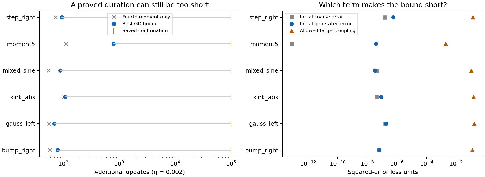
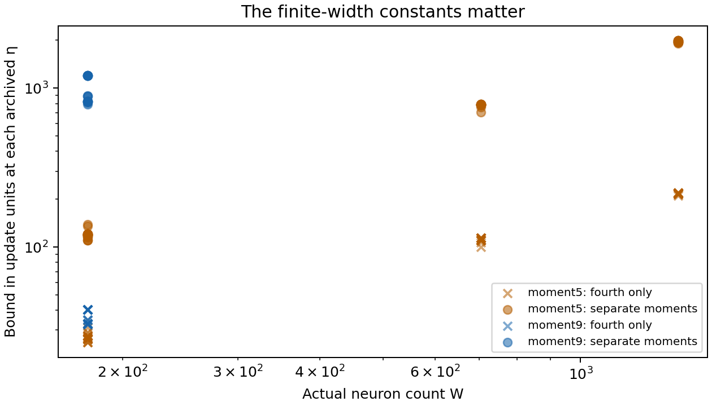

# A target gap can preserve weak population sensitivity

Broad tanh features can initially respond to an unwanted cubic component much
more strongly than to the fine structure in a target. The question is why
coupled training cannot rapidly change that situation. This note proves one
answer: **if the target has no low-degree fine components, then the loss that
training can release inside a broad-feature population is small. Gradient
flow cannot move that population far without spending this limited loss.**
Consequently, weak sensitivity persists for a provable duration. This is an
exact, finite-width result for evolving features, readouts, and biases.

The result starts at a specified checkpoint, typically after the coarse
tracking transient. It does not prove entry into that regime. Its target
assumption is stronger than the assumptions of the broader conditional
feedback theorem. The purpose is to derive persistence for an identifiable
family, then evaluate whether the resulting duration is useful at our saved
checkpoints. A proof of the implication and a useful numerical guarantee are
separate questions.

The completed audit covers 503 distinct archived states across 23 targets.
Keeping separate population moments improves the finite-width bounds, but
this new checkpoint-only argument still explains much less time than the
observed 100k-update continuations. It supplies a proved mechanism for the
gap family, not a replacement for the broader conditional theorem used in
the paper. Section 8 shows both the improvement and the remaining loss.

The [signed population-balance follow-up](d34_population_balance_mechanism.md)
examines what this energy bound discards. It derives an exact tanh identity
motivated by the learning-timescale and layer-balance literature, retains
generated-error signs and coarse compensation, and audits six trajectories'
saved endpoints. Its conditional slope bound identifies an additional
collective alignment premise; that premise is not yet verified throughout
the interval, so the follow-up does not extend the durations proved here.

**Notation.** All parameter coordinates use the ordinary GD metric.

| Symbol | Meaning |
|---|---|
| $f_\theta=d+\sum_{j=1}^W c_j\tanh(a_jx+b_j)$ | Network; $a_j$ is the slope also denoted $\gamma_j$. |
| $y=y_C+g$ | Target split into affine and non-affine parts. |
| $P_H$ | Orthogonal projection removing affine functions. |
| $f_H=P_Hf_\theta$, $e_C=P_C(f_\theta-y)$ | Generated non-affine output and coarse residual. |
| $M_4=W\sum_j(a_j^2+b_j^2+c_j^2)^2$ | Rescaled population fourth moment. |
| $q=M_4^{1/4}$ | Fourth-moment radius; distinct from the older output-capacity symbol $\mathcal Q$. |
| $F,R$ | Effective fine gradient, including compensation, and coarse tracking gradient. |
| $D_*$ | Upper bound on the loss available to finance movement before exit. |

## 1. Example: correcting a generated cubic cannot unlock unlimited movement

Take an affine target plus a normalized degree-nine orthogonal polynomial.
Orthogonality is with respect to the actual input measure, not monomials
treated as if they were orthogonal. At a broad-feature checkpoint,

$$
c_j\tanh(a_jx+b_j)
=c_j(a_jx+b_j)-\frac{c_j}{3}(a_jx+b_j)^3+\cdots.
$$

The affine part can fit the coarse target. The cubic part introduces error
without correlating with the degree-nine target. Reducing that generated
error releases some loss and can move the parameters. But that reservoir is
small when the entire population has a moderate fourth moment. The fine
target can supply additional loss reduction only through higher terms.

The theorem below makes this argument without replacing tanh by a polynomial
ODE. Taylor's theorem supplies **global inequalities for exact tanh**, valid
even if some neurons leave the small-argument region. A population moment
bounds their total contribution; no maximum-neuron restriction is imposed.

The prediction is finite-time slow acquisition, not restoration toward an
attractor. Slopes may grow, and isolated neurons may escape. The conclusion
limits aggregate movement and output improvement over a stated duration.

## 2. The exact dynamics and the structural target assumption

Let $\mu$ be a probability measure on $[-1,1]$ for which constants and linear
functions are independent in $L^2(\mu)$. All norms and inner products below
use this space. Uniform integration and a finite training grid are both
allowed, but they define different orthogonality conditions. Let $P_C=I-P_H$
be the orthogonal projection onto affine functions. Set

$$
L(\theta)=\frac12\|f_\theta-y\|^2,
\qquad \dot\theta=-\nabla L(\theta).
\tag{1}
$$

Writing $J_C=D_\theta(P_Cf_\theta)$ and $J_H=D_\theta(P_Hf_\theta)$, the
usual decomposition, when $J_CJ_C^*$ is invertible, is

$$
\begin{aligned}
\Pi&=I-J_C^*(J_CJ_C^*)^{-1}J_C,\\
F&=\Pi J_H^*(f_H-g),\\
R&=J_C^*\left[e_C+(J_CJ_C^*)^{-1}J_CJ_H^*(f_H-g)\right],\\
\nabla L&=F+R.
\end{aligned}
\tag{2}
$$

Thus compensation remains part of $F$. The proof for the full flow (1)
does not require inversion of the coarse Gram matrix or a future bound on
$R$. Instead it charges the coarse residual present at the checkpoint to
the movement budget. A small $R$ alone does **not** imply a small $e_C$;
the latter must be measured separately.

Let $\mathcal P_5$ denote polynomials of degree at most five. Our main family
is

$$
y=y_C+g,\qquad y_C\in\mathcal P_1,\qquad
g\perp\mathcal P_5.
\tag{3}
$$

This contains arbitrary square-integrable mixtures of orthogonal polynomial
degrees six and above, with arbitrary affine parts. It is not confined to
degree nine. An ordinary sine target generally does not satisfy (3).
Section 6 quantifies leakage into the omitted low degrees rather than
silently treating those targets as members of the exact-gap family.

## 3. Exact population bounds: the available loss is small

Write $p_j=(a_j,b_j,c_j)$, and define

$$
A_3=\frac{\sqrt6}{8},\qquad
A_7=\frac{17}{315}\frac{2^{7/2}7^{7/2}}{8^4}.
\tag{4}
$$

**Lemma 1 (output capacity and target coupling).** For every parameter state,

$$
\|f_H\|\le A_3\frac{q^4}{W}.
\tag{5}
$$

If (3) holds, then also

$$
|\langle g,f_\theta\rangle|
\le A_7\|g\|\frac{q^8}{W^2}=:B(q).
\tag{6}
$$

**Proof.** The global remainder inequalities are

$$
|\tanh u-u|\le |u|^3/3,
\qquad
|\tanh u-u+u^3/3-2u^5/15|\le 17|u|^7/315.
\tag{7}
$$

The first follows by integrating $|\tanh'(u)-1|=\tanh^2u\le u^2$.
For the second, $\sup|\tanh^{(7)}|\le272$; a direct verification appears
in the appendix. Taylor's theorem through degree six gives $272/7!=17/315$.

For odd $k$, maximizing $|c|(|a|+|b|)^k$ on a unit Euclidean sphere gives

$$
|c|(|a|+|b|)^k\le
\frac{2^{k/2}k^{k/2}}{(k+1)^{(k+1)/2}}\,|p|^{k+1}.
\tag{8}
$$

Indeed, $|a|+|b|\le\sqrt2(a^2+b^2)^{1/2}$, and the remaining maximum
occurs at $c^2=1/(k+1)$. Projection removes the linear term in (7), and
is a contraction, giving (5) after summation. In (6), orthogonality removes
every polynomial term of degree at most five, including all bias-generated
terms. Cauchy–Schwarz and (8) give $A_7\|g\|\sum_j|p_j|^8$.
Finally, $\sum_j|p_j|^8\le(\sum_j|p_j|^4)^2=q^8/W^2$. $\square$

The loss has the exact decomposition

$$
L=\frac12\|g\|^2+\frac12\|e_C\|^2
  +\frac12\|f_H\|^2-\langle g,f_H\rangle.
\tag{9}
$$

The generated error contributes a nonnegative term. The fine target lowers
the loss only through the last term, which (6) limits throughout a moment
region. Thus, in $q\le q_*$,

$$
L\ge\frac12\|g\|^2-B(q_*).
\tag{10}
$$

This is the mechanism behind the proof: a large unlearned target error is
not automatically a large energy supply for parameter motion.

## 4. Persistence follows from energy dissipation

**Theorem 1 (target-gap persistence for full gradient flow).** At a specified
checkpoint $\theta_0$, let $q_0=M_4(\theta_0)^{1/4}$ and choose $q_*>q_0$.
Assume (3), and define

$$
D_*=L(\theta_0)-\frac12\|g\|^2+B(q_*),
\qquad
T_* =\frac{(q_*-q_0)^2}{\sqrt W D_*}.
\tag{11}
$$

Then $D_*\ge0$. If $D_*>0$, the exact flow satisfies $q(t)<q_*$ for
$0\le t<T_*$. Throughout this interval,

$$
\begin{aligned}
\int_0^t\|\dot\theta\|^2\,ds&\le D_*,&
\|\theta(t)-\theta_0\|&\le\sqrt{tD_*},\\
\frac{\|a(t)\|}{\sqrt W}&\le\frac{q_*}{\sqrt W},&
\|f_{\theta(t)}-y\|&\ge
\left[\|g\|-A_3q_*^4/W\right]_+.
\end{aligned}
\tag{12}
$$

If $D_*=0$, the flow is stationary. No future force, neuronwise bound,
frozen Jacobian, or equilibrium assumption is a premise.

**Proof.** Up to the first exit from $q<q_*$, (1) and (10) give

$$
\int_0^t\|\dot\theta\|^2ds=L(\theta_0)-L(\theta(t))\le D_*.
\tag{13}
$$

The block fourth norm satisfies the triangle inequality. Its change is at
most the Euclidean movement times $W^{1/4}$. Therefore

$$
q(t)\le q_0+W^{1/4}\|\theta(t)-\theta_0\|
\le q_0+W^{1/4}\sqrt{tD_*}.
\tag{14}
$$

An exit before $T_*$ would contradict (14), including its continuous limit
at the exit time. For fixed finite $W$, bounded $q$ bounds all hidden
parameters, while bounded loss bounds $d$ on this region. The smooth ODE
therefore continues up to every time strictly below $T_*$. The same argument
with $D_*=0$ forces zero velocity and a stationary solution.

Moreover $\sum_j a_j^2\le\sum_j|p_j|^2\le q_*^2$, giving the RMS bound.
The reverse triangle inequality applied to $f_H-g$, with (5), gives the output
bound. $\square$

**What has been proved about sensitivity?** The elementary columnwise
Jacobian estimate in the appendix gives

$$
\|J_H(t)\|_{\mathrm{HS}}^2
\le9\sum_j|p_j(t)|^6
\le9q_*^6/W^{3/2},\qquad 0\le t<T_*.
\tag{15}
$$

This is a consequence of the persistence proof, not an assumption on the
future trajectory. Since $\|\Pi\|\le1$, it also bounds the effective fine
sensitivity wherever (2) is defined. It need not give an accurate force
forecast: residual alignment and coarse compensation can reduce the force
substantially further.

**Rates and acquisition.** If $q_0,q_*,\|g\|$ are width-independent,
$q_*-q_0$ is bounded below, and $\|e_C(0)\|^2=O(W^{-2})$, equations
(5), (6), and (9) imply $D_*=O(W^{-2})$, hence
$T_*=\Omega(W^{3/2})$ in physical gradient-flow time. The explicit formula
(11), rather than this asymptotic notation, determines numerical usefulness.
The normalization is the unscaled sum network in the glossary; changing
the parameter metric or network normalization changes the rate.

For a spacing $h$, put $\lambda_j=h|a_j|$. Then the RMS scale is at most
$hq_*/\sqrt W$, and at every time before $T_*$,

$$
\frac1W\#\{j:\lambda_j\ge\lambda_*\}
\le \min\{1,h^2q_*^2/(W\lambda_*^2)\}.
\tag{16}
$$

There is also an **ever-acquired** bound. For any $\delta>0$, the fraction
of labels for which $\sup_{s\le t}h|a_j(s)-a_j(0)|\ge\delta$ is at most
$h^2tD_* /(W\delta^2)$. This follows by applying Cauchy–Schwarz to each
coordinate's path and summing its action. It is an aggregate conclusion,
not a premise that every neuron moves slowly.

For the effective flow $\dot\theta=-F$, the same proof uses
$L_H=\|f_H-g\|^2/2$ instead of $L$. It removes the initial coarse residual
from $D_*$ because $dL_H/dt=-\|F\|^2$. This variant holds on intervals
where the projected flow is defined; the full-flow theorem needs no
coarse-rank condition.

## 5. Ordinary GD: a discrete proof with an explicit step guard

A flow theorem is not a theorem about a particular number of optimizer
updates. The following result handles the finite GD step without assuming
that a step remains in the desired moment region.

**Theorem 2 (GD transfer).** Use the same target and checkpoint as in
Theorem 1. Choose $q_*>q_0$, and put

$$
\begin{aligned}
r&=(q_*-q_0)/W^{1/4},& q_o&=2q_*-q_0,\\
j_o&=\sqrt{1+2q_o^2},&
H_o&=j_o^2+(\sqrt{2L_0}+2rj_o)(\sqrt2+4q_o),\\
D_o&=L_0-\tfrac12\|g\|^2+B(q_o),&
G_0&=\sqrt{1+2q_*^2}\sqrt{2L_0}.
\end{aligned}
\tag{17}
$$

Suppose $\eta H_o\le1$ and $\eta G_0\le r$. For ordinary GD
$\theta_{k+1}=\theta_k-\eta\nabla L(\theta_k)$, every integer $n$ satisfying

$$
n\eta<\frac{r^2}{2D_o}
\tag{18}
$$

has $\|\theta_n-\theta_0\|<r$, and hence $q_n<q_*$. The RMS and output
bounds (12) hold at those iterates. The action and displacement bounds become
$\sum_{k<n}\|\theta_{k+1}-\theta_k\|^2/\eta\le2D_o$ and
$\|\theta_n-\theta_0\|\le\sqrt{2n\eta D_o}$.
As in Theorem 1, a zero available-loss budget means a stationary trajectory;
the displayed quotient is needed only for a positive budget.

**Proof.** The Euclidean ball of radius $2r$ about $\theta_0$ lies in
$q\le q_o$. Throughout this ball the exact output Jacobian satisfies
$\|Df\|\le j_o$ and $\|D^2f\|\le\sqrt2+4q_o$; the appendix derives
these constants. The residual norm is at most $\sqrt{2L_0}+2rj_o$ by
integration along a straight segment from $\theta_0$. Hence
$\|\nabla^2L\|\le H_o$ throughout that ball.

Until the first iterate leaving the radius-$r$ ball, loss descent gives
$\|\nabla L(\theta_k)\|\le G_0$. The guard $\eta G_0\le r$ places the
whole next step in the radius-$2r$ ball, even if its endpoint is the first
exit. Taylor's integral formula and $\eta H_o\le1$ then give

$$
L_{k+1}\le L_k-\frac{1}{2\eta}\|\theta_{k+1}-\theta_k\|^2.
\tag{19}
$$

The endpoint still has $q\le q_o$, so (10), now with $q_o$, bounds the
total loss decrease by $D_o$. Summing (19) and applying Cauchy–Schwarz
contradicts a first exit at any $n$ satisfying (18). This also establishes
loss descent inductively, so its use above is not circular. $\square$

The factor two and outer radius are explicit costs of this simple transfer.
The theorem concerns plain GD. Adam has a different metric and momentum;
none of these Euclidean action bounds are asserted for Adam.

### Keeping the measured population moments separate

There is a substantial avoidable loss in Lemma 1: replacing
$\sum_j|p_j|^8$ by $(\sum_j|p_j|^4)^2$ allows all fourth-moment mass to
concentrate in one particle. We can retain the checkpoint's actual eighth
moment and propagate it by exactly the same argument. This requires no
assumption on future concentration.

**Theorem 3 (separate population moments).** Define the physical block norms

$$
s_k=\left(\sum_j|p_j(0)|^k\right)^{1/k},\qquad k=2,4,6,8.
\tag{20}
$$

Under (3), choose a Euclidean travel radius $\rho>0$, and put

$$
\widehat B(u)=A_7\|g\|(s_8+u)^8,\qquad
\widehat D(u)=L_0-\tfrac12\|g\|^2+\widehat B(u).
\tag{21}
$$

For gradient flow, the first exit from $\|\theta-\theta_0\|<\rho$ cannot
occur before $\rho^2/\widehat D(\rho)$. Before that time,

$$
\begin{aligned}
M_4(t)&\le W(s_4+\rho)^4,\\
\|J_H(t)\|_{\mathrm{HS}}^2&\le9(s_6+\rho)^6,\\
\operatorname{RMS}(a(t))&\le(s_2+\rho)/\sqrt W,\\
\|f_{\theta(t)}-y\|&\ge[\|g\|-A_3(s_4+\rho)^4]_+.
\end{aligned}
\tag{22}
$$

For GD, set

$$
\begin{aligned}
\widehat j_o&=\sqrt{1+2(s_2+2\rho)^2},\\
\widehat H_o&=\widehat j_o^2+
 (\sqrt{2L_0}+2\rho\widehat j_o)(\sqrt2+4(s_2+2\rho)),\\
\widehat G_0&=\sqrt{1+2(s_2+\rho)^2}\sqrt{2L_0}.
\end{aligned}
\tag{23}
$$

If $\eta\widehat H_o\le1$ and $\eta\widehat G_0\le\rho$, the same
conclusions hold at every iterate with
$n\eta<\rho^2/[2\widehat D(2\rho)]$.

**Proof.** Every block norm with exponent $k\ge2$ is 1-Lipschitz with
respect to the full Euclidean parameter distance:
$\|p(t)\|_{\ell^k}\le s_k+\|\theta(t)-\theta_0\|$.
Use this separately for each $k$, retain $\sum_j|p_j|^8$ in the proof of
Lemma 1, and apply the energy argument directly to the radius-$\rho$
ball. The first exit would require action at least $\rho^2/t$.
The GD argument uses the radius-$2\rho$ ball and is identical to the
guarded proof of Theorem 2. The remaining conclusions follow from the
static bounds on the separate block norms. $\square$

The quotients again concern positive available-loss budgets; zero forces
stationarity by the same energy argument.

The analogous degree-three-gap result replaces $\widehat B(u)$ by
$A_5\|g\|(s_6+u)^6$. With the leakage decomposition of the next section,
add $\delta A_3(s_4+u)^4$ and use the high-part target norm in the remaining
term. All quantities in these refinements come from the checkpoint and
the specified target. No observation of a future trajectory selects the
premises.

## 6. How much target mismatch can the proof tolerate?

For a general target, decompose its fine part orthogonally as

$$
g=\ell+g_{>5},\qquad
\ell\in\mathcal P_5\cap\mathcal P_1^\perp,\qquad
g_{>5}\perp\mathcal P_5,\qquad \delta=\|\ell\|.
\tag{24}
$$

The same proofs hold with

$$
B(q)=\delta A_3q^4/W+A_7\|g_{>5}\|q^8/W^2.
\tag{25}
$$

This follows from $|\langle\ell,f_H\rangle|\le\delta\|f_H\|$ and Lemma 1.
The energy baseline remains $\|g\|^2/2$, not $\|g_{>5}\|^2/2$. Leakage
of order $W^{-1}$ preserves the $W^{3/2}$ lower time scale under the other
conditions above. Fixed leakage can reduce the guaranteed scale to
$\Omega(\sqrt W)$ with these estimates. Sine targets therefore require
their actual low-degree content to be included; this theorem alone is not
a sharp explanation of their observed long plateaus.

A useful intermediate family is $g\perp\mathcal P_3$, which includes the
degree-five target. The global fifth-order remainder gives

$$
B(q)=A_5\|g\|q^6/W^{3/2},\qquad
A_5=\frac{2}{15}\frac{2^{5/2}5^{5/2}}{6^3}.
\tag{26}
$$

Here $\sup|\tanh^{(5)}|\le16$, and $\sum_j|p_j|^6\le(q^4/W)^{3/2}$.
With the same initial coarse-error scaling, the resulting guaranteed flow
time is $\Omega(W)$. Leakage into degrees two and three adds the first term
of (25), with $\delta$ defined for that smaller polynomial space.

## 7. Relation to the broader mechanism and to existing theory

The broader feedback theorem explains trajectories whose accumulated
reinforcing curvature and force concentration remain controlled. This note
provides a different closure for a narrower target family. It does not
bound each curvature term or prove every fitted response-to-travel premise.
Instead it bounds what the entire evolving system can accomplish with its
available loss. In particular, it proves persistence of aggregate sensitivity
even when the local force grows or changes direction.

This connects the spectral-bias intuition to an ODE statement. Missing
low-degree target components weaken the immediate learning signal. The
additional step here is that the exact dynamics cannot quickly create the
population moment that would remove that weakness. The moment also implies
an output-error floor, which is the operational failure criterion.

The energy-versus-movement argument is related to the general analysis of
slow gradient flows by [Otto and Reznikoff, *Slow Motion of Gradient
Flows*](https://webdoc.sub.gwdg.de/ebook/serien/e/sfb611/275.pdf).
Their slow-manifold framework uses additional transverse relaxation
conditions. We do not assume those conditions or infer an attracting
manifold from our perturbation experiments; the elementary energy identity
and a first-exit argument suffice here.

[Berthier, Montanari, and Zhou, *Learning time-scales in two-layers neural
networks*](https://arxiv.org/abs/2303.00055) study learning stages and missing
target coefficients in a high-dimensional single-index setting, combining
rigorous results with asymptotic derivations. This supports examining target
coefficient gaps, but their parameterization and time scales do not directly
supply the theorem above. [Yang, *Curse of Dimensionality in Neural Network
Optimization*](https://arxiv.org/abs/2502.05360) connects population moment
growth to approximation obstructions in a different, high-dimensional
setting. The useful common pattern is to bound population growth and then
convert it into an approximation limitation.

The new mathematical conclusion is therefore deliberately scoped: an exact
tanh, finite-width, post-checkpoint persistence theorem for a specified
target family, with a leakage allowance and a separate GD transfer. The
empirical audit below determines how much of the observed duration its
explicit constants explain.

## 8. Numerical usefulness: what improved, and what remains missing

**Example and result.** Restart the saved degree-five run at width $W=705$,
seed 30, after 20k ordinary GD updates. With $\eta=0.002$, the fourth-moment
formula evaluates to 113 further updates; retaining the sixth moment raises
this to 793 updates. Over that latter interval the calculated relative
output-error floor is 82.7%. The actual saved continuation lasts 100k further
updates and finishes at 86.6% relative error. Its largest saved $M_4$ is only
about 0.01% above its starting value. Thus the implication is strong when it applies,
but the new duration guarantee is still much shorter than the observation.

<figure>
  
  <figcaption>Six targets, one paired seed (30), restart at 20k GD updates,
  width 705, learning rate 0.002. Left: the fourth-moment formula and the
  strongest evaluated GD formula using either polynomial cutoff and either
  population estimate. The 100k marker is the saved continuation length,
  not a theorem guarantee or a measured exit time. Right: initial coarse
  error energy, initial generated fine error energy, and the allowed target
  coupling in the selected GD outer ball. The coupling allowance dominates.
  These are FP64 evaluations of proved formulas, not interval certificates.</figcaption>
</figure>

The other five targets in this panel have substantial low-degree leakage.
Their best calculated durations are 70–109 updates, despite large output
errors throughout the saved continuation. All six saved moment paths remain
within the selected $M_4$ bounds through 100k additional updates. This sampled
comparison does not prove that the full Euclidean travel balls, or all the
separate moment bounds in Theorem 3, hold for that entire time. Nor does it
extend the theorem's duration by retrospective substitution.

**Why the estimate is short.** At the degree-five checkpoint, the initial
coarse error energy is $7.92\times10^{-14}$ and the generated fine error
energy is $3.88\times10^{-8}$. The selected separate-moment GD bound permits
target coupling as large as $1.98\times10^{-3}$ in its outer ball. That is
the dominant allowance, even though the current target correlation is only
$1.73\times10^{-7}$. The latter comparison diagnoses conservatism; substituting
the current correlation for the uniform ball bound would invalidate the
proof. Removing the coarse energy would barely change this bound.

The full gradient-flow formula at the same checkpoint gives physical time
$12.70$, or roughly 6,348 reference update units at $\eta=0.002$.
The guarded GD theorem gives physical time $1.587$, or 793 whole updates.
Part of the loss is therefore the explicit discrete-step guard, but the
flow result itself still falls short of the saved duration. We must not
present reference flow-time units as a GD guarantee.

**Coverage and width.** The scalar archive contains 543 rows, representing
503 distinct parameter/target states after duplicate removal. It spans
23 targets and actual neuron counts $177,705,1409$. These are reused
checkpoints and intervention states, not 503 independent experiments or a
balanced width sweep. All target decompositions were recomputed in the
original 2048-midpoint training measure, and their target and fine-target
norms were checked against the archive. No targets were silently treated
as exactly orthogonal when their measured low-degree component was nonzero.
Some restarts have no admissible GD radius under the step guard and the
1% error-floor requirement; those rows are marked invalid and receive no
positive duration. The coverage count is not a count of successful bounds.

<figure>
  
  <figcaption>Saved gap-family checkpoints. Degree five uses the gap through
  degree three; degree nine uses the gap through degree five. Crosses use
  only the fourth moment; circles propagate the separate moments. Degree-nine
  coverage in this archive is only at width 177. Checkpoints and seeds vary
  within a width; this plot is not a fitted asymptotic rate or a balanced
  comparison between target families.</figcaption>
</figure>

For degree five, the separate-moment GD bounds are 110–139 updates at width
177, 707–793 at width 705, and 1,910–1,986 at width 1,409. The 21 degree-nine
states at width 177 give 787–1,201 updates, compared with 32–40 using only
the fourth moment. Their archived full-parameter tracking-to-effective
force ratios lie between $1.4\times10^{-5}$ and $4.9\times10^{-5}$.
The three-width degree-five ratios are also small, below $4.6\times10^{-5}$.
These are post-transient states of the intended kind. Small tracking does
not rescue the conservative target-coupling estimate.

**What to carry into the paper.** The mechanistic statement is now proved
for a target family: generated-error correction has a limited loss supply,
and weak coupling to the target cannot rapidly finance the population travel
needed to create stronger sensitivity. The exact ODE preserves the weak
sensitivity regime for an explicit duration. The numerical duration from
this checkpoint-only argument is not yet a convincing explanation of the
whole observed plateau. The existing conditional theorem, whose aggregate
conditions are checked along long trajectories, remains the appropriate
main claim.

The next useful strengthening is an aggregate bound on how fast
$\langle g,f_H\rangle$ can increase **along loss-descending trajectories**,
rather than a bound allowing every point in a Euclidean ball. It should
retain generated-error dissipation and the population's signed target
alignment. This is a specific remaining theoretical problem, not an
invitation to track every neuron. For targets with substantial low-degree
content, the leakage term additionally explains why a target-gap theorem
alone cannot replace the residual-coupling analysis.

### Reproducibility and evidence status

This is a post-hoc theorem audit using existing training trajectories. It
does not introduce a held-out generalization experiment, select a trained
model, or run new training. For each restart, the proof radius was chosen
from 801 fixed logarithmically spaced candidates to maximize the evaluated
duration while retaining a relative output-error floor above 1%. Both
cutoffs (three and five) and both moment estimates are retained in the CSV
outputs. Candidate selection uses checkpoint quantities, not future states.
That finite search gives valid candidate bounds; it is not a claim of
globally optimal theorem constants.

All numerical work, including seven focused tests, ran on Modal CPU with a
4 GiB hard memory limit. Peak child RSS was 169 MiB. The only uploaded data
were two cached scalar CSVs and the explicitly named 166 KiB six-state
capsule. The tests check the derivative constants in exact rational
arithmetic, the bounds on exact tanh networks including concentrated and
large-argument examples, target leakage, normalization of time, the GD
guard, and propagation of separate block norms. Direct capsule evaluation
checks the energy decomposition to an absolute discrepancy below
$7.2\times10^{-17}$.

The evidence directory
`results/checkpoint_D_optimizers/expD34_readout_race/population_output/evidence/target_gap_moments_20260924/`
contains the complete checkpoint bounds, target summaries, six-state
calculations, continuation comparisons, plots, and `execution.json` with
input hashes, versions, commands, and resource measurements. The first
fourth-moment-only audit is preserved separately in `target_gap_20260924/`.
The entry point is
`experiments/expD34_readout_race/population_target_gap_modal.py`.
The reported numbers use floating arithmetic. The algebraic theorems are
proved above; their numerical instances have not been outward rounded.

## Appendix: elementary derivative bounds used in the proofs

Put $s=\tanh^2u\in[0,1]$. The seventh derivative equals

$$
-272+3968s-12096s^2+13440s^3-5040s^4.
$$

Its degree-four Bernstein coefficients on $[0,1/2]$ are
$(-272,224,216,124,53)$, and on $[1/2,1]$ are
$(53,-18,-68,8,0)$. A polynomial lies between the smallest and largest
Bernstein coefficient on its interval. Thus its absolute value is at most
$272$. Similarly, the fifth derivative is $16-136s+240s^2-120s^3$.
Its degree-three Bernstein coefficients on the two half intervals are
$(16,-20/3,-28/3,-7)$ and $(-7,-14/3,8/3,0)$, giving the bound $16$.
These establish the global remainder bounds, including at large arguments.

For (15), set $u=ax+b$ and use $|u|\le\sqrt2|p|$ and
$|\tanh'(u)-1|\le u^2$. Removing the affine parts of the three Jacobian
columns gives pointwise upper bounds $2|p|^3$, $2|p|^3$, and
$2\sqrt2|p|^3/3$, respectively. Their squared sum is at most $9|p|^6$.
The output-bias column projects to zero. Orthogonal projection cannot
increase the column norms.

For the GD guard, before projection the squared norm of the three columns
is at most $2c^2+2(a^2+b^2)=2|p|^2$. The output-bias column adds one, so
$\|Df\|^2\le1+2\sum_j|p_j|^2\le1+2q^2$.
The Hessian of one feature $c\tanh(ax+b)$ has a geometry block bounded
by $4|c|$ and a readout–geometry cross block bounded by $\sqrt2$.
The full parameter Hessian of the scalar output is block diagonal across
neurons, hence $\|D^2f\|\le\sqrt2+4(\sum_j|p_j|^2)^{1/2}
\le\sqrt2+4q$. These inequalities concern the whole parameter norm;
they impose no separate restriction on any neuron.
