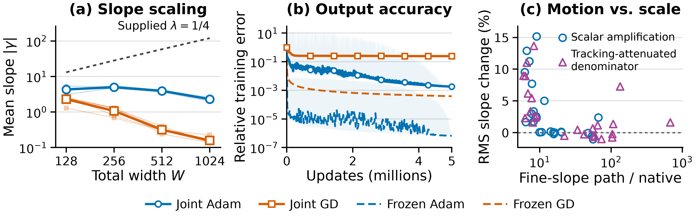

# Figure 4: completed width sweep

Across total widths 128–1024, five million joint-training updates do not produce the slope growth used by the supplied construction. Adam acquires larger slopes than GD, but its mean bandwidth decreases with width. At width 512, joint Adam remains roughly 2,700 times less accurate than Adam on the supplied frozen features. These observations establish a scale and accuracy gap under this training protocol; they do not identify a universal necessary bandwidth or prove permanent training failure.

| Quantity | Meaning |
| --- | --- |
| $W$ | Total hidden width, including halo nodes. |
| $h_W$ | Reference construction spacing, computed within that width budget. |
| $\lambda_j=h_W|\gamma_j|$ | Neuron bandwidth, using its current absolute slope and fixed reference spacing. |
| Relative error | Training-sample RMS output error divided by target RMS. |
| Population spread | Standard deviation across all neurons of the five equal-sized seed populations. |

<figure>
  
  <figcaption>Completed Figure 4. Five seeds and five million updates per recipe on the normalized mixed-sine target. Panel (a) shows seed means and pooled mean absolute slopes; the dotted line is the supplied construction. Panels (b–c) use the same selected width-512 runs. Error shading preserves seed and within-bin extrema; bandwidth shading is one neuron population standard deviation, clipped at zero. Frozen comparisons use the supplied bandwidth 1/4.</figcaption>
</figure>

## Results and interpretation

| Width | Adam mean slope | GD mean slope | Adam mean bandwidth | GD mean bandwidth | Adam median error | GD median error |
| ---: | ---: | ---: | ---: | ---: | ---: | ---: |
| 128 | 4.324 | 2.305 | 0.08237 | 0.04390 | 0.002624 | 0.09216 |
| 256 | 4.993 | 1.072 | 0.04438 | 0.009529 | 0.001681 | 0.1122 |
| 512 | 3.943 | 0.3171 | 0.01688 | 0.001358 | 0.001814 | 0.2439 |
| 1024 | 2.295 | 0.1580 | 0.004776 | 0.0003289 | 0.002684 | 0.2574 |

The supplied $\lambda=1/4$ construction has slopes 13.125, 28.125, 58.375, and 120.125 at these widths. The observed joint-training means do not track that increase. This is a finite-width, fixed-budget observation: initialization and the selected optimizer recipe also vary with width, and the reference spacing is not the spacing between learned centers.

At width 512, supplied-feature Adam reaches $6.6246\times10^{-7}$ relative training error; supplied-feature GD reaches $3.8786\times10^{-4}$. Joint Adam reaches $1.8143\times10^{-3}$ and joint GD $0.24393$. The figure retains all five million updates, including Adam's early spikes. It compares executed errors, not the GD theorem applied to Adam.

Adam's width-512 mean bandwidth is 0.0168845, with population standard deviation 0.0541204. GD's corresponding values are 0.00135795 and 0.00703476. These bands describe neuron heterogeneity, not uncertainty in the mean or variability across learning rates. The mean is well below the supplied reference, but the population is heterogeneous; the figure does not claim every neuron has a small slope.

The rerun's selected width-512 Adam slopes and intercepts match all five archived feature-assay dictionaries exactly. The existing readout-refit and fixed-center slope-amplification evidence therefore remains applicable. Together, those interventions support the need to acquire useful slopes and centers jointly; a mean-bandwidth comparison alone would not establish that conclusion.

## Protocol and verification

The target is $[\sin(2\pi x)+\tfrac12\sin(6\pi x)+\tfrac14\sin(14\pi x)]/\sqrt{21/32}$ on $[-1,1]$. FP64 full-batch training uses 2,048 midpoints. One recipe per width and optimizer minimizes median final error across five seeds on 4,096 validation midpoints, requiring finite endpoints for every seed. The previously inspected 8,192-point grid is a resolution check, not an untouched test set.

Adam candidates are cosine schedules at initial rates 0.02 and 0.05 and constant rates 0.002 and 0.02. GD candidates are constant and cosine schedules at rates 0.2 and 0.5. Cosine decay spans all five million updates. Selected Adam rates are 0.02 at width 128 and 0.05 otherwise, all cosine. Selected GD uses rate 0.2 throughout, constant at widths 128 and 256 and cosine at widths 512 and 1024. No seed-specific recipe selection is used. These are comparisons within the tested candidate grid, not globally optimized training claims.

All 160 seed/recipe trajectories finished, in 12 batches. The final width-256 GD continuation took 222 seconds on one H200. Conservative wall-time accounting, including trials and interrupted work, bounds the campaign by 5.13 GPU-hours. All 240 export segments are verified on the laptop, occupying 12.92 GiB. Reconstructed analysis arrays are additional local copies; the inaccessible `/workspace` mount is not needed.

Verification covers export hashes and continuity, restored optimizer state, independent endpoint-error evaluation, recipe selection, and population moments at all 501 parameter checkpoints. The population variance was also checked through its decomposition into within-seed neuron variance and between-seed mean variance. Figure 3's files are unchanged.

- [Completion and resource accounting](../output/diagnostics/figure4_scratch_20260926/completion.json).
- [Analysis verification](../output/diagnostics/figure4_scratch_20260926/analysis_verification.json).
- [Full candidate and selection results](../output/diagnostics/figure4_scratch_20260926/analysis/width_summary.json).
- [Figure provenance](../output/diagnostics/section34_long_horizon/main_5m/paired/joint_acquisition_provenance.json) and [plot data](../output/diagnostics/section34_long_horizon/main_5m/paired/joint_acquisition_plot_data.npz).
- [Storage, launch, and restoration procedure](figure4_scratch_rerun.md).

Reproduce the analysis with `figure4_analyze.py`, passing the local production root and analysis output directory. Render with `figure4_figure.py`, passing those paths, the archived width-512 reference base, the frozen-access analysis, the frozen-GD directory, and the paired-figure output directory. The provenance record lists every source manifest and its hash.
