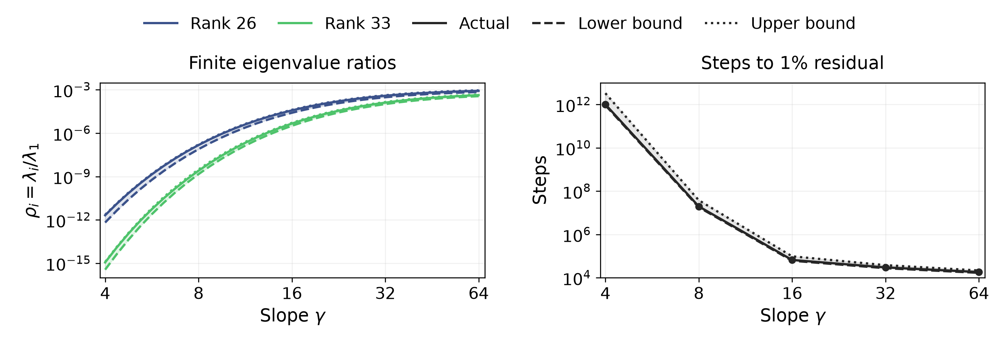

# Small slopes delay readout gradient descent

*Compact argument · 23 September 2026*

Small slopes can make readout gradient descent impractically slow even when an accurate fit exists. We show this by bounding the steps required to reach a prescribed error. Freeze uniformly spaced centers \(c_j\) and slope \(\gamma\). On \(m\) samples, the feature matrix has entries \((B_\gamma)_{aj}=\tanh(\gamma(x_a-c_j))/\sqrt m\), plus a bias column \(1/\sqrt m\). With \(y_a=f(x_a)/\sqrt m\), the loss is \(L(v)=\tfrac12\|B_\gamma v-y\|^2\). Choose \(\eta_\gamma=1/[2\lambda_1(K_\gamma)]\), where \(K_\gamma=B_\gamma B_\gamma^\top\) has eigenvalues \(\lambda_1\ge\cdots\ge\lambda_m\). Gradient descent from \(v_0=0\), with \(r_n=B_\gamma v_n-y\), gives

\[
v_{n+1}=v_n-\eta_\gamma B_\gamma^\top r_n
\quad\Longrightarrow\quad
r_{n+1}=(I-\eta_\gamma K_\gamma)r_n,\qquad r_0=-y.
\tag{1}
\]

Taking \(n\) iterations and diagonalizing the repeated matrix \(I-\eta_\gamma K_\gamma\), with orthonormal eigenvectors \(u_i\) and ratios \(\rho_i=\lambda_i/\lambda_1\), gives the relative squared error

\[
E_\gamma(n)^2:=\frac{\|r_n\|^2}{\|y\|^2}
=\sum_{i=1}^{m}p_i(1-\rho_i/2)^{2n},
\qquad p_i:=\frac{|u_i^\top y|^2}{\|y\|^2}.
\tag{2}
\]

Residual components with \(\rho_i>0\) decay exponentially in \(n\), at rates controlled by \(\rho_i\). Thus, upper bounds \(\rho_i\le\rho_i^+(\gamma)\) that remain extremely small in directions needed to reach the prescribed error establish an impractically large minimum step count when gamma is small.

We show this bound by first viewing \((K_\gamma)_{ab}=\langle(B_\gamma)_{a:},(B_\gamma)_{b:}\rangle\) as the inner product of rows \(a\) and \(b\) of \(B_\gamma\). Define \(H_\gamma\in\mathbb R^{m\times m}\) as its centered continuous inner-product analogue, with center density \(1/h\), where \(h\) is the center spacing. Centering across samples cancels the constant tails and makes the integral finite:

\[
\begin{aligned}
\widetilde t_{\gamma,a}(c)&=\tanh(\gamma(x_a-c))-\frac1m\sum_{\ell=1}^m\tanh(\gamma(x_\ell-c)),\\
(H_\gamma)_{ab}&=\frac1{hm}\int_{\mathbb R}\widetilde t_{\gamma,a}(c)\widetilde t_{\gamma,b}(c)\,dc.
\end{aligned}
\]

For its \(i\)th unit eigenvector \(u\perp\mathbf1\), multiplying on the left by \(u^\top\) and on the right by \(u\) gives (derivation in Appendix C)

\[
\lambda_i(H_\gamma)=u^\top H_\gamma u
=\frac2{\pi hm}\int_{\mathbb R}\frac{M_\gamma(\omega)^2}{\omega^2}
\left|\sum_a u_a e^{-i\omega x_a}\right|^2d\omega.
\tag{3}
\]

The multiplier \(M_\gamma(\omega)=z/\sinh z\), \(z=\pi|\omega|/(2\gamma)\), with \(M_\gamma(0)=1\), supplies all gamma dependence of \(H_\gamma\). Low frequencies are nearly preserved; frequencies much larger than gamma are exponentially suppressed. Increasing gamma increases this integral for every fixed zero-sum vector, hence makes all ordered eigenvalues of \(H_\gamma\) nondecreasing (Appendix C).

Normalization cannot remove arbitrarily small eigenvalues: the constant direction gives \(\lambda_1(K_\gamma)\ge\|B_\gamma^\top\mathbf1/\sqrt m\|^2\ge1\). The bias contributes one; squared neuron means add to it. We use this lower bound, not an assumption that \(\lambda_1\) is constant (Appendix E).

**Theorem 1 (finite ratios and training delay).** For consecutive lattice centers and \(\gamma>0\), Appendix E constructs \(\rho_i^-\le\rho_i\le\rho_i^+\) in \([0,1]\) by computing the corrected integral spectrum and bounding the remaining lattice and halo terms. For gradient descent in (1),

\[
\underbrace{\sum_i p_i(1-\rho_i^+/2)^{2n}}_{\text{error that must remain}}
\ \le\ E_\gamma(n)^2\ \le\
\underbrace{\sum_i p_i(1-\rho_i^-/2)^{2n}}_{\text{error that can remain}}.
\tag{4}
\]

The first crossings of \(\epsilon^2\) give necessary and sufficient step counts; a missing crossing is \(+\infty\). The figure evaluates this training-time interval.

*Figure 1. \(h=1/64\), 153 tanh centers including halo, 263 samples; \(f(x)=\sin(2\pi x)+\tfrac12\sin(6\pi x)+\tfrac14\sin(10\pi x)\). Left: finite ratios and bounds. Right: steps to 1% relative error, using actual target projections. At gamma 4, a readout attains \(5.85\times10^{-4}\), yet the evaluated necessary count is \(9.20\times10^{11}\). At gamma 64, the sufficient count is 21,611. Checked, uncertified spectral calculations; no long training runs (Appendix G).*
