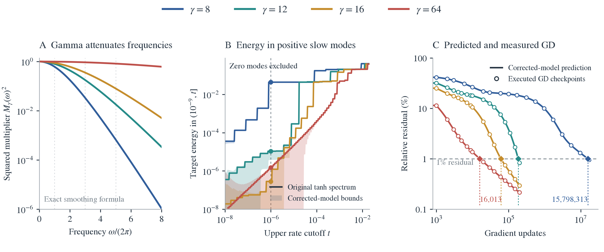

# How gamma controls access to representable target components

[PDF](gamma_access_collaborator_note.pdf) · [LaTeX](gamma_access_collaborator_note.tex) · [Full construction and spectral proofs](gamma_uniform_grid_theorem.md)

**The proposed paper claim.** A target component can belong to a frozen tanh dictionary's span and still require millions of readout updates to learn. A common small slope $\gamma$ suppresses frequency content in the features. On a finite interval, sampling and boundaries mix those frequencies; retaining this mixing carries the explicit attenuation into accurate eigenvalues and target projections. We can therefore identify **representable but slow target components**, and predict the resulting delay before running GD.

For a paper with room for one theorem, we recommend the **finite-interval tanh theorem** below. It concerns the features actually trained. The periodic calculation is a motivating example and a step in the proof, rather than a second headline theorem. The final finite spectral calculation is part of evaluating the result. The construction has no decay rate fitted to the observed training curve.

The new figure follows the argument in three steps: gamma filters frequency content; the finite kernel places target energy in positive but slow modes; that spectrum predicts the observed training trajectory. In the primary example, the gamma-8 calculation places at least **4.3322% of target energy in representable slow modes**, giving a **3.036-million-update necessary time** from that band alone. Using the complete spectrum gives a narrow interval containing the measured **15,798,313 updates**. The spectral numbers use a disclosed floating-point allowance; the four full-spectrum primary timing intervals also contain independently certified archived intervals.

**Notation.** $J_\gamma$ is the sample-normalized feature matrix; $K_\gamma=J_\gamma J_\gamma^*$ is its readout kernel. $\mu_j$ denotes an eigenvalue, and $\eta\mu_j$ is its per-update learning rate. $E_\gamma(n)$ is relative residual norm, so 1% residual means $E_\gamma(n)\le0.01$. $\gamma$ denotes physical slope; if needed, dimensionless bandwidth is $\lambda=\gamma h$, never an eigenvalue. A hat denotes the explicitly constructed approximation, and $\delta_\gamma$ bounds its kernel error.

## 1. Why the periodic example makes the mechanism transparent

A tanh is exactly a smoothed step:

$$
\tanh(\gamma x)=(\rho_\gamma*\operatorname{sign})(x),\qquad
\rho_\gamma(t)=\frac{\gamma}{2}\operatorname{sech}^2(\gamma t).
$$

The smoothing density has Fourier multiplier

$$
M_\gamma(\omega)=\frac{z}{\sinh z},\qquad
z=\frac{\pi|\omega|}{2\gamma},\qquad M_\gamma(0)=1.
$$

On a circle, with both centers and the input measure uniform over the whole period, translations make the kernel diagonal in Fourier waves. Smoothing multiplies each feature coefficient by $M_\gamma$, and the kernel pairs two feature coefficients. Hence

$$
\mu_\omega(\gamma)=\mu_\omega^{\rm step}M_\gamma(\omega)^2.
$$

At high frequency relative to gamma,

$$
M_\gamma(\omega)^2
\sim \left(\frac{\pi|\omega|}{\gamma}\right)^2
e^{-\pi|\omega|/\gamma}.
$$

At a fixed step size, this produces an exponential optimization penalty. Every frequency with $\mu_\omega^{\rm step}>0$ remains accessible at every $\gamma>0$, but its learning rate can become extremely small. Frequencies absent from the periodic step have zero eigenvalue and remain inaccessible; for the standard square wave these include nonconstant even harmonics. The bias supplies the constant mode. Thus the claim concerns accessible frequencies, not all periodic functions.

Ordinary tanh on an interval is not this periodic population model. Its boundaries and finite sampling can rotate learning directions. The finite theorem retains those effects explicitly instead of treating the periodic eigenvalue formula as an approximation to the answer.

## 2. The one theorem to present

Fix an interval of length $L>0$, an integer $N\ge3$, equally spaced core centers $c_j=jh$ with $j=0,\ldots,N-1$ and $h=L/N$, and inputs $x_i=ih/q$, where $q$ is a positive integer and $i=0,\ldots,qN$. Thus $m=qN+1$ inputs include both endpoints. Any extra centers are fixed and retained explicitly; let $W$ be the total number of tanh features. Include a bias column equal to $1/\sqrt m$ and define the tanh columns and target normalization by

$$
J_\gamma[i,j]=\frac{\tanh(\gamma(x_i-c_j))}{\sqrt m},\qquad
y_i=\frac{y_i^{\rm phys}}{\sqrt m}.
$$

All tanh features have a common frozen slope $\gamma>0$. Readout GD minimizes $\frac12\|J_\gamma w-y\|^2$ in the original Euclidean coefficients, starts from $w=0$, and uses step $\eta>0$. The target vector $y\ne0$ and all input/center locations stay fixed when gamma changes.

Its relative residual is $E_\gamma(n)=\|(I-\eta K_\gamma)^ny\|/\|y\|$.

Write $\mu_j$ for the kernel eigenvalues in decreasing order, including zeros, and $u_j$ for an orthonormal eigenbasis. Define the cumulative target energy

$$
S_\gamma(t)=\sum_{\eta\mu_j\le t}\frac{|\langle y,u_j\rangle|^2}{\|y\|^2}.
$$

The construction has two ingredients. First synthesize a periodic reference from Fourier coefficients multiplied by the explicit $M_\gamma$. Then retain the gamma-dependent boundary terms, exact boundary columns, extra centers, bias, and endpoint row. Call the resulting feature matrix $\widehat J_\gamma$ and its kernel $\widehat K_\gamma$. Appendix A gives the scalar formulas and the error allowance; no training observation is used in constructing them.

> **Theorem: Gamma-dependent access to representable components of a finite tanh readout.**
>
> Under the geometry and raw-readout parameterization above, the Fourier and boundary construction gives an explicit allowance $\delta_\gamma$ such that
> $$
> \|K_\gamma-\widehat K_\gamma\|\le\delta_\gamma,\qquad
> |\mu_j(\gamma)-\widehat\mu_j(\gamma)|\le\delta_\gamma.
> $$
> All gamma dependence is explicit in the frequency multipliers, boundary factors, and allowance. The analytic allowance tends geometrically to zero as the retained boundary expansion is increased.
>
> Choose $\eta(\|\widehat K_\gamma\|+\delta_\gamma)\le1$. Let $\underline S_\gamma(t)$ and $\overline S_\gamma(t)$ be the lower and upper bounds, defined below, on the fraction of target energy in per-update rates at most $t$. For $0<a<b<1$, set
> $$
> p_\gamma=\left[\underline S_\gamma(b)-\overline S_\gamma(a)\right]_+.
> $$
> At least a fraction $p_\gamma$ of target energy lies in the positive-rate band $(a,b]$. This component is exactly representable on the sampled grid. Nevertheless, its contribution implies
> $$
> \boxed{E_\gamma(n)\ge\sqrt{p_\gamma}(1-b)^n.}
> $$

The theorem identifies a property of the specified target and dictionary; it does not assume beforehand that this target aligns with a chosen Fourier wave. Gamma changes both the eigenvalues and the finite eigenvectors. The spectral calculation retains both changes when computing target energy.

To make the target-energy bounds explicit, compute the eigenvectors $\widehat u_j$ of $\widehat K_\gamma$ and define

$$
\widehat S_\gamma(t)=\sum_{\eta\widehat\mu_j\le t}
\frac{|\langle y,\widehat u_j\rangle|^2}{\|y\|^2}.
$$

Include the full nullspace in this cumulative quantity. For any chosen buffer $g>0$, valid bounds are

$$
\underline S_\gamma(t)=\left(\sqrt{\widehat S_\gamma(t-g)}-\frac{\eta\delta_\gamma}{g}\right)_+^2,\qquad
\overline S_\gamma(t)=\min\left\{1,\left(\sqrt{\widehat S_\gamma(t+g)}+\frac{\eta\delta_\gamma}{g}\right)^2\right\}.
$$

Different buffers can be used at different cutoffs. Taking the largest lower bound and smallest upper bound over any declared collection of buffers remains valid. Subtracting the upper mass at a strictly positive $a$ is essential: it removes the possibility that the reported slow energy is merely an unlearnable nullspace component.

The full target need not be exactly representable. The component isolated by $(a,b]$ is. This is the precise sense in which the theorem separates optimization access from capacity.

## 3. Where gamma enters, and what must still be calculated

The quantitative chain is

$$
\gamma
\longrightarrow
\underbrace{M_\gamma(\omega)\text{ and explicit boundary factors}}_{\text{feature construction}}
\longrightarrow
\underbrace{\widehat\mu_j(\gamma),\widehat u_j(\gamma)}_{\text{finite spectral calculation}}
\longrightarrow
\underbrace{p_\gamma\text{ and }E_\gamma(n)}_{\text{target access and delay}}.
$$

This is more than observing that changing gamma changes a matrix. We identify its feature-level action analytically, retain the geometry that mixes frequencies, and bound the resulting spectral error. The finite eigenvectors are computed, rather than assumed to remain Fourier waves. The boundary correction also depends on gamma; it is neither a free fit nor an assumed small perturbation.

Two different errors must not be confused. Small gamma can make the true learning rates small. Separately, a finite expansion introduces an approximation error $\delta_\gamma$, which can be reduced by retaining more terms. The latter controls the precision of our prediction; it is not the proposed cause of the learning delay.

The periodic example yields a scalar cap-to-rate inequality immediately. On the finite interval, this theorem yields quantitative predictions after solving the explicit corrected spectral problem. It does not assert that every target or every finite eigenvalue improves monotonically as gamma increases. No such ordering is needed to explain the measured, target-dependent delay.

## 4. Predictions and the three-panel figure

<figure>
  
  <figcaption><strong>Gamma changes optimization access to a fixed target.</strong> A shows the exact analytic periodic attenuation, not measured training data. Faint guides mark the target's physical frequencies, without identifying them with finite-kernel eigenvectors. B shows finite ordinary-tanh target energy in positive learning rates above $a=10^{-9}$ and below the horizontal-axis cutoff; solid curves come from the original tanh spectrum, and shaded bounds come from the Fourier-plus-boundary construction. The marked cutoff is $b=10^{-6}$. C shows predictions from the complete constructed spectrum against actual saved GD checkpoints; the horizontal 1% residual threshold and crossing markers make acquisition time visible. Circles are saved GD measurements, diamonds are executed first hits, and the short horizontal segments at 1% are necessary-sufficient timing intervals. Colors identify the same four slopes throughout. Numerical spectral bands use the disclosed FP64 sensitivity allowance, not independent interval certification. The primary full-spectrum timing intervals contain previously certified intervals.</figcaption>
</figure>

The primary target is

$$
f(x)=\sin(2\pi x)+\tfrac12\sin(6\pi x)+\tfrac14\sin(10\pi x),\qquad x\in[-1,1].
$$

The archived experiment uses $L=2$, $N=512$, $q=16$, and $m=8193$. Its 512 core centers, terminal center, and 23 halo centers on each side give 559 tanh features plus bias. The four frozen common slopes are 8, 12, 16, and 64. Readouts start at zero, and each saved step is curvature-normalized to approximately $\eta\|K_\gamma\|=0.5$. Thus comparisons concern those actual normalized steps, not a common raw step. The coordinate shift from $[-1,1]$ to $[0,L]$ changes neither feature differences nor target samples.

At $\gamma=8$, $a=10^{-9}$ and $b=10^{-6}$, the theorem's numerical evaluation gives

$$
\underline S_8(b)=0.0433317719,\qquad
\overline S_8(a)=0.00000929944,\qquad
p_8\ge0.0433224724.
$$

Thus at least 4.3322% of target energy lies in strictly positive but slow modes. The single-band bound requires at least **3,035,627 updates** to reach 1% relative residual. At gamma 64, even the upper bound on all energy with rates at most $10^{-6}$ is only about **0.000162%**. These are comparisons for the same target, with each gamma's own finite learning directions retained.

The single-band bound intentionally discards variation within that band. Carrying every rate and target weight through the GD calculation gives necessary-sufficient intervals of **15,767,081-15,829,763**, **186,056-186,059**, **61,792-61,793**, and **16,013-16,013** updates, respectively. The measured crossings are **15,798,313**, **186,057**, **61,792**, and **16,013**. The gamma-8 interval width is 0.397% of the observed time. It is therefore useful to show both the positive slow component that explains the obstruction and the complete forecast that accurately predicts its duration.

This is a retrospective analysis of existing optimization experiments. The representative target and rate band were chosen during analysis, not preregistered. The construction's truncations use analytic error bounds, and the buffer scan uses the constructed spectrum without consulting the original target mass. No new training or fitted decay parameters are involved; these figures make no held-out generalization claim. The wider validation package contains three grid sizes, four slopes, and five targets, with all 60 reference crossings and all 19 available executed crossings enclosed.

The plotted spectral bounds add a heuristic FP64 arithmetic allowance to the proved analytic remainder. They are not independent interval certificates. The four full-spectrum primary timing intervals additionally contain existing independently certified Arb intervals, which validates those wider timing intervals by monotonicity. That inherited validation does not certify the new positive-band energy numbers. The [full technical note](gamma_uniform_grid_theorem.md) records the arithmetic allowance and its tenfold sensitivity check.

## Appendix A. Explicit construction and proof

**The reference and its boundaries.** Let $s$ be the $2L$-periodic square wave equal to $\operatorname{sign}(d)$ on $(-L,L)$, and let $\phi_\gamma=\rho_\gamma*s$. It is antiperiodic: shifting by $L$ flips its sign. Its Fourier expansion is

$$
\phi_\gamma(d)=\sum_{k\in\mathbb Z}\frac{2}{i\pi(2k+1)}
M_\gamma\!\left(\frac{(2k+1)\pi}{L}\right)
e^{i(2k+1)\pi d/L}.
$$

Positive gamma makes this series absolutely convergent. Sampling this series retains aliases: coefficients of frequencies indistinguishable on the finite grid add before the kernel is formed. One must not substitute the population eigenvalue formula for this sampled calculation.

The exact image identity is

$$
\phi_\gamma(d)=\tanh(\gamma d)+\sum_{\ell\ge1}(-1)^\ell
\big[\tanh(\gamma(d-\ell L))+\tanh(\gamma(d+\ell L))\big].
$$

Differentiate: both sides have derivative $\sum_{\ell\in\mathbb Z}(-1)^\ell\gamma\operatorname{sech}^2(\gamma(d-\ell L))$. Both vanish at zero, and the paired tails converge locally uniformly, proving the identity. Expanding each image's positive-distance tanh as a geometric series gives, for $|d|<L$,

$$
\tanh(\gamma d)=\phi_\gamma(d)+
2\sum_{r\ge1}\frac{(-1)^{r-1}}{1+e^{-2r\gamma L}}
\big[e^{-2r\gamma(L-d)}-e^{-2r\gamma(L+d)}\big].
$$

This is the explicit finite-interval gamma dependence: the Fourier attenuation and every boundary coefficient are known functions of gamma. With $d=x-c$, each exponential separates into a factor of $x$ and a factor of $c$. Retaining $p$ terms therefore gives a correction of rank at most $2p$ on the interior columns.

**A controllable remainder.** Choose an integer $B$ with $1\le B<N/2$ and a nonnegative integer $p$. Treat the first and last $B$ core columns exactly. On the remaining core columns and all but the endpoint input row, use $\phi_\gamma$ plus the first $p$ boundary terms. Treat extra centers, bias, and the endpoint row exactly. This defines $\widehat J_\gamma$ in the original feature coordinates.

Interior distances satisfy $|d|\le L-Bh$. The finite geometric remainder of each tanh expansion is at most twice its first omitted exponential. Summing over both sides and all images bounds the unnormalized entry error by

$$
\epsilon_{B,p}(\gamma)=\frac{4e^{-2(p+1)\gamma Bh}}{1-e^{-2(p+1)\gamma L}}.
$$

At most $N-2B$ columns have an error. Frobenius norm bounds operator norm, so

$$
\epsilon_J=\sqrt{N-2B}\,\epsilon_{B,p}(\gamma),\qquad
\|J_\gamma-\widehat J_\gamma\|\le\epsilon_J.
$$

Every true feature entry before normalization has magnitude at most one, including bias. Hence $\|J_\gamma\|\le\sqrt{W+1}$, and expanding the Gram difference gives

$$
\boxed{\delta_\gamma=2\sqrt{W+1}\,\epsilon_J+\epsilon_J^2.}
$$

This proves the kernel bound; the min-max characterization of ordered eigenvalues proves the eigenvalue bound. If the reference Fourier series is truncated with uniform entry error $\tau$, replace $\epsilon_{B,p}$ by $\epsilon_{B,p}+\tau$ before forming $\epsilon_J$ and $\delta_\gamma$. Floating-point evaluation needs an additional, separate allowance.

The reference's uniform-grid blocks are explicitly diagonalizable by half-odd Fourier vectors. Restoring boundary columns, the $p$ separable terms, $W-N$ extra centers, bias, and the endpoint row changes the feature matrix by rank at most $2B+2p+(W-N)+2$. The corresponding kernel correction has rank at most twice this. It is signed and need not be small in norm. The [full construction proof](gamma_uniform_grid_theorem.md) supplies the exact alias sums and signed spectral formulas. The numerical full-trajectory forecast uses the SVD of the constructed feature matrix; it does not claim to obtain every target projection from a small eigenvalue-count calculation.

**Transferring target energy.** Put $A=\eta K_\gamma$, $\widehat A=\eta\widehat K_\gamma$, and $d=\eta\delta_\gamma$. Let $P$ project onto eigenvalues of $A$ at most $t$, and $Q$ onto eigenvalues of $\widehat A$ at most $t-g$. The cross-projection $X=(I-P)Q$ solves

$$
A_{>t}X-X\widehat A_{\le t-g}=(I-P)(A-\widehat A)Q.
$$

The two spectra are separated by at least $g$. The exponential integral solution of this Sylvester equation gives $\|X\|\le d/g$. Therefore $\|Qy\|\le\|Py\|+(d/g)\|y\|$, yielding the lower cumulative-energy bound. Using the projector of $\widehat A$ below $t+g$ and reversing the roles gives the upper bound. This controls subspaces without requiring a gap between every pair of eigenvalues.

The true energy in $(a,b]$ equals $S_\gamma(b)-S_\gamma(a)$ and is at least $[\underline S_\gamma(b)-\overline S_\gamma(a)]_+$. Every eigenvalue in this band is positive, so every corresponding eigenvector lies in $\operatorname{range}(K_\gamma)=\operatorname{range}(J_\gamma)$. That proves exact representability of the isolated component on the input grid.

**Transferring to training.** Zero initialization gives $r_n=(I-\eta K_\gamma)^ny$. Under the stated step condition, each mode with rate in $(a,b]$ retains at least a factor $1-b$ of its residual amplitude per update. Squaring and summing its target coefficients proves $E_\gamma(n)^2\ge p_\gamma(1-b)^{2n}$. For $p_\gamma>\varepsilon^2$, reaching $E_\gamma(n)\le\varepsilon$ therefore requires

$$
n\ge\left\lceil\frac{\log(\sqrt{p_\gamma}/\varepsilon)}{-\log(1-b)}\right\rceil.
$$

The complete constructed spectrum gives

$$
\widehat E_\gamma(n)^2=\sum_j
\frac{|\langle y,\widehat u_j\rangle|^2}{\|y\|^2}
(1-\eta\widehat\mu_j)^{2n},\qquad
|E_\gamma(n)-\widehat E_\gamma(n)|\le n\eta\delta_\gamma.
$$

The sum includes nullspace energy. The last inequality follows by telescoping the two matrix powers; each of the $n$ terms contains one kernel difference and otherwise contractions. Thus $\widehat E_\gamma(n)+n\eta\delta_\gamma\le\varepsilon$ proves acquisition by $n$, while $\widehat E_\gamma(n)-n\eta\delta_\gamma>\varepsilon$ excludes acquisition by $n$. This is the origin of the necessary-sufficient timing intervals.

## Appendix B. Paper placement and reproducibility

Use the periodic multiplier calculation as the motivating example, the finite-tanh access theorem as the sole numbered theorem, and the three-panel figure as its empirical evaluation. Keep the scalar construction, transfer proof, full timing formula, and numerical sensitivity details in the appendix. Present the assumptions of common frozen slope, uniform core centers and samples, fixed target, and raw readout GD alongside the theorem. Representability here means representability on the training grid.

The width implication remains simple: at a grid-relative frequency $\theta=\omega h$, the attenuation depends on $\gamma h$ through $z=\pi|\theta|/(2\gamma h)$. Keeping $\gamma h$ fixed preserves this part of spectral access as the grid is refined. It does not alone remove the raw kernel's width scaling, boundary effects, or the step-size dependence.

The [figure data](../results/checkpoint_D_optimizers/expD36_frozen_gamma_probe/full_sweep/refinements/gamma_access_note/gamma_access_data.json) records source hashes, positive-band bounds, all GD checkpoints, and the distinction between analytic and measured quantities. Reproduce the figure with <code>python -m experiments.expD36_frozen_gamma_probe.gamma_access_figure</code>. Compile this note with <code>latexmk -pdf -outdir=/tmp/gamma-access-latex docs/gamma_access_collaborator_note.tex</code>. Earlier proof notes and experiment archives remain unchanged. No new GPU training is used.
