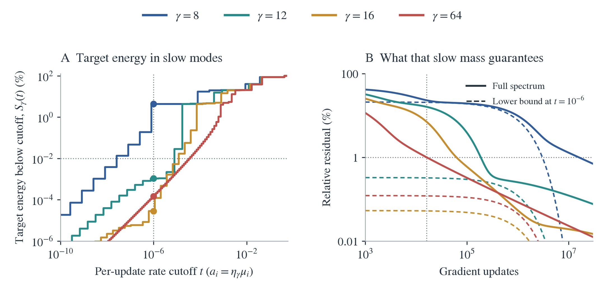

# From gamma to slow target directions: the complete argument

[PDF](gamma_optimization_full_note.pdf) · [LaTeX source](gamma_optimization_full_note.tex) · [Short PI brief](gamma_optimization_pi_brief.pdf)

Small gamma smooths the features. To turn this into a statement about optimization, we must show that some part of the target lies in directions on which the resulting kernel acts weakly. This note supplies that missing step, proves the learning-time consequences, and explains how retaining the full kernel yields the sharp predictions in the experiments.

There are two levels of conclusion. An explicit bound on high-frequency kernel action guarantees slow target energy and a learning delay under stated target and geometry conditions. That bound can be conservative. A calculation retaining the whole gamma-filtered kernel gives much sharper, target-specific intervals. The measured factor of 986.59 belongs to the second calculation; it is not the sharpness of the first bound.

**Notation.** Throughout this note, $\mu_i$ denotes a kernel eigenvalue. The symbol $\lambda=\gamma h$ is reserved for dimensionless bandwidth when the centers have spacing $h$. The physical slope is $\gamma$. The step size is $\eta_\gamma$, the largest kernel eigenvalue is $L_\gamma$, and $a_i=\eta_\gamma\mu_i$ is a per-update decay rate. Norms are Euclidean for vectors and spectral for matrices. Every additional symbol is defined where it enters. Earlier notes used $\lambda_i$ for eigenvalues and $\beta$ for bandwidth; this note supersedes that notation.

## 1. The model and the optimization question

Fix training inputs $x_1,\ldots,x_m$, centers $c_1,\ldots,c_W$, and a nonzero target. Only the raw readout coefficients are trained:

$$
f_{\gamma,\theta}(x)=b+\sum_{j=1}^Ww_j\tanh(\gamma(x-c_j)),\qquad
\theta=(b,w_1,\ldots,w_W)^T.
$$

Normalize both the samples of the features and the target by $\sqrt m$:

$$
(J_\gamma)_{i0}=m^{-1/2},\qquad
(J_\gamma)_{ij}=m^{-1/2}\tanh(\gamma(x_i-c_j)),\qquad
y_i=m^{-1/2}f^\star(x_i).
$$

The loss is $\frac12\|J_\gamma\theta-y\|^2$, exactly half empirical mean squared error. Define

$$
K_\gamma=J_\gamma J_\gamma^T,\qquad L_\gamma=\|K_\gamma\|,
\qquad \theta_0=0.
$$

The bias column has norm one, so $L_\gamma\ge1$. Use a prescribed stable step $0<\eta_\gamma L_\gamma\le1$. Our archived experiments have $\eta_\gamma L_\gamma\simeq1/2$. Changing gamma holds the target, inputs, centers, raw coefficient metric, and step-size rule fixed.

Representability asks whether some coefficients fit the target. Optimization asks how many updates starting at zero are needed to find sufficiently accurate coefficients. A target can be representable while the relevant kernel eigenvalues are very small.

### An exact example with no spectral ambiguity

Take one center at zero, samples $-s,+s$ with $s>0$, and target values $-1,+1$. Put $d=\tanh(\gamma s)$. Then

$$
K_\gamma=\frac12
\begin{pmatrix}1+d^2&1-d^2\\1-d^2&1+d^2\end{pmatrix}.
$$

The mean direction $(1,1)/\sqrt2$ has eigenvalue $1$. The contrast direction $(-1,1)/\sqrt2$, which is exactly the target direction, has eigenvalue $d^2$. These statements follow by multiplying the displayed matrix by the two vectors. Thus $L_\gamma=1$, while the target's normalized eigenvalue is $\tanh^2(\gamma s)$.

Every positive gamma fits exactly with $b=0,w=1/d$. Nevertheless, at step $\eta_\gamma=\kappa\in(0,1)$,

$$
E_\gamma(n)=(1-\kappa\tanh^2(\gamma s))^n,\qquad
n_\epsilon=\left\lceil\frac{\log(1/\epsilon)}{-\log(1-\kappa\tanh^2(\gamma s))}\right\rceil.
$$

As $\gamma s\to0$, $n_\epsilon\sim\log(1/\epsilon)/(\kappa\gamma^2s^2)$. A cap $\gamma\le\bar\gamma$ gives the exact lower bound obtained by replacing gamma with $\bar\gamma$ in the displayed time; it is attained at the cap. With $\kappa=1/2$ and $\epsilon=0.01$, the counts are 925 for $\gamma s=0.1$ and 14 for $\gamma s=1$. A constant target instead decays as $(1-\kappa)^n$, independently of gamma. This proves both the possible optimization obstruction and the necessity of a target condition.

## 2. What determines training: rates weighted by the target

Let $r_n=y-J_\gamma\theta_n$ and $E_\gamma(n)=\|r_n\|/\|y\|$. The acquisition time is

$$
n_\epsilon(\gamma)=\inf\{n\in\mathbb N_0:E_\gamma(n)\le\epsilon\},
$$

with value $+\infty$ if the set is empty. A 1% relative residual means a relative squared residual of $10^{-4}$.

**Proposition 1 (exact GD evolution).** Let $u_i$ be an orthonormal eigenbasis of $K_\gamma$, including its nullspace, with eigenvalues $\mu_i\ge0$. Set

$$
a_i=\eta_\gamma\mu_i,\qquad
p_i=\frac{|u_i^Ty|^2}{\|y\|^2}.
$$

Then $\sum_i p_i=1$, $0\le a_i\le1$, and

$$
\boxed{r_n=(I-\eta_\gamma K_\gamma)^ny,\qquad
E_\gamma(n)^2=\sum_i p_i(1-a_i)^{2n}.}
\tag{1}
$$

**Proof.** The gradient is $J_\gamma^T(J_\gamma\theta-y)$. Hence $\theta_{n+1}=\theta_n+\eta_\gamma J_\gamma^Tr_n$ and $r_{n+1}=(I-\eta_\gamma K_\gamma)r_n$. Since $r_0=y$, induction proves the first identity. Expand $y$ in the orthonormal eigenbasis and square its norm to obtain the second. The convention at $n=0$ is that every mode contributes its initial energy, including a mode with $a_i=1$. Each factor is nonincreasing, so the residual is nonincreasing. $\square$

The limiting squared residual is $E_\infty^2=\sum_{\mu_i=0}p_i$, which is at most every finite-time squared residual. This is the projection of the target outside the feature span; it does not compare the tanh model with a step-function model.

For $\eta_\gamma=\kappa/L_\gamma$, the rates are $a_i=\kappa\mu_i/L_\gamma$. Overall kernel rescaling cancels. The relevant object is therefore the distribution of target energy across normalized eigenvalues, rather than the condition number alone. Individual eigenvectors need not be tracked across gamma; within repeated eigenspaces their choice is arbitrary, but the total target energy in each spectral subspace is well defined.

Define the **slow target mass** at rate cutoff $t\in(0,1)$ by

$$
S_\gamma(t)=\sum_{a_i\le t}p_i.
$$

**Corollary 1 (slow mass implies a delay).**

$$
E_\gamma(n)\ge\sqrt{S_\gamma(t)}(1-t)^n.
\tag{2}
$$

If $\sqrt{S_\gamma(t)}>\epsilon$, then

$$
n_\epsilon(\gamma)\ge
\left\lceil\frac{\log(\sqrt{S_\gamma(t)}/\epsilon)}{-\log(1-t)}\right\rceil.
\tag{3}
$$

**Proof.** Keep only the nonnegative terms with $a_i\le t$ in (1), and use $(1-a_i)^{2n}\ge(1-t)^{2n}$. Taking square roots gives (2); solving its necessary inequality for a crossing gives (3). $\square$

This corollary is already target aware. We now connect its slow mass to gamma without assuming Fourier waves are finite-kernel eigenvectors.

## 3. Gamma is an exact smoothing operation on the features

For a bounded function $\varphi:\mathbb R\to\mathbb R$, define the unit-mass density and smoothing operation

$$
\rho_\gamma(t)=\frac\gamma2\operatorname{sech}^2(\gamma t),\qquad
(\mathcal S_\gamma\varphi)(x)=\int_{\mathbb R}\rho_\gamma(x-t)\varphi(t)\,dt.
$$

Here $\varphi$ may be a constant or a step feature. The calligraphic $\mathcal S_\gamma$ distinguishes this operation from the scalar slow mass $S_\gamma(t)$.

**Lemma 1 (exact smoothing and multiplier).** Constants are preserved, and

$$
\mathcal S_\gamma\operatorname{sign}(\cdot-c)
=\tanh(\gamma(\cdot-c)).
$$

For $k_{\rm step}(t,s)=1+\sum_j\operatorname{sign}(t-c_j)\operatorname{sign}(s-c_j)$,

$$
k_\gamma(x,x')=\iint\rho_\gamma(x-t)\rho_\gamma(x'-s)k_{\rm step}(t,s)\,dt\,ds,
\qquad (K_\gamma)_{i\ell}=k_\gamma(x_i,x_\ell)/m.
\tag{4}
$$

The Fourier multiplier, with convention $\widehat\rho(\omega)=\int\rho(t)e^{-i\omega t}dt$, is

$$
\boxed{M_\gamma(\omega)=\frac{z}{\sinh z},\qquad
z=\frac{\pi|\omega|}{2\gamma},\qquad M_\gamma(0)=1.}
\tag{5}
$$

**Proof.** The density has cumulative integral $[1+\tanh(\gamma t)]/2$. Splitting the convolution at $c$ gives $2\int_{-\infty}^{x-c}\rho_\gamma(u)du-1=\tanh(\gamma(x-c))$. Unit mass preserves the bias. Insert the finite sum defining $k_{\rm step}$ to prove (4). Bounded features and an integrable density justify the exchanges; the step functions need not belong to whole-line $L^2$.

For the transform, put $\xi=\omega/\gamma>0$ and integrate $e^{-i\xi z}/\cosh^2z$ around a rectangle with imaginary heights zero and $\pi$. The vertical integrals vanish as its real endpoints tend to infinity. The upper horizontal integral is $-e^{\pi\xi}$ times the lower one. The double pole at $z_0=i\pi/2$ has residue $i\xi e^{\pi\xi/2}$: near $z_0$, $1/\cosh^2z=-1/(z-z_0)^2+O(1)$. Consequently,

$$
(1-e^{\pi\xi})\int_{\mathbb R}\frac{e^{-i\xi u}}{\cosh^2u}\,du
=-2\pi\xi e^{\pi\xi/2},
$$

so the integral is $\pi\xi/\sinh(\pi\xi/2)$. Scaling $u=\gamma t$ and dividing by two gives (5). Evenness handles negative frequencies and continuity gives the value at zero. $\square$

For $z>0$, $(z/\sinh z)'=(\sinh z-z\cosh z)/\sinh^2z<0$: the numerator starts at zero and has derivative $-z\sinh z$. Thus smaller gamma gives stronger attenuation at a fixed nonzero frequency. A cap $\gamma\le\bar\gamma$ implies $M_\gamma(\omega)\le M_{\bar\gamma}(\omega)$, and $M_\gamma(\omega)\sim2ze^{-z}$ at high frequency.

Equation (4) smooths the first and second input arguments separately. It is an identity before sampling, not multiplication of the finite sample matrix by an unspecified discrete convolution matrix. The identity alone does not order the finite kernels or their target-weighted spectra.

## 4. Keep the finite geometry: an explicit matrix construction

We need a finite representation in which the gamma-dependent factors are known and the discarded part is bounded. This construction approximates the original nonperiodic tanh features; it does not make the training problem periodic.

Let $R_0=\max_{i,j}|x_i-c_j|$, choose a half-period $T>R_0$, and choose a positive integer $Q$. For $\ell=1,\ldots,Q$, define

$$
\omega_\ell=(2\ell-1)\pi/T,\qquad b_\ell=4/[\pi(2\ell-1)],\qquad
h_{\gamma,Q}(z)=\sum_{\ell=1}^Qb_\ell M_\gamma(\omega_\ell)\sin(\omega_\ell z).
$$

**Lemma 2 (feature remainder).** Put $d=\pi^2/(2\gamma T)$ and $u=d(2Q+1)$. On $|z|\le R_0$,

$$
|\tanh(\gamma z)-h_{\gamma,Q}(z)|\le e_{\gamma,Q}
:=4e^{-2\gamma(T-R_0)}+
\frac{4\pi}{\gamma T}\frac{e^{-u}}{(1-e^{-2u})(1-e^{-2d})}.
\tag{6}
$$

**Proof.** The periodic square wave $\operatorname{sign}(\sin(\pi z/T))$ agrees with $\operatorname{sign}(z)$ on $(-T,T)$. Their difference has magnitude at most two outside. After smoothing, its magnitude is at most $1-\tanh(\gamma(T-z))+1-\tanh(\gamma(T+z))$, bounded by the first term of (6). The square wave has odd sine coefficients $b_\ell$; smoothing multiplies each by (5), giving an absolutely convergent series. For odd $k$, the smoothed coefficient equals $2\pi\operatorname{csch}(dk)/(\gamma T)$. At $k\ge2Q+1$, use $\operatorname{csch}(dk)\le2e^{-dk}/(1-e^{-2u})$ and sum the geometric series with ratio $e^{-2d}$. This proves the second term. $\square$

Define three matrices, giving their entries so their roles are explicit:

- $F$ has $m$ rows and $2Q+1$ columns: $1,\sin(\omega_1x),\cos(\omega_1x),\ldots$, sampled at the inputs and divided by $\sqrt m$. It contains only the sample geometry.
- $C$ has $2Q+1$ rows and $W+1$ columns. Its bias row is $(1,0,\ldots,0)$, and its remaining bias-column entries are zero. For hidden column $j$, $C_{2\ell-1,j}=b_\ell\cos(\omega_\ell c_j)$ and $C_{2\ell,j}=-b_\ell\sin(\omega_\ell c_j)$. It contains only the center geometry and step coefficients.
- $D_\gamma$ is diagonal with entries $1,M_\gamma(\omega_1),M_\gamma(\omega_1),\ldots$. It contains all the gamma dependence.

**Proposition 2 (finite factorization and kernel error).**

$$
\widetilde J_\gamma=FD_\gamma C,\qquad
\widetilde K_\gamma=FD_\gamma CC^TD_\gamma F^T,
\tag{7}
$$

and, with $\delta_\gamma=\sqrt W e_{\gamma,Q}$,

$$
\|J_\gamma-\widetilde J_\gamma\|\le\delta_\gamma,\qquad
\|K_\gamma-\widetilde K_\gamma\|\le
\Delta_\gamma:=(2\|\widetilde J_\gamma\|+\delta_\gamma)\delta_\gamma.
\tag{8}
$$

**Proof.** Expand $\sin(\omega(x-c))=\sin(\omega x)\cos(\omega c)-\cos(\omega x)\sin(\omega c)$ to obtain (7). The bias is exact, and each normalized hidden column has error norm at most $e_{\gamma,Q}$. Summing squared column errors bounds the Frobenius norm, hence the spectral norm, by $\delta_\gamma$. Set $H=J_\gamma-\widetilde J_\gamma$ and expand $K_\gamma-\widetilde K_\gamma=H\widetilde J_\gamma^T+\widetilde J_\gamma H^T+HH^T$ to obtain (8). $\square$

The sampled waves in $F$ need not be orthogonal, and $CC^T$ need not be diagonal. Therefore $M_\gamma(\omega)^2$ is not generally an individual finite-kernel eigenvalue. Equation (7) retains both effects. It constructs the prediction using fixed geometry and explicit multipliers; it is not a fit to an optimization trajectory.

## 5. The missing implication: attenuation forces slow target energy

For any unit sample vector $v$,

$$
v^TK_\gamma v=\|J_\gamma^Tv\|^2
=\sum_i\mu_i|u_i^Tv|^2.
\tag{9}
$$

Thus small correlations with all features imply small spectral strength. The following theorem turns that observation into a target-dependent statement, including the effect of eigendirection rotation.

Choose a frequency cutoff $0<\Omega\le\omega_Q$. Let $P_{<\Omega}$ be the orthogonal projector, in the empirical Euclidean norm, onto the span of the bias and columns of $F$ with frequency below $\Omega$. Define $R_\Omega=I-P_{<\Omega}$ and

$$
\alpha=\|R_\Omega y\|/\|y\|.
$$

This is an explicit assumption on the target's component outside the sampled low-frequency span. It does not define the target using unknown slow eigenvectors. It also does not assert that a continuously high-frequency function is exactly orthogonal on a finite grid.

Let $F_{\ge\Omega}$ collect the remaining wave columns and $C_{\ge\Omega}$ the matching rows. Put

$$
B_\Omega=\|F_{\ge\Omega}\|^2\|C_{\ge\Omega}\|^2,\qquad
A_\gamma=\eta_\gamma\bigl[B_\Omega M_\gamma(\Omega)^2+\Delta_\gamma\bigr].
$$

Both the subspace and $B_\Omega$ are determined by fixed geometry, $T,Q,\Omega$, independently of gamma and GD.

**Theorem 1 (gamma-dependent slow-target guarantee).** For every $t\in(0,1)$,

$$
\boxed{S_\gamma(t)\ge
\left(\alpha-\sqrt{A_\gamma/t}\right)_+^2,
\qquad
E_\gamma(n)\ge
\left(\alpha-\sqrt{A_\gamma/t}\right)_+(1-t)^n,}
\tag{10}
$$

where $(z)_+=\max(z,0)$. If $b_\gamma(t):=(\alpha-\sqrt{A_\gamma/t})_+>\epsilon$, then

$$
\boxed{n_\epsilon(\gamma)\ge
\left\lceil\frac{\log(b_\gamma(t)/\epsilon)}{-\log(1-t)}\right\rceil.}
\tag{11}
$$

**Proof, step 1: gamma bounds action on the specified subspace.** For a unit $v$ in the range of $R_\Omega$, all low-frequency coordinates of $F^Tv$ vanish. Therefore

$$
\begin{aligned}
v^T\widetilde K_\gamma v
&=\|C_{\ge\Omega}^TD_{\gamma,\ge\Omega}F_{\ge\Omega}^Tv\|^2\\
&\le B_\Omega M_\gamma(\Omega)^2.
\end{aligned}
$$

The diagonal multiplier decreases with absolute frequency. Applying (8) gives $v^T(\eta_\gamma K_\gamma)v\le A_\gamma$.

**Step 2: weak action forces the direction into slow modes.** Let $P_{\rm fast}$ project onto rates $a_i>t$ and $P_{\rm slow}=I-P_{\rm fast}$. The spectral theorem gives $\eta_\gamma K_\gamma\succeq tP_{\rm fast}$. Hence $\|P_{\rm fast}v\|\le\sqrt{A_\gamma/t}$.

**Step 3: transfer that fact to the target.** If $\alpha=0$, (10) is trivial. Otherwise put $\widehat y=y/\|y\|$ and $v=R_\Omega\widehat y/\alpha$. Then $v^T\widehat y=\alpha$. Orthogonality of the two spectral projectors and Cauchy--Schwarz give

$$
\begin{aligned}
\alpha
&\le |(P_{\rm slow}v)^TP_{\rm slow}\widehat y|
 +|(P_{\rm fast}v)^TP_{\rm fast}\widehat y|\\
&\le\sqrt{S_\gamma(t)}+\sqrt{A_\gamma/t}.
\end{aligned}
$$

Rearranging proves the slow-mass bound. Corollary 1 proves the residual and time bounds. No shared eigenvectors across gamma, commuting operators, or identification of waves with eigenvectors was used. $\square$

**Interpretation.** Gamma enters the guarantee through the squared multiplier. The target enters through $\alpha$, the step through $\eta_\gamma$, and the finite geometry through $B_\Omega$ and the approximation error. A positive statement requires $\alpha>\sqrt{A_\gamma/t}+\epsilon$. The mere presence of a tiny high-frequency component does not force a delay to a tolerance larger than that component.

### A uniform common-slope cap corollary

For an explicit uniform statement, fix $0<\gamma_-\le\gamma\le\bar\gamma$ and use the same geometry, $T,Q,\Omega$, and rule $\eta_\gamma=\kappa/L_\gamma$ with $0<\kappa\le1$. Let $V_{\bar\gamma,Q}$ be the second term of (6) evaluated at $\bar\gamma$, and define

$$
e_*=4e^{-2\gamma_-(T-R_0)}+V_{\bar\gamma,Q},\qquad
\delta_*=\sqrt W e_*,\qquad
\Delta_*=(2\sqrt{W+1}+\delta_*)\delta_*.
$$

Then Theorem 1 holds throughout this slope interval with

$$
A_*:=\kappa\bigl[B_\Omega M_{\bar\gamma}(\Omega)^2+\Delta_*\bigr]
$$

in place of $A_\gamma$. For any class of targets with $\alpha\ge\alpha_0$, replace $\alpha$ by $\alpha_0$ to obtain a common learning-delay guarantee.

**Proof.** The distant-transition error is largest at $\gamma_-$. Every omitted Fourier coefficient is $b_\ell M_\gamma(\omega_\ell)$ with $b_\ell>0$, so its absolute sum is at most the sum at $\bar\gamma$, bounded by $V_{\bar\gamma,Q}$. Thus the feature error is at most $\delta_*$. Since $\|J_\gamma\|\le\|J_\gamma\|_F\le\sqrt{W+1}$, expanding the kernel error around $J_\gamma$ gives the displayed $\Delta_*$. Finally $L_\gamma\ge1$ implies $\eta_\gamma\le\kappa$, and multiplier monotonicity gives $A_\gamma\le A_*$ when the kernel-error bound is taken as $\Delta_*$. Apply Theorem 1. $\square$

The positive lower slope endpoint makes this particular periodic approximation uniform. This corollary does not assert a sharp bound over all $0<\gamma\le\bar\gamma$, heterogeneous slopes, or varying center sets. Its constants can be large. We have not established that this new coarse corollary is tight on the reported experiment.

## 6. Why the short argument is not automatically a sharp time law

Theorem 1 loses information by bounding a product with separate operator norms, replacing all high-frequency multipliers by one worst-case value, and converting a single action bound into spectral mass. Corollary 1 then treats every mode below the cutoff as if it decayed at that cutoff. These are valid inequalities; none is generally an equality. Increasing $Q$ controls the approximation error but does not remove these other sources of slack.

There is also no general matrix ordering from increasing the filter entries alone. For an algebraic example, take

$$
G=\begin{pmatrix}1&1\\1&1\end{pmatrix},\qquad D=\operatorname{diag}(1,d),\quad 0<d<1.
$$

Although the diagonal entries of $D$ are at most those of the identity, $\det(G-DGD)=-(1-d)^2<0$. Thus $G-DGD$ is indefinite. For $v=(1,-1)/\sqrt2$, $v^TGv=0$ but $v^TDGDv=(1-d)^2/2$. This is a counterexample to an inference from diagonal filtering alone, not a claim about the particular tanh geometry in the experiment. Target alignment and geometric coupling cannot be discarded.

Under additional simultaneous diagonalization, the simpler statement does hold: if an orthonormal frequency basis diagonalizes both the reference kernel and the smoothing operator, then the filtered kernel eigenvalues are $M_\gamma(\omega)^2\mu_{\rm step}(\omega)$ in that basis. Multiplying the two diagonal operators proves this immediately. Our finite model is not assumed to have this property. Equally spaced centers alone do not remove boundaries, sampling effects, or aliasing.

## 7. Sharp timing by retaining the entire filtered kernel

We now keep all couplings and all target weights in (7). Let $\widetilde K_\gamma\widetilde u_i=\widetilde\mu_i\widetilde u_i$ denote its positive modes, $\xi_i=\widetilde u_i^Ty$, and $y_\perp=y-\sum_i\xi_i\widetilde u_i$. Set $q_i=1-\eta_\gamma\widetilde\mu_i$ and assume both the true and approximate kernels satisfy the stable-step condition at the prescribed step. Define

$$
\widetilde E_\gamma(n)^2=
\frac{\|y_\perp\|^2+\sum_i|\xi_i|^2q_i^{2n}}{\|y\|^2}.
\tag{12}
$$

This is GD in the approximate filtered feature model. It is not a projection of the original GD residual onto a different basis. Proposition 1 proves its formula.

**Theorem 2 (transfer of the full curve).** Write $Z=K_\gamma-\widetilde K_\gamma$ and let $\|Z\|\le\Delta_\gamma$. Then

$$
|E_\gamma(n)-\widetilde E_\gamma(n)|\le d_n,
$$

where

$$
d_n=\min\left\{n\eta_\gamma\Delta_\gamma,
\frac{\eta_\gamma}{\|y\|}
\left[n\|Zy_\perp\|+
\sum_i|\xi_i|\|Z\widetilde u_i\|\sum_{j=0}^{n-1}q_i^j\right]\right\}.
\tag{13}
$$

**Proof.** Put $U=I-\eta_\gamma K_\gamma$ and $V=I-\eta_\gamma\widetilde K_\gamma$. Both have norm at most one. The identity

$$
U^n-V^n=\sum_{j=0}^{n-1}U^{n-1-j}(U-V)V^j
$$

is obtained by expanding the sum and canceling adjacent terms. Since $U-V=-\eta_\gamma Z$, contraction bounds the norm of the sum by $\|U^n-V^n\|\le n\eta_\gamma\Delta_\gamma$. Alternatively, apply the identity to $y$ and substitute $V^jy=y_\perp+\sum_i\xi_iq_i^j\widetilde u_i$. The triangle inequality and contraction of $U$ give the second expression in (13). Finally, $|\|U^ny\|-\|V^ny\||\le\|(U^n-V^n)y\|$. Divide by $\|y\|$ and take the smaller bound. $\square$

The geometric sum equals $(1-q_i^n)/(1-q_i)$ for a positive rate, and its continuous limit is $n$ at zero rate. The first bound uses the analytic feature remainder; the second also uses the original kernel's action on known model directions. Neither needs optimizer iterates. Actions can be evaluated as $Zv=(J-\widetilde J)(\widetilde J^Tv)+J((J-\widetilde J)^Tv)$ without subtracting nearly equal full kernel products.

**Corollary 2 (necessary and sufficient times).** Put $\ell(n)=\max(0,\widetilde E_\gamma(n)-d_n)$ and $u(n)=\min(1,\widetilde E_\gamma(n)+d_n)$. If integers $n_-<n_+$ satisfy $\ell(n_-)>\epsilon$ and $u(n_+)\le\epsilon$, then

$$
n_-+1\le n_\epsilon(\gamma)\le n_+.
\tag{14}
$$

**Proof.** The lower test excludes the threshold at $n_-$ and, by monotonicity, every earlier step. The upper test exhibits a step attaining it. The upper envelope need not itself be monotone; only the checked witness is used. $\square$

Bounds valid at different $Q$ may be intersected. For positive finite intervals $L_g\le n_\epsilon(g)\le U_g$ and $L_h\le n_\epsilon(h)\le U_h$, division gives $L_g/U_h\le n_\epsilon(g)/n_\epsilon(h)\le U_g/L_h$.

This route preserves the complete target-weighted spectrum. It explains the accurate timing calculation without suggesting that the coarse guarantee in Theorem 1 has the same tightness.

## 8. The intermediate spectral evidence and the executed training

The primary experiment fixes 559 hidden features, 8,193 equally spaced training inputs on $[-1,1]$, and equispaced centers with a halo. The target is

$$
f^\star(x)=\sin(2\pi x)+\tfrac12\sin(6\pi x)+\tfrac14\sin(10\pi x).
$$

All readouts start at zero. Gamma is 8, 12, 16, or 64, and the saved GD steps satisfy $\eta_\gamma L_\gamma\simeq0.5$. The Fourier construction uses $T=8$ and up to $Q=2048$ odd harmonics. Its target weights come from a rectangular SVD of $FD_\gamma C$, with no fitted training rates.

At rate cutoff $t=10^{-6}$, the numerically computed slow target masses are 4.33333%, 0.00107533%, 0.0000285067%, and 0.000148493%, respectively. These are fractions of squared target norm expressed as percentages, not residual percentages. The cutoff was chosen as an explanatory diagnostic after the experiment, not as a precommitted selection criterion.

<figure>
  
  <figcaption><strong>Figure 1. The missing link is target energy in slow modes.</strong> A shows $S_\gamma(t)$ from the gamma-filtered finite kernels; dots mark $t=10^{-6}$. The horizontal guide is target energy $10^{-4}$, or 0.01%, corresponding to a 1% residual. B compares the full-spectrum residual predictions with the lower bounds $\sqrt{S_\gamma(10^{-6})}(1-10^{-6})^n$; its horizontal guide is a 1% residual and its vertical guide is 16,013 updates. All curves here are calculations from the archived kernels, not executed trajectories. The spectra and cutoff bounds are FP64 diagnostics, not independently interval-certified spectral masses.</figcaption>
</figure>

For gamma 8, Corollary 1 evaluated with the computed mass gives $E_8(16013)\gtrsim0.20486$; the full-spectrum prediction is $0.22967$. At gamma 64 the predicted residual is $0.00999980$. The same cutoff gives a gamma-8 necessary time of 3,035,752 updates, versus the full prediction and executed crossing of 15,798,313. This visible looseness is exactly why the final timing calculation retains more spectral information. A single cutoff does not order all intermediate gammas: at this cutoff gamma 16 has less mass than gamma 64, despite taking longer to reach 1%.

<figure>
  
  <figcaption><strong>Figure 2. Connect the mechanism to executed optimization.</strong> A evaluates the analytic multiplier; frequency guides mark the three target frequencies. B shows kernel-predicted GD curves as lines, actual saved GD residuals as open circles, and measured 1% crossings as diamonds. The dotted verticals locate predicted crossings. C connects actual Adam checkpoints under the same optimizer settings across gammas. The GD proof does not apply to Adam. Both optimizers start at zero. GD measurements are subsampled by update count for visibility, with every saved residual retained in the evidence.</figcaption>
</figure>

The executed GD crossing counts are 15,798,313; 186,057; 61,792; and 16,013. The corresponding independently certified combined intervals are [15,784,048, 15,812,623], [186,057, 186,058], [61,792, 61,792], and [16,013, 16,013]. Their gamma-8/gamma-64 ratio is bounded by 985.70--987.49, versus a measured 986.59. All 1,796 saved GD residuals agree with the $Q=2048$ filtered-model predictions within $8.92\times10^{-15}$ in absolute relative residual. This numerical agreement is distinct from interval certification.

The analytic-remainder-only gamma-8 interval is [15,783,830, 15,812,843]; sharpness therefore does not require the action refinement. A control preserving the gamma-64 eigenvectors and relative eigenvalues, while rescaling only its largest eigenvalue to each case, predicts 16,013 updates at every gamma under the saved step rule. The observed separation requires deformation of the target-weighted normalized spectrum. All four runs attain 1%, so failure to represent that tolerance does not explain their different times.

The other archived targets are a single sine, an exponential of sine, a Runge function, and a quadratic. Across all five targets and four gammas, all 19 observed hits lie in their computed intervals; the quadratic/gamma-12 run stopped at 200,000 updates and is censored. Only the primary sine-mixture endpoints have the independent interval audit described next. These are retrospective training-optimization comparisons, not held-out generalization results.

## 9. What exactly was certified numerically?

The analytic proofs above are exact-arithmetic statements. FP64 feature assembly, SVD reconstruction, and action estimates require additional numerical error control. The archived calculation records sensitivity allowances, but these are not automatically interval enclosures of every plotted quantity. In particular, Figure 1's masses and cutoff bounds have not received an independent interval certificate.

The primary timing endpoints were separately verified using 192-bit Arb ball arithmetic on nominal real tanh, with the archived binary inputs, centers, target values, and step interpreted exactly. The independent checker uses neither the SVD nor executed GD trajectories. Its algebra is as follows.

Put $H=J_\gamma^TJ_\gamma$ and $g=J_\gamma^Ty$. The coefficient recurrence is $\theta_{n+1}=(I-\eta_\gamma H)\theta_n+\eta_\gamma g$. Hence, defining

$$
\mathcal B=\begin{pmatrix}I-\eta_\gamma H&\eta_\gamma g\\0&1\end{pmatrix},
\qquad
\begin{pmatrix}\theta_n\\1\end{pmatrix}
=\mathcal B^n\begin{pmatrix}0\\1\end{pmatrix},
$$

gives the exact identity

$$
E_\gamma(n)^2=
\frac{\|y\|^2-2\theta_n^Tg+\theta_n^TH\theta_n}{\|y\|^2}.
\tag{15}
$$

Both follow by induction and expansion of $\|y-J_\gamma\theta_n\|^2$. Integer matrix powers evaluate (15) without stepping through an optimizer trajectory.

To construct the common-slope Gram matrix efficiently, let $m_j$ be the empirical mean of $\tanh(\gamma(x-c_j))$. For distinct centers,

$$
H_{jk}=1-\frac{m_j-m_k}{\tanh(\gamma(c_k-c_j))}.
$$

Indeed, the tanh subtraction identity gives $a-b=\tanh(\gamma(c_k-c_j))(1-ab)$ for the two features at any input; average and rearrange. Diagonal entries and repeated-center pairs use direct products; $H_{00}=1$ and $H_{0j}=m_j$.

The audit first encloses $\eta_\gamma\|H\|$ below one using a row-sum bound. For a proposed interval $[N_-,N_+]$, it then encloses (15) at the excluded step $N_--1$ and sufficient step $N_+$. An enclosure strictly above the exact threshold $1/10000$ excludes the first, while an enclosure at or below it confirms the second. Proposition 1's monotonicity completes the certificate. The reported certificates concern these endpoints, not every FP64 curve, target, or newly stated coarse cap bound. They also distinguish the nominal-real problem from floating-point executed GD, whose measured crossings are compared separately.

## 10. Bandwidth scaling and the final scope

When centers have spacing $h$, keep $\lambda=\gamma h$ for dimensionless bandwidth. At a frequency fixed relative to the grid, $\vartheta=\omega h$,

$$
M_\gamma(\vartheta/h)=
\frac{\pi|\vartheta|/(2\lambda)}{\sinh(\pi|\vartheta|/(2\lambda))}.
$$

Substitution into (5) proves that fixed $\lambda$ preserves attenuation at a fixed grid-relative frequency. For $h=2/N$ and $W=N+2\lceil\sqrt N\rceil+1$, fixed positive $\lambda$ implies $\gamma=\lambda N/2=\Theta(W)$. This does not imply constant training time across widths: the target's sampled spectrum, geometry, and normalized rates still enter (1).

The complete logical chain is now explicit. Gamma controls the feature multiplier. Theorem 1 bounds kernel action on a specified subspace and converts target overlap with it into slow spectral mass and a delay. Theorem 2 retains all geometric couplings and target weights, allowing much tighter, case-specific time intervals. The empirical spectral plot checks the intermediate allocation of target energy; the executed curves check its learning consequences. No theorem here states that larger gamma helps every target, that a gamma cap alone guarantees difficulty without a target condition, or that the coarse subspace bound explains the measured factor with the accuracy of the full-kernel calculation.

## Sources and reproduction

The proofs are self-contained apart from standard finite-dimensional spectral theory, Fourier series, and the residue theorem. The classical GD spectral interpretation is consistent with Y. Yao, L. Rosasco, and A. Caponnetto, [On Early Stopping in Gradient Descent Learning](https://yao-lab.github.io/publications/YaoCapRos07_EarlyStop.pdf), *Constructive Approximation* 26:289--315 (2007), §3.3. The contribution being evaluated is the explicit gamma-to-finite-kernel connection and its target-dependent quantitative consequences.

The [study report](../results/checkpoint_D_optimizers/expD36_frozen_gamma_probe/full_sweep/refinements/gamma_factorized_kernel/REPORT.md), [interval audit](../results/checkpoint_D_optimizers/expD36_frozen_gamma_probe/full_sweep/refinements/gamma_factorized_kernel/interval_audit.json), [spectral figure data](../results/checkpoint_D_optimizers/expD36_frozen_gamma_probe/full_sweep/refinements/gamma_factorized_kernel/spectral_bridge_data.json), and [executed-curve provenance](../results/checkpoint_D_optimizers/expD36_frozen_gamma_probe/full_sweep/refinements/gamma_factorized_kernel/pi_brief_figure_data.json) retain the inputs and evidence roles. Earlier detailed constructions remain in [the technical note](gamma_factorized_readout.md); its historical eigenvalue notation differs from this note.

Reproduce Figure 1 with `python -m experiments.expD36_frozen_gamma_probe.spectral_bridge_figure` and Figure 2 with `python -m experiments.expD36_frozen_gamma_probe.pi_brief_figure`. Compile this PDF from the repository root with `latexmk -pdf -outdir=/tmp/gamma-full-latex docs/gamma_optimization_full_note.tex`. This write-up and spectral diagnostic use the existing archive and no additional GPU training.
