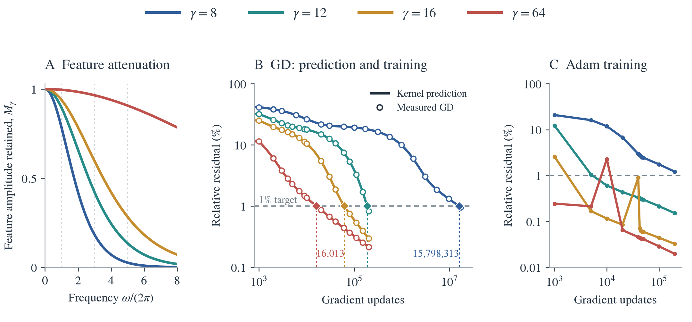

# Gamma controls readout learning speed

[PDF](gamma_optimization_pi_brief.pdf) · [LaTeX source](gamma_optimization_pi_brief.tex)

**A small-gamma network can represent a target and still take far longer to learn it.** Gamma smooths the features, suppressing fine spatial variation. This changes the readout kernel. Once we calculate that kernel, classical gradient-descent theory predicts the learning curve and its crossing of an accuracy threshold.

Freeze the centers $c_j$ and common slope $\gamma>0$, and train only the readout from zero:

$$
f_{\gamma,\theta}(x)=b+\sum_{j=1}^W w_j\tanh(\gamma(x-c_j)).
$$

**Where gamma enters.** Each tanh is a sharp step smoothed over a distance proportional to $1/\gamma$. We show below that this smoothing multiplies frequency $\omega$ by

$$
M_\gamma(\omega)=\frac{z}{\sinh z},\qquad z=\frac{\pi|\omega|}{2\gamma},\qquad M_\gamma(0)=1.
$$

For $|\omega|\gg\gamma$, the multiplier is exponentially small. Applying the smoothing to both factors of a feature inner product gives the gamma-dependent kernel exactly.

**Where the learning-time prediction comes from.** Let $\Phi_\gamma$ be these features, including the bias, evaluated at $m$ training inputs, and set $K_\gamma=\Phi_\gamma\Phi_\gamma^T/m$. For target vector $y\ne0$, half mean squared error, and step $0<\eta_\gamma\le1/\|K_\gamma\|_2$, classical GD theory [1] gives the relative residual

$$
E_\gamma(n)=\frac{\|(I-\eta_\gamma K_\gamma)^ny\|_2}{\|y\|_2}.
$$

The predicted time to 1% error is simply the first $n$ for which this curve falls below $0.01$. This calculation uses the kernel and target, without fitting a training trajectory. The finite center and sample geometry is retained; Fourier frequencies need not be kernel eigenvectors.

<figure>
  
  <figcaption><strong>Same target, different access during optimization.</strong> The target is $\sin(2\pi x)+\tfrac12\sin(6\pi x)+\tfrac14\sin(10\pi x)$, with 559 fixed-center features and 8193 training inputs on $[-1,1]$. <strong>A:</strong> The analytic gamma filter; vertical guides mark the target frequencies. <strong>B:</strong> Lines are kernel predictions; open circles are actual GD checkpoints, subsampled for visibility. Diamonds mark measured first hits of 1%; dotted verticals locate predicted crossings. The predicted and measured crossing counts coincide for all four gammas. <strong>C:</strong> Adam curves join saved checkpoints under identical settings. Dashed horizontals mark 1%. Both optimizers start at zero; GD uses $\eta_\gamma\simeq0.5/\|K_\gamma\|_2$.</figcaption>
</figure>

For this target, gamma 8 takes **15,798,313 GD updates** to reach 1%, versus **16,013** at gamma 64. The predicted delay ratio is **985.70–987.49**; the measured ratio is **986.59**. The approximation bounds certify the threshold crossings shown in B. Both models reach 1%, so this is an optimization delay at attainable accuracy. Adam also shows a substantial separation with the same features (C); its curves are empirical, while the timing formula above applies to GD.

## Proof of the gamma-to-kernel statement

Let $\rho_\gamma(t)=\gamma\operatorname{sech}^2(\gamma t)/2$. This density has unit mass. Splitting at a step's center gives

$$
\int_{\mathbb R}\rho_\gamma(x-t)\operatorname{sign}(t-c)\,dt
=2\int_{-\infty}^{x-c}\rho_\gamma(u)\,du-1
=\tanh(\gamma(x-c)).
$$

Define the step kernel using the same centers,

$$
k_{\rm step}(t,s)=1+\sum_j\operatorname{sign}(t-c_j)\operatorname{sign}(s-c_j).
$$

Taking feature inner products gives

$$
\begin{aligned}
k_\gamma(x,x')&=1+\sum_j\tanh(\gamma(x-c_j))\tanh(\gamma(x'-c_j))\\
&=\iint\rho_\gamma(x-t)\rho_\gamma(x'-s)k_{\rm step}(t,s)\,dt\,ds.
\end{aligned}
$$

The bias is preserved by unit mass. Bounded features justify exchanging the finite sum and integrals. Sampling this identity yields $(K_\gamma)_{i\ell}=k_\gamma(x_i,x_\ell)/m$.

For the Fourier convention $\widehat\rho(\omega)=\int\rho(t)e^{-i\omega t}\,dt$, set $a=\omega/(2\gamma)$ and $v=e^{2\gamma t}$. The beta integral gives

$$
\widehat\rho_\gamma(\omega)
=\int_0^\infty\frac{v^{-ia}}{(1+v)^2}\,dv
=\Gamma(1-ia)\Gamma(1+ia)
=\frac{\pi a}{\sinh(\pi a)}=M_\gamma(\omega).
$$

Here $\Gamma$ is Euler's gamma function. The final equality follows from $\Gamma(1+ia)=ia\Gamma(ia)$ and the reflection identity $\Gamma(ia)\Gamma(1-ia)=\pi/\sin(\pi ia)$; the value at zero is one by continuity. Convolution therefore multiplies the wave $e^{i\omega x}$ by $M_\gamma(\omega)$ in either kernel argument.

For $z>0$, the derivative of $z/\sinh z$ has numerator $\sinh z-z\cosh z<0$: it starts at zero and its derivative is $-z\sinh z<0$. Consequently, a cap $\gamma\le\bar\gamma$ bounds the multiplier by $M_{\bar\gamma}(\omega)$. Also, $\sinh z\sim e^z/2$ gives $M_\gamma(\omega)\sim2ze^{-z}$. This proves the explicit attenuation and its dependence on gamma, with no periodic assumption. $\square$

Writing the residual as $r_n=y-\Phi_\gamma\theta_n$, the standard GD identity follows from $r_{n+1}=(I-\eta_\gamma K_\gamma)r_n$ and $r_0=y$. Diagonalization gives a factor $(1-\eta_\gamma\lambda)^n$ in each eigenmode of eigenvalue $\lambda$. Thus gamma changes the learning rates through the kernel, and the target's energy in those directions determines the delay. The cap bounds attenuation; the numerical delay is specific to the target and geometry.

[1] Y. Yao, L. Rosasco, and A. Caponnetto. [On Early Stopping in Gradient Descent Learning](https://yao-lab.github.io/publications/YaoCapRos07_EarlyStop.pdf). *Constructive Approximation* 26:289–315, 2007, §3.3.

[Full study and additional targets](gamma_optimization_paper_note.pdf) · [Experiment protocol](../results/checkpoint_D_optimizers/expD36_frozen_gamma_probe/full_sweep/REPORT.md) · [Finite-kernel construction and certification](gamma_factorized_readout.md) · [Figure data and provenance](../results/checkpoint_D_optimizers/expD36_frozen_gamma_probe/full_sweep/refinements/gamma_factorized_kernel/pi_brief_figure_data.json)

Reproduce the figure with `python -m experiments.expD36_frozen_gamma_probe.pi_brief_figure`. Compile from the repository root with `latexmk -pdf -outdir=/tmp/gamma-pi-latex docs/gamma_optimization_pi_brief.tex`. No additional training was run. Panel B uses the original capped-campaign trajectories, retained with their metadata in [the evidence bundle](../results/checkpoint_D_optimizers/expD36_frozen_gamma_probe/full_sweep/refinements/capped_kernel/evidence/gd_trajectories). The kernel prediction differs from the 1,796 saved residuals by at most $8.92\times10^{-15}$. Markers select checkpoints nearest 18 equally spaced log-update counts per gamma; no measured residual is interpolated or fitted. Predictions are drawn only through each run's final update. The figure data retain every checkpoint and input hash.
