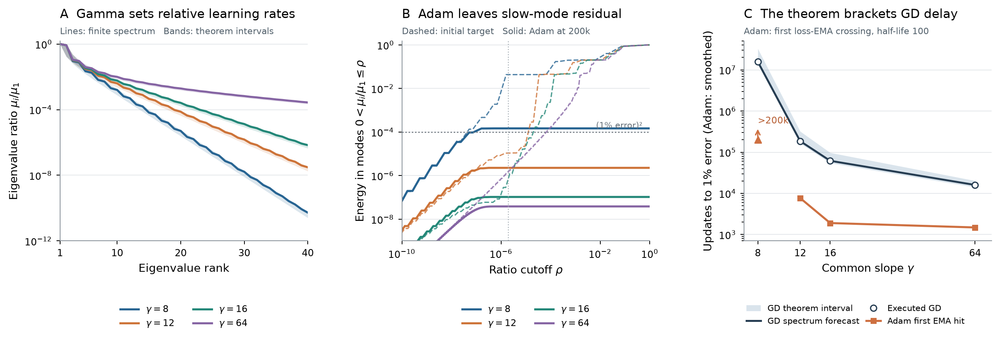
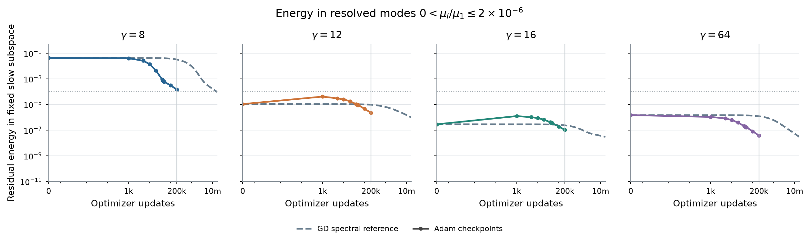
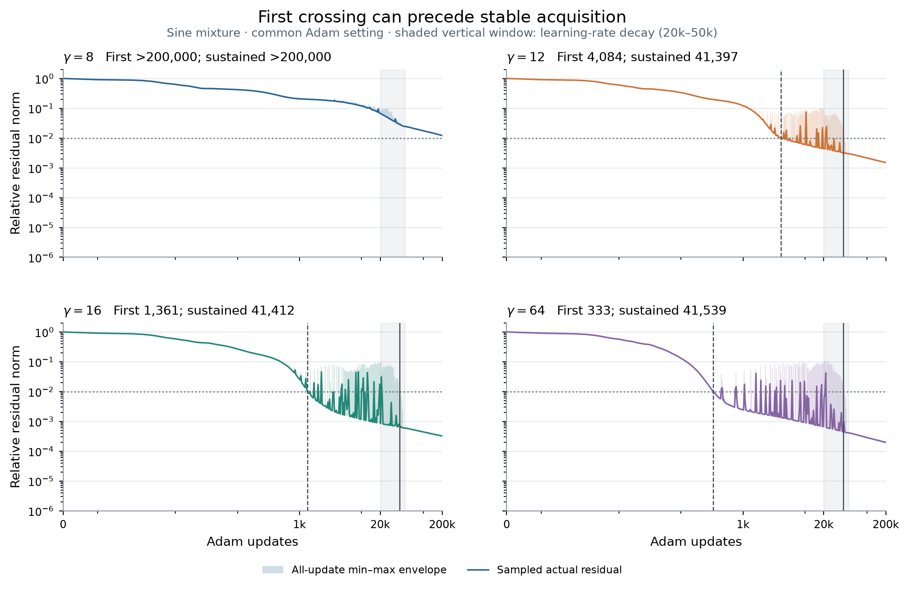
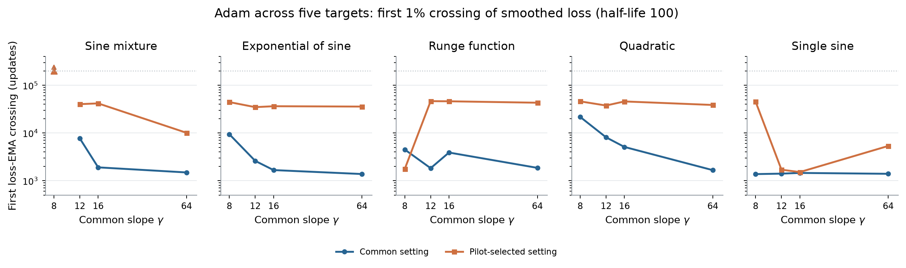

# How gamma changes access to the target under GD and Adam

Small tanh slopes can leave needed target components difficult to acquire under both gradient descent and Adam. On the same finite dictionary, the explicit spectral comparison below certifies rank-32 eigenvalue-ratio increases of approximately 35, 428, and 36,790 times the old ratio when gamma rises from 8 to 12, 16, and 64. At gamma 8, the chosen slow subspace initially holds 4.33% of the target energy. After 200,000 common-recipe Adam updates, its residual energy alone still exceeds the 1% error tolerance. At larger gammas it is below tolerance.

The distinction between rates and optimizer behavior remains essential. The GD spectrum predicts its training curve exactly, up to numerical evaluation. Adam changes the update geometry, so we measure its residual projections. Its sustained crossings at gammas 12, 16, and 64 all occur around 41,000 updates under the common decaying-rate recipe. Thus the spectral mechanism explains an observed small-gamma obstruction, but does not supply an Adam time law or a monotone ordering of sustained Adam times.

| Symbol | Meaning |
|---|---|
| $\gamma,h$ | Common tanh slope and center spacing |
| $J_\gamma,K_\gamma=J_\gamma J_\gamma^T$ | Sample-normalized feature matrix and readout kernel |
| $\mu_i,u_i$ | Descending kernel eigenvalues and orthonormal sample-space eigenvectors |
| $\rho_i=\mu_i/\mu_1$ | A direction's learning rate relative to the fastest direction under normalized-step GD |
| $y,r_n$ | Normalized target sample vector and residual after $n$ updates |
| $p_i=|u_i^Ty|^2/\|y\|^2$ | Fraction of initial target energy in direction $u_i$ |
| $P_\gamma(\rho),R_{\gamma,n}(\rho)$ | Initial and remaining residual energy in positive modes with ratios at most $\rho$ |
| $H,T_{\mathrm{sust}}$ | Recorded Adam horizon and first update below tolerance for the rest of that horizon |

## 1. Why the largest eigenvalue matters

For inputs $x_a$, centers $c_j$, and $m$ samples, use ordinary tanh features and a bias:

$$
J_\gamma[a,j]=\frac{\tanh(\gamma(x_a-c_j))}{\sqrt m},
\qquad J_\gamma[a,0]=\frac1{\sqrt m}.
$$

With normalized targets $y_a=f(x_a)/\sqrt m$, minimizing $\frac12\|J_\gamma w-y\|^2$ is ordinary half mean-squared error. The feature geometry is frozen; only the readout $w$ is trained. From $w_0=0$, GD gives $r_{n+1}=(I-\eta K_\gamma)r_n$. The largest eigenvalue limits the stable step shared by all directions. For $\eta=1/(2\mu_1)$,

$$
\frac{\|r_n\|^2}{\|y\|^2}
=\sum_i p_i(\gamma)\left(1-\frac{\rho_i(\gamma)}2\right)^{2n}.
$$

A ratio of one halves that component's residual every update. A ratio of $10^{-6}$ requires about two million updates for one e-fold reduction. A small ratio matters only if the target needs that direction. Both the eigenvectors and their target weights can change with gamma; ordered rank is not a fixed physical direction across dictionaries. For a prescribed common step instead, the rate is $\eta\mu_i$, and the ratios alone do not determine update counts. The calculations below use the actual archived steps.

## 2. A finite-dictionary theorem with gamma explicit

The following is the cross-gamma comparison from the collaborator's [alternative-view note](gamma_slow_learning_alt_view.pdf), written with $\mu$ for eigenvalues. Centers are consecutive and uniformly spaced; input samples are fixed. Uniform input sampling makes the explicit increment Toeplitz and easy to apply, but the quadratic-form identity itself does not require uniform samples.

Let there be $W$ centers, spacing $h$, and center-cell interval $I=[c_1-h/2,c_W+h/2]$. Define $d_{ab}=x_a-x_b$ and

$$
K^{(0)}_\gamma[a,b]
=\frac{W+1}{m}-\frac{2}{hm}d_{ab}\coth(\gamma d_{ab}),
\qquad E_\gamma=K_\gamma-K^{(0)}_\gamma,
$$

where the continuous diagonal value is $d\coth(\gamma d)=1/\gamma$ at $d=0$. The correction $E_\gamma$ includes the finite center interval and the replacement of a center integral by the actual discrete centers. It is retained, not dropped.

For $\gamma_b>\gamma_a$, set

$$
G_{ba}[a,b]=\frac{2}{hm}
\left[d_{ab}\coth(\gamma_a d_{ab})-d_{ab}\coth(\gamma_b d_{ab})\right].
$$

**Theorem (explicit gamma gain and finite spectral comparison).** The matrix $G_{ba}$ is positive semidefinite, with the following identity for every real sample vector $\nu$:

$$
\nu^TG_{ba}\nu
=\frac{2}{\pi hm}\int_{\mathbb R}
\frac{M_{\gamma_b}(\omega)^2-M_{\gamma_a}(\omega)^2}{\omega^2}
\left|\sum_a\nu_a e^{-i\omega x_a}\right|^2\,d\omega,
\qquad
M_\gamma(\omega)=\frac{z}{\sinh z},\quad z=\frac{\pi|\omega|}{2\gamma}.
$$

Let $U_i$ contain orthonormal eigenvectors for the largest $i$ positive eigenvalues of $K_{\gamma_a}$. Set

$$
C_i=\operatorname{diag}(\mu_1(\gamma_a),\ldots,\mu_i(\gamma_a))+U_i^TG_{ba}U_i,
\qquad
B_i=U_i^T(E_{\gamma_b}-E_{\gamma_a})U_i,
$$

and $\delta_i=\|C_i^{-1/2}B_iC_i^{-1/2}\|_2$. For any $L_b\ge\mu_1(\gamma_b)$,

$$
\boxed{\frac{\mu_i(\gamma_b)}{\mu_1(\gamma_b)}
\ge\frac{[1-\delta_i]_+\,\mu_{\min}(C_i)}{L_b}.}
$$

Here $\mu_{\min}(C_i)$ means the smallest eigenvalue of the displayed small matrix. The computed bound uses the maximum absolute row sum of the actual finite kernel for $L_b$.

The explicit multiplier increases as gamma increases: larger gamma removes less high-frequency content. The theorem carries that gain into an entire trial subspace, then accounts for the finite correction and the normalization by the largest eigenvalue. It does not assert that every finite-dictionary eigenvalue ratio increases. A guaranteed improvement occurs only when the displayed bound exceeds the old ratio. The calculation uses an old eigenspace and small spectral problems; it is not a scalar law depending on gamma alone.

### Proof

Write $g_{ab}(c)=\tanh(\gamma(x_a-c))\tanh(\gamma(x_b-c))$. Direct integration gives

$$
\int_{\mathbb R}(1-g_{ab}(c))\,dc=2d_{ab}\coth(\gamma d_{ab}).
$$

For example, for distinct $a,b$, the identity
$1-\tanh u\tanh v=\coth(u-v)(\tanh u-\tanh v)$ reduces the integral to the difference of two translated tanh profiles. That difference integrates to twice the translation; the coincident limit follows from $\int\operatorname{sech}^2(\gamma c)\,dc=2/\gamma$.

The center integral over $I$ equals $Wh$ minus the whole-line deficit plus the deficit outside $I$. Consequently the normalized center-integral kernel is $K^{(0)}_\gamma$ plus the omitted-exterior correction. Adding the discrete-center quadrature difference gives the exact decomposition $K_\gamma=K^{(0)}_\gamma+E_\gamma$.

The density $s_\gamma(x)=\frac\gamma2\operatorname{sech}^2(\gamma x)$ satisfies $\tanh(\gamma\,\cdot)=s_\gamma*\operatorname{sign}$: differentiating both sides gives $2s_\gamma$, and both vanish at zero. With Fourier convention $\widehat f(\omega)=\int f(x)e^{-i\omega x}\,dx$, substitution $u=e^{2\gamma x}$ and $a=\omega/(2\gamma)$ gives

$$
\widehat s_\gamma(\omega)
=\int_0^\infty\frac{u^{-ia}}{(1+u)^2}\,du
=\Gamma(1-ia)\Gamma(1+ia)
=\frac{\pi a}{\sinh(\pi a)}=M_\gamma(\omega),
$$

using the beta integral and gamma reflection identity, with continuous value one at zero. The difference profile

$$
D(d)=2[d\coth(\gamma_a d)-d\coth(\gamma_b d)]
$$

is integrable. The second derivative of $2d\coth(\gamma d)$ is $4(s_\gamma*s_\gamma)(d)$, as follows by differentiating the deficit integral and integrating once by parts. Therefore
$\widehat {D''}=4(M_{\gamma_a}^2-M_{\gamma_b}^2)$, and

$$
\widehat D(\omega)=\frac{4(M_{\gamma_b}(\omega)^2-M_{\gamma_a}(\omega)^2)}{\omega^2}.
$$

At zero frequency the continuous limit is $\widehat D(0)=\frac{\pi^2}{3}(\gamma_a^{-2}-\gamma_b^{-2})$. Fourier inversion contributes $1/(2\pi)$, giving exactly the prefactor $2/(\pi hm)$ in the quadratic-form identity.

Since the larger-gamma multiplier is at least as large, the transform is nonnegative. Fourier inversion gives the quadratic-form identity and positivity. In particular $C_i$ is positive definite. Compression of the actual new kernel gives $U_i^TK_{\gamma_b}U_i=C_i+B_i$. By the definition of $\delta_i$, this is at least $(1-\delta_i)C_i$ in quadratic-form order. The min-max principle then gives $\mu_i(\gamma_b)\ge(1-\delta_i)\mu_{\min}(C_i)$ when $\delta_i<1$. For $\delta_i\ge1$, positivity of the actual kernel gives the zero lower bound. Finally divide by $\mu_1(\gamma_b)\le L_b$. $\square$

## 3. From needed directions to a GD delay

Define the positive slow energy

$$
P_\gamma(\rho)=\sum_{0<\rho_i(\gamma)\le\rho}p_i(\gamma).
$$

If $P_\gamma(\rho)\ge p>\varepsilon^2$, retaining these terms in the exact GD residual gives

$$
E_\gamma(n)\ge\sqrt p(1-\rho/2)^n,
\qquad
n\ge\left\lceil\frac{\log(\sqrt p/\varepsilon)}{-\log(1-\rho/2)}\right\rceil
$$

as a necessary time to reach relative error $\varepsilon$. For the actual archived step, replace $\rho/2$ by the corresponding per-update rate cutoff. The positive restriction separates slow acquisition from permanent nullspace error. The richer compact-filter calculation in the [structured-kernel note](gamma_structured_kernel_note.md) supplies lower bounds on positive slow energy, with its declared numerical allowances.

This time bound is a separate target-dependent statement. A lower bound on an eigenvalue ratio establishes a rate floor; it does not by itself establish a necessary delay. The full target-weighted spectrum gives the reference forecast, while the compact positive-energy bound gives a conservative necessary time.

## 4. What we measure for Adam

[Adam](https://arxiv.org/abs/1412.6980) rescales readout-coordinate updates and uses gradient history. For residual $r_n=Jw_n-y$, its update is

$$
r_{n+1}=r_n-\alpha_n J D_n\widehat m_n,
\qquad D_n=\operatorname{diag}\bigl((\sqrt{\widehat v_n}+\epsilon_{\rm Adam})^{-1}\bigr).
$$

Thus raw-kernel eigenmodes are diagnostic coordinates, not independent Adam decay modes. Even without momentum, the effective kernel would be the time-dependent $JD_nJ^T$. We do not apply the GD time law to Adam.

Instead, at saved checkpoints measure

$$
R_{\gamma,n}(\rho)=
\sum_{0<\rho_i(\gamma)\le\rho}
\frac{|u_i(\gamma)^Tr_n|^2}{\|y\|^2}.
$$

At initialization this equals $P_\gamma(\rho)$. Comparison at a fixed update count asks whether Adam has removed the target components occupying the GD-slow subspace. A substantial remaining value supports the proposed obstruction for this optimizer and protocol. A small value indicates that Adam acquired those components; that outcome must also be reported.

**Sustained acquisition.** With $H=200{,}000$ and $\varepsilon=0.01$, define

$$
T_{\mathrm{sust}}=\min\{n:E(k)\le\varepsilon\text{ for all }k=n,\ldots,H\}.
$$

If $E(H)>\varepsilon$, acquisition is unobserved within the horizon. Equivalently, for a successful run it is one plus the last update above threshold, with value zero when no update is above threshold. Report the confirmation length $H-T_{\mathrm{sust}}+1$. This definition uses no smoothing and makes no assertion beyond $H$.

## 5. Matched experimental protocol

The primary target is $f(x)=\sin(2\pi x)+\tfrac12\sin(6\pi x)+\tfrac14\sin(10\pi x)$ on $[-1,1]$. The archived geometry uses center spacing $h=1/256$, 559 tanh features plus bias, and 8,193 uniformly spaced training samples. Centers, samples, target, raw readout coordinates, and zero initialization are fixed; slopes are 8, 12, 16, and 64.

The primary Adam recipe uses initial rate $10^{-3}$, additive epsilon $10^{-12}$, and moments $(0.9,0.999)$. Its rate is constant through 20,000 updates, decays by cosine to $10^{-3}$ of its initial value at 50,000 updates, then remains fixed. Runs continue to 200,000 updates. This schedule is a material part of the acquisition result.

The sensitivity comparison reuses the original validation-selected recipes: five initial rates crossed with two epsilons, selected by median validation error at 40,000, 42,500, 45,000, 47,500, and 50,000 updates, with optimizer states continued intact. No new selection uses the present spectral projections. All plots concern training-grid optimization; separate validation data selected the sensitivity recipes. This study makes no new held-out generalization claim.

Supporting targets are $\exp(\sin(3\pi x))$, $1/(1+25x^2)$, $\sqrt5\,x^2$, and $\sqrt2\sin(2\pi x)$. They are analyzed without selecting targets or checkpoints for agreement with the hypothesis. These target scalings are retained because Adam's additive epsilon makes scaling part of the protocol. The saved SVD cutoff is numerical, not an exact-rank statement. Omitted energy is reported separately as unresolved; it is not automatically classified as nullspace.

## 6. What the matched measurements show

<figure>
  
  <figcaption><strong>Gamma, needed directions, and acquisition.</strong> A: actual finite-kernel ratios and numerical evaluations of the cross-gamma theorem, referenced to gamma 8. B: initial target energy and remaining common-recipe Adam residual energy after 200,000 updates, accumulated over resolved positive eigenmodes. The horizontal energy level $10^{-4}$ corresponds to 1% relative error. C: executed GD crossings, full-spectrum GD forecasts, compact necessary GD times, and sustained Adam acquisition through 200,000 updates. GD has longer executed trajectories; the Adam arrow denotes censoring at its own budget. The target and geometry are identical across panels. The spectral and timing bounds are different statements, and no theoretical time curve is asserted for Adam.</figcaption>
</figure>

### The spectral theorem is informative, with measurable slack

At rank 32, the old ratio is $5.2174\times10^{-9}$. The bounds at gammas 12, 16, and 64 are $1.8172\times10^{-7}$, $2.2340\times10^{-6}$, and $1.9195\times10^{-4}$. They retain approximately 26%, 30%, and 35% of the actual new ratios. The bound is therefore within a factor of four at this prescribed rank while exposing a large explicit gamma effect. Rank 64 is less tight: the bounds retain only 5.3%, 5.7%, and 8.0% of the corresponding actual ratios. The gamma-8 baseline rank-64 bound is numerically unresolved and is labeled accordingly. We do not select ranks after seeing their tightness.

### The slow subspace explains the remaining gamma-8 error

For the illustrative ratio cutoff $\rho=2\times10^{-6}$, gamma 8 has initial positive slow energy $0.0433333$. After 200,000 common-recipe Adam updates, its remaining energy is $1.4709443\times10^{-4}$, which alone exceeds the $10^{-4}$ energy budget for 1% relative error. The total relative error is 0.0121283; 99.9998% of that residual energy lies in the displayed slow band. Adam has removed about 99.66% of the band's initial energy, but the remaining part still prevents acquisition.

The same cutoff gives final slow residual energies $2.2660\times10^{-6}$, $1.0437\times10^{-7}$, and $3.8307\times10^{-8}$ at gammas 12, 16, and 64. These are below the tolerance. The cutoff is a descriptive probe inherited from the earlier $\eta\mu\le10^{-6}$ analysis under $\eta\mu_1\simeq1/2$; the main cumulative curves expose the full cutoff dependence rather than relying on this one choice. Across gammas the subspaces have the same spectral definition, not the same eigenvectors.

The initial slow energy is not monotone: it is $2.85\times10^{-7}$ at gamma 16 and $1.48\times10^{-6}$ at gamma 64. Adam can also increase a diagnostic subspace's residual energy: at 20,000 updates the gamma-12 and gamma-16 slow energies exceed their initial values. These are projected residuals, not an assertion that every remaining component is untouched initial target content.

<figure>
  
  <figcaption><strong>Evolution within the slow band.</strong> The ratio cutoff is fixed at $2\times10^{-6}$ for every gamma. GD curves follow its target-weighted spectrum; Adam values are actual saved readout checkpoints projected onto the corresponding finite-kernel modes. All energies use the original target norm. Lines between Adam checkpoints do not determine its exact acquisition time; that time comes from every-update traces.</figcaption>
</figure>

### Sustained acquisition reveals the optimizer schedule

Common-recipe Adam first crosses 1% at 4,084, 1,361, and 333 updates for gammas 12, 16, and 64. Its sustained crossings are 41,397, 41,412, and 41,539. The intervening oscillations and the scheduled rate decay prevent us from interpreting the first crossings as settled acquisition. Gamma 8 never crosses within 200,000 updates. Its validation-selected recipe also does not cross; the selected gamma-64 recipe reaches sustained acquisition at 9,917 updates. Recipe sensitivity is therefore material.

In contrast, executed GD reaches 1% at 15,798,313, 186,057, 61,792, and 16,013 updates. Its compact necessary times are 5,072,048, 130,057, 29,640, and 5,421 updates. The full constructed-spectrum forecast agrees with the executed crossings; the conservative lower bounds retain about 32%, 70%, 48%, and 34% of the observed delay. Those time bounds do not follow by substituting the ratio lower bounds from panel A.

<figure>
  
  <figcaption><strong>First crossing is not sustained acquisition.</strong> Actual per-update errors are summarized by explicitly labeled minima and maxima within update bins, without EMA smoothing. The schedule is the archived common Adam recipe. First and sustained crossings are recomputed from every update, not from these visual summaries. The schedule explains why substantially different first crossings can coexist with similar sustained crossings.</figcaption>
</figure>

The five-target sensitivity study also prevents a universal claim. In the selected Runge runs at gammas 12 and 16, the first 1% crossing is update 122, but the last recrossings postpone sustained acquisition to 199,808 and 199,710. Those observations have only 193 and 291 confirming states through the endpoint. The common-recipe single-sine target also does not have monotonically improving final error with gamma. These exceptions are retained.

<figure>
  
  <figcaption><strong>Target and recipe sensitivity.</strong> Every archived target is included, with the same horizon-qualified acquisition definition. The selected recipes were chosen by the original late-window validation error, not by fastest acquisition or by agreement with the present kernel argument. Arrows denote non-acquisition within 200,000 updates.</figcaption>
</figure>

## 7. Numerical verification and reproduction

The Adam analysis covers 40 cases and 12 saved checkpoints per case. Direct reconstruction of each feature matrix matches its archived hash. All 480 checkpoint residual norms agree with the saved measurements within $9.14\times10^{-16}$. The most negative total-minus-projected energy is $-2.89\times10^{-15}$, consistent with floating-point subtraction; this signed discrepancy is retained in the data. The omitted-SVD contribution is separately monitored and is not labeled irreducible error.

A fresh read-only audit of the persistent archive processed 400 trace chunks and all updates 0 through 200,000 for the 40 selected series. First crossing, last-above, and sustained crossing agree exactly with both remote and local archived arrays at all six recorded tolerances. Remote metadata and local compact-manifest hashes agree. This audit used one CPU for 30 seconds and no GPU. Only the requested scalar errors were retrieved; the old experiment data was unchanged.

The explicit Toeplitz increment agrees with independently computed direct rows within $5\times10^{-16}$. The small-matrix calculation checks positivity resolution, old trial-space gaps, relative correction conditioning, and two whitening formulations. These are floating-point verification checks, not outward-rounded interval certificates for the newly evaluated ratio bounds. The implemented $C_i$ uses $U_i^TK_{\gamma_a}U_i$ in place of its algebraically equivalent eigenvalue diagonal to preserve the measured trial-space identity.

A separate fresh rectangular SVD and direct sample-space residual projection reproduce the band energies across all 480 checkpoint/target/view cases at seven ratio cutoffs. The largest absolute band-energy discrepancy is $5.02\times10^{-14}$; total-energy closure differs by at most $5.33\times10^{-14}$. At the displayed cutoff, common-recipe band-energy discrepancies are below $3.54\times10^{-16}$. The fresh SVD retains three extra numerical-tail modes at gamma 16 and one at gamma 64 relative to the stored cutoff; these negligible-energy differences are recorded rather than interpreted as exact-rank changes. At gamma 8, the final slow residual also exceeds tolerance at cutoff $2\times10^{-7}$, with energy $1.45561\times10^{-4}$.

All 13 new focused tests pass. The full non-slow suite reports 823 passed, 17 failed, 9 skipped, and 4 deselected. The 17 failure identifiers exactly match the pre-existing baseline; no new test failure was introduced.

The evidence lives in [gamma_optimizer_access](../results/checkpoint_D_optimizers/expD36_frozen_gamma_probe/full_sweep/refinements/gamma_optimizer_access/). Source hashes, exact array conventions, unresolved statuses, retained ranks, and every plotted quantity accompany the figures. The full scalar traces remain in the persistent archive; compact trace envelopes and the independent audit are retained with this study. Reproduce the local computations from the repository root with one BLAS thread:

```bash
export OPENBLAS_NUM_THREADS=1 VECLIB_MAXIMUM_THREADS=1
python -m experiments.expD36_frozen_gamma_probe.gamma_ratio_bound
python -m experiments.expD36_frozen_gamma_probe.adam_spectral_analysis
python -m experiments.expD36_frozen_gamma_probe.adam_projection_audit
python -m experiments.expD36_frozen_gamma_probe.optimizer_access_figure
latexmk -pdf -outdir=/tmp/gamma-optimizer-latex docs/gamma_optimizer_access_note.tex
```

The optional archive audit is implemented separately in `adam_trace_audit.py`; its `extract` command reads the persistent run directory, and its `verify` command compares the resulting scalar archive with the local compact evidence. No least-squares refit, spectral solve, or detached diagnostic changes a trained readout. No new training was performed.
