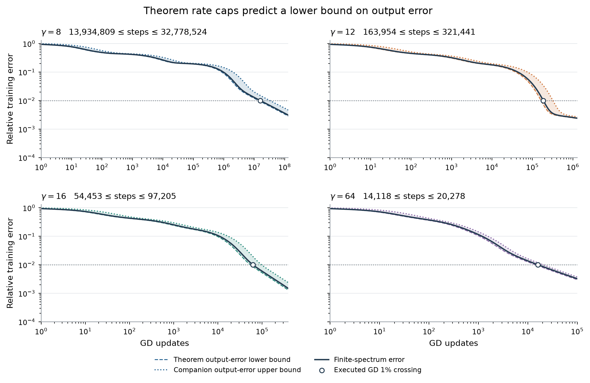

# How gamma controls readout learning

**An attainable target can be slow to learn because the needed kernel eigenvalues are small relative to the largest one.** Gamma controls these relative rates through an explicit smoothing operator. Our theorem bounds how much output error must remain after any number of frozen-feature GD updates. Its prediction substitutes gamma-dependent upper bounds on the learning rates into the GD error formula. The argument specializes the [V4 ratio theorem](gamma_ratio_note_v4.pdf), on the same geometry as our executed GD and Adam experiments.

**Notation.** Eigenvalues use $\mu$; all norms are Euclidean.

| Symbol | Meaning |
|---|---|
| $J_\gamma$, $K_\gamma=J_\gamma J_\gamma^T$ | Normalized feature matrix and readout kernel |
| $\mu_i,u_i$; $\rho_i=\mu_i/\mu_1$ | Descending finite-kernel eigenpairs; relative learning rates |
| $y,r_n$; $p_i=|u_i^Ty|^2/\|y\|^2$ | Target, residual; target energy in eigenvector $i$ |

## 1. The rate that matters is relative to the largest eigenvalue

Freeze $W$ equally spaced centers $c_j$, spacing $h$, and a common slope $\gamma$. On $m$ input samples $x_a$, train the readout $w$ from zero:

$$
J_\gamma[a,j]=\frac{\tanh(\gamma(x_a-c_j))}{\sqrt m},\qquad
J_\gamma[a,0]=\frac1{\sqrt m},\qquad y_a=\frac{f(x_a)}{\sqrt m}.
$$

For loss $\frac12\|J_\gamma w-y\|^2$, GD gives $r_{n+1}=(I-\eta K_\gamma)r_n$. The largest eigenvalue limits the stable shared step: $0<\eta<2/\mu_1$. At $\eta=1/(2\mu_1)$, the exact relative error is

$$
e(n)^2:=\frac{\|r_n\|^2}{\|y\|^2}
=\sum_i p_i(\gamma)(1-\rho_i(\gamma)/2)^{2n}.
$$

A ratio of $10^{-6}$ needs about two million updates for one e-fold reduction of that component. The target weights determine which rates matter. A positive eigenvalue describes a representable component, however slow its decay; a zero eigenvalue contributes a fixed error floor.

## 2. Gamma enters the spectrum through smoothing

A tanh is a smoothed step: $\tanh(\gamma\,\cdot)=s_\gamma*\operatorname{sign}$, where $s_\gamma(x)=\frac\gamma2\operatorname{sech}^2(\gamma x)$. The Fourier multiplier is

$$
M_\gamma(\omega)=\frac{z}{\sinh z},\qquad z=\frac{\pi|\omega|}{2\gamma},\qquad M_\gamma(0)=1.
$$

Small gamma suppresses rapid variation. To translate this into eigenvalues, first average over continuous centers. Let $Q$ have orthonormal columns spanning zero-mean sample patterns: $Q^TQ=I$, $Q^T\mathbf1=0$. Removing the constant direction makes the whole-line center integral finite. With $t_\gamma(c)=(\tanh(\gamma(x_a-c)))_a$,

$$
H_\gamma=\frac1{hm}\int_{\mathbb R}Q^Tt_\gamma(c)t_\gamma(c)^TQ\,dc
=-\frac2{hm}Q^T[d_{ab}\coth(\gamma d_{ab})]_{a,b}Q,
\qquad d_{ab}=x_a-x_b.
$$

For any $v$, its response is

$$
\boxed{v^TH_\gamma v=\frac2{\pi hm}\int_{\mathbb R}
\frac{M_\gamma(\omega)^2}{\omega^2}
\left|\sum_a(Qv)_a e^{-i\omega x_a}\right|^2\,d\omega.}
$$

**Every term is nonnegative, and increasing gamma increases the multiplier.** Thus $H_\Gamma\succeq H_\gamma$ for $\Gamma\ge\gamma$, so every ordered eigenvalue of this integral matrix increases. The statement allows its eigenvectors to change. Gamma's influence is explicit before any spectral calculation.

The actual centers form a finite lattice. Subtract the outer products of a retained set $\mathcal F$ of absent exterior centers:

$$
T_\gamma=\frac1m\sum_{c\in\mathcal F}Q^Tt_\gamma(c)t_\gamma(c)^TQ,
\qquad S_\gamma=H_\gamma-T_\gamma.
$$

Appendix A bounds the entire lattice-versus-integral discrepancy by $\delta_\gamma$ and the remaining exterior-center tail by $\tau_\gamma$. This gives

$$
S_\gamma-(\delta_\gamma+\tau_\gamma)I
\preceq Q^TK_\gamma Q\preceq S_\gamma+\delta_\gamma I.
$$

These allowances follow from analytic tails, rather than measured differences from the actual small eigenvalues.

**Lemma (finite eigenvalue-ratio interval).** Let $\beta_1\ge\cdots\ge\beta_{m-1}$ be the eigenvalues of $S_\gamma$, and let $0<\ell_\gamma\le\mu_1(K_\gamma)\le L_\gamma$. For $2\le i\le m-1$,

$$
\boxed{
\underbrace{\frac{[\beta_i-\delta_\gamma-\tau_\gamma]_+}{L_\gamma}}_{\underline\rho_i}
\ \le\ \frac{\mu_i(K_\gamma)}{\mu_1(K_\gamma)}
\ \le\ \underbrace{\min\!\left\{1,\frac{\beta_{i-1}+\delta_\gamma}{\ell_\gamma}\right\}}_{\overline\rho_i}.}
$$

Here $[a]_+=\max(a,0)$. Set both endpoints to one for $i=1$; for $i=m$ use lower endpoint zero and upper endpoint $\min\{1,(\beta_{m-1}+\delta_\gamma)/\ell_\gamma\}$. Known exact zero eigenvalues can have both endpoints zero.

The one-index shift accounts for the constant direction removed by $Q$; actual eigenvectors need not have zero mean. All quantities use the current gamma and geometry. Computing the spectrum of $S_\gamma$ is part of the calculation. Finite corrections and normalization can prevent individual finite ratios from increasing, even though the integral contribution increases.

## 3. The theorem predicts remaining output error

**Theorem (frozen-feature GD output-error lower bound).** Under the frozen-feature setup above, let $y\ne0$, initialize $w_0=0$, and use $\eta=1/(2\mu_1(K_\gamma))$. With the upper rate bounds $\overline\rho_i(\gamma)$ from the lemma and actual target weights $p_i(\gamma)=|u_i(\gamma)^Ty|^2/\|y\|^2$, every integer $n\ge0$ satisfies

$$
\boxed{\frac{\|J_\gamma w_n-y\|^2}{\|y\|^2}
\ \ge\ \underbrace{\sum_i p_i(\gamma)
\left(1-\frac{\overline\rho_i(\gamma)}2\right)^{2n}}_{e_{\rm lower}(n)^2}.}
$$

The prediction uses the lemma's $\overline\rho_i$, constructed from $S_\gamma$ and its allowances. Substituting the actual $\rho_i$ instead gives the separate exact-spectrum reference curve. Target weights come from the actual finite-feature SVD; substituting integral-kernel eigenvectors would require another argument. Neither calculation uses a GD trajectory.

**Proof.** Expand the residual in the actual kernel eigenvectors. Since $\rho_i\le\overline\rho_i\le1$, each exact decay factor is at least its bounded counterpart. Multiply by $p_i\ge0$ and sum. Thus target energy in directions with small bounded rates must persist. $\square$

**Necessary time.** Define $n_{\rm necessary}=\min\{n:e_{\rm lower}(n)\le\varepsilon\}$. The actual $\varepsilon$-crossing cannot precede this count. Appendix A also derives an upper error curve and a sufficient time from the lower rate endpoints.

**Same-geometry validation.** We use $W=559$, $h=1/256$, $m=8{,}193$ uniform samples on $[-1,1]$, and $f(x)=\sin(2\pi x)+\frac12\sin(6\pi x)+\frac14\sin(10\pi x)$. At gammas 8, 12, 16, and 64, executed GD reaches 1% after **15,798,313; 186,057; 61,792; and 16,013 updates**. The actual-spectrum formula reproduces these crossings. Figure 1 compares them with the recomputed theorem intervals; Appendix B shows the error curves that produce the interval endpoints. All forecasts use the archived step, replacing $\rho_i/2$ by $\eta\mu_1\rho_i$.

The theorem's lower error curves first reach 1% at **13,934,809; 163,954; 54,453; and 14,118 updates**, respectively. These necessary counts retain **88.1-88.2%** of the observed delay. The companion sufficient bounds range from **2.07 times** the observed count at gamma 8 to **1.27 times** at gamma 64. These are checked FP64 evaluations, with numerical allowances described below.

**Adam is an empirical comparison.** At gamma 8, modes with $0<\rho_i\le2\times10^{-6}$ initially contain **4.33%** of target energy and retain **$1.47094\times10^{-4}$** after 200,000 Adam updates. That residual alone exceeds the $10^{-4}$ squared-error budget for 1% accuracy. Corresponding band energies at larger gammas are below budget. Adam's adaptive updates do not obey the GD decay law.

With one shared 100-update half-life, first crossings of an EMA of squared relative error occur at **7,688; 1,900; and 1,486** for gammas 12, 16, and 64; gamma 8 never crosses within 200,000 updates. These crossings can recur. The EMA's initial-loss memory sets a **1,329-update** floor, compressing differences between fast runs.

<figure>
  
  <figcaption><strong>Figure 1. Gamma, needed directions, and acquisition.</strong> A: actual eigenvalue ratios and lemma enclosures at the four slopes. B: cumulative initial target energy (dashed) and Adam residual energy after 200,000 updates (solid); the blue residual exceeds the 1% budget in slow modes alone. C: the dashed theorem curve marks first crossings of the output-error lower bound; the shaded interval extends to the companion sufficient time. The solid forecast uses actual eigenvalues; circles mark executed GD. Adam markers show first EMA acquisition; its arrow marks censoring at 200,000. GD has a longer budget. All panels use the same target and geometry. Bounds are checked FP64 evaluations.</figcaption>
</figure>

## Appendix A. Construction and full proof

**Integral and smoothing.** Write $d=x_a-x_b$. The identity $1-\tanh u\tanh v=\coth(u-v)(\tanh u-\tanh v)$ gives

$$
\int_{\mathbb R}[1-\tanh(\gamma(x_a-c))\tanh(\gamma(x_b-c))]\,dc
=2d\coth(\gamma d),
$$

with limit $2/\gamma$ at $d=0$. For $u\perp\mathbf1$, summing against $u_au_b$ cancels the constant term and proves the displayed formula for $H_\gamma$.

The functions $s_\gamma*\operatorname{sign}$ and $\tanh(\gamma\,\cdot)$ both vanish at zero and have derivative $2s_\gamma$. With transform convention $\widehat f(\omega)=\int f(x)e^{-i\omega x}\,dx$, substitution $z=e^{2\gamma x}$, $a=\omega/(2\gamma)$, gives

$$
\widehat s_\gamma(\omega)=\int_0^\infty\frac{z^{-ia}}{(1+z)^2}\,dz
=\Gamma(1-ia)\Gamma(1+ia)=\frac{\pi a}{\sinh(\pi a)}=M_\gamma(\omega).
$$

The beta integral and gamma-function reflection identity give the middle equalities. For $u=Qv$, $g_{\rm step}(c)=\sum_a u_a\operatorname{sign}(c-x_a)$ is compactly supported and its derivative is $2\sum_a u_a\delta_{x_a}$. Hence $\widehat g_{\rm step}=2\sum_a u_a e^{-i\omega x_a}/(i\omega)$ and $\widehat g_\gamma=M_\gamma\widehat g_{\rm step}$. Parseval proves the Fourier identity, including its prefactor. The numerator vanishes at zero because $\sum_a u_a=0$. Since $d\log(z/\sinh z)/dz=1/z-\coth z<0$, increasing gamma increases $M_\gamma$. Quadratic-form order and the min-max principle prove ordered growth of the integral eigenvalues.

**Lattice allowance.** Let the full center lattice be $c_0+h\mathbb Z$. We retain no explicit Fourier aliases; this is the $p=0$ case of V4. Choose $0<\vartheta<\pi/2$, write $\bar x=m^{-1}\sum_a x_a$, and put

$$
\delta_\gamma=
\frac{8\gamma\|x-\bar x\mathbf1\|^2\sec^4\vartheta}
{3hm[\exp(2\pi\vartheta/(\gamma h))-1]}.
$$

For $u\perp\mathbf1$, set $g(z)=\sum_a u_a\tanh(\gamma(z-x_a))$. Subtract the common translate at $\bar x$, express each difference as an integral of its derivative, and apply Minkowski and Cauchy-Schwarz. On the strip boundaries $\operatorname{Im}z=\pm\vartheta/\gamma$ this yields

$$
\int_{\mathbb R}|g(t\pm i\vartheta/\gamma)|^2\,dt
\le\frac{4\gamma}{3}\sec^4\vartheta\,
\|x-\bar x\mathbf1\|^2\|u\|^2.
$$

Here $|\operatorname{sech}^2(t+i\vartheta)|\le\sec^2\vartheta\operatorname{sech}^2t$ and $\int\operatorname{sech}^4t\,dt=4/3$. Shift the contour for the analytic function $g(z)^2$, bounding its absolute integral by the displayed inequality. Its Fourier transform decays as $\exp(-\vartheta|\omega|/\gamma)$. Poisson summation at frequencies $2\pi k/h$ and the geometric sum over both signs give the norm bound $\delta_\gamma$ for the infinite-lattice minus integral matrix.

**Exterior allowance.** Let $\mathcal F$ contain a finite set of missing lattice centers, including any inside the sample range. Suppose the remaining right and left tails start at $c_R>x_{\max}$ and $c_L<x_{\min}$. Then

$$
\tau_\gamma=
\frac{4[e^{-4\gamma(c_R-x_{\max})}+e^{-4\gamma(x_{\min}-c_L)}]}
{1-e^{-4\gamma h}}.
$$

Because $Q^T\mathbf1=0$ and $1-\tanh t\le2e^{-2t}$ for $t\ge0$, a right-tail projected outer product divided by $m$ has norm at most $4e^{-4\gamma(c-x_{\max})}$. The left side is analogous. Summing the geometric tails gives $0\preceq T_{\rm tail}\preceq\tau_\gamma I$. The finite kernel equals the infinite lattice minus all absent centers, so

$$
Q^TK_\gamma Q=S_\gamma+R_{\rm lattice}-T_{\rm tail},
\qquad \|R_{\rm lattice}\|\le\delta_\gamma.
$$

This proves the two-sided matrix enclosure. The bias vanishes under $Q$.

**Eigenvalues and normalization.** If $\kappa_i$ are the descending eigenvalues of $Q^TK_\gamma Q$, the enclosure gives $\beta_i-\delta_\gamma-\tau_\gamma\le\kappa_i\le\beta_i+\delta_\gamma$. Interlacing gives $\mu_i\ge\kappa_i\ge\mu_{i+1}$, proving the numerator endpoints. Divide lower numerators by $L_\gamma$ and upper numerators by $\ell_\gamma$ to obtain the lemma.

For the normalization used in the calculation, let $e=\mathbf1/\sqrt m$ and define

$$
\ell_\gamma=\|J_\gamma^Te\|^2,\qquad
b=\|(I-ee^T)J_\gamma(J_\gamma^Te)\|,\qquad c=\beta_1+\delta_\gamma,
$$

$$
L_\gamma=\frac{\ell_\gamma+c+\sqrt{(\ell_\gamma-c)^2+4b^2}}2.
$$

The first is a Rayleigh lower bound. In the basis $[e,Q]$, the remaining block is bounded by $cI$ and the coupling has norm $b$, so the largest eigenvalue is at most that of the displayed two-by-two scalar comparison. Numerical upper allowances are also included in $c$. These quantities use feature matrix-vector products and the corrected integral spectrum, without the actual small eigenvalues.

**GD error and times.** Expanding the zero-initialized residual in the actual eigenvectors gives the error formula. Monotonicity in each ratio proves the output-error lower bound. Using the lower rate endpoints analogously gives the companion upper bound:

$$
e_{\rm lower}(n)^2\le e(n)^2\le
\underbrace{\sum_i p_i(1-\underline\rho_i/2)^{2n}}_{e_{\rm upper}(n)^2},
\qquad n_{\rm necessary}\le n_\varepsilon\le n_{\rm sufficient}.
$$

The error curves decrease with update count, so their first crossings bracket the true crossing; an empty crossing set means $+\infty$. For a general nonoscillatory step, replace $\rho/2$ by $\eta\mu_1\rho$ with $0<\eta\mu_1\le1$. A positive mode is representable because $u_i=J_\gamma(J_\gamma^Tu_i/\mu_i)$. Thus target energy in slow positive modes describes optimization delay separately from nullspace capacity. $\square$

## Appendix B. Numerical bounds and optimizer checks

**Evaluation.** The positive center integral is evaluated by Gauss-Legendre feature quadrature, followed by subtraction of the retained exterior-center outer products. The numerical construction uses a shared low-rank feature basis rather than forming an $m\times m$ kernel. If $Z=[A,C]$ contains the integral and exterior factors, truncating it after singular value $\sigma_r$ changes $Z\operatorname{diag}(I,-I)Z^T$ by at most $2\sigma_1\sigma_{r+1}+\sigma_{r+1}^2$ in norm; this allowance is included on both sides. Pad the restricted spectrum to dimension $m-1$, placing zeros between positive and negative reduced eigenvalues.

Truncating the whole-line integral at $\pm(\max_a|x_a|+P/\gamma)$ omits a positive matrix of norm at most $2e^{-4P}/(h\gamma)$, included on the upper side. The remaining exterior tail contributes on the lower side. Quadrature refinement and FP64 sensitivity are checked separately from these analytic allowances. Reported numerical intervals are not directed-rounding certificates.

Use order-10 quadrature on center panels of width at most $1/\gamma$, $P=20$, $\vartheta=\arctan(\pi/(2\gamma h))$, and $\lceil18/(\gamma h)\rceil$ retained exterior centers per side. The feature-factor cutoff is $10^{-14}$ relative to its largest singular value. An empirical arithmetic allowance $64\epsilon_{64}\|S_{\rm reduced}\|$ is added on both sides. Refining to order 16 and $P=24$ preserves every integer time endpoint; spectrum changes are below the combined compression and arithmetic allowances. All resolved ratios and sampled error curves remain enclosed. The analytic lattice allowance ranges from $4.37\times10^{-126}$ at gamma 8 to $9.02\times10^{-9}$ at gamma 64, in absolute kernel units.

Actual finite-feature SVD supplies the target weights and comparison spectrum. Ratios at most $10^{-18}$ are treated as numerically unresolved: their energy is retained in the upper error curve and omitted only from the lower curve. It is tracked separately from the directly computed projection residual. Powers use `log1p`; integer crossings use bracketing and binary search. No GD or Adam training is rerun.

<figure>
  
  <figcaption><strong>Figure B1. The theorem predicts remaining output error.</strong> The dashed lower bound substitutes the lemma's upper rate endpoints into the GD formula; its 1% crossing gives the necessary time. The dotted companion upper bound uses lower rate endpoints. The solid reference uses actual eigenvalues, and the marked crossing comes from executed GD. All curves retain the same actual target weights, with unresolved energy handled conservatively.</figcaption>
</figure>

**Adam protocol.** The common setting uses initial rate $10^{-3}$, epsilon $10^{-12}$, and moments $(0.9,0.999)$. The rate is fixed through 20,000 updates, decays by cosine to $10^{-6}$ at 50,000, then remains fixed through 200,000. Define $M_0=1$, $M_n=\beta M_{n-1}+(1-\beta)e(n)^2$, $\beta=2^{-1/100}$. First EMA acquisition is the first $M_n\le10^{-4}$, computed from every update. Since $M_n\ge\beta^n$, no crossing occurs before 1,329 updates. Later upcrossings occur 73, 97, and 98 times at gammas 12, 16, and 64; sustained raw crossings occur around 41,000.

<figure>
  
  <figcaption><strong>Figure B2. Adam's measured acquisition.</strong> Bands show raw-error minima and maxima within update bins; curves show the square root of the loss EMA. Dashed vertical lines mark first crossings; gray windows mark rate decay. Display sampling does not affect the every-update crossing calculation.</figcaption>
</figure>

The common-setting ordering persists at EMA half-lives 30, 100, and 300, but changes at longer windows and for validation-selected settings. The archived [five-target comparison](../results/checkpoint_D_optimizers/expD36_frozen_gamma_probe/full_sweep/refinements/gamma_optimizer_access/optimizer_access_targets.pdf) and [window sensitivity](../results/checkpoint_D_optimizers/expD36_frozen_gamma_probe/full_sweep/refinements/gamma_optimizer_access/optimizer_access_ema_sensitivity.pdf) show this dependence. Adam projections measure current error and can increase during training; they are diagnostics, not a GD rate law.

**Reproduction.** The [ratio calculation](../experiments/expD36_frozen_gamma_probe/direct_ratio_interval.py) and its [evidence directory](../results/checkpoint_D_optimizers/expD36_frozen_gamma_probe/full_sweep/refinements/gamma_direct_ratio/) record geometry, analytic and numerical allowances, refinement checks, source hashes, and crossings. [Optimizer evidence](../results/checkpoint_D_optimizers/expD36_frozen_gamma_probe/full_sweep/refinements/gamma_optimizer_access/) retains the trajectories' modal projections and EMA measurements. All results concern training-grid optimization with frozen features.
