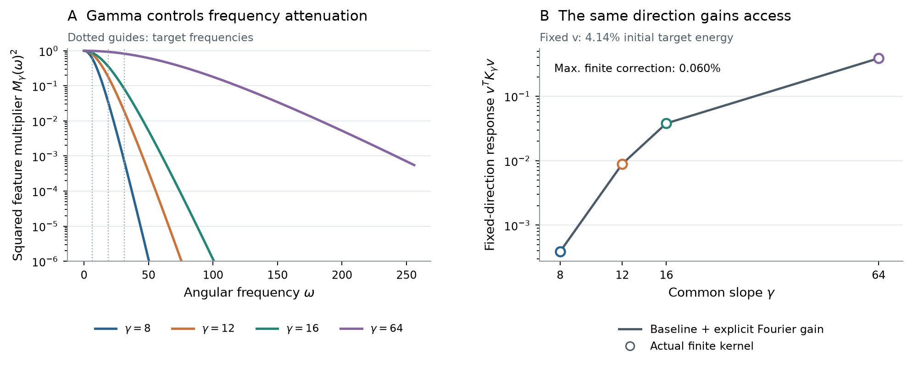
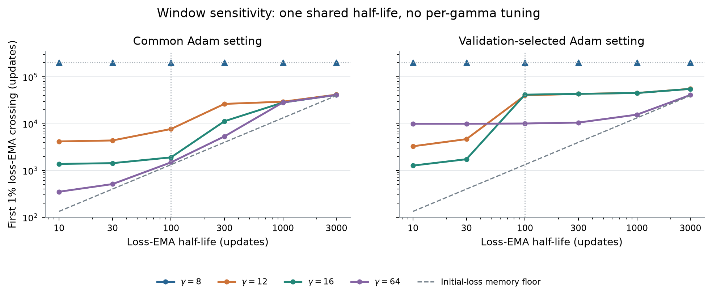

# How gamma controls access to a target during readout training

Small slopes can make an attainable target expensive to learn. In our frozen-feature tanh model, the same target reaches 1% relative error after **15.8 million GD updates at gamma 8**, compared with **16,013 updates at gamma 64**. Adam also struggles at gamma 8: its error remains above 1% after 200,000 updates. The centers, target, readout coordinates, and zero initialization are held fixed.

The explanation has three parts. Gamma determines how strongly each feature smooths rapid variation. This changes the kernel's response to patterns in the target, and the measured target-weighted spectrum reveals their relative learning rates. Classical GD dynamics then predict the observed delay; Adam provides an empirical test of how the difficulty persists under adaptive updates. We follow this chain on one representative target and then check sensitivity to other targets and optimizer settings.

**Notation.** Eigenvalues are denoted by $\mu$ throughout.

| Symbol | Meaning |
|---|---|
| $\gamma$ | Common slope of the frozen tanh features |
| $J_\gamma$, $K_\gamma=J_\gamma J_\gamma^T$ | Sample-normalized feature matrix and readout kernel |
| $y$, $r_n$, $e(n)=\|r_n\|/\|y\|$ | Target samples, training residual, and relative error |
| $\mu_i$, $u_i$, $\rho_i=\mu_i/\mu_1$ | Eigenvalues, unit eigenvectors, and relative eigenvalues |
| $p_i=|u_i^Ty|^2/\|y\|^2$ | Fraction of target energy in an eigenvector |
| $q_\gamma(v)=v^TK_\gamma v$ | Kernel response to a fixed unit sample pattern $v$ |

## 1. The target is attainable; the question is how quickly

The readout model is

$$
\widehat f(x)=w_0+\sum_{j=1}^{W}w_j\tanh\!\left(\gamma(x-c_j)\right).
$$

Only the coefficients $w_j$ are trained. The centers $c_j$ and common slope $\gamma$ are fixed during each run. We compare $\gamma\in\{8,12,16,64\}$ on the same uniformly spaced centers and samples. The primary target is

$$
f(x)=\sin(2\pi x)+\tfrac12\sin(6\pi x)+\tfrac14\sin(10\pi x),\qquad x\in[-1,1].
$$

There are 559 tanh features plus a bias, center spacing $h=1/256$, and $m=8{,}193$ training samples. Normalize the feature entries and target by $\sqrt m$:

$$
J_\gamma[a,j]=\frac{\tanh(\gamma(x_a-c_j))}{\sqrt m},\qquad
J_\gamma[a,0]=\frac1{\sqrt m},\qquad y_a=\frac{f(x_a)}{\sqrt m}.
$$

Then $\tfrac12\|J_\gamma w-y\|^2$ is half mean-squared error. All four GD runs actually reach 1% relative error. This establishes attainability at the accuracy being studied; it does not require the finite basis to represent the target exactly everywhere on the interval.

The kernel measures how a residual pattern couples to the available features. For a unit vector $v$ on the sample grid,

$$
q_\gamma(v)=v^TK_\gamma v=\|J_\gamma^Tv\|^2.
$$

Thus $q_\gamma(v)$ is the dictionary's total squared correlation with that pattern. When $v$ is an eigenvector, it equals the corresponding eigenvalue. For a general direction,

$$
q_\gamma(v)=\sum_i\mu_i(\gamma)|u_i(\gamma)^Tv|^2.
$$

The same quadratic expression defines $q_\gamma(v)$ for arbitrary $v$; unit normalization makes responses directly comparable. This distinction lets us track a physically fixed pattern as gamma changes, while allowing the eigenvectors themselves to change.

## 2. Gamma explicitly controls the kernel response

### Smaller gamma smooths more strongly

A tanh transition is a smoothed step. More precisely,

$$
\tanh(\gamma\,\cdot)=s_\gamma*\operatorname{sign},\qquad
s_\gamma(x)=\frac\gamma2\operatorname{sech}^2(\gamma x).
$$

Convolution means averaging translated copies of the step against the density $s_\gamma$. Small gamma spreads that averaging over a wider region. Its Fourier multiplier is

$$
M_\gamma(\omega)=\frac{z}{\sinh z},\qquad
z=\frac{\pi|\omega|}{2\gamma},\qquad M_\gamma(0)=1.
$$

The multiplier is close to one for slow variation and decays rapidly when $|\omega|/\gamma$ is large. Increasing gamma admits more rapid variation. The squared multiplier appears in the kernel calculation because the kernel pairs two smoothed features. This identity describes the original tanh features; the step is a way to understand their construction.

### An explicit statement for the finite tanh dictionary

The input samples and centers stay fixed. For $d_{ab}=x_a-x_b$, define the analytic center-integral contribution and its finite correction by

$$
B_\gamma[a,b]=\frac{W+1}{m}-\frac{2}{hm}d_{ab}\coth(\gamma d_{ab}),\qquad
R_\gamma=K_\gamma-B_\gamma.
$$

Use the continuous value $d\coth(\gamma d)=1/\gamma$ at $d=0$. The correction $R_\gamma$ accounts for the finite center interval and replacement of the center integral by a discrete sum. These effects are part of the actual model. The proof below gives their explicit integral expression, and the example measures their size.

**Theorem (gamma-dependent response of a finite tanh kernel).** For consecutive uniformly spaced centers, fixed input samples, slopes $\Gamma>\gamma>0$, and every real sample vector $v$, define its sampled Fourier pattern

$$
V_v(\omega)=\sum_{a=1}^{m}v_a e^{-i\omega x_a}.
$$

Then

$$
\boxed{
q_\Gamma(v)-q_\gamma(v)
=\underbrace{\frac{2}{\pi hm}\int_{\mathbb R}
\frac{M_\Gamma(\omega)^2-M_\gamma(\omega)^2}{\omega^2}
|V_v(\omega)|^2\,d\omega}_{\mathcal A_{\Gamma,\gamma}(v)\,\ge\,0}
+v^T(R_\Gamma-R_\gamma)v.}
$$

The apparent singularity at zero frequency has a continuous limit. No zero-mean assumption on $v$ is needed.

The formula identifies where both gamma and the direction enter. The multiplier difference is the explicit gain from increasing gamma; $|V_v|^2$ describes which frequencies occur in the tested pattern; $1/\omega^2$ comes from the underlying step features. The final term accounts for finite geometry. Its sign and size can depend on the direction, so positivity of the Fourier contribution alone does not establish monotonicity of every finite-kernel eigenvalue or ratio.

### Follow one direction the target actually needs

At gamma 8, select the eigenvector with the largest target energy among resolved positive modes satisfying $\rho_i\le2\times10^{-6}$. This reproducible, retrospective selection uses the initial target and kernel, with no training outcomes. It selects **eigenvector 22**, which carries **4.14% of the target's squared norm**. Its relative eigenvalue is only $1.612\times10^{-6}$.

Now freeze that vector $v$ and change gamma. Starting from its gamma-8 response, the explicit mechanism predicts

$$
q^{\mathrm{Fourier}}_\Gamma(v)=q_8(v)+\mathcal A_{\Gamma,8}(v).
$$

This uses the known reference direction and gamma multiplier, with no new eigenspace calculation at the other slopes. Numerically, we evaluate the Fourier contribution through its equivalent closed-form pairwise entries $2[d\coth(8d)-d\coth(\Gamma d)]/(hm)$, established in the proof. Compare the result with the directly measured response $\|J_\Gamma^Tv\|^2$. The response rises from $0.000389636$ at gamma 8 to $0.386738$ at gamma 64, about a thousandfold. At gammas 12, 16, and 64, the finite correction is respectively **0.0601%, 0.0339%, and 0.00439%** of the actual response. On this target-relevant direction, the explicit Fourier contribution quantitatively explains the change.

The direction remains fixed in this experiment. At the larger gammas its response is a weighted average of the new eigenvalues, rather than necessarily one eigenvalue. The small measured corrections apply to this probe and geometry. The full measured spectrum below shows how the change is distributed among actual learning directions.

<figure>
  
  <figcaption><strong>Gamma's action is explicit and measurable.</strong> Left: the analytic squared multiplier $M_\gamma(\omega)^2$ for all four gammas; marked frequencies are the three nominal frequencies of the sine-mixture target. These are not automatically eigenmodes of the finite kernel. Right: actual kernel response and reference response plus Fourier gain for the fixed gamma-8 eigenvector 22, carrying 4.14% of initial target energy. The curves nearly coincide because the measured finite correction is below 0.061% of the actual response at each larger gamma. These are directional responses, not eigenvalues tracked across gamma.</figcaption>
</figure>

## 3. The measured spectrum explains the GD delay

For zero initialization, the residual $r_n=J_\gamma w_n-y$ obeys

$$
r_{n+1}=(I-\eta K_\gamma)r_n.
$$

Expanding $y$ in orthonormal kernel eigenvectors gives each component its own factor $1-\eta\mu_i$. Orthogonality then gives the exact relative squared error:

$$
e(n)^2=\sum_i p_i(\gamma)(1-\eta\mu_i(\gamma))^{2n}.
$$

The sum includes nullspace energy, whose factor is one. The largest eigenvalue limits the stable step shared by all directions: GD requires $0<\eta<2/\mu_1$. Our runs use $\eta\mu_1\simeq1/2$, giving

$$
e(n)^2=\sum_i p_i(\gamma)\left(1-\frac{\rho_i(\gamma)}2\right)^{2n}
$$

at the exact normalized step. Numerical forecasts use the actual archived step. A ratio of one halves a component's residual each update; a ratio of $10^{-6}$ needs about two million updates for one e-fold reduction. The target weights determine which rates matter. Large eigenvalues elsewhere in the dictionary cannot accelerate an independently evolving slow GD component.

For the fixed direction above, dividing its measured response by $\mu_1(\gamma)$ gives $1.612\times10^{-6}$ at gamma 8 and $1.560\times10^{-3}$ at gamma 64, an increase of about 968 times. This quantity is the direction's weighted average of relative eigenvalues. The complete target-weighted spectrum accounts for how those individual rates contribute to training.

We measure the finite tanh spectrum and its target weights, then evaluate this classical formula without fitting a rate to a training trajectory. The resulting first 1% crossings are **15,798,313; 186,057; 61,792; and 16,013 updates** for gammas 8, 12, 16, and 64. These agree with the executed GD crossings at all four slopes. The gamma mechanism explains the change in kernel response; the spectral calculation accounts for the complete finite geometry when computing training time.

<figure>
  
  <figcaption><strong>From gamma to learning difficulty.</strong> A: the leading 64 actual finite-kernel eigenvalue ratios, ordered separately at each gamma; matching rank does not imply matching eigenvectors. B: initial target energy and residual energy after 200,000 common-recipe Adam updates, accumulated over positive modes below each ratio cutoff. The level $10^{-4}$ is the squared-error budget for 1% relative error. C: executed GD crossings and forecasts from its measured finite spectrum, alongside observed first Adam loss-EMA crossings with a shared 100-update half-life. The Adam arrow indicates no crossing within 200,000 updates; GD trajectories have longer budgets. The target and feature geometry are the same across panels.</figcaption>
</figure>

## 4. Does Adam encounter the same difficult directions?

Adam rescales readout-coordinate updates and uses gradient history. Its residual update has the form

$$
r_{n+1}=r_n-\alpha_nJ_\gamma D_n\widehat m_n,\qquad
D_n=\operatorname{diag}\!\left((\sqrt{\widehat v_n}+\epsilon_{\mathrm{Adam}})^{-1}\right),
$$

where $\widehat m_n$ and $\widehat v_n$ are its bias-corrected first and second moments. Even without momentum, the effective kernel would change with $D_n$. The GD eigenvectors therefore provide diagnostic coordinates for Adam; the GD decay formula is not an Adam time law.

We can nevertheless ask the same concrete question: **does residual error remain in the directions that the raw kernel learns slowly?** Project each saved Adam residual onto the corresponding finite-kernel modes and measure

$$
\sum_{0<\rho_i(\gamma)\le\rho}\frac{|u_i(\gamma)^Tr_n|^2}{\|y\|^2}.
$$

All energies use the original target norm. At gamma 8, modes with $\rho_i\le2\times10^{-6}$ initially contain 4.33% of target energy. After 200,000 Adam updates, remaining energy in this band is $1.47094\times10^{-4}$, which alone exceeds the $10^{-4}$ budget for 1% error. Almost all final residual energy lies there. Adam removes about 99.66% of the band's initial energy, but enough remains to prevent acquisition.

At gammas 12, 16, and 64, final energy in the same ratio-defined band is $2.2660\times10^{-6}$, $1.0437\times10^{-7}$, and $3.8307\times10^{-8}$, respectively. These are below tolerance. Across gamma the subspaces share a spectral definition, while their eigenvectors can differ. Adam can temporarily increase a projected residual component, so these measurements describe remaining error rather than an untouched portion of the initial target.

### Make the Adam acquisition statistic visible

Use the common Adam setting for the main comparison: initial rate $10^{-3}$, epsilon $10^{-12}$, and moments $(0.9,0.999)$. The rate stays constant through 20,000 updates, decays by cosine to $10^{-6}$ at 50,000, and then stays fixed through 200,000. This shared schedule makes the early learning comparison meaningful while also explaining later settling behavior.

Smooth squared relative error with one shared half-life $s=100$ updates:

$$
M_0=e(0)^2=1,\qquad M_n=\beta M_{n-1}+(1-\beta)e(n)^2,\qquad \beta=2^{-1/s}.
$$

The first update with $M_n\le10^{-4}$ is the first EMA acquisition. Plots show $\sqrt{M_n}$ in relative-error units. The common-recipe crossings are **7,688; 1,900; and 1,486** for gammas 12, 16, and 64; gamma 8 never crosses within the recorded horizon. Each crossing is computed from every saved update.

<figure>
  
  <figcaption><strong>The crossing comes from actual training.</strong> Colored bands show minima and maxima of raw errors in update bins; lines show the square root of the loss EMA. The dashed vertical line and threshold dot identify the first crossing. The gray window is the shared rate decay from 20,000 to 50,000 updates. Curves are sampled for display; the crossing calculation uses every update.</figcaption>
</figure>

This statistic describes first acquisition of smoothed loss. Later EMA upcrossings occur 73, 97, and 98 times at the three successful slopes. Raw sustained crossings occur around 41,000 updates under the shared rate schedule. The shared EMA window is a retrospective visualization choice, and its memory sets a resolution limit: $M_n\ge\beta^n$ implies no crossing before $\lceil s\log_2(10^4)\rceil$. At half-life 100 that floor is **1,329 updates**, close to the gamma-64 crossing. Consequently the EMA compresses differences between sufficiently fast runs.

The empirical conclusion is specific and useful: for this attainable target and fixed geometry, small gamma leaves needed directions weakly coupled to the features. GD exhibits the delay implied by its measured spectrum, and Adam retains sufficient error in those slow directions to miss the same accuracy threshold at gamma 8 within its budget.

## 5. Proof of the gamma-response theorem

Let $I=[c_1-h/2,c_W+h/2]$ be the union of the center cells, and put

$$
F_{ab,\gamma}(c)=\tanh(\gamma(x_a-c))\tanh(\gamma(x_b-c)).
$$

First, the whole-line deficit is

$$
\int_{\mathbb R}(1-F_{ab,\gamma}(c))\,dc=2d_{ab}\coth(\gamma d_{ab}).
$$

For distinct samples, use $1-\tanh u\tanh v=\coth(u-v)(\tanh u-\tanh v)$. The difference of the translated tanh profiles integrates to twice their translation. At coincident samples, $\int\operatorname{sech}^2(\gamma c)\,dc=2/\gamma$ gives the continuous limit.

Since $|I|=Wh$, subtracting this deficit and restoring its part outside $I$ gives $K_\gamma=B_\gamma+R_\gamma$, with

$$
R_\gamma[a,b]=\frac1m\left[\sum_{j=1}^{W}F_{ab,\gamma}(c_j)-\frac1h\int_I F_{ab,\gamma}(c)\,dc\right]
+\frac1{hm}\int_{\mathbb R\setminus I}(1-F_{ab,\gamma}(c))\,dc.
$$

The bracket is the center quadrature discrepancy; the last integral accounts for the finite center interval. The bias contributes $1/m$ to $B_\gamma$ and cancels in cross-gamma differences.

Next, $s_\gamma*\operatorname{sign}=\tanh(\gamma\,\cdot)$ follows by differentiation: both derivatives are $2s_\gamma$, and both functions vanish at zero. With Fourier convention $\widehat g(\omega)=\int g(x)e^{-i\omega x}\,dx$, substitution $u=e^{2\gamma x}$ and $a=\omega/(2\gamma)$ yields

$$
\widehat s_\gamma(\omega)=\int_0^\infty\frac{u^{-ia}}{(1+u)^2}\,du
=\Gamma(1-ia)\Gamma(1+ia)
=\frac{\pi a}{\sinh(\pi a)}=M_\gamma(\omega).
$$

The middle equalities use the beta integral and gamma-function reflection identity. The symbol $\Gamma(\cdot)$ here is the gamma function, separate from the larger slope $\Gamma$.

For the two slopes, define the integrable difference profile

$$
D(d)=2[d\coth(\gamma d)-d\coth(\Gamma d)].
$$

Differentiating the deficit integral twice and integrating once by parts gives

$$
\frac{d^2}{dd^2}[2d\coth(\gamma d)]=4(s_\gamma*s_\gamma)(d).
$$

For completeness, write the deficit as $\int[1-t_\gamma(u)t_\gamma(u-d)]\,du$, where $t_\gamma(u)=\tanh(\gamma u)$. Its second derivative is $-\int t_\gamma(u)t_\gamma''(u-d)\,du=\int t_\gamma'(u)t_\gamma'(u-d)\,du$. The boundary term vanishes, and $t_\gamma'=2s_\gamma$, proving the displayed identity.

Therefore

$$
\widehat D(\omega)=\frac{4(M_\Gamma(\omega)^2-M_\gamma(\omega)^2)}{\omega^2},\qquad
\widehat D(0)=\frac{\pi^2}{3}(\gamma^{-2}-\Gamma^{-2}).
$$

This follows from $\widehat{D''}=-\omega^2\widehat D$; the continuous zero-frequency value follows from the expansion of $z/\sinh z$. Since $z/\sinh z$ decreases with $z>0$, $M_\Gamma\ge M_\gamma$ and this transform is nonnegative.

Finally, $B_\Gamma[a,b]-B_\gamma[a,b]=D(x_a-x_b)/(hm)$. Fourier inversion contributes $1/(2\pi)$, and summing against $v_av_b$ gives $|V_v(\omega)|^2$. This proves the explicit Fourier term with prefactor $2/(\pi hm)$. Adding the exact finite correction proves the theorem. $\square$

## 6. Empirical checks and reproduction

The five analyzed targets are the sine mixture, $\exp(\sin(3\pi x))$, $1/(1+25x^2)$, $\sqrt5x^2$, and $\sqrt2\sin(2\pi x)$. The supplementary comparison retains both the shared Adam setting and the archived validation-selected settings. Selection used median validation error at five checkpoints from 40,000 to 50,000 updates, across five initial rates and two epsilons; optimizer state was preserved during continuation. These plots measure training-grid optimization. They make no new held-out generalization claim.

<figure>
  
  <figcaption><strong>Target and optimizer setting matter.</strong> Every archived target is included with the same 100-update loss-EMA half-life. Validation-selected settings were chosen for late validation error, rather than early acquisition. Arrows denote no crossing within 200,000 updates. The results do not give a universal monotone ordering across gamma.</figcaption>
</figure>

The primary common-recipe ordering is visible at EMA half-lives 30, 100, and 300. At half-life 1,000, crossings cluster near 28,000 to 30,000 updates and their ordering changes. With selected optimizer settings, the half-life-100 crossings at gammas 12, 16, and 64 are 40,208; 41,716; and 10,076. These comparisons expose the dependence on the measurement window and optimizer recipe.

<figure>
  
  <figcaption><strong>The smoothing choice is visible.</strong> Each horizontal position uses the same half-life for all gammas. The vertical dotted line marks 100 updates; the gray dashed line is the earliest possible crossing due to memory of the initial loss. Triangles mark censoring at 200,000 updates. All points summarize the same saved trajectories.</figcaption>
</figure>

All calculations use archived FP64 features and trajectories. The modal analysis retains singular values above $10^{-14}$ of the largest; omitted numerical directions are reported separately rather than identified as exact nullspace. An independent SVD and direct residual projection reproduce the measured slow-band energies within $5.1\times10^{-14}$. Every-update traces determine EMA crossings; saved readout checkpoints determine modal residual measurements. The fixed-direction calculation compares the explicit increment with direct finite feature action and records the signed finite correction. No new training was performed.

The [numerical evidence](../results/checkpoint_D_optimizers/expD36_frozen_gamma_probe/full_sweep/refinements/gamma_optimizer_access/) includes the selected direction, exact plotted quantities, source hashes, and verification records. From the repository root, reproduce the analysis and figures using one BLAS thread:

```bash
export OPENBLAS_NUM_THREADS=1 VECLIB_MAXIMUM_THREADS=1
python -m experiments.expD36_frozen_gamma_probe.gamma_mechanism_analysis
python -m experiments.expD36_frozen_gamma_probe.adam_spectral_analysis
python -m experiments.expD36_frozen_gamma_probe.adam_ema_analysis --archive /path/to/adam_raw_scalar_archive.npz
python -m experiments.expD36_frozen_gamma_probe.optimizer_access_figure
latexmk -pdf -outdir=/tmp/gamma-optimizer-latex docs/gamma_optimizer_access_note.tex
```

The scalar archive can be extracted from the persistent training archive with `adam_trace_audit.py`. Existing compact EMA artifacts suffice to regenerate the figures without retrieving the complete traces.
