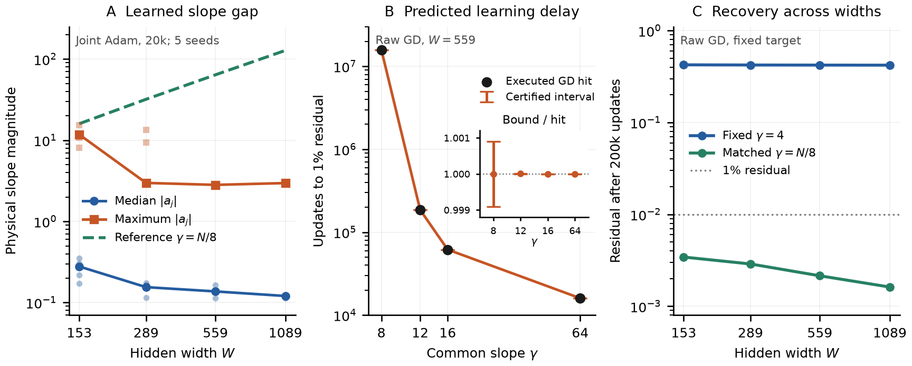

# How gamma changes the time needed to learn an attainable target

**Changing gamma changes how quickly the readout acquires an attainable
target, through a known frequency-dependent attenuation of its features.**
The quantitative question is how much the acquisition time changes when
gamma changes while the centers, samples, target, and readout metric remain
fixed. Our theorem follows the explicit attenuation through that fixed
geometry and bounds the resulting ratio of learning times. In the measured
example, reducing gamma from 64 to 8 makes the same 1% accuracy require
985.70–987.49 times as many updates; the executed ratio is 986.59. This is a
target-dependent comparison for the prescribed geometry. The standard GD
decay formula and approximation-error transfer justify the comparison;
the scientific statement is the gamma-induced change in acquisition time.

**Table 1. Notation.** Gamma is displayed explicitly in every learning
quantity. Eigenvalues and dimensionless bandwidth have different symbols.

| Symbol | Meaning |
|---|---|
| $\gamma,c_j,W$ | Common hidden slope, fixed neuron centers, and hidden width. |
| $E_\gamma(n)$ | Relative training residual after $n$ readout GD updates at this gamma. |
| $E_{\mathrm{floor}}(\gamma)$ | Smallest relative residual attainable by this same tanh dictionary. |
| $n_\epsilon(\gamma)$ | First update at which $E_\gamma(n)\le\epsilon$. |
| $\underline n_\epsilon(\gamma),\overline n_\epsilon(\gamma)$ | Certified necessary and sufficient update counts at that gamma. |
| $K_\gamma,\lambda_i(\gamma),p_i(\gamma)$ | Readout update matrix, its positive eigenvalues, and target energy in their modes. |
| $\eta_\gamma,L_\gamma$ | GD step and largest eigenvalue $L_\gamma=\|K_\gamma\|$. |
| $M_\gamma(\omega)$ | Explicit gamma-dependent attenuation at physical frequency $\omega$. |
| $k_{\mathrm{step}}$ | Kernel of a fixed reference dictionary of sharp steps. |
| $h,\beta$ | Center spacing and dimensionless bandwidth $\beta=\gamma h$. |

## 1. The question concerns training time at a fixed gamma

Consider the model

$$
f_{\gamma,\theta}(x)=b+\sum_{j=1}^W w_j\tanh\!\bigl(\gamma(x-c_j)\bigr),
\qquad \theta=(b,w_1,\ldots,w_W).
$$

Choose gamma, freeze these hidden features, and train only $\theta$ from
zero on half empirical mean squared error. Compare gamma values using the
same centers, samples, target, and raw coefficient coordinates, with a
specified step-size rule. The experiment uses approximately
$\eta_\gamma=0.5/L_\gamma$, so comparisons account for overall curvature.

There are two different questions:

- **Representability:** can some readout coefficients reach the requested
  accuracy? This concerns the best achievable residual
  $E_{\mathrm{floor}}(\gamma)$.
- **Acquisition:** how many GD updates reach that accuracy? This concerns
  $n_\epsilon(\gamma)$, even when the floor lies below $\epsilon$.

Every intermediate error satisfies
$E_\gamma(n)^2\ge E_{\mathrm{floor}}(\gamma)^2$, because an intermediate
readout cannot outperform the best readout in the same model. The floor
is reached in the limit of training time under the stable GD assumptions.
Gamma stays fixed in that limit. No comparison to a step-function model
is involved.

## 2. A two-point example: perfect capacity, gamma-dependent learning time

Take samples $x=-s,+s$ with target values $-1,+1$, where $s>0$. Use one
center at zero and the model $b+w\tanh(\gamma x)$. Set
$t_\gamma=\tanh(\gamma s)>0$. For every positive gamma, the coefficients
$b=0$, $w=1/t_\gamma$ fit both samples exactly. Thus
$E_{\mathrm{floor}}(\gamma)=0$ for every gamma in this example.

Nevertheless, starting from zero, GD on half mean squared error gives

$$
b_n=0,\qquad
w_{n+1}=w_n+\eta t_\gamma(1-t_\gamma w_n),
$$

and therefore

$$
\boxed{
\begin{aligned}
E_\gamma(n)&=\bigl(1-\eta\tanh^2(\gamma s)\bigr)^n,\\
n_\epsilon(\gamma)&=
\left\lceil
\frac{\log\epsilon}{\log(1-\eta\tanh^2(\gamma s))}
\right\rceil .
\end{aligned}
}
\tag{1}
$$

Here $0<\eta<1$ and $0<\epsilon<1$. Gamma enters the learning rate
through $\tanh^2(\gamma s)$. One factor of $t_\gamma$ appears in the
coefficient gradient; another appears when that coefficient update changes
the prediction. When $\gamma s$ is small, both effects are weak, giving

$$
n_\epsilon(\gamma)
\sim\frac{\log(1/\epsilon)}{\eta\gamma^2s^2}
\qquad(\gamma s\to0).
\tag{2}
$$

With $\eta=0.5$ and $\epsilon=0.01$, $\gamma s=0.1$ requires **925 updates**,
while $\gamma s=1$ requires **14**. Direct two-parameter GD verifies these
counts. This is an illustrative calculation, separate from the archived
MLP experiment. It has an exact gamma-cap implication: for this target and
fixed step, $0<\gamma\le\Gamma$ implies
$n_\epsilon(\gamma)\ge n_\epsilon(\Gamma)$, with the right side given by
(1). Capacity is perfect throughout; the learning delay changes.

## 3. The kernel appears when we express GD in prediction space

For many neurons and samples, define the feature-response vector
$\phi_\gamma(x)=(1,\tanh(\gamma(x-c_1)),\ldots,\tanh(\gamma(x-c_W)))$,
the matrix $J_\gamma$ with rows $\phi_\gamma(x_i)^T/\sqrt m$, and the
target vector $y_i=f^\star(x_i)/\sqrt m$. Then
$E_\gamma(n)=\|y-J_\gamma\theta_n\|/\|y\|$.

Write $r_n=y-J_\gamma\theta_n$. The coefficient update is
$\theta_{n+1}=\theta_n+\eta_\gamma J_\gamma^Tr_n$. Multiplying this update
by $J_\gamma$ tells us how the predictions change:

$$
r_{n+1}=(I-\eta_\gamma K_\gamma)r_n,
\qquad
\boxed{K_\gamma=J_\gamma J_\gamma^T.}
\tag{3}
$$

This matrix is the **readout kernel**. It is already present in ordinary
GD: its entry
$K_\gamma(i,\ell)=\phi_\gamma(x_i)^T\phi_\gamma(x_\ell)/m$
describes how the residual at sample $\ell$ contributes to the prediction
update at sample $i$. Inputs producing similar feature responses are
coupled by readout updates. Learning their differences can be slow.

In the two-point example,

$$
K_\gamma=\frac12
\begin{pmatrix}
1+t_\gamma^2&1-t_\gamma^2\\
1-t_\gamma^2&1+t_\gamma^2
\end{pmatrix}.
$$

The constant pattern $(1,1)$ has eigenvalue $1$. The contrast pattern
$(-1,1)$, which is precisely our target, has eigenvalue
$t_\gamma^2=\tanh^2(\gamma s)$. For small gamma the two feature-response
vectors become similar, and GD corrects their contrast slowly. The largest
eigenvalue stays $1$, so the example already uses a fixed fraction of the
maximum stable curvature scale when $\eta=0.5$.

For the full dictionary, these constant/contrast patterns become the
orthonormal eigenvectors $u_i(\gamma)$ of $K_\gamma$. Define
$p_i(\gamma)=|u_i(\gamma)^Ty|^2/\|y\|^2$ for its positive eigenvalues.
The representability floor is

$$
E_{\mathrm{floor}}(\gamma)^2
=\min_\theta\frac{\|J_\gamma\theta-y\|^2}{\|y\|^2}.
$$

For $0<\eta_\gamma\le1/L_\gamma$, equation (3) gives

$$
\boxed{
E_\gamma(n)^2=
E_{\mathrm{floor}}(\gamma)^2+
\sum_i p_i(\gamma)
\bigl(1-\eta_\gamma\lambda_i(\gamma)\bigr)^{2n}.
}
\tag{4}
$$

Current squared error equals unrepresentable target energy plus representable
target energy still unlearned. The eigenvalues set the decay rates; the
weights say which rates matter to this target. This is standard least-squares
GD theory. To explain gamma, we must now specify how gamma changes the
matrix in (3), rather than leaving it hidden inside its eigenvalues.

## 4. The gamma dependence is an explicit smoothing of the features

A tanh transition has spatial width proportional to $1/\gamma$. The exact
version of this observation is

$$
\tanh\!\bigl(\gamma(x-c_j)\bigr)
=\int_{\mathbb R}\rho_\gamma(x-t)\operatorname{sign}(t-c_j)\,dt,
\qquad
\rho_\gamma(t)=\frac\gamma2\operatorname{sech}^2(\gamma t).
\tag{5}
$$

The density $\rho_\gamma$ has unit mass. Equation (5) expresses the actual
tanh feature as a weighted average of a sharp step at the same center.
The step is $-1$ to the left of its center and $+1$ to the right.
Small gamma spreads this average over a wider region. The reference steps
are a device for separating the fixed centers from the varying smoothing;
all losses and learning times still refer to the tanh model.

In frequency space, this averaging attenuates frequency $\omega$ by

$$
\boxed{
M_\gamma(\omega)=\frac{z_\gamma}{\sinh z_\gamma},
\qquad z_\gamma=\frac{\pi|\omega|}{2\gamma},
\qquad M_\gamma(0)=1.
}
\tag{6}
$$

Thus gamma sets the frequency scale of attenuation: frequencies much smaller
than gamma have multiplier near one; frequencies much larger than gamma
have multiplier approximately $2z_\gamma e^{-z_\gamma}$. Lowering gamma
suppresses finer corrections in the features. The target's need for those
corrections is what makes this relevant to learning time.

Write $S_\gamma$ for this averaging operator. Define the reference kernel
$k_{\mathrm{step}}(x,x')=1+\sum_j\operatorname{sign}(x-c_j)\operatorname{sign}(x'-c_j)$.
Applying the averaging in (5) to each factor produces

$$
k_\gamma(x,x')
=S_\gamma^{(1)}S_\gamma^{(2)}k_{\mathrm{step}}(x,x'),
\qquad
k_\gamma(x,x')=\phi_\gamma(x)^T\phi_\gamma(x').
\tag{7}
$$

The superscript $(1)$ means smooth the first input, holding the second
fixed; $(2)$ means smooth the second. Each product of two steps becomes
the product of two tanh responses, and unit mass preserves the bias term.
Sampling (7) and dividing by $m$ gives
exactly the update matrix $K_\gamma$ in (3).

### Turning the smoothing identity into a matrix we can calculate

The purpose of the next construction is to express each tanh feature as a
sum of known waves, with **gamma appearing only in their amplitudes**.
The finite sum approximates the same tanh network used above. The original
samples, centers, and readout coefficients stay in place.

Start with one feature and write its sample-center displacement as $t=x-c$.
All displacements used in the experiment lie in $[-R,R]$, where
$R=\max_{i,j}|x_i-c_j|$. Choose an auxiliary number $T>R$; the study uses
$T=8$. Inside $(-T,T)$, the step $\operatorname{sign}(t)$ agrees with the
repeating square wave $\operatorname{sign}(\sin(\pi t/T))$. The latter has
period $2T$ and a sine expansion with known frequencies and amplitudes:

$$
\omega_\ell=\frac{(2\ell-1)\pi}{T},\qquad
a_\ell=\frac{4}{\pi(2\ell-1)},\qquad \ell=1,2,\ldots.
$$

These are the first, third, fifth, and subsequent odd multiples of the base
frequency $\pi/T$. Each frequency is called a harmonic. Smoothing multiplies
the amplitude of harmonic $\ell$ by the already-defined
$M_\gamma(\omega_\ell)$. Keeping the first $Q$ such frequencies gives

$$
\boxed{
\tanh\!\bigl(\gamma(x-c)\bigr)
\;\approx\;
\sum_{\ell=1}^Q a_\ell M_\gamma(\omega_\ell)
\sin\!\bigl(\omega_\ell(x-c)\bigr).
}
$$

$Q$ is the number of frequencies retained for this numerical approximation;
it is independent of the number $W$ of hidden neurons. For fixed $T$ and $Q$,
the frequencies and $a_\ell$ are fixed. Changing gamma changes only the
multipliers $M_\gamma(\omega_\ell)$.

There are two approximation errors to control. The repeating square wave
introduces additional jumps at $\pm T,\pm2T,\ldots$, whereas the original
step has only its central jump. Smoothing has tails, so those distant jumps
can influence values even inside $[-R,R]$; the bound depends on the margin
$T-R$ and gamma. Separately, keeping only $Q$ frequencies discards the
remaining smoothed harmonics. The technical proof bounds both contributions.
The periodic function is an approximation device; the original training
problem has no periodic boundary condition.

The matrix product follows from the elementary identity

$$
\sin\!\bigl(\omega_\ell(x_i-c_j)\bigr)
=\sin(\omega_\ell x_i)\cos(\omega_\ell c_j)
-\cos(\omega_\ell x_i)\sin(\omega_\ell c_j).
$$

This separates a sample's location $x_i$, a neuron's center $c_j$, and the
gamma multiplier. There are $m$ samples, $W$ hidden neurons, and one bias
coefficient. Define the three matrices as follows:

- **$F_Q$, size $m\times(2Q+1)$:** evaluate the constant, sine, and cosine
  functions at every sample. Row $i$ is

  $$
  (F_Q)_{i,:}=\frac1{\sqrt m}
  [1,\sin(\omega_1x_i),\cos(\omega_1x_i),\ldots,
  \sin(\omega_Qx_i),\cos(\omega_Qx_i)].
  $$

- **$D_{\gamma,Q}$, size $(2Q+1)\times(2Q+1)$:** multiply each wave by
  its gamma-dependent attenuation. The constant is preserved:

  $$
  D_{\gamma,Q}=\operatorname{diag}
  [1,M_\gamma(\omega_1),M_\gamma(\omega_1),\ldots,
  M_\gamma(\omega_Q),M_\gamma(\omega_Q)].
  $$

- **$C_Q$, size $(2Q+1)\times(W+1)$:** encode the center of each neuron
  and the fixed amplitudes $a_\ell$. Hidden column $j$ is

  $$
  (C_Q)_{:,j}=
  [0,a_1\cos(\omega_1c_j),-a_1\sin(\omega_1c_j),\ldots,
  a_Q\cos(\omega_Qc_j),-a_Q\sin(\omega_Qc_j)]^T.
  $$

  Its bias column is $[1,0,\ldots,0]^T$.

For example, with just one retained harmonic ($Q=1$), multiplying row $i$
of $F_1$, the diagonal filter, and hidden column $j$ of $C_1$ gives

$$
\begin{aligned}
(F_1D_{\gamma,1}C_1)_{ij}
&=\frac{a_1M_\gamma(\omega_1)}{\sqrt m}
\bigl[\sin(\omega_1x_i)\cos(\omega_1c_j)
-\cos(\omega_1x_i)\sin(\omega_1c_j)\bigr]\\
&=\frac{a_1M_\gamma(\omega_1)}{\sqrt m}
\sin\!\bigl(\omega_1(x_i-c_j)\bigr).
\end{aligned}
$$

That is exactly the first term of the feature approximation, with the same
$1/\sqrt m$ normalization as $J_\gamma$. More harmonics add the remaining
terms. One harmonic illustrates the multiplication; accurate prediction
uses enough harmonics to control the approximation error.

Consequently, define the approximate feature matrix
$\widetilde J_{\gamma,Q}=F_QD_{\gamma,Q}C_Q$. Its kernel is obtained in
exactly the same way as the original kernel: multiply the feature matrix
by its transpose. Since $D_{\gamma,Q}$ is diagonal, this gives

$$
\boxed{
\widetilde J_{\gamma,Q}=F_QD_{\gamma,Q}C_Q,\qquad
\widetilde K_{\gamma,Q}
=F_QD_{\gamma,Q}C_QC_Q^TD_{\gamma,Q}F_Q^T.
}
\tag{8}
$$

The tilde means an approximation to the original tanh features or kernel;
$Q$ records its harmonic resolution. The trained parameter vector still has
$W+1$ entries, with predictions $\widetilde J_{\gamma,Q}\theta$.
**The samples and centers determine $F_Q,C_Q$; gamma changes
$D_{\gamma,Q}$.** This is how we isolate gamma's action without discarding
the finite geometry. The full products are retained, and these sine/cosine
functions need not be eigenvectors of the sampled kernel.

The explanatory chain is now explicit:

$$
\begin{aligned}
\gamma&\;\longrightarrow\;M_\gamma
\;\longrightarrow\;D_{\gamma,Q}
\;\longrightarrow\;\widetilde K_{\gamma,Q},\\
(\widetilde K_{\gamma,Q},y,\eta_\gamma)
&\;\longrightarrow\;
\{\eta_\gamma\widetilde\lambda_i(\gamma),\widetilde p_i(\gamma)\}
\;\longrightarrow\;\widetilde E_\gamma(n).
\end{aligned}
$$

For each gamma, the middle steps use a finite matrix calculation, the same
target, and the prescribed step-size rule. The theorem does not replace
them by a universal scalar formula in gamma. The two-point example admits
that simplification; the measured dictionary retains the couplings needed
for accurate prediction.

## 5. The theorem quantifies how changing gamma changes acquisition time

The quantity of interest is the acquisition-time ratio between two gamma
values. It is predicted by their explicit attenuation filters acting on the
same geometry and target.

**Theorem (gamma attenuation and relative acquisition time).** Fix the
samples, centers, nonzero target, tolerance $0<\epsilon<1$, and raw readout
metric. Compare slopes $0<\gamma_{\mathrm{low}}<\gamma_{\mathrm{high}}$, starting each readout
at zero and using a prescribed step-size rule satisfying the contraction
condition below. At each approximation resolution $Q$, construct the same
gamma-independent matrices $F_Q,C_Q$ for both models. Changing gamma changes
the retained feature kernel through the diagonal
filter $D_{\gamma,Q}$, whose frequency entries are explicitly

$$
\boxed{
M_\gamma(\omega)=\frac{z_\gamma}{\sinh z_\gamma},\qquad
z_\gamma=\frac{\pi|\omega|}{2\gamma},\qquad M_\gamma(0)=1.
}
$$

Applying these multipliers to the fixed geometry gives the predicted curve

$$
\boxed{
\widetilde E_\gamma(n)=
\frac{\left\|
\left[I-\eta_\gamma F_QD_{\gamma,Q}C_QC_Q^TD_{\gamma,Q}F_Q^T\right]^n y
\right\|}{\|y\|}.
}
$$

With the controlled approximation margin described below, this curve gives
necessary and sufficient counts
$\underline n_\epsilon(\gamma)\le n_\epsilon(\gamma)\le\overline n_\epsilon(\gamma)$.
For positive finite certified counts, **the change in learning time caused
by changing gamma** satisfies

$$
\boxed{
\frac{\underline n_\epsilon(\gamma_{\mathrm{low}})}
     {\overline n_\epsilon(\gamma_{\mathrm{high}})}
\;\le\;
\frac{n_\epsilon(\gamma_{\mathrm{low}})}
     {n_\epsilon(\gamma_{\mathrm{high}})}
\;\le\;
\frac{\overline n_\epsilon(\gamma_{\mathrm{low}})}
     {\underline n_\epsilon(\gamma_{\mathrm{high}})}.
}
$$

If the left endpoint exceeds one, the theorem certifies that lowering gamma
slows acquisition for this target, and states by how much. All ingredients
come from the two slopes, fixed geometry, target, and step-size rule; no
optimization trajectory is required. The ratio is target-dependent because
attenuation changes both the rates and the target energy assigned to them.
Lower gamma need not slow every possible target.

**Quantitative consequence in the measured problem.** Holding the target and
geometry fixed and reducing gamma eightfold gives

$$
\boxed{
985.7021\;\le\;
\frac{n_{0.01}(8)}{n_{0.01}(64)}
\;\le\;987.4867,
\qquad\text{executed ratio }986.5930.
}
$$

The displayed ratio endpoints are rounded outward. Both models attain 1%.
The normalized steps are approximately $\eta_\gamma L_\gamma=0.5$, so the
comparison includes the same curvature-based step rule. This is a
quantitative optimization effect at an attainable tolerance.

The attenuation itself is also measurable. At the target's finest frequency,
$\omega=10\pi$, reducing gamma from 64 to 8 changes $M_\gamma(\omega)$ from
0.9074 to 0.02584: that frequency's multiplier is about 35.1 times smaller.
At its coarsest frequency, $\omega=2\pi$, the change is only from 0.9960 to
0.7851. The effect is strongly frequency-dependent. These are feature-filter
amplitudes, not finite-kernel eigenvalues. Carrying them through the full
matrix product and this target gives the acquisition-time ratio above.

### How the necessary and sufficient counts are certified

For each common slope $\gamma>0$, use a prescribed step
$0<\eta_\gamma\le1/\max\{\|K_\gamma\|,\|\widetilde K_{\gamma,Q}\|\}$,
so both kernels contract. The matrix-power expression in the theorem is
equivalently evaluated by the eigenmode formula (4) for the filtered kernel
(8). The controlled feature approximation supplies an error margin
$d_{\gamma,Q}(n)$ such that

$$
|E_\gamma(n)-\widetilde E_\gamma(n)|\le d_{\gamma,Q}(n).
\tag{9}
$$

Consequently, if checked integer times $a,b$ satisfy

$$
\begin{aligned}
\widetilde E_\gamma(a)-d_{\gamma,Q}(a)&>\epsilon
&&\text{(even the lower error estimate is too large)},\\
\widetilde E_\gamma(b)+d_{\gamma,Q}(b)&\le\epsilon
&&\text{(even the upper error estimate is small enough)},
\end{aligned}
$$

then

$$
\boxed{
\underline n_\epsilon(\gamma):=a+1
\;\le\;n_\epsilon(\gamma)\;\le\;
b=: \overline n_\epsilon(\gamma).
}
\tag{10}
$$

The target cannot have been acquired by update $a$, and must have been
acquired by update $b$. Valid endpoints may be selected across resolutions
$Q$; the physical samples and centers remain fixed. The ratio bound in the
theorem follows by dividing a necessary count for one slope by a sufficient
count for the other, and conversely. Observed GD trajectories test these
predictions afterward.

**Proof and the role of the margin.** The explicit tanh approximation bounds
the discrepancy $\Delta_{\gamma,Q}\ge\|K_\gamma-\widetilde K_{\gamma,Q}\|$.
Telescoping the two GD update powers
and using contraction gives the basic choice
$d_{\gamma,Q}(n)=n\eta_\gamma\Delta_{\gamma,Q}$. Retaining how the discrepancy
acts on the target's residual modes gives a tighter alternative; the
implemented combined bound uses the smaller valid margin. It can evaluate
the original operator, but requires no GD iterates. The exact residual is
nonincreasing, which proves the necessary-time statement in (10). The
sufficient time is a directly checked witness; monotonicity of the upper
error envelope is unnecessary. Full remainder and margin formulas are in
the [technical proof](gamma_factorized_readout.md).

**Table 2. The gamma-dependent prediction and executed acquisition times.**
The fixed target is $\sin(2\pi x)+\frac12\sin(6\pi x)+\frac14\sin(10\pi x)$,
with $W=559$ and approximately $\eta_\gamma L_\gamma=0.5$. Tolerance 1%
means relative residual norm $0.01$, or relative squared loss $10^{-4}$.

| Common slope $\gamma$ | Cannot acquire before update | Must acquire by update | Executed first hit |
|---:|---:|---:|---:|
| 8 | 15,784,048 | 15,812,623 | 15,798,313 |
| 12 | 186,057 | 186,058 | 186,057 |
| 16 | 61,792 | 61,792 | 61,792 |
| 64 | 16,013 | 16,013 | 16,013 |

For example, at gamma 8 the lower error envelope at update **15,784,047**
is still above 1%, while the upper envelope at **15,812,623** is at or below
1%. Equation (10) therefore gives the first row. The executed hit falls
inside that interval. Its total width is 0.181% of the observed time.

All four models actually reach 1%, so lack of capacity at that tolerance
cannot explain their different times. Changing only overall kernel
magnitude while preserving the gamma-64 relative spectrum predicts 16,013
updates at every gamma under this step rule. Carrying the frequency-dependent
gamma filter through the finite geometry recovers the observed delay.

These are retrospective checks against archived runs. The selected endpoints
have independent 192-bit interval-arithmetic certificates for nominal-real
tanh on the archived binary inputs and saved steps. The numerical margins
also include a disclosed floating-point sensitivity allowance; that allowance
and every error curve are not themselves interval-certified. The purely
analytic margin already gives similar timing accuracy with more harmonics.
See the [evaluation report](../results/checkpoint_D_optimizers/expD36_frozen_gamma_probe/full_sweep/refinements/gamma_factorized_kernel/REPORT.md)
for those bounds and the control targets.

## 6. The three panels connect scale, delay, and intervention

<figure>
  
  <figcaption><strong>Figure 1. Gamma affects acquisition as well as representability.</strong> All panels use the sine-mixture target in Table 2. <strong>A:</strong> After 20,000 joint Adam updates, faint points show each of five seeds' median and maximum absolute hidden slopes; solid curves show their respective medians across seeds. Every seed's maximum stays below the dashed constructive reference. That reference is not asserted to be a necessary approximation threshold. <strong>B:</strong> With 559 fixed-center features and zero-initialized raw readout GD, certified necessary–sufficient intervals closely match executed times to 1% residual. The inset divides each interval by its observed first-hit time; these are deterministic bounds. Lines between tested slopes guide the eye. <strong>C:</strong> After 200,000 raw-readout GD updates, fixed gamma 4 leaves residual near 0.42 across widths, while construction-matched slopes give 0.0034–0.0016. The dotted line is 1%. Panels B/C use curvature-normalized steps. Panel A supplies empirical motivation from joint training; the readout theorem applies to B/C's frozen-feature setting.</figcaption>
</figure>

[Vector PDF](../results/checkpoint_D_optimizers/expD36_frozen_gamma_probe/full_sweep/refinements/gamma_factorized_kernel/paper_three_panel.pdf).
Panel A identifies a learned slope gap, B tests the quantitative timing
prediction, and C tests the slope-scaling intervention. The
[filter and target-weighted spectrum figure](../results/checkpoint_D_optimizers/expD36_frozen_gamma_probe/full_sweep/refinements/gamma_factorized_kernel/three_panel.png)
provides supporting evidence for the intermediate mechanism.

The domain is $[-1,1]$, with $m=16N+1$ equally spaced endpoint training
samples. Frozen dictionaries use equispaced centers with halo
$\lceil\sqrt N\rceil$, giving $W=N+2\lceil\sqrt N\rceil+1$.
Panels A/C use $N=128,256,512,1024$; B uses $N=512$.
Panel A trains all hidden slopes, offsets, and readout parameters with Adam
at rate $10^{-3}$, epsilon $10^{-8}$, and moments $(0.9,0.999)$.
Hidden slopes and readout weights start independently uniform on
$[-\sqrt{6/(W+1)},\sqrt{6/(W+1)}]$; biases start at zero. All five seeds
are shown. Panels B/C start the readout at zero and freeze the hidden
parameters, using each case's saved step, approximately $0.5/L_\gamma$.

Within each width in panel C, the target, samples, centers, coefficient
metric, and update budget are identical between the two gamma strategies.
The plotted values are measured training residuals; a new certified timing
prediction has not been made for every width. The finite-budget residual
at gamma 4 is not an established irreducible floor. No panel claims held-out
generalization.

## 7. What gamma proportional to width recovers

Write center spacing as $h=2/N$ and dimensionless bandwidth as
$\beta=\gamma h$. The constructive reference holds $\beta=1/4$, giving
$\gamma=N/8=\Theta(W)$. Eigenvalues retain the separate notation
$\lambda_i(\gamma)$.

For a grid-relative frequency $\xi=h\omega$, setting $\gamma_N=\beta/h$
in the explicit filter gives

$$
\boxed{
M_{\gamma_N}(\xi/h)=
\frac{\pi|\xi|/(2\beta)}{\sinh(\pi|\xi|/(2\beta))}.
}
\tag{11}
$$

This is independent of width, with value one at zero frequency. On any fixed
band $|\xi|\le\Xi$, it has a positive width-independent lower bound.
In contrast, fixed gamma and nonzero $\xi$ give, as $h\to0$,

$$
M_\gamma(\xi/h)^2
\sim\frac{\pi^2\xi^2}{\gamma^2h^2}
\exp\!\left(-\frac{\pi|\xi|}{\gamma h}\right).
\tag{12}
$$

Equations (11)–(12) follow by substitution into (6) and its large-frequency
asymptotic. **Scaling gamma with width prevents a growing smoothing penalty
for corrections at the dictionary's resolution.** The constant $\beta$
matters, and the remaining geometry and target weights still determine GD
time through (4). The filter statement alone does not imply constant
training times as width grows.

The reference uses $\gamma=\Theta(W)$; the upper bound $\gamma=O(W)$ alone
also permits fixed gamma. At a fixed physical frequency, fixed gamma already
gives width-independent attenuation, whereas gamma proportional to width
makes $M_\gamma(\omega)\to1$. Panel C holds the target fixed and demonstrates
the benefit of this intervention. It does not establish that every fixed
target requires linear gamma scaling.

## Reproduction and notation in the technical appendix

The [technical note](gamma_factorized_readout.md) contains the full proofs.
Its $k_\infty$ is called $k_{\mathrm{step}}$ here; its training limit
$E_\infty$ is called $E_{\mathrm{floor}}(\gamma)$. These refer to different
limits: sharpness of the reference features and training time at fixed gamma,
respectively. In this note, $\beta$ always means dimensionless bandwidth and
$\lambda_i(\gamma)$ always means a kernel eigenvalue.

From the repository root, reproduce the archived figure with:

```bash
MPLCONFIGDIR=/tmp/gamma-paper-mpl \
python -m experiments.expD36_frozen_gamma_probe.paper_figure
```

The [plotting entry point](../experiments/expD36_frozen_gamma_probe/paper_figure.py)
checks 23 tracked source files, target and seed indices, completed budgets,
zero readout initialization, saved step normalization, and the four plotted
certificates. The [data record](../results/checkpoint_D_optimizers/expD36_frozen_gamma_probe/full_sweep/refinements/gamma_factorized_kernel/paper_figure_data.json)
contains all plotted values and source hashes. Seeds are 0–4; none is
selected or excluded. The figure was inspected at 7.2-inch two-column width.
The existing numerical validation has 20 focused tests passing and 768
full-suite passes, with 17 previously recorded failures. This exposition
revision separately checks the two-point example against direct GD and the
matrix factors against explicit harmonic sums. It also checks the relative
acquisition bound and the quoted frequency multipliers. No
experiment code, archived figures, or training runs were changed. The
[validation record](../results/checkpoint_D_optimizers/expD36_frozen_gamma_probe/full_sweep/refinements/gamma_factorized_kernel/paper_validation.json)
records the example check and document hash alongside the existing evidence.
