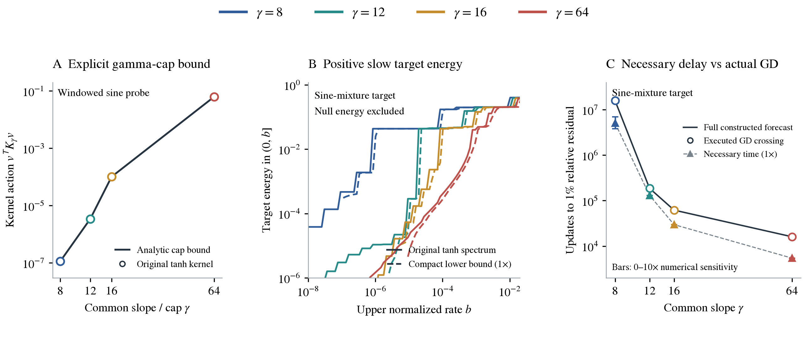

# An explicit gamma cap for finite tanh learning operators

[PDF](gamma_structured_kernel_note.pdf) · [LaTeX](gamma_structured_kernel_note.tex)

The question is whether a bound can carry gamma all the way to a learning obstruction without hiding its effect inside a full eigendecomposition. For a uniformly sampled, common-slope tanh dictionary, the answer is yes at the level of quadratic forms: an explicit Fourier expression bounds the kernel's action on every mean-zero direction. This is a finite-interval statement about ordinary tanh features. A periodic model is not substituted for the trained dictionary.

The distinction between this statement and a precise acquisition-time prediction matters. The Fourier bound can be close to the actual quadratic form while a learning-time bound using only that one number remains conservative. We therefore separate the analytic cap theorem, its elementary training consequence, and a richer calculation of target energy in slow modes. In the tested $N=512$ geometry, the cap bound is within 0.15% of the true quadratic form across 17 prescribed directions and four slopes. The richer calculation gives a 5.07-million-update necessary time for the original gamma-8 sine mixture, compared with 15.80 million updates observed. These are different tightness statements; the latter is not an exact forecast.

| Symbol | Meaning |
|---|---|
| $h,q,m$ | Center spacing, integer sampling oversampling, and number of observed inputs |
| $\gamma,\Gamma$ | Common feature slope and its upper cap |
| $\lambda=\gamma h$ | Dimensionless bandwidth; never an eigenvalue |
| $J_\gamma,K_\gamma=J_\gamma J_\gamma^*$ | Sample-normalized feature matrix and raw-readout learning kernel |
| $\mu,\eta\mu$ | Kernel eigenvalue and per-update rate |
| $v=(v_i),y$ | A chosen pattern's values at the observed inputs, and the normalized training target |
| $\mathcal Q_\Gamma(v)$ | Explicit cap-dependent Fourier upper bound on $v^*K_\gamma v$ |
| $E_\gamma(n)$ | Relative residual norm after $n$ GD updates from zero |

## 1. A theorem with gamma visible in the conclusion

Let $h>0$ and let the observed inputs be a finite subset of the uniform fine grid $x_i=ih/q$, where $q$ is a positive integer. There are $m$ observed inputs. The dictionary contains $W$ distinct centers from the lattice $c_j=jh$, all with the same slope $0<\gamma\le\Gamma$, and a bias. Its columns are

$$
J_\gamma[i,j]=m^{-1/2}\tanh\bigl(\gamma(x_i-c_j)\bigr),
\qquad J_\gamma[i,\mathrm{bias}]=m^{-1/2}.
$$

This includes the finite interval, endpoint sample, and uniform halo centers used in the experiments. The normalization preserves the Euclidean metric of the original readout coefficients. With $y_i=y_i^{\rm phys}/\sqrt m$, the relative training residual from zero initialization is $E_\gamma(n)=\|(I-\eta K_\gamma)^ny\|/\|y\|$.

A sample vector $v=(v_i)$ specifies one amplitude at each observed input $x_i$. It can describe the training target, a residual pattern, or a chosen oscillation. For example, given a function $f$, choose $v_i=f(x_i)-m^{-1}\sum_r f(x_r)$ and, if desired, divide by $\|v\|$. Subtracting the sample mean puts the vector in the theorem's domain. Its entries are sample values, not readout weights or eigenvalues; no kernel eigenvector is needed to choose it.

Put $v_i=0$ at unobserved fine-grid indices. Define its $q$ phase polynomials and their alias combinations, keeping their dependence on $v$ explicit:

$$
V_{v,s}(\theta)=\sum_{\ell\in\mathbb Z}v_{q\ell+s}e^{-i\ell\theta},
\qquad
B_{v,k}(\theta)=\sum_{s=0}^{q-1}V_{v,s}(\theta)e^{-i(\theta+2\pi k)s/q}.
$$

Combining these sums gives the exact identity

$$
B_{v,k}(\theta)=\sum_{r\in\mathrm{observed}}v_r e^{-i(\theta+2\pi k)r/q}.
$$

This is the chosen vector's Fourier amplitude at the indicated sampled frequency. All sums over sample indices are finite. The index $k$ labels frequencies that are indistinguishable when sampled at the center spacing. Let

$$
M_\Gamma(\omega)=\frac{z}{\sinh z},\qquad
z=\frac{\pi|\omega|}{2\Gamma},\qquad M_\Gamma(0)=1,
$$

and define

$$
\mathcal Q_\Gamma(v)=\frac1{2\pi m}\int_{-\pi}^{\pi}
\left[
\sum_{k\in\mathbb Z}
\frac{2M_\Gamma((\theta+2\pi k)/h)}{|\theta+2\pi k|}
\underbrace{\left|\sum_{r\in\mathrm{observed}}v_r e^{-i(\theta+2\pi k)r/q}\right|}_{|B_{v,k}(\theta)|\text{: sample-vector dependence}}
\right]^2d\theta.
$$

This is the full oversampled formula, including all aliases; the experiment has $q=16$. Gamma weights the Fourier content of the specified vector. Changing $v$ changes the bound even when gamma and the dictionary geometry stay fixed. Scaling $v$ by a constant scales both the kernel quadratic form and its bound by the squared magnitude of that constant.

For a mean-zero vector, $B_{v,0}(0)=\sum_i v_i=0$, so the apparent singularity in the $k=0$ term has a finite limiting magnitude. The remaining alias series is exponentially convergent. This expression uses the prescribed geometry, target or test vector, and gamma cap. It uses no trained coefficients or kernel eigenvectors.

> **Theorem: A common gamma cap limits access to resolved sample directions.**
>
> For every dictionary described above, every $0<\gamma\le\Gamma$, and every mean-zero sample vector $v$,
> $$
> \boxed{v^*K_\gamma v\le\mathcal Q_\Gamma(v).}
> $$
> The right-hand side is nondecreasing in $\Gamma$. Its frequency weights contain the explicit factor $M_\Gamma(\omega)$, which decays exponentially when $|\omega|/\Gamma$ is large. Thus directions with little leakage into low frequencies have a small kernel quadratic form under a small cap.
>
> If $y\ne0$ is mean-zero, readout GD starts from zero, and $\eta>0$ satisfies $\eta\|K_\gamma\|\le1$, define $r_\Gamma=\mathcal Q_\Gamma(y)/\|y\|^2$. Whenever $\eta r_\Gamma<1$,
> $$
> E_\gamma(n)\ge(1-\eta r_\Gamma)^n.
> $$
> If $r_\Gamma>0$, reaching residual tolerance $0<\varepsilon<1$ therefore requires at least
> $$
> \left\lceil\frac{\log(1/\varepsilon)}{-\log(1-\eta r_\Gamma)}\right\rceil
> $$
> updates. For $r_\Gamma=0$, a nonzero target cannot be learned. The sufficient stable step $\eta\le1/(W+1)$ is available without computing a spectrum.

The target condition is explicit, rather than an assumption about unknown kernel eigenvectors: its sampled Fourier content is inserted into $\mathcal Q_\Gamma$. A high nominal oscillation frequency alone is insufficient. Finite-window leakage into low frequencies can dominate the integral. The theorem also does not assert that every target learns faster when gamma increases. It gives a cap-dependent obstruction for a specified target.

### What the directional bound says about eigenvalues

Let $u_i$ be orthonormal eigenvectors of $K_\gamma$, with eigenvalues $\mu_i\ge0$. For a unit mean-zero sample vector $v$,

$$
v^*K_\gamma v=\sum_i\mu_i|\langle u_i,v\rangle|^2\le\mathcal Q_\Gamma(v).
$$

Each direction therefore gives a different weighted average of the same eigenvalues. A large eigenvalue is compatible with a small bound for a vector that barely overlaps its eigenvector. The theorem controls the quadratic form $v^*K_\gamma v$, not every component of the response vector $K_\gamma v$ or the norm $\|K_\gamma v\|$.

If a unit eigenvector $u_j$ is itself mean-zero, choosing $v=u_j$ isolates its eigenvalue and gives $\mu_j\le\mathcal Q_\Gamma(u_j)$. This requires knowing $u_j$, which can itself change with gamma. The finite kernel need not preserve the mean-zero subspace, so not all of its eigenvectors are admissible in this theorem. Centering an eigenvector generally destroys the eigenvector identity. Thus the directional formula does not independently identify every eigenvalue or eigenvector.

One useful consequence does not require knowing eigenvectors: for $t>0$,

$$
\sum_{\mu_i>t}|\langle u_i,v\rangle|^2\le\frac{\mathcal Q_\Gamma(v)}{t}.
$$

The inequality follows by retaining only these nonnegative terms in the weighted average. A small cap bound therefore limits the amount of this particular pattern that can occupy fast modes. The complementary slow energy can include a nullspace component; Section 4 separately excludes that possibility when bounding positive slow energy.

To guarantee many small eigenvalues, one would instead establish $\mathcal Q_\Gamma(v)\le a\|v\|^2$ for every vector in a specified $r$-dimensional mean-zero subspace. The min–max principle would then give at least $r$ eigenvalues of $K_\gamma$ at most $a$, possibly including zeros. The 17 empirical direction checks are not such a uniform subspace proof, and their observed 0.15% tightness is not a universal relative-error guarantee.

### A simpler formula when inputs and centers have the same spacing

For $q=1$, write $V(\theta)=\sum_i v_i e^{-ii\theta}$. Pairing the discrete aliases improves the preceding bound to

$$
v^*K_\gamma v\le
\frac1{2\pi m}\int_{-\pi}^{\pi}
\frac{4}{\theta^2}M_\Gamma(\theta/h)^2|V(\theta)|^2\,d\theta.
$$

This displays the mechanism directly: the principal-frequency step envelope $4/\theta^2$ is multiplied by the squared gamma attenuation. The exact aligned-grid step response has squared magnitude $\cot^2(\theta/2)$; the envelope is not being identified with that discrete spectrum. This is a bound for the finite ordinary-tanh dictionary, not an identification of its eigenvectors with Fourier waves.

If the dictionary has at least $m$ distinct tanh centers, the bias and tanh columns span the entire $m$-sample space for every $\gamma>0$. Consequently, in this setting the delay theorem can apply to exactly representable targets. The rank statement is algebraic; it does not imply numerically easy interpolation or small readout coefficients.

## 2. Proof of the cap theorem

**Smoothing and the difference response.** With

$$
\rho_\gamma(x)=\tfrac\gamma2\operatorname{sech}^2(\gamma x),
$$

integration gives $\rho_\gamma*\operatorname{sign}=\tanh(\gamma\,\cdot)$. Its Fourier transform is $M_\gamma$. One derivation substitutes $u=e^{2\gamma x}$ in the integral for the transform and uses
$\Gamma(1-ia)\Gamma(1+ia)=\pi a/\sinh(\pi a)$, with $a=\omega/(2\gamma)$.
Thus the localized adjacent-feature difference

$$
d_\gamma(x)=\tanh(\gamma x)-\tanh(\gamma(x-h))
=2\rho_\gamma*\boldsymbol1_{[0,h]}(x)
$$

has transform

$$
\widehat d_\gamma(\omega)
=\frac{2(1-e^{-i\omega h})}{i\omega}M_\gamma(\omega).
$$

The value at zero is $2h$. Sampling this integrable difference profile permits ordinary Poisson summation. Dividing out the discrete difference factor gives, away from $\theta=0$, the tanh phase response

$$
T_{\gamma,s}(\theta)=
\sum_{k\in\mathbb Z}
\frac{2M_\gamma((\theta+2\pi k)/h)}{i(\theta+2\pi k)}
e^{i(\theta+2\pi k)s/q}.
$$

The undifferenced tanh sequence is not summable. This formula is used only after the mean-zero sample combination cancels its constant-tail singularity; it must not be interpreted as an ordinary absolutely convergent transform of that sequence.

**Extend the centers, not the training problem.** For mean-zero $v$, the bias contributes zero. Extend the center index to all integers in the quadratic form. Every added squared feature correlation is nonnegative, so

$$
v^*K_\gamma v\le
\frac1m\sum_{j\in\mathbb Z}
\left|\sum_i v_i\tanh\bigl(\gamma(x_i-jh)\bigr)\right|^2.
$$

The sum converges: outside the sample interval, the constant $+1$ or $-1$ parts cancel because $\sum_i v_i=0$, and the remaining correlations decay exponentially. Parseval's identity then expresses the right-hand side as

$$
\frac1{2\pi m}\int_{-\pi}^{\pi}
\left|\sum_{s=0}^{q-1}\overline{T_{\gamma,s}(\theta)}V_{v,s}(\theta)\right|^2d\theta.
$$

Apply the triangle inequality to the alias sum. At each fixed frequency, $M_\gamma(\omega)\le M_\Gamma(\omega)$ when $\gamma\le\Gamma$. This proves the stated cap bound. It also proves monotonicity of the bound in the cap, without asserting a Loewner ordering between the original finite kernels at two slopes.

**Matched-grid improvement.** For $q=1$, set $a=\pi/(2\gamma h)$. Apart from the common factor $\pi/(i\gamma h)$, the tanh response is

$$
\sum_{k\in\mathbb Z}\operatorname{csch}\bigl(a(\theta+2\pi k)\bigr).
$$

For $0<\theta<\pi$, pairing the terms at $\theta+2\pi k$ and $2\pi(k+1)-\theta$ shows that this sum is nonnegative. Alternatively, separating the $k=0$ term and pairing the terms at $2\pi k+\theta$ and $2\pi k-\theta$ shows that it is no larger than $\operatorname{csch}(a\theta)$. Odd symmetry treats negative $\theta$. Squaring gives the improved integrand $4M_\gamma(\theta/h)^2/\theta^2$; increasing the slope to $\Gamma$ completes the bound.

**Training delay.** Let the target-weighted spectral measure of $K_\gamma$ assign weight $|\langle u_j,y\rangle|^2/\|y\|^2$ to eigenvalue $\mu_j$. It includes any nullspace energy. Its mean is $y^*K_\gamma y/\|y\|^2$. On $[0,1/\eta]$, the function $(1-\eta\mu)^{2n}$ is convex. Jensen's inequality, followed by the cap bound, gives

$$
E_\gamma(n)^2
\ge\left(1-\eta\frac{y^*K_\gamma y}{\|y\|^2}\right)^{2n}
\ge(1-\eta r_\Gamma)^{2n}.
$$

This proves the residual and update-count statements. Finally, $\|K_\gamma\|\le\|J_\gamma\|_F^2\le W+1$ proves the stated step-size rule.

**Representability when there are enough centers.** Set $a_i=e^{2\gamma x_i}$ and $b_j=e^{2\gamma c_j}$. Then

$$
\tanh\bigl(\gamma(x_i-c_j)\bigr)=1-\frac{2b_j}{a_i+b_j}.
$$

The bias and any $m$ tanh columns therefore span the columns of the $m\times m$ Cauchy matrix $1/(a_i+b_j)$. Its determinant is nonzero for distinct inputs and distinct centers. Hence the original feature matrix has full row rank. This is not claimed for the oversampled experiment, where $m$ exceeds the number of features.

## 3. The exact Toeplitz formulation and its limits

For consecutive uniform centers, write the hidden weights as backward differences of cumulative coefficients. Let $C$ be the resulting invertible matrix, with the bias left unchanged, and put $Z_\gamma=J_\gamma C$. Its hidden columns are the localized differences $d_\gamma(x-c_j)$ and one terminal tanh feature. The parameter metric is

$$
T=C^*C,
$$

whose hidden block is tridiagonal, with diagonal $2,\ldots,2,1$ and off-diagonal $-1$. The exact identities are

$$
K_\gamma=Z_\gamma T^{-1}Z_\gamma^*,\qquad
Z_\gamma^*Z_\gamma w=\mu T w.
$$

Here $w$ is a coefficient-space vector, whereas the theorem's $v$ has one entry per observed sample. The generalized problem recovers the same positive kernel eigenvalues. GD in these coordinates uses $T^{-1}$ on its gradient. Using the identity metric would change the optimizer. Likewise, dropping the terminal feature or restricting to zero-sum weights would change the problem; that coefficient subspace is not generally invariant under raw GD.

For localized columns alone, summing their products over the infinite input lattice gives a Toeplitz Gram matrix. Subtracting the left and right unobserved-row Grams gives the observed finite matrix exactly. The outside-row matrices have Hankel structure after reversing the appropriate index. The terminal and bias cross terms remain. The discrete Toeplitz symbol is the sum of the squared magnitudes of the $q$ sampled difference responses, divided by $m$.

This structure exposes gamma and supplies the cap theorem above, but does not by itself make finite eigenvectors independent of gamma. A small absolute error in the Toeplitz approximation need not be small relative to the slow learning rates. An approximation $\widehat Z$ must therefore be assessed after the metric correction:

$$
e=\|(Z_\gamma-\widehat Z)C^{-1}\|,
\qquad
\|K_\gamma-\widehat K\|
\le(2\|\widehat ZC^{-1}\|+e)e.
$$

The triangular factor $C^{-1}$ can amplify errors. Tests and numerical diagnostics explicitly retain it.

## 4. Retaining target energy through small boundary systems

The cap theorem controls a quadratic form. To retain more of the target-weighted spectrum, use a smooth low-pass filter of the per-update operator $A=\eta K_\gamma$:

$$
f_{k,s}(a)=\frac1{1+(a/s)^k},\qquad k\text{ positive and even},\quad s>0.
$$

Define $F_{k,s}=y^*f_{k,s}(A)y/\|y\|^2$. For $t>0$, let $S(t)$ be the target energy in rates at most $t$. Monotonicity of $f$ gives

$$
\left[\frac{F_{k,s}-f_{k,s}(t)}{1-f_{k,s}(t)}\right]_+
\le S(t)\le
\min\left\{1,\frac{F_{k,s}}{f_{k,s}(t)}\right\}.
$$

An error allowance on $F$ is subtracted in the lower bound and added in the upper bound. These are inequalities, not an assumption that the filter is a hard spectral projector.

Let $H=\eta\widehat J^*\widehat J$, $g=\sqrt\eta\widehat J^*y$, and $z_j=s\exp(i(2j+1)\pi/k)$. Partial fractions and the feature-to-kernel identity give

$$
\widehat F_{k,s}
=1-\frac1{k\|y\|^2}\sum_{j=0}^{k-1}g^*(H-z_jI)^{-1}g.
$$

The existing Fourier-plus-boundary construction organizes $H$ as an explicit Fourier diagonal plus a signed low-rank correction. Woodbury's identity reduces each shifted solve to the retained boundary dimension. The Fourier entries and boundary factors depend explicitly on gamma; no rates are fitted to training curves. Any numerical compression and its error must be disclosed.

**Why shifted-solve residuals matter.** In real coefficient coordinates, let $u$ approximate $(H-zI)^{-1}g$ and let $r=g-(H-zI)u$. Then

$$
g^T(H-zI)^{-1}g
=g^Tu+u^Tr+r^T(H-zI)^{-1}r.
$$

The remaining error has magnitude at most $\|r\|^2/|\operatorname{Im}z|$. The transpose in this identity is an ordinary transpose: $H$ and $g$ are real, although $u$ and $r$ are complex. A solve performed in the complex Fourier basis must be transformed back before using this expression. A small-system condition number alone is not an accuracy certificate.

If $\|A-\widehat A\|\le\delta_A$, the resolvent identity supplies the additional exact-arithmetic allowance

$$
|F_{k,s}-\widehat F_{k,s}|
\le\frac{\delta_A}{k}\sum_{j=0}^{k-1}
\frac{|z_j|}{|\operatorname{Im}z_j|^2}.
$$

This controls the feature-construction error independently of the shifted-solve residuals. Since both sample kernels are positive semidefinite, $|\operatorname{Im}z_j|$ can be replaced in this construction allowance by the larger distance from $z_j$ to $[0,\infty)$. The implementation uses that improvement. Floating-point evaluation of these quantities requires a separate numerical assessment.

**Exclude unlearnable target energy without diagonalization.** Any explicit readout vector $w$ gives

$$
S(0)\le
\frac{\bigl(\|y-\widehat Jw\|+\epsilon_J\|w\|\bigr)^2}{\|y\|^2},
\qquad \|J_\gamma-\widehat J\|\le\epsilon_J.
$$

For $0<b<1$, put $p=[\underline S(b)-\overline S(0)]_+$ using the preceding lower and upper bounds. Under the same stable positive step assumption, this mass lies in $(0,b]$, is exactly representable on the observed grid, and implies

$$
E_\gamma(n)\ge\sqrt p(1-b)^n.
$$

If $p>\varepsilon^2$, reaching relative residual $\varepsilon$ therefore requires

$$
n\ge\left\lceil\frac{\log(\sqrt p/\varepsilon)}{-\log(1-b)}\right\rceil.
$$

The experiment evaluates this expression at each prescribed cutoff $b$ and takes the largest resulting necessary time. A cutoff with $p\le\varepsilon^2$ gives no positive delay at that tolerance.

This witness-based interval starts at zero but excludes the nullspace by subtraction. It differs from the earlier diagnostic band $(10^{-9},b]$. Neither result says that the whole target is exactly representable in an oversampled dictionary.

## 5. What the experiments establish

<figure>
  
  <figcaption><strong>An explicit gamma mechanism and its measured limits.</strong> A compares the cap theorem with direct ordinary-tanh quadratic forms for a fixed Gaussian-windowed oscillation, using the same $N=512$, $q=16$ geometry as the training archive; the displayed cap equals the actual slope. B and C use the original sine-mixture training target. B compares positive slow-target energy with lower bounds obtained from the compact boundary solves, excluding nullspace energy with explicit readout witnesses. C distinguishes full-spectrum acquisition forecasts and actual GD first-crossing measurements from the new necessary-time bounds. Lines connect the evaluated slopes. Sensitivity ranges compare arithmetic allowances; they are not confidence intervals. No curve is a schematic, and no new GPU training was run.</figcaption>
</figure>

### The cap bound is sharp on the tested quadratic forms

The spectral-form audit uses $N=512$ with $q=16$ and $q=1$, and $N=128$ with $q=1$, at slopes 8, 12, 16, and 64. Its 17 directions are the five original analytic targets after removing their sample means, plus ordinary, Gaussian-windowed, and degree-7-polynomial-complement sines at four frequencies. This gives 204 direction-dictionary checks. Centered versions of originally non-mean-zero targets are direction diagnostics; they are not substituted silently for their original training targets.

Direct sums over an extended center lattice agree with the Fourier integral to approximately $10^{-12}$ relative error. An analytic exponential bound controls the remaining center tails below $10^{-26}$. The Fourier integral is evaluated with 8,192 and 16,384 midpoint nodes, and retained aliases have a separate analytic tail bound. These checks establish numerical consistency, not outward-rounded interval certification of the integral.

For the original sine mixture at $N=512,q=16$, the infinite-center form exceeds the finite form by factors approximately 1.0000608, 1.0000033, 1.0000002, and 1.0000000 as gamma increases through the four values. Across all 17 directions on this geometry, the cap envelope is within 0.15% of the finite form.

The clearest mechanism example is the fixed, centered, unit-norm sample vector of

$$
f(x)=e^{-\frac12(x/0.25)^2}\sin(20\pi x),\qquad -1\le x\le1.
$$

Its actual kernel quadratic form increases from approximately $1.1323\times10^{-7}$ at gamma 8 to $0.062783$ at gamma 64, a factor exceeding 550,000. The cap bound tracks this change closely. In contrast, an unwindowed sine at the same frequency has substantial finite-window low-frequency leakage; its quadratic form changes only from about 0.243 to 0.321. The distinction is predicted by the Fourier expression and shows why nominal frequency alone is an inadequate target condition.

On the matched $N=512,q=1$ grid, all these sample targets are exactly representable by the Cauchy rank argument. For the Gaussian-windowed target and the common step $\eta=0.5/560$, evaluating the elementary cap/Jensen formula gives necessary times of approximately **46.0 billion**, **1.51 billion**, **51.1 million**, and **82,301** updates at caps 8, 12, 16, and 64. These are numerical evaluations of lower-bound formulas, not executed training times. They neither measure the tightness of the resulting time bounds nor prove an ordering of actual acquisition times between the four dictionaries.

### Compact target bounds improve the delay estimate, with remaining slack

The primary archived target is

$$
y^{\rm phys}(x)=\sin(2\pi x)+\tfrac12\sin(6\pi x)+\tfrac14\sin(10\pi x).
$$

At $N=512,q=16$, there are 8,193 samples and 559 tanh features plus bias. The four archived steps satisfy $\eta\|K_\gamma\|\simeq0.5$ and vary with gamma. The compact calculation uses order-64 filters, 97 logarithmically spaced cutoffs from $10^{-8}$ to $0.5$, filter scale $s=b/1.25$, and readout witnesses from ridge shifts $10^{-10},10^{-12},10^{-14}$. It selects the largest necessary time using only the constructed operator and these filters. Original-kernel eigenspectra and GD crossings are used afterward as references.

With the default arithmetic sensitivity allowance, the necessary times for gamma 8, 12, 16, and 64 are **5,072,048**, **130,057**, **29,640**, and **5,421** updates. The observed first crossings are **15,798,313**, **186,057**, **61,792**, and **16,013**. The bounds account for approximately 32%, 70%, 48%, and 34% of the measured time, respectively. Thus they retain a substantial part of the delay while remaining conservative.

For gamma 8, the selected cutoff is $b=1.10298\times10^{-7}$. The lower bound places at least $0.00030614$ of target energy in $(0,b]$, after subtracting a nullspace upper bound of $7.25\times10^{-8}$. This is about 0.0306% positive slow energy, rather than the larger mass at the earlier, faster cutoff $10^{-6}$. The smaller cutoff yields the stronger necessary time. Removing the heuristic arithmetic allowance gives 6,978,540 updates; increasing it tenfold gives 3,805,707. Those alternatives illustrate sensitivity, not probabilistic uncertainty.

The four primary boundary solves have retained dimensions 26, 26, 26, and 22. Their setup is larger: the signed-correction diagonalizations have dimensions 306, 266, 246, and 170, respectively, followed by the small shifted solves. Numerical compression is selected by a $10^{-12}$ discarded-eigenvalue threshold and verified through residuals. It is not a theorem that every gamma or geometry has such a small correction rank. The candidate calculation avoids a full kernel eigendecomposition, but it does perform an eigendecomposition of the signed correction during setup.

Separate small-system inertia calculations bracket eigenvalues 10, 26, and 40 in all 18 dictionaries. All 54 numerical brackets contain the independent references at each sensitivity level. At gamma 8, the 26th eigenvalue's default relative bracket width is approximately 0.085%. The 40th eigenvalue is unresolved by this calculation: its bracket includes zero. A reciprocal-eigenvalue version of the inertia calculation initially gave inaccurate counts; scaling the signed correction and stopping refinement when pivot signs become uncertain avoids falsely narrow reported brackets. These numerical checks do not certify floating-point inertia decisions.

### Broader checks and failed simplifications

The target-bound sweep covers 18 dictionaries and five original targets each. Twelve dictionaries are the existing $N=128,256,512$ by gamma $8,12,16,64$ cases. Six additions are $N=512$ at gamma $10,24,48$, and $(N,\gamma)=(128,2),(256,4),(256,32)$. Fresh cases use the analytically stable step $0.5/(W+1)$. Every case also reports a common-step comparison at that rule. No target coefficients or feature slopes are trained in this analysis.

All 90 cases produce nonzero necessary-time bounds under the declared scan. Every resolved reference crossing is later than the bound, and all 19 available executed crossings agree with that ordering. The archived quadratic/gamma-12 trajectory remains censored at 200,000 updates. Two gamma-2 reference crossings exceed the spectral-reference search cap of $10^{18}$; they are recorded as unresolved, not declared unlearnable. All 1,796 saved primary GD checkpoints are retained, and the full constructed-spectrum baseline matches them within $4.56\times10^{-14}$ in relative residual norm.

The method is not uniformly sharp. At $N=256$, gamma 4, the primary default bound is about 302 million updates while the numerical full-spectrum reference gives about 937 billion. The smallest allowed cutoff is selected, indicating that this scan does not resolve the much slower scale. Numerical precision, filter coverage, and the quality of the capacity witness matter in that regime. The fixed-$\gamma h$ width tracks therefore provide a limitation check as well as a scaling check. Fixed dimensionless attenuation does not mean width-independent raw learning rates: feature mass and physical target frequencies also change the comparison.

The simpler candidates do not provide a reliable substitute. On the gamma-8 primary case, a full Fourier-diagonal model predicts 3,035 updates. A 16-mode cosine-block approximation happens to predict 17.0 million there, but predicts 1.61 million at gamma 12, versus 186,057 measured. A fortuitous match at one slope is insufficient. These are deliberately evaluated approximation controls, not theorem bounds. The exact Toeplitz identity is verified separately: its finite boundary terms and the original metric cannot be discarded merely because the representation is structured.

In the gamma-8 diagnostic, a Toeplitz-minus-boundary Gram discrepancy of roughly $7.5\times10^{-17}$ before metric correction becomes $1.4\times10^{-12}$ afterward. This explains why error estimates must use the raw metric. Aliases can also have large relative effects near Nyquist even when their absolute size is tiny. Neither a uniform relative alias approximation nor target-independent eigenvector stability is assumed.

The primary cases were used to develop the filter range before applying it unchanged to the other cases. Existing results are retrospective optimization evidence. The additional cases test transfer of the frozen calculation, not held-out predictive generalization. Full-spectrum reference solves remain validation calculations and are labeled separately from the compact bounds.

## Appendix A. Construction of the boundary systems

This appendix specifies the finite approximation used in the compact calculation. The cap theorem itself does not depend on this approximation.

Let the interval length be $L=Nh$. A $2L$-periodic, antiperiodic reference feature has the absolutely convergent series

$$
\phi_\gamma(d)=\sum_{k\in\mathbb Z}
\frac{2}{i\pi(2k+1)}M_\gamma\!\left(\frac{(2k+1)\pi}{L}\right)
e^{i(2k+1)\pi d/L}.
$$

For $|d|<L$, the difference from ordinary tanh is exactly

$$
\tanh(\gamma d)-\phi_\gamma(d)=
2\sum_{r=1}^{\infty}\frac{(-1)^{r-1}}{1+e^{-2r\gamma L}}
\left[e^{-2r\gamma(L-d)}-e^{-2r\gamma(L+d)}\right].
$$

To prove the identity, the image sum
$\tanh(\gamma d)+\sum_{\ell\ge1}(-1)^\ell[\tanh(\gamma(d-\ell L))+\tanh(\gamma(d+\ell L))]$
has the derivative of $\phi_\gamma$ and the same zero value at $d=0$. Expanding its positive-distance tanh terms into convergent geometric series gives the displayed formula. Each retained term separates into a function of the input and a function of the center when $d=x-c$.

Choose integers $1\le B<N/2$, $p\ge0$, and $Q\ge1$. Treat the first and last $B$ core-center columns exactly; retain $p$ image terms on the remaining columns. Retain halo columns, bias, and endpoint row exactly. If $\tau_Q$ bounds the omitted Fourier coefficients in absolute sum, then

$$
\epsilon_J=\sqrt{N-2B}\left[
\frac{4e^{-2(p+1)\gamma Bh}}{1-e^{-2(p+1)\gamma L}}+\tau_Q\right]
$$

bounds the feature operator error by its Frobenius norm. For harmonics $k=-Q,\ldots,Q-1$, one valid Fourier-tail bound is

$$
\tau_Q\le\frac{4\pi}{\gamma L}
\frac{e^{-a(2Q+1)}}{(1-e^{-2a(2Q+1)})(1-e^{-2a})},
\qquad a=\frac{\pi^2}{2\gamma L}.
$$

Both tails follow by bounding and summing the first omitted exponential. Since $\|J_\gamma\|\le\sqrt{W+1}$, the kernel error is at most $(2\sqrt{W+1}+\epsilon_J)\epsilon_J$.

The reference on the first $qN$ inputs and $N$ core centers is diagonalized in center coordinates by the fixed half-odd Fourier matrix $F_{\ell k}=N^{-1/2}e^{i(2k+1)\pi\ell/N}$. Its phase eigenvalues are

$$
t_{s,k}=N\sum_{a\in\mathbb Z}
\frac{2M_\gamma((2(k+aN)+1)\pi/L)}{i\pi(2(k+aN)+1)}
e^{i(2(k+aN)+1)\pi s/(qN)},
$$

and the reference coefficient-Gram diagonal is $m^{-1}\sum_s|t_{s,k}|^2$. This infinite alias sum describes the exact reference. The computational $J_0$ retains only harmonics $-Q,\ldots,Q-1$, so its diagonal uses the same expression restricted to $-Q\le k+aN\le Q-1$; $\tau_Q$ covers the omitted terms. The alias sum is performed before taking the squared magnitude. Zero padding includes the remaining columns and endpoint convention.

Write the retained feature correction as $UV^*$, so $\widehat J=J_0+UV^*$. Direct multiplication gives the signed update

$$
\widehat J^*\widehat J=J_0^*J_0+
\begin{bmatrix}J_0^*U&V\end{bmatrix}
\begin{bmatrix}0&I\\I&U^*U\end{bmatrix}
\begin{bmatrix}J_0^*U&V\end{bmatrix}^*.
$$

A QR factorization and a signed eigendecomposition of this correction give the diagonal-plus-low-rank form used in Woodbury solves. Compressing it is a computational choice. The target-filter residual is evaluated against the uncompressed constructed Gram matrix, so a poor compressed solve increases its reported residual error rather than silently changing the theorem's kernel.

For selected eigenvalue brackets, let the compressed Gram be $D+VSV^*$ with $S$ diagonal and entries $\pm1$, absorbing correction magnitudes into $V$. Away from reference poles and zero pivots, a block Schur-complement congruence gives

$$
n_-(D+VSV^*-tI)=n_-(D-tI)
+n_-\!\left(-S-V^*(D-tI)^{-1}V\right)-n_-(-S).
$$

Here $n_-$ counts strictly negative eigenvalues. This reduces an eigenvalue-count query to the retained boundary dimension. Compression and feature-construction errors must widen any brackets for the actual kernel. Floating-point inertia decisions near poles need their own numerical assessment; the algebraic identity alone is not a certificate for computed counts.

## Appendix B. Numerical status and reproduction

The exact-arithmetic theorems, alias and image-series remainder bounds, and residual-squared solve formula are proved above. The numerical study uses FP64. Its default feature sensitivity allowance is

$$
64u\sqrt{W+1}\,[1+\gamma L+\log_2N],
$$

where $u$ is machine epsilon. It also adds a shifted-solve residual-evaluation and dot-product guard. These are disclosed numerical sensitivity models, not a complete outward-rounded error analysis of FFTs, transcendental functions, matrix products, and quadrature. The 0, 1, and 10 times feature/solve-guard variants show their effect on the conclusions. None of the new numerical target-mass bounds or timing endpoints is labeled interval-certified. Earlier independently certified full-spectrum timing intervals remain a separate result.

An independent 80-digit check recomputes selected boundary solves from fixed compressed FP64 inputs. For the gamma-8 pole examined, the small system has condition number about $5.73\times10^{11}$; residual correction reduces its quadratic error from $1.77\times10^{-10}$ to $6.82\times10^{-14}$. At gamma 64, ordinary rounding exceeds the pure residual-squared radius, demonstrating why the separate arithmetic allowance remains necessary. This verifies selected solve arithmetic, not the transcendental input construction or the whole theorem evaluation by interval arithmetic.

The evidence records input hashes, code hashes, geometry, target definitions, step sizes, cutoffs, witnesses, correction ranks, and numerical allowances. All 24 fingerprinted source artifacts and earlier reports are unchanged. Independent reproduction matches all 18 case files except elapsed time, every saved array, and both figure files. All 25 new tests pass. The full non-slow suite reports 810 passed, 17 failed, 9 skipped, and 4 deselected; the 17 failure identifiers exactly match the pre-existing baseline. This study used no new GPU training. Reproduce it from the repository root with one BLAS thread:

```bash
export OPENBLAS_NUM_THREADS=1
export VECLIB_MAXIMUM_THREADS=1
python -m experiments.expD36_frozen_gamma_probe.structured_symbol_audit
python -m experiments.expD36_frozen_gamma_probe.structured_gamma_analysis
python -m experiments.expD36_frozen_gamma_probe.structured_precision_audit
python -m pytest -q tests/test_expD36_structured_gamma.py \
  tests/test_expD36_structured_resolvent.py tests/test_expD36_structured_symbol.py
latexmk -pdf -interaction=nonstopmode -halt-on-error \
  -outdir=/tmp/gamma-structured-latex docs/gamma_structured_kernel_note.tex
```

## References and relation to earlier work

The Toeplitz quadratic-form machinery is classical; see [Gray, *Toeplitz and Circulant Matrices: A Review*](https://ee.stanford.edu/~gray/CIT006-journal.pdf). The smoothing identity and finite Fourier boundary construction are derived in the [existing technical note](gamma_uniform_grid_theorem.md). The new cap statement extends the center lattice only inside an upper bound and retains sampling aliases explicitly. The small-system filter calculation is a separate way to retain target information; it does not turn the elementary Rayleigh bound into an exact time law.
