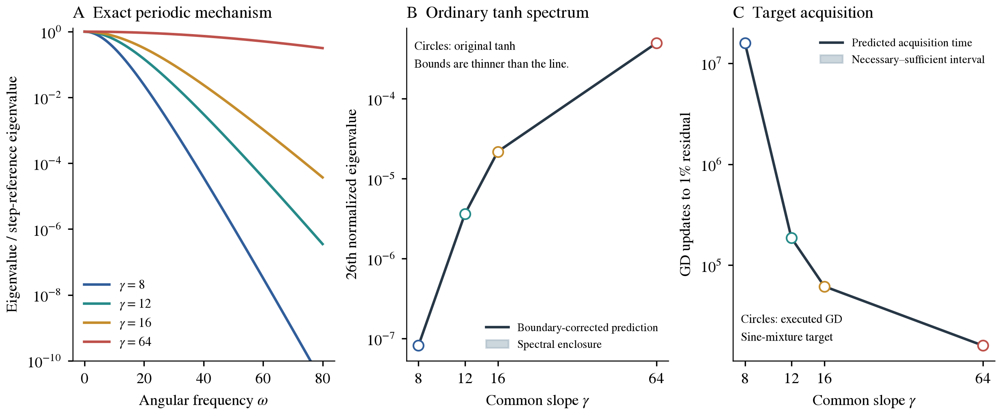
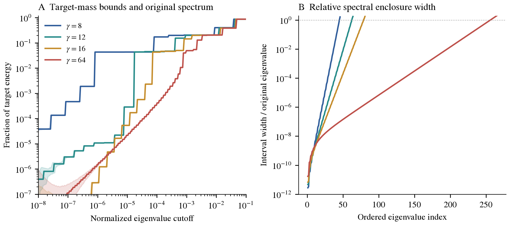

# How a common tanh slope controls the readout spectrum

[PDF](gamma_uniform_grid_theorem.pdf) · [LaTeX](gamma_uniform_grid_theorem.tex) · [Periodic-grid proofs](gamma_uniform_periodic_lemmas.md)

Small gamma smooths every feature before the readout sees it. On a periodic, uniform geometry, this smoothing multiplies each frequency's learning rate by an explicit factor squared. That statement is exact: the frequencies are the kernel's independent learning directions. On a finite interval, ordinary tanh has additional boundary effects. We show how to retain those effects explicitly as a finite correction, while bounding the remaining error. This gives a gamma-dependent spectral construction with a controllable error, rather than a single worst-case inequality whose slack grows unchecked.

There are two different conclusions. The periodic theorem provides a closed frequency-by-frequency law. The ordinary-tanh theorem provides a diagonalizable reference plus a signed low-rank correction; predicting its individual eigenvalues still involves a finite spectral calculation. The correction is not assumed negligible, and its rank must be reported. Neither uniform spacing nor this proof implies that every target learns faster as gamma increases on the finite interval.

The numerical check below retains that correction. At gamma 8, it recovers the observed slow target energy with a narrow enclosure and predicts the executed 15.8-million-update acquisition time. The 26th normalized eigenvalue has a relative enclosure width of about 0.00171%, compared with the earlier simplified upper bound being approximately 32,000 times its true value. These spectral evaluations use a disclosed floating-point allowance; the primary timing intervals additionally follow from existing independent interval certificates. The useful finite result is the corrected spectral theorem, not the bare periodic formula or a rank-shift bound with the correction discarded.

**Symbols and normalization.** Eigenvalues are denoted by $\mu$ or $\nu$; $\lambda$ denotes dimensionless bandwidth, not an eigenvalue.

| Symbol | Meaning |
|---|---|
| $\gamma>0$ | Common, frozen tanh slope |
| $L$ | Physical interval length; reference period is $2L$ |
| $N,h=L/N$ | Number of core centers and their spacing |
| $q,m=qN+1$ | Integer sampling oversampling factor and number of finite-interval inputs |
| $W$ | Total number of tanh features, including any halo centers |
| $J,K=JJ^*$ | Feature matrix normalized by $\sqrt m$, and raw-readout kernel |
| $p_\gamma$ | Smoothed antiperiodic square wave used as a reference |
| $M_\gamma(\omega)$ | Explicit attenuation of frequency $\omega$ |
| $K_0,\widehat K$ | Reference kernel and kernel including retained boundary corrections |
| $B,p$ | Number of exactly treated columns at each boundary, and retained exponential terms |
| $\delta$ | An upper bound on $\|K-\widehat K\|$ |
| $S_K(s)$ | Fraction of target energy in eigenvalues at most $s$ |
| $\eta,n$ | GD step and update count |
| $\lambda=\gamma h$ | Slope measured relative to center spacing |

## 1. The optimization problem is unchanged

For physical target samples $y_i^{\rm phys}$, let $y_i=y_i^{\rm phys}/\sqrt m$. The feature matrix has the bias column $1/\sqrt m$ and columns

$$
J_{ij}=\frac{\tanh(\gamma(x_i-c_j))}{\sqrt m}.
$$

The loss is $\frac12\|Jw-y\|^2$, equal to the original mean squared residual divided by two. We optimize the original readout coefficients $w$, with their ordinary Euclidean metric. Starting from $w_0=0$, the normalized residual is

$$
r_n=(I-\eta K)^n y,\qquad K=JJ^*,\qquad
E(n)=\frac{\|r_n\|}{\|y\|}.
$$

We assume $y\ne0$. Throughout the training statements, choose $\eta>0$ with $\eta\|K\|\le1$ so every spectral component decays without alternating sign. The results concern training residuals on these inputs, not held-out generalization.

A change of coordinates in feature space is permitted only if its metric is retained. For example, with $S_j=\sum_{\ell\le j}w_\ell$, the identity

$$
\sum_{j=1}^{W}w_j\tanh(\gamma(x-c_j))
=S_W\tanh(\gamma(x-c_W))
+\sum_{j=1}^{W-1}S_j
[\tanh(\gamma(x-c_j))-\tanh(\gamma(x-c_{j+1}))]
$$

does not authorize ordinary Euclidean GD in $S$: the original norm is $\sum_j(S_j-S_{j-1})^2$, with $S_0=0$. The construction below works directly with $J$, so this metric issue never becomes an approximation.

## 2. Gamma is an exact smoothing multiplier

### Lemma 1: smoothing a step

Define the probability density

$$
\rho_\gamma(t)=\frac{\gamma}{2}\operatorname{sech}^2(\gamma t).
$$

Then

$$
(\rho_\gamma*\operatorname{sign})(x)=\tanh(\gamma x),
\qquad
\widehat\rho_\gamma(\omega)=M_\gamma(\omega)
=\frac{z}{\sinh z},\qquad
z=\frac{\pi|\omega|}{2\gamma},
$$

where $M_\gamma(0)=1$ by continuity.

**Proof.** The convolution is twice the distribution function of $\rho_\gamma$ minus one, giving tanh. For the Fourier transform, substitute $u=e^{2\gamma t}$ to obtain

$$
\widehat\rho_\gamma(\omega)
=\int_0^\infty\frac{u^{-i\omega/(2\gamma)}}{(1+u)^2}\,du
=\Gamma(1-ia)\Gamma(1+ia)
=\frac{\pi a}{\sinh(\pi a)},\qquad a=\frac{\omega}{2\gamma}.
$$

The middle equality is the beta integral and the last is the gamma reflection identity. The even extension yields the displayed formula. For $z>0$, $z/\sinh z$ decreases because $\sinh z-z\cosh z<0$; hence attenuation increases with gamma at fixed nonzero frequency. Also,

$$
M_\gamma(\omega)=\frac{2ze^{-z}}{1-e^{-2z}}.
$$

Thus high frequency relative to gamma is suppressed exponentially. This is a statement about the feature construction before any target or optimizer is chosen. $\square$

## 3. An exact spectral law under periodic uniform geometry

Let $s$ be the $2L$-periodic square wave equal to $\operatorname{sign}(x)$ on $(-L,L)$, and let $p_\gamma=\rho_\gamma*s$ with the convolution understood through the periodic extension. Its nonzero complex Fourier coefficients are

$$
b_k=\frac{2}{i\pi(2k+1)},\qquad
\omega_k=\frac{(2k+1)\pi}{L},\qquad k\in\mathbb Z,
$$

and

$$
p_\gamma(x)=\sum_{k\in\mathbb Z}b_kM_\gamma(\omega_k)e^{i\omega_k x}.
$$

For positive gamma the coefficients decay exponentially, so the series is absolutely convergent. Notice that $p_\gamma(x+L)=-p_\gamma(x)$: antiperiodic means that a shift by $L$ flips its sign, while a shift by $2L$ returns it unchanged.

### Theorem 2: periodic gamma-to-spectrum law

With centers uniform over a full period and the same uniform sampling measure, define the center-average kernel

$$
\mathcal K_\gamma(x,x')
=\frac1{2L}\int_0^{2L}p_\gamma(x-c)p_\gamma(x'-c)\,dc.
$$

On $L^2([0,2L],dx/(2L))$, each odd Fourier wave has eigenvalue

$$
\mu_k(\gamma)=|b_k|^2M_\gamma(\omega_k)^2.
$$

All nonconstant even Fourier waves have eigenvalue zero. Adding a unit bias gives the constant wave eigenvalue one and leaves the other modes unchanged. If total feature mass is $a$ instead of one, multiply the nonbias eigenvalues by $a$; in particular, a raw finite-width readout is not width-normalized without explicitly introducing that factor.

**Proof.** Substitute the absolutely convergent Fourier expansions in the kernel. Integration over $c$ eliminates unequal frequencies. The kernel becomes

$$
\mathcal K_\gamma(x,x')
=\sum_k|b_k|^2M_\gamma(\omega_k)^2
e^{i\omega_k x}e^{-i\omega_k x'}.
$$

Orthogonality under the input measure gives the eigenvalues. The square wave has no even Fourier coefficients. The constant bias is orthogonal to every nonconstant Fourier wave. $\square$

This theorem is exact, not a norm upper bound. For a single accessible Fourier target, GD has the exact relative residual

$$
E(n)=(1-\eta\mu_k(\gamma))^n.
$$

For $0<\varepsilon<1$, its acquisition time is exactly the smallest integer $n$ with that expression at most $\varepsilon$. When $0<\eta\mu_k<1$, this is

$$
\left\lceil\frac{\log(1/\varepsilon)}{-\log(1-\eta\mu_k(\gamma))}\right\rceil.
$$

A cap $\gamma\le\Gamma$ yields $\mu_k(\gamma)\le|b_k|^2M_\Gamma(\omega_k)^2$. At a fixed stable step, this gives a lower bound on acquisition time. A target with energy in several specified frequencies gives a sum of their exact decays. Missing even modes produce an irreducible residual, not slow convergence. These distinctions are necessary whenever periodic square waves are used as the illustrative model.

The remainder of this note transfers the explicit frequency mechanism to the ordinary finite-interval tanh dictionary. It does not identify that dictionary with the periodic population model.

## 4. The finite uniform core is diagonalizable, with aliases retained

Assume $N,q$ are positive integers, $h=L/N$, inputs $x_i=ih/q$ for $i=0,\ldots,qN$, and core centers $c_j=jh$ for $j=0,\ldots,N-1$. Additional centers may be included and will be treated explicitly. The ordinary-tanh matrix includes the bias.

For the reference matrix $J_0$, use $p_\gamma(x_i-c_j)/\sqrt m$ on the first $qN$ sample rows and the $N$ core columns. Set its final row, additional columns, and bias column to zero. Padding with zeros keeps $J_0$ the same size as the actual $J$; it does not change the reference's nonzero spectrum.

### Proposition 3: exact finite alias blocks

Reorder the first $qN$ rows as $i=q\ell+s$, with $\ell=0,\ldots,N-1$ and $s=0,\ldots,q-1$. Define

$$
T_s[\ell,j]=p_\gamma((\ell-j)h+sh/q),
\qquad
Q[\ell,k]=N^{-1/2}e^{i(2k+1)\pi\ell/N}.
$$

Then $Q$ is unitary and

$$
T_s=Q\operatorname{diag}(t_{s,0},\ldots,t_{s,N-1})Q^*,
$$

where the exact alias formula is

$$
t_{s,k}=N\sum_{a\in\mathbb Z}
b_{k+aN}M_\gamma(\omega_{k+aN})
e^{i\omega_{k+aN}sh/q}.
$$

Consequently $K_0=J_0J_0^*$ decomposes into $N$ rank-at-most-one $q\times q$ blocks

$$
\frac1m\,t_k t_k^*,\qquad
t_k=(t_{0,k},\ldots,t_{q-1,k})^T,
$$

and a zero block. Its possible nonzero eigenvalues are

$$
\nu_k(\gamma)=\frac1m\sum_{s=0}^{q-1}|t_{s,k}|^2.
$$

**Proof.** Antiperiodicity makes $T_s$ skew-circulant: wrapping a center difference by $N$ grid spacings changes the sign. Substituting a column of $Q$ in $T_sQ$ gives an eigenvector with eigenvalue

$$
\sum_{\ell=0}^{N-1}p_\gamma(\ell h+sh/q)e^{-i(2k+1)\pi\ell/N}.
$$

Insert the Fourier series. The finite geometric sum equals $N$ precisely when the Fourier index equals $k$ modulo $N$, and otherwise vanishes. This gives the alias formula. Applying $Q^*$ independently to each phase group and grouping equal $k$ yields the stated blocks. The normalization is $m=qN+1$, even though the reference's last row is zero. $\square$

For $q=1$, the aliases are added before taking the squared magnitude. They cannot be replaced by a sum of squared coefficients. With oversampling, each block retains the relative phases between the sample groups. Gamma is explicit in every term, but monotonicity of an individual aliased finite eigenvalue is not implied by the monotonicity of each attenuation factor.

An implementation may evaluate $p_\gamma$ through its image formula below instead of truncating Fourier modes. These are two ways of evaluating the same reference. Any truncation used in either route must be added to the final error budget.

## 5. Ordinary tanh equals the reference plus controlled boundary terms

### Lemma 4: an exact image representation

For real $d$,

$$
p_\gamma(d)=\tanh(\gamma d)
+\sum_{\ell=1}^{\infty}(-1)^\ell
[\tanh(\gamma(d-\ell L))+\tanh(\gamma(d+\ell L))].
$$

The paired series is locally uniformly convergent. For $|d|<L$, it also gives

$$
\tanh(\gamma d)-p_\gamma(d)
=2\sum_{r=1}^{\infty}\frac{(-1)^{r-1}}{1+e^{-2r\gamma L}}
[e^{-2r\gamma(L-d)}-e^{-2r\gamma(L+d)}].
$$

**Proof.** In the sense of distributions, the derivative of the periodic square wave is $2\sum_{\ell\in\mathbb Z}(-1)^\ell\delta_{\ell L}$. Convolution with $\rho_\gamma$ gives $\sum_\ell(-1)^\ell\gamma\operatorname{sech}^2(\gamma(d-\ell L))$. This is also the derivative of the paired image series. Both functions vanish at $d=0$, so they agree. Exponential decay of the paired tails justifies local convergence and differentiation.

For $a>0$, the convergent geometric expansion is

$$
\tanh(\gamma a)=1-2\sum_{r=1}^{\infty}(-1)^{r-1}e^{-2r\gamma a}.
$$

In each image pair, $\ell L-d$ and $\ell L+d$ are positive when $|d|<L$. Substitute their expansions and sum $\sum_{\ell\ge1}(-1)^{\ell+1}e^{-2r\gamma\ell L}=e^{-2r\gamma L}/(1+e^{-2r\gamma L})$. Absolute convergence on compact subsets of $(-L,L)$ permits the interchange, proving the formula. $\square$

### Lemma 5: finite-rank boundary approximation and its tail

Choose an integer $B$ with $1\le B<N/2$ and a nonnegative integer $p$. Treat core columns $j<B$ and $j\ge N-B$ exactly. On the other core columns and the first $qN$ rows, retain the first $p$ terms of Lemma 4. Define the remainder allowance

$$
\epsilon_{B,p}(\gamma)
=\frac{4e^{-2(p+1)\gamma Bh}}
{1-e^{-2(p+1)\gamma L}}.
$$

Then every remaining unnormalized feature entry has error at most $\epsilon_{B,p}(\gamma)$.

**Proof of the tail bound.** A tanh expansion through $p$ terms has remainder with absolute value at most $2e^{-2(p+1)\gamma a}$: this follows directly from the finite geometric identity, whose exact remainder has an additional denominator $1+e^{-2\gamma a}\ge1$. Truncate each positive-distance tanh in each image pair before summing images. For interior columns, $|d|\le L-Bh$, so

$$
\begin{aligned}
|\mathrm{remainder}|
&\le2\sum_{\ell=1}^{\infty}
\big[e^{-2(p+1)\gamma(\ell L-d)}
+e^{-2(p+1)\gamma(\ell L+d)}\big]\\
&\le4\sum_{\ell=1}^{\infty}
e^{-2(p+1)\gamma((\ell-1)L+Bh)}
=\epsilon_{B,p}(\gamma).
\end{aligned}
$$

Summing the retained terms over images gives exactly the first $p$ terms in Lemma 4. The argument therefore bounds the claimed approximation, rather than a different truncation. $\square$

Each retained term separates into a function of $x$ times a function of $c$:

$$
e^{-2r\gamma(L-d)}-e^{-2r\gamma(L+d)}
=e^{-2r\gamma(L-x)}e^{-2r\gamma c}
-e^{-2r\gamma x}e^{-2r\gamma(L-c)}.
$$

All four factors are at most one for $x,c\in[0,L]$. This form avoids overflow and proves the rank bound without changing the parameter metric.

Construct $\widehat J$ by applying these core corrections to $J_0$, restoring the boundary columns exactly, adding every noncore tanh column and the bias exactly, and restoring the last input row exactly. If $e=W-N$ is the number of noncore tanh columns, then

$$
\widehat J=J_0+UV^*,\qquad
\operatorname{rank}(UV^*)\le r_f:=2B+2p+e+2.
$$

Here $2B$ accounts for exactly corrected core columns, $2p$ for the separable exponential terms, $e+1$ for additional features and bias, and one for the last row. This is an upper bound, not a claim that all these components are independent. Masks restricting the exponential terms to interior columns and the first $qN$ rows preserve their rank bound. Endpoint corrections are applied last.

There are at most $N-2B$ columns with approximation error. After normalization,

$$
\|J-\widehat J\|
\le\|J-\widehat J\|_F
\le\epsilon_J:=\sqrt{N-2B}\,\epsilon_{B,p}(\gamma).
$$

Since every original feature, including bias, has absolute unnormalized value at most one, $\|J\|\le\sqrt{W+1}$. Therefore

$$
\|K-\widehat K\|\le
\delta:=2\sqrt{W+1}\epsilon_J+\epsilon_J^2,
\qquad \widehat K=\widehat J\widehat J^*.
$$

The proof is the expansion of $\widehat J\widehat J^*-JJ^*$ and the triangle inequality. For fixed $B>0$ and gamma, this bound tends geometrically to zero as $p$ increases. It bounds analytic truncation, not floating-point error. Numerical evaluation of the reference, factorization, or eigensolver requires its own error accounting if a certified numerical enclosure is claimed.

## 6. The finite-interval spectral theorem

### Theorem 6: explicit bulk, retained boundary correction, and spectral enclosures

Under the uniform geometry above,

$$
K=K_0+ZHZ^*+E,\qquad \|E\|\le\delta,
$$

where the bulk spectrum of $K_0$ is given by Proposition 3 and

$$
Z=[J_0V,U],\qquad
H=\begin{bmatrix}0&I\\I&V^*V\end{bmatrix}.
$$

The correction is signed Hermitian and has rank at most $r_b=2r_f$. It need not be positive semidefinite, even though both $K$ and $\widehat K=K_0+ZHZ^*$ are positive semidefinite.

Let $\mu_j$, $\widehat\mu_j$, and $\nu_j$ be the eigenvalues of $K$, $\widehat K$, and $K_0$ in decreasing order, including zeros. Then

$$
|\mu_j-\widehat\mu_j|\le\delta.
$$

For indices for which both shifted indices exist,

$$
(\nu_{j+r_b}-\delta)_+\le\mu_j
\le\nu_{j-r_b}+\delta.
$$

The same statements hold with a sharper known rank in place of $r_b$.

**Proof.** Expand $(J_0+UV^*)(J_0+UV^*)^*$:

$$
\widehat K-K_0
=J_0VU^*+UV^*J_0^*+U(V^*V)U^*=ZHZ^*.
$$

Its rank is at most the number of columns of $Z$. The preceding lemma bounds the remaining operator error. The variational min–max characterization gives Weyl's norm bound. Intersecting a candidate min–max subspace with the nullspace of the rank-$r_b$ correction reduces its dimension by at most $r_b$; applying this once to the upper bound and once to the lower bound gives the rank-interlacing inequalities. Finally use nonnegativity of $K$. $\square$

The index-shift inequalities can be conservative. To keep the boundary information, diagonalize the signed low-rank update instead. In a basis diagonalizing $K_0$, write $D=\operatorname{diag}(\nu_j)$ and $\overline Z$ for the transformed correction factors. Away from the poles $z=\nu_j$, the matrix determinant lemma gives

$$
\det(\widehat K-zI)
=\det(D-zI)
\det\!\left(I+H\overline Z^*(D-zI)^{-1}\overline Z\right).
$$

The second determinant has dimension at most $2r_f$. At a pole, the product must be interpreted by continuity or handled by deflation; a root search that simply skips poles is not a complete eigensolver. Unchanged eigenvectors orthogonal to the correction must also be retained. The representation is exact for $\widehat K$ and supplies a structured finite problem, not an assertion that every eigenvalue has a short scalar closed form.

**Coefficient-space version and compressed correction.** When there are fewer features than inputs, use the coefficient Gram matrix $G=J^*J$. It has exactly the same positive eigenvalues as $K$; the remaining dimensions contribute zeros. With $G_0=J_0^*J_0$,

$$
\widehat G=\widehat J^*\widehat J
=G_0+Z_cB_cZ_c^*,\qquad
Z_c=[J_0^*U,V],\qquad
B_c=\begin{bmatrix}0&I\\I&U^*U\end{bmatrix}.
$$

This follows by the same Gram expansion. The feature-error estimate also gives $\|G-\widehat G\|\le\delta$. Eigenvalues can therefore be enclosed in coefficient space without forming the much larger sample kernel. Target projections still live in sample space and must be recovered, for example, from singular vectors of $\widehat J$; coefficient eigenvalues alone do not supply them.

Diagonalize the Hermitian correction $\widehat G-G_0$ on its range. Retain the eigenpairs whose signed eigenvalues satisfy $|s_\ell|>\tau$, giving orthonormal columns $Q_c$ and $\Sigma=\operatorname{diag}(s_\ell)$. Discarding all remaining correction eigenpairs has operator error at most $\tau$ in exact arithmetic. Thus

$$
G_{\rm comp}=G_0+Q_c\Sigma Q_c^*,\qquad
\|G-G_{\rm comp}\|\le\delta+\tau.
$$

The correction eigenvalues are signed: truncating by magnitude, rather than retaining only positive terms, is essential. Numerical compression error is additional to this exact-arithmetic allowance.

In a basis diagonalizing $G_0$, call its diagonal matrix $D_c$ and the transformed retained columns $\overline Q_c$. For a threshold $t$ away from the diagonal entries of $D_c$, define $n_-(A)$ as the number of strictly negative eigenvalues of a Hermitian matrix $A$. Then

$$
\begin{aligned}
n_-(G_{\rm comp}-tI)
={}&n_-(D_c-tI)\\
&+n_-\!\left(-\Sigma^{-1}
-\overline Q_c^*(D_c-tI)^{-1}\overline Q_c\right)
-n_-(-\Sigma^{-1}).
\end{aligned}
$$

**Proof of the count.** Form the block Hermitian matrix with diagonal blocks $D_c-tI$ and $-\Sigma^{-1}$ and off-diagonal block $\overline Q_c$. Eliminating the lower block by a congruence gives the inertia of $-\Sigma^{-1}$ plus that of $G_{\rm comp}-tI$. Eliminating the upper block gives the inertia of $D_c-tI$ plus that of $-\Sigma^{-1}-\overline Q_c^*(D_c-tI)^{-1}\overline Q_c$. Equating negative counts proves the identity. $\square$

The count gives the number of compressed eigenvalues below $t$. Combined with the allowance $\delta+\tau$, it can bracket true spectral thresholds using a matrix whose size is the retained correction rank. Thresholds at poles require separate treatment; near-zero numerical pivots or unresolved inertia do not constitute a certificate. This representation does not imply that every plotted residual forecast was obtained from a small secular solve: the full corrected forecast can instead use the SVD of $\widehat J$, while the small inertia problem independently checks selected spectral enclosures.

Gamma remains visible in the bulk attenuation and in the boundary factors. Increasing $p$ improves the enclosure while increasing correction rank. For a given experiment, report both quantities: small spectral error alone does not establish a compact explanatory theorem if almost all dimensions have been retained.

## 7. Target energy can be bounded without isolating every eigenvector

Eigenvalues alone do not determine which modes a given target needs. Define the cumulative slow-mode energy

$$
S_K(s)=\frac{\|\mathbf1_{(-\infty,s]}(K)y\|^2}{\|y\|^2}.
$$

For a positive semidefinite kernel, this includes the nullspace when $s\ge0$. Define $S_{\widehat K}$ similarly. We can compare these quantities with a chosen buffer around the cutoff; no assumption of a gap between every neighboring pair of eigenvalues is needed.

### Theorem 7: buffered target-energy bounds

For any $g>0$ and real $s$,

$$
\left(\sqrt{S_{\widehat K}(s-g)}-\frac\delta g\right)_+^2
\le S_K(s)
\le
\min\!\left\{1,
\left(\sqrt{S_{\widehat K}(s+g)}+\frac\delta g\right)^2\right\}.
$$

**Proof.** Let $P=\mathbf1_{(-\infty,s]}(K)$ and $Q=\mathbf1_{(-\infty,s-g]}(\widehat K)$. On their restricted ranges, the operator $X=(I-P)Q$ solves a Sylvester equation

$$
K_{>s}X-X\widehat K_{\le s-g}
=(I-P)(K-\widehat K)Q.
$$

The two restricted spectra are separated by at least $g$. After shifting both by $s-g$, the integral solution uses a decaying exponential on the first range and a nonexpanding exponential on the second. Its norm is at most

$$
\delta\int_0^\infty e^{-gt}\,dt=\delta/g.
$$

Hence

$$
\|Qy\|\le\|QPy\|+\|Q(I-P)y\|
\le\|Py\|+(\delta/g)\|y\|,
$$

which gives the lower bound. For the upper bound take $Q_+=\mathbf1_{(-\infty,s+g]}(\widehat K)$. The same separated-spectrum argument bounds $\|P(I-Q_+)\|\le\delta/g$, and

$$
\|Py\|\le\|Q_+y\|+(\delta/g)\|y\|.
$$

Normalize, square, and use $S_K(s)\le1$. $\square$

If there is much target energy near the chosen cutoff, a broad buffer can lose information; if the buffer is too narrow, $\delta/g$ can be large. This is an explicit tradeoff, not an assumed eigengap. The theorem uses the corrected reference's target projections. It does not claim a target-independent lower bound on slow energy for all functions.

## 8. From the spectral statement to acquisition time

### Corollary 8: necessary times from slow target energy

Suppose $\eta\|K\|\le1$, $0\le\eta s<1$, and $S_K(s)\ge a$. Then

$$
E(n)^2\ge a(1-\eta s)^{2n}.
$$

If $a>\varepsilon^2$ and $s>0$, reaching relative residual $\varepsilon$ requires

$$
n\ge
\left\lceil\frac{\log(\sqrt a/\varepsilon)}{-\log(1-\eta s)}\right\rceil.
$$

Use the lower bound from Theorem 7 for $a$. For $s=0$, positive target energy in the nullspace never decays; if $a>\varepsilon^2$, the threshold is unreachable. For $a\le\varepsilon^2$, this particular cutoff provides no positive necessary time.

**Proof.** Expand the residual in the orthonormal eigenbasis of $K$. On eigenvalues at most $s$, each squared contraction factor is at least $(1-\eta s)^{2n}$. Sum the target energy in these modes and solve the inequality. $\square$

### Corollary 9: full corrected forecasts and their error envelope

Let

$$
\widehat E(n)=\frac{\|(I-\eta\widehat K)^n y\|}{\|y\|}.
$$

If $\eta(\|\widehat K\|+\delta)\le1$, both kernels have nonnegative contraction factors and

$$
|E(n)-\widehat E(n)|\le n\eta\delta.
$$

**Proof.** The telescoping identity for powers writes their difference as a sum of $n$ products, each containing one factor $\eta(K-\widehat K)$ and otherwise norm-at-most-one factors. The operator difference is at most $n\eta\delta$. Apply it to $y$ and use the reverse triangle inequality. $\square$

Therefore $\widehat E(n)+n\eta\delta\le\varepsilon$ certifies acquisition by $n$, while $\widehat E(n)-n\eta\delta>\varepsilon$ certifies that acquisition has not occurred by $n$. The true residual is monotone under the stated step condition. The bound need not be useful at arbitrarily large $n$; choose the truncation for the time scale being tested.

If the step is instead curvature-normalized, $\eta=\kappa/\|K\|$ with $0<\kappa\le1$, it varies with gamma. Do not compare such runs as if their step were fixed. If $\widehat L=\|\widehat K\|>\delta$, then

$$
\left\|\kappa\frac K{\|K\|}
-\kappa\frac{\widehat K}{\widehat L}\right\|
\le\frac{2\kappa\delta}{\widehat L-\delta}.
$$

This follows by adding and subtracting $\kappa\widehat K/\|K\|$ and using $|\|K\|-\widehat L|\le\delta$. The same telescoping proof applies with this normalized rate error in place of $\eta\delta$. Alternatively, when the actual step is supplied as part of an archived run, use that step directly.

These are exact-arithmetic results with a stated perturbation allowance. Numerical spectra and residuals close to machine precision require separate numerical error bounds before their envelopes can be called certified.

## 9. What scaling gamma with width actually preserves

At a fixed grid-relative frequency $\theta=\omega h$, the attenuation argument is

$$
z=\frac{\pi|\theta|}{2\gamma h}
=\frac{\pi|\theta|}{2\lambda}.
$$

Thus keeping $\lambda=\gamma h$ fixed preserves the smoothing attenuation at that relative frequency. With a fixed interval and $h=L/N$, this requires gamma proportional to $N$. If $\gamma h\to0$ and $\theta\ne0$ is fixed, then

$$
M_\gamma(\theta/h)^2
=\frac{4z^2e^{-2z}}{(1-e^{-2z})^2}\longrightarrow0.
$$

This identifies an additional exponential smoothing penalty in the exact periodic rates. It does not remove the frequency dependence of $b_k$, raw width factors, aliases, boundary corrections, or the optimizer's step. Consequently it does not assert width-independent learning times. It also does not apply to a fixed physical target frequency in the same way: for that frequency, $\theta=\omega h$ shrinks as the grid is refined.

## 10. Numerical evaluation

### Protocol and what is computed

The primary check uses the archived uniform geometry: $L=2$, $N=512$, $q=16$, and $m=8193$. Its 512 core centers, terminal center at $L$, and 23 halo centers on each side give $W=559$ ordinary tanh features plus bias. Inputs include both endpoints. The four common slopes are 8, 12, 16, and 64. Each saved step has $\eta\|K\|\simeq0.5$. All raw readouts start at zero.

The five targets are $\sin(2\pi x)+\tfrac12\sin(6\pi x)+\tfrac14\sin(10\pi x)$, $\exp(\sin(3\pi x))$, $(1+25x^2)^{-1}$, $\sqrt5x^2$, and $\sqrt2\sin(2\pi x)$. These formulas use the original coordinate $x\in[-1,1]$; translating inputs and centers gives the theorem's $[0,L]$ coordinates without changing their differences or the target samples. The first is the primary target shown in the acquisition figure. Two additional uniform geometries use $N=128,256$, the same oversampling, and $\lceil\sqrt N\rceil$ halo centers on each side. This gives 12 dictionaries and 60 target–dictionary cases. The added widths have independent spectral references, not new executed GD trajectories. No held-out generalization claim is made.

The bulk is synthesized from the half-odd Fourier coefficients and their alias blocks. Its Fourier tail is bounded below $10^{-20}$ per feature. For each geometry and gamma, a finite scan over $B=1,\ldots,N/2-1$ and $p=1,\ldots,256$ minimizes $2B+2p$ subject to an analytic kernel-tail bound below $10^{-15}$. This selection uses the proved bounds, not the original eigenvalues or training observations. The primary cases use $(B,p)=(23,29),(20,22),(15,22),(8,10)$.

After adding exact boundary columns, halo columns, bias, and the endpoint row, we compute a rectangular SVD of $\widehat J$ for the full target weights and residual curve. This is an SVD of the newly constructed model; it is not the original tanh SVD. Separately, we construct the signed coefficient-Gram correction, compress its eigenvalues below $10^{-12}$ in absolute value, and include the discarded norm and reconstruction defect in the spectral allowance. The compressed secular calculation independently checks eigenvalue counts at normalized cutoffs $10^{-7},10^{-6},10^{-5}$, matching all 36 reference counts across the 12 dictionaries. We do not claim that every plotted forecast was calculated solely with the small secular solve.

<figure>
  
  <figcaption><strong>Figure 1. Gamma's spectral mechanism carried through the actual finite geometry.</strong> A is the exact periodic multiplier-squared law, shown continuously in frequency; it is not an assertion that ordinary-tanh modes are individual waves. B compares the 26th normalized eigenvalue of the original tanh kernel (circles) with the boundary-corrected prediction and its spectral enclosure. C compares the primary target's executed GD acquisition times (circles) with necessary–sufficient intervals from the constructed model. All three panels use four slopes. The enclosures in B are narrower than the plotted line; their relative widths are quantified below. Numerical spectral bounds use the disclosed arithmetic sensitivity allowance. The primary timing intervals in C contain independently certified archived intervals.</figcaption>
</figure>

### What is now tight, and what remains a calculation

Under the disclosed FP64 sensitivity allowance, the gamma-8 26th normalized eigenvalue is enclosed by $[8.1417184,8.1418574]\times10^{-8}$, against the reference value $8.1417879\times10^{-8}$. Its relative interval width is $0.00171\%$. At gamma 64 the corresponding interval is $[4.978118981,4.978119066]\times10^{-4}$. Dividing these intervals bounds the gamma-64/gamma-8 rate ratio by approximately $[6114.23,6114.34]$, compared with the measured $6114.28$. These are statements about the same ordered eigenvalue at the two slopes, not a claim that its eigenvector is unchanged.

The nominal kernel correction rank bounds are 306, 266, 246, and 170. After the stated numerical compression, the retained signed ranks are 26, 26, 26, and 22, respectively, in a 560-dimensional coefficient space. Discarded eigenvalues are included in the error allowance. The reduced ranks are measured properties of this correction, not a theorem that the correction always has rank 26. The full analytic construction remains valid without this compression.

For the primary target, the four necessary–sufficient intervals are $[15{,}767{,}081,15{,}829{,}763]$, $[186{,}056,186{,}059]$, $[61{,}792,61{,}793]$, and $[16{,}013,16{,}013]$. They contain the executed hits $15{,}798{,}313$, $186{,}057$, $61{,}792$, and $16{,}013$. The gamma-8 interval has width $0.397\%$ of the observed time, and the predicted gamma-8/gamma-64 slowdown lies in $[984.64,988.56]$, containing the observed $986.59$.

All 60 cases have finite acquisition intervals enclosing their independent spectral-reference hits. All 19 available archived GD hits are enclosed; the quadratic/gamma-12 trajectory was stopped at 200,000 updates, so its later reference hit is not presented as an executed result. Across the sampled residual curves of all 60 cases, the maximum discrepancy between constructed and original models is $3.42\times10^{-14}$ in relative residual. This is a numerical comparison, not a certificate for every update.

### The target-energy bound is informative at the relevant rate

At normalized cutoff $t=\eta s=10^{-6}$, the buffered theorem gives a gamma-8 slow-energy fraction between $4.333177\%$ and $4.333388\%$, containing the reference $4.333330\%$. Buffers are selected by maximizing the lower and minimizing the upper proved expressions over declared grids, without consulting the true mass. This contrasts with the earlier simplified theorem's zero lower bound at the same cutoff.

That lower energy bound alone gives a necessary time of 3,035,735 updates to reach 1% relative residual. Retaining all rates and target weights yields the much tighter 15.8-million-update interval above. Thus the finite theorem now quantifies both a relevant slow spectral component and its optimization consequence. It does so using the corrected spectral model, not a scalar gamma cap alone.

<figure>
  
  <figcaption><strong>Figure 2. Target alignment and the limits of spectral resolution.</strong> A shows primary-target slow-energy fractions from the original tanh spectrum, with the constructed model's buffered lower and upper envelopes shaded. B shows spectral interval width divided by the original eigenvalue, ordered from largest to smallest; only values exceeding the allowance are plotted. Very small modes can have broad relative enclosures even when the relevant modes are sharply resolved. These are FP64 evaluations of the proved formulas with an explicit arithmetic allowance, not independent interval certificates for the spectra.</figcaption>
</figure>

### Arithmetic, independent checks, and reproducibility

The exact-arithmetic kernel remainders in the primary construction are all below $8\times10^{-16}$. Floating-point rounding dominates those remainders. We therefore add the explicit feature-level sensitivity allowance

$$
e_{\rm fp}=64u\sqrt{W+1}(1+\gamma L+\log_2N)
+r_{\rm SVD}+\sigma_{\max}o_{\rm SVD},
$$

where $u$ is machine epsilon, $r_{\rm SVD}$ is the Frobenius reconstruction residual, and $o_{\rm SVD}$ is the Frobenius orthogonality residual of the left singular vectors. The formula is a heuristic arithmetic allowance, not a rigorous enclosure of transcendental evaluation and FFT rounding. It is separate from the proved analytic remainder. Spectral intervals additionally include the discarded signed-correction norm and the measured Gram reconstruction residual.

Multiplying $e_{\rm fp}$ by ten leaves all 60 cases with finite time intervals. The primary gamma-8 interval widens to $[15{,}495{,}367,16{,}123{,}116]$ and still resolves the large learning delay. The four primary intervals reported above contain the existing independently certified Arb endpoint intervals, so their validity for the nominal real tanh problem also follows by monotonicity. This inherited endpoint validation does not certify the new spectral numbers or the heuristic allowance.

Independent checks covered 1,000 perturbed PSD examples for buffered target mass, 500 signed secular-count examples, and 27 finite constructions varying grid parity, oversampling, slope, and interval length, without violations. Durable focused tests also compare iterative raw-readout GD against the spectral solution and verify that neighboring differences preserve the original parameter metric. The fixed-bandwidth check uses $N=128,256,512$ and $\lambda=0.25,1,4$; the multiplier at $\theta=\pi/4$ is unchanged with width at fixed $\lambda$, as the formula predicts.

The [numerical record](../results/checkpoint_D_optimizers/expD36_frozen_gamma_probe/full_sweep/refinements/uniform_grid_spectrum/summary.json) stores every case, source hashes, truncation choices, ranks, spectral intervals, target-energy curves, and timing checks. Reproduce it from the repository root with `python -m experiments.expD36_frozen_gamma_probe.uniform_grid_analysis`. Compile this note with `latexmk -pdf -outdir=/tmp/gamma-uniform-latex docs/gamma_uniform_grid_theorem.tex`. No new GPU training was used.

## 11. Scope of the result

The periodic result is a sharp gamma-to-spectrum theorem. Its single-mode timing consequences are exact, including the possibility of inaccessible target components. The finite ordinary-tanh result retains the same explicit attenuation mechanism but also retains boundaries; its analytic remainder can be made arbitrarily small at the cost of a larger correction. It makes a structured spectral problem available and bounds transfer to the true kernel. It does not eliminate that spectral problem or guarantee that a low-rank correction remains small in rank at every parameter setting.

All slopes are equal and frozen. Inputs and core centers are equally spaced, with integer oversampling. Additional centers are allowed only because their columns are retained explicitly. Random sampling, nonuniform centers, heterogeneous slopes, trained hidden parameters, and target-independent monotonic acceleration are not established by these statements.
