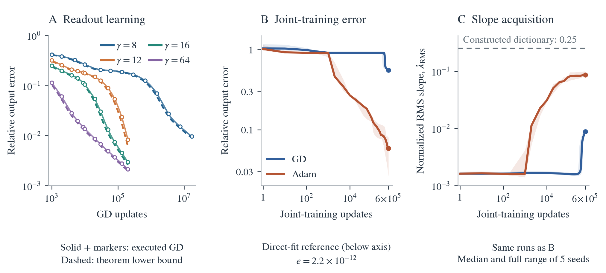
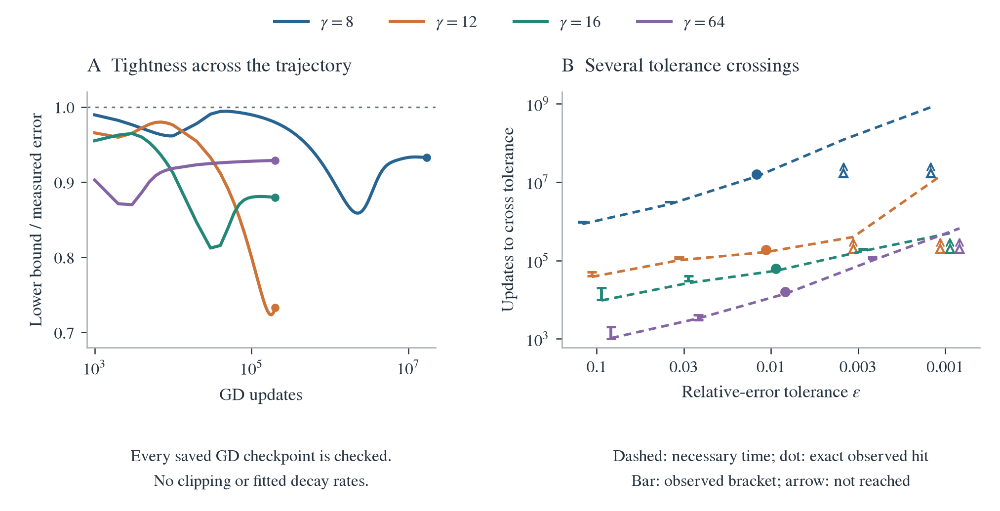

# Paper figure: slope scale and training error

The three panels connect a quantitative frozen-feature prediction to joint-training observations. The theorem lower bound retains **72.3-99.4% of measured output error** across all 1,796 saved GD checkpoints. In a separate, paired joint-training experiment, Adam improves substantially but both optimizers remain far above an accurate fit using a constructed dictionary. Their acquired population slope scales also remain below that dictionary's scale.

<figure>
  
  <figcaption><strong>Small slopes delay readout learning; joint training leaves a precision gap.</strong> See the paper caption below for the experimental conditions and evidence roles.</figcaption>
</figure>

## Paper caption

**Slope scale controls readout learning, while joint training falls short of a constructed reference.** **(A)** Executed frozen-feature GD (solid lines and markers) and theorem-derived output-error lower bounds (dashed), with fixed centers and common slopes $\gamma\in\{8,12,16,64\}$. The bounds use gamma-dependent rate enclosures and actual target projections, without fitting to training trajectories. **(B)** Raw output error during joint GD and Adam training. Lines show seed medians; shading shows the full range of five paired seeds. The same-width constructed dictionary with a directly fitted readout achieves $2.20\times10^{-12}$ error, annotated below the plotted range. **(C)** Normalized RMS slope $\lambda_{\mathrm{RMS}}=h\sqrt{W^{-1}\sum_j a_j^2}$ at the same checkpoints as B; the dashed line marks the constructed dictionary's scale, $0.25$. Error is $\|f-y\|_2/\|y\|_2$ on each experiment's training grid. A uses $W=559$, 8,193 samples and $f_5$; B/C use $W=177$, 2,048 samples and the RMS-normalized $f_7$, where $f_k(x)=\sin(2\pi x)+\tfrac12\sin(6\pi x)+\tfrac14\sin(2k\pi x)$. Bounds are checked FP64 evaluations. The frozen-feature theorem does not assert an Adam convergence law; C's reference is a construction benchmark, not a universal slope threshold.

## Measurements and interpretation

**Panel A.** Features include an output bias and uniformly spaced tanh centers with spacing $1/256$. The readout starts at zero and uses the archived stable step $\eta\mu_1\simeq1/2$. The plotted lower error is

$$
e_{\mathrm{lower}}(n)=\left[\sum_{i\ \mathrm{resolved}}p_i
\bigl(1-\eta\mu_1\overline\rho_i\bigr)^{2n}\right]^{1/2}.
$$

Here $\overline\rho_i$ is the [theorem's upper bound on relative learning rate](gamma_optimizer_access_note.md), and $p_i$ is the actual target energy in finite-kernel eigenvector $i$. Unresolved energy is omitted conservatively. Exact finite-kernel eigenvalues are not substituted for these bounds. The numerical evaluation retains the existing analytic allowances and checked quadrature/arithmetic conventions; it is not an interval-arithmetic certificate.

Every observed checkpoint passes $e_{\mathrm{lower}}\le e_{\mathrm{GD}}$. The gamma-8 archive extends to 17 million updates; the other three extend to 200,000. Display starts at the first saved checkpoint, update 1,000. Markers select checkpoints nearest 13 equally spaced log-update counts; solid segments connect saved observations. The data export retains every checkpoint and the analytically known zero-initialization error. Its approximately $2\times10^{-15}$ target-weight closure discrepancy is recorded separately, without clipping.

**Panels B/C.** Both optimizers train all parameters in $d+\sum_{j=1}^{177}c_j\tanh(a_jx+b_j)$, at learning rate $0.002$, through 600,000 full-batch updates. Adam uses $(\beta_1,\beta_2,\epsilon)=(0.9,0.999,10^{-8})$. The five seeds use paired initial parameters, including random readouts. We re-evaluate exactly 39 saved states per run and convert each state's error to relative norm before taking seed medians. No EMA, minimum-so-far curve, or selected checkpoint is used. Lines connect snapshots; intermediate states are not observed. The plots omit update zero on logarithmic axes, but preserve it in the export. The divisor in C is the reference lattice spacing $h=1/64$, not $2/W$.

At the final checkpoint, median output errors are **0.55385 for GD** and **0.05831 for Adam**; median normalized RMS slopes are **0.008751** and **0.08628**. These observations support a remaining precision gap at the tested budget. RMS slopes do not certify that every neuron satisfies the common-slope hypothesis of A, and B/C alone do not identify the causal mechanism of joint-training stagnation.

**Construction reference.** Fix centers $-1+j/64$, $j=-24,\ldots,152$, and common slope 16, then solve once for the readout and output bias on the same training grid. FP64 SVD least squares uses the prescribed relative cutoff $2048\epsilon_{\mathrm{machine}}$ (rank 138 of 178 columns). The resulting training error is $2.2024\times10^{-12}$; independent midpoint grids of 8,192 and 16,384 samples give $2.3212\times10^{-12}$ and $2.3283\times10^{-12}$. Target normalization remains that of the training grid. This is a direct least-squares capacity witness, not an optimizer trajectory or a formally certified approximation floor.

## Supporting validation

<figure>
  
  <figcaption><strong>Trajectory tightness and secondary tolerance summaries.</strong> Left: lower bound divided by measured error at every saved GD checkpoint. Right: dashed lines show necessary times obtained from the lower bound, dots show per-update recorded exact crossings, capped bars bracket crossings between observed checkpoints, and upward arrows mark thresholds not reached before the run ended. Brackets use monotonicity of the frozen nonoscillatory GD recurrence. Tolerances are illustrative validation summaries, not application requirements. Gamma positions are slightly offset horizontally for readability.</figcaption>
</figure>

Squared relative errors recomputed at all 390 joint snapshots match the archived training MSE to at most $4.45\times10^{-16}$. Raw and curated snapshots agree exactly at their overlapping times, endpoint states match, and GD/Adam initial parameters agree bitwise within each seed. The supporting data also retain independent-grid errors for every state. Full source hashes, conventions, crossing brackets, numerical checks and saved snapshot parameters are in the [evidence bundle](../results/checkpoint_D_optimizers/expD36_frozen_gamma_probe/full_sweep/refinements/paper_training_failure/).

## Reproduction and paper insertion

Run from this checkout. Set `JOINT_ARCHIVE` to the existing D34 `adam_force_extension` directory in the main checkout; no new training is performed.

```bash
python -m experiments.expD36_frozen_gamma_probe.paper_training_failure_data \
  --frozen-root "$PWD/results/checkpoint_D_optimizers/expD36_frozen_gamma_probe/full_sweep" \
  --joint-root "$JOINT_ARCHIVE" \
  --output results/checkpoint_D_optimizers/expD36_frozen_gamma_probe/full_sweep/refinements/paper_training_failure
python -m experiments.expD36_frozen_gamma_probe.paper_training_failure_figure
```

The renderer needs only the committed `figure_data.json`. The [LaTeX fragment](paper_training_failure_figure.tex) includes the main vector PDF and its caption. Both PDFs are 6.75 inches wide with embedded fonts and labels of at least 8 pt. The PNGs are 300 dpi; `output/pdf/paper_training_failure_render.json` records rendering hashes.
