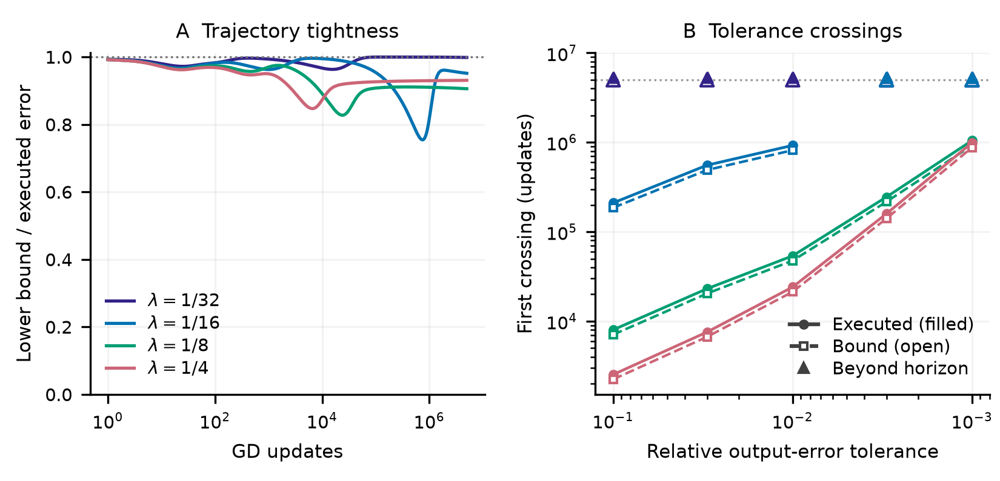
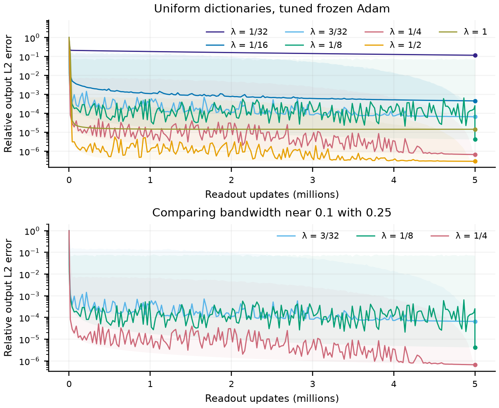

# Frozen-feature validation

The five-million-update comparison tests the theorem against executed GD at every update. At bandwidths $1/32,1/16,1/8,1/4$, the smallest ratios of predicted lower error to actual error are respectively $0.9632,0.7544,0.8275,0.8471$. At the final update, these ratios are $0.9985,0.9516,0.9058,0.9308$. The maximum apparent lower-bound violation is $1.1\times10^{-15}$; the independently evaluated exact-spectrum error differs from executed GD by at most $2.9\times10^{-14}$. Refining the center quadrature changes the predicted error by at most $9.6\times10^{-11}$. These checks support the plotted floating-point calculation over the tested horizons and geometries.

**Theorem validation over five million updates.** Left: the theorem's relative-error lower bound divided by executed GD error; one denotes equality. The curves use a mixed logarithmic/linear display grid, while the extrema reported above inspect every update. Right: first crossings of several output-error tolerances, with necessary times from the theorem shown open and executed crossings filled. Triangles mark cases with no crossing within the horizon; they are not estimated crossing times. Among uncensored comparisons, necessary times are 88.35–88.42% of executed times. No tolerance defines circuit usability in this experiment.

Attainability and optimization are separate. At $\lambda=1/32$, a directly fitted readout has dense-grid relative error $6.24\times10^{-10}$, whereas GD retains error $0.210$ after five million updates. At $\lambda=1/4$, the same GD protocol reaches $3.88\times10^{-4}$. The direct fits retain singular values above $10^{-12}$ times the largest singular value, and the very accurate small-slope fit has readout $\ell_1$ norm about $7.5\times10^3$. Thus it witnesses attainability without claiming that the corresponding coefficients are easy to learn.

**Frozen Adam under the same five-million-update budget.** Each curve uses one complete recipe chosen by final validation error from the shared expanded search. Lines summarize raw errors; shading preserves within-bin extrema. The lower panel isolates $\lambda=3/32,1/8,1/4$. Their final dense-grid relative errors are $6.63\times10^{-5}$, $4.26\times10^{-6}$, and $6.62\times10^{-7}$. Thus $\lambda=3/32\approx0.094$ leaves about 100 times the error of $1/4$, while $1/8$ leaves 6.44 times its error. The selected recipes are cosine Adam at $0.002$, constant Adam at $0.001$, and cosine Adam at $10^{-4}$, respectively. The constant-rate trajectory remains noisy, so its final error is not a sustained level. These are empirical Adam trajectories, not evaluations of the GD bound. The full sweep is not monotone: $\lambda=1$ is worse than $1/2$, consistent with the target-dependent tradeoff in the construction.

The reference bandwidth $1/4$ was fixed before this comparison. It is a useful supplied geometry, not a fitted universal optimum or a threshold that applies to heterogeneous learned features.
