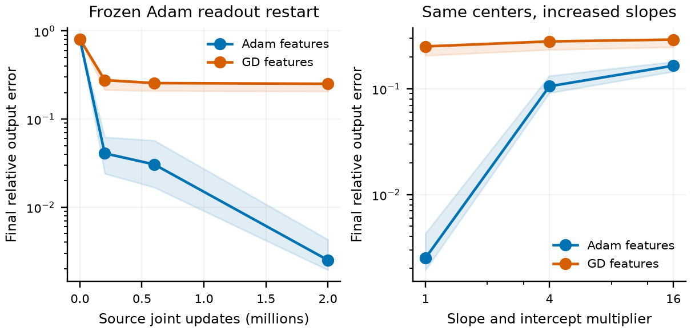
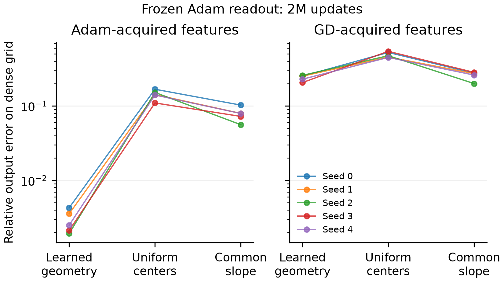
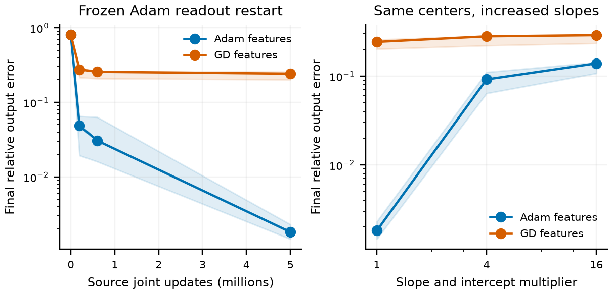

# What the learned geometry controls establish

The controls distinguish access through a frozen readout from changes to the features themselves. At both two and five million source-training updates, joint Adam has learned a useful, co-adapted geometry: its final readout is already close to the accuracy found by the tested readout solvers, and simply increasing its slopes makes that geometry less accurate. This qualifies the joint-training interpretation without changing the theorem for uniform frozen dictionaries.

Here, **source optimizer** means the optimizer that learned the hidden features. **Readout restart** means two million additional Adam updates with those features frozen, starting from zero readout and zero moments. **Direct fit** means an executed FP64 truncated-SVD readout fit, not a certified capacity floor. All follow-up iterative readouts use Adam, including those whose features were acquired by GD.

## Matched controls

All results below concern the primary mixed-sine target, total width 512, and five paired seeds. Training, validation, and dense resolution-check grids have 2,048, 4,096, and 8,192 midpoints. Each restart tests the same eight learning rates, $\{10^{-5}/3,10^{-5},10^{-4},10^{-3},0.002,0.01,0.1,0.3\}$, under constant and full-horizon cosine schedules. One complete recipe is chosen separately for each dictionary by final validation error; no earlier checkpoint replaces its endpoint. These additional updates diagnose feature quality and are not counted as a matched end-to-end training budget. The [experimental protocol](section34_empirical_appendix.md) defines the main comparison.

Direct fits retain singular values larger than $10^{-12}$ times the largest singular value. Cutoffs $10^{-14}$ and $10^{-16}$ are sensitivity checks, not independently selected winners. Errors below are recomputed from the fitted coefficients on the dense grid. Independent columnwise reconstruction verifies the saved final fits; it changes accumulation order, not arithmetic precision on this machine.

## Acquired features improve, but a restarted readout does not close the final gap

For features acquired by Adam, the median restart error falls from $0.808$ at initialization to $0.0408$ at 200k, $0.0305$ at 600k, and $0.00250$ at two million joint updates. For features acquired by GD, the corresponding values are $0.808$, $0.276$, $0.256$, and $0.251$. Thus the feature-learning histories materially change readout access, and the effect is much larger for Adam in this comparison.

At Adam's final features, the restart's $0.002501$ error nearly matches the original joint endpoint, $0.002509$. The direct fit reaches $0.002407$, with median coefficient $L^2$ norm $1.12\times10^7$. Tightening the numerical cutoff to $10^{-14}$ yields $0.002385$ while increasing that norm to $8.22\times10^8$. These fits give little evidence that more accurate optimization of this particular frozen readout would close its gap to the supplied uniform dictionary. They do not establish an irreducible approximation error. For GD-acquired final features, the direct-fit median is $0.217$, below the restart's $0.251$ but still far from high precision.

<figure>
  
  <figcaption>Readout access through acquired features. Source labels identify the joint optimizer; every follow-up readout uses Adam for two million additional updates. Earlier feature snapshots and final slope interventions use the same candidate recipes and final-validation selection rule. Results refer to the primary mixed-sine target and five paired seeds.</figcaption>
</figure>

## Steepening can reduce accuracy

Multiplying both $a_j$ and $b_j$ in $\tanh(a_jx+b_j)$ by four or sixteen preserves its center $-b_j/a_j$. On Adam-acquired final features, these interventions raise median restart error to $0.1056$ and $0.1652$: the median paired increases are $42.2\times$ and $66.0\times$. Direct fits give the same median errors at both $10^{-12}$ and $10^{-14}$ cutoffs, with much smaller coefficient norms than the unscaled fits. On GD-acquired features, restart medians increase to $0.280$ and $0.292$, although direct-fit medians decrease to $0.205$ and $0.156$.

These outcomes separate two effects. A slope change can alter the attainable approximation and the rate at which a particular optimizer accesses it. The modified dictionary does not contain the old dictionary as a subspace; steeper versions of the same features can lose a useful approximation. Consequently, this intervention is not a monotone test of the claim that larger slope always improves a learned model.

## Isolated geometry replacements do not restore high precision

Two additional controls use the final unscaled dictionaries. The first places their exact signed slopes on the uniform reference centers, using one predeclared permutation per source optimizer and seed. The second preserves their learned centers but replaces every slope magnitude by the common construction value $\gamma=0.25/h$, preserving signs. Neither control adds neurons.

The direct-fit medians are $0.1146$ and $0.07885$ for Adam-acquired features, and $0.3735$ and $0.2659$ for GD-acquired features. At cutoff $10^{-14}$, the Adam medians are unchanged; the GD medians are $0.3384$ and $0.2651$. Actual matched Adam readout training reaches medians $0.1422$ and $0.07929$ for the Adam-acquired sources, and $0.4734$ and $0.2724$ for the GD-acquired sources. Neither isolated replacement recovers the original Adam geometry's accuracy. Six of twenty selected recipes lie at the already expanded rate-grid boundary; this limits claims about the best possible optimizer tuning. No further expansion is performed.

<figure>
  
  <figcaption>Executed geometry-replacement controls, paired by seed. Categories show the original learned geometry, uniform centers with its learned slopes, and its learned centers with common slope magnitude $0.25/h$. Left: features acquired by Adam; right: features acquired by GD. Every dictionary, including the original baseline, receives two million additional frozen Adam updates after two million joint updates, with one complete recipe selected by final validation error. The vertical axis is relative error on the dense resolution-check grid. Neither replacement improves median accuracy.</figcaption>
</figure>

Center counts require care. Although 97.85–99.02% of Adam's learned centers lie inside the interval, all 512 centers occupy only 41–49 distinct locations when rounded to 12 decimal places. Most coalesced centers belong to nearly zero-slope units. Among interior units with $h|a_j|\ge0.01$, there are 35–37 distinct centers, occupying 27–29 of 32 equal bins across the domain. Their coverage is considerably better than the unweighted center quantiles suggest. GD has only 5–7 such interior units, occupying 3–7 bins. The threshold and binning describe these parameters; neither defines a theorem assumption or an invariant notion of an active neuron.

The common-slope replacement reactivates many nearly coincident features, so assigning a large slope to every neuron need not supply 512 distinct useful directions. The controls support interpreting the joint-training gap through the acquired **center–slope geometry**, rather than a single slope statistic. The uniform-dictionary theorem remains a quantitative explanation of slope-dependent readout delay under its stated geometry; these experiments do not extend it to arbitrary joint training or prove an Adam convergence law.

## What changes after five million joint Adam updates

The independently checked final Adam comparison selects cosine decay from learning rate $0.05$, with median dense error $0.001815$, a 27.7% reduction from $0.002509$ at two million updates. These are fresh runs with decay over their respective full horizons; improvement is not uniform across seeds. Its five seeds have 50–56 neurons with $h|a_j|\ge0.01$, up from 36–43 at two million updates, and 41–45 neurons at or above $0.1$, up from 25–29. The 99th-percentile slopes reach $0.233$–$0.257$, but only 4–7 of 512 neurons reach the common-dictionary reference $0.25$. An upper-percentile trajectory near that reference does not mean the full width acquired a common slope. These counts show continued acquisition; they do not prescribe how many such neurons are necessary for an arbitrary geometry.

The appreciably sloped interior centers cover 28–31 of 32 bins. Raw center-coalescence counts become unreliable for the remaining units: three seeds have 421–457 subnormal input slopes, making center ratios of their nearly vanished features numerically delicate. Thresholded coverage is therefore the relevant descriptive comparison. The two-million-update interventions above remain controls on their original source dictionaries and are not relabeled as five-million-update experiments.

Repeating the matched readout assays on the actual five-million-update source features gives median error $0.00181474$ for Adam-acquired features and $0.24209$ for GD-acquired features. Each assay still uses **two million additional Adam readout updates**, regardless of source optimizer or source horizon. Relative to the two-million-update source features, the restart medians improve from $0.002501$ and $0.25134$, respectively. For the final Adam source, the restart nearly reproduces its original joint error, $0.00181482$.

Separate interventions on these five-million-update source features again worsen accuracy. Adam-acquired features yield medians $0.09161$ after multiplying slopes and intercepts by four and $0.13893$ after multiplying by sixteen; the median paired increases over their unmodified restarts are $41.7\times$ and $69.2\times$. Every seed worsens. For GD-acquired features, the corresponding medians are $0.27952$ and $0.28804$, again worse in every seed. The adverse slope-intervention result therefore persists at the longer source horizon, rather than relying only on the earlier two-million-update checkpoint.

<figure>
  
  <figcaption>Five-million-update source trajectories, tested with two million additional frozen Adam updates per dictionary. Left: median dense error from features acquired at the indicated source update, with the range across five seeds shaded. Right: the same readout protocol after multiplying slopes and intercepts of the final five-million-update features. Legends identify the source optimizer; all readout restarts use Adam. Earlier snapshots belong to these fresh full-horizon source schedules, not to the previously reported two-million-update source runs.</figcaption>
</figure>

Direct fits to the final five-million-update Adam features reach median dense error $0.0018137$ at cutoff $10^{-12}$, compared with the actual joint error $0.0018148$. The median coefficient norm is $1.89\times10^6$. A $10^{-14}$ cutoff gives $0.0018119$ with norm $3.10\times10^8$; lowering to $10^{-16}$ does not improve the median. Thus the longer horizon improves both the actual output and the accuracy found by the direct fits, while leaving little measured gain from refitting the final readout. This remains evidence about numerical fits, not a lower bound on all possible readouts.

Compact two-million-update results, numerical checks, selected recipes, and input hashes are in [the geometry evidence directory](../output/diagnostics/section34_long_horizon/geometry_2m/); [five-million-update endpoint and direct-fit checks](../output/diagnostics/section34_long_horizon/main_5m/geometry_diagnostics/) are kept separately. The replacement run completed all two million updates in Slurm job 1459, with exit code zero and 356 allocated GPU-seconds. Its raw traces remain in the experiment archive; these figures use reconstructed final outputs.

The five-million-source assays completed in GPU job 1457 (1,000 seconds); CPU analysis 1460 completed in 78 seconds, both with exit code zero. Independent reconstruction from the original joint parameters and saved readout weights verified all 30 final-source cases, including both source optimizers and all three slope multipliers, with maximum absolute dense-error discrepancy $1.67\times10^{-16}$. Raw training traces remain in the run archive.
