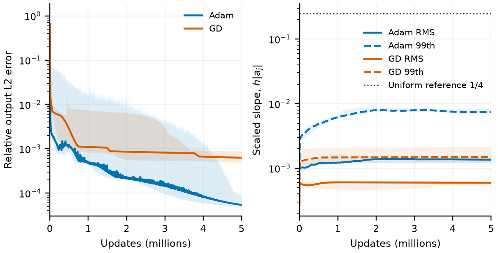

# Quadratic control: the required geometry depends on the target

The quadratic target reaches lower error with substantially smaller learned slopes than the primary mixed-sine target. The frozen-dictionary theorem remains accurate for this target, but the joint-training comparison does not support a universal slope threshold or a permanent training failure.

## Five-million-update joint comparison

We replace the mixed-sine target by $x^2$, normalized by its training-grid RMS, retaining the total width of 512, five paired initializations, FP64 arithmetic, and 2,048 training, 4,096 validation, and 8,192 resolution-check midpoints. The objective and optimizer settings follow the [main protocol](section34_empirical_appendix.md). After a two-million-update rate search and a lower-rate Adam expansion, the best rate for each optimizer and schedule is rerun from initialization for five million updates. Cosine decay spans the entire new horizon. This secondary control retains one rate per schedule, whereas the primary target retains two. One complete recipe per optimizer is selected by median final validation error across all five seeds; neither seeds nor earlier checkpoints are selected separately. The dense grid checks resolution and is not an untouched generalization test.

Adam selects cosine decay from $0.002$ and reaches median dense error $5.434\times10^{-5}$; GD selects constant rate $0.1$ and reaches $6.298\times10^{-4}$. Their median RMS scaled slopes are $0.001357$ and $0.0005944$, and their median neuronwise 99th percentiles are $0.007401$ and $0.001503$. Thus accurate approximation of this smoother target does not require the slope statistics acquired for the mixed sine. The dotted $1/4$ line is only a uniform-dictionary reference.

<figure>
  
  <figcaption>Quadratic joint training, five paired seeds. Left: raw training error; lines show medians across seeds and display bins, and shading retains seed ranges and within-bin extrema. Right: the same runs' RMS and neuronwise 99th-percentile scaled slopes; shading shows seed ranges, with within-bin extrema retained for RMS. The dotted line is a uniform-dictionary reference, not a required slope for this target.</figcaption>
</figure>

The longer horizon matters: Adam's median error falls from $1.633\times10^{-4}$ at two million updates, with all five seeds improving. Across the final fifth of the five-million horizon, its trailing-window median raw error still falls by 35.7%, while its 99th-percentile slope decreases by 1.23%. Error can improve without monotonically increasing these scalar slope summaries. These observations concern the tested budgets, not asymptotic failure.

## Separate two-million-update frozen checks

For uniform dictionaries at $\lambda=1/32,1/16,1/8,1/4$, the theorem lower bound divided by executed GD error never falls below $0.7633,0.7827,0.7852,0.7852$ over the two-million-update trajectory. Endpoint ratios are $0.8453,0.9117,0.9324,0.9347$. The largest apparent violation is $2.0\times10^{-15}$, and the independently evaluated exact-spectrum trajectory differs from executed GD by at most $8.5\times10^{-15}$. Necessary tolerance-crossing times are 62.4–88.0% of executed times among uncensored comparisons. These are floating-point verification results, not interval-arithmetic certificates.

The separate two-million-update frozen Adam sweep reaches dense errors $2.328\times10^{-4}$ at $\lambda=3/32$, $1.399\times10^{-4}$ at $1/8$, and $5.985\times10^{-5}$ at $1/4$. Every selected recipe lies on a boundary of the expanded rate grid, so these are best-in-grid outcomes, not optimizer optima. They are not matched-budget baselines for the five-million-update joint figure.

The [compact evidence](../output/diagnostics/section34_long_horizon/quadratic/) includes selected recipes, seed-level endpoints, plot traces, frozen-bound checks, and the GPU ledger. Jobs 1449, 1450, 1482, and 1483 execute the four fresh five-million-update runs; CPU job 1485 reconstructs and checks their endpoints. Including rate expansion 1442, these extensions consume 3,738 allocated GPU-seconds (62.3 minutes).
