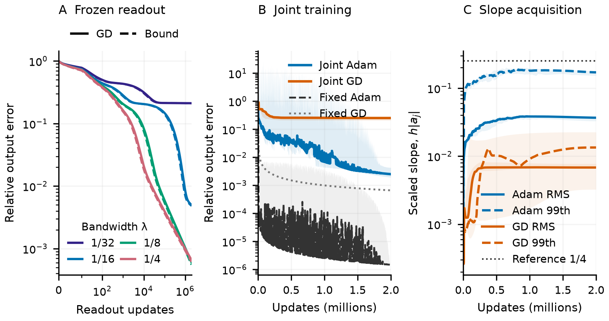

# Proposed Section 3.4: Slope controls optimization access to high precision

**Working draft after the second writing review.** These empirical paragraphs use the completed two-million-update comparison. The additional five-million-update duration check and learned-feature interventions are pending. This document replaces the obsolete polynomial-bound argument in Section 4 of submission draft (19).

## 3.4 Slope controls optimization access to high precision

Section 3.3 identifies a useful relative bandwidth $\lambda=\gamma h$ for the construction. Holding it fixed as width increases requires $\gamma=\Theta(W)$. Training must acquire a useful feature geometry as well as fit its readout; the latter can remain slow even when the features already represent the target accurately. We quantify this distinction for the finite tanh construction. The underlying scale-dependent spectral bias is established by [Xu et al. (2020)](https://www.global-sci.com/cicp/article/view/6896) and [Tancik et al. (2020)](https://papers.neurips.cc/paper_files/paper/2020/hash/55053683268957697aa39fba6f231c68-Abstract.html).

**Slope controls access to representable corrections.** Freeze the uniform centers from Section 3.1 and a common slope $\gamma$. On observations $z_a$, let $J_\gamma$ contain the tanh features and output bias, divided by $\sqrt m$, and let $K_\gamma=J_\gamma J_\gamma^T$. Write its descending eigenpairs as $(\mu_i,u_i)$, its relative rates as $\rho_i=\mu_i/\mu_1$, and the target weights as $p_i=|u_i^Ty|^2/\|y\|^2$, where $y_a=f(z_a)/\sqrt m$. The largest eigenvalue limits a stable shared GD step; the ratios $\rho_i$ determine how quickly each target component can then decay.

The localized derivative in Section 3.1 also explains the optimization effect: a tanh is a step smoothed by $s_\gamma(x)=\frac\gamma2\operatorname{sech}^2(\gamma x)$. This smoothing multiplies frequency $\omega$ by

$$
M_\gamma(\omega)=\frac{\pi|\omega|/(2\gamma)}{\sinh(\pi|\omega|/(2\gamma))},\qquad M_\gamma(0)=1.
$$

Smaller slopes attenuate rapid variation more strongly. Integrating these features over centers at density $1/h$ gives a kernel whose directional response is weighted by $M_\gamma^2$. For an orthonormal basis $Q$ of mean-zero sample directions, this integral is explicitly

$$
H_\gamma=-\frac2{hm}Q^T[d_{ab}\coth(\gamma d_{ab})]_{a,b}Q,
\qquad d_{ab}=z_a-z_b,
$$

with diagonal value $1/\gamma$ inside brackets. The integral exposes how gamma filters each sample direction; finite-center corrections transfer this calculation to the dictionary actually trained. Specifically, subtract an explicit contribution $T_\gamma$ from exterior lattice centers absent from that dictionary, giving $S_\gamma=H_\gamma-T_\gamma$. Poisson summation supplies a lattice-error allowance $\delta_\gamma$ such that $Q^TK_\gamma Q\preceq S_\gamma+\delta_\gamma I$. Both corrections are defined in the [proof appendix](section34_slope_appendix.md).

**Theorem 3.2 (Slope-dependent output-error lower bound).** Let consecutive uniformly spaced centers cover the sample interval, with common slope $\gamma>0$, and let $y\ne0$. Let $\beta_i(\gamma)$ be the descending eigenvalues of $S_\gamma$ above and $\ell_\gamma=v_0^TK_\gamma v_0$ for $v_0=\mathbf1/\sqrt m$. Define

$$
\bar\rho_1=1,\qquad
\bar\rho_i(\gamma)=\min\left\{1,\frac{\beta_{i-1}(\gamma)+\delta_\gamma}{\ell_\gamma}\right\},\quad 2\le i\le m.
$$

Gradient descent on $\frac12\|J_\gamma w-y\|^2$ from $w_0=0$, with $\eta=1/(2\mu_1)$, satisfies, for every integer $n\ge0$,

$$
\boxed{\frac{\|J_\gamma w_n-y\|^2}{\|y\|^2}
\ge\sum_i p_i(\gamma)\left(1-\frac{\bar\rho_i(\gamma)}2\right)^{2n}.}
$$

If directions carrying target energy $P$ have rate upper bounds at most $r$, they force relative output error of at least $\sqrt P(1-r/2)^n$. This includes positive-eigenvalue components that are representable but slow to acquire.

**Proof sketch.** Interlacing transfers the projected-kernel upper bound to $\mu_i\le\beta_{i-1}+\delta_\gamma$ for $i\ge2$. Since $\ell_\gamma\le\mu_1$, this gives $\rho_i\le\bar\rho_i$. Substitute these upper rates into the exact squared relative output error $\sum_i p_i(1-\rho_i/2)^{2n}$, whose factors decrease with $\rho_i$.

The bound uses the actual dictionary's target projections; its rate endpoints are computed from the slope-dependent integral kernel and finite-center corrections before training.

**Accuracy can be representable but slow to acquire.** Figure 3A isolates the readout effect on a fixed width-512 geometry. At $\lambda=1/32$, a direct fit attains $6.2\times10^{-10}$ relative error on the dense evaluation grid, while GD retains training-sample error $0.212$ after two million updates. At $\lambda=1/4$, the same GD protocol reaches $6.62\times10^{-4}$. Across all four bandwidths and every executed update, the theorem lower bound is at least 75% of the actual error, and roughly 91–100% at the endpoint. Thus the theorem quantifies optimization delay in dictionaries that already admit accurate readouts.

**Joint training acquires useful features, but precision remains costly.** Joint Adam reduces median relative error to $2.51\times10^{-3}$, while Adam applied only to the readout of the supplied $\lambda=1/4$ dictionary reaches $1.48\times10^{-6}$ over the same horizon. Joint GD remains at $0.252$ (Figure 3B). For jointly trained features $\tanh(a_jx+b_j)$, Figure 3C tracks the distribution of scaled slopes $h|a_j|$. Adam's endpoint median RMS and 99th percentile are $0.0367$ and $0.171$: substantial, heterogeneous acquisition that still leaves a large output-accuracy gap. The remaining residual is concentrated in weak local directions even after accounting for Adam's coordinate scaling, including under constant learning rates (Appendix B). This is a local diagnostic; the temporal theorem applies to frozen GD.

The construction supplies accurate feature geometry and readout weights directly. It therefore avoids both the search for that geometry and slow iterative access to its fine corrections. This motivates composing the constructed primitives into arithmetic circuits and placing those computations inside larger networks.

**Figure 3. Slope affects access to representable precision.** All panels use $[\sin(2\pi x)+\frac12\sin(6\pi x)+\frac14\sin(14\pi x)]/\sqrt{21/32}$, hidden width 512 including halos, and 2,048 training midpoints. **A:** actual frozen-readout GD errors (solid) and square roots of the theorem's error lower bounds (dashed), at $\eta=1/(2\mu_1)$. **B:** joint Adam/GD errors, with uniform $\lambda=1/4$ frozen-feature references. Each joint optimizer uses one recipe selected by median final validation error across five paired seeds. **C:** RMS and 99th-percentile $h|a_j|$ from exactly B's joint runs. The uniform reference is a comparison, not a necessary threshold for heterogeneous features. Lines summarize raw errors within display bins; shading retains seed variation and within-bin extrema, including spikes. Cosine decay spans the full run. The appendix gives recipes, validation, and numerical checks.
