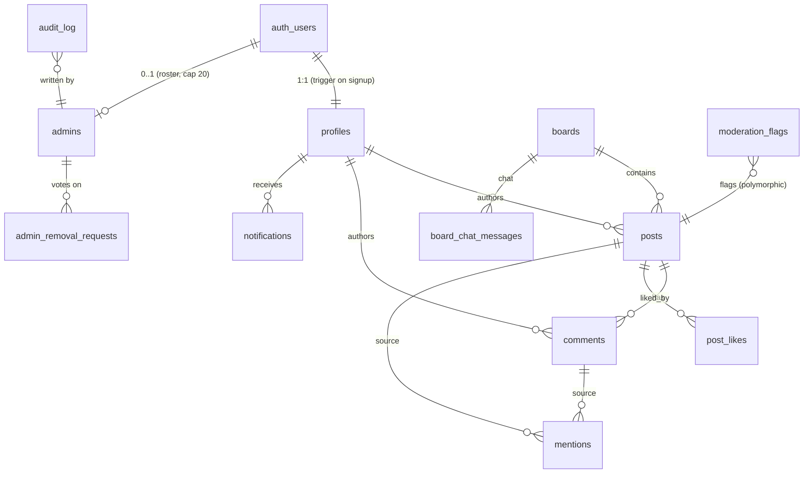
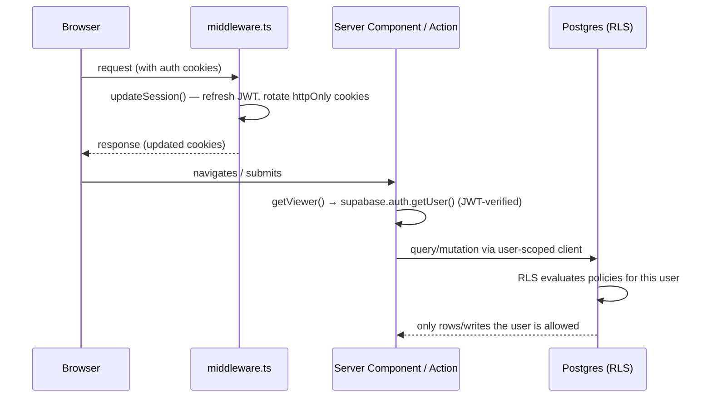
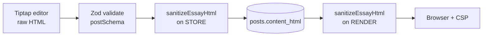

# Architecture

A map of how Essay Collections is built: the directory layout, the data model, how a request flows from browser to database through Row Level Security, the essay sanitize/store/render pipeline, realtime chat, the moderation cron, and the three-client Supabase pattern.

> **Scope note.** This document describes the full implemented application: the `src/lib` foundation, the `supabase/migrations` schema and policies, the App Router layer (pages, server actions, editor components), and the `/api/cron/moderation` route.

---

## Directory layout

```
essay-collections/
├── src/middleware.ts           Middleware (must live in src/): refreshes the Supabase session on every request
├── next.config.mjs             Security headers + strict CSP; image remote patterns
├── vercel.json                 Vercel Cron: daily POST-ish GET to /api/cron/moderation (09:00 UTC)
├── tailwind.config.ts          Tailwind setup
├── tsconfig.json               TS config; "@/*" → "./src/*"
├── .env.example                Every environment variable, documented
├── src/
│   ├── config/
│   │   └── site.ts             Single source of branding (name, tagline, board noun)
│   └── lib/
│       ├── auth.ts             getViewer / requireViewer / requireAdmin (JWT-verified)
│       ├── sanitize.ts         DOMPurify essay sanitizer + text/excerpt helpers
│       ├── rate-limit.ts       Fixed-window rate limiter + per-action defaults
│       ├── validation.ts       Zod schemas — the mutation contract
│       ├── mentions.ts         Extract @handles from text/HTML
│       ├── utils.ts            cn() classnames + relative-time helper
│       ├── types.ts            Hand-authored Database types + row aliases
│       └── supabase/
│           ├── client.ts       Browser client (anon key, RLS-scoped)
│           ├── server.ts       Server client bound to the caller's cookies (RLS-scoped)
│           ├── middleware.ts   Session refresh used by root middleware
│           └── admin.ts        Service-role client (bypasses RLS; server-only)
├── supabase/
│   └── migrations/
│       ├── 0001_init.sql       Schema, indexes, triggers, realtime publication
│       ├── 0002_rls.sql        Row Level Security (deny by default)
│       ├── 0003_functions.sql  SECURITY DEFINER RPCs (governance, moderation, boards)
│       └── 0004_seed.sql       Six starter boards
└── docs/                       This documentation set
```

## Data model

Everything lives in the `public` schema and keys off Supabase's `auth.users`. A `profiles` row is created automatically for every new auth user by the `handle_new_user()` trigger (which also derives a unique `@handle` from the email local-part).



Table by table:

| Table | Purpose | Key points |
| --- | --- | --- |
| `profiles` | One row per user | `handle` (citext, unique), `display_name`, `is_banned` + ban metadata. Auto-created on signup. |
| `admins` | Admin roster | PK = `user_id`. Hard cap **20** via `enforce_admin_cap()` trigger. |
| `boards` | Discussion boards | Unique `slug`, `sort_order`, `is_archived`. |
| `posts` | The essays | Sanitized `content_html`; `status` ∈ `published`/`hidden`/`draft`; denormalized `like_count`/`comment_count`; hide/publish metadata. |
| `comments` | Text-only discussion | Under a post; flat (no threading). |
| `post_likes` | Likes | PK `(post_id, user_id)` — one like per person. |
| `mentions` | `@handle` tags | Written server-side; unique per `(source_type, source_id, mentioned_user_id)`. |
| `board_chat_messages` | Per-board live chat | Text only; in the realtime publication. |
| `notifications` | Mentions/replies/admin notices | Recipient = `user_id`; `is_read`. |
| `moderation_flags` | Review queue | Raised by `bot` or `user`; `status` ∈ `open`/`dismissed`/`actioned`; polymorphic `content_type`/`content_id`. |
| `admin_removal_requests` | Governance votes | Unique per `(target, requester)`; threshold logic in RPCs. |
| `admin_invites` | Pending email admin invites | Applied on the invitee's next sign-in. |
| `audit_log` | Append-only privileged-action record | Admin-read-only; written only inside definer RPCs. |
| `moderation_runs` | One row per bot run | Observability: items scanned, flags created, errors. |

Maintenance is handled by triggers in `0001_init.sql`: `touch_updated_at`, `stamp_published_at` (stamps `published_at` on first publish), and `sync_like_count` / `sync_comment_count` (keep the denormalized counters correct on insert/delete).

## Request & auth flow



1. **Middleware session refresh.** `src/middleware.ts` runs on every matched request and calls `updateSession()` (`src/lib/supabase/middleware.ts`), which refreshes the Supabase session and rotates refresh tokens in **httpOnly** cookies. The matcher skips static assets so refreshes don't burn work on images.
2. **Server components / actions.** Server code uses `getViewer()` / `requireViewer()` / `requireAdmin()` (`src/lib/auth.ts`), which resolve identity with JWT-verified `getUser()` and attach the profile + admin flag. Banned or anonymous users are redirected.
3. **RLS is always in force.** The user-scoped server client runs *as the signed-in user*, so `0002_rls.sql` policies decide what is readable/writable — the database is the final authority. See [SECURITY.md](SECURITY.md).
4. **Privileged actions** go through the `SECURITY DEFINER` RPCs in `0003_functions.sql`, which re-check admin authority and write the audit log.

## The essay pipeline: editor → sanitize → store → render

Essays are the highest-risk surface (rich user HTML), so sanitization brackets both ends:



1. **Author** writes in the Tiptap editor (`@tiptap/*` in `package.json`) — headings, bold/italic, quotes, lists, links, images, YouTube.
2. **Validate.** The submission is checked against `postSchema` in `src/lib/validation.ts` (title/subtitle/content bounds, board UUID, status enum limited to `published`/`draft`).
3. **Sanitize on store.** `sanitizeEssayHtml()` (`src/lib/sanitize.ts`) strips everything outside the allowlist — YouTube-only iframes, hardened links, safe URL schemes — before the HTML is written to `posts.content_html`.
4. **Sanitize on render.** The same function runs again when displaying, defending against anything that slipped in (stored-XSS defense in depth).
5. **Browser + CSP.** The strict Content-Security-Policy (`next.config.mjs`) is the final backstop on what can execute or embed.

`makeExcerpt()` / `htmlToText()` derive plain-text projections for excerpts and for the moderation bot's input.

## Realtime chat (and live comments)

`board_chat_messages` and `comments` are added to the `supabase_realtime` publication in `0001_init.sql`. A board's chat UI subscribes with the **browser** Supabase client (`src/lib/supabase/client.ts`); new rows stream over a websocket (`wss://*.supabase.co`, allowed by the CSP `connect-src`). Realtime respects RLS, so a client only receives rows it is permitted to read (chat is readable by any signed-in user; comments follow their parent post's visibility). Messages are text-only and bounded (≤ 2000 chars) at both the Zod and DB-constraint level, and rate-limited (30/min default).

## The moderation cron

```mermaid
flowchart TD
    V[Vercel Cron<br/>09:00 UTC daily] -->|Authorization: Bearer CRON_SECRET| R[/api/cron/moderation]
    R --> G{secret valid?}
    G -->|no| X[401]
    G -->|yes| S[service-role client]
    S --> Q[read last 24h:<br/>posts + comments + chat]
    Q --> C[Claude<br/>MODERATION_MODEL]
    C --> F[insert moderation_flags<br/>status = open]
    R --> L[insert moderation_runs<br/>scanned / created / error]
    F --> A[admins review + resolve]
```

- **Schedule & auth.** `vercel.json` fires `/api/cron/moderation` daily at 09:00 UTC with `Authorization: Bearer <CRON_SECRET>`; the handler must reject anything without the matching secret.
- **Privileged read.** The job uses the **service-role** client (`src/lib/supabase/admin.ts`) so it can read *all* recent content regardless of RLS.
- **Judgment, not enforcement.** It evaluates content against the [Community Guidelines](COMMUNITY_GUIDELINES.md) with the model named in `MODERATION_MODEL` and writes `moderation_flags` (`flagged_by = 'bot'`, `status = 'open'`) plus a `moderation_runs` summary row. It never deletes or hides — **humans act on the flags.**

> The route handler lives at `src/app/api/cron/moderation/route.ts`; the contract above (path, secret, output tables) is fixed by `vercel.json` and the schema.

## The three-client Supabase pattern

Three clients, three trust levels — pick the least-privileged one that does the job:

| Client | File | Key | Runs as | Use for |
| --- | --- | --- | --- | --- |
| **Browser** | `supabase/client.ts` | anon | the signed-in user (RLS) | Client components, realtime subscriptions |
| **Server (user-scoped)** | `supabase/server.ts` | anon + cookies | the signed-in user (RLS) | Server Components, Route Handlers, Server Actions |
| **Service-role** | `supabase/admin.ts` | service_role | **bypasses RLS** | Cron/bot, and server actions that have *already* verified authority (e.g. writing notifications for another user) |

The anon key is safe in the browser precisely because RLS guards every table. The service-role key bypasses RLS and is therefore **server-only** — `admin.ts` imports `"server-only"`, which turns any accidental client-bundle import into a build error. Default to the RLS-scoped clients; reach for service-role only when you genuinely must cross a user's RLS boundary, and only after checking authority yourself.
