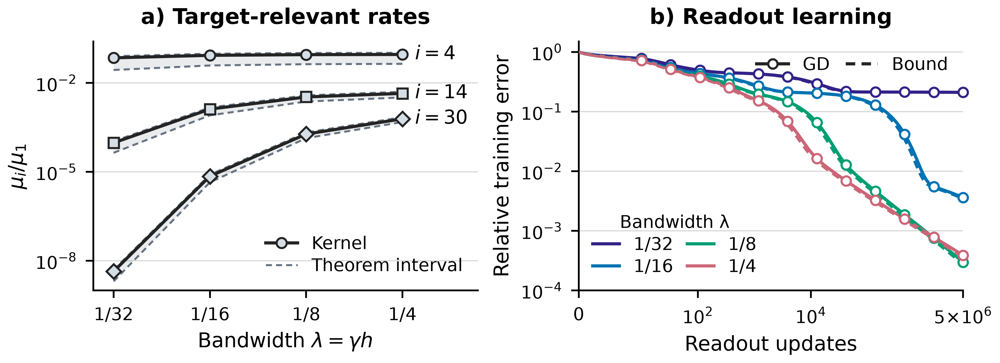
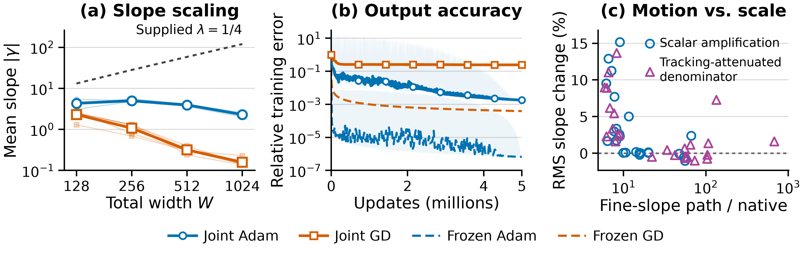

# Optimization figures: style handoff

Start with [render.py](render.py). It regenerates the paper's Figures 3 and 4 from compact saved plotting arrays and a 48-row intervention CSV using NumPy and Matplotlib on a CPU. Typography and colors are collected at the top of the script; each figure has its own drawing function. Figure 4(c) shows measured Adam intervention responses. Figure 4 uses a compact layout with unchanged data, colors, and marker mappings; Figure 3 remains unchanged.

## Rebuild

From the repository root, using Python 3.12 or newer:

```sh
python3.12 -m venv figure_handoff/optimization/.venv
figure_handoff/optimization/.venv/bin/python -m pip install -r figure_handoff/optimization/requirements.txt
figure_handoff/optimization/.venv/bin/python figure_handoff/optimization/render.py
```

This writes 600-DPI PNGs and vector PDFs to `figure_handoff/optimization/rendered/`. Pass `--output /path/to/figures` to choose another directory. The committed reference exports remain in [figures/](figures/).





## Where to change the style

| Entry point | Controls |
| --- | --- |
| `STYLE` | Font family and sizes, title weight, tick sizing, axes, and PDF font embedding. |
| `OPTIMIZER_COLORS`, `BANDWIDTH_COLORS` | Consistent optimizer and bandwidth palettes. |
| `spectrum()` | Figure 3's two panels, direct rank labels, local legends, markers, and axis limits. |
| `acquisition()` | Figure 4's three panels, shared optimizer legend, local intervention legend, and layout. |
| `DPI` and `figsize` | Raster resolution and physical figure dimensions. |

The current styling uses outlined markers, light horizontal grids, and no top/right spines. Figure 3 uses local legends because its panels encode different quantities. Figure 4 retains its optimizer legend below the panels, with a separate policy legend inside (c). Direct labels identify the construction reference and selected spectral ranks. Figure 3's design size is 5.5 × 2.0 inches; Figure 4's is 5.5 × 1.85 inches before tight cropping. Figure 4 has aligned single-line titles, including “Motion vs. scale,” and tighter label spacing. Its plotting areas are about 10% wider and 18% shorter than the previous layout, with unchanged font sizes and axis ranges.

For style revisions, edit the drawing functions and shared settings, then rerun the command. Check the exports at the paper's text width, especially legends, reference labels, and shaded regions.

## What the plotted quantities mean

**Figure 3, left:** kernel eigenvalue ratios $\mu_i/\mu_1$ and theorem intervals at ranks 4, 14, and 30, for bandwidths $1/32$, $1/16$, $1/8$, and $1/4$. These ranks carry substantial target energy; the eigenvectors themselves change with bandwidth. Shading is a theorem interval.

**Figure 3, right:** executed frozen-readout GD error and the square root of its output-error lower bound. Solid lines and hollow markers indicate execution; dashed lines indicate the bound. The horizontal axis includes all five million updates and uses a linear region near zero followed by a logarithmic region.

**Figure 4, left:** final mean absolute slope versus total width, including halos. Faint curves show five seed means; outlined markers show the pooled mean. The dotted reference is the supplied $\lambda=1/4$ construction.

**Figure 4, middle:** width-512 relative training RMS error. Solid curves are joint training; dashed curves are frozen-readout training on the supplied dictionary. Blue is Adam and orange is GD. Joint curves summarize the five seeds after time binning; their shading retains seed and within-bin extrema, including transient spikes. Frozen Adam's shading retains within-bin extrema. These are executed trajectories.

**Figure 4, right:** accumulated fine-slope path relative to native Adam versus percentage difference in endpoint RMS slope. Each point compares an intervention with its native control over updates 130k–140k. Circles indicate scalar amplification and triangles the tracking-attenuated denominator. All 48 responses are shown, without a fitted trend. This separate cohort spans six targets, widths 705 and 1409, and two seeds. The [intervention note](adam_intervention.md) gives the full mapping, checks, and caption.

Figure 3 and Figure 4(a,b) use the normalized mixed-sine target $[\sin(2\pi x)+\tfrac12\sin(6\pi x)+\tfrac14\sin(14\pi x)]/\sqrt{21/32}$ on $[-1,1]$. Figure 4(c) uses the separate six-target intervention campaign. Keep these cohorts and the meanings of the bands and line styles distinct in captions.

## Data and provenance

- [data/spectrum_readout.npz](data/spectrum_readout.npz) contains the exact displayed ratios and intervals, GD curve samples and marker samples, and bound curves. Arrays indexed by bandwidth follow `bandwidths`; ratio rows follow `ranks`.
- [data/joint_acquisition.npz](data/joint_acquisition.npz) remains unchanged: it supplies slope means, error summaries and extrema, and frozen comparisons for (a,b). Its archived bandwidth moments are no longer plotted. Names are prefixed by optimizer; update counts are converted to millions in (b).
- [data/adam_intervention.csv](data/adam_intervention.csv) supplies all coordinates in (c), along with the matched native/intervention measurements. [prepare_adam_intervention.py](prepare_adam_intervention.py) extracts it from saved scalar histories and verifies the summary CSV; it does not train models. [The input record](data/adam_intervention_provenance.json) contains hashes, field mappings, and checks.
- [sources/section34_paired_figures.py](sources/section34_paired_figures.py) and [sources/figure4_figure.py](sources/figure4_figure.py) preserve the original research plotting programs, including their input checks and data aggregation. They are included to show how the plotted evidence was assembled; the standalone `render.py` is the entry point for this bundle.
- [provenance.json](provenance.json) records the research snapshot and current file hashes. Original programs and provenance in `sources/` document the pre-intervention figure and its experiment inputs; those historical paths are not dependencies of the standalone renderer.
- [verification.json](verification.json) records unchanged data coordinates, styles and axis ranges; the wider, shorter axes; label clearance; and the absence of legend-point collisions. It also retains the previous panel-replacement checks and verifies that Figure 3 remains pixel-identical. PDF metadata includes creation times, so export equivalence is checked through raster pixels rather than PDF byte hashes.

The renderer consumes existing scientific results. Regenerating these figures does not train models, repeat recipe selection, or recompute theorem bounds.
