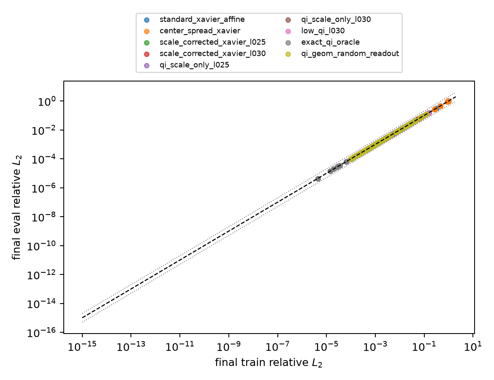
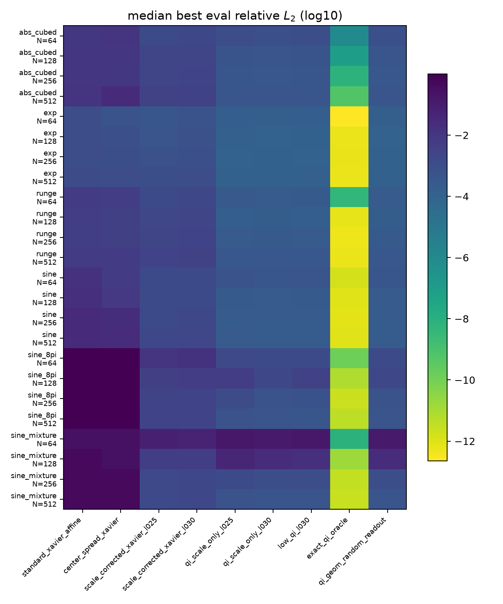
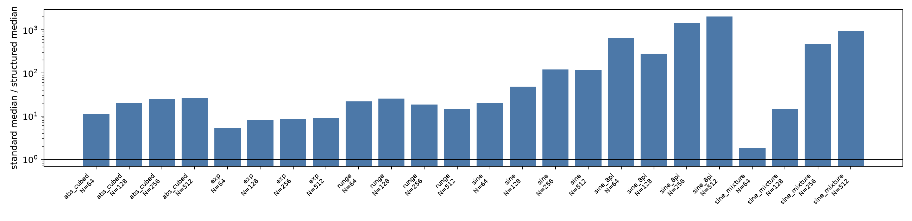
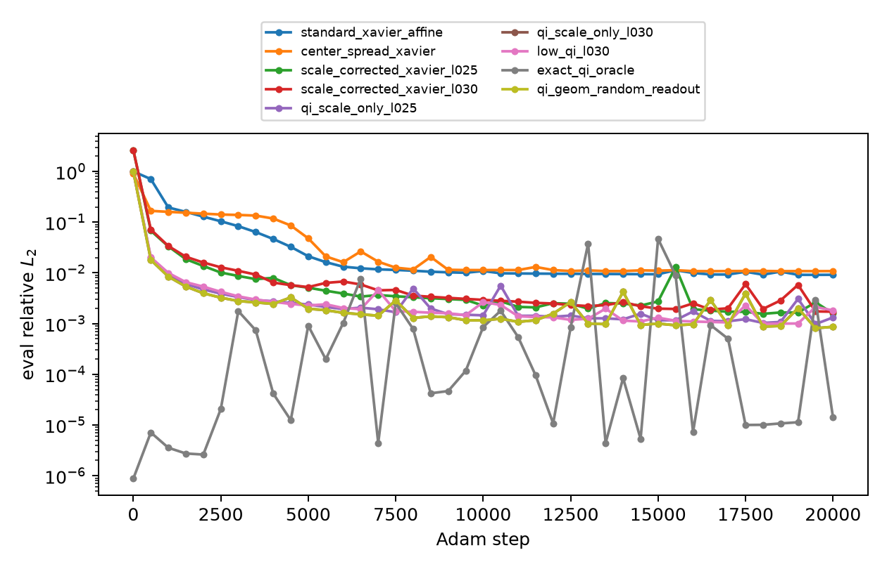
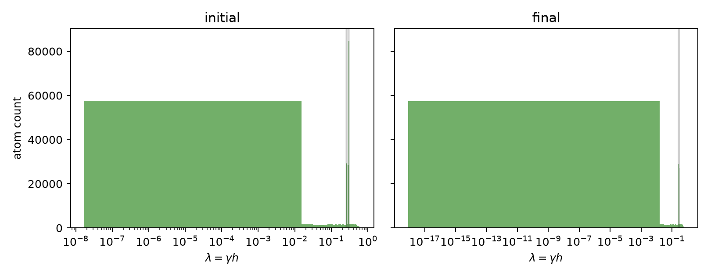
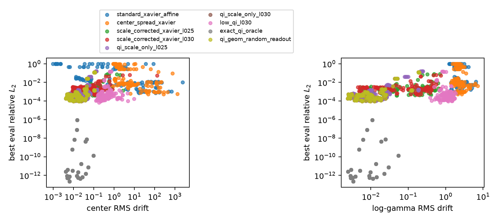
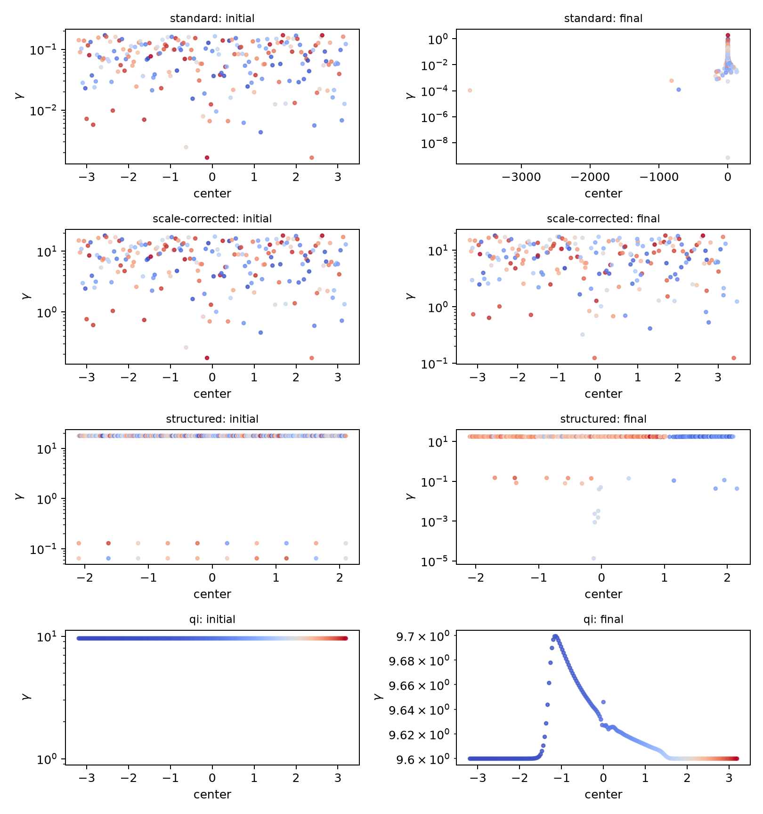

# expD05 -- Scale-aware initialization story

**Status: draft-pending-Sam; full matrix complete.**

## TL;DR

- The full fp64 matrix is present: `1080/1080` rows over `24` target-resolution blocks, with `0` train/eval sanity flags.
- Adam alone improves strongly with scale-aware initialization but does not close the non-oracle precision gap: Best non-oracle row is `exp` N=128 `low_qi_l030` with best eval relative $L_2$ `7.069e-05`.
- Final lstsq refits are the decisive check: Best final lstsq refit is `exp` N=128 `scale_corrected_xavier_l025` with eval relative $L_2$ `1.028e-14`. Scale-corrected refit medians beat standard refit medians on `24/24` blocks and reach $\le 10^{-10}$ on `9/24` blocks; standard refits reach that threshold on `0/24` blocks.
- The scale persists through Adam: median final $\lambda$ is `0.251` for `scale_corrected_xavier_l025`, `0.301` for `scale_corrected_xavier_l030`, and `0.300` for `qi_scale_only_l030`; standard affine remains at `7.871e-04`.

## Question / hypothesis

Does the transferable part of QI initialization live in the dimensionless scale $\lambda=\gamma h$, and if so does initializing in that scale regime give Adam a better starting point than standard affine Xavier-style MLP initialization?

## Experiment design

For each target, construction resolution $N$, seed, and initializer family, the runner builds one single-hidden-layer tanh MLP in affine coordinates $a_jx+b_j$, trains all parameters with full-batch Adam in fp64, and then re-solves the readout on the trained first-layer features by fp64 SVD least squares. The shared geometry for a cell uses $h=2/N$ and one halo large enough for both $\lambda=0.25$ and $\lambda=0.30$, so all initializer families in that cell have the same hidden width. The feature matrix for the final refit is $\Phi_{ij}=\tanh(a_jx_i+b_j)$ and the refit solves $[\Phi,\mathbf 1][v;c]\approx y$. Metrics are eval relative $L_2=\|\hat f-f\|_2/\|f\|_2$, $L_\infty=\max_x|\hat f-f|$, final train/eval relative-$L_2$ ratio, $\lambda$ distributions, center drift, log-$\gamma$ drift, readout drift, and feature-rank diagnostics.

Initializer families are standard affine Xavier; center-spread Xavier; scale-corrected Xavier at $\lambda=0.25$ and $0.30$; target-independent QI-scale grids at $\lambda=0.25$ and $0.30$; a low-plus-QI multiscale schedule; exact target-dependent QI as an oracle; and QI geometry with random readout. `exact_qi_oracle` is diagnostic only and is not a deployable initialization rule.

**Code & data.** Code: `experiments/expD05_scale_init_story/run.py`, `experiments/expD05_scale_init_story/config.yaml`. The full matrix was run as eight resumable shards with `uv run --extra dev python experiments/expD05_scale_init_story/run.py --mode full --num-shards 8 --shard-index <k>`, then merged by `uv run --extra dev python experiments/expD05_scale_init_story/run.py --merge-shards --num-shards 8`. Data: `results/checkpoint_D_optimizers/expD05_scale_init_story/summary.csv`, `traces.csv`, `atoms.csv`, `run_matrix.csv`. Figures: `results/checkpoint_D_optimizers/expD05_scale_init_story/figures/`, generated by the same runner's plotting pass.

## Results

The artifact set contains `1080/1080` expected full-matrix summary rows over `6` targets, `4` resolutions, `5` seeds, and `9` initializer families. The train/eval sanity check passes globally: `0` rows fall outside the `[0.5,2.0]` final relative-$L_2$ ratio band.

Adam training alone preserves the initialization story but does not solve precision by itself. The target-dependent `exact_qi_oracle` is the best trained row (`2.237e-13` best eval relative $L_2$) because it starts from the construction, while the best non-oracle trained row is still `7.069e-05`. Even so, structured QI-scale medians beat standard affine medians on `24/24` blocks, and scale-corrected Xavier medians beat standard affine medians on `24/24` blocks.

The final lstsq refit is the stronger evidence about the learned geometry. Scale-corrected refits beat standard refits on `24/24` blocks, and structured QI-scale refits beat standard refits on `24/24` blocks. Scale-corrected refit medians reach $\le 10^{-10}$ on `9/24` blocks and $\le 10^{-12}$ on `4/24` blocks; structured refit medians reach $\le 10^{-8}$ on `13/24` blocks. Best final lstsq refit is `exp` N=128 `scale_corrected_xavier_l025` with eval relative $L_2$ `1.028e-14`.

The scale parameter is not washed out by Adam. Standard affine ends with median final $\lambda\approx 7.871e-04$, while scale-corrected and QI-scale families remain at the construction scale: $\lambda\approx 0.251$, `0.301`, and `0.300` for the $\lambda=0.25$, scale-corrected $\lambda=0.30$, and QI-scale $\lambda=0.30$ families respectively.

### Figures

<figure>
  
  <figcaption>Final train vs eval relative $L_2$ with the 2x sanity band. Points far from the diagonal would indicate an overfit or data-path problem before any initializer comparison is trusted.</figcaption>
</figure>

<figure>
  
  <figcaption>Median best eval relative $L_2$ by target-resolution block and initializer family. Lower log-scale colors mark better Adam training outcomes.</figcaption>
</figure>

<figure>
  
  <figcaption>Per-block fold gap between the standard affine median and the structured QI-scale median. Values above one favor the structured scale-aware initializers.</figcaption>
</figure>

<figure>
  
  <figcaption>Median eval relative $L_2$ learning curves for the first target-resolution block in the artifact set. This is a convergence-shape diagnostic, not the full ranking evidence.</figcaption>
</figure>

<figure>
  
  <figcaption>Initial and final atom counts over $\lambda=\gamma h$ at the largest resolution, with the $0.25$-$0.30$ construction band shaded.</figcaption>
</figure>

<figure>
  
  <figcaption>Center and log-$\gamma$ drift versus best eval error. This checks whether successful rows preserve or leave the intended scale geometry.</figcaption>
</figure>

<figure>
  
  <figcaption>Representative initial/final center-$\gamma$ atom grids for standard, scale-corrected, structured, and QI-family rows.</figcaption>
</figure>

## Conclusions

*Pending Sam review.* The data-obvious conclusion is that initializing at the construction scale is a robust improvement over standard affine initialization in fp64, and that the scale persists during Adam. Adam alone still does not reach the non-oracle construction floor; the successful path remains scale-aware initialization followed by an exact final readout solve.

## Open questions

- Does $\lambda=0.25$ or $\lambda=0.30$ dominate once train/eval sanity and final lstsq refits are both considered?
- Are low-$\lambda$ global atoms consistently helpful, or is `qi_scale_only` enough after the target-repo fp64 rerun?
- Which non-oracle initializer should be promoted into the Checkpoint D story after Sam reviews the full-matrix plots?
