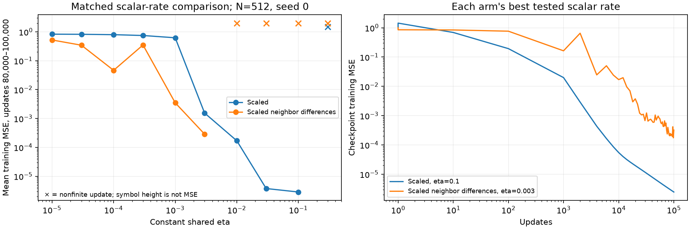
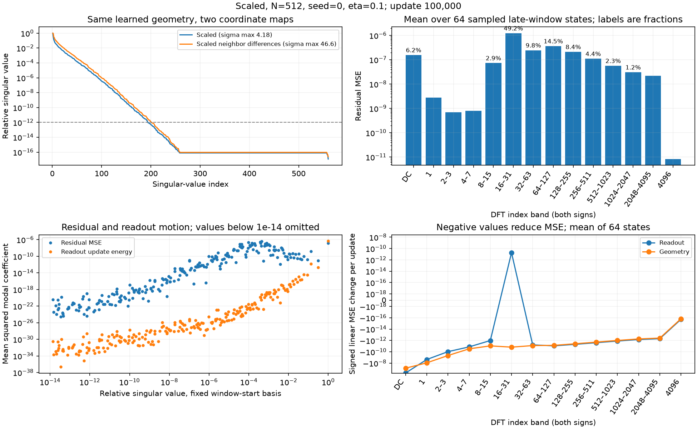
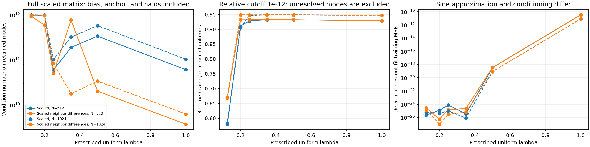
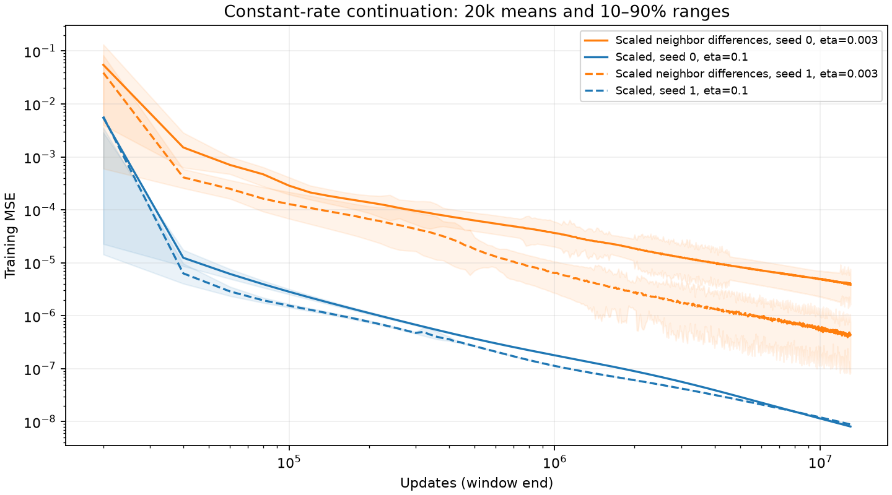
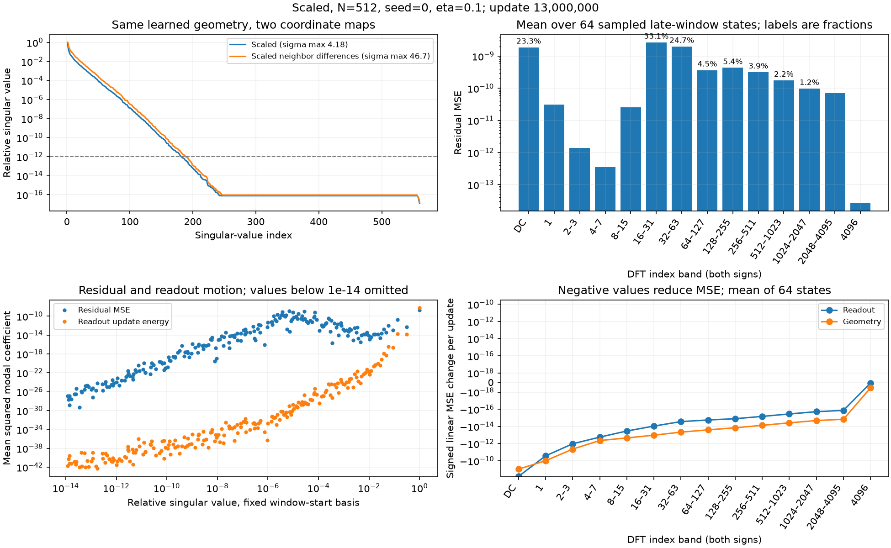

# Constant-rate GD with scaled neighbor differences

The question is whether adding neighbor differences to the prescribed scales improves joint readout and slope learning from Xavier initialization. At 100k updates, differences help at several matched small learning rates, but ordinary scaled training reaches lower error at its own best tested rate. This ordering transfers to both seeds and both widths. Four selected width-512 trajectories were continued to a common **13 million updates** at their unchanged rates. Scaled training reaches MSE around $10^{-8}$, while neither arm learns a uniform localization near $\lambda=0.25$. The finite-budget errors remain above accurate detached fits; they are not established optimization floors.

The mechanism measurements show substantial movement, not an absence of gradients. Most residual energy in the scaled runs lies in directions that the readout responds to weakly, while its updates concentrate in sensitive directions. Readout and geometry updates reinforce one another enough that their quadratic cost cancels almost all their first-order benefit, and successive late updates nearly reverse direction. The learned geometry permits a much more accurate detached readout fit, but that does not make its least-squares problem well conditioned.

**Terminology. All errors below are MSE; training minimizes half-MSE.**

| Term | Meaning |
|---|---|
| Scaled | Train $a_b,a,\lambda$, with $b=d_ba_b$, $w=D_wa$, and $\gamma=\lambda/h$. |
| Scaled neighbor differences | Train $\theta_b,\theta,\lambda$, with $b=d_b\theta_b$, $w=LS\theta$, and $\gamma=\lambda/h$. |
| $h$, $\lambda$ | Center spacing $h=2/N$; signed slope coordinate $\lambda=h\gamma$. Localization plots use $|\lambda|$. |
| $q$, $L$, $S$ | $q_j=\sum_{k\le j}w_k$; $w=Lq$ takes adjacent differences; $S_{jj}=\sqrt{\sum_{k\le j}\alpha_k}$ and $q=S\theta$. |
| Shared $\eta$ | One constant scalar applied to both trained parameter blocks. It is the only tuned learning rate. |
| $D_w$, $d_b$ | Fixed readout scales $D_w=\operatorname{diag}(\sqrt{\alpha_j})$ and $d_b=\sqrt{\alpha_b}$, from the reference construction. |
| $N$, $W$ | $N$ is core grid resolution; actual hidden width is $W=N+2\lceil\sqrt N\rceil+1$, including halos: 559 or 1089. |
| Detached refit | An SVD readout solve at saved slopes, used only to measure approximation quality. It never enters training. |
| DC | The spatially constant Fourier component, at DFT index zero. |

## What was compared

All models have fixed physical centers, the existing $R=\lceil\sqrt N\rceil$ halo, independent trainable slopes, and the same physical tanh-sum evaluation. The target is $\sqrt2\sin(2\pi x)$ on $[-1,1]$. Full-batch FP64 GD uses $16N+1$ training points. The 32,768 midpoint points provide diagnostic validation errors; they do not select rates. There is no held-out generalization claim.

The reference envelopes $\alpha_j$, including the bias and corrected halo entries, are fixed at $\lambda_{\rm ref}=0.25$. Initialize $a$ with Gaussian Xavier variance $2/(W+1)$ and physical $\gamma$ with tanh-gain Xavier. Bias starts at zero. Initial slope signs are absorbed into $w$, preserving the signed-Xavier function. Both arms start from that same physical network; the difference arm initializes $\theta=S^{-1}Cw$, where $C$ takes cumulative sums. Its entries are correlated. They are not newly drawn independent Xavier values. The initial prediction mismatch in the seed-0 pilot is $7.63\times10^{-17}$.

Both readouts and slopes learn throughout. There is no backtracking, schedule, clipping, independent block rate, frozen-geometry training branch, or in-training least-squares solve. This study uses GD; earlier Adam and frozen-dictionary experiments are separate evidence.

The pilot tested eight shared rates from $10^{-5}$ to $0.03$ at $N=512$, seed 0, in both coordinate arms. The scaled optimum reached the upper boundary, so both arms also received $0.1$ and $0.3$. Each finite trajectory received 100k updates. Selection minimizes mean training MSE over updates 80k–100k. The selected rates are $0.1$ for scaled training and $0.003$ for scaled neighbor differences. Both rates were transferred unchanged to the other three width/seed combinations.

There are **32 distinct rate/coordinate/width/seed trials: 24 finite 100k trajectories and eight numerical failures**. Failures remain in the [complete search table](conditioning_analysis/summary.csv); they are not rescued with smaller rates. This coarse grid identifies the best tested rates, not a continuous optimum.

**Mean training MSE over updates 80k–100k. The two rates were selected only on the first row. “Failed” means a recorded nonfinite update.**

| $N$, seed | Scaled, $\eta=0.003$ | Scaled, $\eta=0.1$ | Scaled neighbor differences, $\eta=0.003$ | Scaled neighbor differences, $\eta=0.1$ |
|---|---:|---:|---:|---:|
| 512, 0 | $1.54\times10^{-3}$ | $2.84\times10^{-6}$ | $2.87\times10^{-4}$ | Failed |
| 512, 1 | $2.66\times10^{-2}$ | $1.55\times10^{-6}$ | $1.28\times10^{-4}$ | Failed |
| 1024, 0 | $1.55\times10^{-3}$ | $2.15\times10^{-6}$ | $2.24\times10^{-5}$ | Failed |
| 1024, 1 | $3.51\times10^{-3}$ | $1.84\times10^{-6}$ | $4.67\times10^{-5}$ | Failed |

At the matched rate $0.003$, differences lower MSE by factors of approximately 5.4–207 across these four contexts. Comparing each arm's selected rate reverses the ordering: scaled training is approximately 10–101 times more accurate. This is a difference in the usable shared-rate range as well as in behavior at a matched rate.

<figure>
  
  <figcaption>The full pilot rate search at width 512, seed 0. Crosses mark numerical failures; their vertical positions are not losses. The right panel shows actual saved checkpoints at the two selected rates, including the irregular difference-arm trajectory.</figcaption>
</figure>

## The effective learning rates

For the half-MSE objective $\mathcal L$, the physical GD updates are

$$
\begin{aligned}
\text{Scaled:}\qquad
\Delta w&=-\eta D_w^2\nabla_w\mathcal L,\\
\text{Scaled neighbor differences:}\qquad
\Delta w&=-\eta LS^2L^T\nabla_w\mathcal L,\\
\text{Both:}\qquad
\Delta b&=-\eta d_b^2\partial_b\mathcal L,
&\Delta\gamma&=-\eta h^{-2}\nabla_\gamma\mathcal L.
\end{aligned}
$$

The large physical slope factors below come from $h^{-2}$; they are not separately tuned rates. Neighbor differences give a coupled readout update, so no single physical readout LR describes that arm. For example, with $g_j=\partial_{w_j}\mathcal L$, $v_j=s_j^2(g_j-g_{j+1})$, $g_{W+1}=0$, and $v_0=0$, its update is $\Delta w_j=-\eta(v_j-v_{j-1})$. There is no additional multiplication by $D_w$.

**Physical GD gradient multipliers at the two selected scalar rates. “Ordinary readout” applies to the scaled arm; corrected halo coefficients have their own fixed $\alpha_j$.**

| $N$ | Shared $\eta$ | Bias $\eta\alpha_b$ | Scaled ordinary readout $\eta\alpha_{\rm ordinary}$ | Slope $\eta/h^2$ |
|---|---:|---:|---:|---:|
| 512 | 0.003 | 0.03229 | $2.599\times10^{-5}$ | 196.608 |
| 512 | 0.1 | 1.07639 | $8.663\times10^{-4}$ | 6553.6 |
| 1024 | 0.003 | 0.02390 | $1.232\times10^{-5}$ | 786.432 |
| 1024 | 0.1 | 0.79676 | $4.108\times10^{-4}$ | 26214.4 |

The construction motivates $D_w$ and $h$. Transferring the cumulative coefficient envelope gives $S$, but replacing the full correlated cumulative metric by the diagonal $S^2$ is an additional preconditioning choice. The [derivation](../../../docs/neighbor_difference_conditioning.md#combining-the-reference-scales-with-differences) does not prove that this choice is optimal for joint nonlinear training.

## Why the readout does not simply finish the fit

At width 512, seed 0, update 100k, the scaled run has training MSE $2.48\times10^{-6}$, whereas a detached fit in the same scaled dictionary reaches $5.10\times10^{-22}$ at relative SVD cutoff $10^{-12}$. The corresponding difference run has trained MSE $3.23\times10^{-4}$ and its native-coordinate refit reaches $1.21\times10^{-21}$. These are numerical retained-span fits, not certified exact approximation errors. Endpoint and window-mean errors differ, especially in the fluctuating difference run.

For fixed slopes, let $B$ be the complete feature matrix in the trained readout coordinates, divided by $\sqrt M$, and let $B=U\Sigma V^T$. Write the physical residual as $r=f-y$. Its normalized coefficient $e_i=u_i^Tr/\sqrt M$ evolves under a readout-only GD step as

$$
e_i(t+1)=(1-\eta\sigma_i^2)e_i(t).
$$

A least-squares factorization divides by the retained $\sigma_i$ directly. GD makes a change proportional to $\sigma_i^2$ in that function direction. Thus an accurate least-squares fit and very slow first-order progress can coexist. Conditioning is a time-scale barrier, not an exact-arithmetic error floor for a positive singular value.

In the final 2048-update window of the scaled pilot, 86.8% of sampled residual MSE lies in modes with $\sigma/\sigma_{\max}<10^{-3}$, but only about $10^{-12}$ of readout-update energy lies there. For this readout matrix, modes below $10^{-4}$ have frozen-dictionary amplitude decay times of at least approximately **57 million updates** at $\eta=0.1$. That estimate is a local fixed-dictionary calculation, not a prediction that the changing joint model must take exactly that long.

The dependence is not exponential in the condition number itself. Stable GD on a quadratic has a worst-direction time scale proportional to the Hessian condition number, which is the square of the singular-value condition number. Exponential slowdown can arise when the singular values themselves decay exponentially with frequency or inverse localization scale. A tiny singular value matters for the observed task only if the residual occupies its direction. Acceleration and other first-order methods can have different condition-number dependence.

<figure>
  
  <figcaption>Scaled GD at width 512, seed 0, near update 100k. The upper-left panel changes the readout coordinates on the same saved geometry. The other panels describe the actual scaled trajectory. Band 16–31 contains 49.2% of sampled residual MSE and band 64–127 contains 14.5%; DC contains 6.2%. The readout's largest corrective terms occur at low frequencies, while its contribution to band 16–31 is uphill. Percent labels are the plotted band MSE divided by total MSE.</figcaption>
</figure>

The Fourier bands include finite-interval boundary mismatch. At the scaled pilot's 100k endpoint, 61.3% of MSE lies in $|x|>0.9$, the outer 10% of the domain. The [spatial residual and Hann-window check](conditioning_analysis/N512_s0_scaled_eta0.1/residual_shape.png) expose this boundary contribution. High DFT index therefore does not, by itself, establish an oscillatory interior residual or an intrinsic target frequency. The untapered bands remain an exact decomposition of the training MSE.

## Geometry still moves, mostly within the available readout span

The 100k median core $|\lambda|$ is 0.0598 for the scaled pilot and 0.00452 for the difference pilot. The other seeds and width do not produce a uniform $\lambda=0.25$ dictionary either. The reference value sets the fixed scales; the training objective does not explicitly target that bandwidth.

The slope gradient is not uniformly absent. At the same pilot checkpoints, its native-coordinate norm is $6.59\times10^{-4}$ for scaled training and $0.354$ for differences. The orthogonal-residual component is tiny compared with these totals. Because subtracting the projected residual can leave floating-point leakage, the endpoint audit projects the small remainder again before quoting weak-force magnitudes. Most observed geometry forcing acts within directions the readouts can already represent. This supports the residual-depletion interpretation of the gamma hypothesis at the reported cutoffs; it does not prove a universal bound on future geometry drift. Geometry motion within the readout span can still improve optimization, so a small orthogonal force does not make all slope learning useless.

At 13 million updates, this conclusion persists even at the looser relative cutoff $10^{-10}$: the perpendicular slope-gradient norm is less than $3\times10^{-12}$ of the parallel norm in all four selected trajectories. At tighter cutoffs some absolute values fall below the measured projection leakage and split-closure error. Those values should be read as numerically negligible, not accurate measurements of an exactly zero force.

To measure actual motion, collect the physical readouts as $c=(b,w)$ and let $A$ contain the bias and physical tanh feature columns. Write the finite prediction change as

$$
\Delta f=\underbrace{A\Delta c}_{\text{readout}}
+\underbrace{(A_{\rm new}-A)c}_{\text{geometry}}
+\underbrace{(A_{\rm new}-A)\Delta c}_{\text{interaction}}.
$$

Then the exact MSE change is $2r^T\Delta f/M+\|\Delta f\|^2/M$. This separates a useful first-order term from the positive cost of a finite move. The isolated readout and geometry changes below are one-step counterfactuals at actual states, not separate frozen-geometry training experiments.

**Mean finite-update MSE budget over 64 stratified states in updates 97,952–99,999; width 512, seed 0.**

| Quantity | Scaled, $\eta=0.1$ | Scaled neighbor differences, $\eta=0.003$ |
|---|---:|---:|
| Readout-only MSE change | $-7.03\times10^{-8}$ | $-2.51\times10^{-5}$ |
| Geometry-only MSE change | $-7.03\times10^{-8}$ | $-2.52\times10^{-5}$ |
| Joint quadratic cost | $6.38\times10^{-7}$ | $4.91\times10^{-4}$ |
| Joint MSE change, 64 sampled updates | $-3.18\times10^{-11}$ | $-1.05\times10^{-7}$ |
| Joint MSE change, all 2048 updates | $-3.19\times10^{-11}$ | $+6.39\times10^{-8}$ |
| Mean cosine between readout and geometry prediction changes | 0.774 | 0.740 |

The two blocks usually push in similar function directions. In the sampled budgets, their combined quadratic cost cancels approximately 99.995% and 99.979% of the linear benefit, respectively. The difference arm's full 2048-update interval actually ends at higher loss; its sampled mean step change does not reliably estimate this short-window drift. Progress is assessed from the complete scalar traces and longer window means. This is deterministic full-batch behavior; there is no minibatch noise here. The evidence supports both weak-direction starvation and inefficient coupled motion. It does not identify the entire joint nonlinear problem with a fixed least-squares problem.

The [difference-arm spectrum and update plot](conditioning_analysis/N512_s0_scaled_differences_eta0.003/mechanism.png) shows more low-frequency residual energy: DC and the first frequency pair together contain 43.3%. Its actual geometry change has much larger function-space energy than its readout change. [Seed 0](conditioning_analysis/seed_0.html) and [seed 1](conditioning_analysis/seed_1.html) animations attach each physical readout and slope to its fixed center, with readouts above slopes and one actual checkpoint per second through 100k.

## What the uniform reference does and does not explain

The [uniform-reference measurements](conditioning_analysis/uniform/summary.json) evaluate both coordinate maps at $\lambda=0.125,0.20,0.25,0.35,0.50,1.0$ and both widths. They include the actual bias, anchor, and halo scales. They are detached matrices, not training checkpoints.

The neighborhood-difference theorem concerns a common-slope, unscaled, whole-line block. The full scaled experiment includes additional columns and unequal scales, and training produces heterogeneous signed slopes. Its complete condition number therefore does not inherit that ideal block's bound. Even the retained-spectrum condition numbers depend on which modes cross the cutoff; they should be read together with retained rank, not ranked as standalone geometry scores.

The approximation/conditioning distinction is substantial here. At cutoff $10^{-12}$, the learned pilot matrices retain 193 of 560 readout directions in scaled coordinates and 66 of 560 in difference coordinates. Their corresponding uniform $\lambda=0.25$ references retain 520 and 522. The learned dictionaries can fit this smooth target accurately with far fewer numerically resolved directions; that does not establish equally good geometry for first-order learning. The native refit's physical coefficient norm also differs from the trained norm: 2.06 versus 0.412 for the scaled pilot, and 77.0 versus 3.72 for the difference pilot. A detached fit is not necessarily a nearby parameter solution.

Slope signs provide one concrete distinction. In the scaled pilot, 49.3% of neighboring slope pairs have opposite signs at 100k; in the difference pilot only 4.66% do, despite roughly half the slopes being negative. The latter has organized signs into larger spatial groups. Opposite-sign tanhs do not cancel their tails when subtracted. A detached sign canonicalization preserves the physical function but changes the difference metric: its largest singular value changes from 46.6 to 8.47 on the scaled pilot's geometry, and from 8.06 to 6.77 on the difference pilot's geometry. This is a post-hoc diagnostic, not a sign-changing training intervention or proof that sign changes explain the whole performance gap.

The [initial-step audit](conditioning_analysis/initial_scale_audit.json) shows that signs change immediately: 199 of 559 slopes become negative in the first update at shared $\eta=0.003$, identically in both arms. At $\eta=0.1$, 268 do. For small initial slopes and prediction near zero, $\partial_{\lambda_j}\mathcal L\approx[\sqrt2/(2\pi)]w_j/h$ on this sine target. The predicted update $-\eta\partial_{\lambda_j}\mathcal L$ has cosine 0.997 with the measured first slope update and relative error 7.9%. It explains why Xavier slopes plus the prescribed mobility do not preserve the common-sign setting, even before the two coordinate trajectories separate.

A [separate halo bound](../../../docs/neighbor_difference_conditioning.md#a-separate-near-null-direction-from-the-halo) identifies another source of poor conditioning. The outer anchor can nearly cancel the output bias throughout the observed interval. This gives a full-condition-number lower bound proportional to $e^{2\lambda R}$, including for neighbor differences. With the square-root halo, it grows exponentially in $\sqrt N$ at fixed $\lambda$. This is a bound on the worst direction, not proof that the current target needs it. Increasing localization can improve the interior spectrum while making these out-of-domain directions less distinguishable.

<figure>
  
  <figcaption>Detached uniform references with full experiment scales. The cutoff is relative $10^{-12}$. Condition numbers exclude discarded directions and are not full-matrix condition numbers. Larger bandwidth can improve part of the spectrum while worsening sine approximation: at width 512, the refit MSE rises from about $10^{-25}$ at 0.25 to $3.17\times10^{-11}$ at 1.0.</figcaption>
</figure>

## Longer constant-rate trajectories

The selected width-512 seed pairs reached a common **13 million updates**, with exactly the original selected rates throughout. The comparison uses full 20k-window means, not each trajectory's best checkpoint or its possibly favorable oscillation phase. The common horizon is the last complete shared 100k block before the resource deadline.

**Mean training MSE in the final 20k updates at each horizon; the scalar rate is unchanged across columns.**

| Coordinates | Seed | Shared $\eta$ | 100k | 1 million | 13 million |
|---|---:|---:|---:|---:|---:|
| Scaled | 0 | 0.1 | $2.84\times10^{-6}$ | $1.79\times10^{-7}$ | $8.08\times10^{-9}$ |
| Scaled | 1 | 0.1 | $1.55\times10^{-6}$ | $1.13\times10^{-7}$ | $8.86\times10^{-9}$ |
| Scaled neighbor differences | 0 | 0.003 | $2.87\times10^{-4}$ | $3.65\times10^{-5}$ | $3.85\times10^{-6}$ |
| Scaled neighbor differences | 1 | 0.003 | $1.28\times10^{-4}$ | $6.39\times10^{-6}$ | $4.48\times10^{-7}$ |

The scaled means improve by another 0.20% and 0.18% relative to their preceding 20k windows. In the final window, the difference-arm MSE ranges are $1.38\times10^{-6}$–$1.02\times10^{-5}$ for seed 0 and $1.75\times10^{-7}$–$1.53\times10^{-6}$ for seed 1. Its seed-1 endpoint, $1.74\times10^{-7}$, would substantially understate the window mean. Full values are in the [13-million-update summary](conditioning_analysis/continuation_final/summary.csv).

<figure>
  
  <figcaption>Constant-rate progress at width 512. Lines show complete 20k-window means; shading shows the within-window 10–90% range. The continued improvement rules out the 100k error as a settled floor, while the difference runs retain substantial variability.</figcaption>
</figure>

The scaled trajectories still carry 75.2% and 54.6% of sampled residual MSE below relative singular value $10^{-4}$ at that horizon. Their readout-update energy fractions in those directions are $1.08\times10^{-17}$ and $5.25\times10^{-19}$. Mean joint quadratic costs are $7.66\times10^{-9}$ and $1.59\times10^{-8}$ per sampled update, whereas the complete final 2048-update windows improve by only about $8\times10^{-16}$ MSE per update. The large gap between motion and net progress persists well beyond 100k.

<figure>
  
  <figcaption>Scaled seed 0 at 13 million updates, with the same definitions as the 100k figure. DFT bands 16–31 and 32–63 now carry 33.1% and 24.7% of sampled residual MSE; DC carries 23.3%. The weak-mode residual and sensitive-direction readout motion remain separated.</figcaption>
</figure>

The difference trajectories remain more variable. DC and the first frequency pair account for 53.1% and 76.3% of their sampled late-window MSE. Their full 2048-window mean changes have opposite signs: $+1.01\times10^{-9}$ and $-1.75\times10^{-10}$ MSE per update. A short terminal window therefore cannot establish a converged error for these runs.

At 13 million updates the detached refit MSEs at cutoff $10^{-12}$ are $7.47\times10^{-24}$ and $2.86\times10^{-23}$ for scaled training, and $1.66\times10^{-22}$ and $2.01\times10^{-25}$ for differences. Doubled-grid and midpoint-validation fits remain comparable. These fits establish a large remaining optimization gap; their tiny absolute errors remain dependent on floating-point arithmetic and the chosen cutoff.

The median core $|\lambda|$ is 0.0540 and 0.0585 for scaled training, versus 0.00599 and 0.00480 for differences. Neither map makes the gamma dynamics recover the common positive reference geometry. Substantial parameter travel continues: the norm of accumulated coordinatewise absolute readout movement is 1500–3420 times its net displacement in the scaled runs; the analogous lambda ratio is 3910–8770 in the difference runs. This is not numerical loss of all parameter movement. The remaining difficulty combines poorly driven residual modes with repeated coupled movement, and the present data do not separate a fundamental first-order limitation from improvements achievable by a different metric or algorithm.

The [consecutive-update audit](conditioning_analysis/continuation_final/late_motion_audit.json) makes the oscillation explicit. Across the final 2048 saved states, median cosines between consecutive physical $w$ updates are below $-0.999998$ in all four cases, and the gamma updates likewise nearly reverse. For $v=w$ or $\gamma$, measure $\|\Delta v_t+\Delta v_{t+1}\|/(\|\Delta v_t\|+\|\Delta v_{t+1}\|)$. Its median is only $3.83\times10^{-5}$–$1.01\times10^{-3}$ for readouts, excluding the bias, and $3.49\times10^{-4}$–$6.58\times10^{-4}$ for gamma. Most of each move is undone on the next update. This is nearly alternating motion with continuing slow drift, not a proven stationary two-cycle.

The animations show **physical readouts in the first row and physical gamma in the second**, attached to fixed centers, with one movie per seed. The first 300k updates receive one displayed checkpoint per second; later checkpoints advance six per second. Separate close-ups show the final **256 consecutive states**, at 20 frames per second, as changes from their first displayed state. Consecutive sampling exposes short-period oscillation that showing every eighth update could hide. No interpolation is used.

| Seed | Full trajectory | Final-window changes | Static parameter history |
|---|---|---|---|
| 0 | [Animation](conditioning_analysis/continuation_final/seed_0.html) | [Magnified changes](conditioning_analysis/continuation_final/seed_0_late.html) | [Scaled](conditioning_analysis/continuation_final/N512_s0_scaled_eta0.1/parameters.png), [differences](conditioning_analysis/continuation_final/N512_s0_scaled_differences_eta0.003/parameters.png) |
| 1 | [Animation](conditioning_analysis/continuation_final/seed_1.html) | [Magnified changes](conditioning_analysis/continuation_final/seed_1_late.html) | [Scaled](conditioning_analysis/continuation_final/N512_s1_scaled_eta0.1/parameters.png), [differences](conditioning_analysis/continuation_final/N512_s1_scaled_differences_eta0.003/parameters.png) |

This isolated study uses one smooth target, two widths, two seeds, and a coarse scalar-rate grid. It establishes neither a target-independent advantage for differences nor a universal first-order lower bound. It does show that adding this difference metric to the prescribed scales does not by itself recover the reference localization or remove slow joint optimization from Xavier initialization.

## Measurement and reproducibility

Scalar losses, native and physical gradient norms, actual rounded parameter changes, sign crossings, and numerical zero-motion flags are recorded every update. Parameters are saved at 0, 1, 10, 100, 1k, then every 2k. Dense evidence retains every state and update in the final 2048 updates before 20k, 60k, 100k, and each later 100k frontier. The analysis uses 64 fixed stratified samples from each dense window, with one sample per block of 32 updates, to avoid repeatedly sampling the same oscillation phase.

Residuals used for spectra are normalized by $1/\sqrt M$. An orthonormal DFT includes DC and both signs of each listed index band, so the band energies sum to MSE. Fourier geometry contributions use the slope Jacobian and are first order in the parameter step; the separate finite-update budget uses exact changed predictions. Modal window plots use one SVD basis fixed at the window's start. They measure actual motion in that basis and do not assume the basis remains an eigenbasis during joint training.

Refits are audited at relative cutoffs $10^{-10},10^{-12},10^{-14}$, with endpoint fits repeated on a doubled training grid. Values below the smallest audited cutoff are omitted from modal scatter plots. Raw spectra are preserved, including precision-limited tails. Initial pairing, modal GD identities, Fourier closure, physical update identities, and resume equivalence are checked independently of scientific performance. Pilot prediction-change closure errors are below $9\times10^{-15}$.

The full local suite passes **224 tests**. At the final horizon, sampled physical update identities close within $3.2\times10^{-16}$ for readouts and $2.8\times10^{-17}$ for lambda; prediction-change closure is below $9\times10^{-15}$. The [verification record](conditioning_analysis/verification.json) includes source hashes and job IDs; the [test output](conditioning_analysis/pytest_final.txt) preserves the complete suite result. Local [initial and final states](conditioning_analysis/final_states/) retain the exact four paired networks and resumable optimizer states. These numerical checks establish consistency of the measurements, not convergence of training.

The [experiment README](../../../experiments/expD06_fixed_center_scales/README.md#constant-shared-rate-sweep-with-neighbor-differences) owns the protocol and commands. Implementation is in [difference_training.py](../../../experiments/expD06_fixed_center_scales/difference_training.py); detached data and figures come from [difference_analysis.py](../../../experiments/expD06_fixed_center_scales/difference_analysis.py). Reports are authored separately from those programs. Per-case configurations, reference arrays, states, full traces, and dense windows remain under the remote experiment's `runs/conditioning/`; this report links the smaller local evidence export.

All remote computation used Slurm. GPU training requested one allocated H200 per worker, at most two concurrently; detached analysis requested CPUs and zero GPUs. The separate cap was 7200 allocated GPU-seconds, including setup and failures. The final charge is **6787 GPU-seconds, or 1.885 GPU-hours**. The [allocation ledger](conditioning_analysis/allocation_ledger.json) and [Slurm accounting](conditioning_analysis/slurm_gpu_accounting.txt) preserve the charges. An initial evaluator compilation stalled and was canceled, costing 634 GPU-seconds; bounded validation kernels resolved it without changing training. No prior campaign cost is included in this budget. The four long trajectories stopped at the resource deadline, not a convergence criterion; comparison uses their last common complete 100k block, at 13 million updates.
