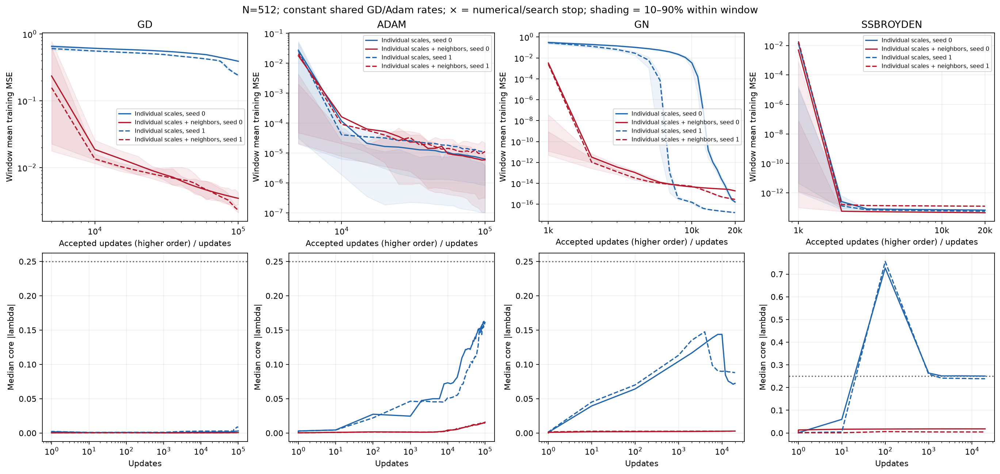
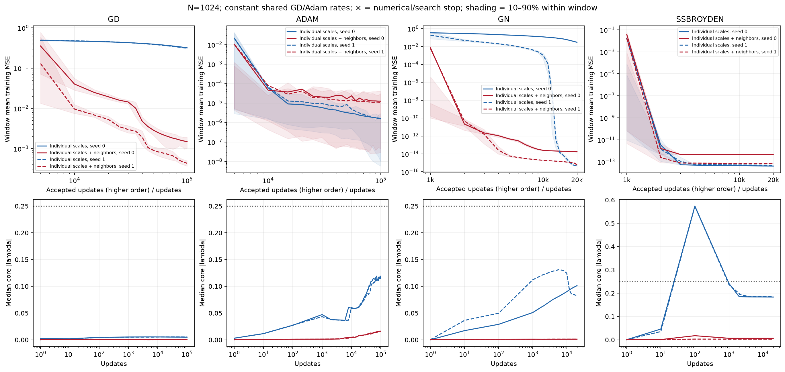
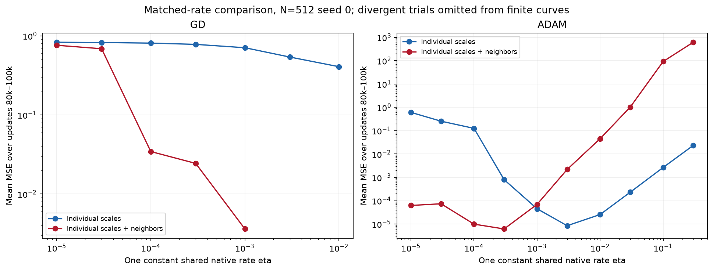
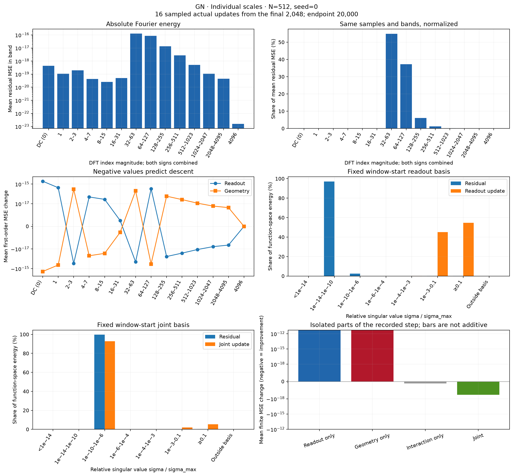
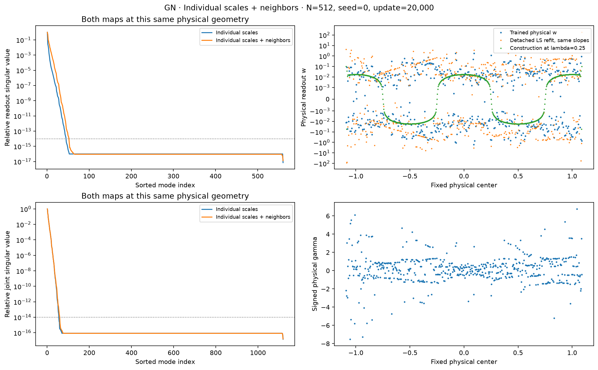
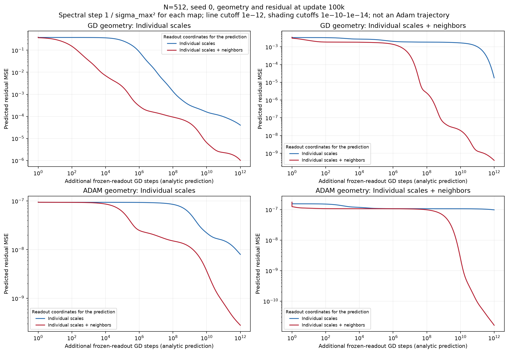
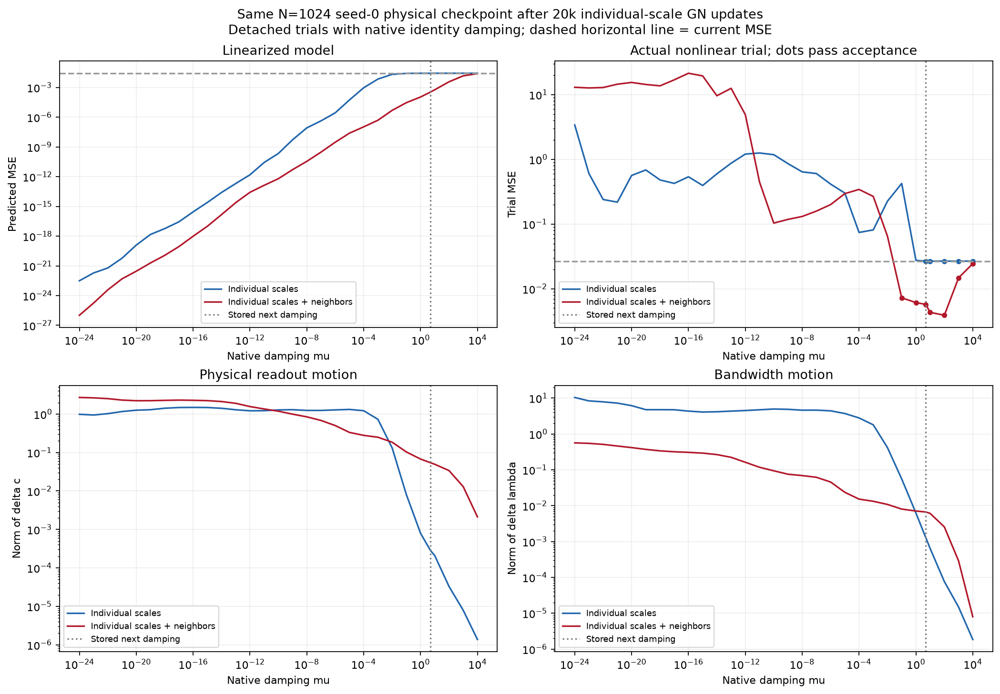
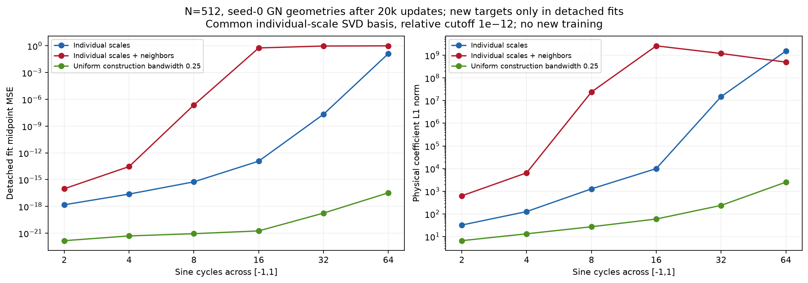

# Joint training with individual scales and neighboring readouts

Neighboring readouts improve GD substantially and accelerate the early progress
of damped Gauss–Newton, but do not uniformly improve Adam or final higher-order
accuracy. Curvature-aware methods reach much lower errors than the constant-rate
first-order runs. Their remaining limitations differ: damping and slow joint
motion for GN, and curvature guards or loss of a descent direction for SSBroyden.
None of these results makes the construction bandwidth $0.25$ a uniquely learned
geometry. This is one smooth target, two widths, and two paired seeds.

**Notation and evidence roles.** Errors are MSE; the training objective is half-MSE.

| Term used throughout | Definition |
|---|---|
| Physical parameters | $c=(b,w)$ and slopes $\gamma$ in $f(x)=b+\sum_jw_j\tanh(\gamma_j(x-t_j))$. |
| Bandwidth | $\lambda_j=h\gamma_j$, with $h=2/N$. Signed slopes are allowed. |
| Individual scales | Train $c_j=\alpha_j u_j$ and $\lambda$; code label `parameter_scale`. |
| Individual scales + neighbors | Train $q_j=A_jv_j$, $A_j=\sum_{k\le j}\alpha_k$, and recover $w_j=q_j-q_{j-1}$ with $q_0=0$; code label `parameter_differences`. Bias remains $b=\alpha_bu_b$. |
| Reference allowances | Fixed $\alpha$ evaluated at $\lambda_{\rm ref}=0.25$, including the corrected halos. They are construction bounds, not parameter constraints. |
| Shared rate | One constant scalar $\eta$ for both native parameter blocks in GD or Adam. There is no scheduling or independent readout/geometry rate tuning. |
| GN | Damped Gauss–Newton: solve a regularized linearized least-squares problem for the joint parameter step. |
| SSBroyden | Self-scaling Broyden, maintaining a full approximate inverse Hessian. |
| Detached fit/probe | A diagnostic computation at saved parameters; its coefficients and trial steps never enter the original training runs. |
| DC | The constant spatial component, Fourier index zero. |

## Fixed-horizon results

The following values are **late-window mean training MSE**, with **seed 0 / seed 1**
shown explicitly. GD/Adam use the final 20k states before 100k updates; GN and
SSBroyden use the final 4k states before 20k accepted updates. These checkpoints
remain fixed even when the trajectories are continued. Selected scalar rates
and guards are listed below; they are not retuned for the transfer cases.

**Comparison MSE at prescribed horizons.** Each cell lists seed 0 / seed 1; these are late-window means, not minima.

| Optimizer | $N$ | Individual scales, seed 0 / 1 | Individual scales + neighbors, seed 0 / 1 |
|---|---:|---:|---:|
| GD | 512 | $0.407\;/\;0.270$ | $3.62\times10^{-3}\;/\;2.74\times10^{-3}$ |
| GD | 1024 | $0.329\;/\;0.320$ | $1.56\times10^{-3}\;/\;4.70\times10^{-4}$ |
| Adam | 512 | $6.97\times10^{-6}\;/\;1.18\times10^{-5}$ | $6.18\times10^{-6}\;/\;1.09\times10^{-5}$ |
| Adam | 1024 | $1.70\times10^{-6}\;/\;1.70\times10^{-6}$ | $1.27\times10^{-5}\;/\;1.11\times10^{-5}$ |
| GN | 512 | $2.04\times10^{-15}\;/\;1.79\times10^{-17}$ | $2.39\times10^{-15}\;/\;3.60\times10^{-16}$ |
| GN | 1024 | $3.89\times10^{-2}\;/\;7.70\times10^{-16}$ | $1.79\times10^{-14}\;/\;9.28\times10^{-16}$ |
| SSBroyden | 512 | $6.69\times10^{-14}\;/\;5.59\times10^{-14}$ | $4.44\times10^{-14}\;/\;1.23\times10^{-13}$ |
| SSBroyden | 1024 | $4.16\times10^{-14}\;/\;4.90\times10^{-14}$ | $4.55\times10^{-13}\;/\;6.96\times10^{-14}$ |

<figure>
  
  <figcaption>Width 512. Lines show consecutive-window mean MSE and saved median core bandwidth. Shading is within-window 10th–90th percentiles, not confidence intervals. Solid/dashed lines identify seeds 0/1. Neighboring GN improves much earlier; individual-scale GN later catches up. The dotted 0.25 line is the construction reference.</figcaption>
</figure>

<figure>
  
  <figcaption>Width 1024, with rates and guards transferred unchanged. Individual-scale GN has a large seed dependence at 20k accepted updates. Neighboring Adam has worse late-window means in both seeds. Horizons and plotting conventions match the comparison table.</figcaption>
</figure>

There are three qualifications to the apparent optimizer ranking. First,
neighboring GN is much faster initially, but at width 512 the individual-scale
arm later catches up and attains lower endpoint errors. Second, width-1024
individual-scale GN has a strong seed dependence: seed 0 is still at MSE
$0.0267$ after 20k accepted steps, while seed 1 reaches $4.21\times10^{-16}$.
The slow run's actual damping is still $4.93$, with alternating slope updates;
its tiny configured damping floor is irrelevant. Third, SSBroyden with smaller
curvature thresholds reaches about $3\times10^{-19}$ before explicit search
failure. Those failures are scientifically informative even though they are
ineligible for the completed-horizon selection.

Adam's mean and median tell different stories. At width 512, seed 0, the means
are $6.97\times10^{-6}$ and $6.18\times10^{-6}$, but the medians are
$1.37\times10^{-7}$ and $1.71\times10^{-7}$. Window maxima reach
$3.99\times10^{-4}$ and $6.87\times10^{-4}$. At width 1024 the neighboring
arm has a worse mean in both seeds. The rate is constant throughout: these
excursions are part of the result, not averaged away or removed by a scheduler.

Low error does not identify a unique bandwidth. At width 512, median core
$|\lambda|$ at the comparison endpoint is:

**Learned bandwidth at width 512.** Median core absolute bandwidth, seed 0 / seed 1, at 100k first-order or 20k higher-order updates.

| Optimizer | Individual scales, seed 0 / 1 | Individual scales + neighbors, seed 0 / 1 |
|---|---:|---:|
| GD | $0.00303\;/\;0.00898$ | $0.000640\;/\;0.000648$ |
| Adam | $0.161\;/\;0.161$ | $0.0158\;/\;0.0153$ |
| GN | $0.0724\;/\;0.0881$ | $0.00288\;/\;0.00287$ |
| SSBroyden | $0.251\;/\;0.239$ | $0.0179\;/\;0.00439$ |

The neighboring GN solutions fit extremely well with much broader features
than the reference construction. This is not evidence that they recovered its
localization. Conversely, SSBroyden's individual-scale bandwidths near $0.25$
do not ensure that its remaining least-squares residual is easy to optimize.

At **every one of the 32 comparison geometries**, a detached common-basis
readout fit reaches training MSE below $3.30\times10^{-15}$ at relative SVD
cutoff $10^{-12}$. Across cutoffs $10^{-10},10^{-12},10^{-14}$, the worst
refitted MSE is respectively $7.49\times10^{-13}$, $3.30\times10^{-15}$,
and $4.12\times10^{-18}$. Midpoint fits remain comparably small. Even the
slow width-1024 GN geometry supports a $1.97\times10^{-18}$ fit at cutoff
$10^{-12}$, with coefficient $\ell_1$ norm 94.6. Expressivity at the saved
slopes therefore does not explain its large live training error.

These cutoffs define numerically resolved subspaces, not exact analytic ranks.
The live endpoint MSE changes by at most 9.01% on the doubled grid and 16.3% on
the midpoint grid; the largest discrepancy is width-1024 individual-scale
SSBroyden, seed 1, whose training MSE is $4.85\times10^{-14}$. Thus the checks
support small errors, but not identical continuous-domain floors at every
displayed digit.

## The controlled question

Does adding neighboring differences to individual parameter normalization help
joint training overcome the least-squares conditioning barrier? We compare GD,
Adam, damped Gauss–Newton (GN), and SSBroyden from identical physical initial
conditions. Readouts and slopes learn together; centers stay fixed. All reported
errors are **MSE**, although the optimized objective is half-MSE.

The neighboring representation is exactly

$$
\sum_{j=1}^{W}w_j\phi_j(x)
=\sum_{j=1}^{W-1}A_jv_j\,[\phi_j(x)-\phi_{j+1}(x)]
+A_Wv_W\phi_W(x),\qquad
\phi_j(x)=\tanh\!\left(\frac{\lambda_j}{h}(x-t_j)\right).
$$

The last feature is retained as an anchor. There is no second multiplication by
$\alpha_j$ after differencing. The cumulative allowances normalize cumulative
readouts, rather than independently treating each difference as an $O(h)$
coefficient. This changes the readout metric, including couplings between
adjacent coefficients; it is not equivalent to assigning each physical readout
another scalar learning rate.

The target is $\sqrt2\sin(2\pi x)$ on $[-1,1]$. Width labels $N=512,1024$
refer to the core resolution; with endpoints and $\lceil\sqrt N\rceil$ halo
centers on either side, there are 559 and 1089 neurons. Training is full-batch
FP64 on $16N+1$ equally spaced points. Evaluation also uses 32,768 held-out
midpoints, a doubled training grid, and 80-digit spot checks.

Initialization is the existing reference-scaled Xavier initialization: draw
$a_j\sim\mathcal N(0,2/(W+1))$ and physical Xavier slopes with standard
deviation $(5/3)\sqrt{2/(W+1)}$, set $w_j=\sqrt{\alpha_j}a_j$, and start
the bias at zero. Initial slope signs are absorbed into readouts. Both maps
encode this same physical state; cumulative coordinates are not redrawn.
Thus ordinary initial readouts are $O(h)$, while initial bandwidths are small,
of order $N^{-3/2}$. This campaign does not test a new initialization family.

## Learning rates and optimizer metrics

For $c=Tz$, GD in native coordinates gives

$$
\Delta c=-\eta TT^T\nabla_c L,\qquad
\Delta\gamma=-\frac{\eta}{h^2}\nabla_\gamma L.
$$

For individual scales, $T=\operatorname{diag}(\alpha)$, so the physical readout
multiplier is $\eta\alpha_j^2$. For neighbors, $T$ is the anchored difference
map times the cumulative allowances; $TT^T$ is coupled. Adam also uses one
shared native rate, but its moments and epsilon enter the actual physical
updates. A scalar multiplier alone does not describe those updates.

Ten constant rates, $\{1,3\}\,10^k$ for $k=-5,\ldots,-1$, were tested for
each first-order optimizer and map at $N=512$, seed 0. Every finite trial
received 100k updates. Selection uses **mean MSE over updates 80k–100k**, with
median and maximum retained. Adam uses $\beta_1=0.9$, $\beta_2=0.999$;
its native epsilon is outside the square root and `eps_root=0`.

**Selected settings.** Selection uses the final fifth of the mandatory horizon, then transfers these settings unchanged.

| Optimizer | Individual scales | Individual scales + neighbors |
|---|---|---|
| GD | $\eta=0.01$ | $\eta=0.001$ |
| Adam | $\eta=0.003$, $\epsilon=10^{-15}$ | $\eta=0.0003$, $\epsilon=10^{-12}$ |
| GN | Relative damping floor $10^{-30}$ | Relative damping floor $10^{-24}$ |
| SSBroyden | Curvature threshold $2.22\times10^{-16}$ | Curvature threshold $2.22\times10^{-16}$ |

The selected settings transfer unchanged across seeds and widths. GN's differing
selected floors are not evidence for a floor effect: none of the tested damping
floors became active. SSBroyden's selected threshold reflects the requirement
to finish 20k accepted updates; the smaller-threshold failures below attained
substantially lower errors and are reported separately.

The matched-rate plot holds Adam epsilon at its primary value $10^{-12}$.
It isolates coordinate comparisons at the same scalar rate before the guard
selection. For example, at $\eta=0.001$, neighboring GD lowers the 80k–100k
mean from $0.707$ to $0.00362$. Neighboring GD diverges at $\eta\ge0.003$
in this pilot; individual-scale GD diverges at $\eta\ge0.03$. Neighboring
coordinates improve useful progress but also change the stable rate range.

<figure>
  
  <figcaption>Width 512, seed 0, mean MSE over updates 80k–100k. Both maps use the same plotted scalar rate and primary Adam epsilon. Divergent trials are omitted from the finite curves; their counts and stopping updates remain in the sweep records. Changing coordinates changes both useful progress and the stable rate range.</figcaption>
</figure>

At $N=512$, $\alpha_{\rm core}=0.008663$, $\alpha_b=10.7639$, and the
largest corrected-halo allowance is $1.04521$. At its selected rate,
individual-scale GD therefore multiplies core readout gradients by
$7.50\times10^{-7}$, bias gradients by $1.159$, and physical slope gradients
by $655.36$. Neighboring GD's physical slope multiplier is $65.536$ and its
bias multiplier $0.1159$; its readout update must be understood through the
full coupled matrix $0.001TT^T$.

GN solves the augmented system by QR:

$$
\min_\delta\frac12\|r+J_z\delta\|^2+\frac\mu2\|\delta\|^2,
\qquad r_i=\frac{f(x_i)-y_i}{\sqrt M}.
$$

There is **no extra block-rate multiplier after this solve**. Under an invertible
linear coordinate map, the exact, undamped, uniquely determined GN step is
invariant. Native-coordinate damping instead penalizes the physical step using
the metric $T^{-T}T^{-1}$, with the corresponding slope block included.
Rank-deficient minimum-norm or truncated solutions need not have identical
physical parameter steps. These distinctions explain why the two damped GN
trajectories can differ without contradicting invariance.

More explicitly, the damping penalty in physical parameters is

$$
\frac\mu2\left[
\Delta c^T(TT^T)^{-1}\Delta c+h^2\|\Delta\gamma\|^2
\right].
$$

The scale prescription enters through this metric when damping matters.
Multiplying the solved step by new block rates would define a different method
and is not needed to express the prescribed coordinates.

GN starts with $\mu=10^{-3}\max_j\|(J_z)_j\|^2$, accepts actual/predicted
reduction above $10^{-4}$, divides damping by three when that ratio exceeds
$0.75$, and multiplies it by ten on rejection. Forty unsuccessful trials stop
the run. Higher-order horizons count accepted updates that change physical
parameters, not rejected proposals or initialization calls. First-order 100k
and higher-order 20k are prescribed horizons, not equal computational work.

## Numerical guards: a real SSBroyden limitation

At $N=512$, seed 0, the corrected SSBroyden integration gives:

**SSBroyden curvature-guard comparison.** The smaller thresholds attain lower error but fail before the required 20k accepted updates.

| Curvature threshold | Map | Accepted updates | Endpoint MSE | Outcome |
|---|---|---:|---:|---|
| Machine epsilon | Individual scales | 20,000 | $6.602\times10^{-14}$ | Completed horizon |
| Machine epsilon | Individual scales + neighbors | 20,000 | $4.392\times10^{-14}$ | Completed horizon |
| $10^{-24}$ or $10^{-30}$ | Individual scales | 7,880 | $3.231\times10^{-19}$ | Line-search failure |
| $10^{-24}$ or $10^{-30}$ | Individual scales + neighbors | 4,814 | $3.620\times10^{-19}$ | Line-search failure |

The conservative curvature guard is active on 18,571/20,000 and
19,108/20,000 accepted updates, respectively. With the smaller thresholds,
it never becomes active before failure. Changing the minimum line-search
step/interval from $10^{-15}$ to $10^{-12}$ or $10^{-6}$ changes the number
of rejected search calls but not these accepted trajectories or endpoints.

At the failed endpoints, the stored inverse-Hessian approximation $H$ and
stored gradient $g$ give a positive directional derivative $-g^THg$.
Multiplying those same FP64 values at 80-digit precision gives
$1.10\times10^{-21}$ for individual scales and $9.42\times10^{-23}$ for
neighbors. The stored approximation has lost positive definiteness in these
directions. This is a concrete curvature/search failure, rather than evidence
that the model cannot represent a better solution. The check does not recompute
the full loss gradient at 80 digits.

The failed runs' 19-point residual RMS is about $5.6\times10^{-10}$, whereas
FP64 versus 80-digit prediction discrepancies are only $1.1\times10^{-15}$
to $4.0\times10^{-15}$. Hence these stops are not measured output-roundoff
floors. Smaller guards allowed useful curvature updates much longer, but did
not by themselves preserve a reliable inverse-Hessian approximation indefinitely.

An integration correction was necessary before interpreting these results.
The [pinned library](https://github.com/IvanBioli/ssbroyden_optimistix), root
commit `4c87785c68f0fec6b09000f474daef76fb181eea` and Optimistix submodule
`8cd4931713658f8dfe4423ead6f11b348b675540`, passed Zoom's next proposed
step into the self-scaling calculation. The formula requires the accepted
step $\alpha_k$:

$$
b_k=\frac{s_k^TB_ks_k}{s_k^Ty_k}
=-\alpha_k\frac{s_k^Tg_k}{s_k^Ty_k}.
$$

The adapter changes that argument to `search_state.stepsize` and verifies the
source hash. A non-unit-step quadratic test checks the inverse-Hessian update
against the [authors' formula](https://arxiv.org/html/2603.10599v1#S2).
Ten earlier source-matching runs remain integration-audit evidence, excluded
from scientific selection. The production runs record `accepted_step` in
their identities; no hidden restart or alternative optimizer is used.

## How to read the mechanism evidence

The Fourier plots use the discrete transform of $r=(f-y)/\sqrt M$, so band
energies sum to MSE. **DC means the constant spatial component**, index zero.
Every other band combines positive and negative frequencies of the stated
index magnitude, including 64–127 and 128–255. Absolute MSE and percentage
panels use the same samples and denominator: the mean band energy divided by
the mean total energy. Evolution plots instead normalize each saved checkpoint
separately. These are DFT indices, not neuron indices.

Sixteen deterministic, stratified samples from each early/final 2048-update
window receive detailed audits. SVD projections use a fixed basis at the start
of that window; readout and joint Jacobians have separate panels, and energy
outside their left-singular-vector bases is shown explicitly. Relative singular
values below about $10^{-14}$ require cutoff sensitivity checks rather than
literal condition-number interpretation.

The finite-update decomposition evaluates the actual saved parameter change:

$$
\Delta f=\Delta f_w+\Delta f_\gamma+\Delta f_{w,\gamma},\qquad
\Delta\mathrm{MSE}=2\langle r,\Delta f\rangle+\|\Delta f\|^2,
$$

with the same sample normalization in the inner products. Here $\Delta f_w$
changes readouts alone, $\Delta f_\gamma$ changes slopes alone, and the final
term is their finite interaction. The plotted block-only MSE changes are
counterfactual parts of the recorded joint step, not separately trained models.
They are **not additive**, because the squared joint change includes cross terms.

The measured behavior differs by optimizer. In width-512, seed-0 GD with
individual scales at 100k updates, 98.2% of sampled residual energy lies below
relative readout singular value 0.1, but only $4.28\times10^{-7}$ of the
readout-update energy does. About 97% of the readout's predicted linear MSE
reduction comes from the bias. The algorithm moves strongly in directions that
already have high sensitivity, while barely moving the weak residual modes.
Neighboring GD improves the error substantially but retains this mismatch.

Adam's sampled excursions concentrate at low frequencies: at that same horizon,
DC accounts for 76.9% of residual energy in individual coordinates, while DC
and the first frequency pair together account for 96.4% with neighbors. In
the neighboring arm, mean first-order predicted MSE change is
$-4.85\times10^{-5}$, but the quadratic cost is $5.09\times10^{-5}$, giving
a small net increase over these sampled steps. These deterministic, full-batch
excursions are not evidence of stochastic data noise.

GN provides an important counterexample to interpreting the readout update
alone. At width 512, seed 0, with individual scales, 99.6% of residual energy
lies below relative readout singular value $10^{-6}$ and almost none of the
readout update does. But **92.7% of the joint update energy lies in weak joint
directions below $10^{-6}$**. Readout and geometry function changes have cosine
almost $-1$. Each isolated block would increase MSE by about
$5.13\times10^{-12}$; their coordinated joint step decreases it by about
$1.60\times10^{-19}$. The residual is concentrated in DFT bands 32–63
(54.8%) and 64–127 (37.3%), both shown below. Curvature information enables
coordinated cancellation and progress that a readout-only diagnostic would miss.

<figure>
  
  <figcaption>Individual-scale GN, width 512, seed 0, 16 sampled updates from the final 2048 before update 20k. The two Fourier energy panels use the same denominator and display every band. Readout motion alone occupies strong readout directions, while the combined update acts mainly in weak joint directions. The isolated-block bars are not additive: the joint step depends on cancellation between the blocks.</figcaption>
</figure>

The physical coefficient plot also distinguishes a learned representation from
the construction. Both can fit the sine while using very different slopes and
coefficients. The detached refit uses the trained slopes and cutoff $10^{-12}$;
the construction overlay uses uniform $\lambda=0.25$, so its coefficients are
a reference representation, not desired coefficient labels at the learned slopes.
For neighboring GN here, 53.0% of adjacent slope pairs have opposite signs.
Their implemented feature differences are therefore not the same localized
bumps as in the equal-positive-slope theorem. Flipping both a neuron's slope
and readout preserves its function, but applying the fixed neighboring map
after such flips changes the optimizer's metric. No such sign conversion is
performed during this campaign.

<figure>
  
  <figcaption>Neighboring GN, width 512, seed 0, after 20k accepted updates. Both spectra are evaluated at the same physical model. Readouts and signed slopes remain attached to their fixed centers. The trained and refitted coefficients differ substantially from the construction; the very small singular values below the dotted diagnostic cutoff should not be read as precise real-arithmetic condition numbers.</figcaption>
</figure>

## Separating the mechanisms at saved checkpoints

These follow-ups were chosen after inspecting the original results. They use
the original comparison checkpoints, do not select new training rates, and do
not overwrite any trained parameters.

**Weak readout modes remain slow when geometry stops moving.** For each saved
dictionary, we evaluate the exact linear GD recurrence using the SVD and a
constant spectral step $\eta=1/\sigma_{\max}^2$. Each physical checkpoint is
tested in both readout coordinate systems. This normalizes the fastest mode's
rate and exposes the remaining spectral spread. It is an analytic diagnostic,
not a prediction of Adam or of subsequent joint training.

At the width-512, seed-0 individual-scale GD checkpoint, removing 90% of the
current residual energy requires approximately $2.51\times10^6$ frozen GD
steps in individual coordinates, versus 858 in neighboring coordinates.
At the geometry actually learned by neighboring GD, the corresponding counts
are about $3.41\times10^{11}$ and $10^7$. These are the first sampled counts
crossing the stated energy reduction on a logarithmic evaluation grid, with
cutoff $10^{-12}$. Neighbor differences can greatly improve conditioning at a
fixed geometry, while joint training can still arrive at a dictionary whose
remaining residual is difficult for either first-order readout system.

<figure>
  
  <figcaption>Width 512, seed 0, geometry and residual at 100k updates. Within each panel only the diagnostic readout coordinates change. Curves use each map's spectral step; shading spans SVD cutoffs 10⁻¹⁰–10⁻¹⁴. The very long horizontal axis is an analytic extrapolation with fixed geometry, not trillions of executed updates.</figcaption>
</figure>

**The difficult GN checkpoint is sensitive to the damping metric.** At the
width-1024, seed-0 individual-scale checkpoint, MSE is $0.0266740$ and stored
next damping is $4.9277$. One detached step at that same damping yields MSE
$0.0266674$ in individual coordinates, versus $0.00571214$ after converting
the readouts to neighbors. Both trials pass the training acceptance rule.
Reducing damping arbitrarily does not fix the individual-scale step: its
linearized residual becomes very small while the actual nonlinear trial error
becomes much larger. Large slope motion invalidates the linear approximation.

The invariance control is essential. Expressing the **same individual-scale
physical damping penalty in both coordinate maps**, and solving both augmented
systems by QR, gives relative differences of $1.29\times10^{-12}$ in readout
steps, $9.35\times10^{-15}$ in bandwidth steps, and $4.25\times10^{-14}$ in
linearized function steps. The native-identity comparison changes the metric;
the coordinate-only control agrees. No additional learning-rate scaling is
applied after a GN solve.

<figure>
  
  <figcaption>Detached trials from the difficult width-1024 GN checkpoint. Native identity damping gives different physical penalties in the two maps. Dots mark trials satisfying the unchanged acceptance rule; the dotted vertical line marks stored damping. Tiny computed linearized residuals at low damping do not imply accurate nonlinear steps. The reported same-metric QR control is a separate comparison.</figcaption>
</figure>

**The broad learned geometry is target-specific.** We replace only the right-hand
side of the detached readout fit by normalized sines with 2, 4, 8, 16, 32, and
64 cycles across the domain. All geometries use the same individual-scale SVD
basis convention and three cutoffs. These are new diagnostic targets, not newly
trained models. Uniform positive slopes at $\lambda=0.25$ provide the reference.

For 32 cycles at width 512 and cutoff $10^{-12}$, the two neighboring GN
geometries give midpoint MSE $0.945$ and $0.915$, with very large fitted
coefficients. The uniform-$0.25$ geometry gives $1.78\times10^{-19}$ and
coefficient $\ell_1$ norm 238. Across all three cutoffs, the neighboring
geometries' errors remain $0.886$–$0.966$. The original two-cycle sine is much
easier for those same dictionaries. Thus their excellent training error does
not establish useful localization for a broader frequency range.

<figure>
  
  <figcaption>Width 512, seed-0 GN geometries after 20k updates, compared with uniform bandwidth 0.25. Midpoint MSE and physical coefficient norm use cutoff 10⁻¹². Broad neighboring geometry fits the original sine but becomes a poor, coefficient-intensive dictionary for higher frequencies. Cutoff and seed repeats are retained in the probe records.</figcaption>
</figure>

The frequency probes also measure the instantaneous geometry force from residual
outside the retained readout space, keeping the **stored trained readouts** in
$J_\lambda$. For the 32-cycle probe at neighboring GN's width-512, seed-0
checkpoint, this outside residual has MSE $0.945$, but its bandwidth-gradient
norm is only $5.59\times10^{-7}$ at cutoff $10^{-12}$. The second seed gives
outside MSE $0.915$ and norm $1.08\times10^{-7}$. Projection cutoffs change
the force magnitudes and sometimes the sign of uniform bandwidth growth, so
they do not establish a unique attracting direction. They do show how a large
unresolved target component can supply a small geometry signal. This is a
local diagnostic of the gamma hypothesis, not a measured exponential law for
new joint-training tasks.

## What the theory can and cannot explain

With geometry fixed and native readout matrix $B=U\Sigma V^T$, GD evolves
each represented residual mode as

$$
\langle u_i,r_{k+1}\rangle
=(1-\eta\sigma_i^2)\langle u_i,r_k\rangle.
$$

At a stable rate controlled by the largest singular value, weak modes require
many updates. Exponential singular-value decay therefore gives exponential
iteration costs for those modes. An SVD solve can divide by retained singular
values directly, so a successful detached fit does not establish good
conditioning. Two widths of nonlinear joint training do not prove a universal
exponential training-time law.
Nor does this recurrence establish a barrier for every algorithm that uses
gradients: SSBroyden itself estimates dense curvature from gradient differences.
The proven modal rate is for GD on a fixed dictionary; Adam's limitations here
are measured behavior, not a corresponding general complexity theorem.

Individual normalization supplies meaningful parameter units; it does not
whiten the full Jacobian. Neighboring differences suppress the common step-like
component when adjacent slopes are comparable, but do not remove every weak
mode. Heterogeneous or opposite-sign slopes also change that localization
argument. Adam's diagonal adaptation is not a full spectral inverse, whereas
GN and SSBroyden use cross-parameter curvature information.

There are also two distinct sources of poor conditioning. The
[neighbor-difference theorem](../../../docs/neighbor_difference_conditioning.md)
shows that differencing removes a cumulative-coordinate penalty for a uniform
interior lattice, while its fine-pattern gain still decays exponentially as
$\lambda$ becomes small. In lattice coordinates, the smoothing multiplier is

$$
M_\lambda(\omega)=
\frac{\pi\omega/(2\lambda)}{\sinh(\pi\omega/(2\lambda))},
\qquad M_\lambda(0)=1.
$$

Here $\omega$ is frequency in units of center spacing. In the ideal infinite
uniform lattice at $\lambda=0.25$, the constant-to-alternating singular-gain
ratio is already about $1.05\times10^7$. GD's modal time-scale ratio is its
square, about $1.1\times10^{14}$. These are worst-mode properties of that
ideal dictionary, not measured iteration counts for our sine residual.
Localization and neighbor differences therefore do not imply that every
least-squares direction becomes easy for first-order optimization.

On the finite observation interval, an outer halo
feature can instead become almost constant and cancel the bias. Its remaining
signal is bounded by $2e^{-2\lambda R}$, with $R=\lceil\sqrt N\rceil$.
Increasing localization can therefore improve the interior spectrum while
weakening a halo direction. A full condition number alone neither identifies
the troublesome spatial region nor says whether the current target needs that
direction. Residual occupancy and the recorded core/halo gradient contributions
are needed alongside the spectrum.

The geometry gradient is $J_\lambda^Tr$. Once the readouts explain the target
well, the residual force that would drive further geometry improvement can
become very small. Rescaling parameters cannot create a missing projection or
make $\lambda=0.25$ a unique attractor of the MSE objective. The construction's
bandwidth is a useful approximation reference; training this single smooth sine
can use broad, heterogeneous features and cancellation instead. These results
must distinguish fitting the target from recovering the construction geometry.

## Evidence and reproduction

The [execution protocol](../../../experiments/expD06_fixed_center_scales/README.md#joint-conditioning-individual-scales-and-neighboring-differences)
defines the paired initialization, constant-rate grid, accepted-step horizons,
guard comparisons, Slurm launcher, and post-hoc follow-ups. The
[fixed-horizon records](joint_conditioning_analysis/mandatory/summary.json)
retain each case configuration, source-checkpoint hashes, cutoff-sensitive fits,
gradient budgets, parameter motion, precision checks, and endpoint metrics.
The [pilot and guard sweep](joint_conditioning_analysis/mandatory/sweep_summary.json)
retains divergent and failed cases as well as eligible comparisons. The
[corrected SSBroyden audit](joint_conditioning_analysis/ssb_guards/summary.json)
includes the 80-digit stored-direction checks.

The detached [frozen-mode and frequency probes](joint_conditioning_analysis/probes/frozen_summary.json),
[uniform-bandwidth frequency reference](joint_conditioning_analysis/probes/reference_frequency.json),
and [GN damping control](joint_conditioning_analysis/probes/damping_probe.json)
retain their settings and source hashes. Training uses the pinned FP64 JAX
environment recorded in the per-allocation metadata. The compact committed
evidence includes histories, window loss distributions, the displayed figures,
and these numerical records; full checkpoint states, dense per-parameter
gradients, and traces are retained separately from Git.
