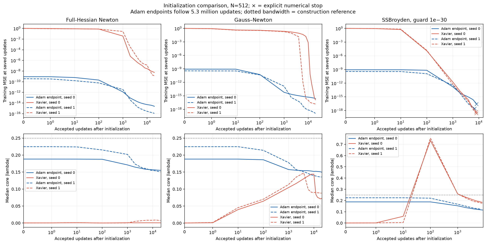
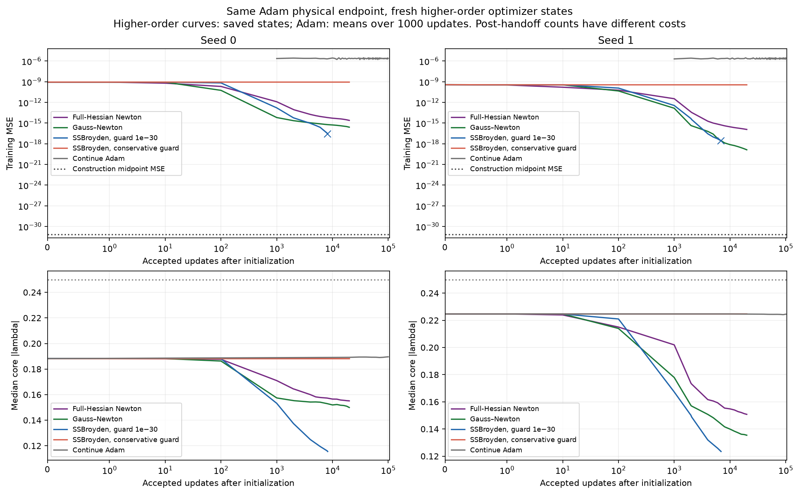
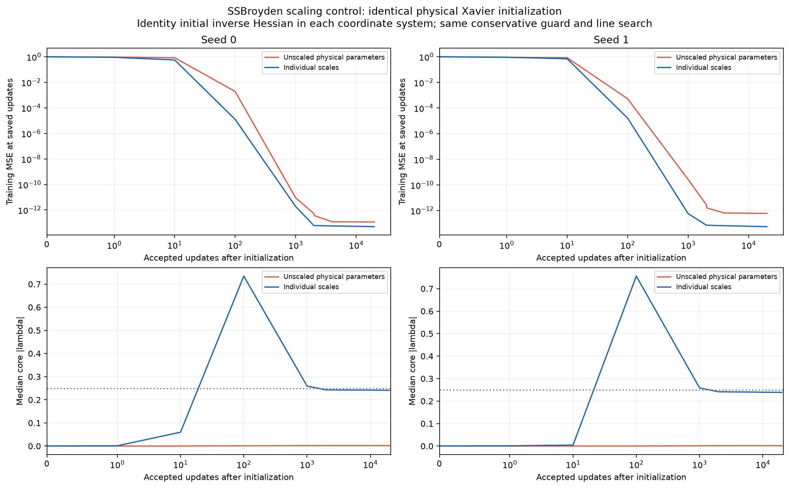
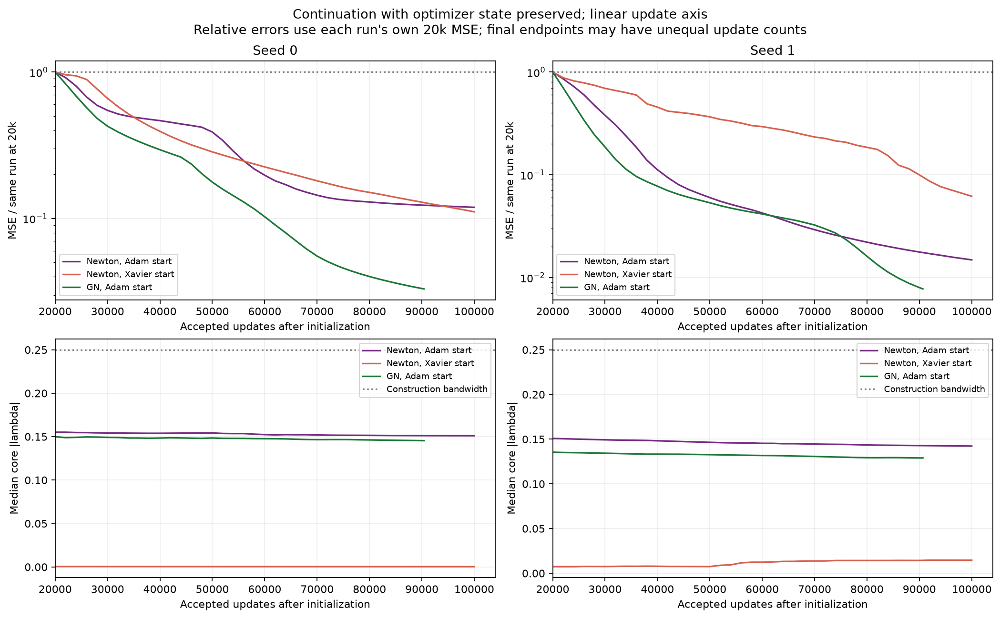
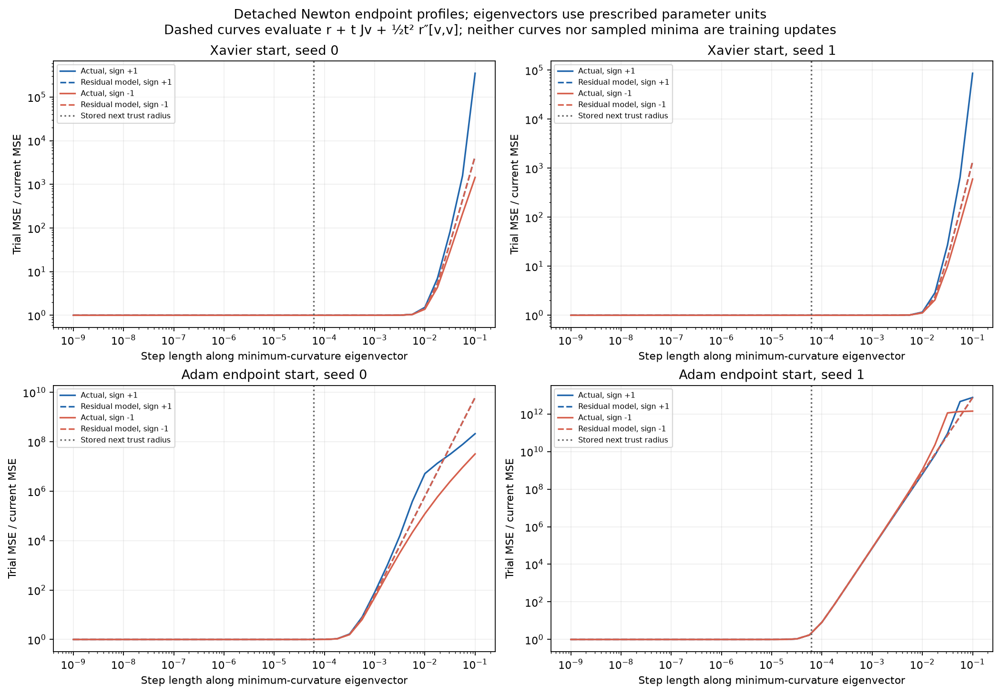
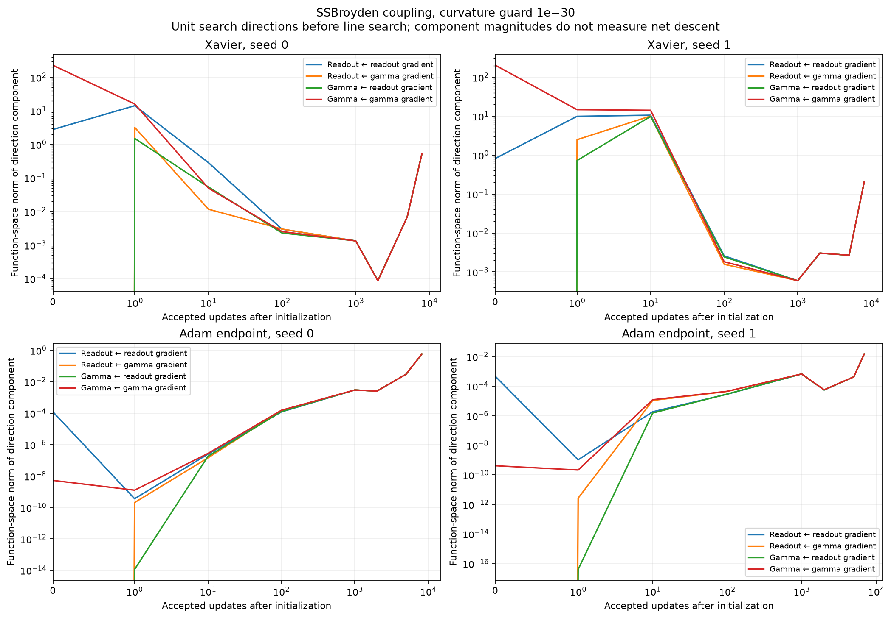
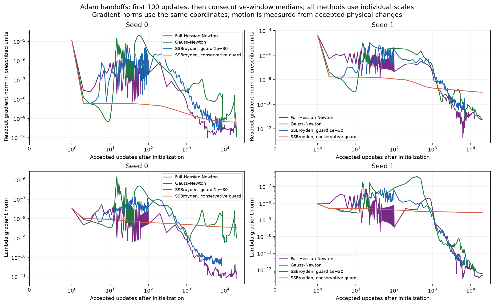
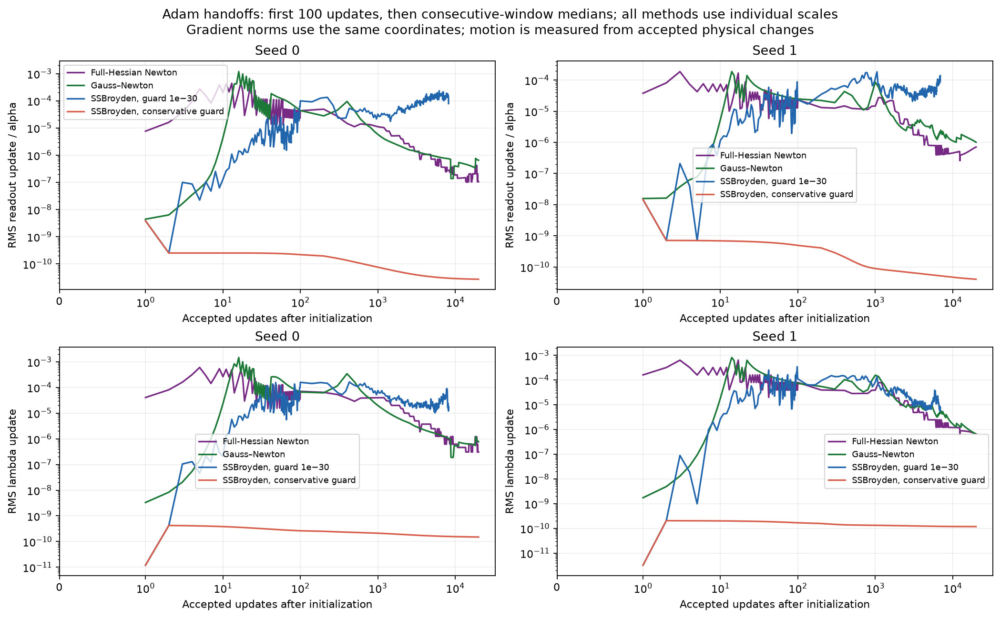
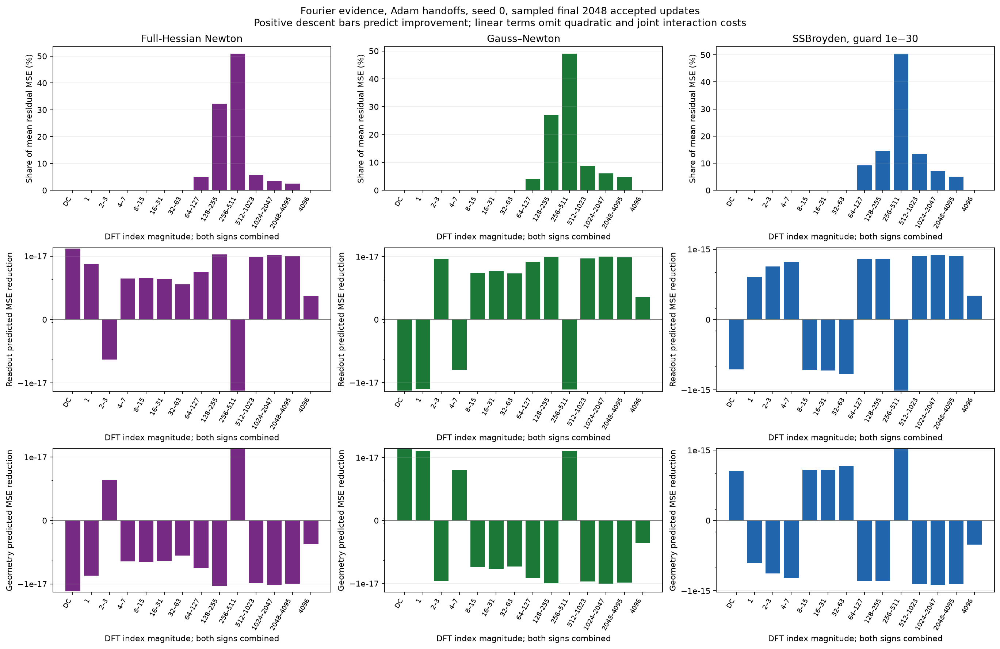

# Full Newton, Adam handoffs, and SSBroyden scaling

Adam provides a substantially better starting point for full-Hessian Newton,
but Newton does not automatically recover the construction's bandwidth or its
precision. At 20k accepted updates, Newton from Adam reaches MSE
$2.43\times10^{-15}$ and $1.18\times10^{-16}$; from Xavier it reaches
$5.64\times10^{-9}$ and $1.35\times10^{-9}$. The same Adam endpoints handed to
Gauss–Newton reach $2.53\times10^{-16}$ and $1.32\times10^{-19}$.
Longer training improves the best Adam-to-GN run to MSE
$1.02\times10^{-21}$, with the exact horizons and initialization controls below.

These are trained endpoint errors, not detached least-squares fits. They remain
far above the construction's accuracy. The finite training horizons do not
establish convergence or a machine-precision floor.
The paired SSBroyden control also shows a lasting scaling effect on geometry:
median bandwidth near 0.24 with individual scales versus near 0.002 without
them. Numerical curvature guards then limit its attainable training accuracy.

**Terminology.** Physical parameter values are distinguished from their optimization coordinates.

| Term | Meaning in this report |
|---|---|
| Physical parameters | $c=(b,w)$ and $\gamma$ in $f(x)=b+\sum_jw_j\tanh(\gamma_j(x-t_j))$. |
| Bandwidth | $\lambda_j=h\gamma_j$; plotted summaries use core $\lvert\lambda\rvert$. |
| Individual scales | Optimize $z=(u,\lambda)$ with $c=\operatorname{diag}(\alpha)u$ and $\gamma=\lambda/h$. Code label: `parameter_scale`. |
| Unscaled physical parameters | Optimize $(c,\gamma)$ directly. Code label: `physical`. |
| Reference allowances $\alpha$ | Fixed construction-derived individual coefficient scales, including corrected halos, evaluated at $\lambda_{\rm ref}=0.25$. They are normalizations, not constraints. |
| Xavier start | The existing paired physical initialization described below. Changing optimizer coordinates does not redraw parameters. |
| Adam start | The fixed 5.3-million-update Adam checkpoint, transferred physically into a fresh higher-order optimizer state. |
| Detached probe | An analysis at saved parameters whose trial steps or refitted coefficients never enter training. |

## The fixed 20k comparison

Every higher-order run was required to take 20k accepted physical updates,
unless it encountered an explicit numerical failure. Twelve of the sixteen
new trajectories complete that horizon; all four small-guard SSBroyden runs
stop on line-search failures. They are reported separately, not treated as
converged or selected as successful 20k runs.

**Endpoint training MSE and median core $|\lambda|$ after 20k accepted updates. Each pair is seed 0 / seed 1. The GN Xavier baseline is the existing matched-setting run.**

| Method and start | MSE, seed 0 / 1 | Median $\lvert\lambda\rvert$, seed 0 / 1 |
|---|---:|---:|
| Full Newton, Xavier | $5.64\times10^{-9}\;/\;1.35\times10^{-9}$ | $0.000524\;/\;0.00741$ |
| Full Newton, Adam | $2.43\times10^{-15}\;/\;1.18\times10^{-16}$ | $0.155\;/\;0.151$ |
| GN, Xavier, previous baseline | $1.33\times10^{-16}\;/\;1.53\times10^{-17}$ | $0.0724\;/\;0.0881$ |
| GN, Adam | $2.53\times10^{-16}\;/\;1.32\times10^{-19}$ | $0.150\;/\;0.135$ |
| SSBroyden, individual scales, Xavier, conservative guard | $4.92\times10^{-14}\;/\;5.53\times10^{-14}$ | $0.241\;/\;0.239$ |
| SSBroyden, individual scales, Adam, conservative guard | $8.72\times10^{-10}\;/\;3.53\times10^{-10}$ | $0.188\;/\;0.225$ |
| SSBroyden, unscaled physical parameters, Xavier, conservative guard | $1.15\times10^{-13}\;/\;6.02\times10^{-13}$ | $0.00207\;/\;0.00175$ |

Adam initialization helps full Newton markedly in both seeds. Its effect on
GN is mixed: seed 1 improves greatly relative to the Xavier baseline, while
seed 0's 20k endpoint is slightly worse. Adam initialization is not a universal
improvement for every higher-order method. Nor does any of these methods
identify a unique geometry from fitting this single sine.
Both readouts and slopes are transferred, so this does not isolate the benefit
of Adam's geometry from the benefit of its already-trained coefficients.

<figure>
  
  <figcaption>Initialization changes both the error trajectory and the learned bandwidth. Curves connect saved checkpoints; solid and dashed lines distinguish seeds. Crosses mark explicit SSBroyden failures. The Adam starts include 5.3 million prior updates, so these are initialization comparisons rather than equal-total-cost competitions.</figcaption>
</figure>

The continued-Adam controls take another 100k updates with unchanged moments,
rate, and epsilon. Their final-20k mean MSE is $2.33\times10^{-6}$ and
$2.31\times10^{-6}$, while medians are $1.33\times10^{-9}$ and
$8.42\times10^{-10}$. The means remain dominated by excursions, with maxima
$1.61\times10^{-4}$ and $1.29\times10^{-4}$. Comparing only a quiet Adam
checkpoint to its continuation mean would obscure this distinction.

<figure>
  
  <figcaption>Fresh higher-order states start from the same physical Adam endpoint. Higher-order lines show saved-state MSE; the continued-Adam line shows means over 1,000 updates. The construction is a separately evaluated reference, not a trained model. Both seed panels use the same MSE limits. Higher-order fits improve while their median bandwidths decrease away from 0.25.</figcaption>
</figure>

The scale control provides direct evidence that SSBroyden's initial physical
metric has a persistent effect: median core bandwidth differs by factors of
116 and 136 at 20k updates. Individual scaling improves MSE by factors of 2.33
and 10.9 relative to the unscaled control, but it does not remove the plateau.
This comparison changes the physical initial inverse Hessian while preserving
the physical initial model, target, line search, and conservative guard.
The encoded initial slopes match bitwise; readouts differ by at most
$3.5\times10^{-18}$ from coordinate roundoff, recorded in the
[initialization check](newton_handoffs_analysis/initialization_verification.json).
Most late curvature updates in this comparison are guarded. Thus this is a
lasting trajectory effect in the tested guarded solver; it does not establish
the same difference after unrestricted inverse-Hessian adaptation. The
small-guard runs do not include a paired unscaled arm.

This geometry difference also changes the readout dictionary. Evaluated with
the same individual readout normalization and relative SVD cutoff $10^{-12}$,
the scaled endpoints retain 484 and 476 directions, versus 24 and 27 for the
unscaled endpoints. These are cutoff-dependent numerical ranks. Nevertheless,
the narrow unscaled geometry can fit this single sine: detached readout fits
at cutoff $10^{-14}$ reach MSE $2.63\times10^{-20}$ and
$1.85\times10^{-21}$, with physical coefficient $\ell_1$ norms about 8,674
and 9,237. The scaled geometries' corresponding norms are 171 and 296, with
MSE $1.86\times10^{-20}$ and $3.10\times10^{-19}$. A low error on this
one smooth target therefore does not by itself identify a well-localized,
numerically rich dictionary or the construction's coefficient scale.
Nor is median bandwidth near 0.24 equivalent to the uniform construction:
the scaled runs' core 10th–90th percentile ranges are approximately
$[0.121,0.506]$ and $[0.111,0.512]$.

<figure>
  
  <figcaption>Identical physical Xavier starts, distinct initial physical inverse-Hessian metrics. Individual scaling rapidly changes geometry and finishes near median bandwidth 0.24; unscaled SSBroyden finishes near 0.002. Both continue taking accepted steps after their rapid initial loss reduction has slowed.</figcaption>
</figure>

## What longer training changes

After the fixed comparison, the four Newton runs and two Adam-to-GN runs
continued with their optimizer states preserved, advancing in 10k blocks.
All six complete a common 90k horizon. The allocation ends during the next
GN block, so the final endpoints have the different counts shown below.
Every trajectory remains numerically viable; the stop is a budget limit,
not a convergence declaration. The SSBroyden and continued-Adam controls retain
their previously reported horizons.

**Final trained endpoints. Improvement factors compare each run with its own 20k endpoint.**

| Method and start | Seed | Accepted updates | Training MSE | Improvement since 20k | Median core $\lvert\lambda\rvert$ |
|---|---:|---:|---:|---:|---:|
| Full Newton, Xavier | 0 | 100,000 | $6.26\times10^{-10}$ | $9.0\times$ | 0.000330 |
| Full Newton, Xavier | 1 | 100,000 | $8.36\times10^{-11}$ | $16.2\times$ | 0.0146 |
| Full Newton, Adam | 0 | 100,000 | $2.90\times10^{-16}$ | $8.4\times$ | 0.151 |
| Full Newton, Adam | 1 | 100,000 | $1.74\times10^{-18}$ | $67.5\times$ | 0.142 |
| GN, Adam | 0 | 90,390 | $8.35\times10^{-18}$ | $30.3\times$ | 0.145 |
| GN, Adam | 1 | 90,666 | $1.02\times10^{-21}$ | $129.4\times$ | 0.129 |

<figure>
  
  <figcaption>The linear update axis isolates training after 20k. Each error curve is divided by its own 20k MSE, so relative progress can be compared despite very different absolute errors. Curves stop at the actual saved endpoints. Continued improvement does not systematically move median bandwidth toward the uniform construction's 0.25.</figcaption>
</figure>

The best GN endpoint has training L2RE $3.20\times10^{-11}$ and midpoint
MSE $9.94\times10^{-22}$. It remains far from the construction. The
substantial later reductions show that the 20k errors were not established
floors. Newton from Xavier still leaves many slopes very small; some grow
substantially, so its small median should not be read as uniformly frozen
geometry. The complete quantiles, coefficient norms, and checkpoints are in
the [continuation comparison](newton_handoffs_analysis/extension_comparison.json).

Adam initialization remains mixed for GN at the longer **matched 40k**
horizon available in the existing controls. Xavier-started GN reaches
$1.63\times10^{-18}$ and $4.61\times10^{-18}$, while Adam-started GN reaches
$7.45\times10^{-17}$ and $1.02\times10^{-20}$. Thus the Adam start is
45.7 times worse in seed 0 and 451 times better in seed 1. These are matched
higher-order update counts, with Adam's prior 5.3 million updates additional;
they do not establish a universal benefit or an equal-total-cost advantage.
The [paired checkpoint record](newton_handoffs_analysis/gn_matched_40000.json)
includes hashes of both old and new source files.

## What was held fixed?

The target is $\sqrt{2}\sin(2\pi x)$ on $[-1,1]$. There are $N=512$ interior
cells, $h=2/N$, and 559 fixed centers including the $\lceil\sqrt N\rceil=23$
halo centers on either side. The 513 centers on the closed physical interval
are called the core. Training uses 8,193 equally spaced points, full batches,
FP64, and seeds 0 and 1. Evaluation includes an independent midpoint grid and
a doubled training grid. Signed slopes are permitted during optimization.
The evaluation grids diagnose between-point error; they were not used to
choose checkpoints or tune settings in this follow-up. These deterministic
function-approximation checks are not a population generalization study.

The ordinary readout scale is $\alpha_j=0.00866299$, the bias scale is
$\alpha_b=10.7639$, and corrected halo allowances range up to $1.04521$.
Thus $c=\alpha u$ uses individual $O(h)$ readout scales, not the earlier
collective square-root normalization. The slope multiplier is $1/h=256$.

The Xavier physical initialization is unchanged from the previous campaign:
draw independent standard-normal $\xi_j,\zeta_j$, then set

$$
\gamma_j=\frac53\sqrt{\frac{2}{560}}\,|\zeta_j|,
\qquad
w_j=\sqrt{\alpha_j}\sqrt{\frac{2}{560}}\,
\xi_j\operatorname{sign}(\zeta_j),\qquad b=0.
$$

The sign transfer is a function-preserving representation of signed Xavier
slopes. Initialization and training coordinates are different choices: the
square root in this fixed initialization does not change the subsequent
$c=\alpha u$ optimization map.

The Adam sources use the individual scales, shared constant rate $\eta=0.003$,
and Adam epsilon $10^{-15}$. We take the prescribed endpoints, without selecting
the best checkpoint. Their MSEs are $8.74\times10^{-10}$ and
$3.68\times10^{-10}$; median core bandwidths are 0.188 and 0.225.
The continued-Adam controls preserve moments and the original update clock.
The higher-order handoffs reset their optimizer state, but preserve the model's
physical parameters. Source file hashes and transfer roundoff are recorded.

This follow-up trains the individual-scale map and its physical SSBroyden
control. Neighboring readouts remain available as detached conditioning probes;
the previous [joint-training report](joint_conditioning_results.md) contains
the trained neighboring comparisons. No new neighboring arm is silently mixed
into these initialization comparisons.

## The methods and their coordinate dependence

Write the normalized residual as $r_i=(f(x_i)-y_i)/\sqrt m$. The training
objective is half-MSE, $L=\frac12r^Tr$, while every error table reports MSE.
With $J=\partial r/\partial z$, the exact Hessian is

$$
\mathcal H=J^TJ+R,
\qquad
R=\sum_i r_i\nabla_z^2r_i.
$$

Full Newton computes this dense Hessian, including the readout–slope mixed
terms and the slope–slope residual-curvature terms, on every iteration. A dense
eigendecomposition solves the quadratic trust-region subproblem

$$
\min_{\|\delta z\|\le\Delta}
g^T\delta z+\tfrac12\delta z^T\mathcal H\delta z,
\qquad
(\mathcal H+\mu I)\delta z=-g.
$$

This is full-Hessian trust-region Newton, with no Gauss–Newton fallback. The
initial radius is 1, the maximum is 1,000, and the actual/predicted reduction
ratio controls acceptance and radius updates. The spectral solve handles
indefinite hard cases without an absolute small-eigenvalue cutoff. Forty
unsuccessful trial steps cause an explicit failure. No absolute loss or
gradient tolerance declares convergence.

GN minimizes $\|r+J\delta z\|^2+\mu\|\delta z\|^2$ by augmented QR,
without forming $J^TJ$. Its configured floor is relative:
$\mu_{\min}=10^{-30}\max_j\|J_{:j}\|^2$. The actual adaptive damping
stays above that floor; the stored next damping at the 20k warm endpoints is
$1.80\times10^{-11}$ and $1.41\times10^{-14}$. SSBroyden uses the pinned accepted-step integration from the
previous campaign, an identity initial inverse Hessian in its optimization
coordinates, and curvature guards $\epsilon_{\rm curv}=2.22\times10^{-16}$
or $10^{-30}$. These guards are not learning rates or Adam's denominator
epsilon. The same line-search rule is used across the paired SSBroyden cases.
Newton and GN use different acceptance and damping rules. Newton also forms
a dense Hessian in FP64, whereas GN solves the augmented Jacobian system by
QR; accuracy in very weak directions is another difference. Their trajectory
comparison therefore does not isolate the residual-curvature term alone. The saved
same-radius endpoint trials substitute $J^TJ$ for the full Hessian at fixed
parameters and radius; those are detached diagnostics, not matched training
trajectories.

For a constant invertible map $p=Sz$, an exact undamped Newton step is
coordinate invariant when the Hessian is invertible and solved exactly:

$$
\nabla_z L=S^T\nabla_pL,\qquad
\mathcal H_z=S^T\mathcal H_pS,\qquad
S\delta z=-\mathcal H_p^{-1}\nabla_pL.
$$

The trust region $\|\delta z\|\le\Delta$ instead prescribes a physical metric;
equivalently its shift is $\mu S^{-T}S^{-1}$ in physical coordinates. Damped
GN has the analogous dependence. Therefore normalization matters in the runs
reported here even though the ideal undamped full-rank step is invariant.

For SSBroyden, identity initialization in the individual-scale coordinates
means the initial physical inverse Hessian is

$$
B_{p,0}=SS^T
=\operatorname{diag}(\alpha_b^2,\alpha_1^2,\ldots,
\alpha_{559}^2,h^{-2},\ldots,h^{-2}).
$$

The unscaled control initializes $B_{p,0}=I$. These are physically different
initial update metrics. No extra independent block learning rates are added.
A verified quadratic control transforms the inverse Hessian as
$B_p=SB_zS^T$ and recovers matching physical SSBroyden iterates over multiple
updates. Identity in both coordinate systems deliberately changes that metric.
For physically corresponding secant pairs, $s_z^Ty_z=s_p^Ty_p$, so the scalar
curvature guard is consistent under this linear change in exact arithmetic.
Different trajectories can nevertheless trigger it at different times, and
FP64 arithmetic need not preserve the ideal equivalence.

## Why full Newton remains slow

At the 20k warm endpoints, the full Hessian still has negative curvature and
every accepted Newton step has used a positive trust-region shift. A small
global residual-curvature norm does not make $R$ negligible in weak directions
of $J^TJ$.

The following values come from an independent 80-digit recomputation on all
8,193 training points, using the saved FP64 physical parameters and the saved
minimum-eigenvalue direction. This evaluates $\|Jv\|^2+r^Tr''[v,v]$ directly,
without forming a Gram matrix. The target is the analytic sine rather than
bitwise GPU-generated labels.

**Independent directional curvature at the 20k warm Newton endpoints. The positive GN contribution is much smaller than the negative residual-curvature contribution.**

| Adam-start endpoint | $\lVert Jv\rVert^2$ | $r^Tr''[v,v]$ | Total curvature |
|---|---:|---:|---:|
| Seed 0, 20k | $4.73\times10^{-18}$ | $-3.76\times10^{-11}$ | $-3.76\times10^{-11}$ |
| Seed 1, 20k | $7.47\times10^{-16}$ | $-4.91\times10^{-12}$ | $-4.91\times10^{-12}$ |

The negative directions are real at these tested states. The dense Hessian's
many much smaller eigenvalues are not all independently certified. On the same
states, a detached raw undamped Hessian solve proposes steps with MSE
$8.10\times10^{-6}$ and $15.6$; seed 1's direction is even uphill to first
order. Small linear-solve backward error does not make these severely
ill-conditioned steps reliable or place them inside a useful quadratic-model
neighborhood.

<figure>
  
  <figcaption>Detached line profiles along the minimum-eigenvalue direction at 20k. Both signs are tested; step length uses the individual-scale coordinates. Larger steps eventually increase loss strongly despite negative initial curvature. The dashed curve squares the second-order residual model; it is not the quadratic Newton loss model or a complete fourth-order Taylor expansion. The vertical line is the stored next trust radius, not a demonstrated optimal step length.</figcaption>
</figure>

The line profiles admit a useful local explanation. Squaring
$r(t)\approx r+tJv+\frac12t^2r''[v,v]$ gives a positive fourth-power term
that the quadratic Newton model omits. When $Jv$ and the linear term are
small, this residual model gives

$$
\operatorname{MSE}(t)-\operatorname{MSE}(0)
\approx \kappa t^2+\tfrac14\|r''[v,v]\|^2t^4,
\qquad \kappa=v^T\mathcal Hv<0.
$$

Its nonzero minimizing step length is approximately
$|t_*|=\sqrt{-2\kappa/\|r''[v,v]\|^2}$, with MSE reduction
$\kappa^2/\|r''[v,v]\|^2$. At the warm Newton endpoints this predicts step
lengths $1.12\times10^{-5}$ and $5.34\times10^{-7}$, close to the best
sampled lengths $1.00\times10^{-5}$ and $5.62\times10^{-7}$. The measured
relative MSE improvements, independently verified at 80 digits on all training
points, are only $9.54\times10^{-7}$ and $6.92\times10^{-9}$. Doubling each
selected step already worsens MSE in both seeds. Thus a verified negative
eigenvalue can coexist with a very small useful move and tiny loss reduction.
This explains the tested directions; it is an approximate residual model,
not a convergence theorem or a characterization of the complete Newton step.

Geometry alone is not an expressivity obstruction at the warm Newton
endpoints. A detached readout SVD fit, keeping their slopes fixed, reaches MSE
$9.31\times10^{-21}$ and $1.12\times10^{-20}$ at relative cutoff $10^{-14}$.
The result is cutoff sensitive and can require larger coefficients; it is not
a trained endpoint or an exact-rank claim. Newton's live optimization gap
therefore persists even in geometry that supports much better fits.

The appropriate theoretical distinction is between small absolute loss and
being in Newton's local convergence neighborhood. When $Jv$ is tiny,
residual curvature can dominate that direction even at small loss, while
nonlinear residual changes constrain useful step lengths. This supports a
conditioning-based explanation; it does not prove a universal exponential
convergence law or identify $0.25$ as a unique optimum of this sine loss.

Correct parameter scales do not remove this obstruction by themselves. For
corresponding directions $v_p=Sv_z$, both directional terms are unchanged:

$$
\|J_zv_z\|^2=\|J_pv_p\|^2,
\qquad v_z^TR_zv_z=v_p^TR_pv_p.
$$

An invertible constant normalization can therefore change the spectrum and
the optimizer's physical step metric, but it preserves the sign of curvature
along corresponding physical directions. It cannot make an indefinite full
Hessian positive definite. The scale prescription and the local nonlinear
conditioning problem are distinct parts of the explanation.

The longer runs retain this difficulty, with an additional numerical caveat.
Every accepted Newton step through 100k still uses a positive shift. At the
warm endpoints, independent full-grid 80-digit directional curvatures are
$-1.34\times10^{-10}$ and $-2.85\times10^{-12}$. Their fixed-geometry
readout refits at cutoff $10^{-14}$ reach MSE $2.57\times10^{-21}$ and
$1.09\times10^{-20}$, so substantial optimization gaps remain.

For **cold seed 0 at 100k**, however, the smallest dense FP64 eigenvalue is
$-6.37\times10^{-10}$ while the largest is $1.74\times10^6$. Direct
80-digit evaluation along that saved eigenvector gives **positive** curvature
$4.51\times10^{-12}$. Its reported negative curvature is therefore a
numerical artifact; this test does not establish that the whole Hessian is
positive semidefinite. Cold seed 1's tested direction remains negative,
$-1.52\times10^{-8}$. The [final curvature audit](newton_handoffs_analysis/final_precision/curvature_mp80.json)
thus supports the warm-start mechanism while exposing a real FP64 limitation
of the dense Hessian analysis in the cold run.

## What the SSBroyden guards change

At the Adam starts, the conservative guard blocks curvature updates on
**19,999 of 20,000** accepted steps in each seed. The optimizer learns very
little inverse-Hessian structure after its first update. Its tiny motion and
near-unchanged loss are therefore not evidence that Adam has found a local
minimum. From Xavier, the same guard activates on 18,547 and 18,661 steps in
the scaled runs, after enough early curvature updates to reduce loss strongly.

With the guard lowered to $10^{-30}$, none of the accepted secant pairs in
these four runs triggers that guard. The optimizer resolves much weaker
directions, but eventually loses a numerically reliable descent direction.

**Small-guard SSBroyden failures. Each row is the last accepted model, not a converged solution or a completed 20k comparison. All use individual scales.**

| Start | Seed | Accepted updates | Training MSE | Training L2RE | Median core $\lvert\lambda\rvert$ |
|---|---:|---:|---:|---:|---:|
| Xavier | 0 | 7,918 | $5.35\times10^{-19}$ | $7.31\times10^{-10}$ | 0.185 |
| Xavier | 1 | 8,028 | $2.48\times10^{-19}$ | $4.98\times10^{-10}$ | 0.176 |
| Adam | 0 | 8,201 | $2.65\times10^{-17}$ | $5.15\times10^{-9}$ | 0.116 |
| Adam | 1 | 6,910 | $2.71\times10^{-18}$ | $1.65\times10^{-9}$ | 0.123 |

Here $\mathrm{L2RE}=\sqrt{\sum_i(f_i-y_i)^2/\sum_i y_i^2}$. The target's
discrete mean square is $8192/8193$, so L2RE is nearly, but not exactly, the
square root of MSE.

The full-grid 80-digit gradient audits hold the saved FP64 inverse Hessian
fixed. At warm seed 0, the gradient's derivative along the exactly multiplied
stored-matrix direction is $+1.12\times10^{-19}$: uphill. At warm seed 1 it is
$-9.84\times10^{-22}$, but a CPU FP64 multiplication of the same matrix and
stored gradient produces derivative $+6.61\times10^{-21}$. Both cold runs
also have an uphill exactly multiplied stored-matrix direction. Recomputing
the gradient at 80 digits, including an alternative exact-native-decode
interpretation, preserves these conclusions.

This separates an unreliable learned inverse Hessian from pure gradient
underflow. It also demonstrates enough cancellation for matrix-multiplication
roundoff to reverse descent. The CPU multiplication audit does not reconstruct
every internal GPU operation, so it is evidence of the vulnerability rather
than a bitwise replay of the failed line search. Simply reducing epsilon
further would not repair an inverse Hessian that already gives an uphill
direction in higher precision.

## Gradient signals, actual movement, and residual frequencies

We record physical readout and slope gradients, their gradients in the
individual-scale coordinates, and actual accepted parameter changes at every
step. These distinguish a small raw gradient from a small optimizer update.
The SSBroyden metric is also saved at logarithmically spaced checkpoints and
at the final state. Its action is decomposed into four contributions:

$$
\delta z=-Bg
=-
\begin{bmatrix}
B_{uu}g_u+B_{u\lambda}g_\lambda\\
B_{\lambda u}g_u+B_{\lambda\lambda}g_\lambda
\end{bmatrix}.
$$

These are unit search directions before line search. The off-diagonal blocks
allow readout gradients to move geometry and geometry gradients to move
readouts; there is no longer a fixed scalar ratio that describes their motion.
For the small-guard warm endpoints, the four component function-space norms
are each about 0.586 in seed 0 and 0.01495 in seed 1, yet they almost cancel.
Large individual component norms are not evidence of useful net descent.

<figure>
  
  <figcaption>SSBroyden with guard $10^{-30}$ develops strong readout–geometry coupling from both starts. Curves show function-space norms before line search, with no claim that component energies add. Near cancellation makes the much smaller combined direction sensitive to finite precision.</figcaption>
</figure>

<figure>
  
  <figcaption>Gradient norms in common prescribed coordinates. The first 100 updates are shown individually; later points are consecutive-window medians placed at window ends. The conservative SSBroyden guard leaves a substantial signal while its actual movement becomes extremely small.</figcaption>
</figure>

<figure>
  
  <figcaption>Actual parameter movement, with readouts divided by their individual allowances. Newton and GN retain coherent motion; small-guard SSBroyden moves much more strongly before failing. Conservative-guard SSBroyden moves several orders of magnitude less. These are changes in parameters, not gradient magnitudes.</figcaption>
</figure>

The final 2,048-step windows further distinguish coordinated motion from
oscillation. For warm seed 0, adjacent bandwidth-update cosines have medians
0.9949 for Newton and 0.9999999 for GN. Their net RMS bandwidth changes over
that window are 0.00176 and 0.00178. Parameters are still moving persistently.

This remains true at the later endpoints. Across the final 2,048 updates,
Newton's net RMS bandwidth changes are $6.41\times10^{-5}$ and
$2.75\times10^{-4}$; GN's are $2.43\times10^{-4}$ and
$3.62\times10^{-4}$. The updated [movement curves](newton_handoffs_analysis/final/figures/motion.png)
show smaller steps, with continuing net motion. The final physical readouts
and slopes remain attached to their centers in the
[seed-0 plot](newton_handoffs_analysis/final/figures/parameters_seed_0.png) and
[seed-1 plot](newton_handoffs_analysis/final/figures/parameters_seed_1.png).

Let $A(\gamma)$ be the physical feature matrix including bias. The exact
finite function change is decomposed as

$$
\Delta f=A(\gamma)\Delta c+
[A(\gamma+\Delta\gamma)-A(\gamma)]c+
[A(\gamma+\Delta\gamma)-A(\gamma)]\Delta c.
$$

The first two terms have mean function-space cosine $-0.99999986$ for warm
Newton seed 0 and $-0.99999999998$ for warm GN seed 0. Applying either block's
actual change alone would increase MSE by roughly $3.85\times10^{-13}$ for
Newton and $1.33\times10^{-12}$ for GN; their joint mean MSE changes are
$-2.13\times10^{-19}$ and $-2.96\times10^{-20}$. These means use the sixteen
deterministically sampled updates described below. The beneficial joint step
depends on cancellation, so independently accelerating one block need not
preserve it.

At the best final GN endpoint, seed 1, the same sixteen-sample late-window
measurement gives approximately $6.99\times10^{-16}$ MSE increase from
either isolated block change, but a mean joint change of
$-4.97\times10^{-26}$. The readout–geometry function-change cosine is
approximately $-1$ in FP64. Despite MSE near $10^{-21}$, the parameters have not
stopped moving; their beneficial combined change is much smaller than either
block's individual effect. The [final numerical summary](newton_handoffs_analysis/final/summary.json)
retains these finite-step budgets, spectral decompositions, gradient projections,
and off-grid evaluations for every endpoint.

For frequency measurements, use an orthonormal DFT of the normalized residual
on the 8,193-point training grid. DC means the constant spatial component,
index zero. Bands combine positive and negative indices with magnitude
$1$, $2$–$3$, $4$–$7$, and successive powers of two, including $64$–$127$.
If $r_B$ is the inverse transform restricted to a band, its MSE contribution
is $\|r_B\|^2$, and all band contributions sum to MSE. The plotted percentage
is $100\,\overline{\|r_B\|^2}/\overline{\|r\|^2}$, the ratio of means.
These are discrete spatial frequencies, not singular-vector indices.

At each sampled state, signed predicted reductions are
$-2r_B^TJ_c\Delta c$ and $-2r_B^TJ_\lambda\Delta\lambda$. A positive bar
predicts improvement; a negative bar predicts worsening. These first-order
terms omit the quadratic cost and finite-step interactions, which are
retained separately in the exact change budget above.

<figure>
  
  <figcaption>Warm seed 0, sixteen stratified samples from each run's final 2,048 accepted updates. The residual panels show percentages; the two descent rows show signed absolute MSE reductions on symmetric logarithmic axes. Newton has 50.9% of residual MSE in indices 256–511 and 32.3% in 128–255; GN has 49.0% and 27.1%. Opposing readout and geometry descent terms expose the coupling.</figcaption>
</figure>

The [updated Fourier panel](newton_handoffs_analysis/final/figures/fourier_seed_0.png)
and [gradient histories](newton_handoffs_analysis/final/figures/gradients.png)
cover the longer horizons under the same measurement definitions.
The [frequency-band values](newton_handoffs_analysis/final/fourier_summary.json)
retain percentages, absolute contributions, and sampled update numbers for
both seeds.

The corresponding fixed readout SVD basis is taken at the start of each dense
window. With relative singular value $s=\sigma/\sigma_{\max}$, 99.996% of
the warm Newton seed-0 residual energy and 99.874% of the warm GN residual
energy lie in directions with $s<10^{-4}$. Their readout changes put only
0.00058% and 0.00077% of total readout function-change energy there. These
post-hoc thresholds summarize the mismatch; they are not acceptance rules,
and the fixed basis need not span every later residual exactly.

The gamma-barrier decomposition remains useful, with a qualification. At the
warm Newton endpoints, project the residual into the retained readout range
and its orthogonal complement using SVD cutoff $10^{-12}$. The corresponding
geometry-gradient norms are $4.63\times10^{-11}$ versus
$1.69\times10^{-15}$ in seed 0, and $8.55\times10^{-13}$ versus
$2.27\times10^{-16}$ in seed 1. Most instantaneous gamma signal comes from
residual still removable by readouts. This supports the barrier mechanism,
but the higher-order metric mixes both gradient blocks, so it does not imply
that gamma itself must already be motionless.

## Distance from the construction and reproducibility

The best 20k Adam-to-GN endpoint here has L2RE $3.64\times10^{-10}$. The
stored boundary-corrected construction at uniform $\lambda=0.25$ evaluates
to midpoint MSE $6.91\times10^{-32}$ and L2RE $2.63\times10^{-16}$ in NumPy
FP64 on 32,768 points. This is an evaluation of the same saved construction
coefficients, with their hash recorded, rather than a new optimizer result.
At nineteen independent midpoint locations, the stored construction's RMS
error against the analytic target is $6.95\times10^{-18}$ at 80 digits,
versus $4.12\times10^{-16}$ in FP64. This sample checks evaluation roundoff;
it is not a certified continuous-domain error bound.
The training results remain many orders of magnitude away. Small loss,
numerical optimizer failure, and machine-precision function evaluation are
three distinct outcomes.

All sixteen endpoints are checked on the doubled grid and midpoint grid, and
at nineteen midpoint locations with 80-digit arithmetic holding physical
parameters fixed. Full-grid 80-digit checks additionally cover all four
Newton endpoints and all four small-guard SSBroyden failures. Agreement of
these evaluation checks does not certify every tiny Hessian eigenvalue or
inverse-Hessian action.

The evidence is retained in the [fixed-horizon numerical summary](newton_handoffs_analysis/mandatory/summary.json),
[optimizer-state decomposition](newton_handoffs_analysis/mandatory/optimizer_summary.json),
[Newton curvature audit](newton_handoffs_analysis/precision/curvature_mp80.json),
[Newton line-profile audit](newton_handoffs_analysis/precision/line_profiles_mp80.json),
[warm SSBroyden gradient audit](newton_handoffs_analysis/ssb_precision/full_gradient.json),
[cold SSBroyden gradient audit](newton_handoffs_analysis/ssb_cold_precision/full_gradient.json),
and [construction evaluation](newton_handoffs_analysis/mandatory/construction_check.json)
with its [sampled precision check](newton_handoffs_analysis/mandatory/construction_precision.json).
The [seed-0 parameter plot](newton_handoffs_analysis/mandatory/figures/parameters_seed_0.png)
and [seed-1 parameter plot](newton_handoffs_analysis/mandatory/figures/parameters_seed_1.png)
attach physical readouts and signed slopes to their centers. Their construction
overlays use a different geometry and are not coefficient-matching targets.
The sign symmetry $(w_j,\gamma_j)\mapsto(-w_j,-\gamma_j)$ preserves the
function; these plots retain the trained signs rather than applying that
symmetry to align coefficients with the construction.
The [evaluation-count comparison](newton_handoffs_analysis/mandatory/figures/evaluation_cost.png)
includes rejected proposals and explicit diagnostic evaluations; it excludes
Adam's preceding 5.3 million updates and does not equate the costs of one
function, Jacobian, or Hessian evaluation.

The direct runner is `experiments.expD06_fixed_center_scales.newton_handoffs`;
analysis uses `handoff_analysis`, `newton_precision`, `ssb_gradient_audit`, and
`handoff_figures` in that package. Dense-window sampling uses sixteen strata
with RNG seed 391. Full Newton is checked against automatic-differentiation
Hessians, trust-region optimality conditions, and exact checkpoint resumption.
The transformed-metric SSBroyden test runs against the pinned library in the
remote environment. Two seeds and one target identify mechanisms and
counterexamples here, not a universal optimizer ranking.

The [protocol files](newton_handoffs_analysis/protocol/cases.json) specify every
run and Adam source checksum; per-allocation environment records retain the
training source hashes. The pinned SSBroyden commit is
`4c87785c68f0fec6b09000f474daef76fb181eea`, with Optimistix commit
`8cd4931713658f8dfe4423ead6f11b348b675540`, JAX 0.10.2, and Optax 0.2.8.
The [validation record](newton_handoffs_analysis/validation.json) includes
38 passing tests in the pinned remote environment and the repository's
required local suite: 271 passed, 5 skipped, and 1 slow test deselected.
The earlier full suite also passed that slow test. Figures and independent
precision-check source hashes were inspected before recording the evidence.

Slurm allocation accounting totals **13,986 GPU-seconds (3.885 GPU-hours)**,
including setup and checkpoint overhead, within the approved 14,400-second
cap. Peak concurrent allocation was two GPUs. The final analysis and
80-digit checks use CPU-only Slurm jobs. The [budget record](newton_handoffs_analysis/budget.json)
links the allocation accounting. All **1,871 raw files**, totaling 5.13 GiB,
were copied locally and verified byte-for-byte against the remote SHA-256
[manifest](newton_handoffs_analysis/raw_manifest.json); the
[verification record](newton_handoffs_analysis/archive_verification.json)
contains no missing, mismatched, or unexpected non-temporary files. Raw
checkpoints, optimizer states, dense windows, and traces remain outside Git;
curated evidence and the report are versioned.
