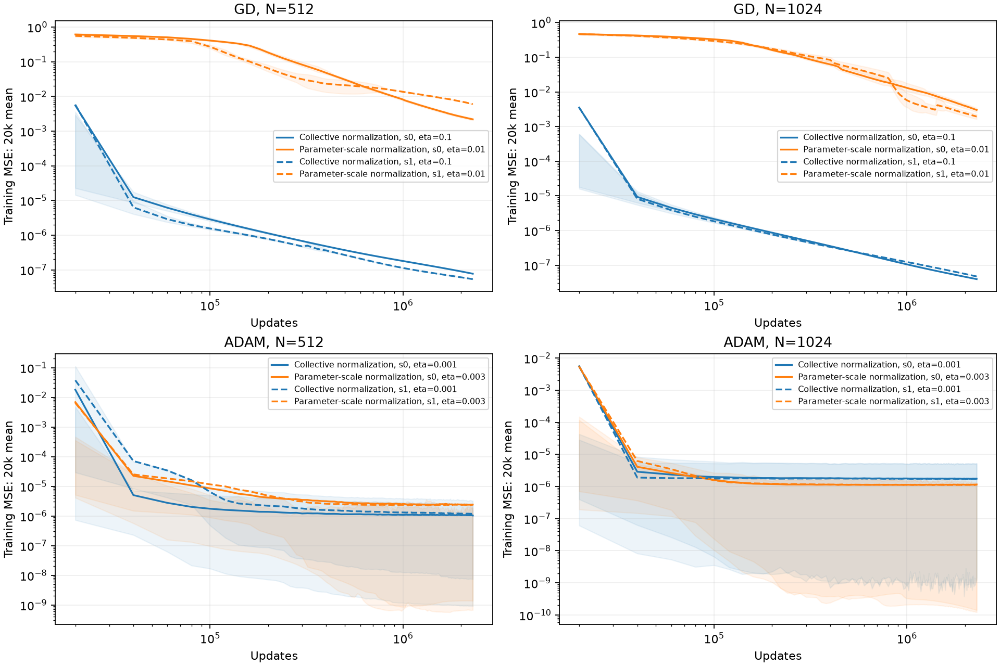
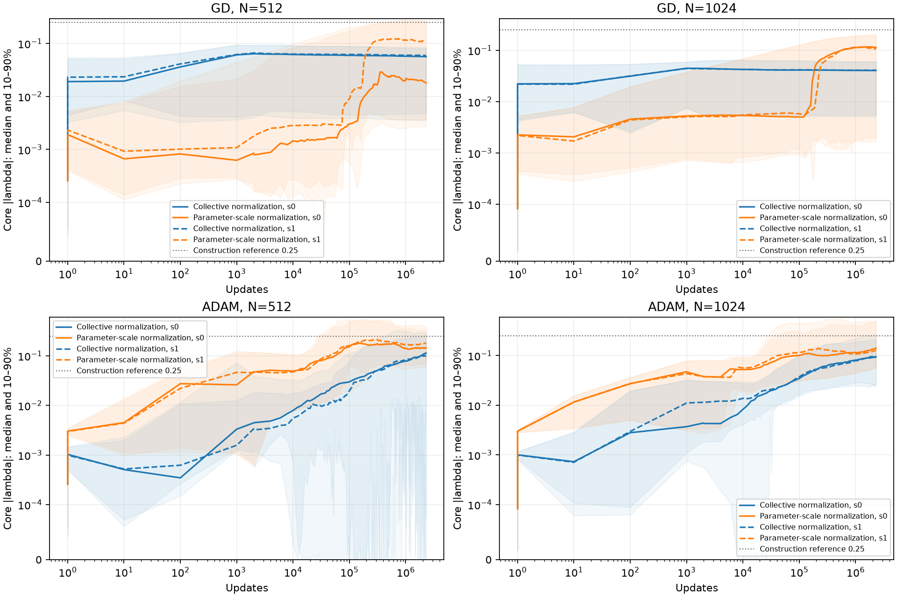
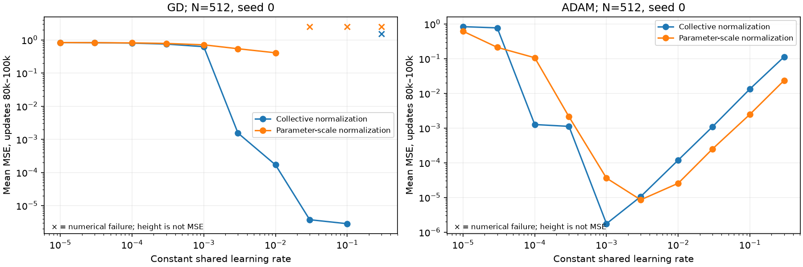
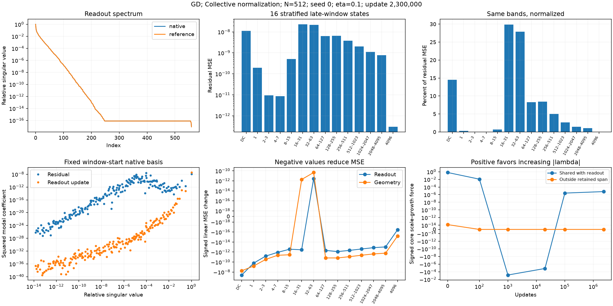
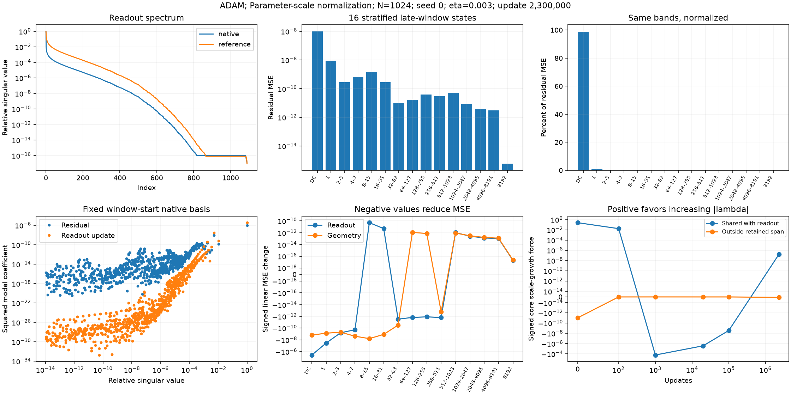

# Does individual parameter normalization improve geometry learning?

Individual parameter normalization does not uniformly improve this shared-rate setup. After 2.3 million updates, parameter-scale Adam has lower median MSE in all four width/seed cases, but intermittent excursions keep its mean near $10^{-6}$. Its mean improves at width 1024 and worsens at width 512. Parameter-scale GD remains much worse than the collective control. Matched-rate comparisons also show that slowing ordinary readouts relative to geometry does not reliably produce larger bandwidths. These are finite-budget results from one target and one initialization scheme with paired seeds, not converged floors.

**Notation and evidence roles.** All errors in this report are MSE, not RMS.

| Term | Meaning |
|---|---|
| $c=(b,w)$ | Physical output bias and tanh readout coefficients. |
| $\gamma_j$, $\lambda_j=h\gamma_j$ | Physical slope and dimensionless bandwidth at fixed center $t_j$; $h=2/N$. Slopes may have either sign. |
| $\alpha_j$, $D_{jj}=\sqrt{\alpha_j}$ | Fixed construction allowances evaluated at reference bandwidth $0.25$, including separate bias and corrected-halo allowances. |
| Collective normalization | Train $a,\lambda$ with $c=Da$; code label `scaled`. |
| Parameter-scale normalization | Train $u,\lambda$ with $c=D^2u$; code label `parameter_scale`. |
| Shared rate $\eta$ | The same constant scalar for both trained parameter blocks within a run. Its selected value can differ between optimizers and normalizations. |
| Window MSE | Mean over 20,000 consecutive training states; rate selection uses the 80k–100k window. |
| Detached fit | A truncated-SVD readout fit at saved geometry. It diagnoses representability and never replaces trained weights. |
| DC | The constant spatial component, Fourier index zero. |

## Outcome after 2.3 million updates

All 16 selected trajectories reached the same 2.3-million-update horizon without changing their rates. The campaign used **7075 of 7200 allocated GPU-seconds**, including the search, failures, compilation, and continuation overhead. The remaining 125 seconds could not fund another common 100k block at measured throughput. [Slurm accounting](parameter_scale_analysis/slurm_accounting.txt) and the [allocation ledger](parameter_scale_analysis/allocation_ledger.json) document this resource-limited stop.

**Final comparison at the 100k-selected rates.** MSE averages all 20,000 states before 2.3 million updates. Bandwidth is median core $|\lambda|$ at the endpoint. GD uses $\eta=0.1$ / $0.01$ and Adam $0.001$ / $0.003$ for collective / parameter-scale normalization. These selected-rate comparisons change both the coordinate map and the absolute scalar; the matched-rate comparisons below separate those effects at 100k.

| Optimizer | $N$ | Seed | Collective mean MSE | Parameter-scale mean MSE | Collective $|\lambda|$ | Parameter-scale $|\lambda|$ |
|---|---:|---:|---:|---:|---:|---:|
| GD | 512 | 0 | $7.705\times10^{-8}$ | $2.181\times10^{-3}$ | $0.0563$ | $0.0180$ |
| GD | 512 | 1 | $5.372\times10^{-8}$ | $5.971\times10^{-3}$ | $0.0596$ | $0.1095$ |
| GD | 1024 | 0 | $3.948\times10^{-8}$ | $3.014\times10^{-3}$ | $0.0404$ | $0.1140$ |
| GD | 1024 | 1 | $4.721\times10^{-8}$ | $1.942\times10^{-3}$ | $0.0410$ | $0.1058$ |
| Adam | 512 | 0 | $1.035\times10^{-6}$ | $2.426\times10^{-6}$ | $0.1127$ | $0.1452$ |
| Adam | 512 | 1 | $1.184\times10^{-6}$ | $2.354\times10^{-6}$ | $0.1001$ | $0.1820$ |
| Adam | 1024 | 0 | $1.752\times10^{-6}$ | $1.154\times10^{-6}$ | $0.0939$ | $0.1405$ |
| Adam | 1024 | 1 | $1.732\times10^{-6}$ | $1.138\times10^{-6}$ | $0.0971$ | $0.1280$ |

The distribution matters for Adam. The median of the 20,000 per-update MSE values is $2.58\times10^{-10}$–$1.49\times10^{-9}$ under parameter-scale normalization, versus $4.35\times10^{-9}$–$1.30\times10^{-7}$ under the collective control. Every paired median improves. However, parameter-scale Adam's largest MSE in those same windows reaches $5.85\times10^{-5}$–$1.72\times10^{-4}$. Better low-error states coexist with larger excursions; neither a minimum checkpoint nor the mean alone describes this behavior.

<figure>
  
  <figcaption>Lines are consecutive 20k-window means; shading is the within-window 10th–90th percentile, not a confidence interval. Solid/dashed lines identify seeds 0/1. GD continues improving, with a large disadvantage for parameter-scale normalization. Adam's lower error quantiles improve much more than its means.</figcaption>
</figure>

<figure>
  
  <figcaption>Core bandwidth distributions at saved checkpoints. The dotted 0.25 line is the construction reference, not a loss target or success threshold. Larger median bandwidth does not imply lower trained MSE: parameter-scale GD at width 1024 has larger medians but far larger errors.</figcaption>
</figure>

At every final geometry, the reference SVD fit reaches training MSE below $2.82\times10^{-15}$ at cutoff $10^{-12}$. This leaves a substantial optimization gap even during Adam's low-error periods. Across cutoffs $10^{-10},10^{-12},10^{-14}$, the worst fitted MSE is respectively $2.01\times10^{-13}$, $2.82\times10^{-15}$, and $1.43\times10^{-17}$. Doubling the grid changes the live endpoint MSE by at most 3.60%; midpoint refit errors remain comparably small. These checks support a remaining optimization problem, while the coefficient norms and small singular values still matter for how difficult that problem is.

## Controlled comparison

The network is

$$
f(x)=b+\sum_j w_j\tanh\!\left(\frac{\lambda_j}{h}(x-t_j)\right).
$$

We fit $\sqrt{2}\sin(2\pi x)$ on $[-1,1]$, using full-batch FP64 and loss $\frac{1}{2M}\sum_i(f(x_i)-y_i)^2$. There are $M=16N+1$ equally spaced training points. Core resolutions are $N=512,1024$; the full networks include the endpoints and $\lceil\sqrt N\rceil$ halo centers on each side, giving 559 and 1091 neurons. All centers remain fixed. Both readouts and slopes learn throughout.

The hypothesis is that using individual construction allowances for readouts will slow their absorption of residuals relative to geometry learning, allowing useful bandwidth acquisition. At fixed reference bandwidth, both ordinary and corrected-halo readouts have $O(h)$ construction bounds, although their constants differ substantially. The bias is $O(1)$. These bounds motivate the map; they do not constrain the learned coefficients or establish an attracting bandwidth.

Each pair starts from the same independent Gaussian draws on $a$ and physical slopes, with zero bias. Their Xavier standard deviations are $\sqrt{2/(W+1)}$ and $(5/3)\sqrt{2/(W+1)}$, respectively, where $W$ is the full neuron count. Initial slope signs are absorbed into the readouts without changing the function. Set $c_0=Da_0$ in both arms and $u_0=D^{-1}a_0$ in the new arm. Thus this experiment changes the optimization metric while holding the physical initialization fixed. It does not test an independent Xavier draw on $u$.

GD has no momentum. Adam uses $(\beta_1,\beta_2)=(0.9,0.999)$. Its native readout epsilon is $10^{-8}$ for collective normalization and $10^{-8}D_{jj}$ for parameter-scale normalization, giving the same physical threshold $10^{-8}/D_{jj}$. Native geometry epsilon is $10^{-8}$ in both. There are no schedules, independently chosen block rates, neighbor differences, frozen parameter blocks, or readout solves during training.

## What changes in the physical updates?

Write $c=Sz$, where $S=D$ or $D^2$. With physical gradients $g_c=\nabla_c L$ and $g_\gamma=\nabla_\gamma L$, GD gives

$$
\Delta c=-\eta S^2g_c,\qquad
\Delta\gamma=-\frac{\eta}{h^2}g_\gamma.
$$

Consequently, collective normalization multiplies each readout gradient by $\eta\alpha_j$, whereas parameter-scale normalization multiplies it by $\eta\alpha_j^2$. At the same shared rate, ordinary readout motion is reduced by another factor $\alpha_j=O(h)$ relative to geometry.

For Adam, let $\mathcal A_\epsilon(g)$ denote its bias-corrected moment ratio $\widehat m/(\sqrt{\widehat v}+\epsilon)$, with moments accumulated along that run's physical-gradient history. Constant diagonal coordinate scales and the matched epsilons give

$$
\Delta c_j=-\eta S_{jj}\mathcal A_{10^{-8}/D_{jj}}(g_{c_j}),
\qquad
\Delta\gamma_j=-\frac{\eta}{h}\mathcal A_{10^{-8}h}(g_{\gamma_j}).
$$

Thus the corresponding readout factors are $\eta\sqrt{\alpha_j}$ and $\eta\alpha_j$. These factors are not the actual Adam step sizes: the saved moments and gradients also enter. The analysis uses those actual updates.

**Physical multipliers at the selected constant rates, $N=512$.** GD columns multiply physical gradients. Adam columns multiply the moment ratios defined above. The halo column is the largest corrected-halo multiplier.

| Optimizer and normalization | Shared $\eta$ | Ordinary readout | Bias | Largest halo | Physical slope |
|---|---:|---:|---:|---:|---:|
| GD, collective | $0.1$ | $8.66\times10^{-4}$ | $1.08$ | $0.105$ | $6553.6$ |
| GD, parameter-scale | $0.01$ | $7.50\times10^{-7}$ | $1.16$ | $0.0109$ | $655.36$ |
| Adam, collective | $0.001$ | $9.31\times10^{-5}$ | $0.00328$ | $0.00102$ | $0.256$ |
| Adam, parameter-scale | $0.003$ | $2.60\times10^{-5}$ | $0.0323$ | $0.00314$ | $0.768$ |

The full construction allowances matter. At width 512, $\alpha_{\rm ordinary}=0.008663$, but $\alpha_b=10.7639$ and the largest halo allowance is $1.04521$. Squaring the map slows ordinary readouts while accelerating bias and some halo directions at a matched scalar rate. At the selected GD rates, ordinary readout mobility is about 1154 times smaller, geometry mobility ten times smaller, and bias mobility slightly larger. This is not a uniform readout slowdown.

There is a direct stability consequence. For a frozen dictionary $A$ normalized by $1/\sqrt M$, the GD readout Hessian is $(AS)^TAS$. Its bias diagonal is $S_{bb}^2$, so the stable constant-step interval is bounded above by

$$
\eta<\frac{2}{\sigma_{\max}(AS)^2}\leq\frac{2}{S_{bb}^2}.
$$

For parameter-scale normalization at width 512, the bias bound alone is $2/\alpha_b^2\approx0.0173$. The pilot's next tested rate, $0.03$, fails numerically. This bound explains why simply raising the shared GD rate cannot freely compensate for the smaller ordinary-readout scale. It is a frozen-readout bound, not a sufficient stability rule for the joint nonlinear problem.

## Rate search and width transfer

The pilot uses both maps, both optimizers, and ten constant rates $\eta\in\{1,3\}\times10^k$, $k=-5,-4,-3,-2,-1$, at width 512, seed 0: 40 trials. Every finite trial receives 100k updates. The mean training MSE over 80k–100k selects one rate per optimizer and map; all four selections are interior to the grid. No boundary extension is needed.

For each optimizer, both selected rates transfer unchanged to both maps at $(N,\mathrm{seed})=(512,1),(1024,0),(1024,1)$, adding 24 trials. Of the 64 distinct trials, 57 reach 100k with finite states and seven record a nonfinite update. The failed cases remain in the [complete search table](parameter_scale_analysis/transfer/sweep_summary.csv); no rate is silently lowered.

<figure>
  
  <figcaption>The width-512, seed-0 pilot. Values average updates 80k–100k; crosses mark numerical failures and their vertical placement is not MSE. The selected rates are GD 0.1/0.01 and Adam 0.001/0.003 for collective/parameter-scale normalization.</figcaption>
</figure>

**100k comparison at each map's pilot-selected rate.** Entries are 80k–100k mean training MSE. Rates are transferred, not retuned, across widths and seeds.

| Optimizer | $N$ | Seed | Collective | Parameter-scale |
|---|---:|---:|---:|---:|
| GD | 512 | 0 | $2.845\times10^{-6}$ | $0.4071$ |
| GD | 512 | 1 | $1.549\times10^{-6}$ | $0.2698$ |
| GD | 1024 | 0 | $2.145\times10^{-6}$ | $0.3291$ |
| GD | 1024 | 1 | $1.842\times10^{-6}$ | $0.2944$ |
| Adam | 512 | 0 | $1.750\times10^{-6}$ | $8.531\times10^{-6}$ |
| Adam | 512 | 1 | $6.426\times10^{-6}$ | $1.161\times10^{-5}$ |
| Adam | 1024 | 0 | $1.977\times10^{-6}$ | $1.609\times10^{-6}$ |
| Adam | 1024 | 1 | $1.768\times10^{-6}$ | $1.562\times10^{-6}$ |

Matched-rate comparisons qualify these results. At Adam rate $0.001$, collective normalization has lower 100k window MSE in all four width/seed pairs. At $0.003$, parameter-scale normalization has lower MSE in three of four pairs, including both width-1024 seeds. Therefore the result is an interaction between normalization, scalar rate, width, and horizon, rather than uniform dominance of one map. For GD, parameter-scale normalization loses at matched rate $0.01$ in all four pairs; its rate-$0.1$ runs all fail.

**Adam bandwidth at matched rates after 100k updates.** Each entry lists median core $|\lambda|$ for seeds 0 and 1, in that order. The new map gives smaller bandwidths in all four cases at $\eta=0.001$; the direction of the change depends on width at $0.003$.

| $N$ | Shared $\eta$ | Collective, seeds 0 / 1 | Parameter-scale, seeds 0 / 1 |
|---|---:|---:|---:|
| 512 | $0.001$ | $0.0298$ / $0.0198$ | $0.0177$ / $0.0181$ |
| 1024 | $0.001$ | $0.0346$ / $0.0374$ | $0.0160$ / $0.0140$ |
| 512 | $0.003$ | $0.0888$ / $0.1030$ | $0.1545$ / $0.1591$ |
| 1024 | $0.003$ | $0.1122$ / $0.1116$ | $0.1008$ / $0.1163$ |

In particular, comparing collective Adam at $0.001$ with parameter-scale Adam at $0.003$ does not isolate a normalization effect on geometry. The latter also uses a threefold larger absolute geometry rate. Slowing ordinary readouts relative to geometry is not, by itself, sufficient to produce larger learned bandwidths in these matched comparisons.

## How the mechanism is measured

Define the normalized residual $r=(f-y)/\sqrt M$, normalized readout matrix $A$, and geometry Jacobian

$$
(J_\lambda)_{ij}=\frac{w_j}{\sqrt M}\frac{x_i-t_j}{h}
\operatorname{sech}^2\!\left(\lambda_j\frac{x_i-t_j}{h}\right).
$$

The current readout values therefore enter the geometry gradient directly. Changing readout learning also changes this Jacobian; the relative rate multipliers alone do not determine the direction or persistence of geometry learning.

Both maps use the same reference rule for the retained readout span: take the SVD of $AD$ and retain singular values above $\tau\sigma_{\max}$, for $\tau=10^{-10},10^{-12},10^{-14}$. The projector $P_\tau$ gives

$$
g_\lambda=J_\lambda^Tr
=J_\lambda^TP_\tau r+J_\lambda^T(I-P_\tau)r.
$$

The perpendicular residual is projected again to suppress leakage from the larger in-span residual. Cutoff dependence, removed leakage, and closure are saved. The signed core scale-growth force is the negative gradient projected onto $v_j=\operatorname{sign}(\gamma_j)/\sqrt{n_{\rm core}}$ on core neurons. Positive force favors increasing slope magnitudes; it is not the actual Adam step. Actual signed updates are recorded separately, as are core, ordinary-halo, and corrected-halo contributions.

Native readout spectra use $AS$, with the map actually trained. A fixed SVD at the beginning of each dense 2048-update window measures where residual energy and actual readout-induced function changes lie. This is a description of the saved trajectory, not an Adam convergence theorem. The early window covers updates 0–2047. Late motion statistics use every consecutive update; detailed Fourier and finite-step budgets use 16 stratified states, one random fixed-seed offset in each block of 128, to avoid systematic sampling of one phase of an oscillation.

An orthonormal DFT decomposes $r$ into disjoint bands $Q_br$. Every band includes the corresponding positive and negative indices. The plots show both $\|Q_br\|^2$ and its percentage of total MSE, including every band through the sampling limit. DC is the constant component; index $k$ means $k$ cycles over the DFT's implied period $M\Delta x$, approximately the domain length two. The signed linear contributions are

$$
2(A^TQ_br)^T\Delta c,\qquad
2(J_\lambda^TQ_br)^T\Delta\lambda.
$$

Negative values favor descent. The exact finite-step decomposition also retains readout, geometry, and their interaction, including the positive quadratic term $\|\Delta f/\sqrt M\|^2$. A large negative linear term alone does not establish actual progress.

Detached SVD fits use the common reference coordinates and all three cutoffs. A doubled training grid and 32,768 midpoint points check sampling sensitivity. These are diagnostic evaluations on the known target, not independent held-out tests or selection criteria. Accurate fits establish representability at the saved geometry; they do not establish good conditioning or fast first-order optimization.

## Slow descent and oscillation are different mechanisms

Collective GD at width 512, seed 0, shows the familiar spectral mismatch: **77.25% of sampled residual energy lies below relative singular value $10^{-4}$, while more than 99.99999% of readout-update energy lies above $0.1$**. The relative singular value is $\sigma/\sigma_{\max}$ in the fixed window-start native basis. These descriptive thresholds were not acceptance criteria. The residual's largest Fourier bands are 16–31 and 32–63, while much of the update acts on low frequencies. Its readout directions almost reverse every update: median adjacent-step cosine is $-0.99999998$.

<figure>
  
  <figcaption>Collective GD, width 512, seed 0, after 2.3 million updates. The upper middle/right panels show the same sampled residual energy in absolute MSE and percentages, including all bands. The modal panel uses the beginning of the final 2048-update window; the upper-left spectrum uses the endpoint. Native and reference coordinates coincide for this control. Spectral tails near machine precision are unresolved.</figcaption>
</figure>

The width-1024 collective GD case is different: all 2048 final updates decrease MSE, by an average $1.88\times10^{-14}$ per update for seed 0. Its readout steps keep essentially the same direction, and 73.34% of sampled residual energy lies below relative singular value $10^{-4}$. This is slow, consistent descent, rather than an oscillation-dominated loss trace.

Parameter-scale GD has a much larger motion/progress mismatch. At width 512, seed 0, mean absolute per-update MSE change is $2.62\times10^{-4}$, but mean signed change is only $-1.22\times10^{-9}$. The bias supplies 99.0% of the sampled linear readout descent budget; ordinary core readouts supply about 0.008%. Each sampled readout-only and geometry-only counterfactual step lowers MSE, but their joint step need not. Their function changes align positively on average, increasing the joint quadratic cost. This is consistent with coupled overshooting, alongside the very slow ordinary-readout mobility in the physical-rate table. These are detached one-step calculations, not frozen-parameter training experiments.

Adam's late averages should not be described solely as residuals trapped in weak modes. In the parameter-scale width-1024, seed-0 case, **98.81% of sampled residual MSE is DC**, and 99.10% of readout-update energy lies above relative singular value $0.1$. Only 0.018% of sampled residual energy lies below $10^{-4}$. Large low-frequency excursions dominate these energy-weighted averages, even though much smaller residuals occur between them.

<figure>
  
  <figcaption>Parameter-scale Adam, width 1024, seed 0, after 2.3 million updates. Native readout coordinates use A D²; the reference uses A D. The Fourier panels distinguish absolute energy from its percentage and include the small high-frequency remainder. The 16 sampled states describe the late window, not its quietest state or the entire 20k selection window.</figcaption>
</figure>

Geometry motion is not sufficient to explain Adam's excursions. At width 512, seed 0, the actual parameter-scale Adam readout step, evaluated with geometry unchanged for that one step, lowers MSE in only four of the 16 sampled states. The readouts have not stopped moving: their mean per-update physical RMS motion is $5.19\times10^{-6}$, while their net RMS displacement over all 2048 updates is just $7.17\times10^{-6}$. The readout RMS gradient estimates $\sqrt{\widehat v}$ remain above epsilon at the endpoint. The evidence points to inefficient, often reversing motion under these constant rates, rather than a global absence of readout signal. It does not predict the behavior of a prolonged frozen-geometry run or a different scheduler.

The [mechanism summary](parameter_scale_analysis/final/mechanism_summary.json) contains the corresponding quantities for every seed and width, including regional contributions, exact consecutive loss changes, update directions, and sampling checks. The [numerical audit](parameter_scale_analysis/final/verification.json) finds Fourier closure below $3.4\times10^{-16}$, gradient closure below $5.6\times10^{-14}$, and finite-update prediction closure below $1.2\times10^{-14}$.

## What the projection can and cannot establish

The geometry force outside the retained readout span is already very small at initialization. For width 512, seed 0, the initial signed core growth force is about $0.630$ inside that span and $1.39\times10^{-14}$ outside it at cutoff $10^{-12}$. The qualitative separation persists across the three cutoffs, although the tiny perpendicular quantities change greatly. A small late perpendicular force therefore does not, by itself, prove that fast readout training caused it to disappear.

Nor does membership in the retained span mean that a direction is quickly accessible to gradient descent. The initial detached fit at cutoff $10^{-12}$ has MSE $1.75\times10^{-5}$ but physical coefficient norm about $6.17\times10^8$. At 100k, parameter-scale GD's saved width-512, seed-0 geometry admits a fit with MSE $7.82\times10^{-18}$, but the fitted coefficient norm is about $406$, versus $2.91$ for the trained readout. These are norms of the specific retained-reference SVD solution, not a proof that every accurate solution requires those norms. They demonstrate why successful numerical least squares is insufficient evidence of an easy nearby first-order problem.

For fixed geometry and GD in native coordinates, a residual coefficient along a singular vector of $AS$ evolves as

$$
r_{k,t+1}=(1-\eta\sigma_k^2)r_{k,t}.
$$

Weak directions need a number of steps proportional to $1/(\eta\sigma_k^2)$, while the largest singular value limits the stable rate. This is inverse-square dependence on singular value, not exponential dependence on the condition number. If singular values themselves decay exponentially with frequency or a localization parameter, the resulting iteration counts can grow exponentially in that underlying variable. The present finite-budget training curves do not establish that asymptotic law.

For the ordinary-readout block, the distinction is especially simple. Its allowance is the same scalar $\alpha_{\rm ordinary}$ at every center. At identical geometry, replacing $A_{\rm ordinary}\sqrt{\alpha_{\rm ordinary}}$ by $A_{\rm ordinary}\alpha_{\rm ordinary}$ multiplies every singular value by the same factor $\sqrt{\alpha_{\rm ordinary}}$. **The condition number of that block does not change.** The normalization can help indirectly by changing the learned geometry, and it changes the relative bias/halo scales, but it does not whiten the ordinary readout problem.

More generally, diagonal normalization changes relative mobility without removing correlations between overlapping tanh features. Moreover, $J_\lambda$ depends on the current readouts, and the signed force need not always favor increasing $|\lambda|$. The construction's $0.25$ is a reference scale, not a target explicitly present in the loss. Correct powers of $h$ alone therefore do not imply attraction to that value, a well-conditioned joint problem, or a particular trained-error floor. Adam's diagonal moments alter these dynamics, but do not constitute singular-vector whitening.

## Parameter movies and reproducibility

The width-512 movies keep every value attached to its physical center. Collective normalization is the left column and parameter-scale normalization the right; physical signed readouts are above physical signed gamma. Shaded strips identify halo centers and the bias appears separately. Vertical axes are symmetric-logarithmic and have separate ranges for each panel. Each checkpoint through 300k is held for one second; later checkpoints play at six per second. The late views show 256 consecutive states at 20 frames per second as changes from the first displayed state, exposing motion that widely spaced checkpoints can hide.

**Separate seed movies.** Overview playback is deliberately slower during the first 300k updates; displayed update numbers, not playback time, determine the training interval.

| Optimizer | Seed | Full trajectory | Consecutive late motion |
|---|---:|---|---|
| GD | 0 | [Readout and gamma](parameter_scale_analysis/final/gd_seed_0.mp4) | [Late changes](parameter_scale_analysis/final/gd_seed_0_late.mp4) |
| GD | 1 | [Readout and gamma](parameter_scale_analysis/final/gd_seed_1.mp4) | [Late changes](parameter_scale_analysis/final/gd_seed_1_late.mp4) |
| Adam | 0 | [Readout and gamma](parameter_scale_analysis/final/adam_seed_0.mp4) | [Late changes](parameter_scale_analysis/final/adam_seed_0_late.mp4) |
| Adam | 1 | [Readout and gamma](parameter_scale_analysis/final/adam_seed_1.mp4) | [Late changes](parameter_scale_analysis/final/adam_seed_1_late.mp4) |

The [experiment README](../../../experiments/expD06_fixed_center_scales/README.md#parameter-scale-normalization-paired-gd-and-adam) gives the launch and analysis commands. The [pilot selections](parameter_scale_analysis/selected.json), [confirmation cases](parameter_scale_analysis/confirmation.json), and [continuation cases](parameter_scale_analysis/continuation.json) specify every rate, width, seed, optimizer, and coordinate map. [Physical multiplier records](parameter_scale_analysis/physical_scales.json) include both widths. [Source hashes](parameter_scale_analysis/source_hashes.json) identify the numerical implementation. Training used JAX 0.10.2 and Optax 0.2.8 on the H200 host; all remote computation ran through Slurm, with CPU analyses requesting zero GPUs. Movies were rendered locally with Matplotlib and FFmpeg.

The raw resumable states, per-update traces, checkpoints, and dense gradient/update archives remain under `/workspace/junmiaoh/experiments/precision-mlps/runs/parameter_scale/`. Exported diagnostics use all 16 selected trajectories. The finite-step budgets sample 16 states, so their mean signed change should not be treated as an accurate estimate of the much smaller long-term learning rate. The export also records loss changes over every consecutive state in each complete 2048-update window and the full 20k-window means used to assess progress.

Software verification includes paired physical initialization, finite-difference gradients, explicit physical GD and Adam updates, exact save/resume behavior, isolation of failed batch members, and rejection of incomplete paired comparisons. The [full suite](parameter_scale_analysis/pytest_complete.txt) passed 237 tests. All 16 exported final states also match their resumable parameters exactly; Adam's saved counters are 2.3 million. This study uses one target, two widths, two seeds, a finite rate grid, one initialization scheme, and a resource-limited horizon. Rates selected at 100k are not necessarily optimal for the longer horizon. The study does not establish a universal normalization rule, a converged optimization floor, or a causal test of residual depletion independent of the changing readout values.
