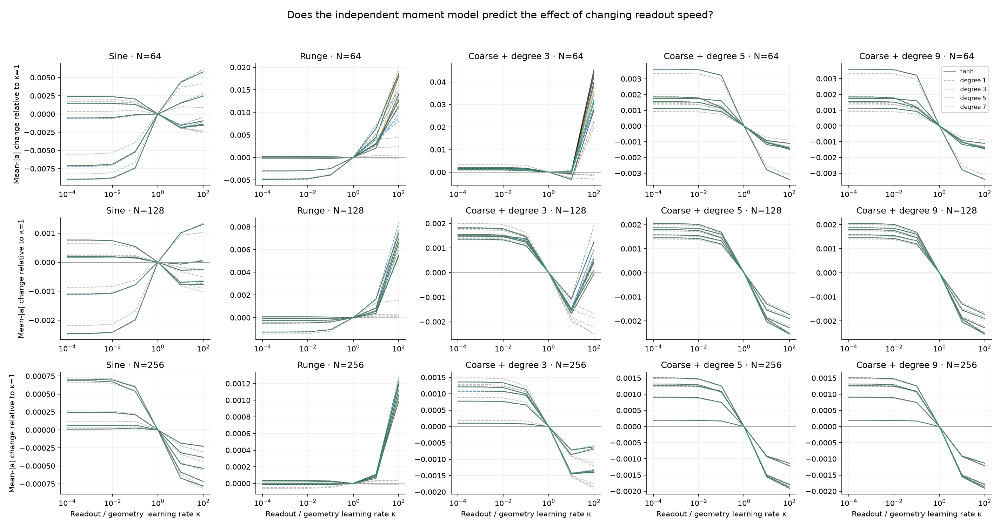
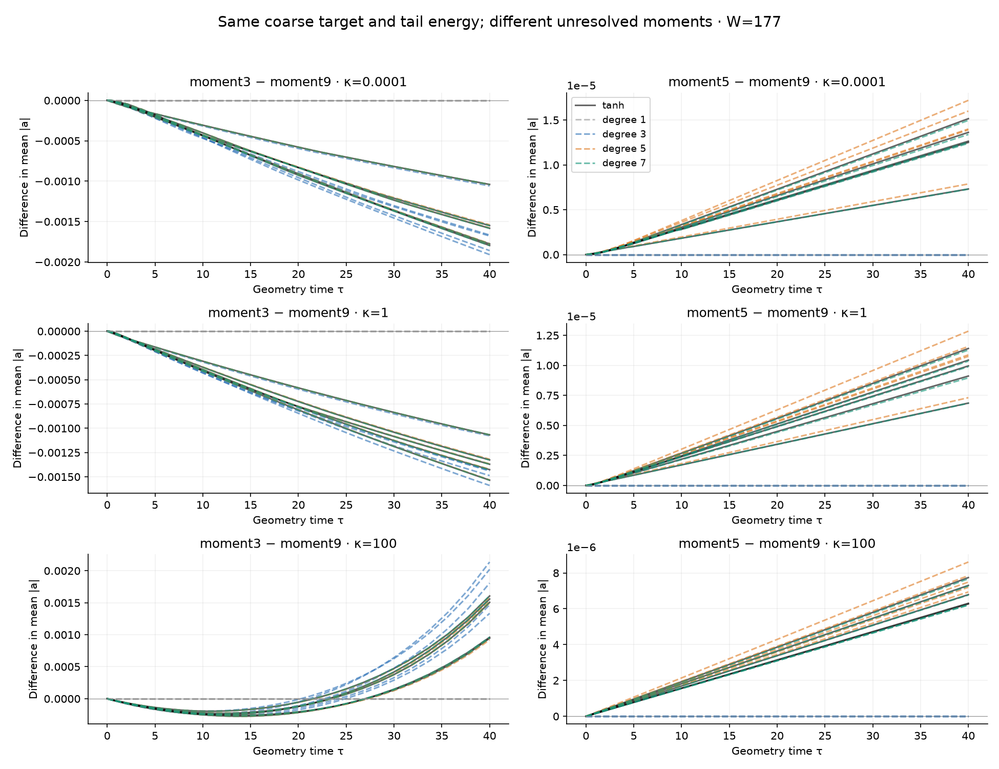
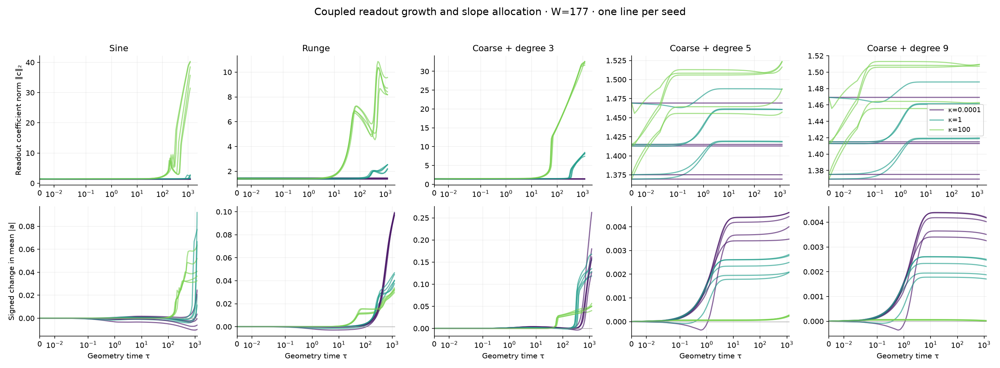
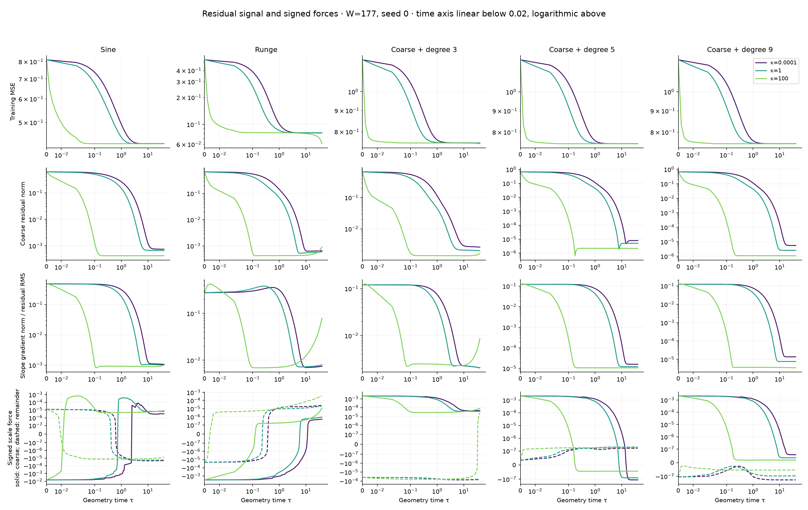

# Readout competition in ordinary joint GD

The experiments support a **finite-time, target-dependent allocation mechanism**: faster readout fitting removes coarse residual signal sooner and can leave substantially less net slope growth. They do not support a universal rule that slower readout improves geometry. On some targets, fast readout subsequently grows the coefficients enough to strengthen nonlinear slope gradients and leave the initial plateau. Independent low-order moment models predict the small-slope phase well; their accuracy can fail when that recovery begins.

**Notation used throughout this report.** All parameters are physical coordinates.

| Symbol or term | Meaning |
|---|---|
| $f=d+\sum_j c_j\tanh(a_jx+b_j)$ | Standard affine hidden units; every $a_j,b_j,c_j,d$ is trainable. |
| $\gamma_j=|a_j|$; $\bar\gamma$ | Individual slope magnitude; its population mean. |
| $\lambda_j=(2/N)\gamma_j$ | Reporting scale tied to the reference budget $N$, not an evolving center spacing. |
| $\eta=0.002$ | Constant physical learning rate for both hidden slopes and hidden biases. |
| $\kappa$ | Readout/geometry rate ratio; $c,d$ use $\kappa\eta$. Larger means faster readout. |
| $\tau=n\eta$ | Geometry time after $n$ updates. |
| Coarse residual $m$ | Residual coefficients along the empirical orthonormal functions $1,x/\sigma$, with $\sigma^2=\operatorname{mean}(x^2)$. |
| Degree-$p$ reference | Independently trained network replacing tanh by its degree-$p$ Taylor polynomial. It receives no trained-tanh state or residual. |
| MSE; $\xi_a$ | Mean squared prediction error; raw slope-gradient norm divided by residual RMS. Training minimizes half-MSE. |

## The controlled comparison

This study uses FP64 ordinary full-batch simultaneous GD in raw $(a,b,c,d)$ coordinates. There is no frozen center, tied bias, readout solve, parameter rescaling, Adam, momentum, clipping, or learning-rate schedule. All four gradients are evaluated at the same old state:

$$
(a,b)_{n+1}=(a,b)_n-\eta\nabla_{a,b}L_n,
\qquad (c,d)_{n+1}=(c,d)_n-\kappa\eta\nabla_{c,d}L_n.
$$

Paired rates share identical saved Xavier arrays. Both hidden slopes and hidden biases are independently uniform on $[-\sqrt{6/(W+1)},\sqrt{6/(W+1)}]$; readouts use the same bound and a separate random stream; the output bias starts at zero. Every reference starts from those same arrays and evolves its own parameters. The physical readout rates range from $2\times10^{-7}$ to $0.2$, with ratios $10^{-4},10^{-3},10^{-2},0.1,1,10,100$.

Experiment A uses sine and Runge. Experiment B holds coarse target moments and unresolved energy fixed:

$$
y_k=0.3\phi_0+0.4\phi_1+\sqrt{0.75}\phi_k,
\qquad k\in\{3,5,9\}.
$$

The $\phi_k$ are orthonormal on the 2,048-point midpoint training grid. Their saved polynomial map defines the same functions on the independent 8,192-point evaluation grid. The target RMS is one on the training grid. The affine references cannot distinguish these three targets; the cubic references cannot distinguish degrees 5 and 9. Actual tanh can distinguish them immediately, through higher-order terms.

The core comparison spans widths 89, 177, and 353, five paired seeds, all five targets, and all seven ratios: 525 tanh trajectories and 2,100 independent references, each for 20k updates. Five additional seeds repeat width 177 at 20k. The original five width-177 seeds continue unchanged to 600k, retaining the 100k comparison. A separate width-177 seed-0 refinement halves both physical rates and doubles the steps: 40k matches primary 20k, and 200k matches primary 100k. Including the historical-grid baseline, there are 3,685 distinct scientific models (737 tanh and 2,948 references), not counting continuations as new runs. These are fixed-horizon diagnostics, not declarations of convergence or selected best checkpoints.

## What the readout-rate intervention establishes

The degree-5 and degree-9 targets provide the cleanest early allocation evidence. At width 177, faster readout consistently depletes the coarse residual sooner and reduces net upward slope movement across all five original seeds. The unresolved error remains almost unchanged.

**Degree-9 target at width 177 after 20k updates. Entries are medians over five paired seeds; the parenthesized ranges show every seed. Error is evaluated on the independent grid.**

| Readout/geometry ratio $\kappa$ | First update at 1% of initial coarse norm | Signed mean-slope change $\Delta\bar\gamma$ | Held-out MSE |
|---|---:|---:|---:|
| $10^{-4}$ | 3,526 (2,283–3,706) | $0.004181$ ($0.003400$–$0.004392$) | $0.750051$ |
| $1$ | 1,675 (1,203–1,733) | $0.002332$ ($0.001778$–$0.002607$) | $0.750049$ |
| $100$ | 33 (25–35) | $0.0000481$ ($0.0000433$–$0.0000669$) | $0.750049$ |

The approximately $0.75$ error is the unresolved-tail energy; the small held-out offset from $0.75$ reflects evaluation on a different midpoint grid. All seven rates, paired seeds, and widths are retained in the evidence rather than selecting the two extreme rates for the conclusion.

The contrast also holds at matched coarse-error levels. When each degree-9 trajectory first reaches 1% of its initial coarse norm, median signed mean-slope changes are $0.004078$, $0.002298$, and $0.0000482$ at the three listed rates. Thus nearly all of their 20k net movement has already occurred during coarse fitting; the endpoint contrast is not merely a comparison at different stages of that transient.

Slowing readout does not preserve the coarse signal indefinitely: the hidden parameters also fit those moments. In the affine reference, $m'=-(K_{\rm hidden}+\kappa K_{\rm readout})m$, with $K_{\rm hidden}=\|c\|^2\operatorname{diag}(1,\sigma^2)$. This term remains when $\kappa$ is very small. The rate intervention changes how the finite coarse-fitting movement is allocated; it does not provide an unlimited source of upward slope forcing.

The direction is not universal. For Runge at the same width and horizon, increasing $\kappa$ from 1 to 100 increases $\bar\gamma$ in every seed, by $0.00538$–$0.00742$, while median held-out MSE falls from $0.08033$ to $0.06180$. Sine has both positive and negative paired scale contrasts across seeds. Readout fitting can remove either a slope-growing or a slope-shrinking force; the sign must be predicted from the initialized coupled dynamics.

The five additional seeds reproduce these directions: across all ten width-177 seeds, fast-minus-equal-rate mean-slope contrasts are negative for both high-order targets and positive for Runge. Their ranges are $[-0.00269,-0.00173]$ for degree 5, $[-0.00269,-0.00173]$ for degree 9, and $[0.00478,0.00742]$ for Runge. These changes remain small in absolute localization scale: at the core 20k endpoints, no neuron has $\lambda\ge0.05$, and the largest fraction with $\gamma\ge1$ is only $1/89$.

<figure>
  
  <figcaption>All five paired seeds at 20k. Each curve subtracts its own equal-rate endpoint; black is tanh and dashed colors are independent polynomial references. The degree-7 reference predicts the sign of all 450 contrasts against equal-rate training. Its magnitude can fail in the narrowest, fast-readout nonlinear runs.</figcaption>
</figure>

## How much does the moment model predict?

The affine reference explains the initial coarse allocation, but its gradient has essentially vanished once those moments are fitted. Its endpoint slope-gradient relative error is approximately one across the core matrix. Higher orders recover the remaining signal. At width 177 the degree-7 reference predicts every core endpoint slope-gradient vector within 2.21%; the maximum is 2.99% in the five additional seeds. At width 353 the core maximum is 0.613%.

**Independent degree-7 slope-gradient error near the 20k endpoint. Each width contains 175 target/rate/seed cases. Errors use the full gradient vector at update 19,980, with a denominator floor of $10^{-12}\max(1,\|g_{a,0}\|)$. The 5% column is a descriptive summary, not an acceptance criterion.**

| Width | Median relative error | Maximum relative error | Cases below 5% |
|---:|---:|---:|---:|
| 89 | 0.459% | 127.8% | 139/175 |
| 177 | 0.0348% | 2.203% | 175/175 |
| 353 | 0.00484% | 0.613% | 175/175 |

The largest narrow-network errors occur for the degree-3 target and Runge at $\kappa=100$, where nonlinear growth has already become significant. Correct contrast signs therefore do not establish an accurate gradient or trajectory envelope everywhere. At widths 177 and 353, maximum absolute degree-7 errors in the 20k mean-slope *rate contrasts* are $4.59\times10^{-6}$ and $3.44\times10^{-8}$; at width 89 the maximum reaches $0.01015$.

The matched-target identities hold independently of the tanh comparison. Across all core widths, rates, seeds, and stored states, affine slope trajectories for the different tails agree within $6.25\times10^{-16}$ in Euclidean norm. Cubic trajectories for degree-5 versus degree-9 tails agree within $8.71\times10^{-16}$. Tanh separates these targets, and higher references recover the separation at the expected orders. This is stronger evidence for the moment hierarchy than fitting one target's loss curve.

<figure>
  
  <figcaption>Width 177, all five original seeds, three predeclared rate anchors. Left: degree-3 tail minus degree-9 tail. Right: degree-5 tail minus degree-9 tail, whose scale difference is much smaller. The affine reference stays identical on both comparisons; the cubic reference also stays identical on the right. Degree 7 closely tracks the observed separation and the fast-readout sign reversal on the left.</figcaption>
</figure>

## Why coarse fitting does not imply permanent trapping

The actual slope gradient contains both the current residual and the current readout:

$$
g_{a,j}=c_j\langle e\,x\,\operatorname{sech}^2(a_jx+b_j)\rangle_m.
$$

Removing the constant and linear residual moments suppresses the leading forcing. Higher residual moments still couple through nonlinear terms, and growing $c_j$ can amplify that coupling. These effects compete. A theorem that controls only the decay of coarse residuals misses the second channel.

The matched targets make the order of this weak coupling explicit. At fixed current parameters, the degree-$k$ target tail contributes

$$
-\sqrt{0.75}\,c_j\langle\phi_k\,x\,\operatorname{sech}^2(a_jx+b_j)\rangle_m
=O(c_j a_j^{k-1})
$$

to the slope gradient as $a_j\to0$. Expand the tangent about $b_j$: all terms with $x$-degree below $k$ vanish against $\phi_k$. This is the target-tail contribution, not the full gradient, which also contains the current prediction. The same orthogonality gives every degree-$p<k$ polynomial network an irreducible training MSE of at least $0.75$. Agreement with a degree-7 reference on the degree-9 target therefore indicates that the omitted target coupling is weak; it does not show that this reference can solve the target.

The 100k continuation already demonstrates this distinction. For the degree-3 target, width 177, seed 0, $\kappa=100$ reaches held-out MSE $0.01018$, compared with $0.74956$ at $\kappa=1$. Its readout norm grows from about 1.47 to 19.8. In contrast, the degree-5 and degree-9 targets remain near MSE $0.75$ at that horizon. The targets have identical coarse moments and tail energy; the order of the remaining target moments changes the subsequent dynamics substantially.

This is not confined to seed 0. At 100k, all five fast-readout degree-3 runs have held-out MSE between $0.00947$ and $0.01023$; the equal-rate range is $0.74954$–$0.75032$. The high-order targets remain near $0.75$ for every tested rate and original seed. Degree-7 gradient predictions can now fail badly on escaping runs: seed-0 relative errors at $\kappa=100$ are about 113% for sine, 74% for Runge, and 66% for the degree-3 target. Its errors remain about 1.5% for degree 5 and 0.022% for degree 9 in those same cases.

<figure>
  
  <figcaption>Width 177 through 600k, with all five original seeds and fixed rate anchors. Readout growth accompanies renewed slope movement on sine, Runge, and the degree-3 target. The high-order targets retain small readout norms and little subsequent slope movement. Geometry time is linear below 0.02 and logarithmic above it. The separate <a href="continue100k/readout_and_slopes.png">100k view</a> preserves the earlier comparison.</figcaption>
</figure>

The distinction persists through 600k. All 70 tanh trajectories for degree-5 and degree-9 targets remain within held-out MSE $[0.7500018,0.7500507]$, across all seven rates and five seeds, with no endpoint slope reaching $\gamma=1$. Lower-order targets escape to differing degrees. Equal-rate degree-3 training eventually improves substantially too: the 100k contrast was a difference in escape time, not an insurmountable barrier for that target.

**Held-out MSE at 600k, width 177. Medians and full ranges over the original five seeds; endpoint values include the oscillating runs. All seven rate arms remain in the linked tables.**

| Target | Equal rates, $\kappa=1$ | Fast readout, $\kappa=100$ |
|---|---:|---:|
| Sine | $0.2479$ ($0.1486$–$0.4199$) | $0.00634$ ($0.00359$–$0.01102$) |
| Runge | $0.00348$ ($0.00257$–$0.00747$) | $0.00352$ ($0.00301$–$0.00380$) |
| Coarse + degree 3 | $0.02547$ ($0.00494$–$0.03321$) | $0.00694$ ($0.000238$–$0.007995$) |
| Coarse + degree 5 | $0.750006$ ($0.750004$–$0.750006$) | $0.750006$ ($0.750006$–$0.750007$) |
| Coarse + degree 9 | $0.750049$ ($0.750049$–$0.750049$) | $0.750048$ ($0.750048$–$0.750048$) |

Error reduction does not establish population-wide localization. Across all 175 tanh endpoints at 600k, at most 7 of 177 neurons have $\lambda\ge0.05$. Large coefficients and a few exceptional slopes can support improvement without moving a substantial fraction of the population into the construction's reference-scale regime.

### A separate limitation: late finite-step oscillation

After 100k, three fast-readout sine seeds and four fast-readout degree-3 seeds develop loss increases; none of the other actual trajectories does. We checked the full empirical Hessian, including residual second derivatives, at saved states. For physical step matrix $D=\operatorname{diag}(\eta I_{2W},\kappa\eta I_{W+1})$, the local GD update is similar to $I-D^{1/2}\nabla^2L D^{1/2}$. A positive eigenvalue approaching 2 therefore approaches the alternating local stability boundary.

For fast-readout degree-3 runs, the largest step-scaled Hessian eigenvalue rises from $1.077$–$1.100$ at 100k to $1.946$–$2.00010$ at 600k. The leading eigenvector has a median 74% of its squared norm in hidden-bias coordinates at 600k, measured in the step-scaled coordinates. Growing readouts amplify hidden-layer curvature as well as its gradient signal. This is consistent with the observed late oscillation; an endpoint Hessian is not a global stability proof. The high-order targets instead have largest eigenvalues $0.576$–$0.614$ and no loss increases, separating their low-signal plateau from this step-size limitation. The [150 saved-state spectra](verification/local_curvature.csv) retain both rate anchors and every seed.

### Signed-force accounting

We separate residuals by the fixed affine projector, not by a fitted feature-space singular-value cutoff. Writing $e=e_C+e_R$, the measured signed forces are

$$
S_C=-W^{-1}\operatorname{sign}(a)^Tg_{a,C},\qquad
S_R=-W^{-1}\operatorname{sign}(a)^Tg_{a,R}.
$$

The recorded increment satisfies $\Delta\bar\gamma=\eta(S_C+S_R)+r_{\rm cross}$, with the exact sign-crossing remainder retained. Norms alone cannot tell whether geometry grows. Separate Jacobian-vector products measure the readout, output-bias, and hidden-parameter contributions to coarse-residual evolution; they are instantaneous flow diagnostics, with the finite-step discrepancy checked separately.

<figure>
  
  <figcaption>Width 177, seed 0, the same three rate anchors. Substantial error remains after coarse fitting. The signed coarse force can oppose the remaining-residual force; Runge and the degree-3 target develop renewed nonlinear signal under fast readout. The high-order targets retain much weaker signal. Solid force curves are coarse contributions and dashed curves are remainder contributions.</figcaption>
</figure>

The [full scale trajectories](core20k/scale_acquisition.png), [population distributions](core20k/scale_distribution.png), [degree-wise gradient errors](core20k/reference_errors.png), and [coarse-energy block contributions](core20k/coarse_velocities.png) provide the supporting diagnostics. The [600k signal curves](continue600k/signal_evolution.png) show the later recovery and renewed coarse residuals. Their underlying tables and plotting arrays are saved alongside each figure.

## What this means for the proof

The useful proof target remains a finite-time bound on the fraction of neurons reaching a specified slope threshold. The evidence motivates three ingredients: a signed coupled coarse-allocation model, a hierarchy of higher residual moments, and control of the evolving readout coefficients. A statement that fast readout always reduces useful slope learning would be too strong.

The affine Gram closure and polynomial moment gradients are exact for their reference models. The pointwise slope-moment interval is an analytic inequality at the supplied state. Agreement between a degree-7 reference and trained tanh is numerical evidence; it does not supply a certified long-time trajectory radius. Even staying within $|ax+b|<\pi/2$ does not guarantee that seven terms yield a small accumulated trajectory error.

In particular, a small-slope reference should be used up to a justified stopping time, with a bound that preserves the dissipative part of the least-squares Hessian. A separate argument is needed to exclude later coefficient amplification and escape. These experiments test that distinction; they do not prove indefinite trapping, exponential slowdown in training time, or a universal necessary value of $\lambda$.

## Relation to the previous experiments

[D25](../expD25_scale_barrier/expD25_results.md) already varied raw geometry rates with fixed readout rate and found that stronger geometry updates could help. It used different absolute steps, initializations, and geometry-time budgets. The present intervention holds the geometry step fixed and changes only the readout block, then tests initialization-only predictions with paired seeds and matched target moments.

[D28](../expD28_loss_gradient_decomposition/expD28_results.md) found target-dependent alignment of approximation-floor and readout-gap gradients, rather than universal cancellation. Its numerical least-squares decomposition differs from the fixed affine residual projector used here. Both studies argue against explaining all slow geometry through one unsigned gradient norm. The earlier fixed-center coordinate and optimizer studies concern different dynamics and are not pooled into this comparison.

## Verification and reproduction

The [experiment README](../../../experiments/expD34_readout_race/README.md) specifies the source initialization, equations, saved-state conventions, launcher commands, and analysis interfaces. Curated arrays contain explicitly labeled plotting columns. Full diagnostic tables remain under `/workspace/junmiaoh/experiments/precision-mlps/analysis/readout_race` on the authorized Slurm host.

On 2026-09-20, the user authorized retirement of the approximately 399 GiB raw trajectory directory at `runs/readout_race` to reclaim workspace storage. Before deletion, all 73 numerical files listed in the six curated evidence manifests matched their saved SHA-256 hashes. The reports, figures, compact plotting arrays, endpoint and audit tables, and separate full analysis directory were retained. The [retired raw metadata archive](provenance/retired_raw_metadata.tar.gz) preserves 145 additional manifest, environment, and progress records. The committed figures remain reproducible from the curated data; omitted full parameter/gradient histories and resumable raw checkpoints are no longer available from that directory.

The 20k ordinary-GD baseline matches the unchanged D28 PyTorch trainer at 1,020 archived states, with maximum parameter discrepancies $3.05\times10^{-16}$ for sine and $2.78\times10^{-16}$ for Runge. The 23 focused checks cover gradients, initialization, affine closure at extreme rates, matched moments, signed accounting, independent sample-space probes, disk resume, and the full Hessian against autodiff. The repository fast suite reports 636 passed, 8 skipped, 4 deselected, and 17 failures; an untouched upstream checkout reproduces the same 17 failing test cases. The [verification records](verification/) preserve the evidence rather than reporting a clean full suite.

At matched geometry time, halving both rates changes seed-0 tanh mean slopes by at most $3.44\times10^{-6}$ across the 35 target/rate pairs at $\tau=40$ (20k versus 40k updates). Extending this control to $\tau=200$ (100k versus 200k) gives maximum mean-slope and held-out-MSE differences of $4.26\times10^{-6}$ and $1.89\times10^{-5}$. For the escaping degree-3 target, the corresponding maxima are $4.72\times10^{-7}$ and $1.71\times10^{-6}$. Thus the 100k escape survives step refinement. The 600k endpoint has not received an equal-time refinement; its late oscillations are not a demonstrated optimization floor.

All 2,625 core trajectories, 875 added-seed trajectories, and 175 half-step trajectories reach their prescribed horizons without nonfinite failures. The 875 continued models reach 600k; the half-step runs reach 200k. Actual tanh loss never increases in the recorded core, replication, or first-100k updates; the later exceptions are reported above. Independent sample-space checks across the core disagree with stored/moment losses by at most $3.37\times10^{-15}$ and with parameter gradients by $1.96\times10^{-14}$. Each of the four state-conditioned slope bounds is checked at 36,750 actual states, with no violations at the stated floating-point tolerance. The 600k integrated signed-motion accounting agrees with endpoint changes within $1.12\times10^{-16}$. These numerical checks are not interval certification.

The campaign used 6,262 allocated GPU-seconds (1.74 GPU-hours), including failed retries, with at most two H200s concurrently and all remote computation under Slurm. Shared-storage write failures interrupted one continuation. Saved states allowed unchanged resumption after lossless archive compression recovered over 73 GB; every replaced array was checked byte for byte, and a full diagnostic CSV was retained in gzip form. The [storage record](verification/storage_recovery.json) and [Slurm accounting](provenance/slurm_accounting.psv) preserve this operational limitation. It did not truncate the final scientific comparisons.
