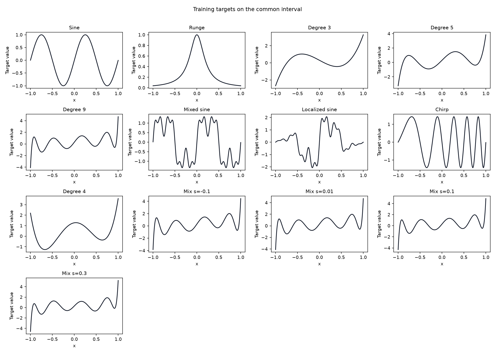
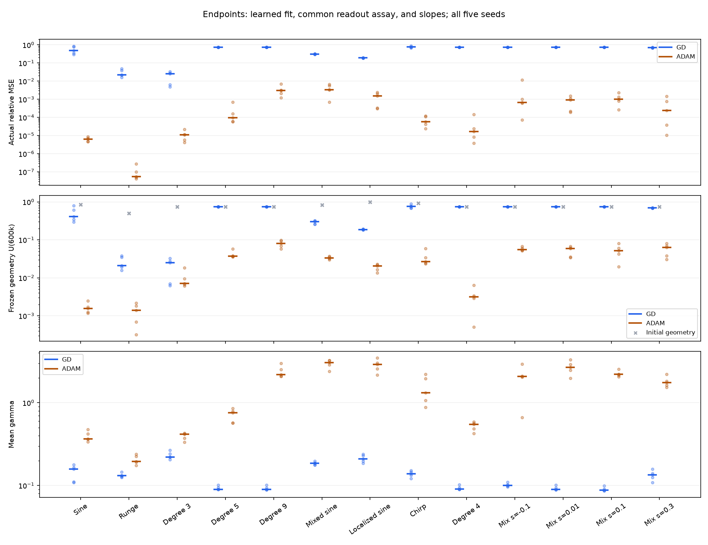
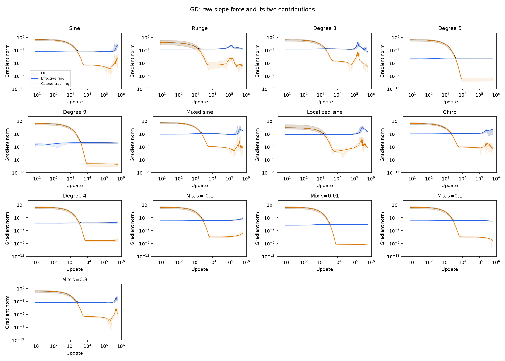
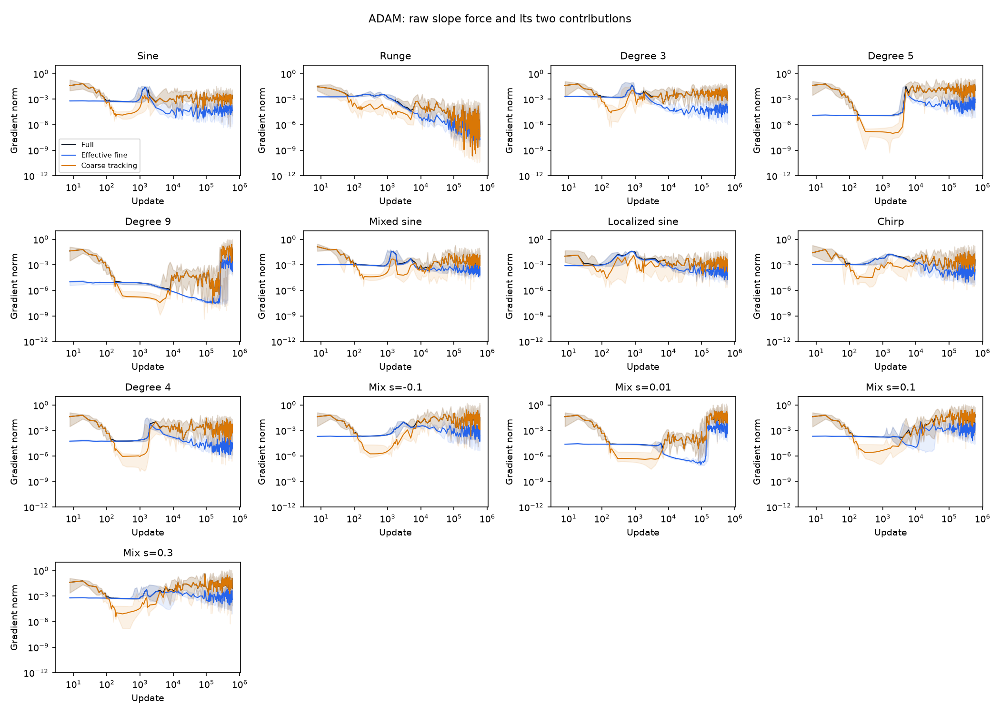
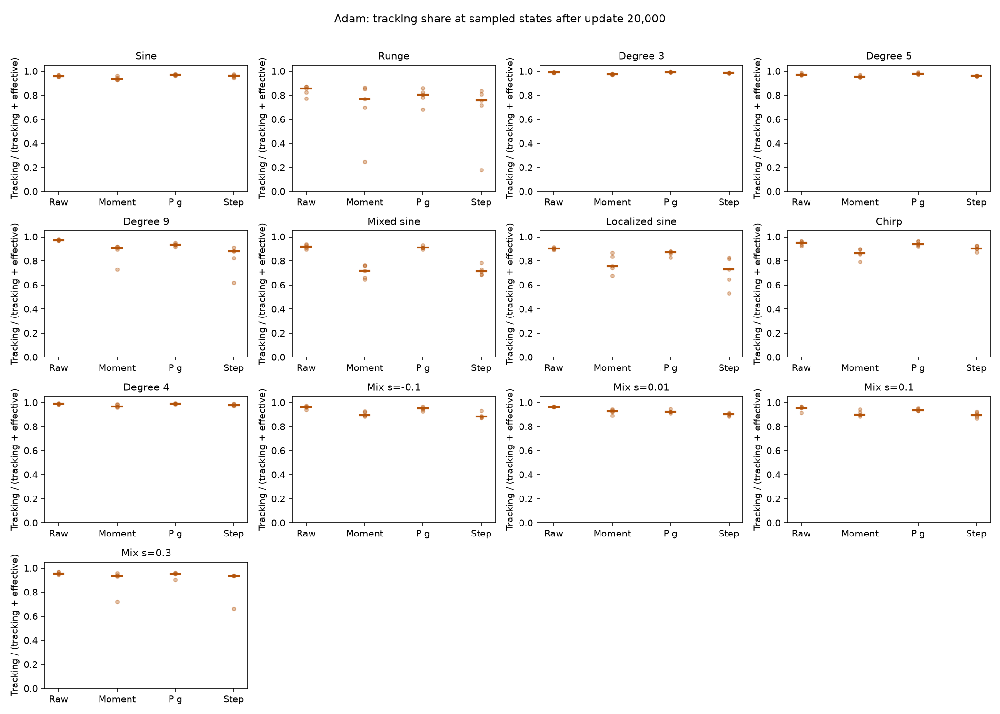
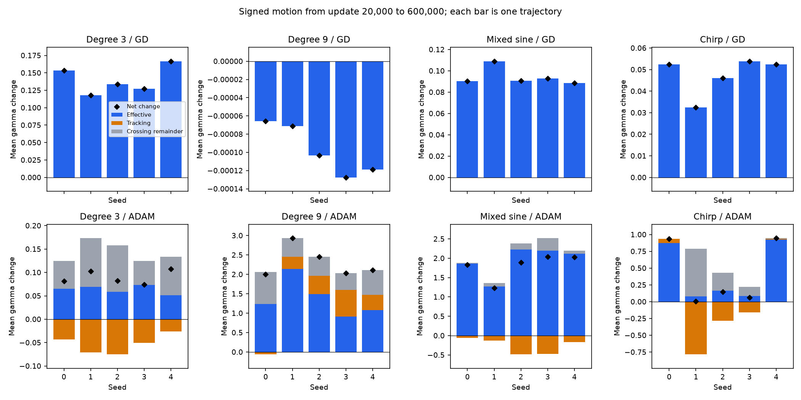
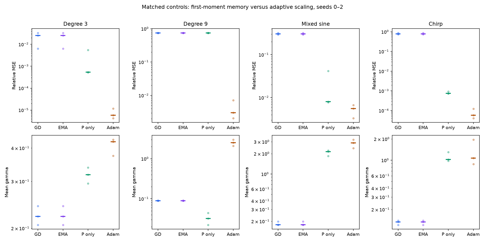
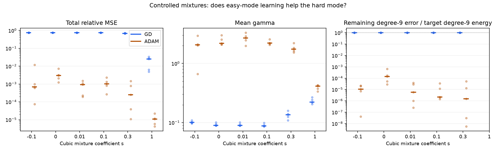
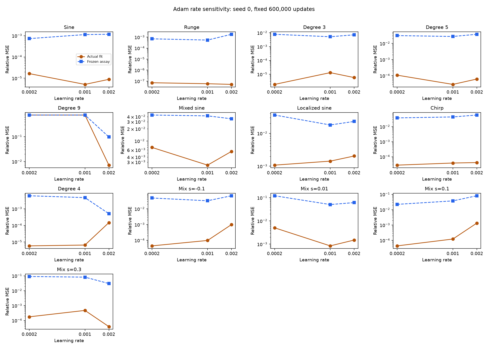

# Effective slope force across targets and Adam

**The GD conclusion survives the target extension; it does not transfer unchanged to Adam.** Across all 13 targets and five seeds, after update 20,000 the coarse-tracking channel supplies at most 0.469% of GD's summed component-force norm budget. Under Adam at the same nominal rate, that share is 90.0–99.4% in raw gradients and 74.6–99.1% in actual component step lengths. Nevertheless, much of Adam's tracking activity cancels rather than producing net outward movement. Its effective fine channel still contributes positive signed outward motion in 64 of the 65 primary trajectories over that window.

The most useful new control is degree 9: neither EMA momentum alone nor adaptive scaling alone escapes the weak-scale regime in the three tested control seeds, while their combination in Adam does. This escape depends on the rate and target. A small cubic admixture enables learning in low-rate Adam cases where the pure degree-9 target still stalls. These are mechanisms to explain, not an initialization-only barrier theorem or a claim that Adam universally solves scale acquisition.

All 184 cases finished 600,000 updates. Training ran on Runpod through Slurm, with at most two GPUs concurrently, consuming **2,841 allocated GPU-seconds = 0.78917 GPU-hours**, including pilots. The [implemented plan](../../../../docs/d34_adam_force_plan.md) gives the full protocol; [Slurm accounting](verification/slurm.psv) records the allocations. CPU analysis and final rendering were completed on Runpod after local analysis was stopped.

## What the channels mean

The [theorem walkthrough](../../../../docs/d34_barrier_theorem_walkthrough.md) calls the two retained contributions $T_ae_H$ and $J_{a,C}^Tz_C$. Here the online decomposition uses the **complete** residual complement of the constant and linear functions, eliminating finite-basis omission from the primary measurement. All four parameter blocks enter the coarse balance. The two slope-gradient vectors satisfy

$$
g_a=g_a^{\rm eff}+g_a^{\rm track}.
$$

The blue effective force is the direct fine-residual force plus the force of the coarse residual at its instantaneous GD balance. The orange tracking correction comes from the remaining departure from that balance. Thus blue already includes the balanced coarse contribution; it does not mean “ignore the coarse residual.” The true tanh activation is used everywhere.

For Adam, maintain the linear first-moment history of each channel, with the same bias correction as the actual optimizer. Apply the actual full-gradient second-moment denominator $P_n$ to both histories:

$$
\Delta a_n^k=-\eta P_{a,n}\widehat m_{a,n}^k,
\qquad \Delta a_n=\Delta a_n^{\rm eff}+\Delta a_n^{\rm track}.
$$

These are contributions to the realized trajectory, not separate optimizers. Changing either force would also change future parameters and second moments, so this additive accounting alone is not a causal intervention.

For a window, define the tracking activity share by

$$
A_{\rm track}^{\rm raw}=
\frac{\sum_n\|g_{a,n}^{\rm track}\|}
{\sum_n(\|g_{a,n}^{\rm track}\|+\|g_{a,n}^{\rm eff}\|)}.
$$

Replace gradient vectors by component steps for the step-activity share. These are fractions of **summed component norms**, not fractions of net gamma growth. They do not integrate sparse plotting samples: all sums were accumulated at every training update.

## Targets and primary outcomes

The five original targets remain unchanged. New targets add mixed frequencies, a localized oscillation, a chirp, an even polynomial, and four controlled cubic/degree-9 mixtures. The latter preserve affine coefficients and total target energy. The three new nonpolynomial targets have unit training-grid RMS with their means preserved. See the [exact definitions](../../../../docs/d34_adam_force_plan.md#targets).



**Figure 1.** The target gallery separates changes in frequency content, spatial localization, parity, and the sign/strength of an easier cubic component. The last four curves look similar because their degree-9 component still dominates. These are 13 specified targets, not 13 independent function families or a random sample of all targets.

The following are medians over seeds 0–4 at update 600,000. Relative MSE uses the independent evaluation grid. $\mathcal U_{600k}$ is the error from a separate common-budget assay: freeze the learned slopes and biases, reset the diagnostic readout to zero, then take 600,000 readout-GD steps at 0.002. This separates feature usefulness from the actual attached readout. It does not measure best approximation or a necessary scale threshold.

| Target | GD relative MSE | Adam relative MSE | GD $\mathcal U_{600k}$ | Adam $\mathcal U_{600k}$ | GD mean gamma | Adam mean gamma |
|---|---:|---:|---:|---:|---:|---:|
| Sine | 0.496 | $6.33\times10^{-6}$ | 0.407 | 0.00156 | 0.158 | 0.367 |
| Runge | 0.0222 | $5.61\times10^{-8}$ | 0.0208 | 0.00140 | 0.132 | 0.195 |
| Degree 3 | 0.0255 | $1.08\times10^{-5}$ | 0.0248 | 0.00715 | 0.222 | 0.415 |
| Degree 5 | 0.750 | $9.50\times10^{-5}$ | 0.750 | 0.0370 | 0.0901 | 0.759 |
| Degree 9 | 0.750 | 0.00303 | 0.750 | 0.0803 | 0.0899 | 2.189 |
| Mixed sine | 0.307 | 0.00340 | 0.301 | 0.0332 | 0.185 | 3.049 |
| Localized sine | 0.191 | 0.00153 | 0.186 | 0.0206 | 0.210 | 2.901 |
| Chirp | 0.772 | $5.74\times10^{-5}$ | 0.764 | 0.0270 | 0.139 | 1.315 |
| Degree 4 | 0.750 | $1.69\times10^{-5}$ | 0.750 | 0.00313 | 0.0906 | 0.548 |
| Mixture $s=-0.1$ | 0.750 | 0.000681 | 0.750 | 0.0552 | 0.101 | 2.072 |
| Mixture $s=0.01$ | 0.750 | 0.000931 | 0.750 | 0.0596 | 0.0896 | 2.684 |
| Mixture $s=0.1$ | 0.750 | 0.00102 | 0.750 | 0.0520 | 0.0881 | 2.210 |
| Mixture $s=0.3$ | 0.691 | 0.000248 | 0.689 | 0.0633 | 0.135 | 1.747 |



**Figure 2.** Dots retain every seed; horizontal marks show medians. Top: actual fitting. Middle: feature usefulness under the common readout assay, with initial geometry marked in gray. Bottom: mean slope magnitude. Adam improves all three measurements on many targets, but their numerical values are not interchangeable. For instance, its very small Runge error accompanies a mean gamma below 0.2. Such partial success does not establish the population-scale, high-precision regime motivating the theory.

At the endpoint, 0/65 GD and 36/65 Adam trajectories have at least 18 of 177 neurons above gamma 3.2; neither optimizer reaches that population count above gamma 16. A large maximum is insufficient: GD's largest individual endpoint gamma across this panel is about 11.0, despite no primary case reaching the 3.2 population event. These are the specified population diagnostics, not proven necessary conditions for approximation. [Population measurements](populations.csv) and [all endpoints](endpoints.csv) retain each case.

## The GD simplification is robust within this panel



**Figure 3.** Black is the full slope-gradient norm, blue the effective fine norm, orange the tracking norm. Lines show seed medians and shading the full seed range, not confidence intervals. After the affine transient, black and blue nearly coincide for every target. Higher residual error does not guarantee useful force: degrees 4, 5, and 9 and several mixtures maintain weak coupling. Mixed sine, localized sine, and chirp show later renewed force, with limited target-dependent fitting under this horizon.

Over updates 20,000–600,000, GD's tracking activity share ranges from $4.31\times10^{-6}$ to 0.004687 across the 65 primary cases, with median 0.000420. Since GD multiplies both channels by the same scalar step, its step shares are identical. This strengthens the empirical reduction: for these equal-rate GD trajectories, explaining scale movement principally requires explaining the effective force's magnitude, direction, and distribution. It does not yet predict those quantities from initialization.

## Adam changes both the trajectory and the role of tracking



**Figure 4.** The same decomposition on Adam's own states behaves differently. Tracking often falls initially, then becomes large relative to effective force. It is already present in the raw gradient, so this is not simply the denominator magnifying an otherwise negligible tracking vector on a GD trajectory. Later sampled curves oscillate; the curated traces also retain exact interval extrema.

Across the primary Adam cases, the median post-20k raw tracking activity share is 96.54%, versus 91.24% for actual component step length. Their ranges are 89.97–99.37% and 74.61–99.13%, respectively. Adam has many loss increases: the median trajectory records 309,055, while every primary GD trajectory records zero. Loss increases are counted, not used to reject runs or select checkpoints.



**Figure 5.** For each seed, take the median tracking share over the displayed post-20k sampled states; dots are seeds and bars are seed medians. “Raw” uses the current gradient; “Moment” uses the first moment; “P g” scales the current gradient without momentum; “Step” uses the actual shared-denominator component step. These sampled medians differ from the exact norm-budget shares above. Momentum frequently reduces tracking's relative activity, particularly for mixed/localized sine, rather than universally increasing its share. The coordinate scaling can change that balance again.

The GD reference balance might appear inappropriate for Adam. A separate saved-state calculation replaces $J_CJ_C^T$ with $J_CPJ_C^T$ using the actual next-step preconditioner and retains momentum lag. At the primary Adam endpoints, the median ratio of this alternative tracking-gradient norm to the full gradient norm is 1.009, with range 0.046–1.154. Thus changing the instantaneous metric does not generally make tracking negligible. Ratios above one are possible because vectors cancel. These endpoint quantities concern a **virtual next update**, not an extra trained step, and establish no quasi-equilibrium theorem for Adam. The actual-step claims use only the online accumulators.

## Path length is different from outward movement

Let $D_k=\sum_n W^{-1}\operatorname{sign}(a_n)^T\Delta a_n^k$. Then the exact mean-gamma change is

$$
\Delta\overline\gamma=D_{\rm eff}+D_{\rm track}+X,
\qquad
X=\sum_n\frac1W\sum_j\left(|a_{n+1,j}|-|a_{n,j}|-\operatorname{sign}(a_{n,j})\Delta a_{n,j}\right).
$$

$X$ is the nonnegative remainder from crossing the nonsmooth point of absolute value. It is not an independent force or a new learning mechanism, and it can be large when slopes repeatedly cross zero. Ignoring it would make the signed attribution fail.



**Figure 6.** Each stack is one seed's exact post-20k accounting; black diamonds are actual net change. Axis scales differ, notably for the tiny GD contraction on degree 9. GD's tracking contribution is small. In Adam, the effective channel often supplies positive drift while the tracking channel can add or subtract, and crossings can matter substantially. The stacks do not identify a unique allocation of crossing motion to force channels.

For a concrete example, Adam mixed-sine seed 0 has 79.2% tracking share of component step length, but its signed effective, tracking, and crossing contributions are $1.863$, $-0.054$, and $0.023$, summing to net mean-gamma growth $1.832$. Its positive and negative mean travel are 18.653 and 16.821. Large tracking activity therefore does not imply tracking-driven useful expansion. Across all 65 primary Adam cases, effective signed motion is positive in 64; tracking is positive in 31. This suggests studying persistent outward force separately from oscillatory activity, while retaining the exceptions and crossings. [Exact motion windows](windows.csv) include earlier phases as well.

## Which mechanisms enable escape?



**Figure 7.** All methods share rate 0.002 and the first three seeds. EMA means bias-corrected momentum without adaptive scaling; “P only” means Adam with $\beta_1=0$. EMA alone remains close to GD. Adaptive scaling alone helps degree 3, mixed sine, and chirp, but degree 9 remains at relative error 0.750 and mean gamma 0.0322. Full Adam reaches median degree-9 error 0.00303 and mean gamma 2.527 in those seeds. This identifies a history/scaling interaction in the observed escape. It does not establish that either component is necessary under every rate or target.



**Figure 8.** The right panel tracks $e_9^2/[0.75(1-s^2)]$, separately from total error and mean gamma. It is undefined at the pure cubic endpoint, which is therefore omitted there. Under GD the normalized degree-9 error remains approximately one throughout the mixture sweep, including $s=0.3$ where total error decreases. That decrease is largely easier-mode fitting, not escape into degree-9 learning. Adam reduces the difficult-mode coefficient as well; its median ratio falls from $1.42\times10^{-4}$ at $s=0$ to $5.79\times10^{-6}$ at $s=0.01$. This coefficient alone does not represent all remaining error.



**Figure 9.** Seed 0, fixed update count, no selection across rates. Pure degree 9 stays at approximately 0.750 relative error for rates 0.0002 and 0.001, while rate 0.002 reaches 0.00718. With only $s=0.01$ cubic admixture, the two lower rates reach 0.00506 and 0.000844. Thus the route into harder-mode learning can depend sharply on a small target change. Smaller rates also reduce tracking step activity on several oscillatory targets: mixed sine's exact post-20k tracking share falls from 79.2% at 0.002 to 31.5% at 0.0002. Fixed update counts do not make these matched-time gradient-flow experiments.

The four epsilon checks are tabulated in [all endpoints](endpoints.csv), rather than adding another figure. Changing $10^{-8}$ to $10^{-12}$ preserves the broad seed-0 outcomes: for degree 9, relative error changes from 0.00718 to 0.00761; mixed sine changes from 0.00552 to 0.00325. These checks rule out a simple epsilon-floor explanation for those particular escapes, not all epsilon sensitivity.

## What this contributes to the theory

For ordinary D34 GD, the expanded evidence supports focusing the explanation on effective fine-force generation, depletion, alignment, and population distribution. Coarse tracking does not supply a competing explanation of the measured post-transient movement in this panel. A weak effective force can coexist with substantial residual; a later nonlinear change can restore coupling. We still need conditions predicting which evolution occurs.

For Adam, the small-tracking premise fails in both raw activity and realized step length at the primary rate. Yet effective-force history remains informative about net outward motion. The next theoretical question is how the joint evolution of geometry, first moment, and second moment filters oscillatory residual forcing into persistent movement. The degree-9 optimizer controls and low-rate cubic mixtures provide specific contrasts for that question. The present measurements do not isolate a unique causal trigger or prove a persistent gamma barrier from initialization.

This study broadens targets substantially but still covers a one-dimensional, smooth, width-177, full-batch setup, five primary seeds, and a finite horizon. It does not cover nonsmooth targets, minibatch noise, depth, or a random target distribution. Partial fitting improvements and the frozen-readout assay should remain separate from successful acquisition of a specified population scale or a precision regime.

## Verification and evidence map

The [numerical audit](verification/numerical.json) records no failed trajectories or unresolved coarse solves. Maximum raw-gradient, stored first-moment, and actual-step reconstruction errors are below $10^{-15}$; the worst accumulated signed-motion discrepancy is $3.14\times10^{-11}$. The original 25 GD target/seed replays agree with archived parameters within $2.71\times10^{-13}$ at shared saved updates. The [curation audit](verification/curation.json) independently checks every retained file hash, interval envelope, and selected-state moment/motion identity.

Finite-basis adequacy changes with optimizer and geometry. Degree 65 misses up to $1.30\times10^{-4}$ of effective slope force across the inspected states, comparable to a retained force in one adaptive-only mixed-sine case. Degree 129 reduces the maximum difference to $3.74\times10^{-6}$. For primary GD/Adam states alone the degree-129 maximum is about $1.12\times10^{-7}$. Thus “omitted modes are negligible” must be checked anew for sharper geometries. All primary online force and motion claims use the complete complement and are unaffected by this truncation.

Fixed-state grid doubling changes independent-grid relative errors by at most $2.95\times10^{-7}$ absolutely and frozen-assay errors by at most $6.87\times10^{-6}$. The largest effective-force change is 5.59% for Adam degree-9 seed 0; a further doubling reduces it to 1.38%, with observed order approximately two. Near a GD training-grid balance, raw-gradient relative changes can be large because the original gradient is tiny; degree 9 has an absolute change $7.52\times10^{-6}$ while its effective-force change is $3.54\times10^{-8}$. These checks support the reported empirical-grid conclusions and reveal the limits of a continuum interpretation; they are not retraining on refined grids. Details are in [grid.csv](verification/grid.csv) and [modal.csv](modal.csv).

The focused local checks passed 24 tests before local computation was stopped; the [focused Runpod source package](verification/focused_remote.log.gz) passed 26 tests. The [broader remote repository suite](verification/full_tests_remote.log.gz) initially recorded 704 passed, 17 failed, and 9 skipped. Fifteen failure identifiers match the prior local baseline; the other two are an unchanged D19 comparison near $10^{-15}$ and a missing Git-metadata setting in the exported validation checkout. The [follow-up](verification/verification_followup.log.gz), with the source-commit environment variable supplied and the separately exported construction tests included, passed 49 tests and failed only that D19 roundoff comparison. D34's existing resume tests, the new Adam checks, and all construction tests pass in that follow-up. The repository-wide suite is not claimed green.

| Evidence | Contents |
|---|---|
| [summary.csv](summary.csv), [endpoints.csv](endpoints.csv) | Every target, optimizer, rate, epsilon, and seed; medians and ranges kept separate from raw rows |
| [windows.csv](windows.csv) | Exact raw/step budgets, signed components, crossings, and positive/negative travel for seven windows |
| [states.csv.gz](states.csv.gz) | Saved-state GD and preconditioned balances, momentum lag, finite-step defect, slopes, and residual coupling |
| [geometry.csv.gz](geometry.csv.gz) | Full common-readout learning curves and crossed slope/bias geometries |
| [residuals.csv.gz](residuals.csv.gz), [modal.csv](modal.csv) | Residual coefficients and retained-basis checks |
| [construction.csv](analysis/construction.csv) | Nine common-gamma construction references for every target; diagnostic references, not necessary thresholds |
| [curated/hashes.json](curated/hashes.json) | Original and curated file hashes, with per-bundle manifests, environment checks, traces, and complete selected optimizer states |

Curated states retain updates 0, 1, 10, 100, 200, 1,000, 2,000, 20,000, 100,000, and 600,000. Curated plotting values are sampled every 10, 100, 1,000, and 5,000 updates in the corresponding four training ranges, with exact extrema over each combined interval. A plotting value describes the state just before the last update in that interval. This coarsening does not alter any cumulative motion sum. Full raw outputs remain on Runpod at `/workspace/junmiaoh/experiments/precision-mlps/adam-78c6e1b/output`.

Training source is pinned to `78c6e1b`; the reviewed analysis implementation is `191bb2d`. Figures can be regenerated from the committed compact package by running the following **inside a CPU-only Slurm step**, with GPU execution disabled:

```bash
python -m experiments.expD34_readout_race.adam_summarize \
  --root results/checkpoint_D_optimizers/expD34_readout_race/adam_force_extension \
  --figures-only
```

Full numerical reanalysis uses `adam_analysis.sbatch` and the original remote bundles. Reports and captions were written directly after inspecting the numerical outputs and figures.
