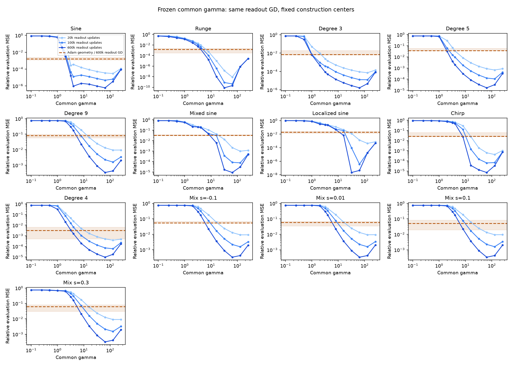
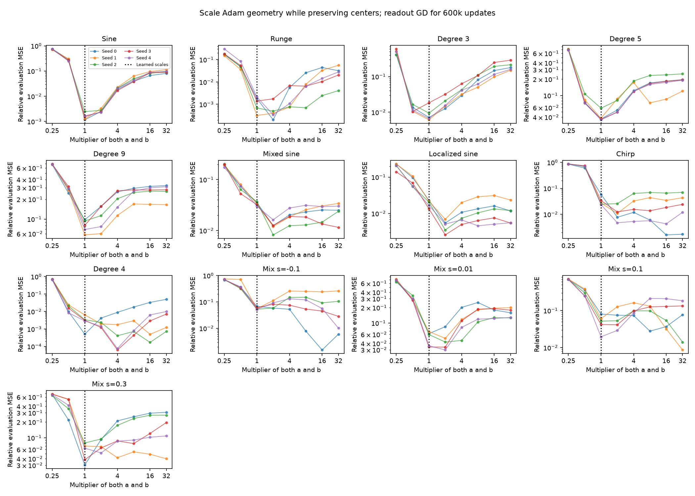

# Adam's learned scales versus frozen-scale readout training

**Adam's slope growth leaves a substantial feature-usefulness gap, but uniformly enlarging its learned slopes does not consistently close that gap.** Across all 13 targets, a fixed-center construction with a larger common gamma has lower median error under the same readout-GD assay. The best tested construction gamma is 32 or 64. However, when Adam's own centers are preserved, increasing all its slopes helps only 34 of 65 target/seed cases. For degree 9, the original learned scales are best among the tested multipliers in every seed. Thus the construction comparison supports incomplete acquisition of useful geometry; it does not isolate a universal shortage of scalar gamma.

## What is held fixed, and what is measured?

The network is $f(x)=d+\sum_{j=1}^{177}c_j\tanh(a_jx+b_j)$, with slope magnitudes $\gamma_j=|a_j|$. This follow-up uses the 13 targets and the five primary Adam endpoints from the [force study](../README.md). Each endpoint followed 600,000 joint Adam updates at rate 0.002.

For every geometry, freeze $a,b$, reset the readout $c,d$ to zero, and apply full-batch readout GD at rate 0.002. Measure relative MSE after 2k, 20k, 100k, and 600k readout updates. The calculation uses the verified SVD expression for this exact linear recurrence, including finite-time contributions from small singular values. It does not substitute an infinite-time least-squares solution. The original 2048-point training grid and independent 8192-point evaluation grid are retained.

Two comparisons answer different questions:

1. **Common gamma at construction centers.** Set $a_j=\gamma$ and $b_j=-\gamma\tau_j$, where $\tau_j=-1+2j/128$ for $j=-24,\ldots,152$. Sweep $\gamma\in\{0.1,0.25,0.5,1,2,3.2,4,8,16,32,64,128,256\}$. This measures what a specified alternative geometry can achieve with the same readout optimizer and budget. Its centers differ from Adam's learned centers.
2. **Rescale Adam's own geometry.** Set $(a,b)\mapsto(ra,rb)$ with $r\in\{0.25,0.5,1,2,4,8,16,32\}$. This preserves every center $-b_j/a_j$, slope sign, and relative slope magnitude while varying the absolute scales. It directly tests whether uniform slope enlargement helps the learned geometry under the common assay.

Select the best tested gamma or multiplier by **training-grid error**, separately for each target, seed where applicable, and readout horizon. Report its independent-grid error. The evaluation grid is a quadrature check for these known target functions, not a blind generalization benchmark. “Best tested” is conditional on this finite sweep, center configuration, and readout budget; it is not an optimal or necessary scale for neural approximation.

## Larger common scales permit much better readout fitting



**Figure 1.** Each panel is one target. Horizontal position is the fixed common gamma; vertical position is the resulting relative evaluation MSE. The three blue curves vary only the readout update budget. The orange line and shading show the median and full five-seed range for Adam's original geometry, also refitted from zero by 600k readout-GD updates. Compare the darkest blue curve with orange to hold the readout budget fixed. These orange values are not Adam's actual joint-training errors.

For every target, larger construction gammas offer a substantial improvement over the median learned geometry in this assay. Increasing gamma indefinitely is not beneficial: the curves turn upward at sufficiently large scales. All selected construction minima at 600k lie inside the sweep, at 32 or 64. Several curves have more than one favorable region, so a coarse grid minimum does not characterize a unique optimum.

The table reports 600k-readout-update relative evaluation MSE. The Adam columns are medians over seeds, with the multiplier selected separately for each seed. Their ratio is not generally the median paired improvement.

| Target | Best tested construction gamma | Construction error | Original Adam geometry | Best rescaling of Adam geometry |
|---|---:|---:|---:|---:|
| Sine | 64 | $5.98\times10^{-7}$ | 0.00156 | 0.00156 |
| Runge | 32 | $8.16\times10^{-11}$ | 0.00140 | 0.000337 |
| Degree 3 | 64 | $1.66\times10^{-6}$ | 0.00715 | 0.00715 |
| Degree 5 | 64 | $1.68\times10^{-5}$ | 0.0370 | 0.0370 |
| Degree 9 | 64 | 0.000336 | 0.0803 | 0.0803 |
| Mixed sine | 64 | $9.25\times10^{-6}$ | 0.0332 | 0.0120 |
| Localized sine | 32 | $2.20\times10^{-8}$ | 0.0206 | 0.00458 |
| Chirp | 64 | $7.10\times10^{-6}$ | 0.0270 | 0.0108 |
| Degree 4 | 64 | $9.62\times10^{-6}$ | 0.00313 | 0.000171 |
| Mixture $s=-0.1$ | 64 | 0.000328 | 0.0552 | 0.0284 |
| Mixture $s=0.01$ | 64 | 0.000336 | 0.0596 | 0.0424 |
| Mixture $s=0.1$ | 64 | 0.000337 | 0.0520 | 0.0196 |
| Mixture $s=0.3$ | 64 | 0.000319 | 0.0633 | 0.0398 |

Degree 9 illustrates the size and meaning of the gap: its mean learned gamma has median 2.189, and the learned geometry's common-assay error is 0.0803. The gamma-64 construction reaches 0.000336, about 239 times smaller. Adam's actual attached readout has median error 0.00303, substantially better than refitting its geometry with this GD assay. That distinction prevents treating 0.0803 as Adam's training outcome.

## Enlarging learned slopes is not a general remedy



**Figure 2.** Each curve is one seed. The vertical dotted line at multiplier $r=1$ marks the learned geometry. Moving right sharpens every feature while keeping its center fixed. Moving left broadens it. All points use 600k readout-GD updates from zero. A lower point to the right is evidence that larger slopes improve that particular geometry under the common assay.

Across the 65 cases, the selected multiplier is greater than one in 34, equal to one in 30, and less than one in one. Six selections hit the upper boundary $r=32$, so their minima remain unresolved beyond the tested range. The target-level contrasts are informative:

- Sine, degree 5, and degree 9 select $r=1$ in all five seeds. Degree 3 selects $r=1$ in four seeds and $r=0.5$ in one. Uniformly increasing these slopes does not improve their tested readout-GD performance.
- Mixed and localized sine favor larger scales in every seed. Their median paired error improvements are 2.79 and 4.22, respectively. Four of five mixed-sine seeds select $r=2$; the fifth selects the boundary $r=32$. Four localized-sine seeds select $r=2$ and one selects $r=8$.
- Degree 4 improves with larger scales in four seeds, with median paired improvement 19.7. The cubic/degree-9 mixtures show substantial seed dependence rather than a common preferred multiplier.

For degree 9, the construction succeeds with large common gamma while enlarging Adam's own slopes fails. This rules out the simple conclusion that increasing every learned gamma is sufficient. Center placement, the distribution of slopes across features, and the resulting readout learning rates remain coupled explanations. This experiment does not identify which of those explains the gap, nor rule out a more selective change to slopes.

## Verification, cost, and reproducibility

The [implementation](../../../../../experiments/expD34_readout_race/frozen_scale_gap.py) evaluated 169 construction geometries and 520 rescaled learned geometries. Replaying the archived nine-gamma curves and all unscaled Adam curves gives maximum absolute difference **zero**. The [manifest](manifest.json) records the source hash, input hashes, grids, and assay specification. Code was committed as `70b60f0`.

For each of the 78 selected endpoint geometries, repeat readout fitting with 4096 training points and evaluation with 16384 points, keeping the target definition and normalization fixed. The median relative change in evaluation error is $3.68\times10^{-5}$, and the largest is 0.222%. This verifies the selected errors against grid refinement; it does not resweep all candidates on the finer grid or prove the precise minimizers grid-independent.

Both computation and figure generation ran in CPU-only Runpod Slurm job 1009, which completed in 38 seconds using two allocated CPUs and no GPU. Job 1010 ran the existing mechanism checks: [10 passed](verification/frozen-check-1010.out). Its allocation lasted 14 seconds. The [Slurm record](verification/slurm.psv) and [experiment log](verification/frozen-scale-1009.out) are retained. This follow-up consumed zero GPU-hours; no numerical analysis or plotting ran on the local MacBook.

The numerical evidence is retained in [construction.csv](construction.csv), [scaled_adam.csv](scaled_adam.csv), [selected.csv](selected.csv), and [refinement.csv](refinement.csv). From an environment containing the original curated Adam package, reproduce the comparison inside a CPU Slurm allocation with:

```bash
python -m experiments.expD34_readout_race.frozen_scale_gap \
  --root <adam_force_extension> --output <comparison-directory>
```
