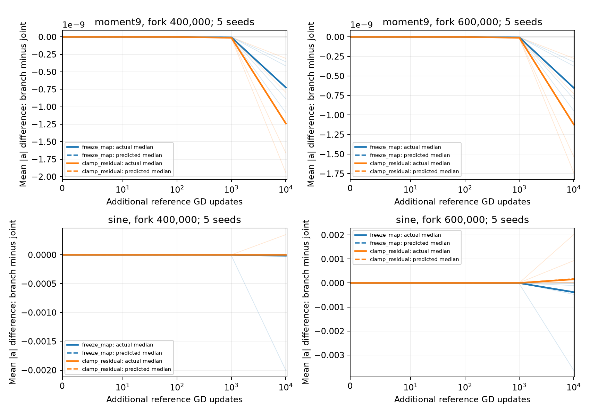

# Matched effective-force feedback: the first 10,000 updates

The first common tier supports two different local descriptions. Degree-9
motion is reproduced accurately while keeping its effective map fixed. Sine
already benefits from retaining changes in sensitivity: fixing that map
reduces outward motion, whereas holding the supplied residual fixed can
increase it. These are comparisons of the identified effective force,
$F_a=T_ae_H$, with the ordinary remainder retained in every branch.

This report covers **195 starting checkpoints and 585 continuations**, all
numerically valid through 10,000 additional updates. It is a completed short
interval comparison, not a report of the campaign's longer continuations.
The [protocol](../../../../../../experiments/expD34_readout_race/README.md#proposed-effective-force-perturbations)
specifies the full matrix, and the
[technical note](../../../../../../docs/d34_coarse_balance_stagnation.md)
explains the derivation.

## Degree 9: little feedback change is needed over this interval

**Example.** From the 600k fork, ordinary GD's median mean-gamma change is
$-1.655\times10^{-6}$ over the next 10k updates. Fixing the effective map
changes that motion by a median $-6.509\times10^{-10}$; clamping the supplied
residual changes it by $-1.119\times10^{-9}$. Both interventions make the
contraction slightly stronger. The original motion is much larger than
either feedback correction over this short interval.

**Theory.** Correcting the generated errors weakens their subsequent inward
force. Holding those errors fixed removes that relaxation, so continued
contraction becomes slightly stronger. Sensitivity changes also soften the
contraction here. This is compatible with the earlier long degree-9
fixed-coupling result; 10k updates alone cannot establish its persistence.

**Prediction and result.** The checkpoint-only forecasts predict both signs
for all five seeds at all three degree-9 forks. The fixed-map residual model
also predicts ordinary slope displacement accurately. The table reports
median vector errors across five seeds, with error divided by the norm of
the actual slope displacement; percentages are not errors in mean gamma.

| Target / fork | Complete local linearization | Fixed effective map, evolving residual |
|---|---:|---:|
| Degree 9 / 400k | 0.000520% | 0.0170% |
| Degree 9 / 600k | 0.000478% | 0.0162% |
| Sine / 400k | 0.218% | 4.35% |
| Sine / 600k | 0.596% | 5.16% |

The fixed-map column uses the pure full-parameter effective model. Retaining
the starting remainder as a constant makes little difference: at the
degree-9 600k fork its median displacement error is 0.0161%.

## Sine: sensitivity feedback is already measurable

**Example.** At the sine 600k fork, freezing the map changes mean-gamma
growth by a median $-3.801\times10^{-4}$; clamping the supplied residual
changes it by $+1.541\times10^{-4}$. Both signs occur in every seed.
Ordinary GD's median final mean gamma is 0.1586 and its relative evaluation
MSE is 0.4753. These observations do not establish useful geometry or
precision recovery.

**Theory.** Changing sensitivities supplies outward feedback in these cases,
while error evolution limits it. The two factors of $T_ae_H$ therefore
cannot both be replaced by their starting values. The richer predictor
linearizes the complete applied field, including its full curvature; it
does not import future residuals or feature derivatives.

**Prediction and result.** All 30 sine branch-contrast signs are correct
across the three forks. At 600k, the median relative vector errors of the
predicted branch-minus-GD contrasts are 7.74% for the fixed-map branch and
12.9% for the residual-clamped branch. Predicting ordinary GD more accurately
does not mean predicting its smaller intervention contrasts equally well.

Each thin line is one actual seed. Thick solid lines are medians of paired
branch-minus-GD changes; dashed lines are their forecast medians. The
degree-9 contrasts are small but resolved. Sine's seed variation is retained.

## Three forecast signs fail outside these two examples

Across all targets, the issued forecast gets **387 of 390** mean-motion
contrast signs right. The three misses are all residual-clamped branches
from the 600k fork:

| Target / seed | Actual branch-minus-GD mean-gamma change | Predicted change |
|---|---:|---:|
| Chirp / 1 | $-4.869\times10^{-8}$ | $+7.060\times10^{-8}$ |
| Moment 3 / 2 | $-4.589\times10^{-5}$ | $+3.917\times10^{-6}$ |
| Mixed sine / 3 | $-1.876\times10^{-5}$ | $+1.469\times10^{-6}$ |

These are retained as forecast misses, rather than evidence for an unspecified
feedback explanation. Subsequent posthoc degree-129 and half-step checks of
these exact three cases preserve every negative sign. The smallest ratio of
the observed contrast magnitude to its change under either control is 6,626.
The checks strongly separate these misses from the observed numerical
sensitivity, although refinement differences are not certified error bounds.
The original predictions remain unchanged; the new records are in
`../miss_controls/`.

## Corrections and numerical checks

Ordinary-GD integrated tracking remains small in the two motivating
examples. At the 400k and 600k degree-9 forks, the median ratio of tracking
to effective **signed-travel vector norms** is about $10^{-5}$. For sine
it is $9.18\times10^{-4}$ and $5.63\times10^{-4}$. Omitted-residual ratios
are at most $5.73\times10^{-12}$ among these four group medians. The new
comparison therefore studies feedback inside the surviving force; it does
not revive these corrections as baseline drivers.

Independent dense NumPy derivatives checked the pilot's first two updates
and exact second-step identities, with maximum discrepancies below
$5.6\times10^{-17}$. CPU, Runpod, and Modal parameter comparisons differed
by less than $7\times10^{-18}$. Every neuron accumulates positive travel,
negative travel, signed force contributions, and crossing corrections at
every update; the 10k accounting discrepancies are below $4\times10^{-15}$.

For five targets, seed 0, and the 400k/600k forks, all 40 refinement
contrasts preserve their signs. The largest relative contrast difference
is $6.82\times10^{-8}$ when increasing the polynomial degree from 65 to
129, and $9.34\times10^{-5}$ when halving the step at equal physical time.
These numerical checks do not supply a model-error tolerance or a
long-time certificate.

Training uses the fixed 2,048-point measure; evaluation uses 8,192 points
with the original target normalization. No evaluation result selects cases
or changes the forecast. All predictions were issued before continuation.
Evidence is retained in `actual_vs_forecast.csv`, `branch_contrasts.csv`,
`summary_10k.json`, and the separate `../controls_10k/` artifacts. The
forecast archives retain their issuance times and hashes.
