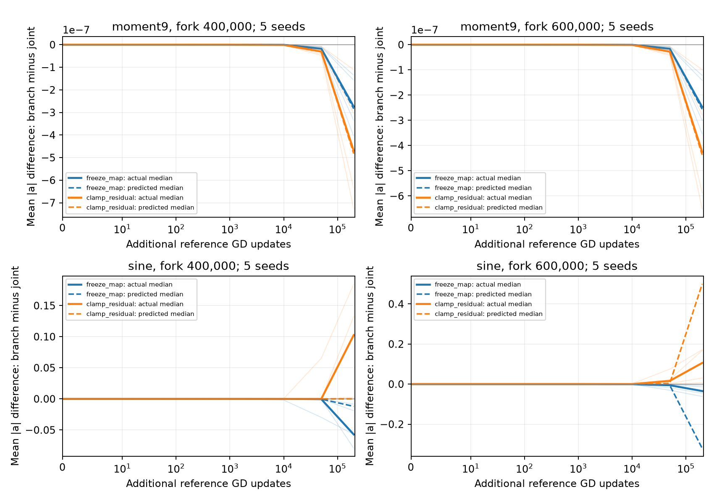

# Effective-force feedback through 200,000 further GD updates

The experiments support reducing ordinary slope motion to the effective fine force, but they separate two kinds of persistence. For the ninth-degree target, a nearly fixed response map already predicts the small motion accurately. For sine, changing the map and changing the residual both matter: freezing the map often suppresses growth, while holding the residual fixed often increases it. Neither intervention produces precision fitting or the predicted large-scale geometry in this window. The local coupled forecast frequently gets the direction of an intervention right while eventually getting its magnitude badly wrong.

This report covers the complete 195-start existing panel and the 78-start fresh-seed panel, each with three branches and 200,000 further updates. It makes no claim about later continuations. Numerical tables come from the [existing summary](summary.json), [existing case measurements](case_diagnostics.csv), [fresh summary](../fresh_200k/summary.json), and [fresh case measurements](../fresh_200k/case_diagnostics.csv).

| Symbol or term | Meaning |
|---|---|
| $a$, $\gamma_j=|a_j|$ | Signed slopes and their magnitudes; width is 177. |
| $e_H$ | Residual coefficients in retained empirical polynomial modes 2 through 65. |
| $T_a$ | Map from those residual coefficients to the effective slope gradient after eliminating the coarse response. |
| $F_a=T_ae_H$ | Effective fine slope gradient. |
| $R_a=g_a-F_a$ | Exact ordinary remainder, decomposed diagnostically into coarse tracking and omitted-mode contributions. |
| Joint | Ordinary simultaneous full-batch GD. |
| Freeze map | Apply $T_a(\theta_0)e_H(\theta)+R_a(\theta)$ to slopes. |
| Clamp residual | Apply $T_a(\theta)e_H(\theta_0)+R_a(\theta)$ to slopes. |
| Relative motion error | Euclidean forecast error in signed slopes divided by actual signed-slope displacement from the fork. |

All three branches update nonslope parameters by ordinary GD at their own current states. They have the same first update, up to floating-point roundoff. Later differences therefore test the feedback through $T_a$ and $e_H$, rather than a different initial force. The interventions are modified vector fields; they need not descend any common loss.

The existing panel uses seeds 0–4 and the fresh panel seeds 20–21, with forks at 100,000, 400,000, and 600,000 original updates for each of 13 targets. GD uses step size 0.002 and the original 2,048-point training grid. Evaluation uses an 8,192-point grid with the original training normalization. This evaluation measures approximation error; it is not a newly selected or independently sampled generalization benchmark. Forecast archives were issued before these continuations. All 819 branches completed with valid states. Reported medians use all five existing seeds or both fresh seeds, unless pooling forks is explicitly stated.

## 1. A stalled example that a nearly fixed map explains

**Example.** The ninth-degree target remains at relative evaluation MSE approximately 0.75001. Across all seven seeds, three forks, and three arms, no neuron reaches $\gamma=1$; the largest observed terminal slope is below 0.220. The interventions change the already small contraction rather than creating a route to large slopes.

**Theory.** The reduction $g_a=T_ae_H+R_a$ identifies the force, but persistence also requires understanding its evolution. Here the simpler approximation that freezes the effective response map is quantitatively informative. The table compares autonomous forecasts against ordinary GD after 200,000 updates. The affine forecast linearizes the full joint field at the fork; the fixed-map models retain effective residual feedback, with either no remainder or a frozen initial remainder. These are predictions from the initial state, not fits to the future trajectory.

| Target / fork | Panel | Affine motion error | Fixed map, no remainder | Fixed map, initial remainder |
|---|---|---:|---:|---:|
| Degree 9 / 400k | Existing | 0.000162 | 0.00330 | 0.00330 |
| Degree 9 / 600k | Existing | 0.000151 | 0.00315 | 0.00314 |
| Degree 9 / 400k | Fresh | 0.000432 | 0.00500 | 0.00500 |
| Degree 9 / 600k | Fresh | 0.000387 | 0.00463 | 0.00462 |
| Sine / 400k | Existing | 0.691 | 0.862 | 0.862 |
| Sine / 600k | Existing | 11.179 | 0.467 | 0.467 |
| Sine / 400k | Fresh | 1.530 | 0.867 | 0.867 |
| Sine / 600k | Fresh | 0.667 | 0.552 | 0.552 |

**Prediction and assessment.** A useful fixed-map explanation predicts accurate small displacement despite a large remaining target error. Degree 9 meets this prediction within the observed window: fixed-map errors are about 0.3–0.5%, and retaining the small initial remainder barely changes them. Sine does not meet it. Thus the evidence supports a conditional fixed-map persistence mechanism, not a universal explanation for every difficult target.

## 2. Sine exposes the coupled feedback and the forecast's limit

**Example.** At the 400k fork, freezing the map reduces the median maximum slope substantially in both panels. Clamping the residual increases it. Yet even the stronger-growth branches remain far from precision: none of the 63 sine branches ever reaches $\gamma=16$ by the endpoint, and their best relative evaluation MSE exceeds 0.20.

| Fork | Panel | Arm | Mean $\gamma$ | Maximum $\gamma$ | Relative evaluation MSE |
|---|---|---|---:|---:|---:|
| 400k | Existing | Joint | 0.158 | 2.574 | 0.496 |
| 400k | Existing | Freeze map | 0.099 | 0.523 | 0.842 |
| 400k | Existing | Clamp residual | 0.261 | 4.322 | 0.344 |
| 400k | Fresh | Joint | 0.167 | 5.376 | 0.309 |
| 400k | Fresh | Freeze map | 0.109 | 1.136 | 0.751 |
| 400k | Fresh | Clamp residual | 0.332 | 8.431 | 0.265 |
| 600k | Existing | Joint | 0.173 | 6.030 | 0.280 |
| 600k | Existing | Freeze map | 0.141 | 5.046 | 0.283 |
| 600k | Existing | Clamp residual | 0.281 | 7.441 | 0.261 |
| 600k | Fresh | Joint | 0.178 | 6.677 | 0.244 |
| 600k | Fresh | Freeze map | 0.176 | 7.216 | 0.273 |
| 600k | Fresh | Clamp residual | 0.186 | 7.149 | 0.244 |

Entries are separate medians of case measurements, so a row need not describe a single network. In particular, late fresh-seed results do not support a universal claim that freezing the map lowers every scale statistic.

**Theory.** The product $T_ae_H$ contains two distinct feedback channels. Evolving features change their response to a given error; learning also changes the error that drives those features. The common first update and distinct second updates isolate these channels locally. Over longer intervals, both branches also induce their own changes in $R_a$, so the experiment does not isolate a single causal contribution indefinitely.

<figure>
  
  <figcaption>Branch minus joint mean slope magnitude, evaluated separately for each matched seed before aggregation. Solid curves show median actual contrasts, dashed curves show issued affine predictions, and light curves retain individual actual outcomes. The degree-nine changes are small; sine develops substantially larger and less accurately forecast changes.</figcaption>
</figure>

The [corresponding fresh-seed figure](../fresh_200k/paired_scale_contrasts.png) provides the same comparison without pooling the two seed panels.

**Prediction and assessment.** If map feedback aids motion while residual correction weakens its drive, freezing the map should suppress growth and clamping the residual should increase it. The 400k sine examples support those directions. The quantitative forecast becomes unreliable by 200k, especially the existing 600k affine forecast. A correct sign is therefore evidence about a local mechanism, not evidence of a successful long-horizon surrogate.

| Further updates | Existing correct signs / comparisons | Fresh correct signs / comparisons |
|---|---:|---:|
| 2 | 390 / 390 | 156 / 156 |
| 10 | 390 / 390 | 156 / 156 |
| 100 | 390 / 390 | 156 / 156 |
| 1,000 | 390 / 390 | 156 / 156 |
| 10,000 | 387 / 390 | 156 / 156 |
| 50,000 | 381 / 390 | 153 / 156 |
| 200,000 | 375 / 390 | 153 / 156 |

Every comparison here has a finite forecast. The common first-step contrast is mathematically zero; floating-point signs at that step are not a meaningful success criterion. All later sign disagreements, including their numerical values, are retained in the [existing](summary.json) and [fresh](../fresh_200k/summary.json) summaries and contrast CSVs. At 200k, one fresh disagreement is sine, seed 20, fork 600k, freeze map. The original three 10k misses—chirp seed 1, moment3 seed 2, and mixed_sine seed 3, all clamp residual at fork 600k—survive degree-129 and half-step controls. Their smallest observed sign margin is more than 6,600 times the measured control discrepancy; they are model failures rather than plausible roundoff effects. See the [matched control audit](../miss_controls/summary.json).

## 3. Growth is sparse, and the panel contains several regimes

**Example.** Ordinary sine can grow a few slopes while degree 9 barely moves. Other targets span both behaviors. To avoid selecting only favorable examples, the following table includes every target. It pools the three forks within each seed panel: existing medians use 15 ordinary trajectories and fresh medians use six. The classifications are descriptive observations, not precommitted statistical categories.

| Target | Median change in mean $\gamma$, existing / fresh | Median relative MSE, existing / fresh | Observed behavior |
|---|---:|---:|---|
| blend_m010 | 0.00374 / 0.00519 | 0.74951 / 0.74932 | Small growth, little fitting progress |
| blend_p001 | −0.000182 / −0.000239 | 0.75002 / 0.75002 | Contraction |
| blend_p010 | −0.000383 / −0.00103 | 0.75006 / 0.75009 | Contraction |
| blend_p030 | 0.0121 / 0.00797 | 0.69119 / 0.74794 | Seed-dependent partial growth |
| chirp | 0.0194 / 0.0121 | 0.78152 / 0.87957 | Growth with large remaining error |
| localized_sine | 0.0191 / 0.00954 | 0.19148 / 0.19061 | Sparse growth and partial fitting |
| mixed_sine | 0.0213 / 0.0209 | 0.30675 / 0.31075 | Sparse growth and partial fitting |
| moment3 | 0.0192 / 0.0169 | 0.02777 / 0.00755 | Substantial partial fitting |
| moment4 | 0.000263 / 0.000416 | 0.74998 / 0.74996 | Very slow growth |
| moment5 | 0.0000635 / 0.0000789 | 0.75000 / 0.75000 | Very slow growth |
| moment9 | −0.0000339 / −0.0000540 | 0.75001 / 0.75001 | Persistent small contraction |
| runge | 0.00667 / 0.00898 | 0.02222 / 0.02682 | Partial fitting |
| sine | 0.0141 / 0.0113 | 0.49572 / 0.30932 | Sparse growth and partial fitting |

**Theory.** An acquisition statement concerns threshold crossings, not simply the largest endpoint slope. A trajectory may already have a tail at its fork. Conversely, a neuron may cross a threshold and later return below it. The acquisition bound therefore needs initial occupancy and cumulative outward travel, with sign crossings accounted for exactly.

The next table counts neuron-run events across each entire panel. A neuron appearing at multiple forks contributes once per fork; these are not independent-neuron counts. “New” means initially below the threshold and reaching it at least once during the continuation. The initial tail is common to the three arms.

| Panel | Threshold | Initial tail | New, joint | New, freeze map | New, clamp residual |
|---|---:|---:|---:|---:|---:|
| Existing, 195 starts | 1 | 102 | 64 | 19 | 97 |
| Existing, 195 starts | 3.2 | 28 | 29 | 13 | 49 |
| Existing, 195 starts | 16 | 0 | 0 | 0 | 0 |
| Fresh, 78 starts | 1 | 38 | 26 | 6 | 39 |
| Fresh, 78 starts | 3.2 | 12 | 8 | 4 | 19 |
| Fresh, 78 starts | 16 | 0 | 0 | 0 | 0 |

**Prediction and assessment.** A mechanism that changes the effective drive should change outward travel and hence the number of newly reached thresholds. The observed counts support that prediction at thresholds 1 and 3.2. They do not establish a universal ordering for every target, seed, or scale, and they do not establish acquisition of the theoretical approximation regime. No branch in either full panel reaches 16 during this continuation.

## 4. The ordinary remainder stays small; interventions can amplify it

**Example.** For ordinary sine at forks 400k and 600k, the median ratio of integrated tracking travel to integrated effective travel, measured in the Euclidean norm of per-neuron signed-travel vectors, is $4.35\times10^{-4}$ and $2.74\times10^{-4}$ in the existing panel. The fresh values are $3.10\times10^{-4}$ and $9.27\times10^{-5}$. These diagnostics support the force reduction on the observed ordinary trajectories.

**Theory.** Small $R_a$ on a baseline trajectory does not imply small $R_a$ after changing the slope field. The modified trajectories alter both geometry and readouts. At fresh sine fork 400k, the same tracking/effective ratio rises to 0.241 for freeze map and 0.056 for clamp residual. These are ratios of accumulated signed vectors, not integrals of force norms; cancellation can affect their interpretation. Both the signed and vector diagnostics are retained in the case CSVs.

**Prediction and assessment.** The reduction predicts ordinary motion when its remainder stays controlled. It does not predict that long interventions will preserve coarse balance automatically. Consequently, the cleanest causal test remains the common first step and the exact second-step response; later intervention differences measure the resulting coupled system, including induced tracking corrections.

Readout size remains a secondary diagnostic. Existing sine fork 400k has median readout RMS 0.177, 0.128, and 0.130 for joint, freeze map, and clamp residual, respectively, although clamp produces the largest slopes. At fork 600k the corresponding values are 0.178, 0.278, and 0.156. A scalar readout-size explanation does not order these outcomes consistently. A single width and these stalled or partially growing geometries also cannot establish the asymptotic $O(h)$ readout law of the constructive approximation.

## 5. What the finite-time theory has and has not established

The [ordinary-GD bound audit](../prediction_audit/summary.json) and [fresh audit](../prediction_audit_fresh/summary.json) are separate from the forecast comparisons. They evaluate sufficient local enclosure conditions using the initial state, rather than certify a trajectory merely because an affine prediction stays finite. For fresh starts the largest sampled closed horizon ranges from 100 to 50,000 updates, with median 1,000. Fresh degree-nine starts close to 10,000 or 50,000 depending on seed; fresh sine starts close to 1,000. These are sampled sufficient horizons, not optimized persistence times, and the numerical audit uses FP64 rather than directed-rounding interval arithmetic.

The theorem gives a useful route from bounded outward travel to limited new acquisition, including the initial tail. The 200k observations go beyond several of those closed horizons. Accurate degree-nine forecasts support the proposed local persistence mechanism there; they do not extend its proved horizon. Sine's large forecast errors identify the unresolved part: predicting the evolving effective map and residual beyond a local expansion.

The [independent CPU audit](../../verification/independent_cpu_audit.json) verifies the gradient decomposition, first two updates, travel identities, and backend agreement on the pilot. Numerical controls test retained degree and step size; they are sensitivity checks, not universal error bounds. The [full fast-suite record](../../verification/full_fast_suite.json) reports 783 passes, 17 failures, and nine skips. No D34 test failed; the remaining failures include missing external data/dependencies and independently reproduced unrelated test-state interactions. This verification supports the implementation used here without converting the empirical persistence observations into an unconditional theorem.
