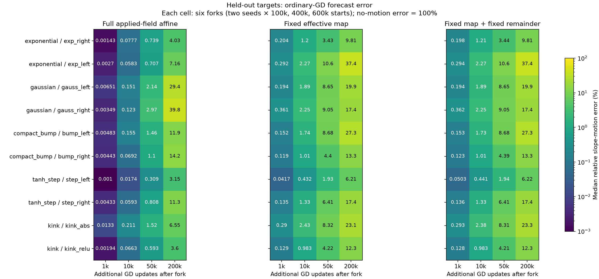
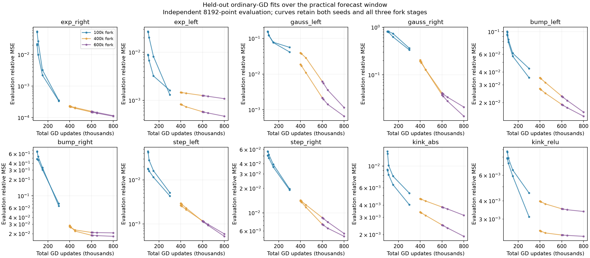
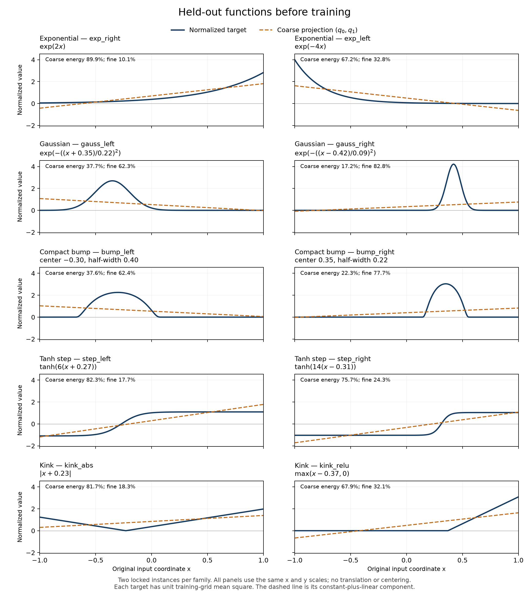

# Effective-force forecasts on ten new target functions

The effective fine-force description transfers to all ten new function instances, and its coupled local forecasts predict the next 10,000 GD updates well: every ordinary-GD affine forecast improves on predicting no slope motion, with function-level median relative errors between 0.017% and 0.211%. The worst individual error is 16.2%, so the medians are not a uniform accuracy guarantee. The limitation appears within the practical training window: three early-fork forecasts lose to no motion by 50k additional updates, and twelve do so by 200k. The simpler fixed-map, 64-error-state model remains better than no motion in all 60 ordinary-GD cases through 200k, although its largest error reaches 79.8%.

These results support a target-general effective-force framework and a useful short-window surrogate. They do not establish a target-universal acquisition barrier or a uniformly accurate long-window model. Neither positive slope motion nor a large existing slope proves that useful geometry has been acquired.

**Terminology.** These definitions distinguish the force description, its approximations, and the measured learning behavior.

| Term | Meaning |
| --- | --- |
| Held-out target | A new function instance fixed before its training outcomes were inspected. Each network is subsequently trained on that function; the holdout concerns function outcomes, not untrained prediction of the target. |
| Fork | A saved ordinary-GD state after 100k, 400k, or 600k updates. |
| Additional / total updates | Forecast distance from the fork / fork updates plus that distance. |
| Effective fine force $F_a$ | $T_a e_H$, using all 64 retained fine-error coefficients. |
| Remainder $R_a$ | The measured coarse-equilibrium tracking correction plus omitted-component correction. |
| Affine forecast | The first-order expansion of the full applied parameter-gradient field at the fork, iterated as a discrete map in 532 parameters. |
| Fixed-map forecast | The 64-error-state model with the full effective map frozen at the fork; evaluated with zero or frozen remainder. |
| Relative motion error | $\|\widehat{\Delta a}-\Delta a\|_2/\|\Delta a\|_2$; the reference prediction of no motion has error one. |
| Skill | One minus squared relative motion error. Positive values improve on no motion; zero denominators remain unresolved. |
| Scale threshold hit | A neuron newly reaches a specified $|a_j|$ threshold after the fork. This alone does not establish useful geometry or a precision fit. |

## Where the forecasts transfer, and where they fail

All 60 starts and all three branches reached every primary horizon: 720 arm–horizon observations, with no failed or unsupported forecast rows. The table shows every function, grouped into all five families. The very large worst-case errors are retained rather than clipped.

**Ordinary-GD slope-motion errors, in percent.** Each median uses two seeds and three fork stages. The no-motion baseline has error 100%. The final column uses the pure fixed-map model; the preceding columns use the full-field affine model.

| Family / function | 1k median | 10k median | 50k median | 200k median | 200k worst | Fixed map: 200k median |
| --- | ---: | ---: | ---: | ---: | ---: | ---: |
| Exponential / exp_right | 0.0014 | 0.0777 | 0.739 | 4.03 | 183,347 | 9.81 |
| Exponential / exp_left | 0.0027 | 0.0583 | 0.707 | 7.16 | 70.4 | 37.4 |
| Gaussian / gauss_left | 0.0065 | 0.151 | 2.14 | 29.4 | 1,205 | 19.9 |
| Gaussian / gauss_right | 0.0035 | 0.123 | 2.97 | 39.8 | 521,451 | 17.4 |
| Compact bump / bump_left | 0.0048 | 0.155 | 1.46 | 11.9 | 278 | 27.3 |
| Compact bump / bump_right | 0.0044 | 0.0692 | 1.10 | 14.2 | 514,961 | 13.3 |
| Tanh step / step_left | 0.0010 | 0.0174 | 0.309 | 3.15 | 2,296 | 6.21 |
| Tanh step / step_right | 0.0043 | 0.0593 | 0.808 | 11.3 | 32.8 | 17.4 |
| Kink / kink_abs | 0.0133 | 0.211 | 1.52 | 6.55 | 282 | 23.1 |
| Kink / kink_relu | 0.0019 | 0.0663 | 0.593 | 3.60 | 65.4 | 12.3 |

The failures concentrate at the earliest fork. At 100k starts, affine median/worst errors are 22.0%/420% after 50k additional updates, rising to 280%/521,451% after 200k. Only 8 of those 20 early-start forecasts still beat no motion at 200k. By contrast, all 40 later-start forecasts do: the 400k starts have median/worst errors 7.18%/45.8%, and the 600k starts 3.70%/12.6%. Pooling those stages would conceal a substantial failure to extrapolate the earlier field.

The 50k failures are `exp_right` seed 22, `bump_right` seed 22, and `gauss_right` seed 23, each forked at 100k. Their absolute slope-vector errors are 2.11, 11.7, and 4.85, respectively. These are genuine forecast failures, not merely an impressive relative number caused by an exactly zero motion denominator. Across all ordinary-GD cases, median absolute affine error grows from $3.97\times10^{-5}$ at 10k to $2.21\times10^{-3}$ at 50k and $5.62\times10^{-2}$ at 200k.

**Family-level aggregation exposes the outliers.** “Macro mean” averages the two function means; “macro median” takes the median of the two function medians. Both give each function equal weight. Values are affine relative slope errors in percent; no inference treats the repeated starts as independent functions.

| Family | 10k macro mean / median | 200k macro mean / median |
| --- | ---: | ---: |
| Exponential | 1.67 / 0.0680 | 15,385 / 5.60 |
| Gaussian | 0.847 / 0.137 | 44,160 / 34.6 |
| Compact bump | 1.82 / 0.112 | 43,837 / 13.0 |
| Tanh step | 0.515 / 0.0384 | 202 / 7.24 |
| Kink | 0.342 / 0.139 | 39.2 / 5.08 |

<figure>
  
  <figcaption>The affine model is typically more accurate locally; the fixed-map models avoid its largest longer-window extrapolation failures. Cells show six-case medians, so the worst-case and stage-specific errors in the tables remain essential.</figcaption>
</figure>

## What the simpler coupled model gains

For example, the early affine failures above coexist with a fixed-map forecast that beats no motion for every ordinary-GD start through 200k. This distinguishes two approximations of the same effective force. The full affine forecast expands the entire 532-parameter field at one state. The smaller model instead evolves all 64 fine residuals under the fork's fixed effective coupling. Its structure preserves feedback between errors without extrapolating every parameter derivative indefinitely.

Across all 60 starts, the fixed-map model has median/worst slope-motion errors of 1.55%/24.4% at 10k, 7.63%/67.8% at 50k, and 18.1%/79.8% at 200k. Its median skill at 200k is approximately 0.967, and even its worst case has positive skill, approximately 0.363. This is useful prediction relative to no motion, not high-precision prediction. Freezing the remainder as well changes the pooled 200k median error from 18.1% to 17.9%; it does not supply the missing accuracy.

The residual prediction supports the same limited conclusion. Scoring the **change** in all 64 errors, the affine median relative error is 1.64% at 10k and 15.1% at 200k, but its worst 200k error is about 5,904 times the actual change norm. The pure fixed-map model gives 7.46% and 18.3% median errors, with worst 200k error 96.3%. Thus all 60 fixed-map residual-change forecasts still improve on no change. The model has meaningful coupled-error content, but this is a 64-state description rather than a universal scalar or two-error closure.

## Does the effective-force premise itself transfer?

Yes, for the measured ordinary-GD trajectories, with the qualification that these are diagnostics rather than an all-step bound. At the forks, $\|R_a\|_2/\|F_a\|_2$ has median 0.0206% and maximum 1.03%. At 200k, this endpoint ratio has median 0.0103% and maximum 0.0958%. The largest norm ratio of accumulated signed remainder travel to accumulated signed effective-force travel is 0.389%. At 10k the largest endpoint ratio is 1.08%, and at 50k it is 0.209%. Every function is retained in these comparisons. The evidence therefore continues to place the main ordinary-GD slope motion in the effective fine force, rather than in the tracking or omitted corrections.

The interventions can alter that regime. At 200k, the freeze-map endpoint ratio reaches 76.9%, while its accumulated signed-vector ratio reaches 35.6%; the corresponding clamp-residual maxima are 33.8% and 11.9%. The largest freeze-map endpoint ratio occurs for `exp_right`, seed 22, fork 100k: $\|F_a\|_2=4.42\times10^{-4}$ and $\|R_a\|_2\approx3.40\times10^{-4}$. At 50k the same branch had an endpoint ratio above one. An endpoint ratio can grow when the denominator weakens; it does not establish that corrections dominated the entire trajectory. Accumulated signed vectors can also cancel over time, so their ratios are not ratios of integrated force norms.

This matters for the causal reading. The branches test specified coupled fields, and the affine forecast includes the evolving remainder field. A modified branch leaving the small-remainder regime limits an *effective-only* interpretation of its later motion; it does not excuse a failed prediction of the full applied field or supply a new explanation for the ordinary-GD baseline.

**Predicted intervention contrasts against ordinary GD.** Each entry is median relative vector error / cases with positive skill / correct raw mean-scale contrast signs, out of 60 starts. A correct aggregate sign need not imply an accurate per-neuron prediction.

| Additional updates | Freeze map | Clamp residual |
| --- | --- | --- |
| 1k | 0.349% / 60 / 60 | 0.400% / 60 / 60 |
| 10k | 3.79% / 60 / 60 | 2.67% / 60 / 60 |
| 50k | 16.7% / 51 / 60 | 8.94% / 59 / 59 |
| 200k | 65.6% / 35 / 58 | 22.8% / 47 / 58 |

The 50k clamp sign miss is `gauss_right`, seed 23, fork 400k: the predicted mean-scale contrast is $+8.00\times10^{-4}$ while the observed contrast is $-2.61\times10^{-4}$. A separately labeled, posthoc numerical check is pending. At 200k the four raw sign misses are clamp-residual `gauss_right` for both seeds at the 400k fork, freeze-map `bump_left` seed 23 at 100k, and freeze-map `bump_right` seed 23 at 400k. The seed-22 `gauss_right` miss also lies in the locked control subset: its contrast remains approximately $-0.0297102$ under both refinements, while the issued forecast was $+0.0298093$. These remain failures of the issued sign forecasts; the exact force decomposition is not what these approximations test.

## Learning outcomes remain separate from forecast accuracy

The panel contains different fits and different slope motions. For `gauss_right`, the median evaluation relative MSE changes from 0.198 at the fork to 0.182 at 10k and 0.0396 at 200k; its median maximum slope grows from 8.40 to 11.05 by 200k. For `exp_right`, the corresponding loss changes from $2.29\times10^{-4}$ to $2.23\times10^{-4}$ and then $1.54\times10^{-4}$, while the median maximum slope moves only from 1.96 to 1.97. These are different regimes, not uniformly the degree-nine near-static contraction example.

**Ordinary-GD fork-to-10k-to-200k outcomes.** Entries are medians across six starts, except the last column, which sums newly crossing neuron–fork pairs across those starts. The same neuron can occur at multiple forks; these are not counts of distinct neurons across independent experiments. Initially, 137 neuron–fork pairs already exceed threshold 1 and 45 exceed 3.2; the additional counts by 200k are 38 and 14. At 10k, new threshold-1 hits are limited to two pairs for `gauss_right` and one each for `bump_left` and `step_left`; no new threshold-3.2 hits occur. No pair initially or newly reaches threshold 16 through 200k in these ordinary-GD branches.

| Function | Evaluation relative MSE: fork → 10k → 200k | Maximum slope: fork → 10k → 200k | New hits at 1 / 3.2 by 200k |
| --- | ---: | ---: | ---: |
| exp_right | 0.000229 → 0.000223 → 0.000154 | 1.96 → 1.96 → 1.97 | 0 / 0 |
| exp_left | 0.00136 → 0.00135 → 0.00117 | 3.01 → 3.01 → 3.03 | 0 / 0 |
| gauss_left | 0.0288 → 0.0269 → 0.00420 | 6.24 → 6.27 → 6.27 | 7 / 1 |
| gauss_right | 0.198 → 0.182 → 0.0396 | 8.40 → 8.58 → 11.05 | 13 / 2 |
| bump_left | 0.0313 → 0.0306 → 0.0211 | 5.46 → 5.45 → 5.42 | 5 / 2 |
| bump_right | 0.0276 → 0.0263 → 0.0209 | 8.33 → 8.38 → 8.55 | 8 / 4 |
| step_left | 0.00279 → 0.00266 → 0.00116 | 4.21 → 4.24 → 4.71 | 1 / 2 |
| step_right | 0.0141 → 0.0137 → 0.00798 | 5.51 → 5.57 → 6.39 | 1 / 2 |
| kink_abs | 0.00423 → 0.00418 → 0.00348 | 1.65 → 1.66 → 1.64 | 2 / 0 |
| kink_relu | 0.00375 → 0.00373 → 0.00324 | 3.06 → 3.07 → 3.09 | 1 / 1 |

<figure>
  
  <figcaption>Actual ordinary-GD losses, including each initial fork. The horizontal axis is total training time; the forecast horizons are additional updates from the colored fork. Each curve uses its fixed training normalization. Loss reduction and threshold crossings are observations, not proof of precision-level fitting or theoretically useful geometry.</figcaption>
</figure>

## What was fixed before the continuations

The ten functions comprise two exponentials, two localized Gaussians, two compact bumps, two shifted tanh steps, and two functions with a kink. Their formulas, original normalization, and modal energies were locked in the [pretraining target audit](../heldout_targets/target_audit.json). The families were chosen after the original campaign; some ingredients, such as localization, already occurred there. This is a holdout of the new function outcomes, not a random sample from a function distribution or a claim that every mathematical ingredient was unseen. Their original degree-65 omitted target energy ranges from rounding-level values to $1.06\times10^{-4}$ for the narrower compact bump; consequently the basis refinement is particularly relevant for that function.

<figure>
  
  <figcaption>The actual normalized targets and their coarse projections on the original input interval. Each curve uses its fixed training normalization.</figcaption>
</figure>

For every function we retain both seeds, 22 and 23, and all three fork stages: 60 starts and 180 continued branches. Training uses 2,048 midpoint samples, width 177, FP64 GD with learning rate 0.002, and degree 65. Loss is independently evaluated on 8,192 points with the original training-grid normalization. No function or fork is selected for exhibiting stagnation.

The three branches are ordinary GD, a branch with the slope effective map frozen, and a branch with the fine-error vector entering the slope force frozen. Each retains the same remainder *field*, evaluated at its own evolving state. All three have the same first update; the largest observed first-step discrepancy was $2.78\times10^{-17}$. Their subsequent differences test feedback, while the forecast predicts those differences before seeing the continuations. The [protocol](../../../../../../experiments/expD34_readout_race/README.md) records the exact fields and comparison design.

The primary horizons are 1k, 10k, 50k, and 200k **additional** updates. Thus the earliest forks test total training times 101k, 110k, 150k, and 300k; at the 200k horizon, the later forks end at 600k or 800k total updates. Million-step extrapolations are outside this assessment. Forecasts were issued from each fork before its future branch data were observed; no fitted forecast parameter uses a continuation.

All summaries retain individual cases in CSV files. Function summaries average repeated stages and seeds only as descriptions of that function. Family summaries give each of its two functions equal weight; the 60 starts are not treated as 60 independent target functions. The modal comparison scores $\widehat e_H-e_H(0)$ against the actual **change** $e_H(t)-e_H(0)$, so a large, nearly unchanged target residual cannot make an uninformative prediction appear accurate. All 64 coefficients and their raw sign crossings are retained; tiny nonzero signs are not numerically certified.

## Numerical sensitivity and the finite-time theorem

The locked numerical controls use all ten functions at seed 22 and fork 400k, with all three arms. Degree 129 checks the finite-basis representation; learning rate 0.001 checks the discrete trajectory at matched physical times. Initial parameters agree bitwise, and the half-step runs take twice as many actual updates. Across 10k, 50k, and 200k, all 120 paired contrast signs agree with the primary runs. The largest vector-contrast discrepancies are $5.46\times10^{-5}$ for degree refinement and $5.31\times10^{-5}$ for step refinement, relative to the primary contrast norm. The largest degree-refinement discrepancy occurs for `bump_right`, freeze-map, at 200k; its less rapidly decaying target expansion therefore leaves a measurable but small effect on this comparison. At 200k, the largest absolute slope-vector state differences are $1.27\times10^{-5}$ for degree refinement and $1.15\times10^{-5}$ for step refinement. Two refinement levels establish measured numerical sensitivity, not a rigorous numerical error bound, and this locked subset does not cover the 100k-fork forecast failures.

The [independent bound audit](../heldout_bound_audit.json) separates the analytic theorem from forecast accuracy. Of the 60 starts, 22 have largest issued FP64-evaluated closed enclosure horizon 100 updates, and 38 reach 1k; none closes at 10k or later. These are sufficient horizons obtained from the separate geometric-path enclosure, not a computed spectral-travel certificate. They have not been evaluated with directed rounding. Accordingly, the strong 10k forecast performance is empirical, and the 50k/200k forecast failures remain substantive limitations. A conditional finite-time acquisition theorem is available when its trajectory-control hypotheses close; this panel does not supply a universal 200k barrier.

## Evidence and reproducibility

The executable analysis is [effective_feedback_holdout_analysis.py](../../../../../../experiments/expD34_readout_race/effective_feedback_holdout_analysis.py). It reuses the issued prediction archives, verifies their hashes and matching initial parameters, and checks physical time against the actual update counts. The [plot source](plot.py) and [control comparison](controls.py) produce evidence artifacts only; this report is authored directly.

The common 10k and 50k tiers are preserved in [heldout_10k](../heldout_10k/) and [heldout_50k](../heldout_50k/). The complete primary comparison is retained in [actual_vs_forecast.csv](actual_vs_forecast.csv), [branch_contrasts.csv](branch_contrasts.csv), [modal_scores.csv](modal_scores.csv), [modal_coefficients.csv](modal_coefficients.csv), and [summary.json](summary.json). The [target summary](target_summary.csv) retains mean, median, minimum, maximum, and positive-skill counts rather than only the displayed medians. Numerical-control records are [control_states.csv](control_states.csv) and [control_contrasts.csv](control_contrasts.csv).
