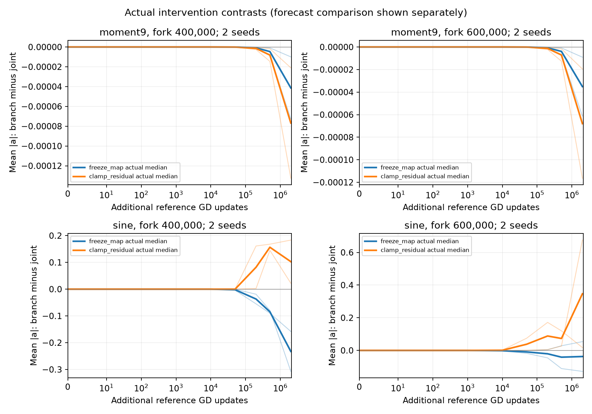

# Optional stress test beyond the primary prediction window

These completed continuations check how the observed regimes eventually change. They are **outside the primary window of 1,000–200,000 additional updates** and do not set a requirement that the local surrogate predict millions of updates. The main finding is a distinction between persistent small-scale motion on the polynomial targets and substantial coupled evolution on the other targets. Late intervention trajectories also develop tracking forces that were small in ordinary GD, limiting their interpretation as isolated tests of effective-force feedback.

| Term | Meaning |
|---|---|
| Joint | Ordinary full-batch GD. |
| Freeze map | Hold the effective response map $T_a$ at its fork value; evolve the fine residual $e_H$. |
| Clamp residual | Hold $e_H$ at its fork value; evolve $T_a$. |
| Remainder | The exact difference $R_a=g_a-T_ae_H$, retained at each branch's own state. |
| Tracking ratio | Norm of cumulative per-neuron signed tracking travel divided by the corresponding effective-travel norm. It is not a ratio of integrated force norms. |

The locked panel contains five targets, seeds 0 and 20, and forks at 400,000 and 600,000 original updates: 20 starts and 60 branches. All branches have valid completed snapshots at 500,000 and 2,000,000 additional updates. These endpoints correspond to **900,000 or 1,100,000 total updates**, and **2,400,000 or 2,600,000 total updates**, respectively. GD uses step size 0.002, 177 neurons, the original 2,048-point training grid, and retained degree 65. Evaluation uses 8,192 points with the original normalization. No later endpoint is used here.

## Evolution and stagnation are different observed outcomes

**Example.** Moment5 and moment9 remain near relative MSE 0.75 with small slopes, while chirp, mixed sine, and sine continue to change. The following table includes all five targets. Each entry is a median across the four locked seed/fork trajectories at 2m additional updates; separately aggregated entries need not describe one network.

| Target | Relative evaluation MSE, joint / freeze / clamp | Median maximum $\gamma$, joint / freeze / clamp |
|---|---:|---:|
| Chirp | 0.5152 / 0.8005 / 0.6374 | 10.28 / 4.63 / 22.97 |
| Mixed sine | 0.1993 / 0.2533 / 0.0853 | 5.87 / 6.63 / 26.46 |
| Moment5 | 0.749995 / 0.749995 / 0.749994 | 0.233 / 0.226 / 0.236 |
| Moment9 | 0.750006 / 0.750006 / 0.750006 | 0.200 / 0.200 / 0.202 |
| Sine | 0.0283 / 0.4925 / 0.2928 | 3.75 / 1.87 / 17.72 |

**Theory.** Identifying $T_ae_H$ as the dominant ordinary slope force does not imply that it stays constant, that all targets stagnate, or that larger slopes always improve fitting. For example, clamped sine has larger slopes and worse fitting than ordinary sine at this endpoint. The force decomposition concerns the source of motion; a persistence theorem additionally needs bounds on the evolution and accumulated outward travel.

**Prediction and assessment.** Persistent small-scale motion should remain visible in both the slopes and the error. The polynomial examples show that behavior. The other targets demonstrate evolution beyond a local neighborhood, with partial fitting rather than precision approximation. These observations delimit the regimes; they do not invalidate an accurate short-window mechanism merely because its initial linearization is no longer accurate at 2m additional updates.

<figure>
  
  <figcaption>Supplementary examples of persistent small changes versus evolving intervention effects. Each curve is branch minus joint mean slope magnitude at matched additional-update counts. Thick curves are medians, and light curves preserve both seeds. A 400k fork plus 2m additional updates is 2.4m total; a 600k fork gives 2.6m total. Forecast comparisons are stored separately and are not suppressed or clipped in their own artifact.</figcaption>
</figure>

## Late interventions can leave the original conditional regime

**Example.** At 2m additional updates, the largest ordinary tracking ratios across the four trajectories are $7.2\times10^{-5}$ for chirp, $3.2\times10^{-4}$ for mixed sine, $2.8\times10^{-5}$ for moment5, $2.4\times10^{-5}$ for moment9, and $6.1\times10^{-4}$ for sine. In contrast, freeze-map ratios reach 1.21, 1.43, and 2.33 for chirp, mixed sine, and sine, respectively. Clamped chirp reaches 0.85.

**Theory.** Retaining $R_a$ exactly is necessary for an own-state intervention, but it allows new tracking feedback to emerge. A long intervention is consequently a new coupled trajectory, not a permanent isolation of one ordinary-GD mechanism. The omitted-mode contribution also needs measurement as slopes grow: its largest instantaneous ratio to the effective force is $4.1\times10^{-6}$ in ordinary chirp and $1.22\times10^{-3}$ in clamped mixed sine at this endpoint. Small omitted-mode effects do not compensate for a large induced tracking term.

**Prediction and assessment.** The conditional reduction should be applied where its remainder is controlled. The ordinary trajectories satisfy the reported small-ratio diagnostics, while several modified trajectories no longer do. Thus late branch separation cannot be attributed entirely to map feedback or residual correction under an unchanged small-tracking assumption.

There is no initial tail at $\gamma=16$ in this panel. No branch reaches that threshold by 500k additional updates. By 2m, ordinary and freeze-map branches still have no crossings, while clamp branches have five new neuron-run crossings for chirp, ten for mixed sine, and five for sine. Counts include repeated neurons at distinct forks and are not independent-neuron sample sizes. Crossing 16 alone neither establishes precision fitting nor establishes the population geometry required by the constructive theory.

## Numerical scope of the stress test

All 40 intervention contrasts have finite issued forecasts at both endpoints. The affine forecast gets 35 contrast signs right at 500k and 31 at 2m, but its magnitudes become unreliable for the evolving targets. These are optional extrapolation diagnostics, **not the acceptance criterion for the primary 1k–200k window**. The polynomial examples remain more predictable: at 2m, median relative signed-motion errors of the affine model are 1.7–1.9% for moment5 and 1.9–2.1% for moment9, across the two fork groups. The fixed-map model gives 17–18% and 3.3–3.6%, respectively. This distinguishes how much coupling is needed even when both targets remain at small scales.

The artifacts retain every case and forecast disagreement: [2m summary](summary.json), [all-target measurements](all_targets_headline.json), [case diagnostics](case_diagnostics.csv), [contrasts](branch_contrasts.csv), and [500k summary](../long_500k/summary.json). The [primary 200k report](../existing_200k/README.md) provides the broader existing/fresh-seed comparison. None of these long observations enlarges a certified finite-time horizon automatically; they are empirical stress tests of persistence and regime change.
