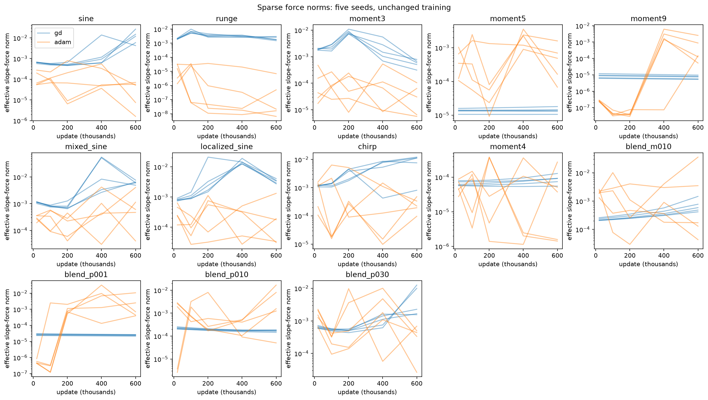
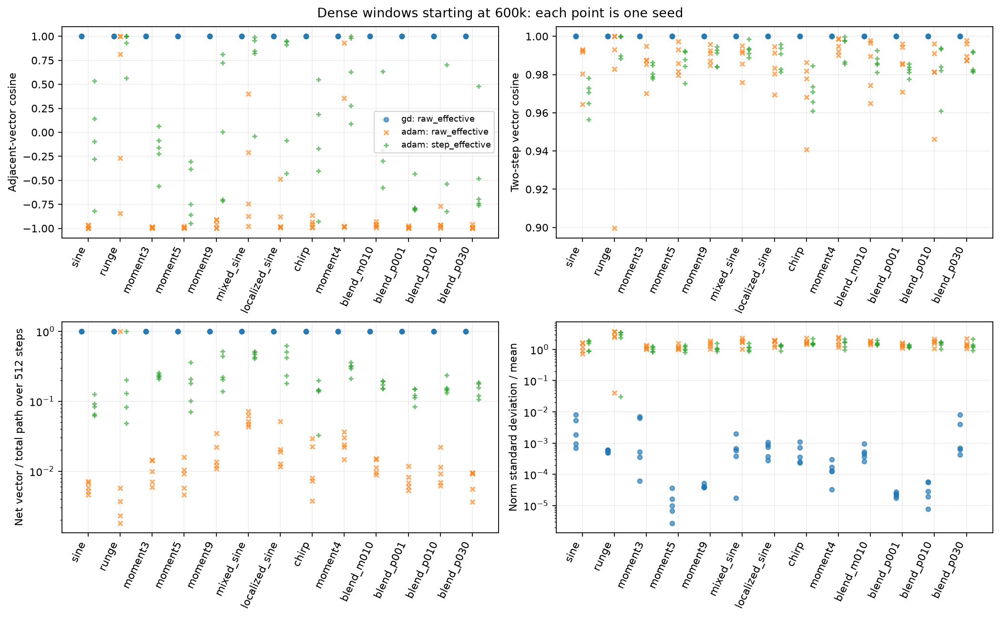
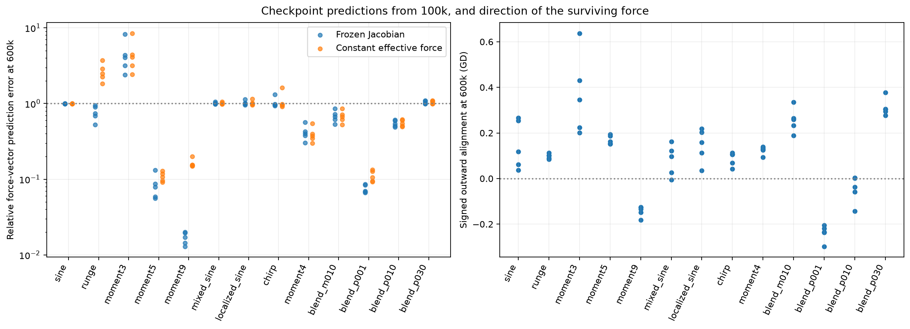
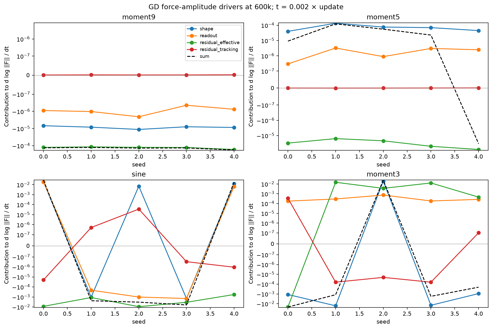

# Effective-force plateaus: long runs and paired interventions

Ordinary GD remains stalled on the degree-9 target through **six million
updates** in all three continued seeds: relative evaluation MSE is approximately
0.75 and every slope remains below magnitude 1. Adam reaches relative MSE
between $4.79\times10^{-5}$ and $2.88\times10^{-4}$ on the same target. Degree 5
shows why a long-lived plateau cannot be treated as permanent: one GD seed
recovers to relative MSE 0.0149 while two remain near 0.75. The evidence supports
target- and seed-dependent persistence, not a universal or permanent barrier.

The original campaign and Runpod follow-up are complete: **794 endpoint
records, 182 prospective forecast comparisons, and no failed or incomplete
cases**. The supplemental interventions extend the seven GD anchor targets
from 6m to 6.5m. Degree 9 remains stalled, with a 0.73% median frozen-Jacobian
forecast error over this late interval. The
[migration record](#modal-migration-and-current-execution) retains the original
runtime checks and accounting. All scientific computations run remotely.

**Terminology used in the new long-horizon results. Errors are dimensionless;
slope quantities use the original physical parameterization.**

| Quantity | Definition |
|---|---|
| Relative evaluation MSE | Mean squared residual divided by mean squared target, measured on 8,192 independent midpoints. |
| Mean gamma | Mean absolute hidden slope, $N^{-1}\sum_j |a_j|$. |
| Effective force | Slope gradient after instantaneous coarse balance; its norm alone does not determine outward movement. |
| Tracking correction | Additional slope gradient from departure from coarse balance; Adam attribution also retains its optimizer history. |

## Long-horizon result: persistence depends on target and seed

Both optimizers completed the fixed 600k-to-6m continuation for all 13 targets
and seeds 0–2, retaining FP64 and complete optimizer histories. There were no
failed cases or unresolved coarse solves. Evaluation uses an independent
deterministic grid; it measures approximation error, not statistical
generalization. No target, seed, or endpoint was selected by its performance.

**Relative evaluation MSE at six million updates, by seed. The degree-5 GD
outcome differs sharply between seeds despite the same training protocol.**

| Optimizer / target | Seed 0 | Seed 1 | Seed 2 |
|---|---:|---:|---:|
| GD / degree 9 | 0.750006 | 0.750006 | 0.750006 |
| Adam / degree 9 | 0.0002885 | 0.00004785 | 0.0001776 |
| GD / degree 5 | 0.749991 | 0.014867 | 0.749245 |
| Adam / degree 5 | 0.00001829 | 0.00006153 | 0.00004029 |
| GD / mixed sine | 0.102407 | 0.060183 | 0.125254 |
| GD / chirp | 0.085247 | 0.003979 | 0.272384 |

The [complete endpoint table](runpod_followup/final-analysis/endpoints.csv)
retains every target and seed. Degree-9 GD has mean gamma 0.0885–0.0895 at 6m,
with zero fraction of slopes at or above 1. Its mean gamma **decreases** by
0.000398–0.000594 between 600k and 6m. The effective force norm falls to
0.329–0.477 of its 600k value, while the endpoint force-vector cosine remains
0.784–0.877. Thus the failure to acquire scales persists even though the force
is neither constant in magnitude nor exactly fixed in direction over this
longer interval.

Degree-5 GD seed 1 instead reaches mean gamma 0.445, with 5 of 177 slopes at
or above 1. The other two seeds have no slopes at or above 1. This is a
finite-horizon observation of seed-dependent recovery, not a proof that the
remaining seeds cannot recover later. The new late interventions and dense
windows test whether the earlier force explanation remains informative after
such divergent trajectories.

<figure>
  
  <figcaption>All 13 targets and seeds 0–2, using the unchanged optimizers and rate 0.002. Each plotted sample is the pre-update observation at the end of a 10,000-update interval; the underlying archive also retains interval extrema. Degree-9 GD declines slowly, while degree-5 trajectories diverge. These samples do not resolve Adam's adjacent-update oscillations.</figcaption>
</figure>

## Independent forecasts confirm a narrow predictive regime

The formulas were frozen before seeds 20–24 were run, and predictions were
saved at issuance before generating the next 500,000 updates. The relative
force-vector error is $\|F_{\mathrm{pred}}-F_{\mathrm{actual}}\|/\|F_{\mathrm{actual}}\|$.
These prospective tests reproduce the earlier distinction: a frozen Jacobian
predicts degree-9 persistence accurately over this horizon, but does not
reliably predict recovery. The degree-5 result is local in time; it cannot
guarantee the absence of the later seed-dependent recovery seen above.

**Median relative force-vector error across the five independent seeds. Both
methods predict 500,000 future updates from the stated checkpoint.**

| Target | 100k issuance: frozen Jacobian | 100k: constant force | 600k issuance: frozen Jacobian | 600k: constant force |
|---|---:|---:|---:|---:|
| Degree 9 | 1.57% | 15.50% | 1.38% | 14.59% |
| Degree 5 | 7.98% | 9.88% | 8.91% | 10.41% |
| Mixed sine | 102.44% | 102.46% | 191.31% | 356.40% |
| Chirp | 96.07% | 95.47% | 74.84% | 90.75% |

The [individual forecast scores](runpod_followup/final-analysis/forecasts.csv)
include all seven GD targets, both issuance times, and every seed. An error
above 100% means the prediction error exceeds the actual force-vector norm;
those failed forecasts remain part of the result. The initializations are
independent, but these deterministic target functions do not define a held-out
statistical generalization test.

## Lower-mode penalties cause contraction, but removing them does not produce escape

The original paired interventions cover seven targets, three discovery seeds
at two fork times, and five independent seeds at 600k. Each arm starts from
identical parameters within its target/seed/fork bundle. At the independent
degree-9 checkpoints, changing lower-mode loss weights changes the direction
and amount of mean-slope motion while barely affecting the original evaluation
error over the next 500k updates.

**Degree-9 interventions from 600k to 1.1m: medians across independent seeds
20–24. Lower-mode weights apply to residual degrees 2 through 8; weight 1 is
ordinary joint GD. Gamma changes use the original physical slopes.**

| Intervention | Change in mean gamma | Relative evaluation MSE |
|---|---:|---:|
| Joint GD | $-7.455\times10^{-5}$ | 0.75000623 |
| Freeze readout | $-6.414\times10^{-5}$ | 0.75000623 |
| Clamp fine-residual input | $-7.820\times10^{-5}$ | 0.75000623 |
| Remove slope tracking | $-7.455\times10^{-5}$ | 0.75000623 |
| Lower-mode weight 0 | $+3.117\times10^{-8}$ | 0.75000628 |
| Lower-mode weight 0.1 | $-7.857\times10^{-6}$ | 0.75000626 |
| Lower-mode weight 10 | $-6.394\times10^{-4}$ | 0.75000603 |

This controlled change supports generated lower-mode penalties as a cause of
the inward motion in these states. It also shows their removal is insufficient
for useful scale acquisition on this horizon: the positive motion with weight
zero is extremely small, and the fitting plateau remains. The changed loss is
a diagnostic intervention, so it does not establish how unmodified GD would
eventually evolve. Removing tracking has little effect here; this GD result
does not establish tracking's irrelevance for Adam.

<figure>
  
  <figcaption>Each point compares an intervention with its own joint-GD control after 500,000 updates from 600k. Discovery uses seeds 0–2; confirmation uses seeds 20–24. Positive error differences mean worse fitting. Effects vary strongly by target: interventions that barely alter the degree-9 plateau can materially change recovering trajectories. The tracking panels use a much smaller vertical scale.</figcaption>
</figure>

The [paired contrast table](runpod_followup/final-analysis/contrasts.csv) retains
all arms, including the weighted losses, and both discovery forks. Comparisons
use matched update horizons; medians do not hide individual seed outcomes in
the linked tables.

## Adam's reversals persist at six million updates

New 512-update windows retain every target and both optimizers at 600k, 1.1m,
3m, and 6m: 312 case-windows. At 6m, 38 of 39 Adam cases have negative median
adjacent-update effective-force cosine, compared with 0 of 39 for GD. Adam's
median adjacent cosine is −0.99585 and its two-update cosine is +0.98846.
Only 0.00327 of the raw effective-force path survives as a net vector, in the
median case. The actual Adam effective-component step has median coherence
0.0309, with negative adjacent cosine in 29 of 39 cases.

GD's corresponding adjacent cosine and coherence are both nearly 1. These
observations extend the early dense audit: Adam can fit well while its raw
force reverses rapidly, so a continuous force-decay interpretation or sparse
norm trace cannot describe its realized updates by itself. Signed movement
still requires optimizer histories and the zero-crossing correction; coherence
is not signed outward movement. See [every dense window](runpod_followup/dense/windows.csv)
and the [direction-count audit](runpod_followup/records/readout_audit.json).

## Late interventions extend the distinction to 6.5 million updates

The H200 follow-up reused all 37 intervention cases for seeds 0–2 at the 6m
checkpoint: 111 additional endpoints. All completed 500,000 updates. The
predictions underlying their 42 forecast comparisons were saved before those
updates. These are
exploratory follow-ups on the original discovery seeds, separate from the
independent-seed confirmation above.

Degree-9 joint GD still has relative evaluation MSE 0.750006 at 6.5m in all
three seeds. Mean gamma decreases by a further $2.78\times10^{-5}$ to
$4.01\times10^{-5}$. The frozen-Jacobian force-vector forecast has median
relative error **0.734%**, versus **8.03%** for constant force. This extends
the local predictive result without establishing an indefinite barrier.

**Degree-9 late interventions, 6m to 6.5m: medians over seeds 0–2. Every arm
retains evaluation relative MSE approximately 0.750006.**

| Intervention | Change in mean gamma |
|---|---:|
| Joint GD | $-3.948\times10^{-5}$ |
| Freeze readout | $-2.893\times10^{-5}$ |
| Clamp fine-residual input | $-3.960\times10^{-5}$ |
| Remove slope tracking | $-3.948\times10^{-5}$ |
| Lower-mode weight 0 | $+2.762\times10^{-8}$ |
| Lower-mode weight 0.1 | $-3.948\times10^{-6}$ |
| Lower-mode weight 10 | $-3.475\times10^{-4}$ |

The same qualitative separation persists: lower-mode penalties control slow
contraction, while removing them produces almost no useful outward motion.
The supplemental late forks have no separate half-step or grid-refinement
study, so the original control evidence must not be treated as a late-fork
error bound.

Degree 5 is already changing regime. Its three joint-GD relative evaluation
errors at 6.5m are **0.74999, 0.01115, and 0.35325**: seed 2 improves materially
after remaining near 0.75 at 6m. Its median frozen-Jacobian force error is now
67.1%, compared with 8–9% in the earlier independent-seed windows. On mixed
sine and chirp, late frozen-Jacobian errors are 22.7% and 42.5%. Predictive
quality therefore depends on the state and interval, not just the target name.

Removing lower-mode penalties can also harm the original fitting objective:
degree-5 relative evaluation MSE has median 2.42 under weight zero, versus
0.353 under joint GD at 6.5m. This intervention changes the loss, so increased
slope motion or a larger reference force would not alone establish useful
learning. The [late endpoint table](runpod_followup/late-analysis/endpoints.csv),
[paired contrasts](runpod_followup/late-analysis/contrasts.csv), and
[forecast scores](runpod_followup/late-analysis/forecasts.csv) retain all cases.

## Numerical controls and limits of the conclusions

The half-step controls match physical time by taking twice as many updates.
The doubled-grid controls use 4,096 training points; endpoint comparisons use
the same 8,192-point evaluation grid. Both controls repeat every arm for seed 0
at both original forks. They quantify sensitivity at these checkpoints, not
an error bound for every trajectory through six million updates.

**Maximum absolute endpoint differences from the matched baseline across all
37 arms. Gamma denotes the intervention's change in mean absolute slope.**

| Control / fork | Gamma-change difference | Relative evaluation-MSE difference |
|---|---:|---:|
| Half step / 100k | $4.90\times10^{-6}$ | $1.37\times10^{-6}$ |
| Half step / 600k | $7.59\times10^{-7}$ | $3.45\times10^{-7}$ |
| Doubled grid / 100k | $4.91\times10^{-6}$ | $4.94\times10^{-6}$ |
| Doubled grid / 600k | $4.88\times10^{-6}$ | $1.40\times10^{-5}$ |

For degree 9 specifically, the maximum evaluation-error change is below
$5.4\times10^{-14}$ for half steps and $1.7\times10^{-9}$ for doubled grids.
However, doubled-grid gamma-change differences can reach $4.91\times10^{-6}$,
larger than the extremely small positive mean motion after removing lower-mode
penalties. Consequently, the latter sign should not be promoted to a
grid-independent escape claim. The absence of meaningful fitting recovery is
much less sensitive in these comparisons. Two levels do not establish observed
order or a Richardson error estimate.

The largest reconstructed signed-motion defect among the 683 endpoints is
$1.48\times10^{-11}$, below the existing $10^{-9}$ integrity threshold. Dense
windows have no failed or unresolved cases. The
[audit record](runpod_followup/records/readout_audit.json) verifies hashes of
the unchanged numerical kernels and retains each control comparison. Passing
these checks establishes execution consistency; it does not prove permanent
stagnation, a uniform future error bound, or a generalization theorem.

## What was measured

All 13 targets from the [GD/Adam study](../adam_force_extension/README.md) are
included: sine, Runge, degrees 3, 4, 5, and 9, mixed sine, localized sine, chirp,
and four cubic/degree-9 mixtures. The five existing seeds give 65 cases per
optimizer. The checkpoint audit covers 20k, 100k, 200k, 400k, and 600k updates:
650 states. Dense windows resume each case for 512 consecutive updates from
100k and 600k, preserving all Adam moments and component histories: 260 windows.

The model, random readout initialization, half-MSE, width 177, FP64 arithmetic,
2048 training midpoints, and equal physical learning rate 0.002 are unchanged.
The complete empirical residual is used. There is no Taylor approximation to
tanh and no truncation of the force to ten polynomial modes. Polynomial modes
are useful diagnostics and define the additional loss interventions; they do
not replace the activation.

The key force is still

$$
F_a=T_a e_H.
$$

Here $e_H$ is the residual beyond its constant and linear components, and
$T_a$ maps that residual into the slope gradient after accounting for the
coarse residual required by instantaneous coarse balance. Thus $F_a$ already
includes the balanced coarse contribution. The tracking correction is the
additional slope gradient caused by departure from that balance. Under GD,
the actual slope update is minus 0.002 times their sum.

The new measurements separate questions that a force norm alone cannot answer:

| Quantity | Meaning |
|---|---|
| $|F_a|$ | How much effective slope gradient is available now? |
| $|e_H|$ and $|F_a|^2/|e_H|^2$ | Is the residual small, or is its coupling to slopes weak? The residual norm uses the empirical mean-square metric. |
| $-operatorname{sign}(a)^T F_a/(sqrt{N}|F_a|)$ | Is the force aligned with increasing mean absolute slope? Negative means an inward contribution. |
| $|F_a|^4/(Nsum_j F_{a,j}^4)$ | How broadly is the force distributed over neurons? |
| Adjacent and two-update vector cosines | Does a stable norm conceal force reversals? |
| $|sum_n v_n|/sum_n|v_n|$ | How much component motion survives cancellation within a window? Here $v_n$ is the force or actual component step being measured. |
| Signed component movement and zero-crossing correction | How does each component contribute to the actual change in mean absolute slope? |

For Adam, raw gradients and actual component steps are separate measurements.
Each component has its own additive first-moment history, but all use the
optimizer's actual shared second-moment denominator. This exactly accounts for
the realized step. It does not describe what an independently modified Adam
optimizer would do.

## Figure 1: which force plateaus actually persist in the existing window?

Each line is one seed. These five checkpoint samples are a useful overview,
especially for GD, but they cannot establish smooth Adam dynamics between
samples. The vertical scales differ between targets.

The degree-9 GD force changes little from 400k to 600k: its median norm ratio
is 0.947 and its median endpoint cosine is 0.99992. Degree 5 is similarly
persistent, with norm ratio 1.008 and cosine 0.99928. Their fine residual norms
remain about 0.866, so these plateaus are not caused by successful fine fitting.
For degree 9 at 600k, the squared coupling lies between $3.7\times10^{-11}$ and
$1.25\times10^{-10}$ across the five seeds.

The recovering targets are different. Over the same late interval, median
force ratios are 12.79 for sine, 0.454 for degree 3, 0.591 for mixed sine,
0.234 for localized sine, and 1.46 for chirp. A force can revive and later
decline as fitting progresses. There is no common, nearly constant late force
across all targets. See [the per-case windows](diagnostics/windows.csv), rather
than interpreting a visually flat part of a log plot as a universal regime.

## Figure 2: Adam has oscillations that the sparse plots miss

Each point describes a 512-update window beginning at 600k. Blue is GD's raw
effective force; orange is Adam's raw effective force; green is the actual
Adam step attributed to that force after momentum and adaptive scaling.

- **Upper left:** adjacent vector cosine. GD stays almost exactly at +1.
  Adam's raw effective force has median cosine −0.981 across cases; 59/65
  cases have negative window-median cosine.
- **Upper right:** two-update cosine. Adam's median is +0.988. Negative
  one-update and positive two-update cosines indicate an alternating component,
  rather than slow, smooth rotation.
- **Lower left:** net vector divided by accumulated vector length. The median
  is approximately 1 for GD, 0.0103 for Adam's raw effective force, and 0.181
  for Adam's effective component steps. Momentum changes how much motion
  survives, but it does not remove all oscillation: 35/65 effective-step windows
  still have negative median adjacent cosine.
- **Lower right:** norm variability within each window. Adam's median raw-force
  coefficient of variation is 1.55, versus 0.00036 for GD. Adam is not merely
  reversing a vector with perfectly constant magnitude; these windows also
  contain substantial amplitude variation.

Tracking cancels even more strongly in these windows. Adam's median coherence
is 0.000798 for raw tracking and 0.00715 for its actual tracking component steps.
The corresponding effective-step coherence is 0.181. This is consistent with
the earlier observation that tracking can dominate path length while contributing
much less net motion. Coherence alone is neither signed gamma growth nor a
causal removal experiment; both the component's amplitude and its direction
relative to the slopes still matter.

These are observations at learning rate 0.002, not a claim about all Adam
settings. [Every window](dense/windows.csv) and the [adjacent scalar samples](dense/samples.csv.gz)
are retained, including the nonoscillating cases.

## Figure 3: a useful checkpoint prediction, with a clear domain of failure

The left panel asks a concrete question: given only the parameters and residual
at 100k, can we predict the force vector at 600k? The blue calculation freezes
the **full model Jacobian**, evolves the resulting linear model by exact
discrete GD for 500k updates, and projects its predicted gradient using the
same coarse balance. It fits no decay rates or future coefficients. Orange
simply keeps the initial effective force vector constant. The error is
$\|F_{\mathrm{pred}}-F_{\mathrm{actual}}\|/\|F_{\mathrm{actual}}\|$; an error of
1 means the prediction error is as large as the actual force vector.

| Target | Frozen-Jacobian median error | Constant-force median error |
|---|---:|---:|
| Degree 9 | 1.70% | 15.37% |
| Degree 5 | 7.92% | 10.72% |
| Degree 4 | 40.26% | 37.44% |
| Runge | 73.93% | 248.66% |
| Sine | 99.43% | 99.43% |
| Degree 3 | 406.22% | 409.28% |

The frozen calculation captures much of the degree-9 persistence and some of
degree 5. It fails to predict the force evolution during recovery in sine,
mixed/localized sine, and chirp, whose median errors are approximately 97–100%.
Degree 3 fails even more strongly. Thus a fixed feature geometry is a useful
local description of some stalled trajectories, and an inadequate explanation
of recovery. It is not the final theoretical objective.

These are retrospective checkpoint forecasts on the existing five seeds.
Their formulas use only the issuance checkpoint, but this remains discovery
evidence. The independent-seed runs reported above saved predictions before
generating the subsequent trajectory.

The right panel explains why a stable force need not grow useful scales.
Degree 9 has negative signed outward alignment in all five seeds, with median
−0.135. Degree 5 is positive in all five, with median +0.162, but its force is
tiny. The median change in mean gamma from 400k to 600k is −0.0000339 for degree
9 and +0.0000635 for degree 5. These are distinct failure mechanisms: slow
contraction and extremely slow expansion. Neither is explained adequately by
the norm alone. Large mean gamma is also not, by itself, proof of a useful
feature geometry; retain the independent approximation-error measurements.

## Figure 4: why is the force changing slowly?

Write the effective force as $F_a=R(\theta)r$, where $r$ is the complete sample
residual and $R(\theta)$ includes the exact slope Jacobian and coarse-balance
projection. Its derivative is the sum of four measured vectors:

$$
\dot F_a =
\underbrace{(\dot R)_{a,b}r}_{\text{shape-map change}}
+\underbrace{(\dot R)_{c,d}r}_{\text{readout-map change}}
+\underbrace{RJv_{\mathrm{effective}}}_{\text{residual change from effective steps}}
+\underbrace{RJv_{\mathrm{tracking}}}_{\text{residual change from tracking steps}}.
$$

$a,b$ are slopes and hidden biases; $c,d$ are readout weights and output bias;
$J$ is the full model Jacobian. The two velocities sum to the actual parameter
velocity. The map derivatives include the changing coarse-balance projection.
For each vector $D_i$, the plotted scalar is $F_a^T D_i/\|F_a\|^2$. Their sum is
$d\log\|F_a\|/dt$, with $t=0.002n$. Positive values replenish the force norm;
negative values deplete it. Points across seeds are not a time series, and the
vertical scale is symmetric logarithmic.

Degree 9 shows **slow depletion**, rather than large replenishment canceling
large depletion. The shape-map, readout-map, and effective-residual terms all
reduce the norm in every seed; the tracking term is tiny. At 600k the median
total logarithmic rate is about $-1.35\times10^{-4}$ per unit $t$. Over 200k
updates, $\Delta t=400$, so keeping that local rate constant would imply about
a 5% decline, consistent with the observed late window. This is a scale check,
not a bound on how long the rate will remain valid. The vector derivative's
norm is also about $1.4\times10^{-4}$ of the force norm per unit $t$, so a
hidden rapid rotation is not responsible for this plateau.

Degree 5 differs: shape-map change replenishes the force while effective
residual evolution depletes it, producing small net growth in four seeds and
decline in one. The terms are still individually slow. Sine and degree 3 have
much faster, seed-dependent contributions and stronger cancellation. In degree
3, residual evolution can **increase** the slope-force norm; residual fitting
does not automatically imply that every projected gradient block decreases.

This decomposition measures mechanisms without proving future bounds on them.
For Adam it remains an exact directional derivative along the next step, but
it should not be read as a continuous norm-decay rate: a finite update can
carry $F_a$ nearly to $-F_a$. The dense-window evidence is essential there.

## Mechanism tested by the interventions

For the degree-9 GD states, the picture is now more specific than simply
“readout learning suppresses slopes.” A large hard residual survives, its
coupling to slopes is exceptionally weak, and the effective force is dominated
by correcting generated output. At 600k, the generated-output force norm is
$5.3\times10^{-6}$ to $9.7\times10^{-6}$, whereas the target's effective force
is $1.9\times10^{-10}$ to $5.7\times10^{-10}$. Generated output contributes
inward mean motion in all five seeds. The independent
[generated-mode audit](../../../../docs/d34_coarse_balance_stagnation_details.md#7-what-the-audit-and-continuations-establish) resolves which lower modes
produce that opposition. This is compatible with a slowly evolving feature
geometry and the successful checkpoint forecast.

The intervention protocol tested the causal parts of this hypothesis:

| Comparison | What an informative outcome would establish |
|---|---|
| Joint GD versus frozen readout | Whether ongoing readout evolution materially maintains or changes the force after the checkpoint. Freezing also changes the active coarse balance, which is measured separately. |
| Clamp only the fine-residual input to effective slope force | Whether residual evolution is needed for depletion/revival, while the current force map and ordinary tracking correction remain active. This is artificial diagnostic dynamics. |
| Remove only slope tracking | Whether a small instantaneous tracking contribution has a consequential accumulated or indirect effect. This is also artificial dynamics. |
| Lower-mode loss weights 0, 0.1, 1, 10 | Whether penalizing generated degrees 2 through $k-1$ is what maintains inward opposition or delays access to the hard target. Weight 1 is ordinary GD. |
| New seeds and longer ordinary training | Whether the observed persistence and checkpoint predictions survive independent trajectories and longer horizons. |

The goal remains to understand what prevents scale acquisition and what enables
recovery. A permanent barrier is not implied by these measurements. Neither is
causal irrelevance of tracking in Adam. A useful next theorem would need to
control the force map and generated-mode opposition over a future interval,
while retaining an explicit route by which those conditions fail during
recovery. The existing movement-budget theorem remains conditional until such
control is established.

## Original Runpod queue, budget, and verification

All numerical analysis, tests, dense training windows, and plotting ran in
CPU-only Runpod Slurm allocations. The local MacBook was used for editing,
transfers, Git, and image inspection. At the [recorded status check](slurm_status.txt),
the GPU campaign had consumed **0 GPU-hours**; [queue metadata](queue.json)
records the job dependencies and allocation budget.
Slurm's two-GPU user limit applies across its arrays and the other agent's jobs.

| Stage | Runpod job | Cases / allocation | Maximum GPU-hours |
|---|---|---|---:|
| 600k → 6m ordinary continuations | 1025 | 78 cases; two 1-hour allocations | 2 |
| Paired discovery probes | 1036 | 37 cases × 2 forks × 3 seeds; six 30-minute allocations | 3 |
| Independent ordinary trajectories | 1038 | 10 cases × seeds 20–24; five 12-minute allocations | 1 |
| Independent probes from 600k | 1040 | 37 cases × 5 seeds; five 12-minute allocations | 1 |
| Half-step and doubled-grid controls | 1041 | 37 cases × 2 forks × 2 controls; four 20-minute allocations | 1.333 |
| Unallocated reserve | — | Explicitly bounded resumes or follow-up checks | 1.667 |

The total ceiling is 10 GPU-hours, including compilation, failed jobs, and
allocated idle time. The initially queued GPU allocations total 8 1/3 hours.
Jobs save partial checkpoints near their deadlines; there are no automatic
retries. Completion gates 1037 and 1039 stop dependent stages if source bundles
are incomplete, nonfinite, or unresolved. CPU endpoint audits 1042 and 1043
produce data for subsequent interpretation. A queued stage is not a result.

Force, projection, target/generated, and derivative identities close to a
maximum absolute error of $6.84\times10^{-13}$ over the 650 audited states;
there are no unresolved coarse solves. Dense continuations have maximum
accounting error below $10^{-15}$, with no failed or unresolved cases. The
unchanged optimizer kernel reproduces the dense observer's final state.

Runpod job 1034 passed 91 D34 tests. Job 1035 passed five focused intervention
and endpoint tests, including exact disk resume, frozen readout blocks,
weighted-loss gradients against autodiff, and signed-motion reconstruction.
Earlier plotting failed because pandas was absent; the final figure code uses
the existing NumPy environment. An initial full-test invocation lacked explicit
source-commit metadata in the copied checkout; it passed after supplying that
metadata. These were CPU jobs and consumed no GPU budget.

The [implemented protocol](../../../../experiments/expD34_readout_race/README.md)
and `plateau*.py` entrypoints reproduce the analysis. Source/input hashes are in
[the checkpoint audit](diagnostics/audit.json) and [the dense audit](dense/audit.json).
The numerical training source is pinned to `0f3385d`. Figure tables retain all
target/seed outcomes; no unsuccessful forecast was excluded.

## Modal migration and current execution

On 2026-09-22, the migration pilot passed on two NVIDIA H100 80GB GPUs using
JAX 0.10.2, NumPy 2.4.6, and FP64. The final image passed
[105 remote CPU tests](modal_migration/cpu-tests-v4.log), including the existing
D34 checks, both runtime-verification paths, checkpoint forecasts and completion
gates, the two-worker scheduler, and allocation deadlines. The
[input hashes](modal_migration/input_hashes.json) preserve the original raw and
curated seed-0–2 archives and manifests. The
[source lock](modal_migration/source_lock.json) identifies the archived numerical
source and each runtime overlay; no numerical kernel was replaced.

The GPU pilot replayed the degree-9 and mixed-sine seed-0 checkpoints at 600k
updates for both GD and Adam. Each producer saved the complete optimizer and
movement state after 13 updates and was terminated with SIGTERM. After explicit
Volume commit/reload, the other GPU resumed that state for 19 updates and
compared every state field with an uninterrupted 32-update reference. Both
comparisons passed the following criterion for each scalar state entry $s$:

$$
|s_{\mathrm{resume}}-s_{\mathrm{reference}}|\leq
2\times10^{-13}+2\times10^{-12}|s_{\mathrm{reference}}|.
$$

The results were **not bitwise identical**. This verifies restart agreement at
the stated FP64 tolerance, rather than exact reproducibility of every bit.

**Table: maximum absolute defects and elapsed times for the two-case GPU pilot
bundles. Signed-motion defects compare the change in mean absolute slope with
the accumulated signed channels and zero-crossing correction. Times describe
these short pilot bundles, not the full 39-case continuations.**

| Quantity | GD | Adam |
|---|---:|---:|
| Gradient versus autodiff, maximum absolute defect | $3.04\times10^{-18}$ | $5.71\times10^{-18}$ |
| Force-channel reconstruction, maximum absolute defect | $1.08\times10^{-19}$ | $8.67\times10^{-19}$ |
| Signed-motion defect | $3.22\times10^{-17}$ | $6.87\times10^{-16}$ |
| Compilation plus 32 updates, seconds | 3.560 | 3.545 |
| Subsequent 13 updates, seconds | 0.00998 | 0.00990 |

The [GD replay record](modal_migration/modal-20260922b/pilot/resumed_gd.json),
[Adam replay record](modal_migration/modal-20260922b/pilot/resumed_adam.json),
and downloaded pilot checkpoints retain the cross-container provenance. No
failed or unresolved cases occurred. The largest recorded optimizer accounting
identity defect was $7.32\times10^{-16}$. Gradient and force comparisons used
absolute tolerance $2\times10^{-13}$ and relative tolerance $2\times10^{-11}$;
the signed-motion comparison used absolute tolerance $10^{-12}$. These are
implementation checks, not estimates of long-horizon discretization error.

An initial pilot dispatch attempt stopped when the CPU coordinator's scheduling
allowance was too short to submit the second worker. Its first GPU call was
cancelled, the Runpod holds were released, and its full 450 GPU-second reservation
was retained in the [failed-attempt ledger](modal_migration/pilot-failed-accounting.json).
After a tested dispatch fix and a fresh Runpod accounting check, the successful
pilot reserved another 900 GPU-seconds. The
[combined pilot ledger](modal_migration/modal-20260922b/pilot_accounting.json)
therefore carries 1,350 GPU-seconds (0.375 hours); early completion does not
refund a reservation. The unchanged stage caps reserve another 30,000 seconds,
leaving 4,650 seconds (1.292 hours) unassigned within the 10 GPU-hour ceiling.

At 19:40:47 UTC, [final Slurm accounting](modal_migration/runpod-final-accounting.txt)
confirmed cancellation of only jobs 1025 and 1036–1043, all with zero elapsed
allocation time. Campaign `modal-20260922b` completed under the
[remote Modal coordinator](https://modal.com/apps/kinematic-pretrain/main/ap-7ZR8zAc4xn55BPMHcgqowO).
Its app stopped at **22:17:34 UTC on September 22**. Both 39-case ordinary
continuation bundles had reached and saved update 700k by
19:42:55 UTC, as recorded in the [startup log](modal_migration/campaign-start.log).
The archived startup [GD status](modal_migration/running/long/gd/status.json) and
[Adam status](modal_migration/running/long/adam/status.json) record
update 800k, with no failed cases or unresolved coarse solves in either bundle.
The [accounting snapshot](modal_migration/campaign-accounting.json) reserves
8,550 GPU-seconds for all pilot attempts plus these first two one-hour jobs.
The [final Modal ledger](runpod_followup/records/modal-final.json) records all
22 bundles complete and both dependency gates passed. Execution finished before
the independent 00:29:12 UTC stop deadline. Its sole GPU function served every
stage with at most two serial workers and durable Volume commits. Original
per-attempt deadlines and a CPU watchdog bounded startup, computation, and
shutdown; repeated platform inputs could not acquire a new owner or deadline.

The persistent output Volume is `d34-plateau-outputs`, under
`/modal-20260922b`; original inputs are mounted read-only from
`d34-plateau-inputs-0f3385d`. The
[runtime instructions](../../../../experiments/expD34_readout_race/modal_campaign.md)
describe submission, conservative resource accounting, and downloads. The
runtime pilot establishes migration consistency; the scientific conclusions
come from the completed experiments and comparisons above.

## Runpod completion and combined accounting

The supplemental H200 pilot replayed degree-9 and mixed-sine states for both
optimizers at 6m. An on-disk 13+19 update continuation agreed with 32
uninterrupted updates at the original FP64 tolerances. The largest gradient
defect was $2.82\times10^{-18}$ and the largest signed-motion defect was
$1.05\times10^{-15}$. The [pilot record](runpod_followup/late/pilot/passed.json)
records the actual H200, JAX 0.10.2, and NumPy 2.4.6. Ten focused preparation
and runtime checks, two dense-observer checks, and the control-grouping
regression check passed remotely; these groups overlap in the original dense
kernel check. The migration's 105-test result remains recorded above.

Slurm jobs 1054 and 1055_0–1055_2 completed successfully. Only one H200 slot
was available to this user during the supplemental runs, so Slurm scheduled
the three seed bundles sequentially. CPU analysis ran alongside them. The
late bundles took 363–369 seconds of measured training each. Their largest
endpoint signed-motion reconstruction defect was $6.31\times10^{-15}$.
The [postflight audit](runpod_followup/records/postflight.json) verifies every
late bundle, complete FP64 states, forecast hashes unchanged after execution,
and forecasts issued before all future updates.

The first CPU preparation attempt found an extra directory level in the
downloaded bundles. Its dependent GPU jobs 1050 and 1051 were cancelled before
allocation and consumed zero GPU time. Correcting that transfer layout changed
neither the numerical protocol nor the reserved GPU budget. The final
[Slurm accounting](runpod_followup/records/final_slurm_accounting.txt) includes
these unsuccessful CPU preparation records as well as the completed jobs.

**Conservative combined allocation reservations. Early completion does not
refund a reservation; actual Runpod allocation time is reported separately.**

| Component | Reserved GPU-seconds | Reserved GPU-hours |
|---|---:|---:|
| Modal campaign and all pilot attempts | 31,350 | 8.7083 |
| Runpod pilot and three late bundles | 3,900 | 1.0833 |
| Total reserved | 35,250 | 9.7917 |
| Unused recovery reserve | 750 | 0.2083 |

Actual Runpod GPU allocation time was **1,128 seconds (0.3133 hours)**,
including its pilot. The user confirmed the existing Runpod pod adds no
incremental charge. The Modal resource-reservation cost bound is **USD 43.37**,
including its CPU allowance, within the USD 50 stop; it is not a provider
invoice. The [combined ledger](runpod_followup/records/combined_accounting.json)
retains these distinctions. All jobs are finished, the Modal app is stopped,
and checkpoints, forecasts, tables, figures, logs, and accounting have been
downloaded. No recovery reserve was spent.
