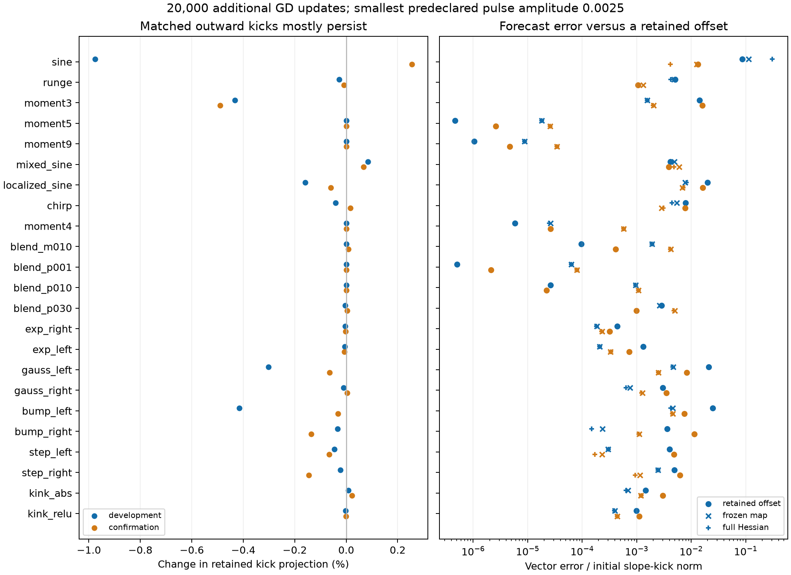

# What the coupled-feedback tests reveal

The main predictive gain is an evolving polynomial model of the effective
fine force. Once its initial force is matched to the exact checkpoint force,
it improves on a constant-force forecast in all 36 fresh-seed confirmation
cases across six targets and three widths. Median slope-motion errors are
0.876%, 0.0547% and 0.0260% as width increases. The model retains changing
readout–geometry correlations; it does not receive future training states.

The experiments narrow the explanation of slow scale acquisition. Small
outward perturbations usually persist over the tested window; they do not
quickly return to the unperturbed geometry. Changing the relative learning
rates of geometry and readouts produces predictable differences, but readouts
do not universally dominate the removal of fine error. At independently
initialized larger widths, the features remain nearly affine and the
effective force is already small. In that regime, evolving the fine residual
with a fixed sensitivity map adds little to a constant-force prediction.

These results refine the mechanism rather than establish permanent trapping.
The central object remains the coupled effective force $F=Te$: both its error
load and the sensitivities that turn that load into parameter movement can
change. The useful approximation depends on the state and width.

This report records the intervention evidence. The
[main reading note](../../../../docs/d34_coarse_balance_stagnation.md)
explains the argument, the
[mechanism theorem note](../../../../docs/d34_mechanism_rate_theorems.md)
gives the conditional results, and the
[certified instance](../../../../docs/d34_certified_instance.md)
proves a finite exclusion window for one empirical GD problem.

**Table 1. Notation shared with the acquisition theorem.**

| Symbol | Meaning |
|---|---|
| $a,b,c,d$ | Signed slopes, hidden biases, readouts, and output bias. |
| $\gamma_j=|a_j|$ | Physical slope magnitude. |
| $\lambda_j=h|a_j|$, $h=2/N_{\mathrm{ref}}$ | Normalized scale; $N_{\mathrm{ref}}$ is construction resolution. |
| $W$ | Actual neuron count, including halo neurons. |
| $F=Te$ | Effective fine gradient, including the balanced coarse contribution. |
| $r_C$ | Coarse disequilibrium gradient. |
| $R=r_C+g_\perp$ | Tracking and omitted-mode correction. |

## 1. Perturb geometry while matching its initial slope force

**Example and question.** A stable low-scale geometry should tend to restore
an outward perturbation. Simply increasing a slope also changes its initial
gradient, so that experiment confounds immediate forcing with delayed
feedback. We instead choose a direction that increases scale while leaving
the coarse output, coarse disequilibrium, and slope gradient unchanged to
first order. This tests whether the subsequent coupled response brings the
geometry back.

**Theory and design.** The direction lies in the common nullspace of the
three corresponding derivatives. The slope-gradient derivative is the actual
loss Hessian block, including residual curvature. We apply symmetric pulses
at three halved amplitudes and compare their difference with predictions
issued at the fork. A retained-offset baseline predicts that the original
perturbation simply survives. Frozen-map and full-Hessian local models test
whether their predicted feedback improves on that baseline.

**Result.** All 46 checkpoints admit an outward direction. The maximum
normalized linear constraint residual is $1.68\times10^{-13}$. Matching errors
mostly decrease by approximately four when amplitude is halved, as expected
for a quadratic remainder; the development right-Gaussian case is less
asymptotic at the tested amplitudes and is retained in the scorecard.

At the smallest amplitude, the fraction of the initial directional offset
retained after 20k additional updates is:

| Cohort | Minimum | Median | Maximum |
|---|---:|---:|---:|
| Development, 23 functions | 0.99024 | 0.99994 | 1.00084 |
| Confirmation, 23 functions | 0.99511 | 1.00000 | 1.00256 |

There is little restoration in these matched directions over this window.
That is narrower than a claim about every direction or eventual stability.
The full-Hessian forecast improves on retaining the offset in only 15/23
development and 14/23 confirmation cases. A proposed two-observable closure
fails dramatically for degree three on both seeds and also fails on some
Gaussian and bump cases. Its conditional stability theorem remains valid;
the required closure is not supported as a general empirical model.

*Figure 1. Paired responses preserve most of the imposed offset. The full
function panel is shown so that retention and model failures are not reduced
to the motivating degree-nine example. The
[summary](pulses/summary/summary.json) and
[development](pulses/analysis_development.csv) /
[confirmation](pulses/analysis_confirmation.csv) scorecards retain amplitudes,
matching errors and forecast comparisons.*

## 2. Separate geometry mobility from readout mobility

**Example and question.** Copy a neuron four times and divide its readout by
four. The represented function is identical. Under ordinary GD, each copy's
geometry now moves four times more slowly, while its aggregate readout moves
four times faster. If readouts consume the useful driving error before
geometry responds, correcting the readout rate should materially alter the
subsequent slope response.

**Theory and design.** Exact replica symmetry reduces the copied network to
the original variables with changed mobilities. For $k$ copies, uncorrected
geometry mobility is $1/k$ and aggregate-readout mobility is $k$. Compensating
either rate isolates its effect; compensating both recovers the original
trajectory. The effective map and coarse balance must be recomputed in each
branch's parameter metric. Clones retain the original normalization $h$.

**Result.** Both fully compensated branches reproduce the original trajectory
bit for bit. In development, fourfold copying reduces median slope-motion
magnitude to about 0.275 of the original. Readout-only compensation leaves
that median nearly unchanged, while geometry-only compensation raises it to
about 1.05. Readout feedback still matters for individual targets, including
changes of sign in small mean responses. The evidence does not support a
universal explanation in which readouts dominate error removal.

The effective residual model predicts the intervention contrasts well. The
strong comparison is with a constant effective-force forecast, because both
already know the initial change in mobility:

| At 20k additional updates | Development | Confirmation |
|---|---:|---:|
| Contrasts improving on no intervention effect | 136/138 | 134/138 |
| Contrasts improving on constant effective force | 111/138 | 109/138 |
| Median error / constant-force error | 0.401 | 0.454 |

The constant-force development comparison was added retrospectively; its
confirmation predictions were saved before the continuation. Evolving fine
errors adds predictive information at these late checkpoints. Adding the
larger feature-tangent model gives little additional benefit.

A separate positive-semidefinite decomposition allocates instantaneous
effective dissipation among parameter blocks. In the original mobility,
median slope shares are 66.3% and 69.3% across the two cohorts; median readout
shares are 19.7% and 14.9%. Individual readout shares range from about 4% to
96%, so the median is not a universal law. These are the nonnegative forms
$Q_\ell=T_{\mathrm{vel},\ell}^TM_\ell^{-1}T_{\mathrm{vel},\ell}$,
which sum to the effective residual matrix. Here
$T_{\mathrm{vel}}=M T_{\mathrm{grad}}$ includes the parameter mobility;
in ordinary GD, $M=I$ and both maps equal $T$ from the glossary.
The signed blocks $J_{H,\ell}T_{\mathrm{vel},\ell}$ are a different decomposition
and must not be interpreted as nonnegative dissipation shares.

The [development](splitting/development_analysis.csv) and
[confirmation](splitting/confirmation_analysis.csv) tables retain all
contrasts. The [block audit](diagnostics/psd_blocks.csv) checks positivity and
the sum identity on 450 states; discrepancies are at floating-point roundoff.

## 3. Independent width changes reveal a different timescale

**Example and question.** Copying preserves a function and its geometry.
Increasing width with a fresh initialization is a different experiment. We
train six fixed targets at construction resolutions 128, 512 and 1024,
corresponding to 177, 705 and 1409 actual neurons. Two independent seeds give
36 cases. After 20k ordinary-GD updates, we issue predictions for the next
20k updates at the same learning rate, $\eta=0.002$.

**Theory.** While every slope, hidden bias and readout remains of order
$W^{-1/2}$, subtracting the affine part of tanh leaves a cubic remainder.
After coarse balancing, the effective force per neuron is at most of order
$W^{-3/2}$ under explicit uniform parameter and conditioning assumptions.
Since $h$ is of order $W^{-1}$, the normalized acquisition rate is at most
$O(\eta W^{-5/2})$. The fine residual changes on a slower scale than the
rescaled parameters. This is a conditional bound for exact tanh, not a
fitted power law or an assumption that the sensitivity map is frozen. The
[proof](../../../../docs/d34_mechanism_rate_theorems.md#8-a-width-dependent-rate-without-freezing-the-effective-map)
states the constants and a first-exit condition that closes the parameter
regime for a finite interval.

**Prediction and result.** The checkpoint diagnostics agree with the proposed
scalings across these widths:

| Median across 12 cases at each width | $W=177$ | $W=705$ | $W=1409$ |
|---|---:|---:|---:|
| $\sqrt W\,\mathrm{RMS}(a)$ | 1.456 | 1.471 | 1.466 |
| $\sqrt W\,\mathrm{RMS}(c)$ | 1.479 | 1.491 | 1.472 |
| $W^{3/2}\,\mathrm{RMS}(F_a)$ | 0.628 | 0.695 | 0.661 |
| $W\|J_H\|_F$ | 2.621 | 2.932 | 2.845 |
| Constant-force motion error | 22.4% | 4.74% | 2.18% |
| Fixed-map, evolving-error motion error | 22.5% | 4.74% | 2.18% |

Errors refer to the full slope-displacement vector over the continuation.
The force projections through degree 65 and 129 agree to numerical precision.
The displayed Jacobian norm uses the retained basis; it is not a certified
norm for the entire complement in the theorem. Checkpoint measurements also
do not prove its interval-wide hypotheses.

Here evolving the error adds essentially no predictive gain. The estimated
residual clock over 20k updates shrinks strongly with width, consistent with
near-constant error load. Changing sensitivities can therefore be the more
important missing feedback. No neuron reaches $\lambda=0.25$ in any of these
36 trajectories through 40k updates. This measured window is not a universal
barrier, and the rate bound is not extrapolated beyond its parameter regime.

The [width scorecard](diagnostics/width_forecasts.csv),
[scaling audit](diagnostics/width_scaling.csv) and
[summary](diagnostics/width_scaling_summary.json) retain target-level results.
The targets are degree five, mixed sine, an off-center Gaussian, a compact
bump, a tanh step and an absolute-value kink. Thus this width comparison does
not depend on degree nine or a single oscillatory target.

## 4. Evolving polynomial geometry supplies the missing prediction

**Example.** At width 1409, the pure quintic model predicts most targets with
less than 0.05% relative slope-motion error, but misses degree five by about
2.1% in development. The same error is present in its initial force
approximation. Tracking is only about $2\times10^{-7}$ of the effective
slope force there. This identifies a truncation problem at the fork, rather
than evidence that a neglected coarse driver causes the miss.

**Theory and model.** Replace tanh by its cubic or quintic Taylor polynomial,
but recompute the Jacobians, residual coefficients and coarse compensation
at every predicted parameter state. This keeps the particle coupling while
discarding higher activation terms. It is not a fixed-Jacobian model, and
the target itself need not be polynomial: its fixed empirical coefficients
enter the retained modes. All slopes, hidden biases, readouts and output bias
evolve under the effective force; tracking is omitted explicitly.

The additional model uses $F_5(\theta)+F(\theta_0)-F_5(\theta_0)$.
Its constant correction makes the initial effective force exact. Its
quintic part continues to evolve. This was motivated by the measured
development truncation error and fixed before the fresh continuation.
It need not remain exactly tangent to the current coarse constraint;
the [polynomial theorem](../../../../docs/d34_polynomial_surrogate_theorem.md)
bounds the remaining force discrepancy instead of silently dropping it.

**Prospective confirmation.** Fresh seeds 32 and 33 use the same six targets,
three widths, initialization convention and learning rate. Ordinary GD
first reaches the prescribed 20k forks. All three polynomial forecasts and
the constant/frozen-map baselines are then saved before the 20k-to-40k
continuation. The final forecast manifest is dated 10:01:39 UTC; subsequent
GPU job 1282 supplies the outcomes. The polynomial fields are not retuned on
those outcomes.

| Confirmation: median vector error | $W=177$ | $W=705$ | $W=1409$ |
|---|---:|---:|---:|
| Constant exact effective force | 20.0% | 4.71% | 2.26% |
| Fixed map with evolving errors | 20.2% | 4.72% | 2.26% |
| Pure quintic | 2.86% | 0.0834% | 0.0324% |
| Quintic with exact initial force | 0.876% | 0.0547% | 0.0260% |

Pure quintic improves on constant force in 30/36 cases; degree five is the
exception at all widths. The corrected quintic improves in all 36, matching
the development counts. Its worst error at width 177 remains 12.6%, despite
the much smaller median. “Exact” in the checkpoint-force comparison means
tanh with retained degrees 2–65; the development degree-129 audit agrees to
numerical precision, without certifying the full-complement truncation.
These are confirmations across initializations of
fixed targets, not a guarantee over functions. The
[complete polynomial report](polynomial/README.md) records every target,
the cubic failures, initial-force audit, forecast hashes and source versions.

**How much residual coupling remains necessary?** A subsequent development
analysis clamps the supplied polynomial fine error at its fork value while
still evolving the sensitivities. It was not part of the fresh-seed test.
Its median errors remain close to the coupled model at widths 705 and 1409,
supporting sensitivity evolution as the main missing generic-target feedback.
Actual full-complement residual changes are at most 0.0745% and 0.0151%
there; the smallest width instead reaches 4.05%, so near-constant residual
load is a regime-specific statement.

Degree five supplies a useful qualification. At width 1409, clamping gives
0.00302–0.00335% error, while evolving its residual gives
0.0000667–0.0000723%, even though the total residual changes by only about
$10^{-8}$ relatively. Small generated-mode changes matter compared with this
weak force. Total error norm alone is an inadequate test for discarding
residual evolution. The result supports the coupled effective-force framework
while identifying when its simpler fixed-load version is adequate.

## 5. From accurate motion to a controlled acquisition envelope

**Example and theory.** A forecast can be accurate yet have a useless worst-case
error estimate. We therefore generate the frozen-effective reference from
the checkpoint and enclose ordinary GD around it. Each step charges the
reference's full-gradient defect and bounds amplification throughout its
surrounding parameter ball. Induction establishes containment; it is not
assumed from sampled future states. A per-neuron prefix maximum then bounds
every threshold crossing, including crossings at different times.

**Result and limitation.** In FP64 evaluation, all 23 late development states
exclude every neuron through 1k additional updates, 20 do so through 10k,
and 13 through 20k. Both tested degree-nine states remain enclosed through
200k. The ten failed 20k enclosures are preserved in the
[bound report](moving_tube/README.md); their failure is not observed acquisition.
The old initial-ball method closes at 20k but not 50k on the same degree-nine
states under its unchanged radius grid. Thus the moving reference improves
that comparison, without establishing a common timescale across targets.

A separate interval-arithmetic calculation certifies exact GD on the
development degree-nine dataset: all 177 neurons stay below
$\lambda=0.002973994$ through 20k additional updates. This is a genuine
rounding-controlled finite exclusion for that empirical problem, not a
certificate for the broader FP64 panel or a population-loss result. The
[certificate note](../../../../docs/d34_certified_instance.md) states the
exact data, arithmetic and intermediate-state bounds.
A second instance covers mixed sine at width 705 through 13k additional
updates, with all $\lambda_j<0.002$. Its requested 20k certificate becomes
uninformative during the following block. Both the successful prefix and the
failed extension are preserved.

The new polynomial theorems also give conditional approximation and rate
bounds. They explain why generated lower modes and target low-mode loading
lead to different clocks. Their width orders alone do not certify useful
constants at a finite width; the acquisition envelope still needs uniform
tracking, conditioning and approximation allowances.

The wider FP64 panel encloses all six seed-30 functions at widths 705 and
1409 through the next 20k updates. The distant threshold itself is an easy
test: a [generic energy baseline](../../../../docs/d34_energy_baseline.md)
also excludes it over 20k under explicit initial norm and loss conditions.
Those conditions have now been checked with outward rounding for all 18
seed-30 starting states, covering six functions at all three widths.
Their verified loss bounds strengthen the generic exclusion to 50k
additional updates; this is an analytic extension, not new training data.
Mechanism-specific progress is the accurate small-motion forecast and tight
trajectory enclosure, beyond that generic allowance. A failed moving tube
does not imply that every threshold argument fails.

## 6. Adam needs evolving moment feedback

**Example and test.** Reducing future tracking input by 10% only in Adam's
second-moment recurrence increases mean normalized scale for sine on both
seeds. The incoming moment buffers and optimizer age are preserved. This
tests an effect on the denominator even when signed tracking motion cancels;
it does not reset the optimizer or remove tracking from every parameter.

**Result.** That intervention increases mean scale in 12/13 development and
10/13 confirmation targets. The mean effects are small, and other targets
change sign across seeds. Both checkpoint-frozen and two-phase force models
lose to predicting zero intervention effect on all 39 vector contrasts in
each cohort at 20k. Repeating the initial phases therefore fails well inside
the primary window. The [Adam report](../../../../docs/d34_adam_moment_results.md)
retains all signs, magnitudes and verification checks.

These states have substantial unsigned tracking activity. Their cancellation
and second-moment response are compatible with an optimizer-state mechanism,
but the test does not identify a unique closed Adam model. The small-tracking
GD theorem cannot simply be assigned an Adam learning rate.

## Protocol and cohort definition

The original force audit covers 23 function instances. The present development
cohort uses the 13 original functions at seed 0 and the 10 additional functions
at seed 22; confirmation uses seeds 20 and 23 respectively. The pulse and
splitting GD forks are at 600,000 updates; independent-width forks are at 20,000.
These functions have already been studied: confirmation refers
to new intervention outcomes, not previously unseen target functions.

The primary observations are per-neuron normalized-scale change, its rate,
positive and negative travel, and the fraction ever reaching $\lambda=0.25$.
Loss and readout magnitude provide context; neither substitutes for acquisition.
Training remains noiseless full-batch optimization in raw physical coordinates.

**Matched pulses.** Find an outward direction in the nullspace of the coarse
output Jacobian, coarse-disequilibrium derivative, and actual slope-gradient
derivative. The latter includes residual curvature. Use symmetric positive and
negative pulses at three halved amplitudes, with matching errors checked against
their predicted orders. A numerically unresolved outward direction is a design
limitation, not evidence for stagnation. Compare retained displacement, return,
and amplification with fork-issued frozen-map and full-Hessian local-response
predictions. Both derivative matrices are fixed at the fork; the second retains
the local derivative of the changing effective map.
Anchor both predictions at each pulsed state's actual initial gradient. Small
$R$ does not imply small $DR$: retain its derivative consistently when testing
the subsequent feedback response.

**Exact splitting.** Replace each neuron by two or four identical copies with
readout $c_j/k$. Compare ordinary rates, geometry-only compensation, readout-only
compensation, and both compensations. Geometry compensation multiplies its rate
by $k$; readout compensation divides its rate by $k$. Both together reproduce
the original trajectory exactly. Main runs may use the exact replica-symmetry
quotient after verification against explicitly expanded networks. The quotient
has hidden mobility $1/k$ and aggregate-readout mobility $k$ for ordinary split
GD. Compute coarse balance in each branch's actual parameter metric. Keep the
original $h$ for clones; genuine width changes require independent networks.

**Adam histories.** At the original 13 functions' 600k Adam checkpoints, seed 0
is development and seed 1 is confirmation. Independently attenuate future slope
tracking inputs to first and second moments by factors 1 or 0.9. Preserve all
incoming moments and the update count. Square the complete modified input to
the second moment, including cross terms. Estimate both channels' two phases
from the fork and one virtual ordinary Adam update; issue periodic-driver and
constant-driver forecasts before observing intervention continuations. These
are conditional local forecasts, not a claim that only tracking oscillates.

Initial common horizons end at 20k additional updates. No endpoint is a
theoretical barrier. Any later protocol revision must identify which results
informed it; confirmation outcomes are not used silently to retune predictions.

## What would refine the theorem?

The matched offsets persist, so a useful theorem need not prove attraction
to a small-scale equilibrium. Splitting also rules out readout-dominated
depletion as a universal explanation. The strongest new predictive object
is the evolving polynomial effective field. Its approximation theorem and
[rescaled transport derivation](../../../../docs/d34_rescaled_transport_model.md)
make the readout–geometry products explicit, including a relative-energy
identity for generated-error correction. The next numerical proof should
control this evolving reference and its approximation allowances rather
than infer future persistence from a successful endpoint forecast.

Two further analytic results make that program more specific. An
[exact GD identity](../../../../docs/d34_rescaled_transport_model.md#6-an-exact-gd-diagnostic-connects-the-reduced-identity-to-the-network)
separates relative geometry/readout-energy change into fine, coarse, and
finite-step terms. A [transport action theorem](../../../../docs/d34_transport_action_bound.md)
bounds the fraction ever acquiring scale in the reduced high-mode regime
using generated-error energy. Their new diagnostic and transfer allowances
have not been numerically evaluated; neither is counted as an additional
successful experiment.

Adam remains less resolved. The second-moment intervention has a small,
frequent effect, but the imposed phases fail. Its next model must predict
force and moment evolution together. That is a specific missing closure,
not evidence that every possible feedback explanation fits the observations.

The GD premise is interval-wide small tracking, separately in direct slope force
and fine-residual forcing. The experiment does not prove entry into that regime
or persistence of this premise. Any empirical error envelope is distinguished
from a uniform, numerically certified theorem enclosure.

## Execution and evidence preservation

The eight-hour research window begins at 2026-09-23 08:18:25 UTC. New GPU use is
capped at four GPU-hours and must also fit the reconciled prior authorization.
The effective-feedback ledger records 5.204 GPU-hours; charging the older Adam
audit's 0.789 hours as well still leaves approximately four hours below ten.
Previously queued plateau GPU jobs 1025, 1036, 1038, 1040, and 1041 were cancelled
before allocation, as checked in Slurm accounting at the start of this study.
All numerical work uses Runpod Slurm; at most two GPUs may be allocated at once.

All ten new GPU allocations are complete, using **711 allocated GPU-seconds
(0.1975 GPU-hours)**, including compilation and verification inside those
allocations. The [ledger](budget.json) records each reservation and reconciled
duration. This remains below both the four-hour campaign cap and the prior
ten-hour total authorization. Enclosure and interval calculations use CPU
allocations, separately from that GPU accounting.

The combined [verification run](integration-1286.out) passes all **42 focused
tests** across the pulse, splitting, width, Adam, envelope, moving-tube, and
polynomial modules. These checks cover the changed numerical behavior;
the entire unrelated repository test suite was not rerun. Later changes
are proof exposition and evidence summaries.

Input hashes, issued forecasts, sparse states, motion accumulators, and final
analysis are retained. Dense diagnostics cover short windows; redundant
transfer archives were removed. No unique evidence was deleted for storage.
Three optional follow-ups remain unrun after automatic approval review
rejected their source uploads: an evolving Adam feedback model, a sharper
directional interval calculation, and finite-width evaluation of the analytic
rate constants. No result above depends on those extensions.
