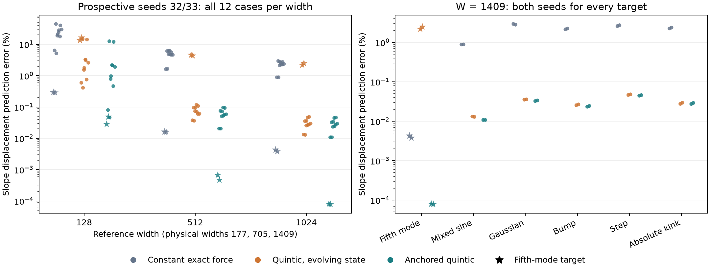

# Evolving polynomial sensitivities in the small-parameter regime

At $N_{\rm ref}=512$, an exact initial-force forecast misses the subsequent slope displacement by about 4.7%. Evolving a quintic approximation of the features reduces the median error to about 0.08%, on both development and fresh confirmation seeds. Evolving only the fine residual with the initial sensitivity matrix does not produce this improvement. These comparisons identify changing parameter sensitivities as an important missing part of the frozen model on this interval.

This is a finite-window mechanism test, not evidence that the networks acquired useful geometry or reached the predicted scale. The window is ordinary full-batch GD from update 20,000 to 40,000, with $\eta=.002$ throughout.

## Models and locked comparison

For $p=3,5$, replace each tanh feature by

$$
\tau_3(u)=u-u^3/3,\qquad \tau_5(u)=u-u^3/3+2u^5/15.
$$

The polynomial coefficients are expanded exactly with the binomial formula and transformed to polynomials orthonormal on the fixed empirical input grid. The target enters through its fixed coefficients through degree $p$. Each step evolves all slopes, biases, readouts, and the output bias. It recomputes the polynomial residual and Jacobian at its **own predicted state**, including the two-dimensional coarse projector:

$$
F_p(\theta)=\left[I-J_{C,p}^T(J_{C,p}J_{C,p}^T)^{-1}J_{C,p}\right]J_{H,p}^T e_{H,p}.
$$

The update is $\theta_{n+1}=\theta_n-\eta F_p(\theta_n)$. Coarse tracking is omitted explicitly. No input quadrature is needed during stepping. In particular, the cubic generated fine output depends only on the correlations $-\sum_j c_j a_j^2b_j$ and $-\sum_j c_j a_j^3/3$, before the empirical orthonormal transform. The coarse correction remains part of the force; these two correlations alone are not its full formula.

The anchored quintic adds one fixed, full-parameter correction:

$$
\widehat F_5(\theta)=F_5(\theta)+F_{\rm exact}(\theta_0)-F_5(\theta_0).
$$

It matches the exact effective force at the fork, with no future fit. The correction need not stay tangent to the instantaneous coarse constraint. Exact-tanh coarse-output drift is therefore reported separately.

The baselines use the exact checkpoint effective force held constant, or the exact checkpoint $T,S$ with evolving fine residual and frozen sensitivities. All models use the same step size and number of updates. The reported error is

$$
\frac{\|a_{\rm predicted}(40000)-a_{\rm GD}(40000)\|_2}
{\|a_{\rm GD}(40000)-a_{\rm GD}(20000)\|_2}.
$$

Here “exact” means the original tanh features, evaluated with the retained degree-65 fine projection. The earlier development degree-129 audit changed slope force by less than $4\times10^{-18}$. This numerical agreement is not an exact full-complement certification.

The six targets are `moment5`, `mixed_sine`, `gauss_left`, `bump_right`, `step_right`, and `kink_abs`. Each width uses independent Xavier initialization, with proportional halos: $(N_{\rm ref},W)=(128,177),(512,705),(1024,1409)$. Seeds 30/31 are retrospective development; seeds 32/33 are prospective confirmation. Each cohort contains all 36 target/seed/width cases, without selecting favorable forks.

## Both cohorts

Median errors below are percentages of the observed slope-vector displacement.

| Cohort | $N_{\rm ref}$ | Constant exact force | Frozen $T,S$ | Cubic | Quintic | Anchored quintic |
|---|---:|---:|---:|---:|---:|---:|
| Development | 128 | 22.404 | 22.533 | 28.409 | 3.028 | 0.877 |
| Development | 512 | 4.739 | 4.742 | 2.325 | 0.0820 | 0.0597 |
| Development | 1024 | 2.184 | 2.184 | 0.993 | 0.0309 | 0.0243 |
| Confirmation | 128 | 19.996 | 20.232 | 25.529 | 2.856 | 0.876 |
| Confirmation | 512 | 4.714 | 4.717 | 2.296 | 0.0834 | 0.0547 |
| Confirmation | 1024 | 2.257 | 2.257 | 1.014 | 0.0324 | 0.0260 |

The [PDF figure](confirmation/forecast_errors.pdf) is also available for export.

Pure quintic beats the constant-force baseline in 30/36 cases in each cohort. Every miss is `moment5`, at both seeds and all three widths. Anchored quintic beats it in all 36 cases in each cohort. This is confirmation across new seeds of the same target families, not a test on unseen functions.

Cubic is insufficient more broadly. At widths 512 and 1024 its misses in both cohorts are `moment5` and `mixed_sine`, at both seeds. At width 128 the development misses are both seeds of `moment5`, `mixed_sine`, `gauss_left`, and `step_right`. Confirmation misses are both seeds of `moment5`, `mixed_sine`, and `step_right`, plus `gauss_left/32` and `bump_right/33`. All casewise errors and miss lists are retained in [development scores](retrospective/scores.csv), [development summary](retrospective/summary.json), [confirmation scores](confirmation/scores.csv), and [confirmation summary](confirmation/summary.json).

The largest anchored error remains substantial at width 128: 11.97% in development and 12.56% in confirmation. The largest exact-tanh coarse drift in confirmation is $2.81\times10^{-3}$, $1.43\times10^{-7}$, and $1.01\times10^{-8}$ across the three widths. These are observed diagnostics, not preservation guarantees.

## Why the fifth-mode target is an exception

The development [initial-force audit](retrospective/force_audit.csv) locates the pure-quintic discrepancy before any surrogate evolution. For `moment5`, initial slope-force errors are 12.43–12.75%, 4.90–5.48%, and 2.05–2.14% across widths. They closely match its finite-window motion errors. The omitted tracking-force ratios are only approximately $10^{-5}$, $10^{-6}$, and $10^{-7}$.

The anchored model removes this initial discrepancy. Its development `moment5` motion errors become 0.0227–0.0356%, 0.000542–0.000596%, and 0.0000667–0.0000723%. Thus initial polynomial truncation, rather than a large neglected tracking force, explains this particular pure-quintic miss. It does not follow that all future higher-order corrections remain constant; the anchored model tests that approximation over this window.

## Does the fine residual need to evolve?

A secondary retrospective intervention holds the polynomial fine residual fixed at the fork while evolving its Jacobian and coarse projector, with the same initial exact-force correction. This isolates geometry feedback from residual feedback within the surrogate.

| $N_{\rm ref}$ | Own-residual anchored median error | Clamped-residual median error | Maximum actual full-complement residual change |
|---:|---:|---:|---:|
| 128 | 0.8771% | 0.6902% | 4.0544% |
| 512 | 0.05966% | 0.06156% | 0.07445% |
| 1024 | 0.02425% | 0.02491% | 0.01510% |

The last column measures the actual GD residual change $\|e_H(40000)-e_H(20000)\|/\|e_H(20000)\|$ in the full empirical complement. It is distinct from the earlier frozen-$S$ forecast. Degree-65 values and the individual initial, final, and signed changes of modes 2–5 are also saved in the [clamped diagnostic](clamped_retrospective/scores.csv).

Keeping the residual fixed captures most of the improvement at larger widths. The smaller width's improved median can involve error cancellation and is not a general advantage of clamping. Nor does a small total residual change make every active mode irrelevant. For `moment5` at width 1024, the total residual changes by only about $10^{-8}$, but clamping raises motion error from 0.0000667–0.0000723% to 0.00302–0.00335%. The generated lower-mode errors remain relevant to finer prediction even while the dominant fifth-mode error barely changes.

Clamping beats own-residual evolution in 8/12, 0/12, and 2/12 cases across widths. At width 128 it loses on both seeds of `moment5` and `mixed_sine`; at width 512 it loses on every target/seed; at width 1024 its only wins are the two Gaussian cases. The [clamp scorecard](clamped_retrospective/summary.json) preserves these counts and all misses.

The supported interpretation is therefore conditional: in these wide, small-parameter windows, changing sensitivities explains most of the constant-force model's error; weak target loads require an accurate initial force, and residual feedback can still matter below that leading correction. This does not establish indefinite stagnation or replace the coupled model by a universal constant-residual law.

## Timing, verification, and reproduction

Fresh burn-in job 1273 completed all 36 cases at update 20,000. CPU job 1275 issued all three fixed surrogate candidates and the constant/frozen baselines; the last width manifest is timestamped **2026-09-23 10:01:39 UTC**. Only afterward was continuation job 1282 submitted. The two GPU jobs used 50 and 60 GPU-seconds respectively. There were no nonfinite training cases or observed $\lambda\ge .25$ hits in these fresh windows. The clamped variant is labeled a retrospective secondary diagnostic and did not replace any prospective prediction.

Five focused CPU tests passed in job 1283: analytic polynomial coefficients/Jacobians against autodiff, direct empirical Schur projection, force convergence under uniform parameter rescaling, exact initial force for anchoring, and equality of clamped/own-residual force at the fork. An earlier test-only failure came from an unnecessary 100-fold accuracy assertion; the observed quintic improvement was 57-fold and the convergence-order checks passed. That arbitrary factor was removed before real-checkpoint predictions were evaluated.

The [kernel](../../../../../experiments/expD34_readout_race/mechanism_polynomial.py), [anchor](../../../../../experiments/expD34_readout_race/mechanism_polynomial_anchor.py), [prediction-only confirmation helper](../../../../../experiments/expD34_readout_race/mechanism_polynomial_confirmation.py), [force audit](../../../../../experiments/expD34_readout_race/mechanism_polynomial_force_audit.py), [clamp diagnostic](../../../../../experiments/expD34_readout_race/mechanism_polynomial_clamp.py), and [analysis](../../../../../experiments/expD34_readout_race/mechanism_polynomial_analysis.py) are separate from the unchanged ordinary-GD runner. Manifests preserve source and input hashes. Confirmation inputs, issued predictions, baseline arrays, start/end checkpoints, and run statuses are local; full intermediate trajectories remain on the remote campaign storage. Development start/end checkpoints are in the sibling [width evidence](../widths/).
