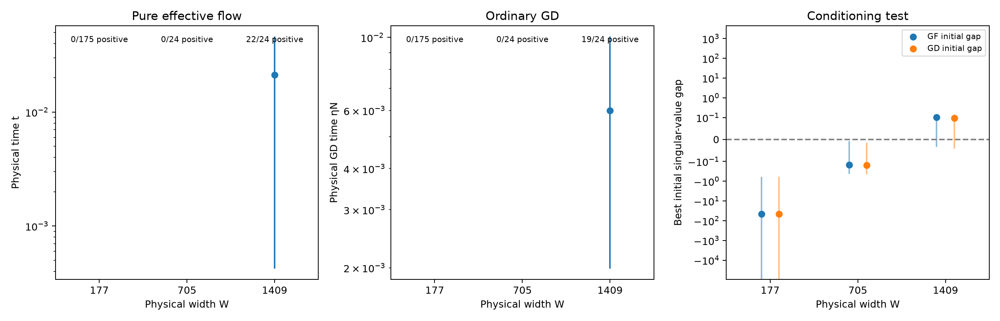

# A complete persistence proof, with an unsuccessful long-horizon bound

The new theorems prove finite-time persistence for the exact tanh effective
fine flow and for ordinary GD. They permit mixed signs and nonzero hidden
biases, and derive conditioning and tracking control from initial data.
Their present constants do **not** explain the long observed slowdown.
On the fixed 223-state panel, the primary GD bound reaches at most five
updates. A separately proved refinement reaches at most 38. These are
limits of sufficient bounds, not predicted acquisition or escape times.

**Notation and evaluation terms.**

| Symbol or term | Meaning |
|---|---|
| $W$, $h$, $\lambda=h|a|$ | Physical neuron count, construction spacing, and normalized slope scale. |
| $F$, $z$ | Full effective fine gradient and coarse disequilibrium; GD uses $F+J_C^Tz$. |
| $M$, $E_s$, $R$ | Rescaled total second moment, slope–readout second moment, and outer particle radius. |
| Admitted region | At least one declared radius choice passes the initial theorem conditions. |
| Valid horizon | Number of updates before a sufficient recurrence condition fails, evaluated in FP64. |
| Primary / refined | Uniform regional-speed recurrence / recurrence propagating the initial force. |

Read the [exact-flow proof](../../../../docs/d34_moment_persistence_theorem.md)
for the structural argument and the
[GD proof](../../../../docs/d34_moment_persistence_gd.md)
for tracking, update segments, and the refinement. The
[protocol](PROTOCOL.md) records the primary evaluation and the subsequent
refinement separately. All numbers here are FP64 evaluations, not
rounding-controlled numerical certificates.

## 1. What the proof adds

**Example.** Opposite readout–slope products can cancel while the sum of
their squares remains substantial. The earlier aligned-sector theorem
excluded every archived checkpoint. The new proof uses the nonnegative
slope–readout moment instead of requiring signed alignment.

**Argument.** Write $X_j=\sqrt W(a_j,b_j,c_j)$ and
$E_s=\mathbb E_W(\alpha_j^2+\zeta_j^2)$. Removing the constant and linear
outputs makes the raw fine gradient small in the nearly affine region.
The coarse compensation is an orthogonal projection and cannot enlarge
its full norm. These two facts control the growth of the total particle
moment and the decline of $E_s$. The latter bounds coarse conditioning.
An explicit first-exit test then closes support, moment, and force-growth
bounds together.

For effective flow, the resulting force bound has the form

$$
\|F(t)\|\le\|F(0)\|\exp(L_*t/W)
$$

on the proved interval. Ordinary GD has a coupled scalar recurrence for
force, coarse disequilibrium, moments, and support. It contains every
straight update segment and proves total-loss descent; it does not assume
that GD decreases fine loss. Neither result assumes a small future force
or a future tracking history. Both
work directly with tanh, so there is no polynomial trajectory replacement.

**Prediction.** If the initial-data conditions persist for long enough,
the integrated force bounds the fraction of neuron labels ever attaining
$\lambda=h|a|=0.25$. Outward motion is allowed. Permanent trapping,
universal contraction, and entry into the regime from initialization are
not conclusions. The audit asks whether the proved duration is useful.

## 2. The fixed-panel result

We retained all 223 distinct checkpoints from the population inventory,
covering 23 target instances. Every checkpoint had usable initial data and
explicit learning-rate metadata. The separate longitudinal panel contains
40 natural GD continuations and 320 snapshots, including six targets at
three widths and two seeds, plus four late starts. No new training ran.
The wide panel alone therefore does not establish coverage of all 23 targets.

For every state we tried exactly the seven declared radius multipliers.
The best horizon was selected using initial data alone. The primary and
refined GD results are:

**Applicability by physical width, over all declared radius choices.**

| Physical width $W$ | States | States passing an initial region test | States with positive primary GD horizon | States with positive refined GD horizon | Largest primary / refined horizon |
|---|---:|---:|---:|---:|---:|
| 177 | 175 | 0 | 0 | 0 | 0 / 0 updates |
| 705 | 24 | 0 | 0 | 0 | 0 / 0 updates |
| 1409 | 24 | 22 | 19 | 22 | 5 / 38 updates |

At width 1409, including the two rejected cases, the median bound is
2 updates for the primary recurrence and 18.5 for the refinement. All
201 rejected initial states fail the conservative conditioning test.
For admitted states, support is the first failed recurrence condition;
the step-size tests pass. No admitted interval reaches the available
20,000-update comparison horizon.

The effective-flow theorem admits the same 22 states. Its largest physical
time is $t=0.0451652$. At $\eta=0.002$ this is about 22.6 update-times,
but that conversion is **not** an ordinary-GD guarantee. The independently
proved GD recurrence is what supports the update counts above.

<figure>
  
  <figcaption>Primary bounds by physical width. Points show medians and bars
  show ranges among positive horizons; annotations retain the rejected states.
  The right panel uses a symmetric logarithmic axis and requires a positive
  gap. Pure-flow time and ordinary-GD time are distinct guarantees.</figcaption>
</figure>

The [primary tables](evaluation/manifest.json) and
[refined tables](force_coupled/manifest.json) retain all margins and source
hashes. Their [primary summary](summary/summary.json) and
[refined summary](force_coupled_summary/summary.json) include every selected
state, width, target, and failure count. An absent failure CSV means that
its explicitly recorded failure count is zero.

## 3. Why the refinement helps, and why it is still insufficient

**Example.** A checkpoint can have a tiny effective force while the uniform
force allowance over its entire region is large. Charging tracking for the
uniform allowance can generate a large upper bound on disequilibrium after
only a few updates, even though observed disequilibrium stays small.

**Argument.** The refinement propagates $u_0=\|F_0\|$ and bounds the next
step's speed by $u_n+J\overline z_n$. This speed drives the tracking and
moment recurrences. The region still has to contain the full outgoing
segment before derivative estimates are used. Thus the refinement uses
the initial small force without assuming that it stays small. Its proof
is Section 6 of the GD companion.

**Outcome.** The largest interval increases from 5 to 38 updates, with
all 22 admitted states now receiving a positive bound. This is insufficient
for a practical acquisition-delay claim. It identifies a real loss in the
primary estimate, but does not solve persistence.

Two remaining losses are visible in the formulas. First, conditioning uses
an affine lower bound minus a uniform remainder $3R^3/W$. Failure of this
test does not mean the exact coarse Gram matrix is singular. Second,
tracking and force amplification use unsigned regional derivative norms.
These discard the signed cancellations and direction of the effective
motion. The refined envelope can still grow much faster than the observed
force. Increasing the precision of the same scalar calculation would not
resolve either loss.

## 4. What the trajectories actually show

**Example.** At width 1409, over 20,000 additional GD updates, the median
full effective-force norm increases by only 1.43%; its largest increase
is 4.45%. The moment and conditioning changes are similarly small. These
endpoints lie far beyond the proved intervals, so they are evidence for
the mechanism to explain, not validations of an extended bound.

**Observed change after 20,000 additional GD updates, across all twelve
natural paths at each width, independently of theorem applicability.**

| Quantity, endpoint / initial | Width 705: median [range], 12 paths | Width 1409: median [range], 12 paths |
|---|---|---|
| Full effective-force norm | 1.03760 [0.97372, 1.10839] | 1.01426 [0.98383, 1.04453] |
| Total particle second moment | 1.00280 [0.99759, 1.01070] | 1.00117 [0.99790, 1.00433] |
| Slope–readout second moment | 1.00341 [0.99623, 1.01365] | 1.00132 [0.99692, 1.00563] |
| Exact coarse minimum eigenvalue | 1.00270 [0.99643, 1.01300] | 1.00100 [0.99695, 1.00533] |

The width-177 panel changes more: its 16 endpoint force ratios range from
0.913 to 3.132, and support can almost double. We retain these cases rather
than describe slow relative reinforcement as universal. Neither moderate
force growth nor lower fitting error establishes useful learned geometry.

**What was checked within the bounds.** The primary recurrence covers
17 positive-time saved states; the refinement covers 30. Every reported
positive-time support, moment, conditioning, tracking, force, and
accumulated slope-travel comparison has nonnegative slack. Four initial
moment comparisons have slack $-8.88\times10^{-16}$ from squaring rounded
square roots; these are retained explicitly. This checks implementation
consistency on short windows. It does not certify the intervening FP64
calculations or validate the theorem for 20,000 updates.

## 5. The next proof should preserve the signed feedback

The useful result is a noncircular proof structure: initial moments imply
structural persistence, which implies bounded force reinforcement, which
implies an acquisition budget. The present regional estimates are too
coarse to make that chain useful on these trajectories. No informative
long interval was selected for outward-rounded certification.

The next theorem should retain the exact signed force-energy identity
already derived in the [state-dependent note](../../../../docs/d34_state_dependent_persistence.md#2-exact-mechanism-relaxation-competes-with-loaded-geometry).
With $F$ the effective fine gradient and $\ell$ its coarse compensation,

$$
\frac{d}{dt}\frac12\|F\|^2
=-\underbrace{\|J_HF\|^2}_{\text{residual relaxation}}
-\underbrace{\left(
 \langle e_H,D^2e_H[F,F]\rangle
-\langle\ell,D^2e_C[F,F]\rangle\right)}_{\text{signed curvature of the compensated fine force}}
$$

along pure effective flow. The compensation term remains even at zero
coarse disequilibrium. Small tracking therefore does not eliminate the
coupled geometry mechanism.

A concrete next proof target is a lower bound on the sum of these two
terms, divided by $\|F\|^2$, on a dynamically preserved moment region.
It may allow weak amplification; strong restoration is unnecessary.
The condition must follow from signed residual and parameter moments,
not from assuming a future small force or fitting its observed growth.
The new moment argument supplies a way to close such a region, while
the existing identity identifies the directional quantity to control.

There are two distinct calculations to pursue. Improve the coarse Gram
lower bound using the actual second moments and anisotropy, so admission
does not fail before dynamics begin. Then bound the signed curvature and
tracking response on that region, rather than the largest response in
every parameter direction. Both require a proof of regional validity.
Computing favorable directional values only on saved states is a diagnostic,
not that proof. Additional long training runs are not the missing ingredient
identified by this audit.

## Reproduction and verification

The evaluator is
[`moment_persistence.py`](../../../../experiments/expD34_readout_race/moment_persistence.py);
the summary helper produces only JSON and a figure. The report is written
directly from the inspected artifacts. Run the evaluator with `--base` and
a new `--output` directory; add `--force-coupled` for the separate refinement.
Input manifests verify archive pairing and hashes. Source hashes and the
recurrence variant are retained with each evaluation.

CPU-only Slurm jobs 1334–1337 ran verification, the two audits, and summaries.
The final focused suite passed 28 tests, including independent field and
derivative checks and a mixed-sign, nonzero-bias GD segment check. No GPU
time or new optimization traces were used. The local proof/evaluator
commits are `379c558`, `c57b721`, and `20222f2`; later report changes do not
alter those recorded evaluator versions.
