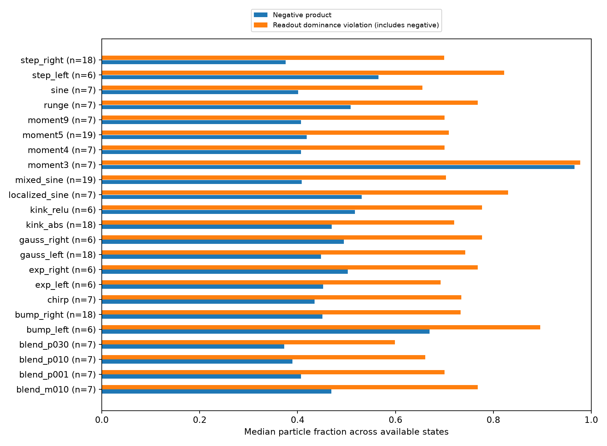
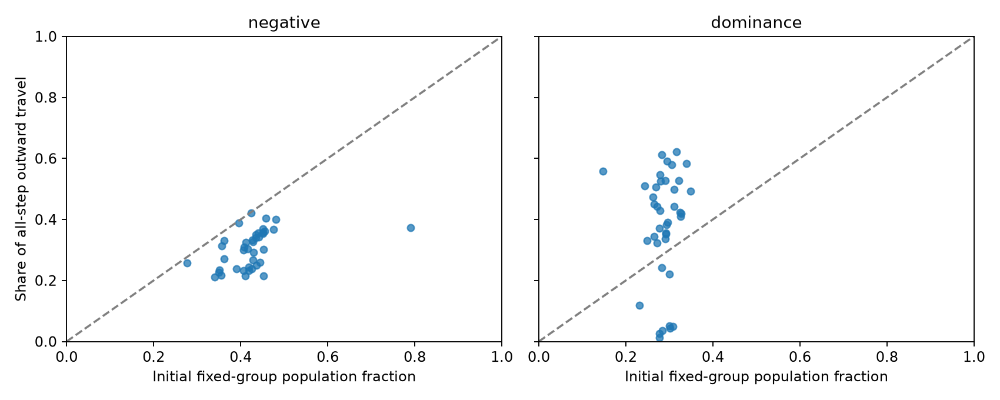
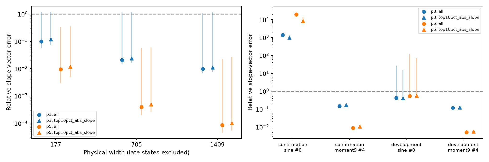

# Which population mechanism survives the empirical audit?

The coupled effective fine force remains the right object to study. The new
aligned-sector theorem, however, does **not** directly cover the archived
training states: none of 223 distinct checkpoints satisfies its alignment
condition, and every checkpoint has nonzero hidden biases. These violations
are substantial in the rescaled variables. Treating them as rare exceptions
would exclude much of the population and much of its outward motion.

The useful positive result is that the **full heterogeneous quintic model**,
which retains those signs and biases, accurately reconstructs the slope force
in the wide-network panel. Its median relative errors are 0.0396% at physical
width 705 and 0.00863% at width 1409. Thus the audit distinguishes an overly
restrictive structural theorem from a useful approximation of the dynamics.
Late sine supplies a separate warning: some states also leave the polynomial
approximation's useful regime.

The next proof should explain slow evolution of the mixed moments governing
fine-error correction and shared coarse compensation. It should allow
outward motion and weak reinforcement. This report establishes why that is
the appropriate extension; it does not yet prove preservation of such a
moment region or certify a new acquisition horizon.

## 1. Coverage: the missing structure is not a small perturbation

Consider a wide network that barely changes its slope scales over 20,000
updates. It is tempting to picture an aligned population whose largest
slopes are held back by correction of generated error. In the actual width
1409 continuations, roughly 72% of particles violate the theorem's initial
readout-dominance condition. Slowness therefore needs an explanation that
includes those particles.

The [protocol](PROTOCOL.md) fixes three retrospective checks: structural
coverage, attribution of actual motion and shared compensation, and
polynomial-force accuracy at the same states. The data comprise:

- **223 distinct static checkpoints across 23 target instances**, including
  the existing development/confirmation archives, cross-function checkpoints
  at 100k/400k/600k, and the width panels. Exact duplicates are removed.
- **40 natural-GD continuations**, each with eight saved horizons through
  20,000 additional updates: 36 width-panel cases and four later sine/degree-nine
  cases. The width panel has six targets, two seeds, and three widths.
- **320 trajectory states**, with exact full-complement force evaluations,
  fixed-group attribution, and cubic/quintic comparisons. The saved counters
  record every update's travel, not just travel between the eight snapshots.

The six width-panel targets are `moment5`, `mixed_sine`, `gauss_left`,
`bump_right`, `step_right`, and `kink_abs`. The broader static panel also
includes low-degree polynomial targets, target blends, oscillatory and
localized functions, left/right bumps, exponentials, steps, and kinks.
These are existing, unevenly sampled target families. This audit is neither
a new held-out experiment nor 223 independent tests of target generalization.

We use $X_j=(\alpha_j,\beta_j,\zeta_j)=\sqrt W(a_j,b_j,c_j)$ and
$\lambda_j=h|a_j|$, where $h=2/N_{\rm ref}$. Physical width and construction
resolution are distinct: $(N_{\rm ref},W)=(128,177),(512,705),(1024,1409)$.
Before testing parity, we subtract the target mean and shift the output bias
by the same amount, an exact residual-preserving symmetry. Neuron sign
symmetry makes $\alpha_j\ge0$; a common output/target sign reversal makes
$p=\mathbb E_W\alpha\zeta\ge0$. Neither symmetry removes mixed product signs.

The theorem requires $\zeta_j\ge\alpha_j\ge0$ and zero hidden biases, as well
as its target-loading conditions. The audit finds:

| Diagnostic across 223 checkpoints | Minimum | Median | Maximum |
|---|---:|---:|---:|
| Fraction with negative slope–readout product | 23.7% | 44.6% | 97.7% |
| Negative-product share of absolute product mass | 5.80% | 28.8% | 49.5% |
| Fraction violating $\zeta\ge\alpha$; includes negative products | 50.8% | 73.1% | 98.3% |
| Rescaled hidden-bias RMS | 1.338 | 1.465 | 5.408 |
| RMS distance to the nearest alignment sector, including bias | 1.572 | 1.769 | 10.564 |

The distance allows both neuron orientations and includes centered output
bias; it does not impose preservation of $p$ on the projected reference.
Even this unconstrained nearest distance is substantial. Median distances
at widths 705 and 1409 are 1.705 and 1.714: increasing width does not make
these states approach the proposed sector in rescaled coordinates.

Each bar is a median over the available checkpoints for one target; the
label gives its checkpoint count. The orange fraction includes the blue
fraction. The failure spans the target panel rather than being peculiar to
degree nine or sine. Values and provenance are in
[static.csv](evidence/structural/static.csv) and its
[manifest](evidence/structural/manifest.json).

**Theoretical consequence.** The
[population theorem](../../../../docs/d34_population_persistence_theorem.md)
remains a proved sufficient example. A favorable cubic sign or fifth-load
margin cannot rescue its application outside the sector: its boundary signs
and moment inequalities also use alignment and parity. We therefore did not
select an aligned reference and report a misleading numerical certificate.

## 2. Motion: violating particles are part of the mechanism

At width 1409, the violating groups account for a median 70.2% of all outward
scale travel during the continuation. Yet their contribution through the
shared compensation need not point outward. This separates two questions:
which particles move, and how their gradients influence everyone else.

We freeze three disjoint classes at each fork: negative product; nonnegative
product with insufficient readout magnitude; and compliant. The labels stay
fixed as the particles move. For a neuron, outward travel is
$\sum_n[\lambda_j(n+1)-\lambda_j(n)]_+$, including every update. The union
statistics below are computed per case before taking medians.

| Physical width | Violating population fraction | Violating share of outward travel | Negative-product share of outward travel |
|---|---:|---:|---:|
| 177 | 69.8% | 82.1% | 32.8% |
| 705 | 71.2% | 71.9% | 29.7% |
| 1409 | 71.5% | 70.2% | 28.1% |

Each row summarizes 12 cases. These are fractions of the motion that occurs,
not evidence of successful scale acquisition. For example, at width 1409
the median change in the population maximum of $\lambda$ is only
$4.18\times10^{-6}$, and the largest change across the 12 cases is
$9.43\times10^{-6}$. Some maxima decrease. Neither universal contraction nor
a stationary population describes the panel.

Each point is one of the 40 continuations. The diagonal means equal shares
of population and outward travel. Here `dominance` means only the second,
nonnegative-product class, unlike the inclusive orange bars in Section 1.
The [case table](evidence/summary/case_mechanisms.csv) retains all classes,
signed effective/tracking travel, and endpoint changes.

To attribute compensation, write the exact gradient decomposition as

$$
g_H=J_H^Te_H,\qquad K=J_CJ_C^T,\qquad
\ell=K^{-1}J_Cg_H,\qquad
F=g_H-J_C^T\ell,\qquad
R=J_C^T(e_C+\ell).
$$

The full learning velocity is $-(F+R)$. The term $J_C^T\ell$ compensates
the raw fine gradient so that $J_CF=0$; it remains present when tracking
disequilibrium $R$ is negligible. For source class $G$, we compute
$\ell_G=K^{-1}J_C(g_H)_G$ using the **full population's** $K$. Its slope
velocity contribution, $+J_{C,a}^T\ell_G$, acts on every receiver class.
This is an additive attribution at the observed state, not an ablation or
a forecast of what would happen after removing neurons.

At width 705, the violating classes' combined signed compensation on the
largest 10% of slopes has the opposite sign from the net signed fine
velocity on that tail in all 12 cases, at both endpoints. The median ratio
is $-0.174$ initially and $-0.161$ finally. Thus the same groups that carry
most of the outward travel can provide a shared contribution opposing the
net tail motion. The signs are less uniform at width 1409. A replacement
theorem cannot simply label all misaligned particles as an outward defect.

The moments show why their correlations matter. For `mixed_sine`, seed 32,
width 1409, the initial contributions are:

| Fixed class | $\mathbb E_W[\alpha\zeta\,1_G]$ | $\mathbb E_W[\zeta\alpha^3\,1_G]$ |
|---|---:|---:|
| Negative product | $-0.476$ | $-1.095$ |
| Nonnegative, insufficient readout | $0.617$ | $3.016$ |
| Compliant | $0.569$ | $1.747$ |

The noncompliant positive class contributes most of the signed cubic moment
in this example. Higher slope powers reweight the same population differently
from the coarse coefficient. These moments are useful structural variables;
with nonzero biases they are not, by themselves, a complete force formula.
All initial/final class moments and sign conventions are retained. In the
late development sine continuation the global normalization sign changes,
so its canonical moment changes should not be read as physical sign changes
without undoing that normalization.

**Theoretical consequence.** Retain signed moments and their contribution to
the shared projector. The evidence does not justify either a rare-exception
theorem or a universal contraction claim. Signed source contributions add;
their separate positive parts do not. Ratios of signed aggregates can also
be large when the net aggregate nearly cancels, and are not amplification
rates or particlewise absolute-force budgets.

## 3. Approximation: the fuller coupled model survives at wide states

At width 1409 the exact alignment theorem misses every static state, while
the full quintic force has a median error below one hundredth of a percent
along the tested continuations. The simplifying step supported here is the
local polynomial approximation of tanh, with the heterogeneous population
left intact.

For degree $r=3,5$, we evaluate the projected polynomial-network field
$F_r$ at each **actual GD state**, using all slopes, biases, and readouts.
We compare it with the original tanh force $F$, evaluated in the full
empirical complement of constant and linear functions. No initial anchoring
or fitted correction is applied. The error is
$\|(F_r-F)_a\|_2/\|F_a\|_2$. The regular panel starts at update 20,000,
ends at 40,000, and uses $\eta=.002$.

| Physical width | Cubic median error | Quintic median error | Quintic worst error | Quintic median error on largest 10% of slopes |
|---|---:|---:|---:|---:|
| 177 | 9.89% | 0.950% | 32.8% | 1.183% |
| 705 | 2.07% | 0.0396% | 5.48% | 0.0498% |
| 1409 | 0.978% | 0.00863% | 2.18% | 0.0101% |

Each width has 96 sampled states: 12 cases and eight horizons. These are
descriptive medians and maxima, not certified regional error envelopes.
Tracking remains small: median $\|R_a\|/\|F_a\|$ is 0.234%, 0.0540%, and
0.0245% across the three widths; the corresponding maxima are 0.772%,
0.100%, and 0.0448%. Failure of alignment therefore does not reinstate
coarse disequilibrium as the principal slope driver in this panel.

Points show medians; vertical segments show full ranges. The right panel
keeps the four late cases visible rather than pooling them with the width
panel. Late degree-nine quintic errors for the full slope vector remain
below 0.90%. Late sine seed 0
has median relative error 0.536 and maximum 113; seed 20 has median error
about $1.90\times10^4$. These last numbers are ratios, not percentages.
They rule out applying the polynomial approximation indiscriminately to
late sine. They do not invalidate the exact effective-force decomposition.

This audit reconstructs force at supplied states. The existing
[polynomial evolution experiment](../mechanism_refinement/polynomial/README.md)
provides the separate evidence for forecasting from a model's own evolving
state: on its confirmation panel, quintic median motion error was 0.0834%
at $W=705$ and 0.0324% at $W=1409$. Its fifth-mode misses and the improvement
from initial anchoring remain relevant. We have not upgraded these finite
windows into a future guarantee merely by recomputing the force accurately.

## 4. The next theorem: preserve mixed moments long enough for slow passage

The width-1409 example in Section 2 has a positive coarse coefficient built
from sizable positive and negative contributions. A theory based only on
that coefficient discards the information that sets the cubic force. Hidden
biases add another generated mode. A principled next reduction should keep
these quantities explicitly.

Define mixed moments $M_{ijk}=\mathbb E_W[\alpha^i\beta^j\zeta^k]$.
The full quintic network has the exact polynomial output

$$
f_5(x)=d+M_{011}+xM_{101}
-\frac{1}{3W}\sum_{r=0}^3\binom3r M_{r,3-r,1}x^r
+\frac{2}{15W^2}\sum_{r=0}^5\binom5r M_{r,5-r,1}x^r.
$$

After projection away from the coarse functions, the cubic contribution
contains $-M_{211}x^2/W-M_{301}x^3/(3W)$ before applying that projection.
This explicitly retains generated quadratic error, signed cubic error, and
their coupling to the population. The modal Jacobians and their Gram matrix
bring in further mixed moments. They must evolve together with the readouts;
there is no justification for freezing them or assuming their signs.

The proof target has two distinct obligations. First, construct a region
of mixed moments, bounded support, and coarse conditioning, and show from
the coupled equations that it persists for a useful finite interval.
Second, bound force reinforcement on that region. In the notation of the
[exact persistence identity](../../../../docs/d34_state_dependent_persistence.md#2-exact-mechanism-relaxation-competes-with-loaded-geometry),

$$
\frac{d}{dt}\frac{\|F\|^2}{2}
=-\mathcal D-\mathcal C-F^TDF[R].
$$

An informative structural estimate would be

$$
\mathcal D+\mathcal C+F^TDF[R]
\ge-\frac{A_*}{W}\|F\|^2,
$$

with $A_*$ derived from that persistent moment region. It permits positive
reinforcement. On the accessible-loading clock $\tau=t/W$, it yields
$\|F(t)\|\le\|F(0)\|e^{A_*\tau}$. Integrating this velocity and the
separately controlled tracking term then bounds slope travel and the
fraction ever reaching a chosen $\lambda_*$. Targets with vanishing leading
loadings can have slower clocks, but a $W^2$ clock should not be imposed
across all targets.

A bounded $A_*$ alone gives a comparison on physical times of order $W$.
A practically long delay still requires control of its size, the initial
force, and the lifetime of the moment region; the width factor by itself
does not establish the desired training horizon.

The last implication is already understood. **The new work is to derive
the persistent moment region and its reinforcement estimate**, instead of
assuming that the fine force stays small. For a polynomial vector field,
differentiating a moment generally introduces higher moments; writing down
a short moment list does not close the system. Higher moments need explicit
support bounds, inequalities, or additional evolution equations. Transfer
back to tanh also requires control of the relevant derivatives, not just
the pointwise force errors measured here.

This gives the next calculation a definite success criterion: find initial
mixed-moment conditions that include the audited wide states, prove their
finite-time preservation, and obtain a nonvacuous travel bound. Failure of
a proposed moment inequality should identify a missing correlation or
support condition. Late sine should be treated through the exact tanh field
or a separately justified approximation. This round supplies no new Adam
verification or theorem for its preconditioned dynamics.

## 5. Verification and retained evidence

Fifteen focused FP64 tests passed in CPU Slurm job 1332. They check sign and
constant-shift symmetries, nearest projection onto both cone orientations,
loading signs/margins, exact gradient reconstruction, polynomial fields,
zero-slope radial derivatives, and additive source/moment reconstruction.
There were no missing inputs, missing snapshots, failed trajectory states,
or failed force solves in the final audit.

Across all 320 states, the maximum discrepancy between signed force-channel
travel plus crossings and positive-minus-negative travel was below
$2.81\times10^{-17}$; endpoint reconstruction differed by at most
$2.17\times10^{-18}$. Group positive-travel sums differed by at most
$5.43\times10^{-20}$. Compensation reconstruction, including the tiny
output-bias contribution, differed by at most $6.94\times10^{-18}$.
The source-based signed summaries omit that theoretically zero bias term;
the underlying attribution rows retain its numerical residual.

The [structural helper](../../../../experiments/expD34_readout_race/population_coverage.py),
[force helper](../../../../experiments/expD34_readout_race/population_reduced_audit.py),
and [summary helper](../../../../experiments/expD34_readout_race/population_coverage_summary.py)
produce numerical evidence only. The complete
[summary](evidence/summary/summary.json),
[trajectory rows](evidence/structural/paths.csv),
[class attribution](evidence/structural/classes.csv),
[force comparisons](evidence/reduced/reduced_fields.csv),
[force manifest](evidence/reduced/manifest.json), and
[test/analysis log](evidence/population-final-1332.out) are retained locally.
Manifests include input and source hashes, duplicate provenance, and the
explicit $N_{\rm ref}=128$ metadata for the two older uploaded archives.

All computation in this round used CPU Slurm allocations; GPU usage was
zero; [job accounting](evidence/job-accounting.txt) is retained. No training
or long optimization traces were created. Superseded audit-output copies
were removed after checking the final artifacts; source checkpoints remain.
One summary job
failed because the numerical environment lacked matplotlib; using the
existing plotting environment resolved it without changing numerical code.
The PI packet remains deferred.
