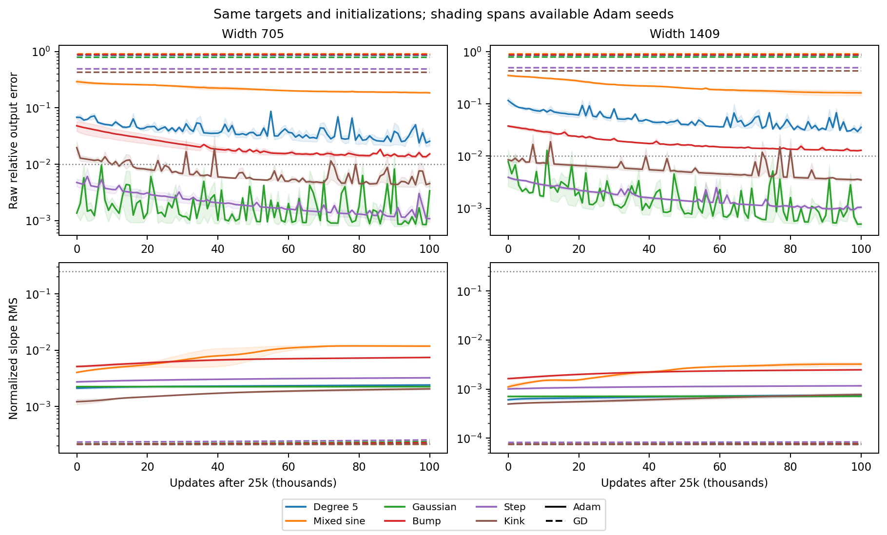
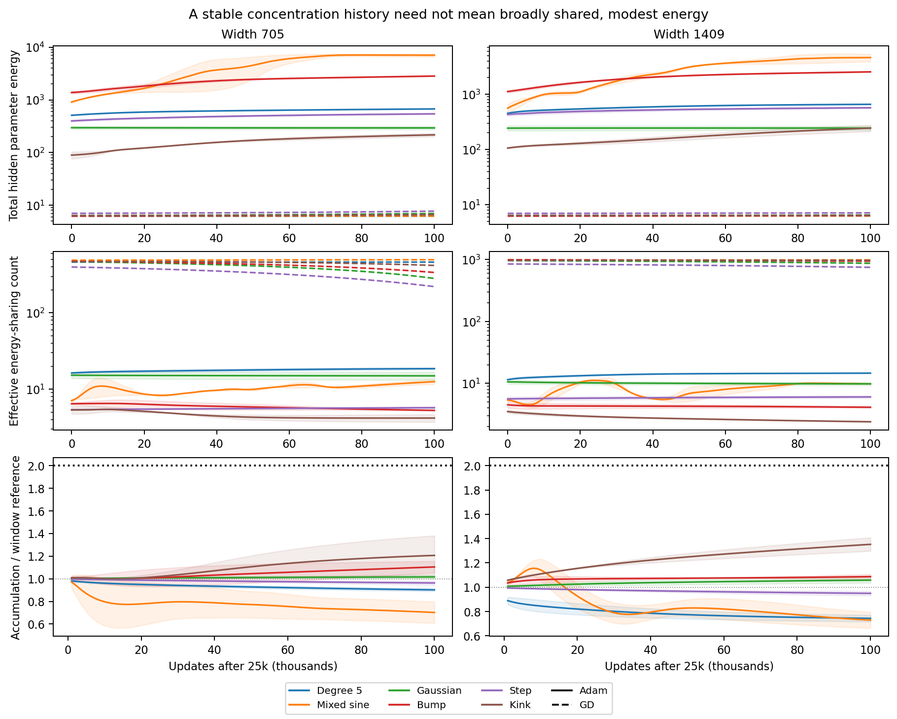
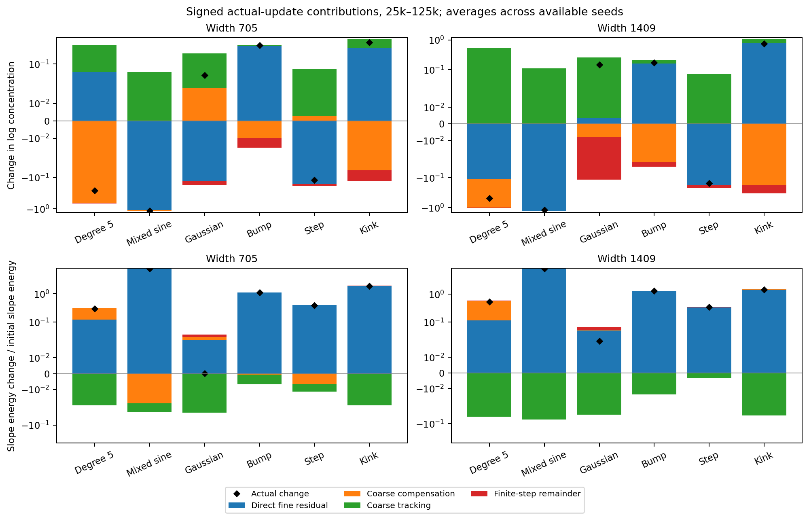
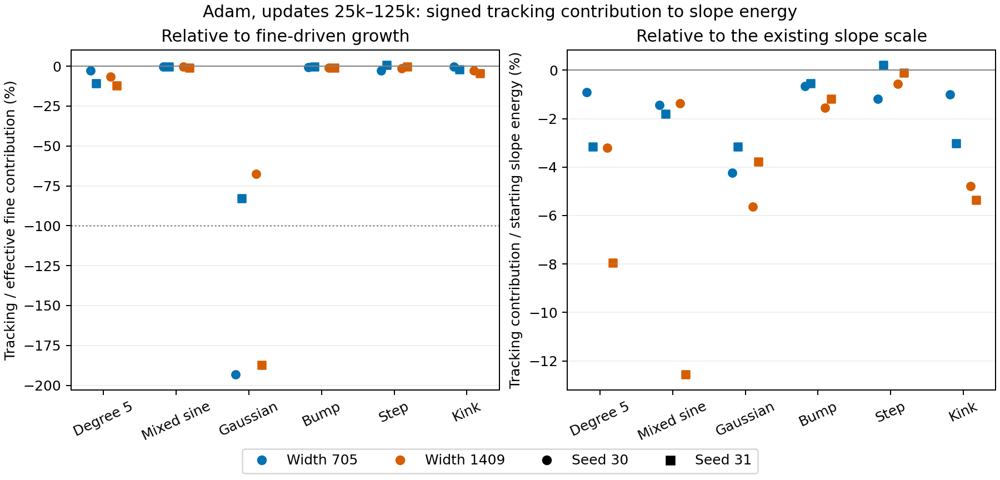
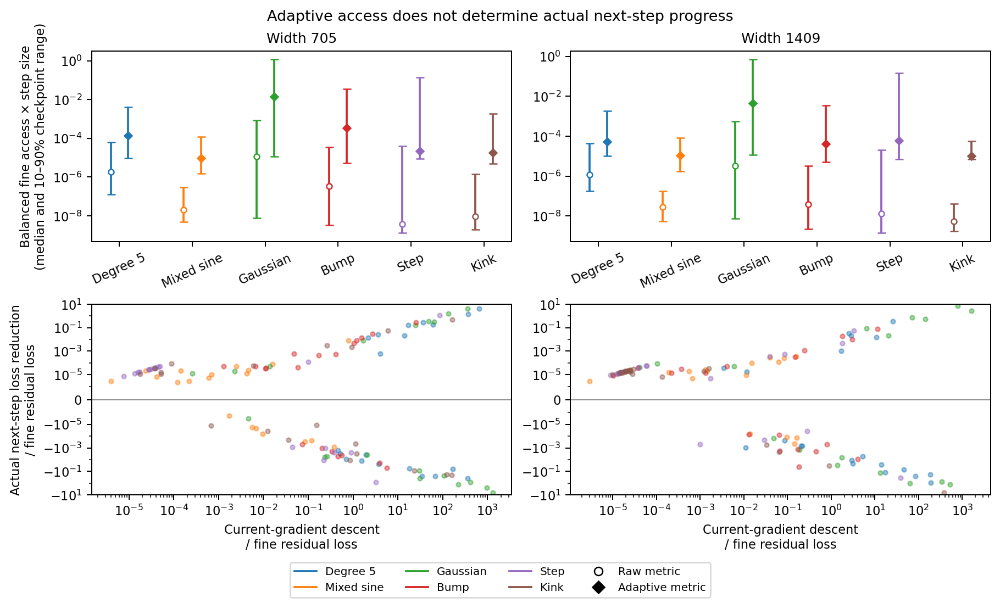
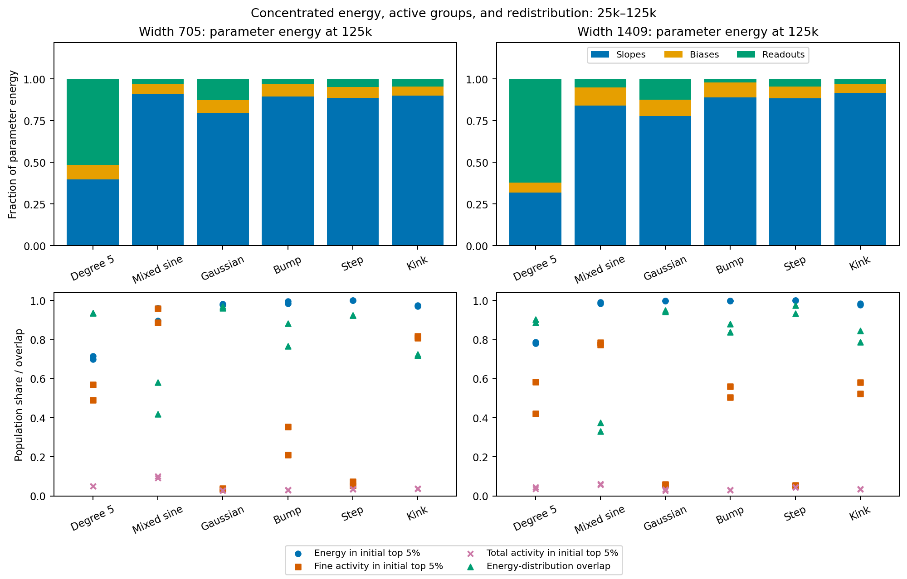
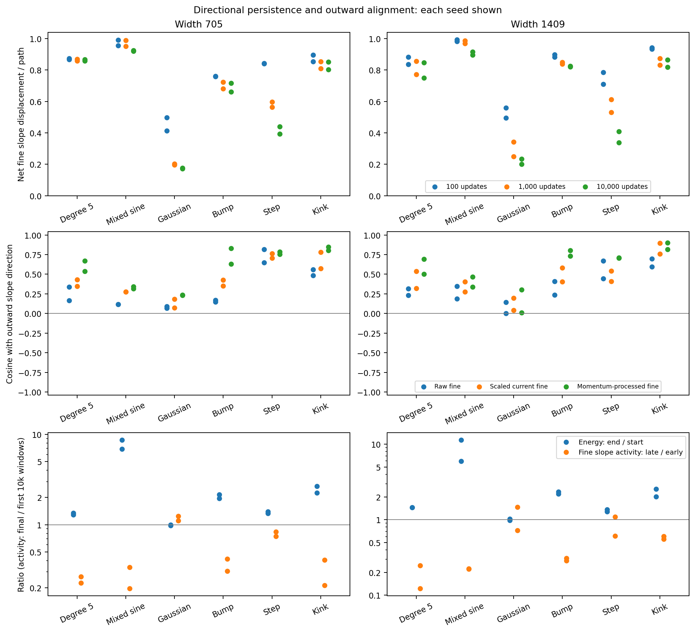
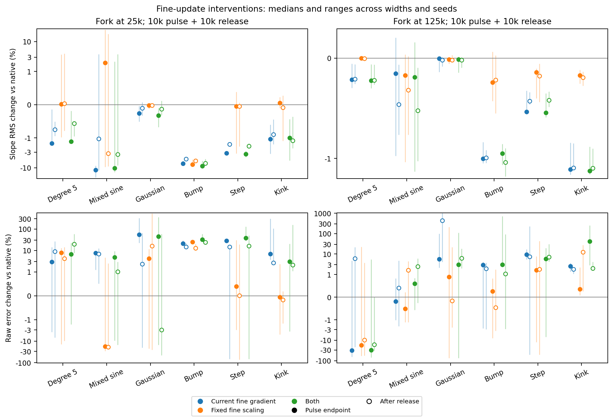
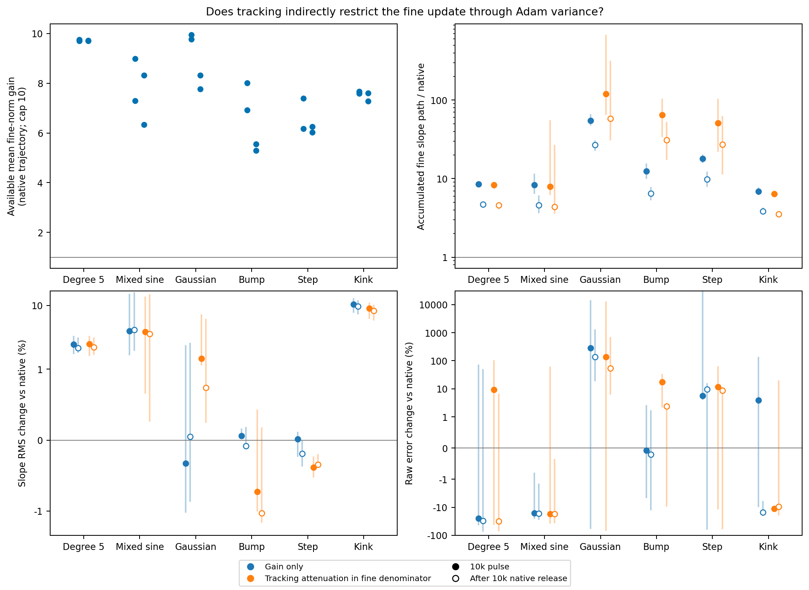

# Does the population persistence mechanism carry to Adam?

**Current synthesis.** The self-contained
[extended theory and evidence note](../../../../docs/d34_scale_acquisition_consolidated.md)
now combines the GD population proof with these Adam studies and the completed
coarse-stability campaign. The September 26 audit finds
predominantly coarse adaptive curvature near the local stability boundary in
24 late Adam states. Removing fine coarse disturbance at native amplitude
barely changes acquisition in all 24 paired starts. Turning off active fine
motion retains substantial late tracking in degree five, sine, and kink;
several localized cases settle. Whole-pulse tracking energy has median ratio
0.967 to native, but that integral alone would hide the late collapses.
The final-2k median ratio is 0.740, with seven cases below the resolution of
the accumulated statistic. Freezing the fine denominator at unit gain causes
10 of 24 unbalanced and 6 of 24 balanced branches to fail. The
[detailed feedback note](../../../../docs/d34_adam_coarse_feedback.md)
records the controls, negative results, and remaining theoretical questions;
all planned tests have finished. The completed
studies below remain the source for the earlier population and motion claims.

Adam has concentrated parameter energy, but this does not mean that its
useful motion is large or self-reinforcing. The follow-up now separates
energy distribution, update activity, and outward slope movement. Across
the twelve degree-five, mixed-sine, and bump cases that miss 1% accuracy
in the native panel, fine motion is substantially coherent while its late
magnitude falls to 12–42% of its early level. Energy nevertheless grows.
Replacing fine momentum with the current fine gradient reduces early slope
RMS in all 24 target–width–seed cases, despite matching the available fine
hidden-update norm locally. A simple loss of useful direction is therefore
not the common explanation supported by these tests.

The shared GD–Adam observation is limited reinforcement of useful fine
motion. The supporting conditions differ. Adam has much greater absolute
energy and concentration, so the GD population bound cannot simply be
reused. The results below establish fine-driven expansion, distinguish
direct tracking motion from its possible effect through the denominator,
and test the relevant optimizer mechanisms. They do not establish
insufficient energy concentration as Adam's bottleneck or provide an Adam
rate theorem.

The amplitude test identifies an additional mechanism: tracking restricts
the fine update through Adam's shared second moment. Attenuating tracking
inside a shadow denominator exposes a mean 5.3–10-fold fine norm gain in
every case, after capping gains at ten. Using that larger budget accelerates
some targets, but in others mainly generates cancelling activity or a
renewed tracking response. The evidence therefore concerns the amount and
direction of actual fine motion, not concentration or activity alone.

**Quantities used throughout this study.**

| Symbol | Meaning |
|---|---|
| $a_j,b_j,c_j$ | Physical slope, hidden bias, and readout of neuron $j$. |
| $M=\sum_j(a_j^2+b_j^2+c_j^2)$ | Total hidden parameter energy; the output bias is excluded. |
| $A=\sum_j a_j^2$ | Slope energy; slope RMS is $\sqrt{A/W}$. |
| $\chi_6=W^2\sum_j(a_j^2+b_j^2+c_j^2)^3/M^3$ | Dimensionless energy concentration; one for equal energies. CSV alias: `C6`. |
| $\chi_{10}=W^4\sum_j(a_j^2+b_j^2+c_j^2)^5/M^5$ | Tenth-moment concentration used in the dispersion ratio. |
| $W/\sqrt{\chi_6}$ | Effective number sharing the energy in the third-moment sense; not a count of nonzero neurons. |
| $K=\chi_{10}/\chi_6^2$ | Energy-weighted dispersion entering the coupled GD comparison. |
| $\lambda_{\rm RMS}=h\sqrt{A/W}$ | Normalized slope RMS, with $h=2/N_{\rm ref}$. |
| $F,R$ | Effective fine and tracking gradients, respectively. Compensation is part of $F$. |
| $D_n,\widehat m_n$ | Actual Adam diagonal inverse denominator and bias-corrected first moment. |

## First establish the output and scale observations

Across six target families, two widths, and two seeds, Adam attains 1%
relative training error in 12 of 24 runs during the measurement interval.
Seven attain 0.1%; none attains $10^{-4}$. These are every-update checks
over 25k–125k, including the endpoint, rather than conclusions drawn only
from a sparse plot. Degree five, mixed sine, and the compact bump remain
above 1% in all four width–seed combinations. Gaussian, step, and kink
attain 1% in all four combinations.

The endpoint normalized slope RMS lies between 0.00198 and 0.0121 at
width 705, and between 0.000684 and 0.00347 at width 1409. Slopes do move:
the largest RMS increase over the interval is 3.47-fold. These observations
describe limited acquired population scale at the stated budget, not an
equilibrium or permanent stagnation. They also show why the construction
benchmark $\lambda_*=0.25$ and an output-error threshold must remain
separate: several runs achieve 1% while staying far below that benchmark.

<figure>
  
  <figcaption>Full-batch training with the same initialization and learning rate 0.002; the horizontal axis starts at total update 25k and ends at 125k. Solid curves are Adam and dashed curves are GD. Curves show the median across two seeds; shading spans the two Adam values and is not a confidence interval. Top: raw relative training error, with a 1% reference line. Bottom: normalized slope RMS, with the construction reference 0.25, corresponding to physical slopes 64 and 128. Both optimizers use the current checkpoint; neither receives readout refitting or favorable checkpoint selection.</figcaption>
</figure>

## Concentration persists, at a very different absolute level

Every wide Adam run passes the factor-two accumulated-concentration check
defined below. The largest ratio to the preceding-window reference is
1.408. The analogous accumulated-dispersion ratio is at most 1.246.
Both accumulations remain close to their preceding-window rates.
This is a check on their measured future accumulation;
the first window alone does not guarantee it.

The absolute state is essential to interpreting this result. At 25k, median
hidden energy is about 459 at width 705 and 453 at width 1409. The respective
median concentrations are about 11,341 and 68,295. Across all 24 cases,
the effective energy-sharing count at 25k is only 3.3–16.7. Matched GD
retains energy of order seven shared much more broadly. The figure shows
these absolute quantities alongside the accumulation check so that a stable
ratio cannot hide this distinction.

<figure>
  
  <figcaption>The same 24 wide Adam runs and 24 matched GD controls. Top: total hidden energy. Middle: effective count $W/\sqrt{\chi_6}$; this is a moment statistic, not a count of active neurons. Bottom: Adam's accumulated $\sqrt{\chi_6}$ divided by its 20k–25k average times elapsed updates. Accumulation uses every update; the ratios are shown at 1000-update prefixes. All runs remain below the factor-two line. Medians and Adam seed ranges are shown; the effective count does not assert that the identities of high-energy neurons remain fixed.</figcaption>
</figure>

Stable concentration also permits substantial common expansion. Scaling all
hidden parameters by $s$ multiplies $M$ by $s^2$ while leaving $\chi_6$
unchanged. In the measured panel, total energy grows by as much as 11.4-fold
while concentration can decrease. The GD theorem turns concentration control
into an energy bound through its gradient-flow inequality. That optimizer
step is essential; concentration control by itself is not a slope bound.

## Effective fine updates drive expansion; tracking has a qualified role

Effective fine updates make a positive integrated contribution to slope
energy in all 24 wide runs. Tracking contributes negatively in 23; the
single positive case is the width-705 step at seed 31, where its contribution
is only 0.59% of the fine contribution. Among the 20 non-Gaussian cases,
the absolute net tracking contribution is at most 12.1% of the fine
contribution. This supports the fine-driven interpretation across these
targets.

The four Gaussian cases are a material exception to negligible tracking:
tracking opposes 67–193% of the fine contribution. Two have slight net
slope shrinkage after including the finite-step remainder. Tracking can
therefore determine the sign of a small net motion even when fine updates
provide the positive expansion channel. Its share of accumulated component
slope-path length has a median of roughly 91–92% at the two widths, much
larger than its usual signed effect on slope energy. Path length and net
acquisition answer different questions.

<figure>
  
  <figcaption>Contributions accumulated over every native Adam update from 25k to 125k, averaged across two seeds. Top: change in log concentration. Bottom: slope-energy change divided by its starting value. Direct fine residual combines generated-output and target terms; adding coarse compensation gives the effective fine contribution. All components use the same actual Adam denominator. Black diamonds give the observed change, including the displayed finite-step remainder. Tracking favors concentration in every wide run while usually opposing slope energy. The Gaussian's small net slope motion reflects a substantial opposing tracking term. The vertical axes use symmetric logarithmic scales.</figcaption>
</figure>

The signed concentration balance also prevents a stronger but unsupported
transfer. Tracking contributes positively to $\log\chi_6$ in all 24 runs;
effective fine updates contribute negatively in 17. Generated-output
correction, processed through Adam, contributes positively in 12 and
negatively in 12. The universal negative sign observed for this quantity
in the earlier GD panel therefore does not carry over. Neither universal
restoration nor uniformly negligible tracking explains all these Adam
population statistics.

### Is tracking large relative to fine growth, or large in absolute scale?

The Gaussian illustrates the distinction. At width 705, seed 30, the
integrated effective fine contribution adds 2.19% of the starting slope
energy, tracking subtracts 4.23%, and the finite-step term adds 0.78%.
Their sum is a 1.26% energy decrease, corresponding to only a 0.632%
decrease in slope RMS. Physical slope RMS changes from 0.5561 to 0.5525.
Tracking determines the sign of this small motion because the positive
fine contribution is also small.

These percentages use $A_0=\sum_j a_j(25\mathrm{k})^2$. If
$\Delta a_n^{F}$ and $\Delta a_n^{R}$ are the actual-denominator updates
from the effective fine and tracking moment buffers, define

$$
B_F=\sum_n2a_n^\top\Delta a_n^F,\qquad
B_R=\sum_n2a_n^\top\Delta a_n^R,\qquad
B_{\rm step}=\sum_n\|\Delta a_n\|^2.
$$

The measured identity, including all inherited effective momentum and with
no unresolved components in these runs, is

$$
A_T-A_0=B_F+B_R+B_{\rm step},\qquad
\lambda_{\rm RMS}(T)^2-\lambda_{\rm RMS}(0)^2
=\frac{h^2}{W}(B_F+B_R+B_{\rm step}).
$$

Thus $B_R/B_F$ measures tracking relative to fine-driven growth, while
$B_R/A_0$ measures it relative to the existing squared slope scale. Neither
ratio alone determines the actual RMS change. These are signed contributions
along the observed trajectory, not predicted effects of removing tracking.

<figure>
  
  <figcaption>All 24 wide Adam runs over updates 25k–125k, with each seed displayed separately. Left: signed tracking contribution divided by the effective fine contribution; −100% means equal and opposite integrated contributions. Right: the same tracking contribution divided by starting slope energy. These are two normalizations of the same measured quantity. The Gaussian's large cancellation ratio corresponds to 3.2–5.6% of starting energy. The largest absolute relative-to-start contribution occurs for mixed sine, where fine-driven growth is much larger still.</figcaption>
</figure>

Across the four Gaussians, $B_R/A_0$ ranges from −5.63% to −3.15%,
and the observed RMS changes range from −0.632% to +2.219%. Tracking
matters to their small net growth; it does not hide a large measured
expansion channel. Across the 20 non-Gaussian wide runs, median signed
$B_R/B_F$ is −1.13%, and its magnitude never exceeds 12.06%.

The mixed-sine run at width 1409, seed 31, is a useful converse example.
Tracking subtracts 12.56% of starting slope energy, the largest magnitude
in the wide panel, but effective fine updates add 1115.36%. Tracking is
only 1.13% of that fine contribution. Slope RMS grows by 246.90% and
ends at $\lambda_{\rm RMS}=0.00347$. Here tracking is measurable on the
starting-energy scale, yet it accounts for little of the difference between
the observed population scale and the construction reference.

### The broader target panel preserves the fine contribution, not tracking's sign

The 26 width-177 checkpoint continuations cover 13 targets and two seeds.
Effective fine updates contribute positively to slope energy in all 26,
extending that observation to all 50 instrumented Adam cases. Tracking
contributes positively in 15 and negatively in 11. Its median absolute
contribution is 4.23% of the fine contribution, but it can cancel more
than the fine contribution in the degree-nine cases. Thus negative tracking
is a feature of most runs in the wide panel, not a universal Adam mechanism.

The factor-two concentration allowance passes in 24 of 26 continuations.
Both failures are degree nine, with maximum saved-prefix ratios 3.10 and
2.94. The dispersion allowance passes in all 26, with largest ratio 1.81.
These failures remain in the report; controlled concentration accumulation
is a conditional regime, not a necessary condition for poor accuracy.
Eight continuations attain 1% error and two attain 0.1%; none attains
$10^{-4}$ over 25k–125k. These narrower runs are reported separately from
the primary wide panel.

The restored continuations are not exact reproductions of the old archived
paths. At shared stored checkpoints, the median per-run maximum relative
parameter difference is 0.083%, and the largest is 23.5% in one
polynomial-mixture continuation. Full optimizer state is restored and the
native-update checks pass, but long-trajectory agreement with the original
execution is not established. Consequently, these signed contributions
belong to the newly executed continuations. They must not be assigned to
the original archived endpoints or counted as additional independent
initializations of that archive.

Tracking can be large on the starting-energy scale in these narrower
continuations. For degree nine, seeds zero and one respectively give
$(B_F,B_R,B_{\rm step})/A_0=(52.84,-71.60,17.17)\%$ and
$(64.02,-81.22,17.46)\%$. The resulting RMS changes are −0.794%
and +0.133%. This is substantial cancellation relative to the existing
slope energy, not just a large ratio with a small denominator. It still
occurs at a small normalized slope scale, about 0.0015. Positive tracking
also occurs: for the degree-three target its contribution is 10.3% and
14.0% of fine-driven growth, or 1.22% and 2.60% of starting slope energy.
The broader panel therefore supports a target- and state-dependent tracking
role, with effective fine updates providing the larger positive contribution
in every measured continuation.

## Adaptive sensitivity is not a forecast of realized progress

The adaptive denominator greatly increases instantaneous fine-residual
access relative to the raw metric. This increased access does not directly
specify the actual next update: the first moment contains history, and
finite steps have quadratic and nonlinear output effects. At the same
checkpoint ages, actual loss reductions can have either sign. Over the
measurement interval, the median fraction of loss-increasing updates is
43% at width 705 and 34% at width 1409, counting increases exceeding
$10^{-14}$ in loss units. These are noiseless optimizer oscillations.

<figure>
  
  <figcaption>Top: instantaneous coarse-balanced fine-residual access times learning rate, measured in the raw and actual adaptive metrics. Points are medians and bars are 10–90% ranges over sampled checkpoints and both seeds; they are not uncertainty intervals. Bottom: at 10k checkpoint spacing, the ideal linear decrease using the current full gradient and adaptive denominator is compared with the actual next-step loss reduction, each normalized by the fine-residual loss. Negative vertical values mean loss increases. The diagnostic is defined below and is not a hitting-time estimate.</figcaption>
</figure>

The supported interpretation is therefore specific. Adam exhibits persistent
aggregate structure and predominantly fine-driven net slope expansion, while
remaining far below the construction's population scale at this budget.
Its energy distribution, processed correction signs, and actual update
metric differ from GD's. A quantitative Adam extension would have to control
coupling through its evolving denominator and moment history using aggregate
quantities. Reusing the raw GD concentration bound alone would miss the
observed regime. The present measurements identify this gap; they do not
close an Adam persistence proof.

## Concentrated energy does not determine the useful motion budget

Consider degree five at width 705, seed 30. From 25k to 125k updates,
hidden energy grows by 29.1%, but fine slope activity in the final 10k
updates is only 26.6% of its level in the first 10k. Within 10k windows,
the net fine slope displacement averages 85.8% of its accumulated path
length. The useful component is becoming quieter despite retaining a
substantial common direction. Describing this state only by its effective
energy-sharing count would miss that distinction.

A population with the energy of seventeen equally weighted neurons could
be stationary, expanding coherently, or repeatedly reversing. The effective
count distinguishes none of these possibilities. It measures the current
distribution of $a_j^2+b_j^2+c_j^2$, whereas acquisition depends on the
updates to the slopes and their alignment with the existing slope vector.
The follow-up therefore measures energy distribution, update activity, and
outward motion separately, retaining the same effective fine gradient $F$
and tracking gradient $R$ as above.

Relative concentration also says nothing about the absolute energy required
for the construction benchmark. Since $A\le M$,
$\lambda_{\rm RMS}^2=h^2A/W\le h^2M/W$. Reaching
$\lambda_{\rm RMS}=0.25$ would require at least 2.89 million units of
slope energy at width 705, or 23.1 million at width 1409 with the respective
$h$ used here. A concentrated population with hidden energy of hundreds or
thousands remains far from those budgets. This is a statement about the
construction scale, not a claim that such energy is necessary for 1% error.

Write $\Delta a_n^F$ and $\Delta a_n^R$ for their actual Adam-processed
slope updates. When the decomposition is resolved, the exact identity is

$$
A_{n+1}-A_n
=2\langle a_n,\Delta a_n^F\rangle
+2\langle a_n,\Delta a_n^R\rangle
+\|\Delta a_n\|^2.
$$

The fine term is
$2\|a_n\|\,\|\Delta a_n^F\|\cos\theta_n$, where $\theta_n$
is its angle with the outward slope direction. This separates the amount
of fine motion from its usefulness for expansion. A large parameter energy
does not guarantee either a large fine update or favorable alignment.
Likewise, the activity share $\sum_n\|\Delta\theta_{j,n}\|^2$ can be
large even if the updates cancel. Over a window, the ratio
$\|\sum_n\Delta a_n^F\|/\sum_n\|\Delta a_n^F\|$ detects such
cancellation in the fine component itself. It is not the ratio for the full
Adam update, whose tracking component can behave differently.

<figure>
  
  <figcaption>Top: the fractions of hidden parameter energy in slopes, hidden biases, and readouts at 125k, averaged over two seeds. Bottom: individual seeds, retaining the identities of the top 5% of neurons by energy at 25k. Their later energy share, fine activity share, and total activity share are different observables. Activity sums squared updates over all three hidden parameter blocks from 25k to 125k. The green triangles measure overlap of the full normalized energy distribution between the two endpoints; they can reveal redistribution despite a stable effective count. A high activity share does not by itself show net or outward movement.</figcaption>
</figure>

Across the 24 continuations, the initial top 5% retain a median 98.5% of
energy at 125k, but supply only a median 3.63% of total squared update
activity. Their median share of signed fine-driven slope growth is 98.4%.
Thus the population carrying energy and net fine expansion is not the
population carrying most of the total activity. Nor is energy generally
stored only in readouts: slopes hold 77–93% of final hidden energy in the
twenty non-degree-five cases. Degree five is an exception, with only
28–42% in slopes. The relevant distinction is useful motion versus existing
energy, rather than a universal readout-storage explanation.

Fixed identities also require qualification. For sine, the full normalized
energy distributions have only 0.331–0.582 overlap between 25k and 125k,
despite 90–99% of final energy remaining in the initial top 5%. Substantial
redistribution can occur within an energy-dominant group. An effective count
alone cannot resolve that movement.

### Direction is often persistent while the available motion declines

All twelve continuations for degree five, mixed sine, and compact bump show
the same combination over 25k–125k. Their average 10k-window fine slope
coherence ranges from 0.661 to 0.924, while final-window fine slope activity
is only 0.123–0.418 of its first-window level. Total hidden energy increases
by factors of 1.29–11.4. The activity comparison uses the sum of fine slope
update norms in equal-length windows, so it measures the actual processed
motion budget rather than a raw-gradient proxy. These are the three target
families that fail the 1% criterion in the preceding native panel.

The Gaussian is different: its corresponding coherence is only 0.172–0.234,
and its small fine-driven expansion is substantially opposed by tracking.
It already meets the 1% criterion. A universal assertion that fine motion
is coherent, or that tracking never matters, would therefore overstate the
evidence.

<figure>
  
  <figcaption>Each point represents one seed, with separate columns for widths 705 and 1409. Top: average fine slope displacement divided by path length in disjoint windows of 100, 1000, and 10,000 updates; every update enters these measurements. Middle: median cosine with the outward slope direction for the raw fine proposal, the adaptively scaled current fine proposal, and the actual momentum-processed fine proposal, sampled every 1000 updates. Bottom: total energy at 125k divided by energy at 25k, compared with accumulated fine slope path in 115k–125k divided by that in 25k–35k. The ratios compare different observables; they are not forecasts.</figcaption>
</figure>

Decreasing processed motion should not be renamed decreasing raw sensitivity.
In the same degree-five example, raw fine slope force per unit total error
actually rises by 23%. Error roughly halves, the adaptive norm gain falls
by 17%, and the ratio of momentum-processed to scaled-current magnitude
roughly halves. Their product gives a processed-magnitude ratio of 0.260.
These factors use geometric means of the ten 1000-update samples in each
endpoint window, preserving their multiplicative identity. The raw-force
ratio depends on residual alignment and is not an operator-norm estimate.
Nor does the smaller momentum ratio show that removing momentum would help:
the omitted instantaneous activity may point in unhelpful directions. The
direction interventions are needed to resolve that question.

### Direction interventions show that fine momentum is useful

At the 25k fork, replacing fine momentum by the current fine gradient lowers
slope RMS in every one of the 24 cases after the 10k pulse. The median
decrease is 2.93%, with decreases ranging from 0.038% to 20.8%. The
supplemental comparison at equal accumulated fine slope path is also
negative in all 24 cases. Signed accounting shows a smaller fine contribution
in every case. This supports a useful filtering role for momentum rather
than an interpretation in which stale fine momentum commonly blocks an
otherwise favorable current direction.

Freezing fine adaptive scaling has mixed early effects. One sine case gains
24.7% RMS and improves endpoint error by 29.0%, but accumulates 3.51 times
the native fine slope path. Its equal-path RMS comparison is negative.
Local norm matching does not force two evolving clones to receive identical
future motion budgets. This example is evidence of coupled trajectory
feedback, not a uniform benefit from fixing the diagonal.

At the 125k fork, all three direction policies have small scale effects:
the 72 pulse comparisons range from −1.51% to +0.204% in slope RMS.
After 10k native release they range from −1.59% to +0.0292%. These are
finite intervention results at the specified ages, not a claim that a
different step magnitude could never accelerate acquisition. Endpoint error
responses are more variable, particularly when the native error is already
small; both absolute error differences and relative changes are retained.

<figure>
  
  <figcaption>Three fine-only policies, each matched to the native fine hidden-update norm at its own current state. Filled markers show the 10k pulse endpoint and open markers show the endpoint after 10k native release. Points are medians over the four width–seed combinations, and bars span those combinations; they are not confidence intervals. Top: percentage change in slope RMS against the native clone at the same update age. Bottom: percentage change in its raw relative output error, where negative is better. A large percentage error change can be small in absolute terms for an already-accurate target. Axes use symmetric logarithmic scales. Tracking updates and native moment recurrences are retained throughout.</figcaption>
</figure>

### The crossed-force test does not establish a universal restoring balance

The four geometry–residual combinations give an exact attribution of each
sampled raw fine-force change into geometry and residual changes, pairing
both with the same ending slope and adaptive diagonal. However, they do
not support a universal sign rule. Over 25k–125k, the median fraction of
intervals with a positive geometry contribution is 72.5%; the median
fraction with a negative residual contribution is 55.5%. Some runs have
no positive geometry contributions under this pairing.

Moreover, the median ratio of accumulated absolute combined changes to
accumulated absolute component changes is 0.979 over the early interval and 0.994
over the late interval. Ratios near zero would indicate strong cancellation;
these values do not. In many cases residual variation dominates the sampled
force change. This diagnostic neither proves universal restoration nor
attributes the derivative of the actual momentum-processed update, whose
denominator and history also change. The more robust evidence here is the
population motion account and the paired interventions.

### An indirect tracking mechanism that the signed balance cannot test

The signed tracking term answers whether tracking itself moves slope energy
up or down. It does not answer whether tracking changes the denominator
through which fine motion passes. Both components share the second moment
of the full gradient. Consequently, a nearly cancelling tracking signal can
still change the size of the useful fine updates.

A two-coordinate example makes this distinction explicit while preserving
orthogonality of the raw components. Let $F=(f,f)$ and
$R_n=(-1)^n(r,-r)$, so $F\cdot R_n=0$. Each coordinate sees
$g_n=f\pm(-1)^nr$. After moment transients decay, its fine first moment
is $f$, while its second moment is

$$
v_n=f^2+r^2
\pm2fr\frac{1-\beta_2}{1+\beta_2}(-1)^n.
$$

With $\beta_2=0.999$, the alternating cross term is strongly attenuated.
Ignoring the denominator offset for this illustration, the processed fine
update is approximately $-\eta f/\sqrt{f^2+r^2}$. When $|r|\gg|f|$,
it is much smaller than the update available without tracking in the second
moment, even though tracking's alternating first moment has small mean.
This calculation describes a possible optimizer mechanism; it does not
assert that every measured trajectory has this form. The shadow-denominator
experiment below tests its relevance while retaining the native tracking
update. The matched scalar-gain control distinguishes a larger motion budget
from a change in its allocation across coordinates.

### The denominator test supports an amplitude restriction, with coupled limits

All 72 follow-up runs complete. Each case receives a shared native burn-in
from 125k to 130k, followed by native training, a scalar gain on the fine
update, or the shadow-denominator policy. Both altered policies use the
same locally available fine hidden-update norm, capped at ten times the
native proposal. They run for 10k updates and then release to native Adam
for 10k. Tracking and output-bias updates always use their native formulas
at the current clone state; the native moment histories continue throughout.

On the 24 native paths, the mean available capped gain ranges from 5.30
to 9.95, with median 7.64. Thus tracking can substantially restrict fine
motion through the shared denominator even when its signed slope contribution
is small. This establishes an indirect effect of tracking, distinct from
the direct tracking term in the slope-energy balance.

The scalar-gain control increases pulse-end RMS in all twelve degree-five,
sine, and kink cases. The increases are 1.74–3.34%, 1.65–15.2%, and
7.70–12.9%, respectively, and are primarily supplied by additional fine
slope-energy growth. Degree five and sine retain positive RMS differences
after release. The denominator policy gives broadly similar scale gains in
these families, with no uniform advantage over scalar amplification. This
supports an amplitude restriction more clearly than a universally harmful
coordinate allocation.

The bump demonstrates the coupled limit. At width 705, seed 30, scalar
amplification produces 15.6 times the native fine slope path, but fine
coherence falls from 0.529 to 0.081. Its pulse-end RMS gain is only 0.048%.
The denominator policy produces 73.3 times the path, with coherence 0.052,
and lowers RMS by 1.01%. Across all four bump cases, scalar amplification
raises RMS by only 0.043–0.165%, while fine coherence falls in every case.
More activity has not produced proportionate outward motion. This is a
causal example of the coupled dynamics turning a larger fine budget into
largely cancelling updates, rather than evidence that the intervention did
nothing.

Tracking can also become significant after intervention. In all four step
cases, the denominator policy increases the fine contribution, but a larger
opposing tracking contribution offsets it. In all four Gaussian cases,
that policy raises RMS while the fine contribution is smaller than in the
control; a renewed positive tracking response supplies the gain. The
unchanged tracking formula does not imply unchanged tracking along an
altered trajectory. These cases prevent interpreting every scale increase
as successful fine-force reinforcement.

<figure>
  
  <figcaption>Forks at 130k after the shared 5k native burn-in. Top left: mean available fine hidden-update gain along each native trajectory over the pulse interval, with the gain capped at ten before averaging. Top right: accumulated fine slope path relative to the native control. Bottom: paired changes in slope RMS and raw relative error. Filled markers show the 140k pulse endpoint and open markers the 150k release endpoint; the response panels show medians and ranges over four width–seed combinations. The two policies match the available norm locally, so their evolving trajectories need not accumulate equal paths. Large activity ratios with small RMS changes expose cancellation or non-outward movement. Large percentage error changes are interpreted using the retained absolute errors.</figcaption>
</figure>

Output accuracy remains a separate test. At the pulse endpoint, scalar
amplification improves both RMS and error in 11 of 24 cases; the denominator
policy does so in 9. Every altered degree-five, sine, and bump run remains
above 1% error at both selected endpoints. Across both endpoints, normalized slope RMS remains
below 0.013 in every altered run. This is still far below the construction
reference 0.25, without treating that reference as necessary for a chosen
error tolerance. Some already-accurate cases suffer large temporary error
increases. These policies are diagnostic interventions, not proposed
replacement optimizers.

The resulting Adam explanation has two measured parts. The shared
denominator restricts the available fine-update amplitude; enlarging that
amplitude can help, but can also reduce coherence and trigger tracking
responses. Native momentum organizes useful direction, while concentrated
energy does not guarantee that useful motion reinforces itself. This
supports a population account based on signed motion and its coupled
feedback. It does not support a concentration-only explanation, a universal
restoring equilibrium, or an extrapolated Adam acquisition-time bound.

## The archive already distinguishes the two population regimes

At update 20k, the width-177 Adam archive has median total hidden energy
449.5 and median concentration 218.5 across 13 targets and five seeds.
The effective energy-sharing count is about 12 of 177. The corresponding GD
medians are energy 6.03, concentration 2.09, and an effective count of about
122. Adam's different organization is already present well before a
million-update horizon.

To see why the difference matters, let $J_H$ be the output Jacobian after
removing constant and linear output functions, and let
$S_6=\sum_j(a_j^2+b_j^2+c_j^2)^3$. For exact tanh, the GD argument derives

$$
\|J_H\|\le C\sqrt{S_6}
=\frac{C}{W}\sqrt{\chi_6}\,M^{3/2}.
$$

Here $C$ is an absolute activation constant. This geometric inequality remains
valid at an Adam state. Its
smallness depends on both $M$ and $\chi_6$, however. Keeping concentration
within a fixed factor of its value at 20k does not recover GD's small
right-hand side when Adam starts with much larger values of both quantities.
Adaptive scaling introduces a further distinction between this raw
sensitivity and realized optimizer motion.

At the wide Adam starting states, this particular upper bound evaluates
to 170–12,236. A large upper bound does not show that the actual sensitivity
is large; it shows that this concentration estimate supplies no smallness
certificate there. The effective energy-sharing count is already small,
so the GD suppression associated with broadly shared modest energy cannot
simply be invoked. Moreover, the ratio of each run's median adaptively
balanced access to its median raw balanced access ranges from 58 to 6092.
These diagnostics make an Adam extension depend on how energy, target
sensitivity, and the adaptive update interact, rather than concentration
persistence alone.

The width-512 mixed-sine archive gives a concrete example of growth without
further concentration. Between 20k and 120k, total energy grows by a median
factor 3.76 across the five constant-rate seeds, while concentration falls
to a median 0.520 of its starting value. The median effective count rises
from about 7.0 to 9.8. Endpoint relative error remains 10.5–18.0%. This
example supports studying population growth and concentration separately;
it does not support equating slow concentration growth with slow growth of
every other quantity.

The remaining mechanistic question is whether Adam fails to reinforce the
**outward population motion** generated by its effective fine updates. The
present accounting identifies the positive driver and measures the tracking
correction. It does not yet derive why that driver remains insufficient over
a long interval from independently interpretable population conditions.
A concentration-based explanation remains a candidate, but would need to
control adaptive coupling or the allocation and target alignment of the
concentrated energy. Concentration alone cannot distinguish these states.
In particular, the modest late tracking intervention below does not test
that candidate.

## What is being compared

The primary panel has six targets: a degree-five polynomial, a mixture of
three sine frequencies, a localized Gaussian, a smooth compact bump, a tanh
step, and an absolute-value kink. Widths 705 and 1409 include halo neurons;
their reference widths are 512 and 1024. Two independent initializations are
used at each width. Every Adam run starts at initialization and receives
125,000 full-batch updates with learning rate 0.002, first-moment coefficient
0.9, second-moment coefficient 0.999, and denominator offset $10^{-8}$.

The preceding window is updates 20k–25k. The measurement interval is 25k–125k.
These are fixed ages, not checkpoints selected for favorable concentration,
low error, or small tracking. In particular, the experiment does not assume
that tracking is negligible at 25k. Matched GD controls use the same target,
initialization, physical coordinates, learning rate, and endpoint. Eighteen
controls reuse existing histories; six missing width-1409 controls are trained
afresh.

The six targets and two seeds come from the existing GD panel; they were
not chosen after inspecting these Adam results. This campaign tests one
specified Adam recipe. It does not establish failure for every choice of
Adam hyperparameters.

The network is $f_\theta(x)=d+\sum_jc_j\tanh(a_jx+b_j)$. All runs use
exact tanh and FP64 arithmetic on 2048 deterministic midpoint samples of
$[-1,1]$. Target normalization is fixed from that training grid.
The reported error is the attached network's raw relative $L^2$ error; no
readout refitting is applied. An 8192-point grid supplies a separate endpoint
check. This grid checks the same deterministic approximation problem, rather
than generalization to a new task distribution. The main curves and endpoint
comparisons use common checkpoint ages. For new Adam runs, additional passive
counters record whether any update in the measurement interval attains 1%,
0.1%, or $10^{-4}$ relative training error. These counters are not used to
select the plotted checkpoint.

The width-177 archive adds 13 targets and five seeds for both Adam and GD,
with 39 stored states through 600k. Two seeds are continued from the actual
20k Adam state to 125k, retaining first moments, second moments, and update
count. An existing width-512 mixed-sine archive supplies five seeds with
10k checkpoint spacing; its constant-learning-rate 0.002 runs form the
primary archive comparison. Other learning-rate schedules and later states
are retained separately. Historical moment buffers are unavailable there,
so that archive supports population measurements, not reconstructed Adam
step attribution.

## How the native optimizer is measured

Let $P_C$ project onto constant and linear output functions and let
$P_H=I-P_C$. Write $J_C=D(P_Cf)$, $J_H=D(P_Hf)$,
$e_H=P_H(f-y)$, and

$$
\Pi=I-J_C^*(J_CJ_C^*)^{-1}J_C.
$$

At each current state, the full gradient has the exact decomposition

$$
\nabla L=
\underbrace{J_H^*P_Hf}_{\text{generated-output correction}}
+\underbrace{(-J_H^*P_Hy)}_{\text{target}}
+\underbrace{(-(I-\Pi)J_H^*e_H)}_{\text{coarse compensation}}
+\underbrace{R}_{\text{tracking}}.
$$

The first three terms sum to $F=\Pi J_H^*e_H$. In figures, the first two
are combined as **direct fine residual** because their separately processed
contributions can be large and nearly cancel. This preserves the distinction
between compensation and tracking. The projection is the same GD-reference
projection used in the existing theory. Applying Adam to $F$ does not preserve
$J_C\dot\theta=0$; the gradient identity remains exact, but it is not an
adaptive coarse-equilibrium constraint.

For every component $G_n^{(q)}$, maintain a passive first moment

$$
m_{n+1}^{(q)}=\beta_1m_n^{(q)}+(1-\beta_1)G_n^{(q)},\qquad
\Delta\theta_n^{(q)}=-\eta D_{n+1}\widehat m_{n+1}^{(q)}.
$$

All components share the actual optimizer's denominator, computed from the
square of the **full** gradient. Their sum is the real Adam update. The native
parameters are updated directly from the full gradient and real moment
buffers; diagnostic histories never feed back into training. Incoming
effective momentum whose internal split was not archived is retained as an
explicit inherited component. No momentum is reset at the measurement start.
Unresolved projection solves are also retained explicitly, rather than
regularized into a preferred component.

For $Q=\log\chi_6$, the update identity is

$$
Q(\theta_{n+1})-Q(\theta_n)
=\sum_q\langle\nabla Q(\theta_n),\Delta\theta_n^{(q)}\rangle+\delta_n^Q.
$$

The finite-step remainder $\delta_n^Q$ is evaluated from the actual endpoints;
it is not discarded or interpreted as measurement error. For $M$ and $A$,
the remainders are exactly the squared hidden-parameter and slope increments.
Summing these identities measures which processed components favor relative
growth of energy-rich parts of the population, and which produce net slope
energy. It imposes no bound on an individual neuron.

Component accounting is descriptive. Removing a component and retraining
would also change subsequent gradients and denominators; its outcome is not
given by subtracting a bar from the observed trajectory.

Every pairing is evaluated at the moving state, on every update. This is
exact finite-step bookkeeping, not a forecast from a frozen Jacobian. Adam's
oscillations here are deterministic: no minibatch sampling or injected noise
is used.

## What the concentration check means

For $t_0=25\mathrm{k}$ and $\Delta=5\mathrm{k}$ updates, define

$$
\mathcal R_6(t)=
\frac{\int_{t_0}^{t}\sqrt{\chi_6(s)}\,ds}
{(t-t_0)\,\Delta^{-1}\int_{t_0-\Delta}^{t_0}\sqrt{\chi_6(s)}\,ds}.
$$

The computation uses the trapezoidal sum across **every actual update**,
with the ratio reported at 1000-update prefixes. A factor-two check compares
these saved-prefix ratios with two. It tests a structural allowance carried
over from the GD study, not an Adam hitting-time prediction. The analogous
dispersion check uses $\sqrt{9K-5}$ in both integrals. Neither check controls
the absolute starting energy or concentration.

## Why raw sensitivity and adaptive progress are separate measurements

Put $g_H=J_H^*e_H$. Using the actual next-step denominator, define

$$
\mathcal A_D=
\frac{g_H^*Dg_H-\ell^*(J_CD J_C^*)^{-1}\ell}{\|e_H\|^2},
\qquad \ell=J_CDg_H.
$$

This is the instantaneous fine-residual access after imposing coarse balance
in the adaptive metric. Its raw-metric counterpart is
$\mathcal A_I=\|F\|^2/\|e_H\|^2$. They are nonnegative quadratic forms when
their coarse solves are resolved. This adaptive diagnostic is distinct from
the fixed gradient decomposition above. It describes access for the current
gradient, not the optimizer's stored momentum.

For the actual next update, the output-loss change is recorded as

$$
L(\theta+\Delta\theta)-L(\theta)
=\langle\nabla L,\Delta\theta\rangle
+\tfrac12\|J\Delta\theta\|^2+\varepsilon_{\rm nonlinear}.
$$

Thus large instantaneous access, momentum alignment, and realized output
progress are separately inspectable. No spectrum or raw-gradient magnitude
is converted into an Adam convergence rate.

## Supplemental causal check: modest tracking attenuation late in training

An existing intervention starts from update 600k at width 177 and continues
for 20k updates. It multiplies the **slope tracking gradient** entering the
first-moment recurrence, the second-moment recurrence, or both by 0.9.
The second moment is still formed from the square of the resulting complete
gradient, retaining cross terms. All other coordinates and incoming moment
buffers are preserved. This is ongoing attenuation of a gradient channel,
not a reset or a one-time rescaling of stored optimizer state.

The available parameter snapshots cover 13 targets at one seed. Across
the three interventions per target, endpoint slope RMS differs from the
unmodified continuation by at most 0.066%, total hidden energy by at most
0.159%, and concentration by at most 0.462%. These are small responses to
this particular local intervention. They support the claim that a modest
tracking change need not reorganize a mature Adam population. They do not
test a large perturbation, recruitment of additional neurons, or the
25k–125k primary interval. A second cohort has archived summaries but lacks
the parameter snapshots needed for this population audit, so it is not
counted as replication here.

## Exact definitions of the six wide targets

Let $q_k$ be the degree-$k$ polynomial with positive leading coefficient,
orthonormal for the 2048-point training probability measure. The degree-five
target is $0.3q_0+0.4q_1+\sqrt{0.75}\,q_5$. The other five targets are
the following functions divided by their respective training-grid RMS:

$$
\begin{aligned}
 y_{\rm sine}^{\rm raw}(x)&=\sin(2\pi x)+\tfrac12\sin(6\pi x)+\tfrac14\sin(14\pi x),\\
 y_{\rm Gaussian}^{\rm raw}(x)&=\exp(-((x+0.35)/0.22)^2),\\
 y_{\rm bump}^{\rm raw}(x)&=
 \begin{cases}\exp(1-1/(1-u^2)),&|u|<1,\\0,&|u|\ge1,\end{cases}
 \quad u=(x-0.35)/0.22,\\
 y_{\rm step}^{\rm raw}(x)&=\tanh(14(x-0.31)),\\
 y_{\rm kink}^{\rm raw}(x)&=|x+0.23|.
\end{aligned}
$$

The same polynomial coefficients and normalization constants are used on
the independent evaluation grid. Xavier draws use bound
$\sqrt{6/(W+1)}$, with independent geometry and readout random streams.

## Verification and reproduction

Six focused tests cover native Adam and GD recurrence agreement, independent
autodifferentiation of the total and component gradients, preservation of
incoming optimizer state, the concentration score and scale invariance,
finite-step energy identities, and the adaptive coarse projection. They run
before each Modal job. Restoring an incoming effective first moment without
its historical internal split does not reset or otherwise alter the optimizer.

All 56 new cases completed: 24 wide Adam runs, six missing GD controls,
and 26 restored Adam continuations. There were no unresolved raw coarse
solves during these runs and no unresolved adaptive coarse solves among
the 6536 saved diagnostic states. The largest recorded component-sum
discrepancy is $4.07\times10^{-15}$. Accumulated identities close within
$9.18\times10^{-8}$ for hidden energy, $2.04\times10^{-7}$ for slope energy,
and $4.16\times10^{-10}$ for log concentration. Normalized by the sum of
absolute signed contributions, with a denominator floor of one, the largest
discrepancy is $1.35\times10^{-12}$. The endpoint training/evaluation error discrepancy
is at most $4.31\times10^{-6}$ in relative-error units across the 30 fresh
wide cases. These checks support numerical accounting and grid consistency;
they are not interval certificates for continuous-input error.

All scientific computation, including post-processing, testing, and plotting,
runs on Modal. GPU jobs have an 8 GiB host-memory cap; CPU jobs have a 4 GiB
cap. The local machine receives scalar diagnostics, plots, and sparse optimizer
states, and does not load scientific arrays. Only states at 20k, 25k, and
125k are retained for each new case; full parameter traces are not saved.
The six GPU jobs used 3841.0 seconds of recorded function time, about
1.07 GPU-hours within the three-hour cap. Peak recorded GPU-job host memory
was below 4.4 GiB.

The implementation is
[the passive diagnostic kernel](../../../../experiments/expD34_readout_race/population_adam.py),
[the archive and training runner](../../../../experiments/expD34_readout_race/population_adam_run.py),
[the scalar analysis](../../../../experiments/expD34_readout_race/population_adam_analysis.py),
and [the Modal entrypoint](../../../../experiments/expD34_readout_race/population_adam_modal.py).
The [focused tests](../../../../tests/test_population_adam.py) are separate
from the scientific interpretation. Each execution receipt records source
hashes, test output, runtime, and peak child-process memory. Each new run also
records its initialization and training-data hashes.

An example launch from the repository root is:

```sh
.venv-modal/bin/modal run experiments/expD34_readout_race/population_adam_modal.py \
  --stage wide_705_30 --seconds 1200 \
  --output results/checkpoint_D_optimizers/expD34_readout_race/population_output/evidence/adam_population_reproduction
```

Use a fresh output directory on every invocation. The campaign stages are
`archive`, `wide_705_30`, `wide_1409_30`, `wide_705_31`, `wide_1409_31`,
`replay_0`, and `replay_1`. The width-1409/seed-30 stage also includes the six
missing GD controls. GPUs are run sequentially under an aggregate three-hour
limit; individual job caps are not additional campaign budgets. The `analyze`
stage accepts a comma-separated `--sources` list of completed output
directories and uploads only their scalar CSV and JSON files for processing.

The curated outputs are
[per-run comparisons](evidence/adam_population_final_20260926/population_comparisons.csv),
[archive comparisons](evidence/adam_population_final_20260926/archive_comparisons.csv),
[late-intervention contrasts](evidence/adam_population_final_20260926/archived_intervention_contrasts.csv),
and [aggregate measurements and execution records](evidence/adam_population_final_20260926/facts.json).
The neighboring cohort directories preserve the scalar histories and sparse
states. The four PNG figures in this report also have SVG versions. Superseded
intermediate analyses can be reproduced from these inputs and are removed
after the final analysis is checked.

The relative-versus-absolute tracking follow-up uses only the 110 KiB
per-run comparison CSV, with no checkpoint arrays or new training. Its
[Modal analysis](../../../../experiments/expD34_readout_race/population_adam_tracking.py)
produces the [normalized contributions](evidence/adam_tracking_scale_20260926/tracking_scale.csv)
and [summary statistics](evidence/adam_tracking_scale_20260926/facts.json).
The converted squared-scale identities agree with observed endpoints to
$2.80\times10^{-10}$ relative to the larger of starting squared scale and
its net change. The [execution receipt](evidence/adam_tracking_scale_20260926/execution.json)
records a 1 GiB memory cap, 136 MiB peak use, and the input checksum.

```sh
.venv-modal/bin/modal run experiments/expD34_readout_race/population_adam_tracking.py \
  --source results/checkpoint_D_optimizers/expD34_readout_race/population_output/evidence/adam_population_final_20260926/population_comparisons.csv \
  --output results/checkpoint_D_optimizers/expD34_readout_race/population_output/evidence/adam_tracking_scale_reproduction
```

## Follow-up protocol: distinguish energy, activity, and outward motion

Concentrated parameter energy is not concentrated movement. A stationary
network can have a small effective energy-sharing count. The follow-up asks
whether Adam's fine updates are weakly coupled to outward slope motion,
whether they repeatedly reverse, and whether momentum history or changing
adaptive scaling suppresses otherwise available expansion. These are
empirical mechanism questions; the campaign does not seek an Adam theorem.

The fixed matrix uses the same six targets, both widths, and both seeds.
Native continuations from the complete 25k states run to 125k. Separate
forks at 25k and 125k receive 10k intervention updates followed by 10k native
updates. The native 25k control is the first 20k of its longer continuation.
Every fork preserves parameters, both optimizer moments, component moments,
and the global update count. The four policies are native Adam, replacing
fine momentum by the current fine gradient, freezing the fine component's
adaptive scaling at the first proposal of the fork, and applying both changes.

For each altered policy, multiply its proposed hidden-parameter fine update
by a scalar so that its norm equals the native fine proposal's norm **at
that clone's current state**. This is a local norm match; different clones
need not accumulate identical path lengths. Keep the output-bias update,
tracking update, and full-gradient moment recurrences native. Moment buffers
continue evolving during the intervention and are retained on release.
Record the unnormalized proposals as well. These policies test the direction
and allocation of fine motion; a null response does not exclude an effect
of its magnitude. A zero candidate with a nonzero native proposal is recorded
as an unresolved norm match rather than supplied with an invented direction.

At each fork, define fixed groups by descending neuron energy: the first
1%, the next 4%, the next 15%, and the remaining population, with cumulative
boundaries rounded upward. Track their energy, slope energy, signed fine and
tracking slope contributions, and shares of squared update activity.
Also measure the overlap $\sum_j\min(p_j(0),p_j(t))$ between normalized
energy distributions. Group identities are fixed; the overlap can reveal
redistribution even when the scalar effective count barely changes.

For disjoint windows of 100, 1000, and 10,000 updates, measure
$\|\sum_n\Delta a_n^F\|/\sum_n\|\Delta a_n^F\|$, its full hidden-parameter
counterpart, endpoint direction alignment, and average adjacent-update
alignment. Accumulate statistics for every window, including the 100-update
windows between saved scalar rows. Separately retain signed outward pairing
and the exact slope-energy balance. High path length with small net
displacement indicates cancellation; displacement need not itself be outward.

At 1000-update checkpoints, compare current raw fine, adaptively scaled
current fine, and momentum-processed fine proposals. Record their magnitudes,
slope fractions, and outward cosines. For each native 1000-update interval,
evaluate the four combinations of beginning/end geometry and beginning/end
fine residual, recomputing compensation for the selected geometry. Average
the two decomposition orders to separate geometry and residual contributions
to the force change. Pair both with the same ending slope vector and ending
adaptive diagonal. This diagnostic is exact for that finite difference; it
does not predict the next interval or represent a causal frozen-residual run.

Compare pulse and release endpoints at equal update ages, alongside
accumulated fine path length and attached-network raw error. Use the unchanged
2048-point training measure and an 8192-point check with original target
normalization. Increased scale without improved output is reported as scale
growth, not useful acquisition. Opposing or null responses remain evidence.

The scalar analysis also compares mean fine slope activity in the first and
final 10k windows of each 100k native continuation. This tests reinforcement
of the actual motion magnitude separately from direction persistence and
from growth of total parameter energy. Instantaneous outward-cosine summaries
use 1000-update samples; they are not every-update averages. For the
interventions, a supplemental comparison interpolates slope RMS at the
smaller of the two endpoint cumulative fine path lengths, using the saved
1000-update rows. This descriptive comparison separates elapsed updates from
accumulated motion budget; it is not an exact matched-trajectory experiment.

The Modal GPU campaign has a 1.8-hour aggregate cap and 8 GiB host-memory cap.
Cases run in fixed target, seed, and width order; each case contains the
native trajectory and all paired forks. A measured timing allowance prevents
starting a new case that is unlikely to fit. Partial blocks are explicitly
marked. Scalar rows and final optimizer states are retained; no full parameter
trace is written. Eleven focused tests pass on Modal CPU before launch,
including native recurrence preservation, component identities, local norm
matching, unaltered tracking/output-bias proposals, release with historical
moments, and the geometry/residual finite-difference identity.

### Targeted follow-up: tracking can affect fine motion through the denominator

The first completed degree-five and sine continuations show persistent fine
directions but decreasing fine-update magnitude. This motivates a separate
test of amplitude. It was added after inspecting those continuations and
uses the remaining portion of the same 1.8 GPU-hour budget.

Tracking can have a small signed contribution to slope growth while still
affecting the denominator used by every Adam component. Alongside the native
second moment, evolve a shadow second moment

$$
v^{\rm shadow}_{n+1}
=\beta_2v^{\rm shadow}_n+(1-\beta_2)(g_n-0.9R_n)^2.
$$

The square is coordinatewise. This retains the cross terms in the gradient
square and attenuates tracking to one tenth only in this alternative
denominator. Start the shadow buffer from the stored full second moment at
125k, then run 5000 native updates before forking. Thus the comparison begins
at 130k with identical parameters and complete native optimizer history;
the incoming shadow-buffer weight is approximately 0.0067. This is neither
a moment reset nor a change to the tracking update itself.

Compare three policies: native; multiplying the native fine hidden update
by a scalar gain; and using the shadow denominator for the fine hidden
update. At each clone's state, the latter two policies have the same fine
norm budget: the shadow proposal's norm, capped at ten times the native
fine norm. The scalar policy preserves native coordinate weighting. The
shadow policy changes that weighting while using the same local norm budget.
The gain may be below one. Keep the tracking and output-bias proposals and
all native moment recurrences unchanged. After a 10k pulse, return to native
updates for 10k, retaining the moments accumulated during the intervention.

Use all six targets, both widths, and both seeds. Measure available gains
on native trajectories, paired slope RMS and raw error, accumulated fine
and tracking contributions, and persistence after release. Improvement under
both altered policies would support an amplitude restriction; an additional
shadow-policy benefit would implicate coordinate weighting. Neither result
alone would establish that Adam's original small direct tracking contribution
was the cause. Instability, worse error, or a transient response must be
reported. The shadow-denominator and matched-gain identities, native
continuation, preserved tracking and bias updates, and release history pass
the expanded twelve-test suite on Modal CPU before this follow-up launches.

### Completed direction-and-activity campaign

All 192 runs completed: 24 native 25k–125k continuations and the paired
early and late policies described above. The run used 4168.6 recorded GPU
seconds (1.16 hours), including its eleven-test GPU verification. Peak child
host-memory use was 4592 MiB under the 8192 MiB remote cap. Scalar analysis
and figure generation ran separately on Modal CPU. No scientific arrays
were loaded for local numerical analysis.

The largest absolute component-update discrepancy is
$5.11\times10^{-15}$, the largest local norm-match discrepancy is
$5.00\times10^{-15}$, and the largest accumulated slope-energy closure
error is $1.03\times10^{-10}$. No coarse solve was unresolved, no norm
match had a zero candidate, and no saved state diagnostic was nonfinite.
The crossed-force identity closes to $1.99\times10^{-18}$ in force norm.
The largest discrepancy between relative errors on the 2048- and 8192-point
grids is $5.59\times10^{-6}$.

These are fresh continuations from saved optimizer states, rather than
bitwise reconstructions of the earlier archive. Their 125k parameter-vector
differences from the archived states have median 0.00747% and maximum 1.56%
relative norm. Every intervention comparison uses its newly computed native
control at the same age. The raw-error thresholds established earlier from
every-update counters remain identified with that earlier panel.

The retained evidence comprises
[native population and motion summaries](evidence/adam_motion_final_20260926/native_motion.csv),
[paired intervention comparisons](evidence/adam_motion_final_20260926/intervention_contrasts.csv),
[crossed-force summaries](evidence/adam_motion_final_20260926/force_changes.csv),
and [aggregate checks and execution provenance](evidence/adam_motion_final_20260926/facts.json).
The [run directory](evidence/adam_motion_runs_20260926/) contains scalar
histories, execution receipts, and final optimizer states for reproduction;
it occupies about 44 MiB and contains no dense parameter trace. PNG and SVG
versions of the three new figures accompany the summaries.

```sh
.venv-modal/bin/modal run experiments/expD34_readout_race/population_adam_motion_modal.py \
  --stage run --seconds 6300 \
  --output /tmp/adam_motion_reproduction
.venv-modal/bin/modal run experiments/expD34_readout_race/population_adam_motion_modal.py \
  --stage analyze --seconds 300 --source /tmp/adam_motion_reproduction \
  --output /tmp/adam_motion_analysis_reproduction
```

The first command's cap applies to that run. A combined campaign must
subtract its recorded GPU time before allocating a denominator follow-up;
the two commands are not permission to exceed the aggregate 1.8-hour budget.

### Completed denominator follow-up and total resource use

The denominator follow-up uses 1245.2 recorded GPU seconds, including its
twelve-test GPU verification. Together the two campaigns use 5413.8 seconds,
or **1.50 GPU-hours**, within the 1.8-hour aggregate cap. All 264 runs
complete, with 24 shared 5k burn-ins in addition. The largest remote peak
child host-memory use is 4598 MiB; each GPU job has an 8192 MiB hard cap.
All numerical post-processing also runs on Modal.

The denominator run has no unresolved coarse solves, zero-candidate norm
matches, or nonfinite state diagnostics. Its largest component discrepancy
is $4.03\times10^{-15}$, largest norm-budget discrepancy is
$1.16\times10^{-15}$, and largest accumulated slope-energy closure error
is $3.37\times10^{-11}$. The two error grids agree to
$4.23\times10^{-6}$ in relative-error units. The expanded twelve-test
suite passes on Modal CPU and GPU, including native recurrence, moment
history on release, the shadow-variance recurrence with cross terms, and
matched local norm budgets.

The [native available gains](evidence/adam_variance_final_20260926/native_denominator_gains.csv),
[paired responses and signed contributions](evidence/adam_variance_final_20260926/denominator_contrasts.csv),
and [checks and execution records](evidence/adam_variance_final_20260926/facts.json)
support the fourth figure. The [run directory](evidence/adam_variance_runs_20260926/)
retains scalar histories, shared fork states, and final optimizer states.
Gain diagnostics on native paths or after release describe the available
shadow-denominator gain; they are not gains applied by the native policy.

```sh
.venv-modal/bin/modal run experiments/expD34_readout_race/population_adam_motion_modal.py \
  --stage variance --seconds 1900 \
  --output /tmp/adam_variance_reproduction
.venv-modal/bin/modal run experiments/expD34_readout_race/population_adam_motion_modal.py \
  --stage analyze_variance --seconds 300 --source /tmp/adam_variance_reproduction \
  --output /tmp/adam_variance_analysis_reproduction
```

The 1900-second follow-up cap was assigned only after the primary run's
4168.6-second receipt was available, leaving a reserve below the aggregate
cap. A reproduction must similarly account for actual preceding GPU use.
