# Population dynamics and output error

This campaign asks whether the structure of the evolving training ODE explains
why output accuracy remains poor. A frozen-model validity window is not the
objective. The [protocol](PROTOCOL.md) fixes the five-hour wall-clock and five
aggregate GPU-hour limits, output metrics, target coverage, and large geometry
interventions. The self-contained exposition is the
[PI note](../../../../docs/d34_scale_acquisition_pi_note.md); the detailed
[population proof](../../../../docs/d34_population_output_persistence.md)
states the conditional mechanism and retains supplementary initial-data results.

The main result combines a population mechanism, a conditional theorem,
and cross-target evidence. Empirically persistent population structure limits
reinforcement of initially weak effective force. With stated allowances for
feedback, concentration, tracking, and finite steps, the theorem bounds
population acquisition and output progress over a training budget. The claim
starts at a post-transient checkpoint; it does not cover the early regime
where tracking can dominate. Force forecasts and perturbations test this
explanation. The objective is to prove the conditional theorem and show that
its conditions remain satisfied for long, specified intervals, with their
margins and failures reported. Deriving the duration from a checkpoint alone
is not an additional objective.

## Latest refinement: preserve weak residual coupling

The [feedback-persistence study](evidence/feedback_findings/README.md) presents
the conditional theorem retaining the effective force at the restart and
audits its assumptions across the saved target and perturbation panels.
An existing initial-data proof with outward-rounded effective-ODE instances
is retained as supplementary evidence.

Theorem 14 uses accumulated curvature feedback to bound force amplification
and output-error reduction. Its energy conclusion needs no concentration
premise; accumulated concentration supplies the additional population
movement bound. On all 46 width-705 baseline branches, an allowance of twice
the initial directional feedback rate covers every saved prefix over 20k
further updates and yields a conditional error floor above 1%. The longer
six-target archive requires a factor-four allowance to cover every branch.
These are empirical premise checks, not continuous-time certificates.

Fresh matched effective-flow and GD integrations through 100k equivalent
updates support the reduction: relative output errors differ by at most
$1.72\times10^{-6}$ across six targets. Tracking terms measured in the
force and energy comparison change the conditional floor by at most
$4.16\times10^{-6}$. The bound allows force to grow and population moments
to change; it does not require a stable equilibrium or accurate frozen model.

Theorem 16 closes an initial-data argument by bounding how residual-loaded
curvature can change through total population motion. Arb certifies relative
error at least 0.8660246 through flow time 333.8467 on the degree-five state.
That is about 167k updates' worth of flow time at learning rate 0.002,
**not a discrete-GD certificate**. The five other target certificates last
only about 3k–7k update-equivalent durations. These quantify the scope of the
supplementary initial-data result. The conditional theorem and its empirical
support are the central explanation. Validation should establish how long
the accumulated feedback, concentration, and disturbance conditions hold
with useful margins, alongside the resulting acquisition and error bounds.
Proposition 15 already handles the GD disturbance terms mathematically;
the current sampled evidence does not certify them between all checkpoints.

The following sections retain the earlier evidence and theorem comparisons;
their shorter bounds are superseded only in the cases explicitly covered
by the new results.

## What the archive establishes

The initial audit contains 223 distinct static checkpoints and 320 natural
trajectory states: forty continuations sampled eight times. The static panel
has 23 target functions at width 177 and six functions at widths 705 and 1409.
The wider states have age 20k updates. Late width-177 states have different
ages and sampling weights; they are not a controlled width comparison.

**Population structure directly explains output error in the wide states.**
For the actual attached readouts, define

$$
Q=\sum_j|c_j|a_j^2\left(|b_j|+|a_j|/3\right).
$$

The exact tanh inequality
$\|f-y\|\ge[\|P_Hy\|-Q]_+$ gives a positive lower bound at all 24
checkpoints of each wide panel. The bound divided by actual error has median
0.9906 at width 705 and 0.9953 at width 1409. Taking the maximum with valid
degree-2, 3, 5, and 9 target-tail bounds gives 0.9907 and 0.9955. Independent
evaluation-grid bounds behave similarly; each uses its own orthogonal
projection and target norm. These are current-state inequalities, not a
persistence certificate.

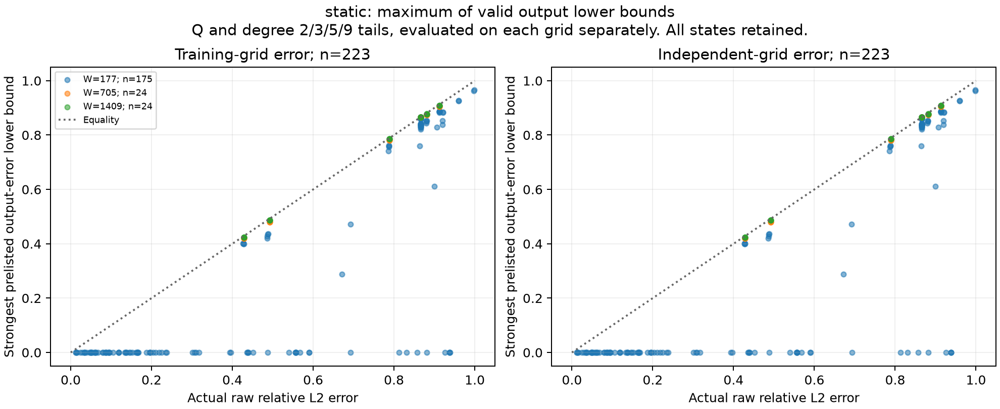

Among the 59 width-177 checkpoints at age 600k, the same bounds are positive
at only 20 states. The population is much more concentrated: the largest
decile carries a median 99.94% of $Q$, compared with 48.68% at width 1409.
A zero bound records loss of usefulness of this absolute-moment estimate;
it does not establish accurate approximation.

**Small tracking also holds for the output disturbance.** At width 1409,
the ratio $\|J_HR\|/\|J_HF\|$ has median $1.01\times10^{-4}$ and
maximum $1.63\times10^{-4}$. At width 705 the median is
$1.97\times10^{-4}$ and maximum $3.95\times10^{-4}$. Thus the effective
reduction is supported in the residual dynamics as well as in slope force
at these checkpoints. Shared coarse compensation is included in $F$; it has
not been discarded with $R$.

**Generated-error correction is regime dependent.** Split the exact effective
gradient as

$$
F=\Pi J_H^TP_Hf-\Pi J_H^TP_Hy.
$$

Both pieces use the same current compensated sensitivity. At width 1409,
generated-output correction decreases $Q$ and concentration $C_6$ in all
24 states. The target term increases both quantities in sixteen states and
decreases both in eight. The latter are mixed sine and the absolute-value
kink, across four seeds each. The median retained fraction
$|\dot Q|/(|\dot Q_{\rm generated}|+|\dot Q_{\rm target}|)$ is 0.999,
so typical wide-state slowness is not a near-cancellation of those terms.
At width 177 and age 600k the corresponding median is 0.0153; signs still
vary across targets.

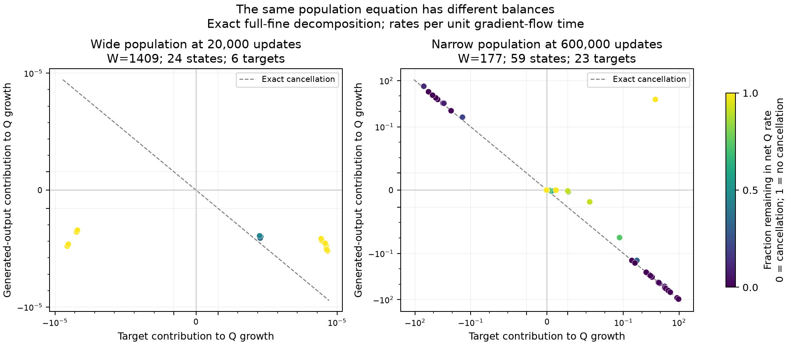

Natural continuations also rule out treating concentration as universally
constant. One narrow continuation increases $C_6$ by 9.37-fold while reducing
relative error by only 1.44% over 20k additional updates. The late sine,
seed-zero continuation increases $Q$ by 14.77-fold while reducing error by
20.7%. These are reasons to propagate a moving envelope, rather than assume
a static population or regard every concentration increase as acquisition.

## What is now proved, and where the constants fail

The proof starts from bounded rescaled population moments and aggregate
coarse conditioning. For effective flow, the sixth-moment norm satisfies

$$
D^+B\le\|F\|\le3Y_0B^3.
$$

An initial-data comparison propagates the moment and coarse rank for a
window of order $W^{2/3}$, with collective travel of order $W^{-1/3}$ and
a nonlinear-output capacity of order $W^{-1}$. No future small-force or
per-neuron confinement assumption is required. A separate discrete recurrence
propagates coarse tracking and GD remainder errors. With initially
$\|z_0\|=o(W^{-1/3})$, it gives the same asymptotic population window
for sufficiently large widths and a width-independent sufficiently small
step size. This is a post-transient theorem, not a theorem of entry into
that regime.

Higher finite moments yield effective-flow windows of order $W^{1-2/p}$.
Two further effective-flow refinements begin from the actual fine Jacobian
norm or the actual effective-force norm and bound their subsequent evolution.
None requires an accurate frozen predictor. The force refinement uses the
exact identity

$$
\frac12\frac{d}{dt}\|F\|^2
=-\|J_HF\|^2-\langle e_H,D^2e_H[F,F]\rangle
+\ell\cdot D^2e_C[F,F].
$$

The numerical evaluations remain conservative. Across the 24 static width-1409
states, the median effective-flow times are 2.07 for the sixth moment, 7.62
for the evolving Jacobian, and 4.54 for the evolving force. Eighth and twelfth
moments have shorter finite-width windows despite their better asymptotic
exponents. Ordinary GD's separate initial-data recurrence accepts 86--172
additional updates, median 95. The natural continuations remain slow over
20k updates, so the practical duration is not yet explained by the sufficient
constants. These FP64 audits are not outward-rounded interval certificates.

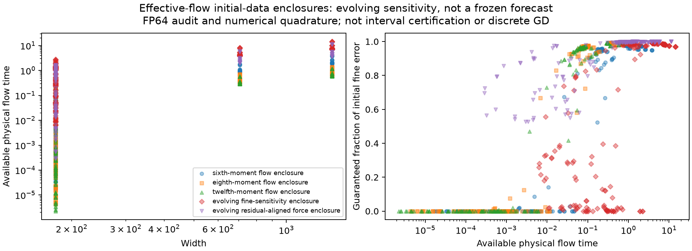

The isotropic squared-sensitivity bound exceeds the actual residual-aligned
sensitivity by a median factor 5,507 at width 1409. Consequently a sharper
mechanism should preserve residual loading and directional population
information. The new feedback study finds that favorable feedback signs are
unnecessary for useful bounds in the wide baseline regime; retaining their
cancellation helps in the late narrow regime. Substituting a smaller initial
force into a generic growth bound does not by itself recover the full
observed duration across targets.

**The force-feedback audit locates the loss.** At the same width-1409
checkpoints, the generic curvature-rate bound is 598 times the bound evaluated
along the current force direction at the median. Among the sixteen states
with positive signed curvature feedback, the directional bound exceeds that
signed feedback by a median factor 2.07. Fourteen of the 24 states have
positive net log-force growth after residual relaxation; ten have negative
growth. Thus the main loss in this wide regime occurs when replacing the
force direction by a worst-case population norm, before dropping favorable
feedback signs.

At the late width-177 states the generic/directional ratio is much larger,
median 56,218. Generated and target contributions to curvature, each including
compensation, cancel by 92.2% at the median. Only fifteen of 59 states have
positive net force-norm growth. The cancellation fraction here concerns force
reinforcement, not the separate $\dot Q$ cancellation reported above.

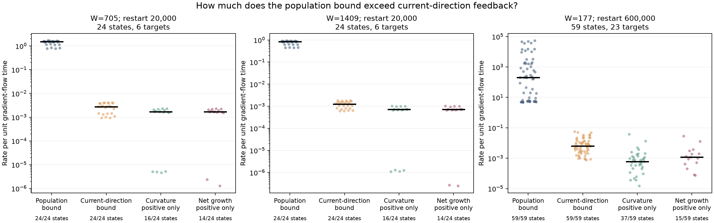

The signed identity closes to at most $6.78\times10^{-20}$ absolute error
over all 543 states, and the independently evaluated effective-force norm
agrees with the prior audit to at most $5.79\times10^{-11}$ relative error.
These measurements motivate retaining force-weighted population structure
in the ODE argument; they do not provide a bound between saved checkpoints.

## A simpler collective persistence condition

The first collective conditional theorem controls accumulated force
concentration,

$$
I_F=W\sum_j\left(\frac{|F_j|^2}{\|F\|^2}\right)^2,\qquad
\mathcal C(t)=\int_0^t\sqrt{I_F(s)}\,ds.
$$

The instantaneous concentration is unchanged when the force is multiplied by a nonzero scalar.
It controls how the force is distributed, rather than assuming its magnitude
is small. Writing $q=M_4^{1/4}$, orthogonality of the effective projection
and Hölder's inequality give

$$
\|F\|\le3YI_F^{1/4}q^3/W,\qquad
D^+q\le I_F^{1/4}\|F\|.
$$

The coupled inequalities propagate the fourth moment, accumulated force,
limited travel, and output error. A bounded time-average of $\sqrt{I_F}$
gives a conditional interval proportional to width. Initial coarse rank
suffices: its finite-time preservation is proved, without a future
conditioning margin. There is no future moment, force-amplitude, or
per-neuron confinement assumption. Preservation of the concentration budget
remains open, as does transferring this result to full GD or Adam. The
earlier initial-data theorems remain separate. An integral premise does not
imply a uniform instantaneous force bound.

The broader longitudinal check now covers all 23 targets at width 705:
46 original and 46 repaired trajectories, sampled at 0, 1k, and 20k further
updates. None exceeds the illustrative allowance 32; the maximum is 22.27.
Concentration can grow, with maximum sampled/initial ratio 1.49. In the
six-target repaired 100k extension, the right bump and left Gaussian exceed
32 and the sampled maximum is 86.2. Crossing 32 does not end the new theorem's
regime: the relevant condition is the accumulated budget. The 100-fold
injected arms
also remain below 32 while fitting much faster: concentration alone is not
the obstruction. Their initial population moments are much larger.

The two longer branches that leave the allowance still have relative errors
88.1% (right bump) and 78.8% (left Gaussian) at 100k, and their every-update
training counters record no 1% crossing throughout the continuation. A
sufficient theorem condition ceasing to hold is not an output-success event.

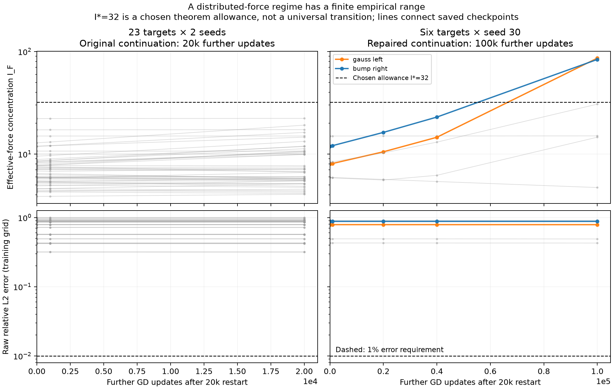

The earlier pointwise numerical comparisons remain conservative. With the
illustrative allowance
$I_*=32$, all 58 width-705 broad states and all 24 width-1409 original states
pass the initial check. The refined median effective-flow times are 2.57 and
5.41, with minimum relative output floors 20.8% and 38.3%. No interval reaches
physical time 40. These calculations used the earlier measured-initial-force
refinement and a travel-based conditioning restriction; they did not evaluate
the accumulated-concentration theorem.

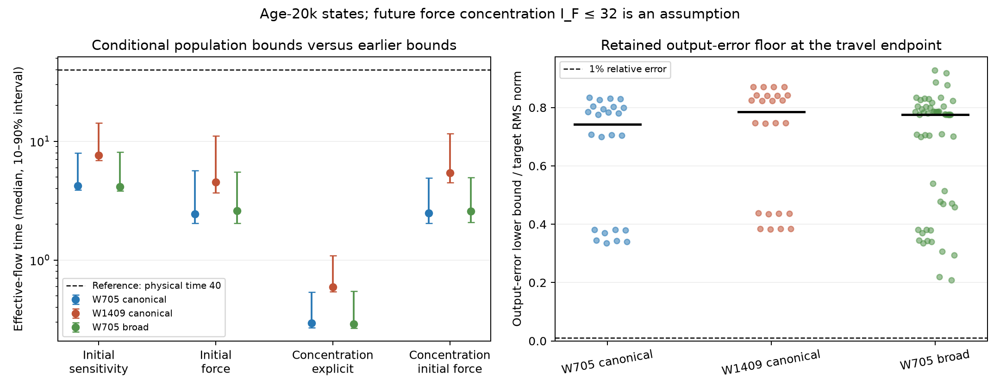

**The accumulated theorem has now been evaluated retrospectively.** The
[new audit](evidence/accumulated_concentration/README.md) post-processes
1,170 archived continuations on Modal, without opening parameter archives.
In the balanced original-GD panel of 23 targets and two seeds at width 705,
the estimated 1% output floor lasts a median 3,361 further updates, versus
1,495 with the fixed allowance 32 and the same rank-free formula. At width
1409 the six-target median is 6,670. These are effective-flow times divided
by the GD learning rate, not certified GD iteration bounds. Neither panel's
envelope reaches the full 20,000-update continuation.

At width 705 the actual fourth moment changes by at most 5.1%, final errors
remain 31.7%–99.8%, and every-update counters record no 1% error crossing or
$\lambda=0.25$ acquisition. The cubic population estimate exceeds the actual
effective force by a median factor 200.6, whereas the moment-transport
estimate exceeds the absolute effective moment rate by a median 5.41.
The largest measured loss of information is therefore in bounding force
from population size. Explaining that aggregate slack is the next proof
question; assuming the force stays small would bypass it. Sparse clock
quadrature and the effective-flow-to-GD transfer remain uncertified.

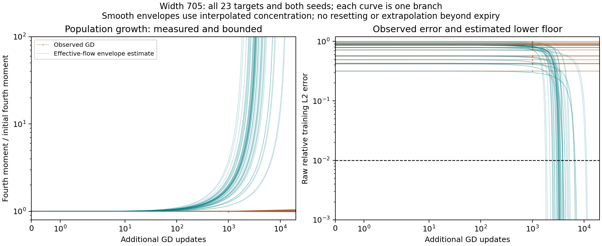

## Broader target coverage at width 705

The seventeen functions missing from the original wide panel were trained
for 20k updates at seeds 30 and 31, using exactly the corresponding archived
initializations and the existing target normalization. Combining their 34
checkpoints with the original six-target, four-seed audit gives 58 states
covering all 23 functions. This is a coverage check, not a balanced average:
the six original targets have twice as many seeds. The common-seed subset
has 46 states.

Every state's $Q$ error floor is positive. The bound divided by actual raw
error ranges from 0.9644 to 0.9937, with median 0.9899. The ratio of tracking
to effective fine-output speed has maximum $6.40\times10^{-4}$. Generated
correction reduces $Q$ in all 58 states; the target contribution increases
it in 33 and decreases it in 25. Thus the broad-feature output obstruction
and small tracking disturbance survive target expansion, while the target
force's direction remains heterogeneous. These results are at the 20k fork;
longitudinal persistence is a separate test.

## Large geometry interventions and the frozen-readout control

The completed main panel has 104 starts: 23 targets and two seeds at widths
177 and 705, plus six targets and two seeds at width 1409. It contains 1,040
branches: ordinary GD, a repaired baseline, and $3.2,10,32,100$ geometry
multipliers with two readout-reference policies. Thirty longer branches and
sixty matched half-step controls bring the total to 1,130. All branches
completed with finite parameters; no repair was rejected. Width 177 starts
at age 600k; the wider populations start at age 20k. The columns are therefore
not a controlled width comparison.

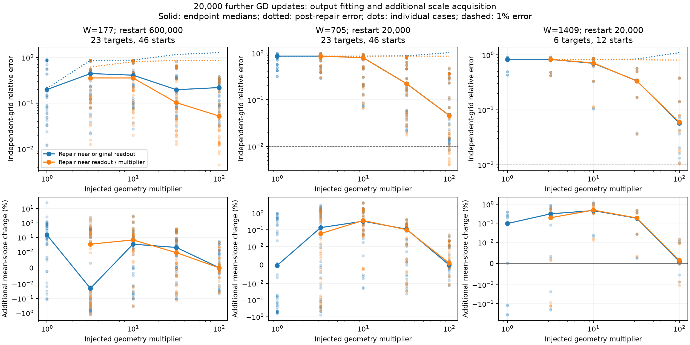

At width 705, original branches retain median independent-grid error 86.6%
after the additional 20k updates, with no endpoint below 1%. A 100-fold
injection leaves median errors 4.63% and 4.59% under primary and inverse
readout repair. Two of 46 primary endpoints and eleven of 46 inverse
endpoints cross 1%. Yet additional mean-slope growth is at most 0.0511%
over these 92 branches. The injected median normalized RMS slope is about
0.02165, below the construction benchmark 0.25. Supplied scale and subsequent
acquisition are recorded separately.

Freezing geometry at the shared post-repair state makes the mechanism more
specific. On six targets at width 705, seed 30, ordinary readout GD reproduces
a median 99.8--99.9% of full GD's relative-error reduction after the 100-fold
injection, at 20k and 100k updates and under both repair references. At tenfold
injection it reproduces 78.8--92.6%, so geometry evolution matters more there.
The frozen calculation evaluates the exact linear GD recurrence in FP64;
it does not replace training with a least-squares fit.

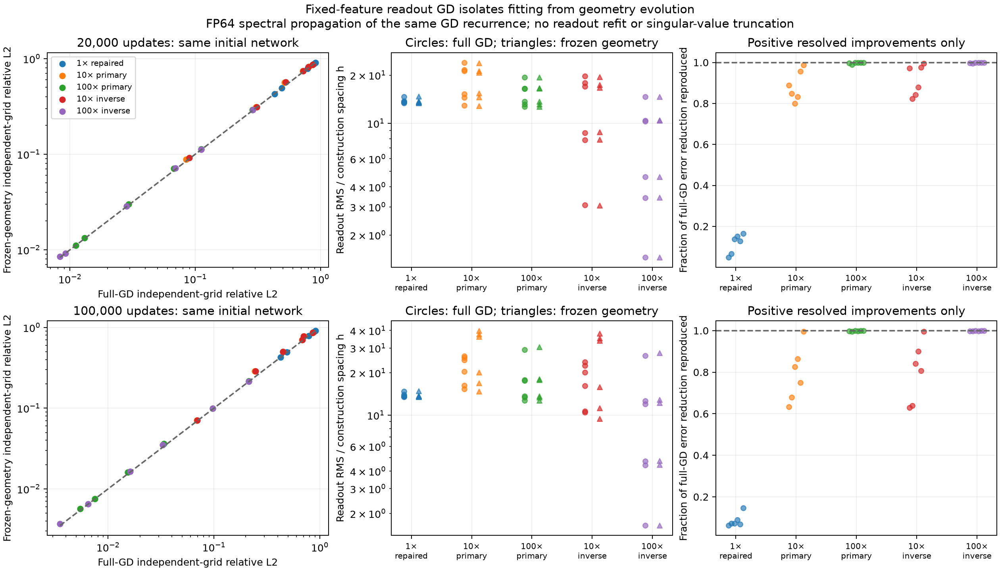

At 100k updates, full GD's median readout RMS is $15.6h$ for the 100-fold
primary reference and $8.37h$ for the inverse reference, close to the frozen
controls. This is evidence of persistent reference dependence at one width,
not an asymptotic $O(h)$ law. The primary median error is still 2.45%.
Across sixty matched half-step controls the maximum relative slope-endpoint
discrepancy is 0.1753% of the reference displacement, median 0.00258%.

**A rigorous frozen-feature output statement.** Four selected arbitrary
residual witnesses were evaluated with 128-bit outward-rounded arithmetic.
For every integer update through 100k, the certified empirical relative-error
floors are 91.11% and 17.93% for mixed sine, before and after 100-fold primary
injection; for the right bump they are 87.43% and 2.536%. All four exceed 1%.
The proof uses residual energy and direct witness inner products. The SVD
only chooses witnesses and need not itself be certified. The certificates
apply to exact-real frozen-feature GD on the encoded empirical problem,
not evolving geometry, independent-grid error, or all machine roundoff.

## Adam: output accuracy, adaptive sensitivity, and reconstructed next update

The archived primary panel has thirteen targets and five seeds per optimizer,
at width 177 and learning rate 0.002. Both methods are evaluated at the same
20k, 100k, and 600k update counts, with raw attached-network errors and no
readout refit. These are endpoint comparisons. Sparse samples do not prove
failure at every preceding update.

At 600k, Adam's median relative training error is 1.39%, versus 86.6% for GD.
Of the 65 Adam endpoints, 37 exceed 1%, 60 exceed 0.1%, and all exceed
$10^{-4}$. Independent-grid results have the same counts.

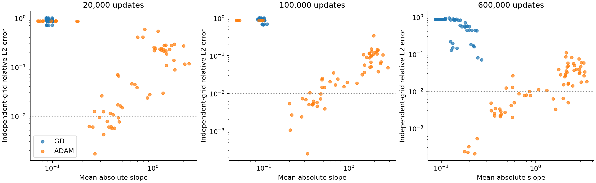

Residual energy and conditioning are measured together using $J$ and
$JD^{1/2}$, where $D$ is the next-update inverse denominator (adaptive
mobility). At 600k,
the median fraction of residual energy in joint directions with
$\eta\kappa<10^{-5}$ is 98.97% in the raw metric and 97.83% after
adaptive scaling. The median unresolved fraction after scaling is only
$2.94\times10^{-12}$, with maximum 0.611%. These are instantaneous
sensitivity labels, not predicted Adam hitting times.

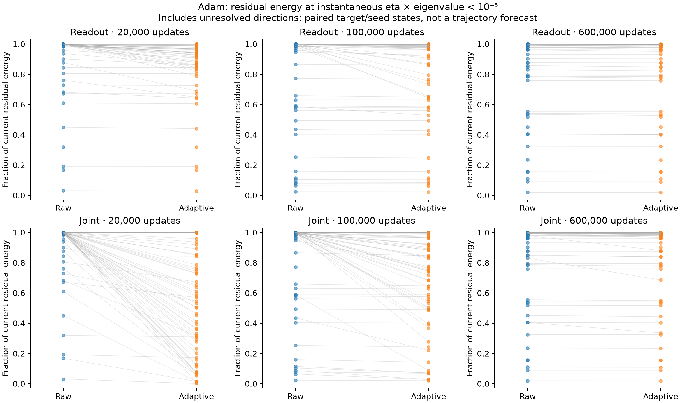

Reconstructing the actual next update adds momentum and finite-step effects.
Among the 37 primary 600k endpoints above 1% error, the median momentum-lag
term removes 94.4% of the current gradient's linear descent prediction.
The virtual next step increases loss in 22 cases, but lag alone completely
cancels linear descent in only one. The quadratic output-step cost matters
as well. These diagnostics do not establish sustained oscillation or an
integrated tracking attribution.

On the matched seed-zero subset of thirteen targets, median 600k errors are
1.22%, 0.991%, and 0.667% at learning rates 0.002, 0.001, and 0.0002.
Every endpoint at each rate still exceeds $10^{-4}$. Smaller steps improve
some cases; the evidence does not imply that every Adam configuration has
the same obstruction.

## Reproducibility and interpretation

The campaign's remote root is
`/workspace/junmiaoh/experiments/precision-mlps/mechanism-0365cd3-20260923/evidence/population_output_cb89e72`.
All numerical work runs through Slurm. Each state audit records source hashes;
training manifests record prepared-input hashes, case indices, learning rates,
source hashes, device allocation, and sparse checkpoints. Plot helpers produce
data and figures only; this report and the PI note are authored separately.

The important artifacts are the state CSVs, certificate candidates and selected
initial-data bounds, exact next-update Adam diagnostics, spectral energy
summaries, and the JSON facts accompanying the figures. Numerical identity
checks verify calculation and normalization; they do not turn sampled states
into prospective guarantees. Large-intervention failures must distinguish
rejected repairs, unresolved decompositions, and nonfinite GD.

The final focused validation passes 98 tests: 92 numerical and analysis checks
in the feedback environment, plus three reporting checks and three Arb
certificate checks in the plotting environment. Source hashes, input hashes,
run manifests, package versions, scoped scheduler logs, and resource accounting
are retained in [the verification capsule](evidence/verification/).
The raw logs, full manifests, and scheduler table are preserved byte-for-byte
in its compressed `raw_records.tar.gz`; the compact JSON summaries are directly
readable alongside it.
The nine GPU jobs used 2,661 allocated GPU-seconds, or 0.7392 GPU-hours,
within the five-GPU-hour limit. CPU audits and interval arithmetic used no
GPU allocations. Unique sparse checkpoints and source snapshots are retained;
only verified duplicate or reproducible unused campaign outputs were removed.
