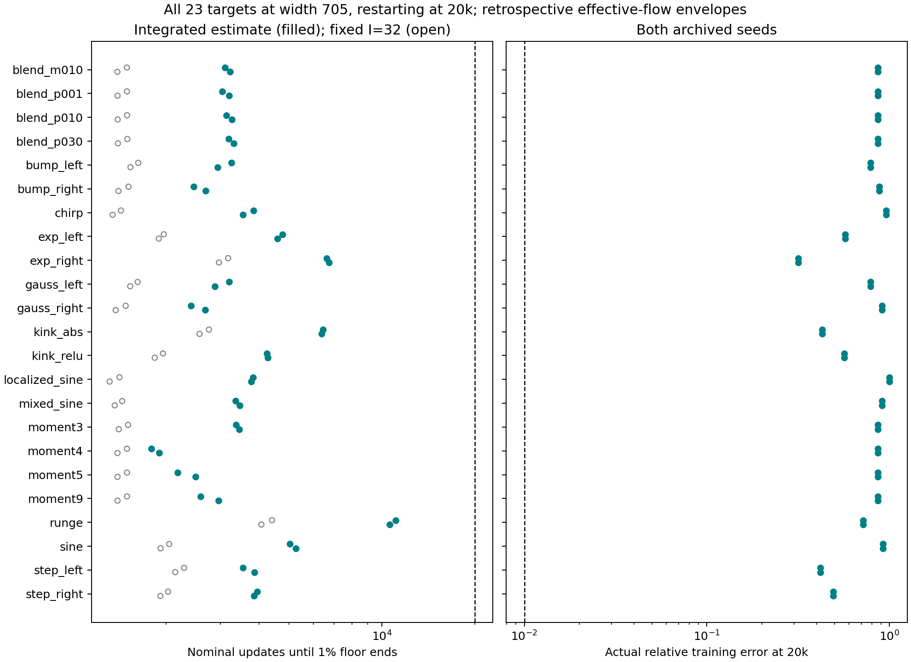
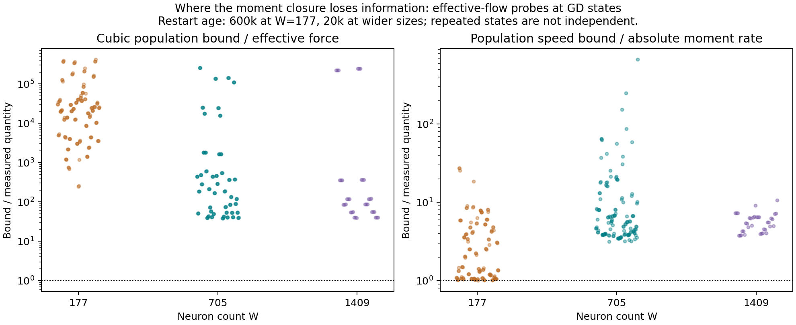
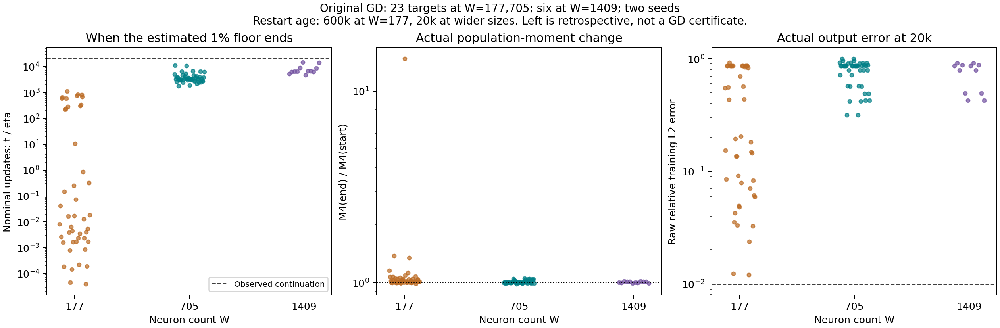
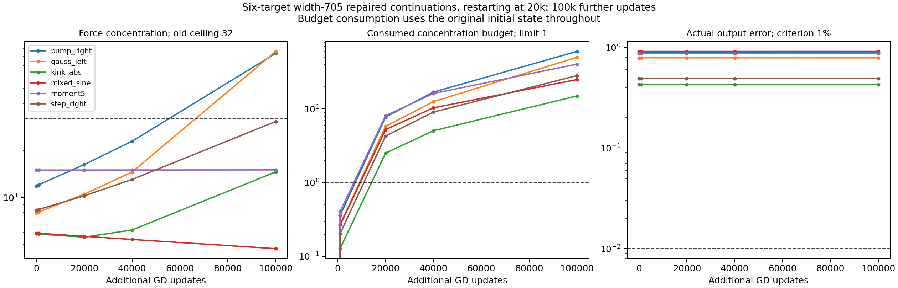

# Does accumulated concentration explain the observed persistence?

The accumulated-concentration theorem has a more realistic assumption than
an instantaneous concentration ceiling, but its present force estimate still
permits population growth much faster than we observe. Across all 23 targets
and both seeds at width 705, the estimated 1% output-error floor lasts a median
3,361 additional updates. The actual runs remain above 31.7% error after 20,000
additional updates, while their fourth population moments change by at most
5.1%. The largest measured loss of information is in the inequality bounding
effective fine force from the population moment.

These are retrospective calculations using saved **ordinary-GD** states.
The theorem concerns **exact effective flow**. Neither interpolation between
saved states nor the transfer from effective flow to GD has been certified.
The results locate the weakness of the current bound; they do not establish
a new guaranteed training horizon.

**Notation.** All norms and output errors use the archived training measure.

| Symbol | Meaning |
|---|---|
| $W$ | Number of hidden neurons; distinct from the construction's resolution parameter. |
| $p_j=(a_j,b_j,c_j)$ | Slope, offset, and readout of neuron $j$ in $f_\theta(x)=d+\sum_jc_j\tanh(a_jx+b_j)$. |
| $F$, $R$ | Effective fine gradient, including compensating coarse response, and tracking gradient; the full gradient is $F+R$. |
| $Y=\|e_H\|$ | Norm of the residual after projecting away constant and linear output. |
| $M_4=W\sum_j\lvert p_j\rvert^4$, $q=M_4^{1/4}$ | Fourth population moment and its fourth root; output bias $d$ is excluded. |
| $I_F$ | Concentration of effective-force energy across hidden neurons, defined below. |
| $\lambda_j=h\lvert a_j\rvert$ | Slope normalized by the construction spacing $h$; acquisition counters use $\lambda_j\ge0.25$. |

## 1. Start with the discrepancy we need to explain

The principal comparison uses 46 original GD continuations at width 705:
23 targets, each at seeds 30 and 31. They restart after 20,000 updates and run
for another 20,000 at learning rate $\eta=0.002$. We use the attached readouts
and raw relative training error $\|f_\theta-y\|/\|y\|$ throughout. We do not
choose a favorable checkpoint or refit readouts for this comparison.

<figure>
  
  <figcaption>All 23 targets and both seeds at width 705. Brown curves connect three saved GD states; teal curves evaluate the theorem using interpolated concentration. The moment envelopes grow rapidly even though the observed population changes little. Every envelope uses its original initial state and stops when its denominator expires.</figcaption>
</figure>

The observed endpoint ratio $M_4(T)/M_4(0)$ lies between 0.9849 and 1.0503.
Relative output error lies between 0.3173 and 0.9983. Every-update counters
record **no 1% error crossing and no neuron reaching $\lambda=0.25$** in
any of these 46 continuations. Thus the failure persists throughout the
continuation, not merely at its final checkpoint.

This is the phenomenon the theorem should eventually explain. Its estimated
1% floor currently ends between 1,793 and 11,098 additional updates, with
median 3,361. These are effective-flow times divided by the archived GD
learning rate for comparison; they are not proved GD iteration bounds.

## 2. What the theorem actually uses

Exact effective flow is $\dot\theta=-F$, with
$F=\Pi J_H^*e_H$, where $J_H$ is the Jacobian of non-affine output and
$\Pi$ projects parameter directions onto the kernel of the coarse-output
Jacobian. The compensating coarse response is part of this projection.
Writing $f=\|F\|$, the two population inequalities are

$$
D^+q\le I_F^{1/4}f,\qquad
f\le\frac{3YI_F^{1/4}q^3}{W},\qquad
I_F=\frac{W\sum_j|F_j|^4}{\|F\|^4}.
$$

Set $I_F=0$ when $F=0$. The denominator otherwise includes the full parameter
force, including the output bias; the numerator sums only hidden-neuron
blocks. Concentration measures the
distribution of force, independently of its overall magnitude. The first
inequality bounds population movement; the second says that a population
with small fourth moment and distributed force has limited nonlinear drive.
Their coupling is the mechanism used in the proof.

Define the accumulated concentration and the fraction of its available
budget consumed by time $t$:

$$
\mathcal C(t)=\int_0^t\sqrt{I_F(s)}\,ds,\qquad
u(t)=\frac{6Y_0\sqrt{M_{4,0}}}{W}\mathcal C(t).
$$

For $u<1$, the theorem gives

$$
\overline M_4(t)=\frac{M_{4,0}}{(1-u(t))^2},\qquad M_4(t)\le\overline M_4(t).
$$

Its relative output-error floor is the larger of

$$
\frac{[\|P_Hy\|-(2\sqrt2/3W)\overline M_4(t)]_+}{\|y\|},\qquad
\frac{Y_0}{\|y\|}
\exp\!\left[-\frac{3(\overline M_4(t)-M_{4,0})}{4Y_0W}\right].
$$

The first limits the nonlinear output the population can produce; the second
limits how much fine residual energy the flow can dissipate. The theorem
needs initial coarse rank, whose persistence is proved separately. It does
not impose a future conditioning margin, a bound on each neuron, or a frozen
Jacobian. At $u\ge1$ this particular envelope is unavailable. That event
does not imply actual rapid population growth or output success.

## 3. How much did the relaxed assumption help?

At width 705, the median time-average of $\sqrt{I_F}$ is 2.635, with range
1.987–4.714. Using the measured integral rather than the allowance
$\mathcal C(t)\le\sqrt{32}\,t$ extends the estimated 1% floor by a median
factor **2.15** across paired trajectories. The corresponding width-1409
factor is **2.09**. Both comparisons use the same output floor and omit the
old travel-based rank restriction.

<figure>
  
  <figcaption>Width 705, all 23 targets and two seeds per target. Filled points use the measured concentration integral; open points use the fixed allowance 32. The right panel shows actual error after 20,000 further updates. The target list includes polynomial, oscillatory, localized, exponential, kink, step, rational, and mixed targets; variants within a family are not independent draws from a target distribution.</figcaption>
</figure>

This improvement mainly reflects replacing a generous fixed allowance with
the smaller measured concentration. In these width-705 branches the sampled
peak of $\sqrt{I_F}$ exceeds its time-average by a median of only 1.3%, and
at most 10.0%. Avoiding a worst observed spike therefore cannot close the
remaining duration gap in this panel. Unsampled spikes remain unbounded by
the sparse data.

Removing the former rank restriction is a separate improvement. For the
same width-705 starts, the older explicit moment comparison stopped at a
median 145 nominal updates because of its rank guard. Dropping that guard
while keeping $I_*=32$ gives a median 1% floor duration of 1,495; using the
integral gives 3,361. The 145 figure is the old explicit comparison's stopping
time, not the duration of the earlier measured-initial-force refinement.

## 4. The force inequality loses more than the population transport inequality

At each saved state we compare each inequality with its actual effective-flow
quantity, evaluated at that same GD state:

$$
\frac{3YI_F^{1/4}q^3/W}{\|F\|},\qquad
\frac{I_F^{1/4}\|F\|}{|\dot q_{\rm effective}|}.
$$

The first measures the slack in bounding force; the second measures the
slack in converting force into moment motion. At width 705 their medians
are **200.6** and **5.41**, respectively. The force ratio ranges from 38.4
to approximately 259,000. At width 1409 the corresponding medians are
103.0 and 5.49. These are summaries of repeated saved states, not independent
statistical samples.

<figure>
  
  <figcaption>Effective-flow probes at original GD states. The cubic force estimate is the larger source of slack at the medians of both wide panels. The width-177 population is much older, so this is not a controlled width-scaling experiment.</figcaption>
</figure>

There is also no universal contraction to exploit: $\dot q_{\rm effective}$
is positive at 77 of 138 saved width-705 states and 24 of 36 width-1409
states. Positive moment drift is compatible with very slow acquisition.
This is a statement about a population norm, not the sign of every slope.

**The useful refinement is to explain why the actual compensated fine
gradient uses so little of the permitted population sensitivity.** The
present force inequality combines a global cubic sensitivity estimate,
residual alignment, compensation, and Hölder's inequality. These ratios
locate their combined slack; they do not identify how much comes from each
step. Multiplying the theorem's duration by the measured factor 200 would
be unjustified without proving that the relevant structure persists.

The next aggregate calculation should separate those sources using residual
loading and compensated output sensitivity. A refined proof should propagate
that collective structure. Assuming a small future force, or simply assuming
the measured slack persists, would bypass the mechanistic question. Nothing
in this comparison calls for controlling every neuron individually.

## 5. Coverage and the longer continuations

<figure>
  
  <figcaption>Original branches: 46 at width 177, 46 at width 705, and 12 at width 1409. Width 177 restarts at age 600,000; the wider populations restart at 20,000. All continue for another 20,000 updates. The first panel evaluates an effective-flow formula retrospectively; the other panels measure GD.</figcaption>
</figure>

At width 1409, the six-target panel has a median estimated 1% floor duration
of 6,670 updates, range 4,686–14,600. Its observed fourth-moment ratio lies
between 0.9922 and 1.0163, and final error between 42.8% and 91.3%. The
every-update counters again record no 1% success and no $\lambda=0.25$
acquisition. None of the original branches at any width retains a defined
moment envelope through the full 20,000-update continuation.

The old width-177 states are outside the small-moment regime in many cases:
their initial $M_4$ has median approximately 64,167, compared with 54.1 at
width 705. Their often sub-update estimated floor durations are consequently
uninformative. The older and wider panels should not be pooled into a width
law.

<figure>
  
  <figcaption>Six prespecified width-705 targets, one seed each, after initial coarse repair and 100,000 further ordinary-GD updates. The right bump and left Gaussian cross concentration 32, but every initial moment budget expires much earlier. All six retain more than 42.7% relative output error.</figcaption>
</figure>

The long branches consume between 15.0 and 60.4 times their initial
denominator budget by 100,000 updates. None reaches 1% raw training error or
$\lambda=0.25$ at any recorded update. Accumulating concentration removes
the artificial significance of crossing 32, but **does not make the current
envelope cover these longer runs**.

The full post-processing includes all 1,170 available continuation branches:
40 natural continuations and 1,130 intervention/control branches. The latter
include geometry multipliers 3.2, 10, 32, and 100, two readout references,
long extensions, and half-step controls. They are not 1,170 independent
initializations. All trajectory rows were finite; none was excluded. Large
injections have very large initial moments and are outside the regime where
this small-moment bound is useful, even when their force is distributed.
For example, 11 of 46 width-705 endpoints with 100-fold geometry and the
inverse readout reference achieve less than 1% error. The bound does not
establish an optimizer-wide impossibility of fitting these targets.

## 6. What is verified, and what remains conditional

The computation integrates $\sqrt{I_F}$ by trapezoidal quadrature in physical
time $t=\eta n$ and solves for threshold times inside that interpolant. Main
intervention branches have only three force audits, at 0, 1,000, and 20,000
additional updates. Long branches have five. The forty natural continuations
have eight audits; reducing those to the three main times changes the clock
by at most 0.569% at width 705 and 0.112% at width 1409. The broader early
width-177 subset reaches 3.61%. This tests sensitivity to available sampling;
it does not certify quadrature error or exclude missed excursions. The more
densely saved motion/error summaries lack $I_F$ and cannot fill this gap.

Where the envelope is defined, no sampled original-GD state violates its
moment bound or output floor within the diagnostic tolerance $10^{-10}$.
Most later states are outside the envelope's domain; agreement at the early
saved states is a limited consistency check.

Tracking's sampled accumulated absolute contribution to fine-error energy,
divided by the sampled integral of $\|F\|^2$, has median $1.20\times10^{-4}$
and maximum $6.30\times10^{-4}$ at width 705. At width 1409 these are
$1.31\times10^{-4}$ and $2.03\times10^{-4}$. This supports the effective-flow
reduction in the audited regime. It does not bound tracking's population
transport or finite-GD-step effects, both of which remain necessary for a
GD certificate. No new Adam calculation was performed.

Eleven analytical tests passed remotely. They cover irregular-time
quadrature, threshold inversion, recovery of the constant-concentration
formula, an independent integral of the squared force envelope, output
floors at three tolerances, equal-integral spike histories, width scaling,
and stopping at the denominator singularity. They verify the post-processing
formulas, not the archived training solver or the complete theorem proof.

## Reproducibility

This follow-up used Modal CPU at the user's instruction because Runpod was
unavailable; the original campaign protocol remains a historical record.
Only three cached CSV files, the helper, its tests, and the Modal wrapper were
uploaded. No parameter checkpoint archive was opened. The remote hard memory
limit was 4 GiB; the final run's peak child-process resident memory was
260.4 MiB. Downloaded artifacts were 2.41 MB compressed. Both numerical
tests and analysis ran remotely.

The [execution record](execution.json) contains source hashes, exact commands,
package versions, memory use, and test output. [Facts](facts.json) contains
cohort summaries; [trajectories](trajectories.csv) and [states](states.csv)
contain the derived measurements and original checkpoint hashes. Missing
post-expiry bounds are blank, not zero. The final Modal run was
`ap-69wDqExAjcq0A2hyGRIONp`; helper and test code are committed in `c25e71a`.

To rerun from the repository root, choose a new output directory:

```sh
.venv-modal/bin/modal run experiments/expD34_readout_race/population_accumulated_modal.py --output /path/to/new/evidence
```
