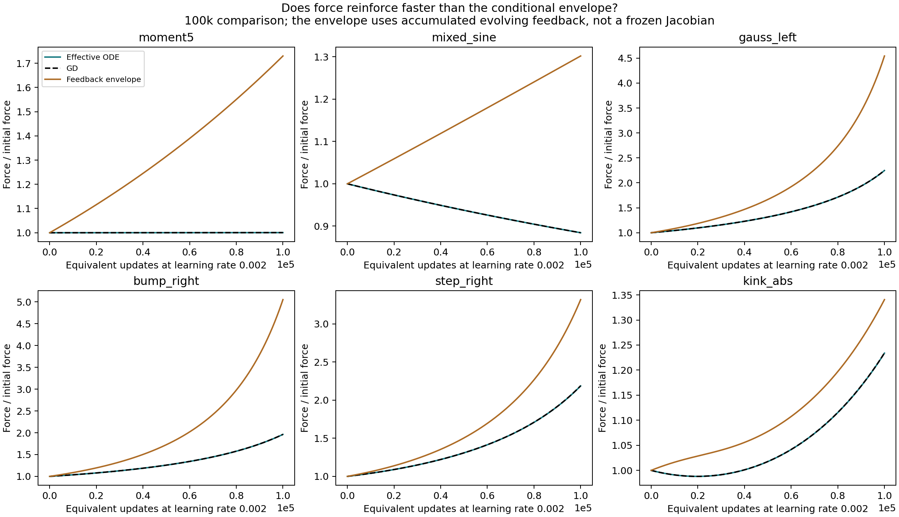
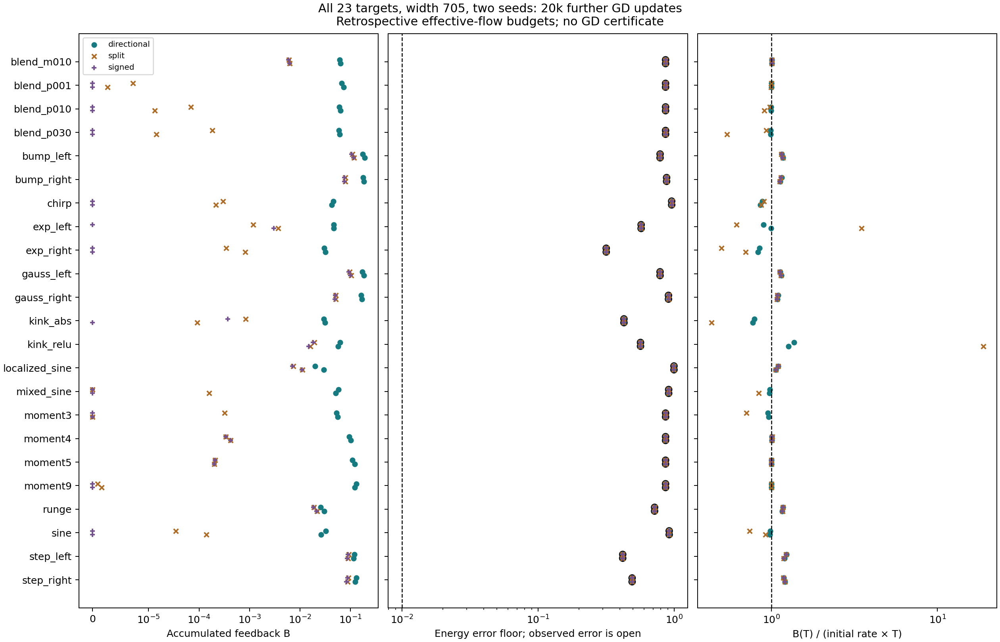
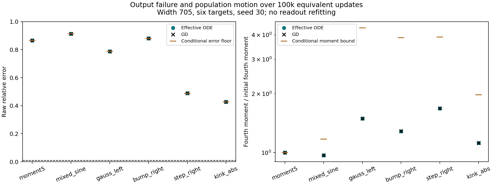
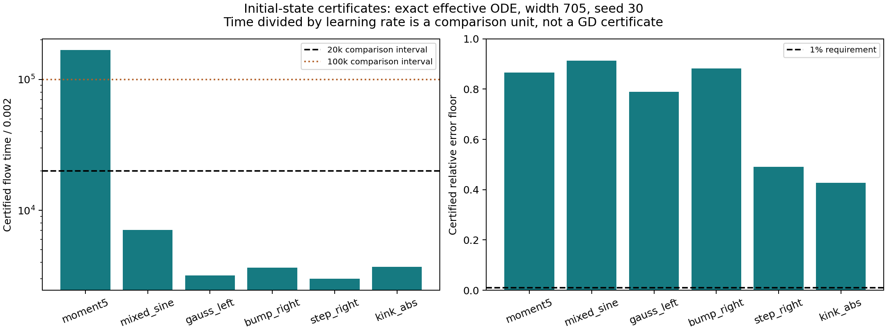
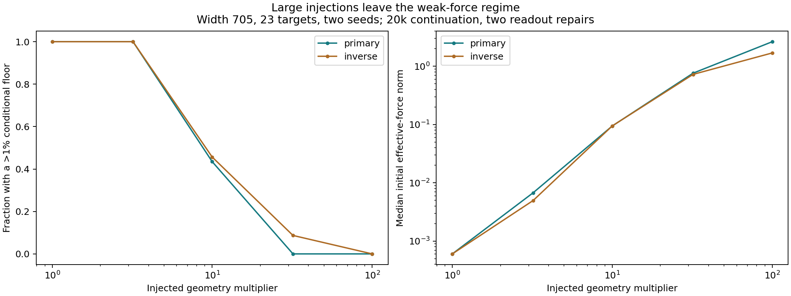

# Why weak effective force can persist: theorem, tests, and certificates

The useful refinement is to retain the actual initial effective fine force
and control how quickly the evolving population can reinforce it. The new
conditional bound remains informative on all 46 width-705 baseline runs,
covering 23 targets. Fresh integrations also support it over 100k additional
updates on six diverse targets, with negligible changes in the conclusion
when measured tracking effects are included.

We have also proved and numerically certified an initial-data persistence
result for the exact effective ODE. Its duration is useful on the degree-five
checkpoint and shorter on the other five targets. Thus the mechanism has a
closed ODE proof, but the present sufficient constants do not yet explain
the whole observed duration broadly. The conditional theorem, empirical
premise checks, and initial-data certificates are separate results.

**Notation and scope.** Norms use the empirical training measure; parameter
norms are Euclidean. Output error always uses the network's attached readouts.

| Symbol | Meaning |
|---|---|
| $F$, $R$ | Effective fine gradient, including coarse compensation, and tracking gradient; the full gradient is $F+R$. |
| $f=\|F\|$, $Y=\|e_H\|$ | Effective-force norm and non-affine output-error norm. |
| $\mathcal B(t)$ | Accumulated upper bound on reinforcing curvature feedback; plot and data label `B`. |
| $M_4=W\sum_j|(a_j,b_j,c_j)|^4$ | Fourth population moment, with $W$ the neuron count. |
| $I_F$, $\mathcal C(t)$ | Force-energy concentration and its accumulated square root. |
| $\lambda_j=h|a_j|$ | Normalized slope; here $h=2/512$ at $W=705$. |
| $t=\eta n$ | Flow-time comparison with $n$ GD updates and learning rate $\eta$; not an identification of the two dynamics. |

## 1. The example the theorem must explain

Consider the step target, starting from its 20k-update checkpoint. Over a
further 100k GD updates, effective force grows from $0.00163$ to $0.00356$.
Relative output error only falls from about 49.19% to 48.97%. Its fourth
population moment grows by about 68%. There is motion and reinforcement,
but neither is enough to approach the 1% output requirement.

<figure>
  
  <figcaption>Width 705, seed 30, six targets, all restarted at age 20k. Solid teal curves integrate the exact effective ODE; black dashed curves are ordinary GD at learning rate 0.002. Brown curves retain the initial force and use accumulated directional feedback along the evolving effective trajectory. Each panel normalizes by its own initial force. The curves are numerical evidence, not interval enclosures.</figcaption>
</figure>

The other targets show why universal contraction is the wrong requirement.
Mixed-sine force decreases, degree-five force barely changes, and Gaussian
and bump forces increase. All remain inaccurate. The proposed mechanism
must allow these different signs while limiting the amount of useful
reinforcement over the chosen interval.

The audited intervals are 20k and 100k **additional** updates after the
post-transient checkpoint. They are available comparison budgets, not
universal acquisition barriers. This study makes no claim about persistence
for millions of updates.

## 2. A conditional theorem that retains the observed weak coupling

For $f_\theta(x)=d+\sum_jc_j\tanh(a_jx+b_j)$, project residual output onto
constant and linear functions and their orthogonal complement. Let $J_C$
and $J_H$ be the corresponding output Jacobians. Define

$$
\Pi=I-J_C^*(J_CJ_C^*)^{-1}J_C,\qquad
F=\Pi J_H^*e_H,\qquad
\ell=(J_CJ_C^*)^{-1}J_CJ_H^*e_H.
$$

The projection includes the compensating coarse response. It does not remove
that response when we study effective flow $\dot\theta=-F$. It removes
the separate tracking gradient $R$; Section 4 tests that reduction.

At nonzero force put $v=F/f$. The exact force identity is

$$
\frac{d}{dt}\log f
=-\|J_Hv\|^2
-\langle e_H,D^2e_H[v,v]\rangle
+\ell\cdot D^2e_C[v,v].
$$

The first term is residual relaxation: moving down the residual gradient
removes some of the residual that supplies the force. The last two terms
describe changes in sensitivity and compensating response as the population
moves. A bound that needs no favorable signs is

$$
d_{\rm dir}=Y\|D^2e_H[v,v]\|+|\ell|\|D^2e_C[v,v]\|.
$$

This measures a whole-population response in a unit direction. It does not
assume that future force amplitude is small. Suppose its accumulated value
is bounded by $\mathcal B(t)$. Put

$$
H(t)=\int_0^t e^{2\mathcal B(s)}ds.
$$

**Theorem 14 gives**

$$
f(t)\le f_0e^{\mathcal B(t)},\qquad
\frac{\|f_{\theta(t)}-y\|}{\|y\|}
\ge\frac{\sqrt{[Y_0^2-2f_0^2H(t)]_+}}{\|y\|}.
$$

The proof integrates the force identity and then the exact energy law
$dY^2/dt=-2f^2$. It never replaces the evolving Jacobian by its initial
value. The energy conclusion needs no concentration hypothesis.

Population acquisition remains part of the conclusion. Define
$I_F=W\sum_j|F_j|^4/f^4$, with hidden-neuron blocks in the numerator and
the full parameter force in the denominator, and
$\mathcal C(t)=\int_0^t\sqrt{I_F}\,ds$. Then, with
$L_4=f_0\sqrt{\mathcal C H}$,

$$
M_4(t)^{1/4}\le M_4(0)^{1/4}+L_4(t),\qquad
p_{\rm ever}(t)\le p_0+
\frac{h^4L_4(t)^4}{W^2(\lambda_*-\lambda_0)^4}.
$$

Here $p_0$ is the initial fraction above $\lambda_0<\lambda_*$ and
$p_{\rm ever}$ counts neurons that have reached $\lambda_*$ at any earlier
time. This counts population acquisition without requiring a bound on every
neuron or on the maximum concentration over the interval.

## 3. Do the structural assumptions hold broadly enough to be informative?

The archive audit includes 1,170 branches and 3,770 scalar states. Its main
balanced baseline consists of 23 targets and two seeds at width 705. It
includes polynomials, sinusoidal and chirped functions, localized bumps and
Gaussians, exponentials, kinks, steps, a rational target, and mixtures. Some
are related variants; these are not independent draws from a distribution
of all possible targets.

<figure>
  
  <figcaption>All 46 original width-705 branches, 20k further GD updates. Teal uses directional curvature magnitudes; brown retains separate positive parts of geometry and compensation; purple retains their signed sum. Open circles show actual endpoint error. Signed zero feedback is shown at zero on a symmetric-log axis; ratios with zero initial rate are omitted. These are retrospective effective-flow formulas evaluated at GD states, with interpolation between sparse samples.</figcaption>
</figure>

The directional accumulated feedback ranges from 0.0197 to 0.1890, median
0.0615. All 46 computed energy floors exceed 1%. The smallest ratio of floor
to actual endpoint error is 0.999956. The moment envelope permits a median
5.92% increase and at most 21.6%; actual increases are at most 5.03%.
Dropping favorable signs already suffices in this wide, early regime.

We also tested specified initial-rate allowances
$\mathcal B(t)=\alpha d_{\rm dir}(0)t$, for $\alpha=1,2,4,8$.
The factor-two premise covers every saved prefix of every baseline branch,
and its resulting error floors all remain above 1%. The largest required
factor at a saved prefix is 1.367. In the six archived 100k continuations,
factor two covers only three branches, while factor four covers all six.
The premise is therefore finite-interval and permits growth; treating the
initial rate as a permanent ceiling is unsupported.

The width-1409 baseline also passes the factor-two check on all twelve
branches. At width 177 and age 600k, the unsigned directional floor is
useful on 45 of 46 branches; retaining signed cancellation makes it useful
on all 46. Different restart ages prevent treating these numbers as a
controlled width-scaling experiment.

These are assumption checks, not certificates between checkpoints. Also,
the near coincidence of error floors and measured errors reflects very
little error reduction. It is not a precise forecast of the much smaller
amount of progress within that interval.

## 4. Fresh integrations test the reduction and the sampling gap

We restarted the same six archived width-705, seed-30 states: degree five,
mixed sine, left Gaussian, right bump, right step, and absolute-value kink.
For each, we integrated effective flow with RK4 steps 0.02 and 0.01 and
ordinary GD with steps 0.002 and 0.001. Each comparison uses the same physical
duration, first $t=40$ and then $t=200$. The latter corresponds to 100k
updates for GD at 0.002 and 200k smaller updates for its refinement control.
No target, readout, or initial parameter was refitted for these runs.

<figure>
  
  <figcaption>Six matched restarts through flow time 200. Every effective-flow energy floor remains above 42.7%; the actual populations can change appreciably while error stays large. The moment bounds use sampled accumulated concentration and feedback. Their usefulness does not require exact prediction of each moment trace.</figcaption>
</figure>

At the longer endpoint, GD with the smaller step and effective flow differ
in raw relative error by at most $1.72\times10^{-6}$, and in full parameter
norm by at most $6.65\times10^{-4}$. These are small discrepancies for the
1% output decision. They do not prove equality of the dynamics.

Tracking was also measured in the terms required by Proposition 15:
$\|DF[R]\|$, its hidden-block transport, and
$[\langle e_H,J_HR\rangle]_+$. On the 100k GD paths, the accumulated
derivative loading is at most 0.0993% of the initial effective force.
Including these sampled tracking terms lowers the conditional relative-error
floor by at most $4.16\times10^{-6}$. Thus dropping tracking is supported
for these output and persistence questions, beyond a comparison of slope
components alone.

The force identity agrees with automatic differentiation to below
$5.3\times10^{-18}$ in its normalized rate. Effective flow preserves coarse
output to below $1.9\times10^{-15}$. Halving its RK4 step changes endpoint
parameters by at most $2.4\times10^{-14}$; the test is already near numerical
precision. Halving the GD step changes endpoint parameters by at most
$1.98\times10^{-6}$ at $t=200$. Thinning the feedback samples from every
one to every two flow-time units changes the accumulated budget by at most
$4.62\times10^{-5}$. These checks support the numerical interpretation;
they are not outward-rounded path validation.

For discrete GD, Proposition 15 also requires the within-step defect
$g(\theta_n)-g(\theta(t))$. The refinement comparison tests its practical
effect but does not certify that disturbance integral. A rigorous GD
transfer remains separate from the effective-ODE certificate below.

## 5. Proving that the coupling itself cannot change too quickly

An initial small force is not enough by itself. We need a reason it cannot
immediately reinforce. Theorem 16 supplies such a reason using the
residual-loaded curvature

$$
\mathscr H=\langle e_H-Q_C\ell,D^2f_\theta\rangle,
$$

where $Q_C\ell$ is the affine output with coefficients $\ell$. This operator
keeps the current residual and compensation inside the curvature integral.
Its initial Frobenius norm $\chi_0$ is an aggregate statistic, not a
largest-neuron constraint.

Let $A(t)=\int_0^t f(s)ds$ be total parameter travel. Bounds on tanh's
derivatives, population norms, and coarse conditioning give an explicit
initial-data constant $L_*$ on a chosen aggregate travel allowance. The
actual ODE then satisfies

$$
\|\mathscr H(t)\|\le\chi_0+L_*A(t),\qquad
\dot f\le(\chi_0+L_*A)f,\qquad \dot A=f.
$$

Integrating with respect to travel closes the feedback loop:

$$
f\le U(A):=f_0+\chi_0A+\tfrac12L_*A^2.
$$

It takes at least $\int_0^{A_*}dA/U(A)$ to accumulate travel $A_*$.
Before then,

$$
Y^2\ge\left[Y_0^2-2\left(f_0A_*+
\frac{\chi_0A_*^2}{2}+\frac{L_*A_*^3}{6}\right)\right]_+.
$$

The detailed proof gives $L_*$ explicitly and proves the coarse margin by
a first-exit argument. Thus the theorem propagates a property of the moving
ODE. It does not ask how long a frozen Taylor model predicts the parameters.

We evaluated the six initial states with 128-bit Arb arithmetic, enclosing
the initial effective force, residual, aggregate curvature, population
norms, and coarse singular value. A right-endpoint Riemann sum gives a
rigorous lower bound on the scalar comparison time. Floating-point searches
only propose travel allowances; the reported bounds are re-evaluated with
outward enclosures.

<figure>
  
  <figcaption>Exact effective-flow certificates for the empirical binary64 problem at six archived checkpoints. Degree five is certified through flow time 333.8467 with relative error at least 0.8660246. The other five times range from 5.9922 to 14.1561. Dividing time by 0.002 expresses durations in a familiar unit; it does not certify discrete GD for those update counts.</figcaption>
</figure>

The degree-five result needs no assumed future feedback budget. It is a
useful proof instance, but not evidence that the same constants explain
every target. The other intervals are only about 3k–7k update-equivalent
durations. The broad conditional evidence is much stronger than this
initial-data guarantee. The remaining quantitative loss is in the bound
on how loaded curvature changes per unit population travel.

## 6. Large perturbations show the domain of the explanation

The archived interventions multiply geometry by $3.2,10,32,100$ and repair
coarse output under two readout-reference policies. They therefore test
whether the same initial weak-coupling assumption survives much larger
scales, rather than merely repeating the baseline.

<figure>
  
  <figcaption>Width 705, 23 targets and two seeds, 20k continuations. Under primary repair the number of useful conditional floors falls from 46 at baseline and at 3.2-fold injection to 20 at tenfold and zero at 32- and 100-fold injection. All 46 tenfold and 32-fold primary endpoints still exceed 1% error: a vacuous bound does not mean training succeeds.</figcaption>
</figure>

The median initial effective force increases from $6.04\times10^{-4}$ to
2.64 under 100-fold primary injection, even though median accumulated
feedback is only 0.0297 there. Small reinforcing feedback alone cannot
explain output failure when initial force is already large. Much of the
subsequent improvement in that intervention regime is readout fitting,
as established by the frozen-geometry controls. A theorem for the residual
plateau after that fitting would need a later restart or explicit residual
subspace control; the present weak-initial-force bound does not cover it.

## 7. What is established and what remains

We have completed the three tasks: a proved finite-interval conditional
theorem with tracking and GD disturbance terms; broad archive checks plus
fresh matched-flow tests; and a closed initial-data theorem with six
outward-rounded effective-flow instances. The last step succeeds as a
proof and only partly succeeds in giving the desired duration.

The supported explanation is that weak initial residual coupling and modest
accumulated reinforcement leave too little integrated force to change the
population enough or reduce output error enough. Force need not contract,
and population moments need not remain constant. The initial-data theorem
explains one way the structure persists: strengthening the loaded curvature
requires motion supplied by the force whose growth it controls.

To extend the certified duration across targets, the next proof should retain
the aggregate residual loading when bounding the change of curvature, just
as the current proof retains it initially. Alternatively, the conditional
statement can assume an accumulated directional-feedback allowance, with
its finite-interval empirical coverage stated explicitly. Neither route
requires controlling each neuron. A rigorous ordinary-GD transfer still
needs a validated bound on tracking and within-step disturbances. Adam and
continuous-input generalization are outside these new certificates.

## Reproducibility and evidence roles

The full statements and proofs are Theorems 14 and 16 and Proposition 15 in
the [population note](../../../../../../docs/d34_population_output_persistence.md).
The plot source is
[population_feedback_findings.py](../../../../../../experiments/expD34_readout_race/population_feedback_findings.py).
Numerical files remain in the local evidence cache under the repository's
existing data-ignore convention; the report, source helpers, tests, and
figures are versioned.

The archive analysis uses `force_moment_archive/states.csv` and
`force_rotation_dilations_final/states.csv`. Results are in
`feedback_budget_final/{facts,execution}.json` and its scalar CSVs. The
initial capsule is `N512_seed30_20k.npz`, 166 KB; certificate records are
in `initial_feedback/{initial,execution}.json`. New integrations and their
hash manifests are in `feedback_flow` and `feedback_flow_100k`. Each retains
only scalar traces and initial/final parameter vectors. Summaries for this
report are in `feedback_findings/facts.json`.

All numerical work ran on Modal. CPU audits had a 4 GiB hard memory cap;
the GPU checks had an 8 GiB host-memory cap. Measured CPU child peaks were
about 192 MiB for the archive audit and 310 MiB for certificates. The two
GPU calls used about 55 and 175 seconds, with a 4.1 GiB host-memory peak.
No large checkpoint archives were loaded on the laptop. Twenty-five focused
tests passed across scalar integration, interval calculations, independent
loaded-Hessian checks, RK4 order, and gradient identities.

Modal runs: archive `ap-9ubF23C03jEkKR8E0pOAsn`; certificates
`ap-uKBTp2n7XGvneBUWYKdtsR`; 20k comparison `ap-k6UB2v0JMhlN4MJV1hhDJl`;
100k comparison `ap-l6yJ2eYH2q5dvYdYdhMGb0`; figures
`ap-tZaSNADQrZES6CpwdS3fX9`. Their execution records preserve exact source
and input hashes, commands, package versions where recorded, and outputs.
