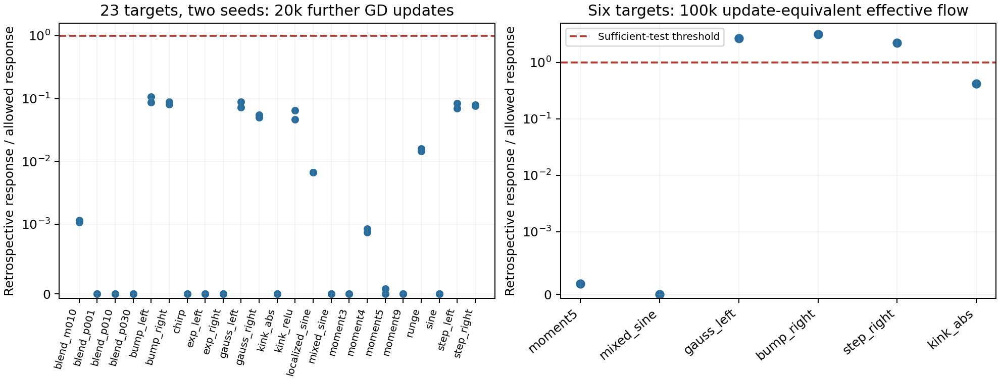

# Can limited population movement sustain weak reinforcement?

The proposed mechanism is a feedback loop: weak effective fine force permits
little population travel, limited travel produces little extra reinforcement,
and weak reinforcement preserves weak force. We now have a precise conditional
proof of this implication. This audit asks whether its sufficient condition
has useful constants on the existing trajectories.

**Result.** All 46 width-705 baseline paths across 23 targets pass the sampled
condition over 20k further updates after the 20k checkpoint. All six dense
effective-flow continuations pass over the same duration. At 100k further
update-equivalent duration, three of those six pass. The other three still
have informative output-error floors under the broader accumulated-feedback
theorem. The new criterion is a sufficient explanation of persistence with
a narrower useful interval, not a necessary condition for output failure.

## Example, condition, and prediction

The step target's effective force grows about 2.19-fold over the longer
interval while its relative output error remains about 49%. We therefore
ask how fast reinforcement can accumulate; we do not require contraction.
Write $f=\|F\|$ for effective-force magnitude, $d=d_{\rm dir}$ for the
directional upper rate of reinforcing feedback, and

$$
\mathcal B_{\rm act}(t)=\int_0^t d(s)ds,\qquad
\mathcal A_4(t)=\int_0^t I_F(s)^{1/4}f(s)ds.
$$

The population-travel quantity $\mathcal A_4$ bounds the growth of
$M_4^{1/4}$. It counts accumulated movement rather than endpoint displacement.
The structural condition is

$$
\mathcal B_{\rm act}(t)\le b_0t+K\int_0^t\mathcal A_4(s)ds,
\qquad \mathcal C(t)\le C(t).
$$

Here $b_0$ allows initial reinforcement; $K$ limits additional accumulated
reinforcement per accumulated travel. Theorem 17 in the
[population note](../../../../../../docs/d34_population_output_persistence.md)
proves, by a first-exit argument, that this feedback loop remains bounded if

$$
eKf_0\int_0^T\sqrt{C(s)\int_0^s e^{2b_0u}du}\,ds<1.
$$

It then bounds force amplification, population acquisition, and raw output
error. No per-neuron maximum, fixed Jacobian, or equilibrium is required.
The theorem assumes the structural response-to-travel relation; this audit
does not derive it from initialization.

We tested the fixed choices $b_0=d(0)$ and
$C(t)=2\sqrt{I_F(0)}t$. Define $K_{\rm crit}$ by equality in the displayed
criterion. At saved prefixes, we compute

$$
K_{\rm req}=\max_{t_i>0}
\frac{[\mathcal B_{\rm act}(t_i)-b_0t_i]_+}
{\int_0^{t_i}\mathcal A_4(s)ds}.
$$

Comparing $K_{\rm req}$ with $K_{\rm crit}$ checks whether there is room
for a useful response coefficient. Because $K_{\rm req}$ uses the evaluated
trajectory, passing is retrospective feasibility evidence, not an independent
forecast of persistence. The separate prefix test below examines limited
extrapolation.



Each dot is one path; values below the dashed line satisfy the response
part of the sampled sufficient test. The accumulated concentration condition
also passes on every displayed path. The left panel uses sparse archived GD
states; the right uses dense integrations of the effective ODE. GD results
are diagnostics of the premise, not certificates of the effective-flow
theorem or its GD disturbance corollary.

## What the audit supports

At width 705, the worst short-interval response ratio is 0.10644 across
23 targets and two seeds. At width 1409, all 12 reference paths across six
targets and two seeds pass, with worst ratio 0.01925. The separate width-177
reference group at age 600k also passes on all 46 short continuations, with
worst ratio 0.48198; its different starting age prevents treating this as a
matched width-scaling experiment.

For the six dense effective-flow paths, the worst short-interval ratio is
0.08714. Over 100k update-equivalent duration, degree five, mixed sine, and
the absolute-value kink pass. Gaussian, bump, and step give ratios 2.6661,
3.1204, and 2.2369. Concentration remains within its allowance on all six:
the worst accumulated concentration uses 83.9% of that allowance. Thus the
longer test fails because the feedback bootstrap is too restrictive, not
because a maximum-concentration assumption breaks.

The retained response coefficient itself changes fairly little for the
three longer failures. Compared with its first-20k estimate, its required
value grows by factors 1.184, 1.131, and 1.002 for Gaussian, bump, and step.
The duration-dependent loop criterion can therefore expire even when the
proposed structural relation remains reasonably stable. That expiration
does not show rapid acquisition or contradict the existing output theorem.

The prefix extrapolation test is also informative. A coefficient fitted on
only the first 20k further updates, then doubled, covers the sampled longer
response on five of six targets. The kink fails: its early excess over
$b_0t$ is zero, while later excess is positive. Multiplying its zero fitted
coefficient by two or four still predicts zero. A general predictive premise
needs an independently justified allowance for later reinforcement; early
observations alone do not supply it.

The effective-flow result is unchanged on halving the integrator step from
0.02 to 0.01. Matched GD at learning rates 0.002 and 0.001 gives the same
pass/fail classification; its worst longer ratio is about 3.1210. These
checks test numerical stability and consistency with GD, not interval
certification or transfer to Adam.

## Reproduction and limits

The audit uses cached scalar CSVs only. Feedback and concentration are
integrated as piecewise-linear sampled quantities. Population speed is also
piecewise linear; both its integral and the integral of that travel are
evaluated exactly for that interpolant. Scalar quadrature evaluates the
initial-data threshold. None of these operations encloses unsampled network
behavior. Dense paths contain 201 states per trajectory; short broad paths
have only three. Cross-target breadth and dense temporal coverage therefore
provide different kinds of evidence.

Run on Modal with a fresh local output directory:

```bash
.venv-modal/bin/modal run experiments/expD34_readout_race/population_accumulated_modal.py --study loop --output <new-output-directory>
```

The analysis helper is
[population_feedback_loop.py](../../../../../../experiments/expD34_readout_race/population_feedback_loop.py).
The inputs are `force_moment_archive/states.csv`,
`force_rotation_dilations_final/states.csv`, `feedback_flow/states.csv`, and
`feedback_flow_100k/states.csv`. Only original reference branches are retained
from the archives; the other interventions remain covered by the earlier
feedback study. The cached outputs are `branches.csv`, `facts.json`, and
`execution.json`; the latter records input/source hashes and exact commands.

The final Modal run was `ap-6NF5fRmDqCFKhv8SLmtIKk`. Twenty-three focused
tests passed, including four new checks of travel integration, the analytic
zero-baseline threshold, constant feedback, and changing feedback response.
The numerical subprocess peak was about 202 MiB under a 4 GiB hard cap.
No parameter archives were loaded locally and no new training was run.

The implication in Theorem 17 is proved. Its response-to-travel premise is
checked empirically over the stated intervals; a uniform invariant-region
result is not claimed. The paper's main result is the broader conditional
theorem after the tracking transient, together with evidence that its
conditions remain satisfied for long intervals. Forecasts and perturbations
test that explanation. Deriving persistence from a checkpoint alone is
outside the current objective.
